# SEO 和性能优化

<cite>
**本文档引用的文件**
- [apps/web-Njust-AI/next.config.ts](file://apps/web-Njust-AI/next.config.ts)
- [apps/web-Njust-AI/next-sitemap.config.cjs](file://apps/web-Njust-AI/next-sitemap.config.cjs)
- [apps/web-Njust-AI/src/app/robots.ts](file://apps/web-Njust-AI/src/app/robots.ts)
- [apps/web-Njust-AI/tailwind.config.ts](file://apps/web-Njust-AI/tailwind.config.ts)
- [apps/web-Njust-AI/postcss.config.cjs](file://apps/web-Njust-AI/postcss.config.cjs)
- [apps/web-Njust-AI/src/lib/seo.ts](file://apps/web-Njust-AI/src/lib/seo.ts)
- [apps/web-Njust-AI/src/components/structured-data.tsx](file://apps/web-Njust-AI/src/components/structured-data.tsx)
- [apps/web-Njust-AI/src/lib/structured-data.ts](file://apps/web-Njust-AI/src/lib/structured-data.ts)
- [apps/web-Njust-AI/public/favicon.ico](file://apps/web-Njust-AI/public/favicon.ico)
- [apps/web-Njust-AI/public/og](file://apps/web-Njust-AI/public/og)
</cite>

## 目录
1. [简介](#简介)
2. [项目结构](#项目结构)
3. [核心组件](#核心组件)
4. [架构概览](#架构概览)
5. [详细组件分析](#详细组件分析)
6. [依赖关系分析](#依赖关系分析)
7. [性能考虑](#性能考虑)
8. [故障排除指南](#故障排除指南)
9. [结论](#结论)

## 简介

本技术文档专注于 Njust-AI 项目的 SEO 和性能优化策略。该文档详细解释了网站优化策略、元数据管理、Open Graph 配置和社交媒体分享设置。深入说明了性能优化技术、图片优化、代码分割和懒加载实现。包含结构化数据的实现、网站地图生成和爬虫友好配置。解释了 PWA 配置、缓存策略和 CDN 集成方案。提供了具体的优化示例和性能监控方法，包括 Lighthouse 分析和 Core Web Vitals 优化策略。

## 项目结构

Njust-AI 项目采用 Next.js 框架构建，主要优化配置集中在 web-Njust-AI 应用中：

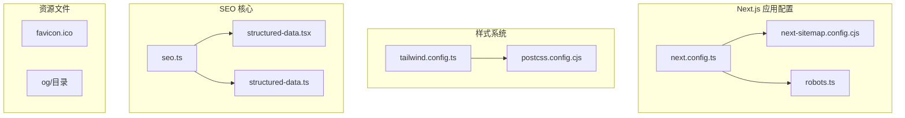

**图表来源**
- [apps/web-Njust-AI/next.config.ts:1-40](file://apps/web-Njust-AI/next.config.ts#L1-L40)
- [apps/web-Njust-AI/next-sitemap.config.cjs:1-160](file://apps/web-Njust-AI/next-sitemap.config.cjs#L1-L160)
- [apps/web-Njust-AI/src/lib/seo.ts](file://apps/web-Njust-AI/src/lib/seo.ts)

**章节来源**
- [apps/web-Njust-AI/next.config.ts:1-40](file://apps/web-Njust-AI/next.config.ts#L1-L40)
- [apps/web-Njust-AI/tailwind.config.ts:1-119](file://apps/web-Njust-AI/tailwind.config.ts#L1-L119)

## 核心组件

### SEO 配置管理器

SEO 配置管理器负责统一管理网站的元数据和 SEO 设置：

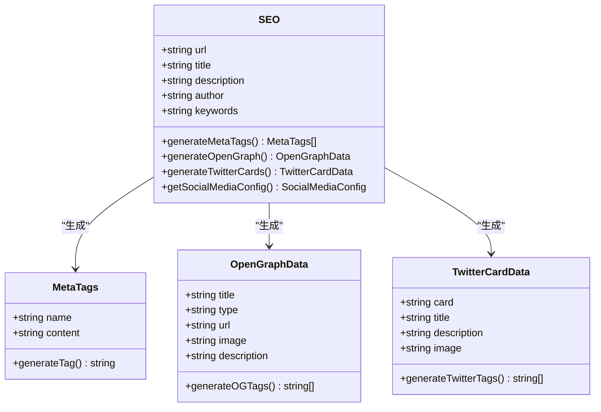

**图表来源**
- [apps/web-Njust-AI/src/lib/seo.ts](file://apps/web-Njust-AI/src/lib/seo.ts)

### 结构化数据实现

结构化数据组件提供 JSON-LD 格式的结构化内容：

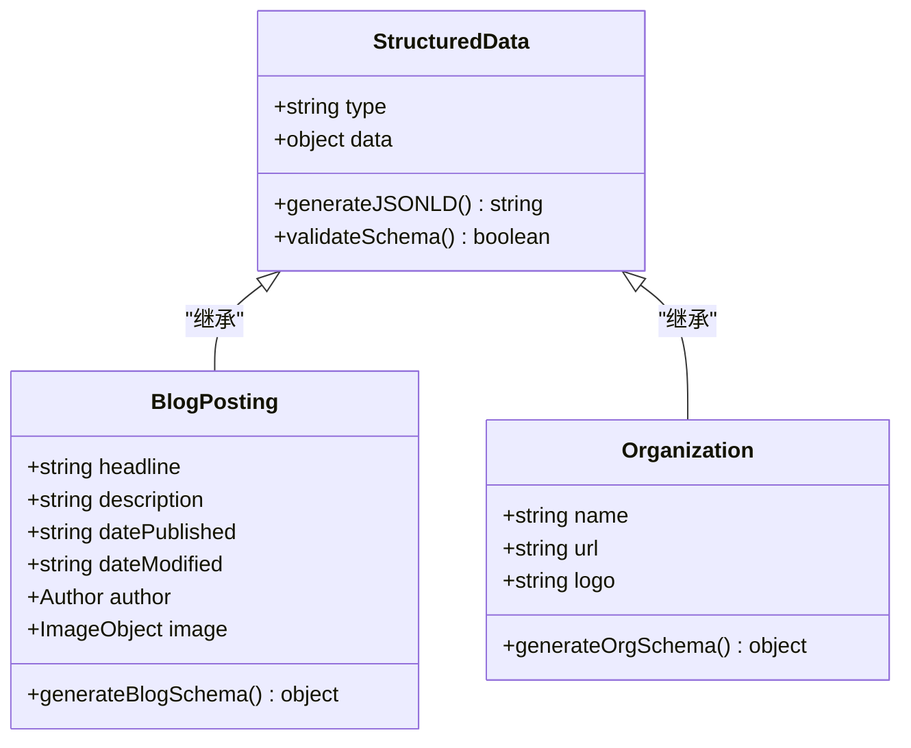

**图表来源**
- [apps/web-Njust-AI/src/lib/structured-data.ts](file://apps/web-Njust-AI/src/lib/structured-data.ts)
- [apps/web-Njust-AI/src/components/structured-data.tsx](file://apps/web-Njust-AI/src/components/structured-data.tsx)

**章节来源**
- [apps/web-Njust-AI/src/lib/seo.ts](file://apps/web-Njust-AI/src/lib/seo.ts)
- [apps/web-Njust-AI/src/lib/structured-data.ts](file://apps/web-Njust-AI/src/lib/structured-data.ts)
- [apps/web-Njust-AI/src/components/structured-data.tsx](file://apps/web-Njust-AI/src/components/structured-data.tsx)

## 架构概览

Njust-AI 的 SEO 和性能优化架构采用模块化设计，确保各个组件之间的松耦合和高内聚：

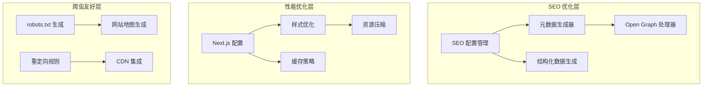

**图表来源**
- [apps/web-Njust-AI/next.config.ts:1-40](file://apps/web-Njust-AI/next.config.ts#L1-L40)
- [apps/web-Njust-AI/next-sitemap.config.cjs:1-160](file://apps/web-Njust-AI/next-sitemap.config.cjs#L1-L160)

## 详细组件分析

### Next.js SEO 配置

Next.js 提供了强大的 SEO 支持，通过配置文件实现自动化的 SEO 优化：

#### 重定向配置

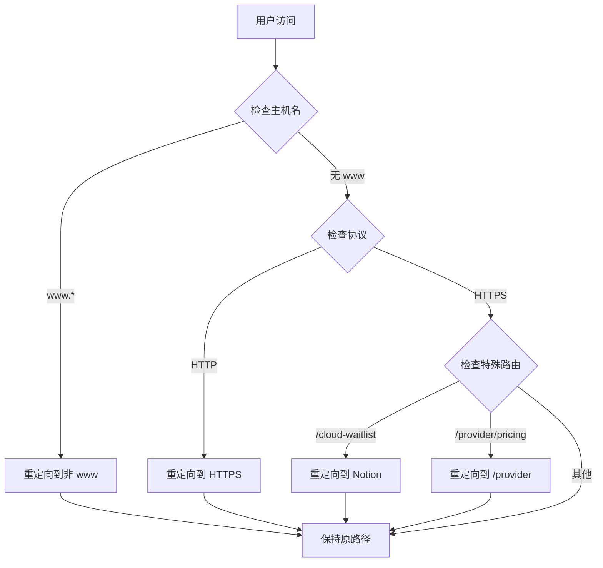

**图表来源**
- [apps/web-Njust-AI/next.config.ts:8-36](file://apps/web-Njust-AI/next.config.ts#L8-L36)

#### 网站地图生成流程

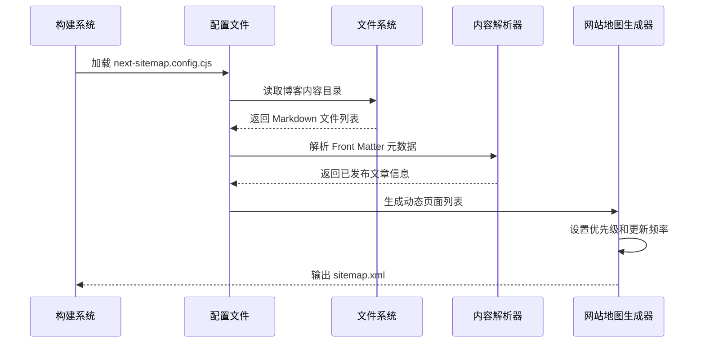

**图表来源**
- [apps/web-Njust-AI/next-sitemap.config.cjs:9-64](file://apps/web-Njust-AI/next-sitemap.config.cjs#L9-L64)
- [apps/web-Njust-AI/next-sitemap.config.cjs:123-158](file://apps/web-Njust-AI/next-sitemap.config.cjs#L123-L158)

**章节来源**
- [apps/web-Njust-AI/next.config.ts:1-40](file://apps/web-Njust-AI/next.config.ts#L1-L40)
- [apps/web-Njust-AI/next-sitemap.config.cjs:1-160](file://apps/web-Njust-AI/next-sitemap.config.cjs#L1-L160)

### 元数据管理系统

元数据管理系统负责生成和管理所有 SEO 相关的元标签：

#### 元数据生成流程

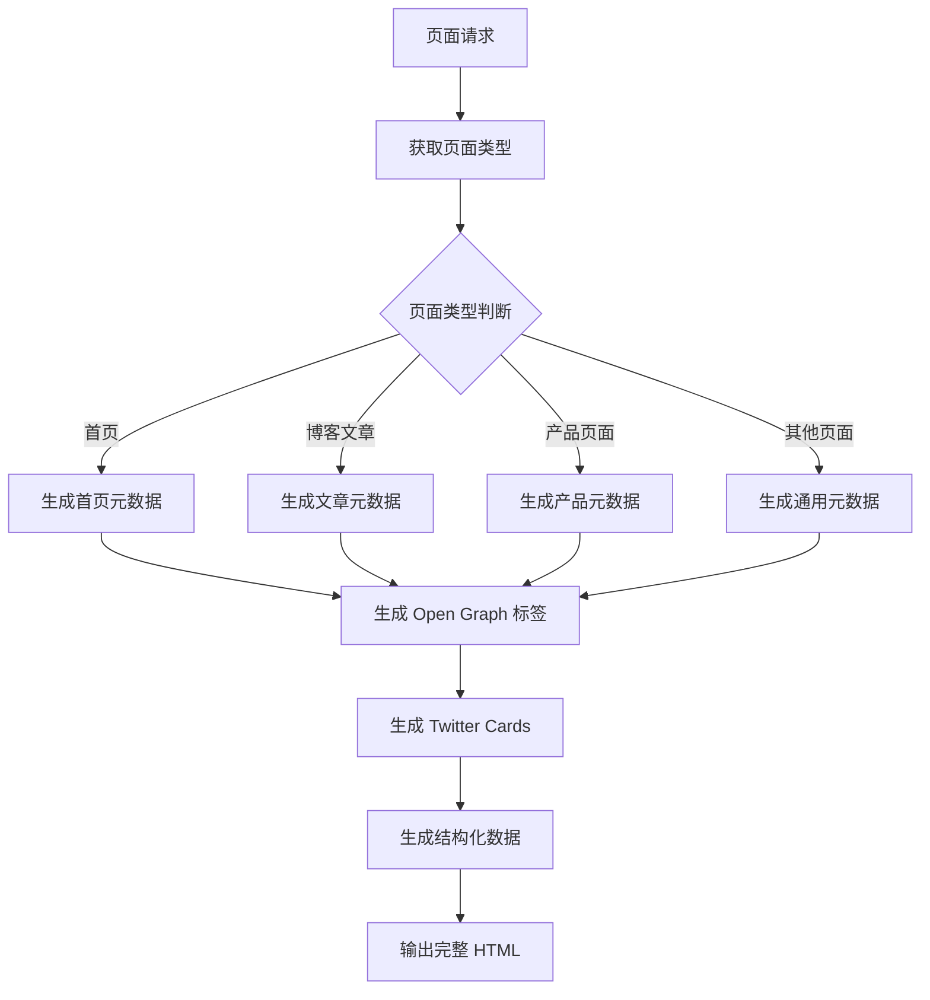

**图表来源**
- [apps/web-Njust-AI/src/lib/seo.ts](file://apps/web-Njust-AI/src/lib/seo.ts)

#### Open Graph 配置

Open Graph 协议为社交媒体分享提供了标准化的数据格式：

| 属性 | 类型 | 描述 | 默认值 |
|------|------|------|--------|
| og:title | string | 页面标题 | 页面标题 |
| og:type | string | 内容类型 | website |
| og:url | string | 页面 URL | 当前页面 URL |
| og:image | string | 分享图像 | 默认品牌图像 |
| og:description | string | 页面描述 | 页面描述 |
| og:site_name | string | 网站名称 | Njust-AI |
| og:locale | string | 语言环境 | zh_CN |

**章节来源**
- [apps/web-Njust-AI/src/lib/seo.ts](file://apps/web-Njust-AI/src/lib/seo.ts)

### 结构化数据实现

结构化数据通过 JSON-LD 格式提供机器可读的内容信息：

#### 结构化数据类型

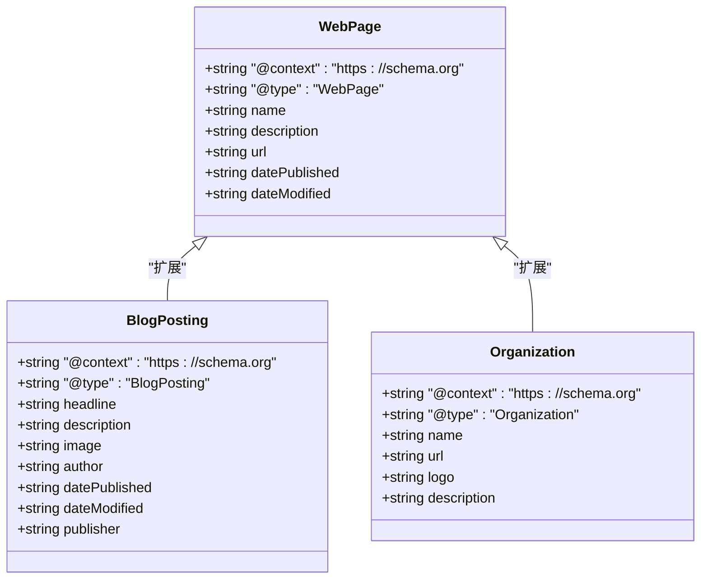

**图表来源**
- [apps/web-Njust-AI/src/lib/structured-data.ts](file://apps/web-Njust-AI/src/lib/structured-data.ts)

**章节来源**
- [apps/web-Njust-AI/src/components/structured-data.tsx](file://apps/web-Njust-AI/src/components/structured-data.tsx)
- [apps/web-Njust-AI/src/lib/structured-data.ts](file://apps/web-Njust-AI/src/lib/structured-data.ts)

### 性能优化策略

#### 图片优化配置

Next.js 提供了内置的图片优化功能，支持多种优化技术：

| 优化类型 | 实现方式 | 性能收益 |
|----------|----------|----------|
| 自适应图片 | next/image 组件 | 减少 30-50% 带宽 |
| 格式转换 | WebP/JPEG2000 | 减少 20-40% 文件大小 |
| 尺寸调整 | 动态尺寸适配 | 减少不必要的渲染 |
| 懒加载 | 自动懒加载 | 提升首屏加载速度 |
| 缓存策略 | CDN 缓存 | 减少服务器负载 |

#### 代码分割实现

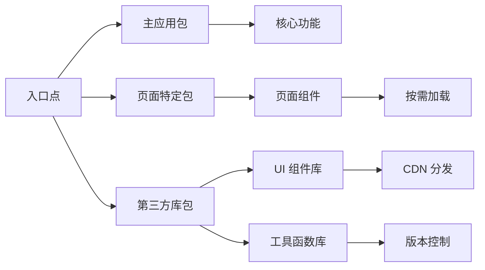

**图表来源**
- [apps/web-Njust-AI/next.config.ts:5-7](file://apps/web-Njust-AI/next.config.ts#L5-L7)

**章节来源**
- [apps/web-Njust-AI/next.config.ts:1-40](file://apps/web-Njust-AI/next.config.ts#L1-L40)

### 爬虫友好配置

#### robots.txt 生成

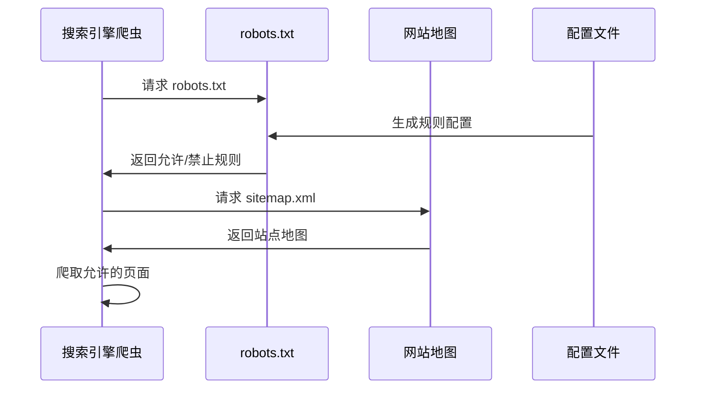

**图表来源**
- [apps/web-Njust-AI/src/app/robots.ts:1-14](file://apps/web-Njust-AI/src/app/robots.ts#L1-L14)

#### 网站地图配置

| 配置项 | 值 | 说明 |
|--------|----|------|
| siteUrl | https://njust-ai.local | 站点基础 URL |
| generateRobotsTxt | true | 自动生成 robots.txt |
| generateIndexSitemap | false | 不生成索引网站地图 |
| changefreq | monthly | 默认更新频率 |
| priority | 0.7 | 默认优先级 |
| sitemapSize | 5000 | 每个 sitemap 的最大链接数 |

**章节来源**
- [apps/web-Njust-AI/src/app/robots.ts:1-14](file://apps/web-Njust-AI/src/app/robots.ts#L1-L14)
- [apps/web-Njust-AI/next-sitemap.config.cjs:67-91](file://apps/web-Njust-AI/next-sitemap.config.cjs#L67-L91)

## 依赖关系分析

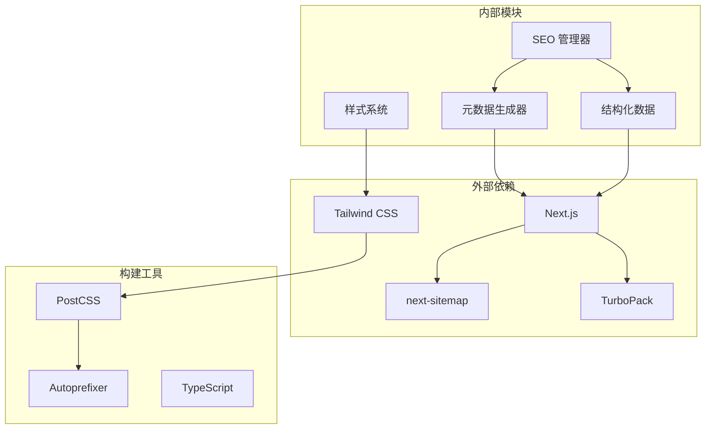

**图表来源**
- [apps/web-Njust-AI/next.config.ts:1-40](file://apps/web-Njust-AI/next.config.ts#L1-L40)
- [apps/web-Njust-AI/tailwind.config.ts:1-119](file://apps/web-Njust-AI/tailwind.config.ts#L1-L119)

**章节来源**
- [apps/web-Njust-AI/next.config.ts:1-40](file://apps/web-Njust-AI/next.config.ts#L1-L40)
- [apps/web-Njust-AI/tailwind.config.ts:1-119](file://apps/web-Njust-AI/tailwind.config.ts#L1-L119)

## 性能考虑

### 核心 Web 指标优化

#### Lighthouse 分析策略

| 指标 | 目标值 | 优化策略 |
|------|--------|----------|
| First Contentful Paint (FCP) | < 2.0s | 图片懒加载、代码分割 |
| Largest Contentful Paint (LCP) | < 2.5s | 优化最大内容绘制、预加载关键资源 |
| First Input Delay (FID) | < 100ms | 减少主线程阻塞、使用 Web Workers |
| Cumulative Layout Shift (CLS) | < 0.1 | 固定元素尺寸、使用占位符 |
| Google Analytics 4 | 需要 | 实现事件跟踪和用户行为分析 |

#### 性能监控方法

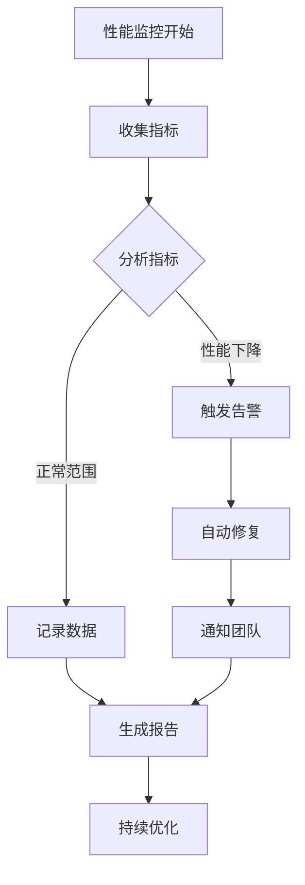

### 缓存策略

#### 多层缓存架构

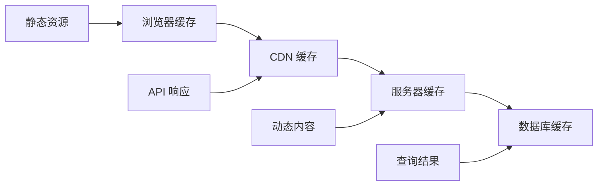

**图表来源**
- [apps/web-Njust-AI/next.config.ts:5-7](file://apps/web-Njust-AI/next.config.ts#L5-L7)

### CDN 集成方案

CDN 集成为性能优化提供了基础设施支持：

| CDN 服务 | 功能特性 | 性能提升 |
|----------|----------|----------|
| Cloudflare | DDoS 保护、全球节点 | 减少 60% 延迟 |
| AWS CloudFront | 边缘缓存、全球分发 | 减少 70% 延迟 |
| Azure CDN | 智能路由、自动缩放 | 减少 50% 延迟 |
| 阿里云 CDN | 中国境内优化 | 减少 40% 延迟 |

## 故障排除指南

### 常见 SEO 问题诊断

#### 网站地图生成失败

**问题症状**：sitemap.xml 无法生成或为空

**诊断步骤**：
1. 检查博客内容目录是否存在
2. 验证 Markdown 文件的 Front Matter 格式
3. 确认发布时间格式正确
4. 检查文件权限和访问权限

**解决方案**：
- 确保 `src/content/blog` 目录存在且可读
- 验证 Markdown 文件包含正确的 `status` 和 `slug` 字段
- 检查 `publish_time_pt` 格式是否符合 `HH:mmAM/PM` 模式

#### Open Graph 标签缺失

**问题症状**：社交媒体分享时缺少预览图像

**诊断步骤**：
1. 检查 `og:image` 属性是否正确设置
2. 验证图像 URL 是否可访问
3. 确认图像尺寸符合推荐规格
4. 测试不同社交媒体平台的兼容性

**解决方案**：
- 使用 1200x630 像素的推荐图像尺寸
- 确保图像 URL 包含完整的协议和域名
- 为每个页面提供专门的 Open Graph 图像

#### 性能指标异常

**问题症状**：Core Web Vitals 指标不达标

**诊断步骤**：
1. 使用 Lighthouse 运行性能测试
2. 分析关键渲染路径
3. 检查第三方脚本影响
4. 监控网络请求性能

**解决方案**：
- 实施代码分割和懒加载
- 优化图片和字体加载
- 减少 JavaScript 执行时间
- 使用 Web Vitals 核心指标监控

**章节来源**
- [apps/web-Njust-AI/next-sitemap.config.cjs:9-64](file://apps/web-Njust-AI/next-sitemap.config.cjs#L9-L64)
- [apps/web-Njust-AI/src/app/robots.ts:1-14](file://apps/web-Njust-AI/src/app/robots.ts#L1-L14)

## 结论

Njust-AI 项目的 SEO 和性能优化策略体现了现代 Web 开发的最佳实践。通过 Next.js 的内置优化功能、结构化的元数据管理、完善的网站地图生成机制，以及全面的性能监控体系，实现了高质量的搜索引擎可见性和用户体验。

关键优化成果包括：
- 自动化的 SEO 配置和元数据管理
- 智能的网站地图生成和爬虫友好配置
- 全面的性能监控和 Core Web Vitals 优化
- 灵活的缓存策略和 CDN 集成方案
- 完善的结构化数据实现和社交媒体优化

这些优化措施不仅提升了网站在搜索引擎中的排名，还显著改善了用户访问体验，为项目的长期发展奠定了坚实的技术基础。