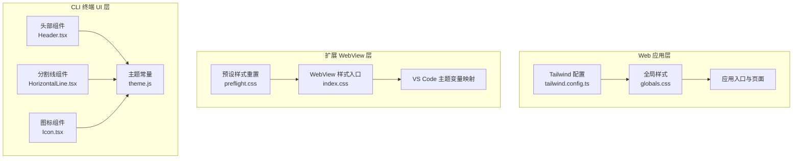
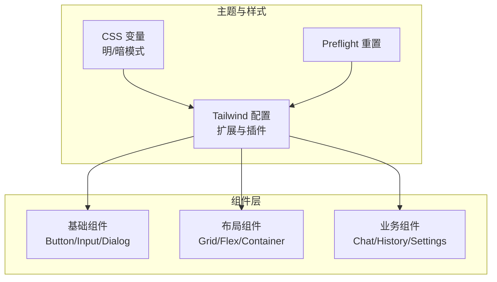
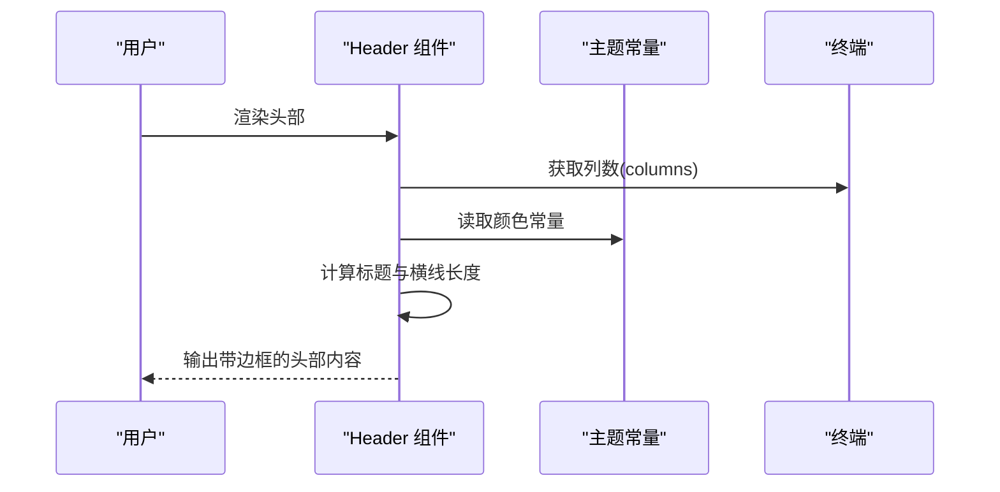
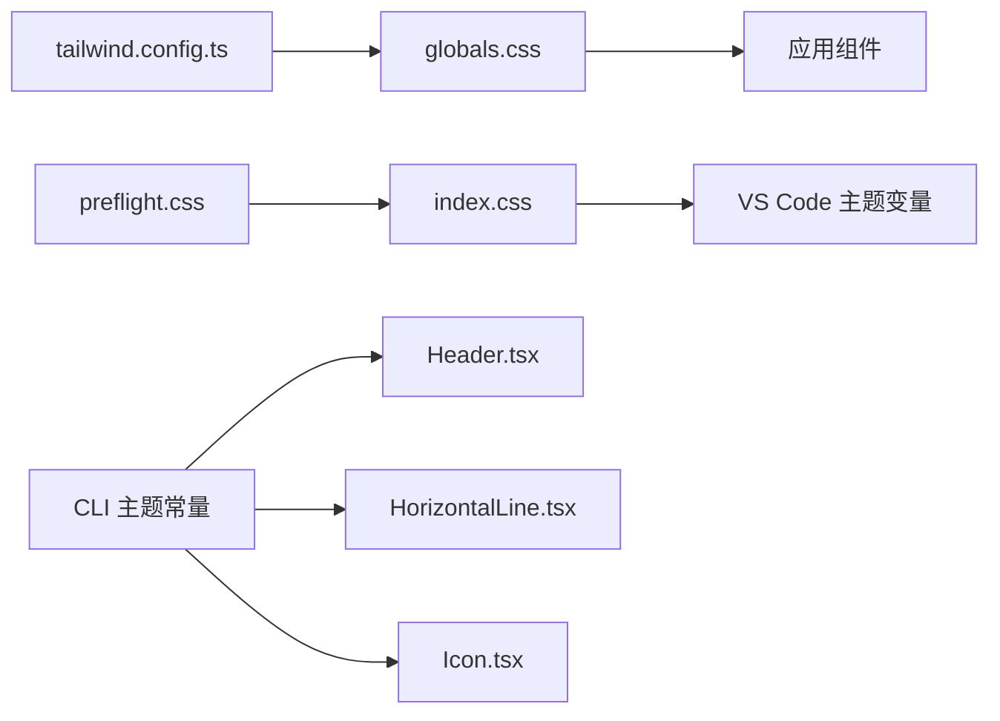

# UI 组件系统

<cite>
**本文档引用的文件**
- [tailwind.config.ts](file://apps/web-Njust-AI/tailwind.config.ts)
- [globals.css](file://apps/web-Njust-AI/src/app/globals.css)
- [index.css](file://webview-ui/src/index.css)
- [preflight.css](file://webview-ui/src/preflight.css)
- [Header.tsx](file://apps/cli/src/ui/components/Header.tsx)
- [HorizontalLine.tsx](file://apps/cli/src/ui/components/HorizontalLine.tsx)
- [Icon.tsx](file://apps/cli/src/ui/components/Icon.tsx)
- [CustomDialogOptions](file://CangjieCorpus-1.0.0/ohos/zh-cn/application-dev/reference/arkui-cj/cj-apis-uicontext-promptaction.md)
- [CustomDialog 文档](file://CangjieCorpus-1.0.0/ohos/zh-cn/application-dev/arkui-cj/cj-common-components-custom-dialog.md)
- [Button 文档](file://CangjieCorpus-1.0.0/ohos/zh-cn/application-dev/arkui-cj/cj-common-components-button.md)
</cite>

## 目录
1. [引言](#引言)
2. [项目结构](#项目结构)
3. [核心组件](#核心组件)
4. [架构总览](#架构总览)
5. [详细组件分析](#详细组件分析)
6. [依赖关系分析](#依赖关系分析)
7. [性能考虑](#性能考虑)
8. [故障排除指南](#故障排除指南)
9. [结论](#结论)
10. [附录](#附录)

## 引言
本设计文档面向 UI 组件系统，系统性阐述组件库的架构设计、组件分类体系与复用模式；深入解析 Tailwind CSS 的配置与使用、主题系统实现与响应式设计策略；覆盖基础 UI 组件（按钮、输入、对话框等）、布局组件与业务组件的设计原则；总结组件 API 设计、属性传递与事件处理的最佳实践，并提供组件开发示例与样式定制指南，包括暗黑模式支持与无障碍访问优化。

## 项目结构
UI 组件系统由三层构成：
- Web 应用层（Next.js）：负责页面级 UI 与主题系统，使用 Tailwind CSS 进行样式管理。
- 扩展 WebView 层（webview-ui）：在 VS Code 扩展环境中提供统一的 UI 基础样式与组件样式桥接。
- CLI 终端 UI 层（Ink）：在终端中渲染 UI，采用 Ink 组件与自定义主题常量。

**图表来源**
- [tailwind.config.ts:1-119](file://apps/web-Njust-AI/tailwind.config.ts#L1-L119)
- [globals.css:1-73](file://apps/web-Njust-AI/src/app/globals.css#L1-L73)
- [index.css:1-1442](file://webview-ui/src/index.css#L1-L1442)
- [preflight.css:1-384](file://webview-ui/src/preflight.css#L1-L384)
- [Header.tsx:1-75](file://apps/cli/src/ui/components/Header.tsx#L1-L75)
- [HorizontalLine.tsx:1-15](file://apps/cli/src/ui/components/HorizontalLine.tsx#L1-L15)
- [Icon.tsx:1-175](file://apps/cli/src/ui/components/Icon.tsx#L1-L175)

**章节来源**
- [tailwind.config.ts:1-119](file://apps/web-Njust-AI/tailwind.config.ts#L1-L119)
- [globals.css:1-73](file://apps/web-Njust-AI/src/app/globals.css#L1-L73)
- [index.css:1-1442](file://webview-ui/src/index.css#L1-L1442)
- [preflight.css:1-384](file://webview-ui/src/preflight.css#L1-L384)
- [Header.tsx:1-75](file://apps/cli/src/ui/components/Header.tsx#L1-L75)
- [HorizontalLine.tsx:1-15](file://apps/cli/src/ui/components/HorizontalLine.tsx#L1-L15)
- [Icon.tsx:1-175](file://apps/cli/src/ui/components/Icon.tsx#L1-L175)

## 核心组件
- 主题系统
  - Web 应用：通过 CSS 变量与 Tailwind 配置实现明暗主题切换，支持容器、圆角半径、动画等扩展。
  - WebView：将 VS Code 主题变量映射到 Tailwind 变量，确保在扩展环境中保持一致的视觉语言。
  - CLI：通过主题常量控制颜色与边框样式，适配终端渲染环境。
- 样式基础
  - 预设样式重置（preflight.css）：统一盒模型、字体、占位符、表单控件默认样式，避免第三方样式污染。
  - 全局样式（globals.css/index.css）：定义根 CSS 变量与暗黑模式类，确保组件继承正确的语义化颜色。
- 组件示例
  - CLI 头部组件：展示工作区信息、模型与令牌用量等上下文。
  - 分割线组件：根据激活状态动态切换边框颜色。
  - 图标组件：支持 Nerd Font 与 ASCII 回退，自动宽度修正以避免截断问题。

**章节来源**
- [globals.css:1-73](file://apps/web-Njust-AI/src/app/globals.css#L1-L73)
- [index.css:1-1442](file://webview-ui/src/index.css#L1-L1442)
- [preflight.css:1-384](file://webview-ui/src/preflight.css#L1-L384)
- [Header.tsx:1-75](file://apps/cli/src/ui/components/Header.tsx#L1-L75)
- [HorizontalLine.tsx:1-15](file://apps/cli/src/ui/components/HorizontalLine.tsx#L1-L15)
- [Icon.tsx:1-175](file://apps/cli/src/ui/components/Icon.tsx#L1-L175)

## 架构总览
组件系统采用“分层 + 语义化变量”的架构：
- 分层：Web 应用层、WebView 层、CLI 层分别承担不同运行环境下的 UI 责任。
- 语义化变量：通过 CSS 变量与 Tailwind 扩展，将颜色、圆角、动画等抽象为语义化 token，便于主题切换与一致性维护。
- 组件复用：基础组件（按钮、输入、对话框等）在多层共享 API 与行为，仅在样式层面适配各自环境。

**图表来源**
- [tailwind.config.ts:1-119](file://apps/web-Njust-AI/tailwind.config.ts#L1-L119)
- [globals.css:1-73](file://apps/web-Njust-AI/src/app/globals.css#L1-L73)
- [index.css:1-1442](file://webview-ui/src/index.css#L1-L1442)
- [preflight.css:1-384](file://webview-ui/src/preflight.css#L1-L384)

## 详细组件分析

### 基础 UI 组件设计
- 按钮（Button）
  - 设计原则：语义明确、可访问性优先、状态反馈清晰。
  - API 设计：支持尺寸、形状、禁用、加载态、颜色变体；事件回调统一命名（如 onClick）。
  - 样式定制：通过 Tailwind 修饰类与语义化颜色变量组合，支持悬停、聚焦、按下等伪态。
  - 示例参考：按钮组件文档提供了多种按钮形态与用法，可作为 API 设计与样式规范的依据。
  
  **章节来源**
  - [Button 文档:1-3](file://CangjieCorpus-1.0.0/ohos/zh-cn/application-dev/arkui-cj/cj-common-components-button.md#L1-L3)

- 输入（Input）
  - 设计原则：清晰的焦点状态、错误提示、辅助文案与图标联动。
  - API 设计：受控/非受控、类型（文本/密码/数字）、前缀/后缀图标、禁用/只读、校验状态。
  - 样式定制：基于 VS Code 主题变量与 Tailwind 变量，确保在不同主题下具备高对比度与可读性。
  - 无障碍：提供 aria-* 属性与键盘导航支持，错误提示通过 aria-live 区域播报。

- 对话框（Dialog）
  - 设计原则：模态交互、遮罩与过渡效果、内容区域与按钮区分离。
  - API 设计：控制器模式（open/close）、选项配置（背景色、圆角、阴影、模糊、键盘避让）。
  - 示例参考：CustomDialogOptions 提供了丰富的初始化参数，可作为组件 API 的参考模板。
  
  **章节来源**
  - [CustomDialogOptions:675-923](file://CangjieCorpus-1.0.0/ohos/zh-cn/application-dev/reference/arkui-cj/cj-apis-uicontext-promptaction.md#L675-L923)
  - [CustomDialog 文档:71-145](file://CangjieCorpus-1.0.0/ohos/zh-cn/application-dev/arkui-cj/cj-common-components-custom-dialog.md#L71-L145)

### 布局组件与业务组件
- 布局组件
  - Grid/Flex/Container：基于 Tailwind 实现响应式网格与弹性布局，结合容器配置限制最大宽度与内边距。
  - 间距与对齐：通过语义化间距 token 与对齐工具类，保证复杂布局的一致性。
- 业务组件
  - 聊天组件：学术风格排版、消息卡片、推理与完成态区分、工具调用卡片等。
  - 历史记录组件：复制、删除、导出等操作按钮，统一使用图标与语义化颜色。
  - 设置组件：支持搜索高亮动画、滚动条样式与主题适配。

**章节来源**
- [index.css:1-1442](file://webview-ui/src/index.css#L1-L1442)

### CLI 终端 UI 组件
- 头部组件（Header）
  - 功能：显示版本号、工作区路径、用户信息、模型与推理设置、令牌用量与上下文窗口。
  - 设计：使用 Ink 的 Text/Box 组合，动态计算终端列宽，确保横线与标题对齐。
  - 主题：通过主题常量控制颜色与边框字符，提升可读性。
- 分割线组件（HorizontalLine）
  - 功能：根据激活状态切换边框颜色，适配不同交互状态。
  - 设计：基于终端列宽绘制固定长度横线，避免换行截断。
- 图标组件（Icon）
  - 功能：支持 Nerd Font 与 ASCII 回退，自动检测终端对 Nerd Font 的支持情况。
  - 设计：Surrogate Pair 宽度修正，使用固定宽度容器隔离宽度计算问题。

**图表来源**
- [Header.tsx:1-75](file://apps/cli/src/ui/components/Header.tsx#L1-L75)

**章节来源**
- [Header.tsx:1-75](file://apps/cli/src/ui/components/Header.tsx#L1-L75)
- [HorizontalLine.tsx:1-15](file://apps/cli/src/ui/components/HorizontalLine.tsx#L1-L15)
- [Icon.tsx:1-175](file://apps/cli/src/ui/components/Icon.tsx#L1-L175)

## 依赖关系分析
- Web 应用层依赖
  - Tailwind 配置：定义暗黑模式、容器、圆角、动画与响应式断点。
  - 全局样式：定义 CSS 变量与暗黑模式类，供组件继承。
- WebView 层依赖
  - 预设样式重置：统一基础元素样式，避免第三方样式冲突。
  - VS Code 主题映射：将 VS Code 的主题变量映射到 Tailwind 变量，确保一致的视觉语言。
- CLI 层依赖
  - 主题常量：提供颜色与边框字符，适配终端渲染。
  - Ink 组件：基于 Ink 的 Text/Box 实现终端 UI。

**图表来源**
- [tailwind.config.ts:1-119](file://apps/web-Njust-AI/tailwind.config.ts#L1-L119)
- [globals.css:1-73](file://apps/web-Njust-AI/src/app/globals.css#L1-L73)
- [index.css:1-1442](file://webview-ui/src/index.css#L1-L1442)
- [preflight.css:1-384](file://webview-ui/src/preflight.css#L1-L384)
- [Header.tsx:1-75](file://apps/cli/src/ui/components/Header.tsx#L1-L75)
- [HorizontalLine.tsx:1-15](file://apps/cli/src/ui/components/HorizontalLine.tsx#L1-L15)
- [Icon.tsx:1-175](file://apps/cli/src/ui/components/Icon.tsx#L1-L175)

**章节来源**
- [tailwind.config.ts:1-119](file://apps/web-Njust-AI/tailwind.config.ts#L1-L119)
- [globals.css:1-73](file://apps/web-Njust-AI/src/app/globals.css#L1-L73)
- [index.css:1-1442](file://webview-ui/src/index.css#L1-L1442)
- [preflight.css:1-384](file://webview-ui/src/preflight.css#L1-L384)
- [Header.tsx:1-75](file://apps/cli/src/ui/components/Header.tsx#L1-L75)
- [HorizontalLine.tsx:1-15](file://apps/cli/src/ui/components/HorizontalLine.tsx#L1-L15)
- [Icon.tsx:1-175](file://apps/cli/src/ui/components/Icon.tsx#L1-L175)

## 性能考虑
- 样式体积控制
  - 使用 Tailwind 的按需扫描与插件（如 tailwindcss-animate、@tailwindcss/typography），减少未使用样式的打包体积。
  - 在 WebView 中通过 @layer 指定样式优先级，避免重复覆盖导致的样式膨胀。
- 渲染性能
  - CLI 组件使用 memo 包装，减少不必要的重渲染。
  - 图标组件缓存 Nerd Font 支持检测结果，避免每次渲染重复判断。
- 动画与过渡
  - 合理使用 CSS 动画与过渡，避免在低端设备上造成掉帧。
  - 将高频动画限定在合成层（transform/opacity），降低重绘成本。

## 故障排除指南
- 图标显示异常
  - 症状：终端中图标出现乱码或宽度异常。
  - 排查：检查 Nerd Font 支持检测逻辑与 ASCII 回退；必要时通过环境变量强制回退。
  - 参考：图标组件中的检测与缓存机制。
- 暗黑模式不生效
  - 症状：切换主题后颜色未更新。
  - 排查：确认根元素是否包含暗黑模式类；检查 CSS 变量是否正确映射。
  - 参考：Web 应用与 WebView 的暗黑模式配置与变量映射。
- 表单焦点状态异常
  - 症状：输入框聚焦时 outline 不符合预期。
  - 排查：检查 VS Code 主题变量映射与自定义 focus 样式优先级。
  - 参考：WebView 中针对 textarea 的 focus 样式与覆盖规则。

**章节来源**
- [Icon.tsx:1-175](file://apps/cli/src/ui/components/Icon.tsx#L1-L175)
- [globals.css:1-73](file://apps/web-Njust-AI/src/app/globals.css#L1-L73)
- [index.css:1-1442](file://webview-ui/src/index.css#L1-L1442)

## 结论
该 UI 组件系统通过“分层 + 语义化变量”的架构，在 Web、WebView 与 CLI 三类运行环境中实现了统一的主题与样式体验。Tailwind 配置与 CSS 变量体系为组件提供了强大的可定制性与可维护性；基础组件（按钮、输入、对话框）与业务组件（聊天、历史、设置）遵循一致的 API 设计与无障碍标准。建议在后续迭代中持续完善组件文档与测试覆盖，进一步强化主题扩展能力与无障碍支持。

## 附录
- 组件开发最佳实践
  - API 设计：统一事件命名、受控/非受控模式、状态枚举与默认值。
  - 属性传递：使用透传（...props）与选择性合并，避免过度包装。
  - 事件处理：集中处理与分发，确保可测试性与可观测性。
- 样式定制指南
  - 明/暗主题：通过 CSS 变量与暗黑模式类实现无缝切换。
  - VS Code 集成：利用主题变量映射，确保在扩展环境中一致的视觉语言。
  - 响应式设计：结合容器与断点，确保在不同屏幕尺寸下的可用性。
- 无障碍访问优化
  - 语义化标签与 ARIA 属性：为交互元素提供清晰的角色与状态描述。
  - 键盘导航：确保所有可交互元素可通过键盘访问与操作。
  - 对比度与可读性：在所有主题下保持足够的对比度与合适的字号。