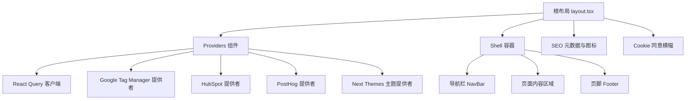
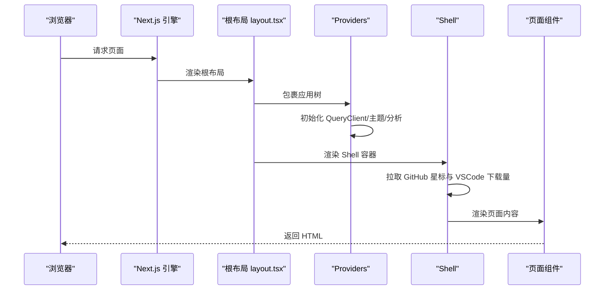
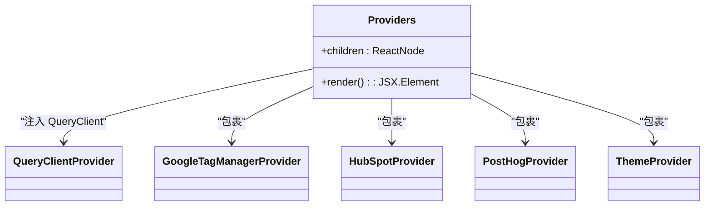
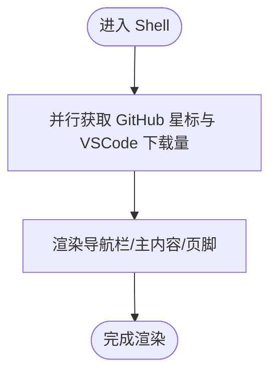
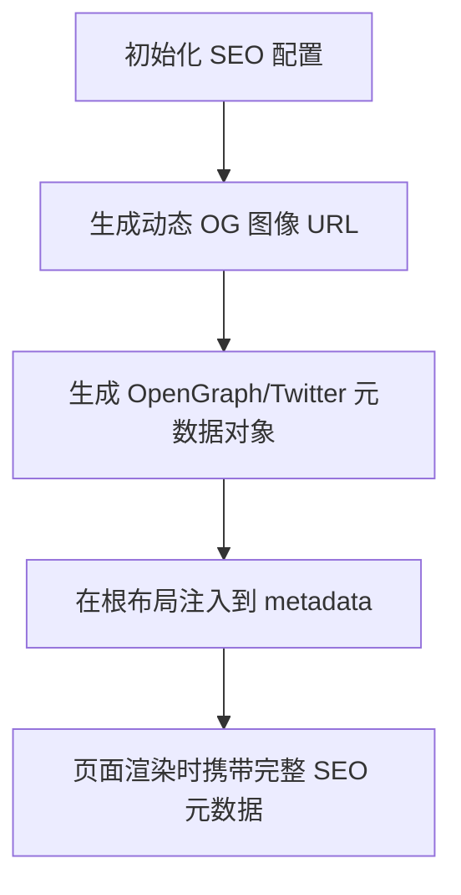
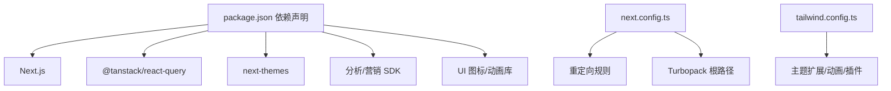

# 主 Web 应用 (web-Njust-AI)

<cite>
**本文引用的文件**
- [apps/web-Njust-AI/package.json](file://apps/web-Njust-AI/package.json)
- [apps/web-Njust-AI/next.config.ts](file://apps/web-Njust-AI/next.config.ts)
- [apps/web-Njust-AI/tailwind.config.ts](file://apps/web-Njust-AI/tailwind.config.ts)
- [apps/web-Njust-AI/src/app/layout.tsx](file://apps/web-Njust-AI/src/app/layout.tsx)
- [apps/web-Njust-AI/src/app/shell.tsx](file://apps/web-Njust-AI/src/app/shell.tsx)
- [apps/web-Njust-AI/src/components/providers/providers.tsx](file://apps/web-Njust-AI/src/components/providers/providers.tsx)
- [apps/web-Njust-AI/src/lib/seo.ts](file://apps/web-Njust-AI/src/lib/seo.ts)
- [apps/web-Njust-AI/src/lib/og.ts](file://apps/web-Njust-AI/src/lib/og.ts)
- [apps/web-Njust-AI/src/lib/stats.ts](file://apps/web-Njust-AI/src/lib/stats.ts)
- [apps/web-Njust-AI/src/components/chromes/footer.tsx](file://apps/web-Njust-AI/src/components/chromes/footer.tsx)
</cite>

## 目录
1. [简介](#简介)
2. [项目结构](#项目结构)
3. [核心组件](#核心组件)
4. [架构总览](#架构总览)
5. [详细组件分析](#详细组件分析)
6. [依赖关系分析](#依赖关系分析)
7. [性能考虑](#性能考虑)
8. [故障排除指南](#故障排除指南)
9. [结论](#结论)
10. [附录](#附录)

## 简介
本文件面向主 Web 应用（web-Njust-AI）的集成开发者，系统性阐述基于 Next.js 的应用架构、布局系统、路由与重定向配置、状态管理方案、Providers 组件作用与配置、Shell 布局逻辑、SEO 与元数据管理、图标系统与社交媒体分享、Tailwind CSS 配置与主题系统、响应式设计实现，并提供集成新页面、组件与功能模块的实践指引。

## 项目结构
web-Njust-AI 位于 apps/web-Njust-AI 目录，采用 Next.js App Router 结构，核心入口为根布局与 Shell 容器，通过 Providers 注入全局状态与第三方服务，配合 SEO 工具库与统计服务实现内容与指标展示。

图表来源
- [apps/web-Njust-AI/src/app/layout.tsx:89-111](file://apps/web-Njust-AI/src/app/layout.tsx#L89-L111)
- [apps/web-Njust-AI/src/components/providers/providers.tsx:12-26](file://apps/web-Njust-AI/src/components/providers/providers.tsx#L12-L26)
- [apps/web-Njust-AI/src/app/shell.tsx:8-18](file://apps/web-Njust-AI/src/app/shell.tsx#L8-L18)
- [apps/web-Njust-AI/src/components/chromes/footer.tsx:13-396](file://apps/web-Njust-AI/src/components/chromes/footer.tsx#L13-L396)

章节来源
- [apps/web-Njust-AI/src/app/layout.tsx:1-112](file://apps/web-Njust-AI/src/app/layout.tsx#L1-L112)
- [apps/web-Njust-AI/src/app/shell.tsx:1-19](file://apps/web-Njust-AI/src/app/shell.tsx#L1-L19)

## 核心组件
- 根布局与元数据：定义站点基础元信息、图标、OpenGraph 与 Twitter 卡片，注入 SEO 基础配置并包裹 Providers 与 Shell。
- Providers：集中注入 React Query、Google Tag Manager、HubSpot、PostHog 与主题系统，统一管理全局状态与分析埋点。
- Shell：负责页面骨架（导航、主内容区、页脚），并按需拉取外部统计数据用于展示。
- SEO 工具：提供固定 SEO 配置、动态 OpenGraph 图像生成与社交媒体元数据生成。
- 统计服务：从 GitHub 与 VS Code 市场 API 拉取星标数与下载量等公开数据，格式化为可读字符串。

章节来源
- [apps/web-Njust-AI/src/app/layout.tsx:19-87](file://apps/web-Njust-AI/src/app/layout.tsx#L19-L87)
- [apps/web-Njust-AI/src/components/providers/providers.tsx:1-27](file://apps/web-Njust-AI/src/components/providers/providers.tsx#L1-L27)
- [apps/web-Njust-AI/src/app/shell.tsx:1-19](file://apps/web-Njust-AI/src/app/shell.tsx#L1-L19)
- [apps/web-Njust-AI/src/lib/seo.ts:1-31](file://apps/web-Njust-AI/src/lib/seo.ts#L1-L31)
- [apps/web-Njust-AI/src/lib/og.ts:1-58](file://apps/web-Njust-AI/src/lib/og.ts#L1-L58)
- [apps/web-Njust-AI/src/lib/stats.ts:1-125](file://apps/web-Njust-AI/src/lib/stats.ts#L1-L125)

## 架构总览
下图展示应用启动到渲染的关键流程：Next.js 渲染根布局，注入 Providers，初始化主题与分析服务，随后加载 Shell 并在其中渲染子页面内容。

图表来源
- [apps/web-Njust-AI/src/app/layout.tsx:89-111](file://apps/web-Njust-AI/src/app/layout.tsx#L89-L111)
- [apps/web-Njust-AI/src/components/providers/providers.tsx:12-26](file://apps/web-Njust-AI/src/components/providers/providers.tsx#L12-L26)
- [apps/web-Njust-AI/src/app/shell.tsx:8-18](file://apps/web-Njust-AI/src/app/shell.tsx#L8-L18)

## 详细组件分析

### Providers 组件
- 职责：作为全局上下文容器，注入 React Query 客户端、Google Tag Manager、HubSpot、PostHog 与 next-themes 主题系统。
- 设计要点：
  - 使用 QueryClientProvider 管理客户端缓存与查询失效策略。
  - 以 Provider 层层嵌套的方式组合第三方分析与营销平台。
  - next-themes 提供暗/亮主题切换与系统偏好支持，attribute="class" 便于样式控制。
- 集成建议：新增分析或营销服务时，在现有 Provider 层级中添加对应 Provider 包裹，保持单一职责与可维护性。

图表来源
- [apps/web-Njust-AI/src/components/providers/providers.tsx:12-26](file://apps/web-Njust-AI/src/components/providers/providers.tsx#L12-L26)

章节来源
- [apps/web-Njust-AI/src/components/providers/providers.tsx:1-27](file://apps/web-Njust-AI/src/components/providers/providers.tsx#L1-L27)

### Shell 组件
- 职责：构建页面骨架，聚合外部统计数据并在页面间复用。
- 数据获取：通过 Promise.all 并行请求 GitHub 星标与 VSCode 下载量，revalidate 设置为 3600 秒，限制缓存刷新频率。
- 布局：顶部导航、中间主内容区、底部页脚，整体使用 flex 布局保证内容区自适应高度。

图表来源
- [apps/web-Njust-AI/src/app/shell.tsx:8-18](file://apps/web-Njust-AI/src/app/shell.tsx#L8-L18)

章节来源
- [apps/web-Njust-AI/src/app/shell.tsx:1-19](file://apps/web-Njust-AI/src/app/shell.tsx#L1-L19)

### SEO 与元数据管理
- SEO 基础配置：站点名称、标题、描述、关键词、分类、语言与 Twitter 卡片类型由 SEO 工具集中管理。
- 动态 OpenGraph 图像：通过 ogImageUrl 生成带参数的图像端点 URL；getOgMetadata 与 getTwitterMetadata 生成社交媒体卡片元数据对象。
- 根布局元数据：在根布局中统一注入 canonical、icons、openGraph、twitter、robots 等字段，确保搜索引擎与社交平台正确抓取。

图表来源
- [apps/web-Njust-AI/src/lib/seo.ts:1-31](file://apps/web-Njust-AI/src/lib/seo.ts#L1-L31)
- [apps/web-Njust-AI/src/lib/og.ts:7-57](file://apps/web-Njust-AI/src/lib/og.ts#L7-L57)
- [apps/web-Njust-AI/src/app/layout.tsx:19-87](file://apps/web-Njust-AI/src/app/layout.tsx#L19-L87)

章节来源
- [apps/web-Njust-AI/src/lib/seo.ts:1-31](file://apps/web-Njust-AI/src/lib/seo.ts#L1-L31)
- [apps/web-Njust-AI/src/lib/og.ts:1-58](file://apps/web-Njust-AI/src/lib/og.ts#L1-L58)
- [apps/web-Njust-AI/src/app/layout.tsx:19-87](file://apps/web-Njust-AI/src/app/layout.tsx#L19-L87)

### 图标系统与社交媒体分享
- 图标清单：包含 favicon、apple-touch-icon、android-chrome 多尺寸图标，满足多终端显示需求。
- 社交媒体分享：OpenGraph 与 Twitter 卡片均指向动态生成的 OG 图像端点，确保分享时的视觉一致性。
- 页脚社交链接：页脚组件集中管理各平台链接，便于维护与扩展。

章节来源
- [apps/web-Njust-AI/src/app/layout.tsx:29-50](file://apps/web-Njust-AI/src/app/layout.tsx#L29-L50)
- [apps/web-Njust-AI/src/components/chromes/footer.tsx:311-384](file://apps/web-Njust-AI/src/components/chromes/footer.tsx#L311-L384)

### Tailwind CSS 配置与主题系统
- 内容扫描：覆盖 pages、components、app、src 与根目录下的 TypeScript/JavaScript/Mdx 文件，确保样式按需生成。
- 深色模式：启用 class 选择器，结合 next-themes 实现主题切换与系统偏好检测。
- 主题扩展：定义容器居中、内边距、圆角变量、颜色系统（含 chart 系列）、动画 keyframes 与自定义 xs 断点。
- 插件：引入 tailwindcss-animate 与 @tailwindcss/typography，增强动效与排版能力。

章节来源
- [apps/web-Njust-AI/tailwind.config.ts:1-119](file://apps/web-Njust-AI/tailwind.config.ts#L1-L119)

### 响应式设计实现
- 断点策略：在 Tailwind 中定义 xs: 420px，结合语义化容器与网格系统实现移动端优先的响应式布局。
- 组件层面：页脚采用两列/三列栅格布局，配合媒体查询与弹性容器适配不同屏幕尺寸。

章节来源
- [apps/web-Njust-AI/tailwind.config.ts:110-112](file://apps/web-Njust-AI/tailwind.config.ts#L110-L112)
- [apps/web-Njust-AI/src/components/chromes/footer.tsx:41-387](file://apps/web-Njust-AI/src/components/chromes/footer.tsx#L41-L387)

### 状态管理方案
- 客户端状态：通过 React Query 管理远程数据缓存、失效与重 fetch，适合 Shell 中的统计数据场景。
- 主题状态：next-themes 提供主题切换与持久化，attribute="class" 使样式系统与主题解耦。
- 分析与营销：Google Tag Manager、HubSpot、PostHog 通过 Provider 注入，统一埋点与用户行为追踪。

章节来源
- [apps/web-Njust-AI/src/components/providers/providers.tsx:3-8](file://apps/web-Njust-AI/src/components/providers/providers.tsx#L3-L8)
- [apps/web-Njust-AI/src/app/shell.tsx:6-6](file://apps/web-Njust-AI/src/app/shell.tsx#L6-L6)

### 路由与重定向配置
- Turbopack 根路径：配置 turbopack.root 指向仓库根目录，提升开发体验。
- 重定向规则：
  - www 到非 www 的强制跳转；
  - HTTP 到 HTTPS 的安全跳转；
  - 云候补列表到 Notion 页面的兼容性跳转；
  - 价格页到提供者页面的路径规范化。
- 建议：新增页面时遵循现有重定向规则，避免破坏 SEO 与用户体验。

章节来源
- [apps/web-Njust-AI/next.config.ts:4-36](file://apps/web-Njust-AI/next.config.ts#L4-L36)

## 依赖关系分析
- 运行时依赖：Next.js、React、@tanstack/react-query、next-themes、分析与营销相关 SDK、UI 图标库与动画库。
- 开发依赖：Tailwind CSS、PostCSS、Autoprefixer、Tailwind 扩展插件、Vitest 测试框架。
- 关键耦合点：Providers 对 QueryClient 与主题系统的依赖；Shell 对统计服务的依赖；根布局对 SEO 与图标配置的依赖。

图表来源
- [apps/web-Njust-AI/package.json:16-46](file://apps/web-Njust-AI/package.json#L16-L46)
- [apps/web-Njust-AI/next.config.ts:4-36](file://apps/web-Njust-AI/next.config.ts#L4-L36)
- [apps/web-Njust-AI/tailwind.config.ts:12-115](file://apps/web-Njust-AI/tailwind.config.ts#L12-L115)

章节来源
- [apps/web-Njust-AI/package.json:1-62](file://apps/web-Njust-AI/package.json#L1-L62)
- [apps/web-Njust-AI/next.config.ts:1-40](file://apps/web-Njust-AI/next.config.ts#L1-L40)
- [apps/web-Njust-AI/tailwind.config.ts:1-119](file://apps/web-Njust-AI/tailwind.config.ts#L1-L119)

## 性能考虑
- 缓存与失效：Shell 中使用 revalidate 控制静态生成缓存刷新周期，降低重复请求成本。
- 并行数据获取：使用 Promise.all 并行拉取多个外部数据源，减少首屏等待时间。
- 样式按需生成：Tailwind 内容扫描仅覆盖实际使用的组件与页面，避免无用样式输出。
- 动画与资源：合理使用动画 keyframes 与轻量级图标库，避免阻塞主线程。

## 故障排除指南
- GitHub API 限流：当星标数返回异常或为空时，检查网络与 API 限流状态，必要时增加缓存或降级策略。
- VS Code 市场 API 变更：若下载量或评分接口返回结构变化，需更新解析逻辑与错误处理。
- SEO 图像生成失败：确认 NEXT_PUBLIC_APP_URL 配置正确，动态 OG 端点可达且返回有效图像。
- 主题切换异常：检查 next-themes 的 attribute 与默认主题配置，确保与 Tailwind 类名一致。

章节来源
- [apps/web-Njust-AI/src/lib/stats.ts:1-125](file://apps/web-Njust-AI/src/lib/stats.ts#L1-L125)
- [apps/web-Njust-AI/src/lib/og.ts:7-17](file://apps/web-Njust-AI/src/lib/og.ts#L7-L17)
- [apps/web-Njust-AI/src/components/providers/providers.tsx:18-18](file://apps/web-Njust-AI/src/components/providers/providers.tsx#L18-L18)

## 结论
web-Njust-AI 通过清晰的布局与 Providers 架构、完善的 SEO 与图标体系、可扩展的主题与响应式设计，以及合理的状态管理与性能策略，构建了现代化的 Next.js 应用。开发者在集成新页面、组件与功能模块时，应遵循现有 Provider 层级、SEO 元数据规范与 Tailwind 配置约定，确保一致性与可维护性。

## 附录

### 集成新页面的步骤
- 在 app 目录下创建新路由段（如 app/new-page/...），编写页面组件并导出默认导出。
- 如需 SEO 元数据，参考根布局中的 metadata 结构，或使用 SEO 工具函数生成动态 OG 图像与社交媒体卡片。
- 若需要外部数据，可在页面中使用服务器端或客户端数据获取策略，遵循现有 Providers 与缓存策略。

章节来源
- [apps/web-Njust-AI/src/app/layout.tsx:19-87](file://apps/web-Njust-AI/src/app/layout.tsx#L19-L87)
- [apps/web-Njust-AI/src/lib/og.ts:25-57](file://apps/web-Njust-AI/src/lib/og.ts#L25-L57)

### 集成新组件的步骤
- 将组件放置于 components 目录下，遵循功能域分组（如 chromes、ui、providers 等）。
- 在组件中使用 Tailwind 类名，确保与 tailwind.config.ts 的主题扩展一致。
- 如需主题感知，使用 next-themes 提供的 useTheme 或 attribute="class" 策略。

章节来源
- [apps/web-Njust-AI/tailwind.config.ts:20-115](file://apps/web-Njust-AI/tailwind.config.ts#L20-L115)
- [apps/web-Njust-AI/src/components/providers/providers.tsx:18-18](file://apps/web-Njust-AI/src/components/providers/providers.tsx#L18-L18)

### 集成分析与营销服务的步骤
- 在 Providers 中添加对应 Provider 包裹，确保初始化顺序与上下文链路正确。
- 遵循环境变量与隐私合规要求，避免在客户端暴露敏感密钥。

章节来源
- [apps/web-Njust-AI/src/components/providers/providers.tsx:6-8](file://apps/web-Njust-AI/src/components/providers/providers.tsx#L6-L8)