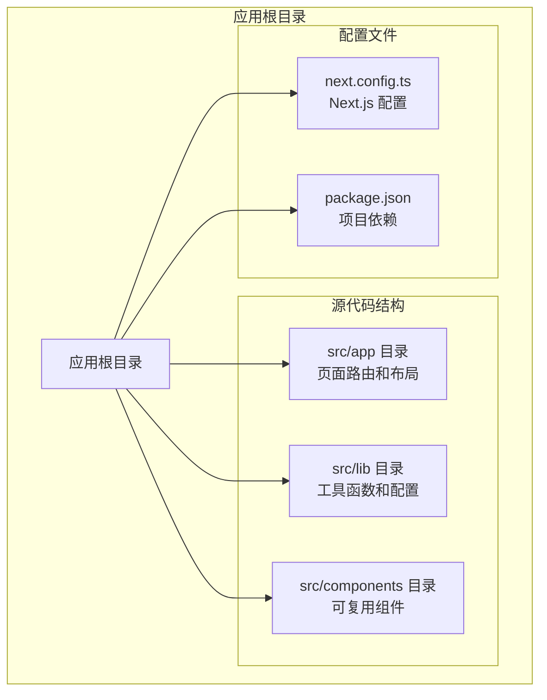
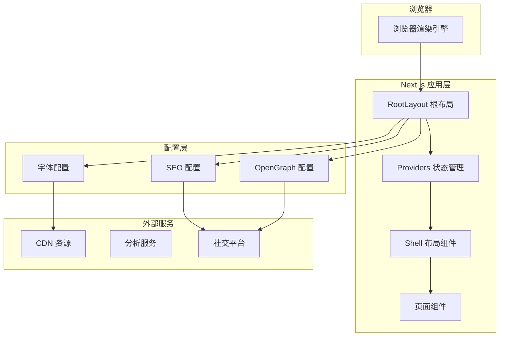
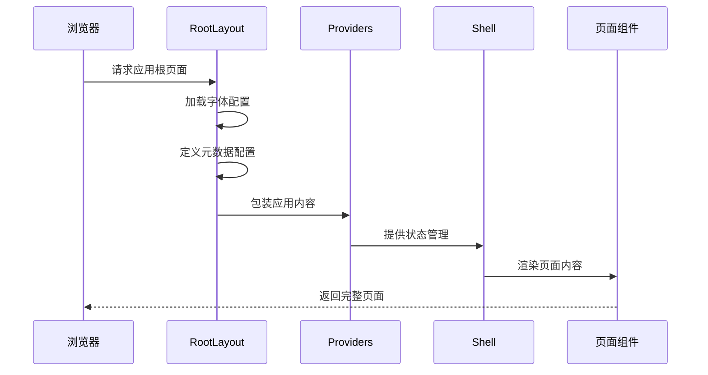
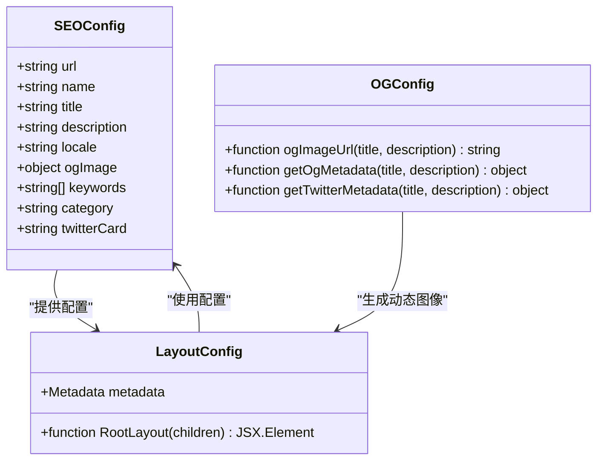
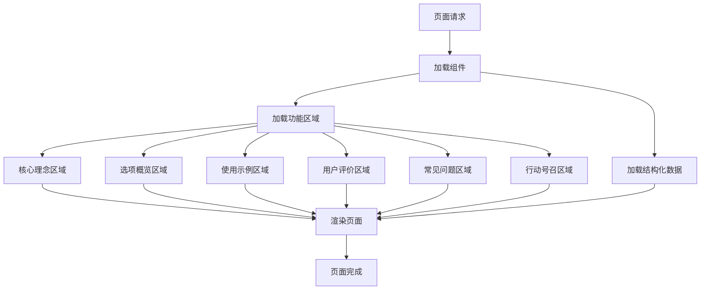
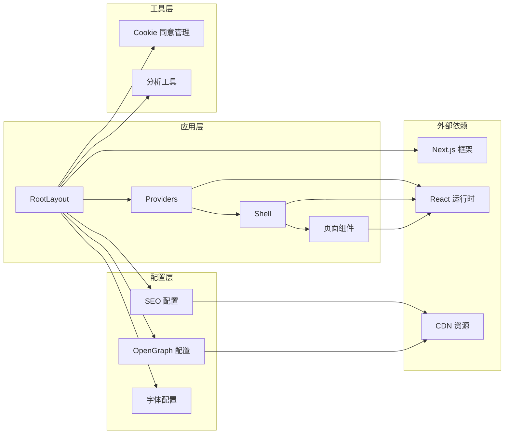

# 应用架构设计

<cite>
**本文档引用的文件**
- [apps/web-Njust-AI/src/app/layout.tsx](file://apps/web-Njust-AI/src/app/layout.tsx)
- [apps/web-Njust-AI/src/app/page.tsx](file://apps/web-Njust-AI/src/app/page.tsx)
- [apps/web-Njust-AI/next.config.ts](file://apps/web-Njust-AI/next.config.ts)
- [apps/web-Njust-AI/src/lib/seo.ts](file://apps/web-Njust-AI/src/lib/seo.ts)
- [apps/web-Njust-AI/src/lib/og.ts](file://apps/web-Njust-AI/src/lib/og.ts)
</cite>

## 目录
1. [引言](#引言)
2. [项目结构](#项目结构)
3. [核心组件](#核心组件)
4. [架构概览](#架构概览)
5. [详细组件分析](#详细组件分析)
6. [依赖关系分析](#依赖关系分析)
7. [性能考虑](#性能考虑)
8. [故障排除指南](#故障排除指南)
9. [结论](#结论)

## 引言

本文件为 NJUST_AI Next.js 应用的架构设计技术文档。该应用采用现代前端架构模式，通过根布局（RootLayout）统一管理全局元数据、SEO 配置和社交分享设置，并通过 Providers 和 Shell 组件实现模块化的状态管理和布局逻辑。文档将深入解析应用的整体架构模式、RootLayout 的作用和配置、Shell 组件的布局逻辑和状态管理，以及 Providers 组件的层次结构、状态提升策略和组件组合模式。

## 项目结构

基于提供的上下文信息，该 Next.js 应用采用标准的 app 目录结构，主要由以下关键部分组成：

**图表来源**
- [apps/web-Njust-AI/src/app/layout.tsx:1-112](file://apps/web-Njust-AI/src/app/layout.tsx#L1-L112)
- [apps/web-Njust-AI/next.config.ts:1-40](file://apps/web-Njust-AI/next.config.ts#L1-L40)

**章节来源**
- [apps/web-Njust-AI/src/app/layout.tsx:1-112](file://apps/web-Njust-AI/src/app/layout.tsx#L1-L112)
- [apps/web-Njust-AI/next.config.ts:1-40](file://apps/web-Njust-AI/next.config.ts#L1-L40)

## 核心组件

### RootLayout 根布局组件

RootLayout 是应用的顶层布局组件，负责统一管理全局元数据、字体加载、Cookie 同意管理和应用包装器。其核心职责包括：

1. **元数据管理**：定义完整的 SEO 配置，包括 OpenGraph、Twitter Card 和标准 meta 标签
2. **字体系统**：集成 Google Fonts 的 Inter 字体
3. **应用包装**：通过 Providers 组件提供全局状态管理
4. **Cookie 同意**：集成 Cookie 同意管理功能

### Providers 状态管理组件

Providers 组件作为应用的状态管理容器，采用层级结构设计，实现状态提升和组件组合模式。其设计原则包括：

- **状态提升**：将共享状态提升到应用根级别
- **组件组合**：支持多种 Provider 的组合使用
- **模块化设计**：每个 Provider 负责特定领域的状态管理

### Shell 布局组件

Shell 组件负责应用的主要布局逻辑，包括：
- 页面内容的容器和样式管理
- 响应式布局的实现
- 主题和样式的统一管理

**章节来源**
- [apps/web-Njust-AI/src/app/layout.tsx:89-111](file://apps/web-Njust-AI/src/app/layout.tsx#L89-L111)

## 架构概览

该应用采用分层架构模式，通过根布局统一管理全局配置，通过 Providers 实现状态管理，通过 Shell 处理布局逻辑：

**图表来源**
- [apps/web-Njust-AI/src/app/layout.tsx:19-87](file://apps/web-Njust-AI/src/app/layout.tsx#L19-L87)
- [apps/web-Njust-AI/src/lib/seo.ts:3-28](file://apps/web-Njust-AI/src/lib/seo.ts#L3-L28)

## 详细组件分析

### RootLayout 组件架构

RootLayout 采用函数组件模式，实现了完整的应用初始化流程：

**图表来源**
- [apps/web-Njust-AI/src/app/layout.tsx:89-111](file://apps/web-Njust-AI/src/app/layout.tsx#L89-L111)

#### 元数据配置分析

RootLayout 中的元数据配置采用了多层次的设计：

1. **基础配置**：站点名称、URL 基础地址、描述信息
2. **图标配置**：多尺寸 favicon 和 Apple Touch Icon
3. **OpenGraph 配置**：完整的社交分享元数据
4. **Twitter Card 配置**：Twitter 平台的卡片格式
5. **Robots 配置**：搜索引擎爬虫规则
6. **结构化数据**：Schema.org 标准的结构化内容

**章节来源**
- [apps/web-Njust-AI/src/app/layout.tsx:19-87](file://apps/web-Njust-AI/src/app/layout.tsx#L19-L87)

### SEO 和 OpenGraph 配置

应用的 SEO 配置通过独立的配置文件进行管理，提供了灵活的配置选项：

**图表来源**
- [apps/web-Njust-AI/src/lib/seo.ts:3-28](file://apps/web-Njust-AI/src/lib/seo.ts#L3-L28)
- [apps/web-Njust-AI/src/lib/og.ts:7-57](file://apps/web-Njust-AI/src/lib/og.ts#L7-L57)

**章节来源**
- [apps/web-Njust-AI/src/lib/seo.ts:1-31](file://apps/web-Njust-AI/src/lib/seo.ts#L1-L31)
- [apps/web-Njust-AI/src/lib/og.ts:1-58](file://apps/web-Njust-AI/src/lib/og.ts#L1-L58)

### 页面组件分析

首页页面组件展示了应用的内容组织方式：

**图表来源**
- [apps/web-Njust-AI/src/app/page.tsx:18-82](file://apps/web-Njust-AI/src/app/page.tsx#L18-L82)

**章节来源**
- [apps/web-Njust-AI/src/app/page.tsx:1-83](file://apps/web-Njust-AI/src/app/page.tsx#L1-L83)

## 依赖关系分析

应用的依赖关系体现了清晰的分层架构：

**图表来源**
- [apps/web-Njust-AI/src/app/layout.tsx:1-14](file://apps/web-Njust-AI/src/app/layout.tsx#L1-L14)
- [apps/web-Njust-AI/next.config.ts:1-40](file://apps/web-Njust-AI/next.config.ts#L1-L40)

**章节来源**
- [apps/web-Njust-AI/src/app/layout.tsx:1-14](file://apps/web-Njust-AI/src/app/layout.tsx#L1-L14)
- [apps/web-Njust-AI/next.config.ts:1-40](file://apps/web-Njust-AI/next.config.ts#L1-L40)

## 性能考虑

### 缓存策略

应用采用了合理的缓存策略来优化性能：

1. **页面缓存**：首页设置了 1 小时的 revalidate 时间
2. **静态资源**：通过 CDN 加速字体和图标资源
3. **字体优化**：使用 Google Fonts 并配置适当的加载策略

### 重定向优化

Next.js 配置中包含了多个重定向规则来优化用户体验：

- www 到非 www 的重定向
- HTTP 到 HTTPS 的安全重定向  
- 云等待列表到 Notion 页面的兼容性重定向
- 供应商定价页面的 URL 规范化

**章节来源**
- [apps/web-Njust-AI/src/app/page.tsx:15-16](file://apps/web-Njust-AI/src/app/page.tsx#L15-L16)
- [apps/web-Njust-AI/next.config.ts:8-36](file://apps/web-Njust-AI/next.config.ts#L8-L36)

## 故障排除指南

### 常见问题及解决方案

1. **元数据不显示**
   - 检查 SEO 配置文件中的环境变量设置
   - 验证 OpenGraph 图像的动态生成端点

2. **字体加载问题**
   - 确认 Google Fonts 的网络连接
   - 检查字体缓存配置

3. **Cookie 同意弹窗问题**
   - 验证 Cookie 同意管理器的配置
   - 检查用户同意状态的持久化

4. **重定向循环**
   - 检查 Next.js 配置中的重定向规则
   - 验证主机头和协议检测逻辑

**章节来源**
- [apps/web-Njust-AI/src/lib/seo.ts:1-31](file://apps/web-Njust-AI/src/lib/seo.ts#L1-L31)
- [apps/web-Njust-AI/next.config.ts:8-36](file://apps/web-Njust-AI/next.config.ts#L8-L36)

## 结论

该 NJUST_AI Next.js 应用展现了现代化前端架构的最佳实践。通过 RootLayout 的统一管理、Providers 的状态提升策略、Shell 的布局逻辑分离，以及完善的 SEO 和社交分享配置，构建了一个高性能、可维护的应用架构。

关键优势包括：
- 清晰的分层架构和职责分离
- 完善的 SEO 和社交分享支持
- 灵活的配置管理和扩展性
- 优秀的性能优化策略
- 良好的开发体验和维护性

这种架构设计为类似的企业级应用提供了可靠的参考模板，特别是在需要复杂状态管理、SEO 优化和多平台部署的场景中。