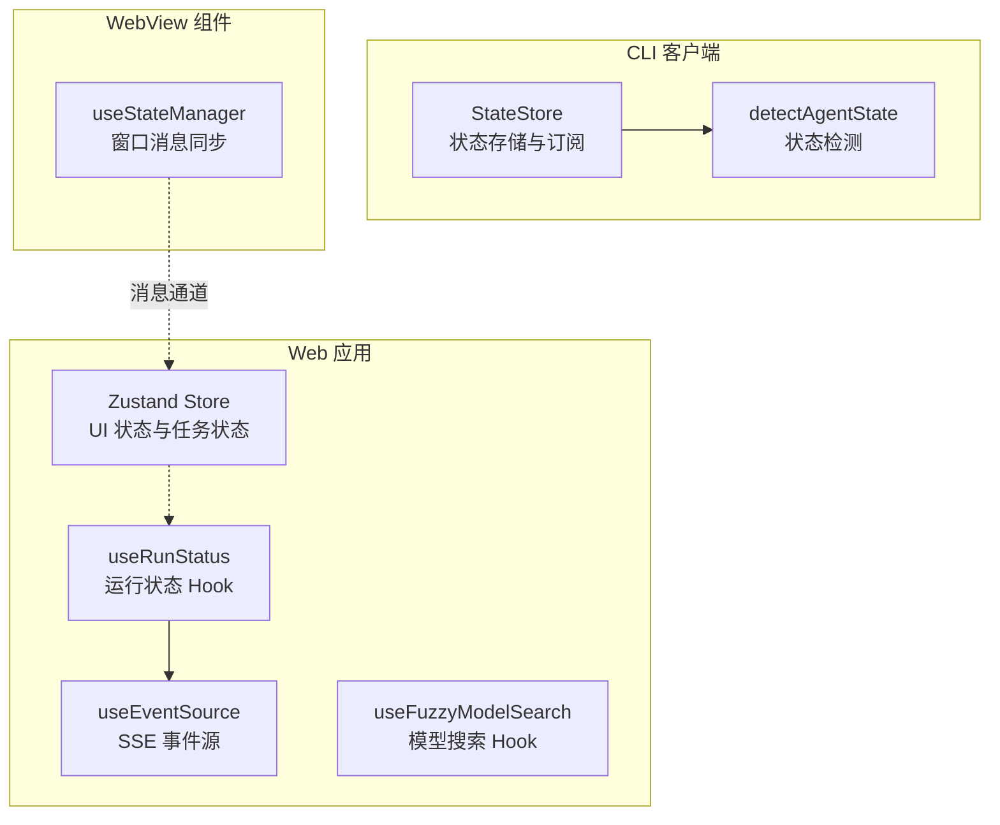
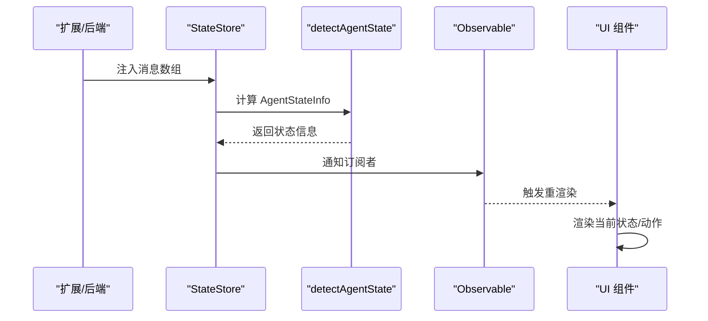
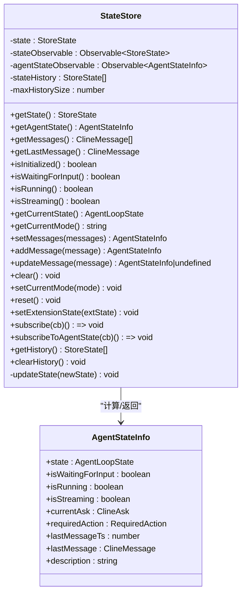
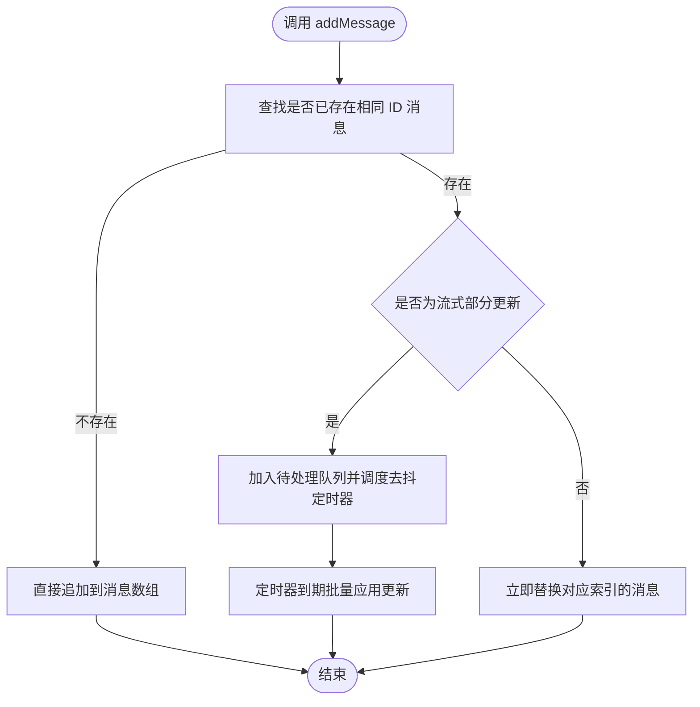
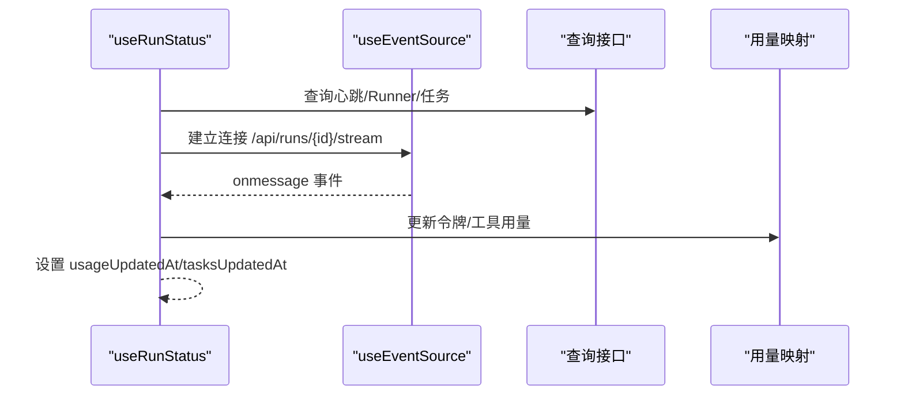
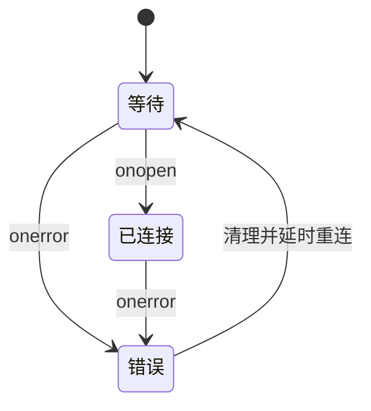
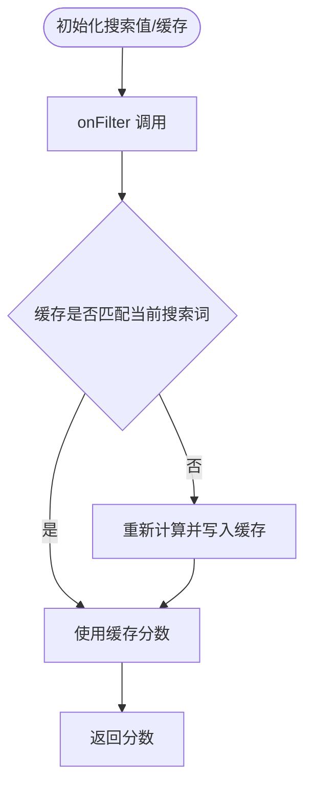
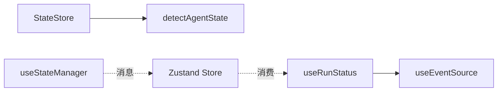

# 状态管理

<cite>
**本文引用的文件**
- [apps/cli/src/agent/state-store.ts](file://apps/cli/src/agent/state-store.ts)
- [apps/cli/src/agent/agent-state.ts](file://apps/cli/src/agent/agent-state.ts)
- [apps/cli/src/ui/store.ts](file://apps/cli/src/ui/store.ts)
- [apps/cli/src/ui/stores/uiStateStore.ts](file://apps/cli/src/ui/stores/uiStateStore.ts)
- [apps/web-evals/src/hooks/use-run-status.ts](file://apps/web-evals/src/hooks/use-run-status.ts)
- [apps/web-evals/src/hooks/use-event-source.ts](file://apps/web-evals/src/hooks/use-event-source.ts)
- [apps/web-evals/src/hooks/use-fuzzy-model-search.ts](file://apps/web-evals/src/hooks/use-fuzzy-model-search.ts)
- [webview-ui/src/components/marketplace/useStateManager.ts](file://webview-ui/src/components/marketplace/useStateManager.ts)
- [src/services/tree-sitter/__tests__/fixtures/sample-tsx.ts](file://src/services/tree-sitter/__tests__/fixtures/sample-tsx.ts)
</cite>

## 目录
1. [简介](#简介)
2. [项目结构](#项目结构)
3. [核心组件](#核心组件)
4. [架构总览](#架构总览)
5. [详细组件分析](#详细组件分析)
6. [依赖关系分析](#依赖关系分析)
7. [性能考量](#性能考量)
8. [故障排查指南](#故障排查指南)
9. [结论](#结论)
10. [附录](#附录)

## 简介
本文件系统性梳理本仓库中的状态管理方案，涵盖：
- React Hooks 使用模式与自定义 Hook 设计原则
- 全局状态管理方案与本地状态同步机制
- 状态提升策略与状态持久化方案
- 用户认证状态、运行状态、模型搜索状态、事件源状态的管理实现
- 状态订阅模式、副作用处理与性能优化技巧
- 具体状态管理模式示例与最佳实践指南

## 项目结构
本仓库的状态管理横跨 CLI 客户端、Web 应用与 WebView 组件三部分：
- CLI 客户端：基于可观察存储（Observable）与状态检测（Agent State）实现代理循环状态管理
- Web 应用（Next.js）：基于 Zustand 实现前端 UI 状态与查询状态管理，结合 SSE 事件源进行实时数据同步
- WebView 组件：通过消息通道与外部状态管理器进行双向同步

**图表来源**
- [apps/cli/src/agent/state-store.ts:106-384](file://apps/cli/src/agent/state-store.ts#L106-L384)
- [apps/cli/src/agent/agent-state.ts:305-438](file://apps/cli/src/agent/agent-state.ts#L305-L438)
- [apps/web-evals/src/hooks/use-run-status.ts:22-110](file://apps/web-evals/src/hooks/use-run-status.ts#L22-L110)
- [apps/web-evals/src/hooks/use-event-source.ts:13-101](file://apps/web-evals/src/hooks/use-event-source.ts#L13-L101)
- [apps/web-evals/src/hooks/use-fuzzy-model-search.ts:9-37](file://apps/web-evals/src/hooks/use-fuzzy-model-search.ts#L9-L37)
- [webview-ui/src/components/marketplace/useStateManager.ts:28-49](file://webview-ui/src/components/marketplace/useStateManager.ts#L28-L49)

**章节来源**
- [apps/cli/src/agent/state-store.ts:1-416](file://apps/cli/src/agent/state-store.ts#L1-L416)
- [apps/cli/src/agent/agent-state.ts:1-464](file://apps/cli/src/agent/agent-state.ts#L1-L464)
- [apps/web-evals/src/hooks/use-run-status.ts:1-111](file://apps/web-evals/src/hooks/use-run-status.ts#L1-L111)
- [apps/web-evals/src/hooks/use-event-source.ts:1-102](file://apps/web-evals/src/hooks/use-event-source.ts#L1-L102)
- [apps/web-evals/src/hooks/use-fuzzy-model-search.ts:1-38](file://apps/web-evals/src/hooks/use-fuzzy-model-search.ts#L1-L38)
- [webview-ui/src/components/marketplace/useStateManager.ts:1-50](file://webview-ui/src/components/marketplace/useStateManager.ts#L1-L50)

## 核心组件
- CLI 状态存储与订阅
  - StateStore：不可变状态、可观察通知、历史追踪、消息增删改查、模式切换、扩展状态缓存
  - AgentState：基于消息流的状态机检测，输出 AgentLoopState 与所需动作
- Web 前端状态
  - Zustand Store：消息、任务、自动补全、任务历史、模式、指标、待办等状态管理
  - 自定义 Hook：运行状态（useRunStatus）、事件源（useEventSource）、模糊搜索（useFuzzyModelSearch）
- WebView 同步
  - useStateManager：监听窗口消息与状态变更，强制初始同步与清理

**章节来源**
- [apps/cli/src/agent/state-store.ts:106-384](file://apps/cli/src/agent/state-store.ts#L106-L384)
- [apps/cli/src/agent/agent-state.ts:48-159](file://apps/cli/src/agent/agent-state.ts#L48-L159)
- [apps/cli/src/ui/store.ts:53-295](file://apps/cli/src/ui/store.ts#L53-L295)
- [apps/web-evals/src/hooks/use-run-status.ts:12-110](file://apps/web-evals/src/hooks/use-run-status.ts#L12-L110)
- [apps/web-evals/src/hooks/use-event-source.ts:13-101](file://apps/web-evals/src/hooks/use-event-source.ts#L13-L101)
- [apps/web-evals/src/hooks/use-fuzzy-model-search.ts:9-37](file://apps/web-evals/src/hooks/use-fuzzy-model-search.ts#L9-L37)
- [webview-ui/src/components/marketplace/useStateManager.ts:28-49](file://webview-ui/src/components/marketplace/useStateManager.ts#L28-L49)

## 架构总览
本节展示状态管理的整体交互流程，包括消息注入、状态计算、订阅通知与 UI 同步。

**图表来源**
- [apps/cli/src/agent/state-store.ts:211-255](file://apps/cli/src/agent/state-store.ts#L211-L255)
- [apps/cli/src/agent/agent-state.ts:305-438](file://apps/cli/src/agent/agent-state.ts#L305-L438)

## 详细组件分析

### CLI 状态存储与订阅（StateStore + AgentState）
- 不可变更新：每次状态变更创建新对象，避免直接修改
- 可观察通知：提供 subscribe 与 subscribeToAgentState，分别针对完整状态与代理状态
- 历史追踪：可选的最大历史条数，便于调试
- 消息操作：支持设置、追加、更新、清空、重置
- 扩展状态缓存：合并扩展状态字段，必要时提取消息数组
- 状态检测：根据消息类型、ask 类型、流式标记等判定 AgentLoopState

**图表来源**
- [apps/cli/src/agent/state-store.ts:106-384](file://apps/cli/src/agent/state-store.ts#L106-L384)
- [apps/cli/src/agent/agent-state.ts:132-159](file://apps/cli/src/agent/agent-state.ts#L132-L159)

**章节来源**
- [apps/cli/src/agent/state-store.ts:106-384](file://apps/cli/src/agent/state-store.ts#L106-L384)
- [apps/cli/src/agent/agent-state.ts:296-438](file://apps/cli/src/agent/agent-state.ts#L296-L438)

### Web 前端状态（Zustand Store）
- 消息管理：支持新增、更新（含流式去抖）、删除、重置
- 任务状态：加载、完成、错误、开始任务标记、恢复任务标记
- 自动补全数据：文件搜索结果、斜杠命令、可用模式
- 任务历史：用于任务恢复
- 模式与配置：当前模式、路由模型上下文窗口、API 配置
- 待办列表：当前与前一版本对比
- 性能优化：浅比较数组以减少不必要重渲染；流式消息批量去抖

**图表来源**
- [apps/cli/src/ui/store.ts:155-222](file://apps/cli/src/ui/store.ts#L155-L222)

**章节来源**
- [apps/cli/src/ui/store.ts:53-295](file://apps/cli/src/ui/store.ts#L53-L295)

### 运行状态 Hook（useRunStatus）
- 聚合多个查询：心跳、Runner 列表、任务列表
- SSE 事件源：解析任务事件，维护令牌用量与工具用量映射，记录时间戳
- 状态聚合：返回 SSE 状态、心跳、Runner、任务、用量与更新时间

**图表来源**
- [apps/web-evals/src/hooks/use-run-status.ts:22-110](file://apps/web-evals/src/hooks/use-run-status.ts#L22-L110)
- [apps/web-evals/src/hooks/use-event-source.ts:13-101](file://apps/web-evals/src/hooks/use-event-source.ts#L13-L101)

**章节来源**
- [apps/web-evals/src/hooks/use-run-status.ts:12-110](file://apps/web-evals/src/hooks/use-run-status.ts#L12-L110)
- [apps/web-evals/src/hooks/use-event-source.ts:13-101](file://apps/web-evals/src/hooks/use-event-source.ts#L13-L101)

### 事件源 Hook（useEventSource）
- 状态机：waiting → connected 或 error
- 自动重连：断开后延迟重试
- 生命周期：组件卸载时清理定时器与连接

**图表来源**
- [apps/web-evals/src/hooks/use-event-source.ts:13-101](file://apps/web-evals/src/hooks/use-event-source.ts#L13-L101)

**章节来源**
- [apps/web-evals/src/hooks/use-event-source.ts:13-101](file://apps/web-evals/src/hooks/use-event-source.ts#L13-L101)

### 模型搜索 Hook（useFuzzyModelSearch）
- 输入缓存：对搜索词进行缓存，避免重复计算
- 结果映射：使用模糊匹配算法生成每个模型的分数映射
- 返回值：当前搜索值、设置函数与过滤回调

**图表来源**
- [apps/web-evals/src/hooks/use-fuzzy-model-search.ts:9-37](file://apps/web-evals/src/hooks/use-fuzzy-model-search.ts#L9-L37)

**章节来源**
- [apps/web-evals/src/hooks/use-fuzzy-model-search.ts:9-37](file://apps/web-evals/src/hooks/use-fuzzy-model-search.ts#L9-L37)

### WebView 状态同步（useStateManager）
- 窗口消息监听：注册 message 事件处理器
- 状态变更订阅：订阅外部状态管理器的变更事件
- 强制初始同步：首次渲染时强制同步一次状态
- 清理：组件卸载时移除事件监听与订阅，并按需清理管理器

**章节来源**
- [webview-ui/src/components/marketplace/useStateManager.ts:28-49](file://webview-ui/src/components/marketplace/useStateManager.ts#L28-L49)

### React Hooks 使用模式与设计原则
- 使用 useState/useStateRef 管理本地状态与引用
- 使用 useCallback 缓存回调，减少子组件重渲染
- 使用 useEffect 管理副作用与清理
- 在测试夹具中演示了 useState、useRef、useEffect、useCallback 的组合使用

**章节来源**
- [src/services/tree-sitter/__tests__/fixtures/sample-tsx.ts:190-243](file://src/services/tree-sitter/__tests__/fixtures/sample-tsx.ts#L190-L243)

## 依赖关系分析
- CLI 端
  - StateStore 依赖 Observable 与 AgentState 检测函数
  - AgentState 依赖消息类型与 ask 类型判断工具
- Web 端
  - useRunStatus 依赖 useEventSource 与查询接口
  - Zustand Store 作为 UI 状态中心，被多个组件消费
- WebView
  - useStateManager 依赖外部状态管理器与窗口消息

**图表来源**
- [apps/cli/src/agent/state-store.ts:15-18](file://apps/cli/src/agent/state-store.ts#L15-L18)
- [apps/cli/src/agent/agent-state.ts:12](file://apps/cli/src/agent/agent-state.ts#L12)
- [apps/web-evals/src/hooks/use-run-status.ts:10](file://apps/web-evals/src/hooks/use-run-status.ts#L10)
- [apps/web-evals/src/hooks/use-event-source.ts:13-101](file://apps/web-evals/src/hooks/use-event-source.ts#L13-L101)

**章节来源**
- [apps/cli/src/agent/state-store.ts:15-18](file://apps/cli/src/agent/state-store.ts#L15-L18)
- [apps/cli/src/agent/agent-state.ts:12](file://apps/cli/src/agent/agent-state.ts#L12)
- [apps/web-evals/src/hooks/use-run-status.ts:10](file://apps/web-evals/src/hooks/use-run-status.ts#L10)
- [apps/web-evals/src/hooks/use-event-source.ts:13-101](file://apps/web-evals/src/hooks/use-event-source.ts#L13-L101)

## 性能考量
- 流式消息去抖：批量合并快速更新，降低渲染频率
- 浅比较数组：避免因引用相等导致的不必要重渲染
- 选择性订阅：仅订阅代理状态以减少通知开销
- SSE 自动重连：在网络异常时自动恢复，保证实时性
- 模糊搜索缓存：避免重复计算，提升搜索体验

**章节来源**
- [apps/cli/src/ui/store.ts:12-19](file://apps/cli/src/ui/store.ts#L12-L19)
- [apps/cli/src/ui/store.ts:27-39](file://apps/cli/src/ui/store.ts#L27-L39)
- [apps/web-evals/src/hooks/use-event-source.ts:73-79](file://apps/web-evals/src/hooks/use-event-source.ts#L73-L79)
- [apps/web-evals/src/hooks/use-fuzzy-model-search.ts:17-29](file://apps/web-evals/src/hooks/use-fuzzy-model-search.ts#L17-L29)

## 故障排查指南
- 代理状态未更新
  - 检查消息数组是否正确传入 StateStore.setMessages
  - 确认 detectAgentState 的消息类型与 ask 字段是否符合预期
- SSE 连接失败
  - 查看 useEventSource 的状态机流转，确认是否进入 error 并自动重连
  - 检查服务端 SSE 端点与 CORS 配置
- 流式渲染卡顿
  - 调整 STREAMING_DEBOUNCE_MS，平衡渲染平滑度与更新频率
  - 确保消息 ID 唯一，避免去抖逻辑失效
- WebView 同步不同步
  - 确认窗口消息监听与状态变更订阅是否正确注册
  - 检查外部管理器生命周期与清理逻辑

**章节来源**
- [apps/cli/src/agent/state-store.ts:211-255](file://apps/cli/src/agent/state-store.ts#L211-L255)
- [apps/cli/src/agent/agent-state.ts:305-438](file://apps/cli/src/agent/agent-state.ts#L305-L438)
- [apps/web-evals/src/hooks/use-event-source.ts:62-79](file://apps/web-evals/src/hooks/use-event-source.ts#L62-L79)
- [apps/cli/src/ui/store.ts:171-222](file://apps/cli/src/ui/store.ts#L171-L222)
- [webview-ui/src/components/marketplace/useStateManager.ts:28-49](file://webview-ui/src/components/marketplace/useStateManager.ts#L28-L49)

## 结论
本仓库采用分层状态管理策略：
- CLI 端通过可观察存储与状态机检测实现稳定的代理循环状态管理
- Web 端通过 Zustand 与自定义 Hook 实现高性能的 UI 状态与实时数据同步
- WebView 通过消息通道与外部管理器实现双向同步
整体方案具备良好的可扩展性与性能表现，适合复杂交互场景下的状态管理需求。

## 附录
- 最佳实践
  - 尽量使用不可变更新，确保状态一致性
  - 对高频更新进行去抖或批处理
  - 选择性订阅，避免不必要的通知
  - 在组件卸载时清理副作用与订阅
  - 对于搜索类功能，使用缓存与浅比较优化性能