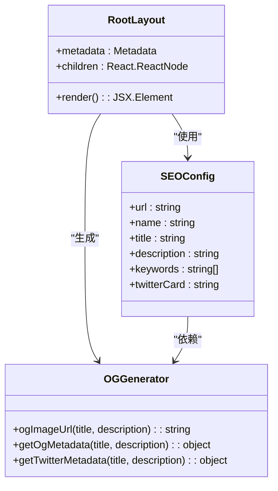
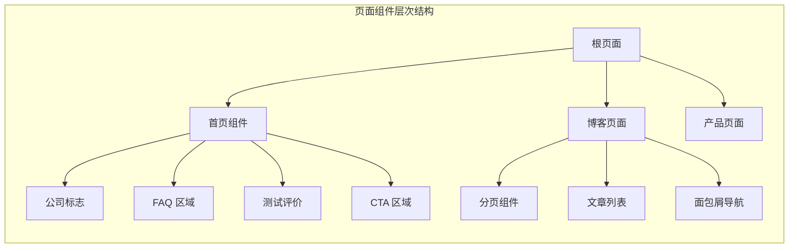
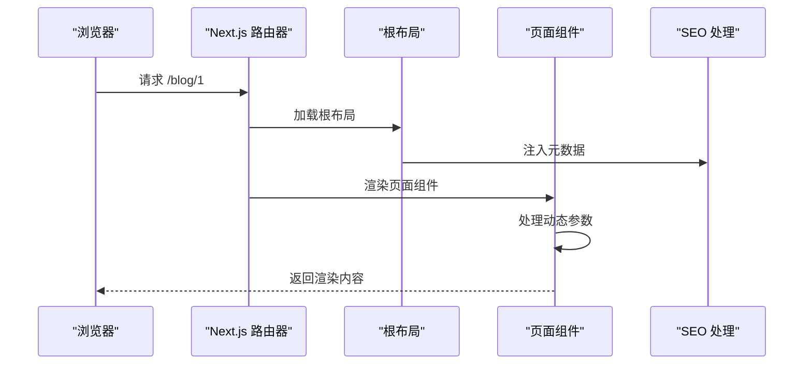
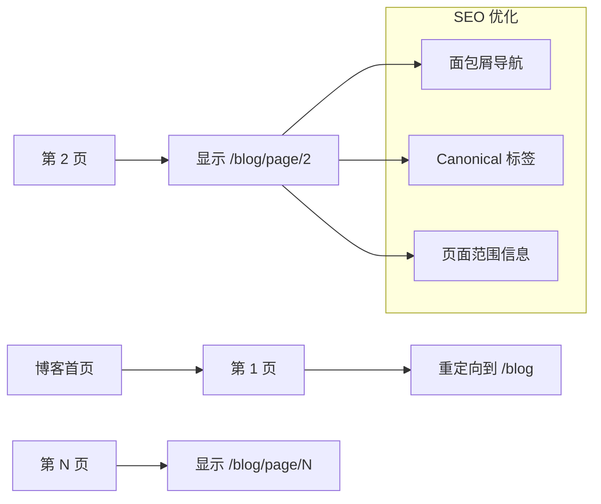
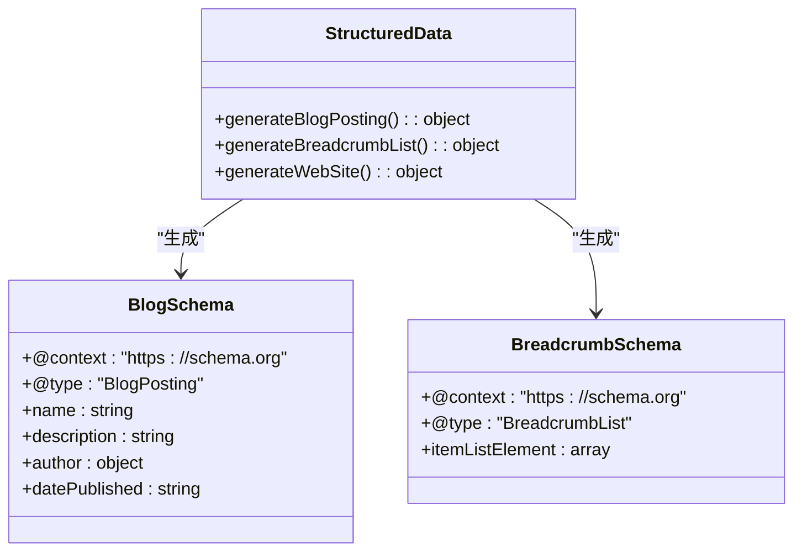
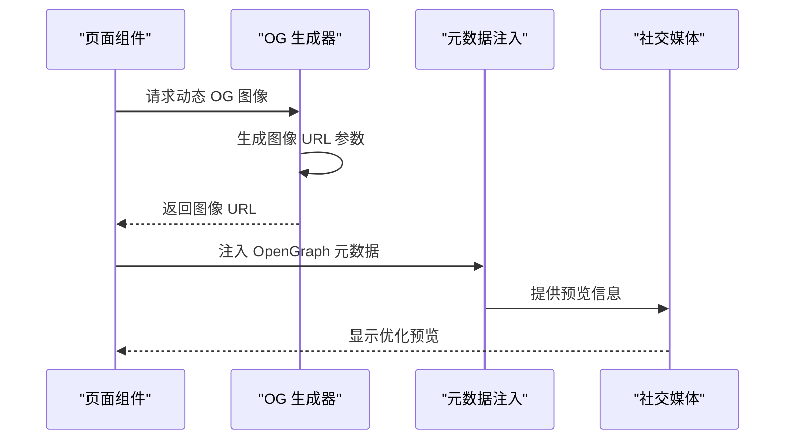
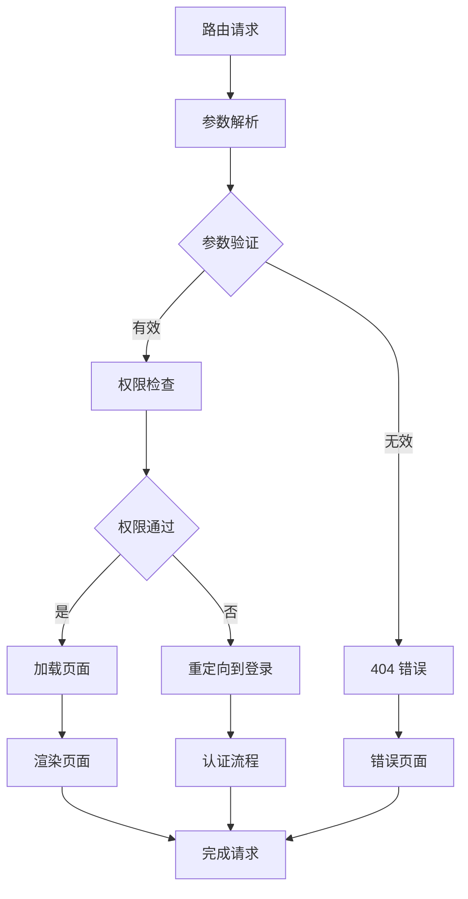
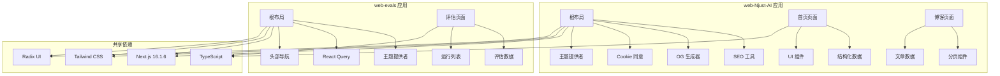
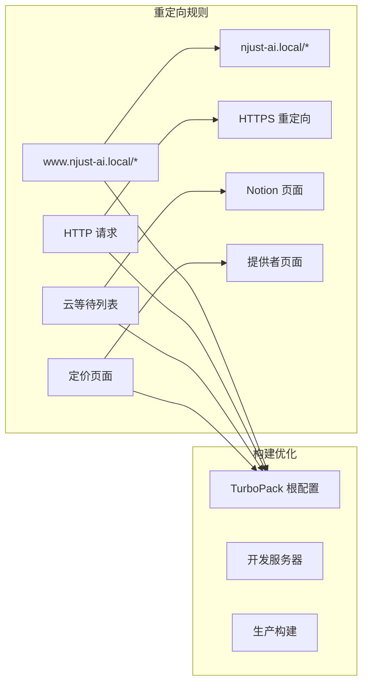
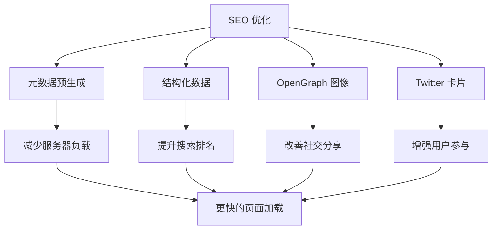

# 路由系统

<cite>
**本文档引用的文件**
- [apps/web-Njust-AI/src/app/layout.tsx](file://apps/web-Njust-AI/src/app/layout.tsx)
- [apps/web-Njust-AI/src/app/page.tsx](file://apps/web-Njust-AI/src/app/page.tsx)
- [apps/web-Njust-AI/src/lib/seo.ts](file://apps/web-Njust-AI/src/lib/seo.ts)
- [apps/web-Njust-AI/src/lib/og.ts](file://apps/web-Njust-AI/src/lib/og.ts)
- [apps/web-Njust-AI/next.config.ts](file://apps/web-Njust-AI/next.config.ts)
- [apps/web-evals/src/app/layout.tsx](file://apps/web-evals/src/app/layout.tsx)
- [apps/web-evals/src/app/page.tsx](file://apps/web-evals/src/app/page.tsx)
- [apps/web-evals/next.config.ts](file://apps/web-evals/next.config.ts)
- [apps/web-Njust-AI/src/app/blog/page\[page\]/page.tsx](file://apps/web-Njust-AI/src/app/blog/page\[page\]/page.tsx)
- [apps/web-Njust-AI/src/components/blog/BlogPagination.tsx](file://apps/web-Njust-AI/src/components/blog/BlogPagination.tsx)
</cite>

## 目录
1. [简介](#简介)
2. [项目结构](#项目结构)
3. [核心组件](#核心组件)
4. [架构概览](#架构概览)
5. [详细组件分析](#详细组件分析)
6. [依赖关系分析](#依赖关系分析)
7. [性能考虑](#性能考虑)
8. [故障排除指南](#故障排除指南)
9. [结论](#结论)

## 简介

本项目采用 Next.js App Router 架构，实现了现代化的路由系统。系统包含两个主要应用：web-Njust-AI（主网站）和 web-evals（评估工具）。路由系统基于 Next.js 16.1.6 的 App Router 模式，支持嵌套路由、动态路由、SEO 优化和社交媒体分享配置。

## 项目结构

项目采用多包架构，每个应用都有独立的路由配置和页面组件：

```mermaid
graph TB
subgraph "应用结构"
A[web-Njust-AI 应用] --> A1[根布局 layout.tsx]
A[web-Njust-AI 应用] --> A2[首页 page.tsx]
A[web-Njust-AI 应用] --> A3[博客路由]
A[web-Njust-AI 应用] --> A4[SEO 配置]
B[web-evals 应用] --> B1[根布局 layout.tsx]
B[web-evals 应用] --> B2[首页 page.tsx]
B[web-evals 应用] --> B3[评估数据]
C[共享配置] --> C1[next.config.ts]
C[共享配置] --> C2[SEO 工具]
end
subgraph "路由模式"
D[静态路由] --> D1[/ - 首页]
E[动态路由] --> E1[/blog/[slug]]
F[嵌套路由] --> F1[/blog/page/[page]]
G[重定向规则] --> G1[HTTP → HTTPS]
G --> G2[www → 非 www]
end
```

**图表来源**
- [apps/web-Njust-AI/src/app/layout.tsx:1-112](file://apps/web-Njust-AI/src/app/layout.tsx#L1-L112)
- [apps/web-evals/src/app/layout.tsx:1-36](file://apps/web-evals/src/app/layout.tsx#L1-L36)

**章节来源**
- [apps/web-Njust-AI/src/app/layout.tsx:1-112](file://apps/web-Njust-AI/src/app/layout.tsx#L1-L112)
- [apps/web-evals/src/app/layout.tsx:1-36](file://apps/web-evals/src/app/layout.tsx#L1-L36)

## 核心组件

### 根布局组件

根布局组件是所有页面的基础容器，负责全局状态管理和 SEO 元数据注入：



**图表来源**
- [apps/web-Njust-AI/src/app/layout.tsx:19-87](file://apps/web-Njust-AI/src/app/layout.tsx#L19-L87)
- [apps/web-Njust-AI/src/lib/seo.ts:3-28](file://apps/web-Njust-AI/src/lib/seo.ts#L3-L28)
- [apps/web-Njust-AI/src/lib/og.ts:7-57](file://apps/web-Njust-AI/src/lib/og.ts#L7-L57)

### 页面组件组织

页面组件采用功能模块化组织，每个页面负责特定的功能域：



**图表来源**
- [apps/web-Njust-AI/src/app/page.tsx:1-83](file://apps/web-Njust-AI/src/app/page.tsx#L1-L83)

**章节来源**
- [apps/web-Njust-AI/src/app/layout.tsx:89-111](file://apps/web-Njust-AI/src/app/layout.tsx#L89-L111)
- [apps/web-Njust-AI/src/app/page.tsx:18-82](file://apps/web-Njust-AI/src/app/page.tsx#L18-L82)

## 架构概览

Next.js App Router 采用文件系统路由约定，自动将文件夹结构转换为 URL 路径：



**图表来源**
- [apps/web-Njust-AI/src/app/layout.tsx:19-87](file://apps/web-Njust-AI/src/app/layout.tsx#L19-L87)
- [apps/web-Njust-AI/src/app/blog/page\[page\]/page.tsx](file://apps/web-Njust-AI/src/app/blog/page\[page\]/page.tsx#L91-L146)

## 详细组件分析

### 动态路由实现

系统实现了多种动态路由模式，包括单参数路由和多参数路由：

#### 单参数动态路由

```mermaid
flowchart TD
A[请求 /blog/[slug]] --> B{验证 slug}
B --> |有效| C[加载文章数据]
B --> |无效| D[返回 404]
C --> E[渲染文章页面]
E --> F[注入 SEO 元数据]
F --> G[返回响应]
D --> H[错误处理]
```

**图表来源**
- [apps/web-Njust-AI/src/app/blog/page\[page\]/page.tsx](file://apps/web-Njust-AI/src/app/blog/page\[page\]/page.tsx#L91-L146)

#### 分页路由实现

分页路由采用路径参数模式，支持页面导航和 SEO 优化：



**图表来源**
- [apps/web-Njust-AI/src/app/blog/page\[page\]/page.tsx](file://apps/web-Njust-AI/src/app/blog/page\[page\]/page.tsx#L100-L146)
- [apps/web-Njust-AI/src/components/blog/BlogPagination.tsx:23-35](file://apps/web-Njust-AI/src/components/blog/BlogPagination.tsx#L23-L35)

**章节来源**
- [apps/web-Njust-AI/src/app/blog/page\[page\]/page.tsx](file://apps/web-Njust-AI/src/app/blog/page\[page\]/page.tsx#L91-L146)
- [apps/web-Njust-AI/src/components/blog/BlogPagination.tsx:1-54](file://apps/web-Njust-AI/src/components/blog/BlogPagination.tsx#L1-L54)

### SEO 和元数据注入

系统实现了完整的 SEO 优化策略，包括结构化数据和社交媒体集成：

#### 结构化数据实现



**图表来源**
- [apps/web-Njust-AI/src/app/page.tsx:13-21](file://apps/web-Njust-AI/src/app/page.tsx#L13-L21)
- [apps/web-Njust-AI/src/app/blog/page\[page\]/page.tsx](file://apps/web-Njust-AI/src/app/blog/page\[page\]/page.tsx#L115-L139)

#### Open Graph 和 Twitter 集成



**图表来源**
- [apps/web-Njust-AI/src/lib/og.ts:25-57](file://apps/web-Njust-AI/src/lib/og.ts#L25-L57)
- [apps/web-Njust-AI/src/lib/seo.ts:10-15](file://apps/web-Njust-AI/src/lib/seo.ts#L10-L15)

**章节来源**
- [apps/web-Njust-AI/src/lib/seo.ts:1-31](file://apps/web-Njust-AI/src/lib/seo.ts#L1-L31)
- [apps/web-Njust-AI/src/lib/og.ts:1-58](file://apps/web-Njust-AI/src/lib/og.ts#L1-L58)

### 路由守卫和错误处理

系统实现了完善的路由守卫机制，确保路由安全和用户体验：

#### 路由验证流程



**图表来源**
- [apps/web-Njust-AI/src/app/blog/page\[page\]/page.tsx](file://apps/web-Njust-AI/src/app/blog/page\[page\]/page.tsx#L95-L110)

**章节来源**
- [apps/web-Njust-AI/src/app/blog/page\[page\]/page.tsx](file://apps/web-Njust-AI/src/app/blog/page\[page\]/page.tsx#L91-L146)

## 依赖关系分析

### 应用间依赖



**图表来源**
- [apps/web-Njust-AI/src/app/layout.tsx:1-13](file://apps/web-Njust-AI/src/app/layout.tsx#L1-L13)
- [apps/web-evals/src/app/layout.tsx:1-8](file://apps/web-evals/src/app/layout.tsx#L1-L8)

**章节来源**
- [apps/web-Njust-AI/package.json:16-47](file://apps/web-Njust-AI/package.json#L16-L47)
- [apps/web-evals/package.json:14-51](file://apps/web-evals/package.json#L14-L51)

### 路由配置分析

系统通过 next.config.ts 实现路由重定向和优化配置：



**图表来源**
- [apps/web-Njust-AI/next.config.ts:8-36](file://apps/web-Njust-AI/next.config.ts#L8-L36)

**章节来源**
- [apps/web-Njust-AI/next.config.ts:1-40](file://apps/web-Njust-AI/next.config.ts#L1-L40)
- [apps/web-evals/next.config.ts:1-8](file://apps/web-evals/next.config.ts#L1-L8)

## 性能考虑

### 缓存策略

系统实现了智能缓存机制来优化页面加载性能：

- **页面级缓存**：首页使用 revalidate 配置实现 1 小时缓存
- **动态内容处理**：评估工具使用 force-dynamic 确保实时数据
- **静态资源优化**：CDN 集成字体和图标资源

### SEO 性能优化



## 故障排除指南

### 常见路由问题

#### 路由参数错误

当动态路由参数无效时，系统会触发 notFound() 函数：

```typescript
// 参数验证示例
if (isNaN(pageNumber) || pageNumber < 1) {
    notFound()
}
```

#### SEO 元数据缺失

检查以下配置是否正确设置：
- `metadataBase` 必须指向正确的基础 URL
- OpenGraph 图像必须有正确的尺寸和格式
- 结构化数据必须符合 Schema.org 规范

#### 重定向循环

检查 next.config.ts 中的重定向规则，确保没有形成循环重定向。

**章节来源**
- [apps/web-Njust-AI/src/app/blog/page\[page\]/page.tsx](file://apps/web-Njust-AI/src/app/blog/page\[page\]/page.tsx#L95-L110)
- [apps/web-Njust-AI/next.config.ts:8-36](file://apps/web-Njust-AI/next.config.ts#L8-L36)

## 结论

本路由系统展现了现代 Next.js 应用的最佳实践，通过文件系统路由、动态路由、SEO 优化和结构化数据实现了完整的路由解决方案。系统的设计充分考虑了性能、可维护性和用户体验，为复杂的多应用环境提供了可靠的路由基础设施。

关键优势包括：
- **模块化设计**：清晰的应用边界和组件分离
- **SEO 优先**：完整的元数据注入和社交媒体集成
- **性能优化**：智能缓存和重定向策略
- **可扩展性**：灵活的路由模式支持未来功能扩展