# 数据流管理

<cite>
**本文档引用的文件**
- [apps/web-evals/src/hooks/use-event-source.ts](file://apps/web-evals/src/hooks/use-event-source.ts)
- [apps/web-evals/src/lib/server/sse-stream.ts](file://apps/web-evals/src/lib/server/sse-stream.ts)
- [apps/web-evals/src/actions/heartbeat.ts](file://apps/web-evals/src/actions/heartbeat.ts)
- [src/core/message-queue/MessageQueueService.ts](file://src/core/message-queue/MessageQueueService.ts)
- [apps/cli/src/agent/events.ts](file://apps/cli/src/agent/events.ts)
- [src/services/mcp/McpHub.ts](file://src/services/mcp/McpHub.ts)
- [src/services/code-index/cache-manager.ts](file://src/services/code-index/cache-manager.ts)
- [apps/cli/src/commands/cli/stdin-stream.ts](file://apps/cli/src/commands/cli/stdin-stream.ts)
- [packages/evals/src/db/migrations/meta/0002_snapshot.json](file://packages/evals/src/db/migrations/meta/0002_snapshot.json)
</cite>

## 目录
1. [引言](#引言)
2. [项目结构](#项目结构)
3. [核心组件](#核心组件)
4. [架构概览](#架构概览)
5. [详细组件分析](#详细组件分析)
6. [依赖关系分析](#依赖关系分析)
7. [性能考虑](#性能考虑)
8. [故障排除指南](#故障排除指南)
9. [结论](#结论)

## 引言

本文件为Njust-AI项目中的数据流管理系统提供专业技术文档。该系统负责评估应用中的数据流设计、实时数据同步和状态管理策略。文档深入解释了WebSocket连接处理、事件源管理、数据更新机制，以及数据缓存策略、离线处理和错误恢复方案。同时涵盖了评估运行状态的实时监控、心跳检测和数据格式化处理，并提供了具体的数据流示例和性能优化技巧。

## 项目结构

Njust-AI项目采用模块化架构，数据流管理分布在多个关键模块中：

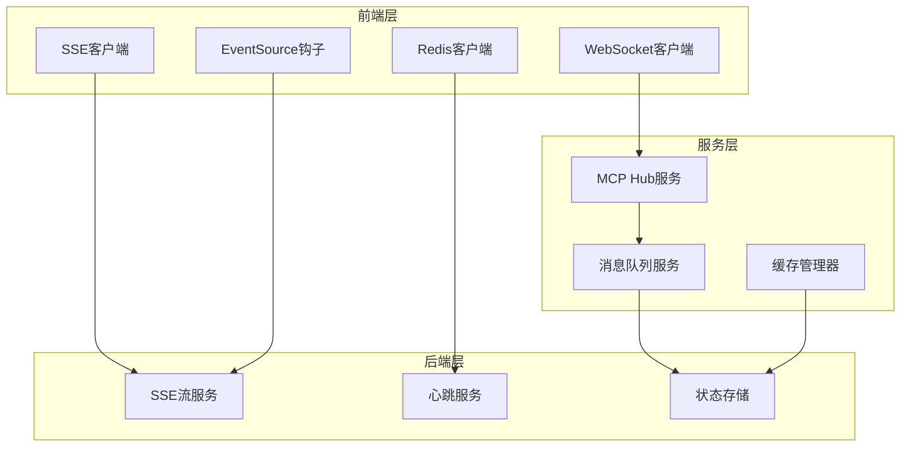

**图表来源**
- [apps/web-evals/src/hooks/use-event-source.ts:1-102](file://apps/web-evals/src/hooks/use-event-source.ts#L1-L102)
- [src/services/mcp/McpHub.ts:1-800](file://src/services/mcp/McpHub.ts#L1-L800)
- [src/core/message-queue/MessageQueueService.ts:1-99](file://src/core/message-queue/MessageQueueService.ts#L1-L99)

**章节来源**
- [apps/web-evals/src/hooks/use-event-source.ts:1-102](file://apps/web-evals/src/hooks/use-event-source.ts#L1-L102)
- [src/services/mcp/McpHub.ts:1-800](file://src/services/mcp/McpHub.ts#L1-L800)
- [src/core/message-queue/MessageQueueService.ts:1-99](file://src/core/message-queue/MessageQueueService.ts#L1-L99)

## 核心组件

### 实时通信组件

系统实现了多层次的实时通信机制，包括WebSocket、Server-Sent Events (SSE)和EventSource。

#### SSE流管理器
SSE流管理器提供了可靠的数据推送机制，支持自动重连和错误处理：

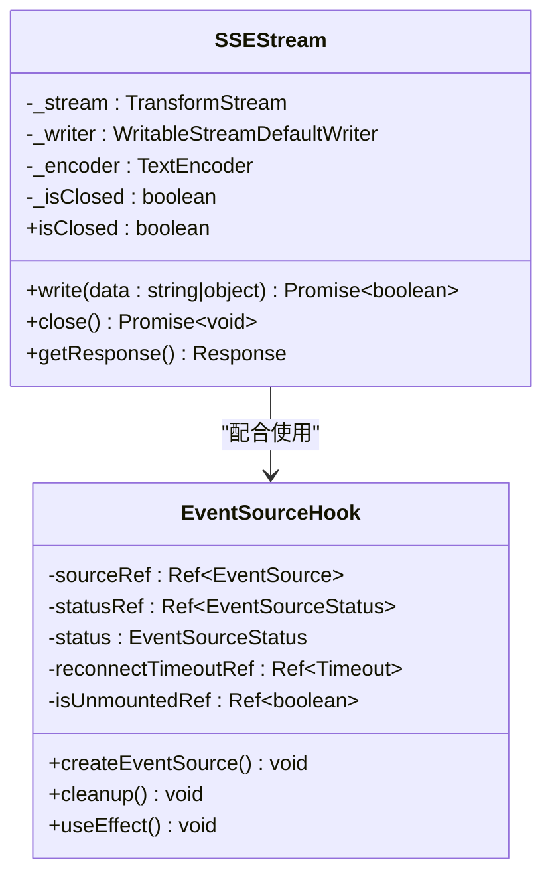

**图表来源**
- [apps/web-evals/src/lib/server/sse-stream.ts:1-60](file://apps/web-evals/src/lib/server/sse-stream.ts#L1-L60)
- [apps/web-evals/src/hooks/use-event-source.ts:1-102](file://apps/web-evals/src/hooks/use-event-source.ts#L1-L102)

#### MCP Hub连接管理
MCP Hub提供了统一的连接管理，支持多种传输协议：

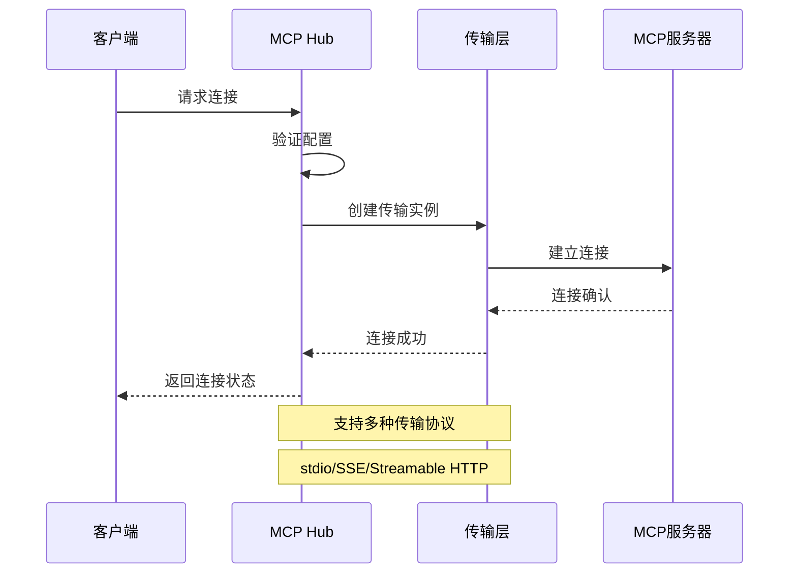

**图表来源**
- [src/services/mcp/McpHub.ts:656-800](file://src/services/mcp/McpHub.ts#L656-L800)

**章节来源**
- [apps/web-evals/src/lib/server/sse-stream.ts:1-60](file://apps/web-evals/src/lib/server/sse-stream.ts#L1-L60)
- [apps/web-evals/src/hooks/use-event-source.ts:1-102](file://apps/web-evals/src/hooks/use-event-source.ts#L1-L102)
- [src/services/mcp/McpHub.ts:1-800](file://src/services/mcp/McpHub.ts#L1-L800)

### 状态管理组件

#### 消息队列服务
消息队列服务提供了事件驱动的状态管理机制：

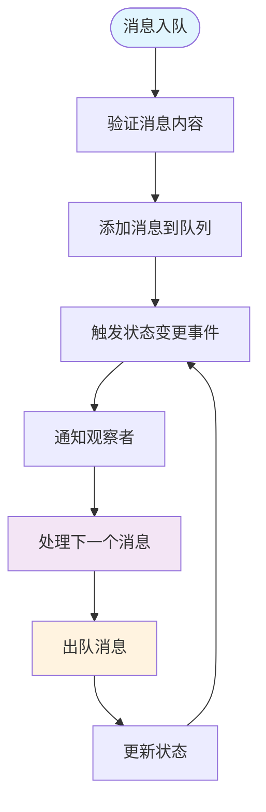

**图表来源**
- [src/core/message-queue/MessageQueueService.ts:36-84](file://src/core/message-queue/MessageQueueService.ts#L36-L84)

#### 事件发射器
类型安全的事件发射器确保了事件处理的一致性和可靠性：

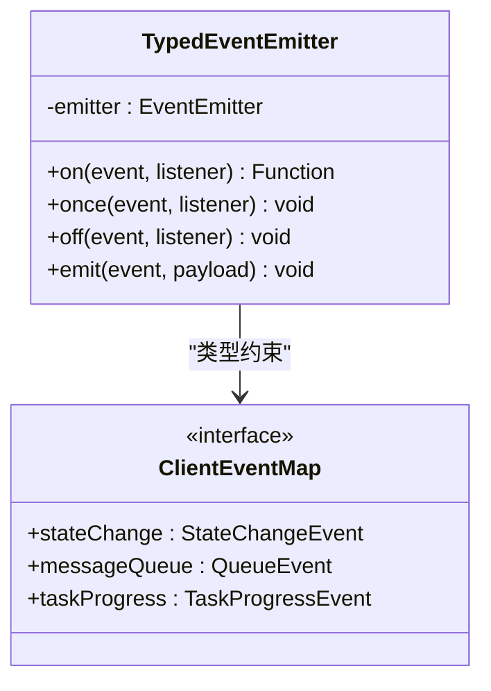

**图表来源**
- [apps/cli/src/agent/events.ts:151-195](file://apps/cli/src/agent/events.ts#L151-L195)

**章节来源**
- [src/core/message-queue/MessageQueueService.ts:1-99](file://src/core/message-queue/MessageQueueService.ts#L1-L99)
- [apps/cli/src/agent/events.ts:151-195](file://apps/cli/src/agent/events.ts#L151-L195)

### 缓存和持久化组件

#### 智能缓存管理器
缓存管理器提供了基于文件哈希的智能缓存策略：

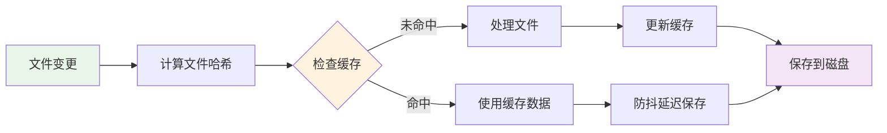

**图表来源**
- [src/services/code-index/cache-manager.ts:1-110](file://src/services/code-index/cache-manager.ts#L1-L110)

**章节来源**
- [src/services/code-index/cache-manager.ts:1-110](file://src/services/code-index/cache-manager.ts#L1-L110)

## 架构概览

Njust-AI的数据流管理架构采用了分层设计，确保了系统的可扩展性和可靠性：

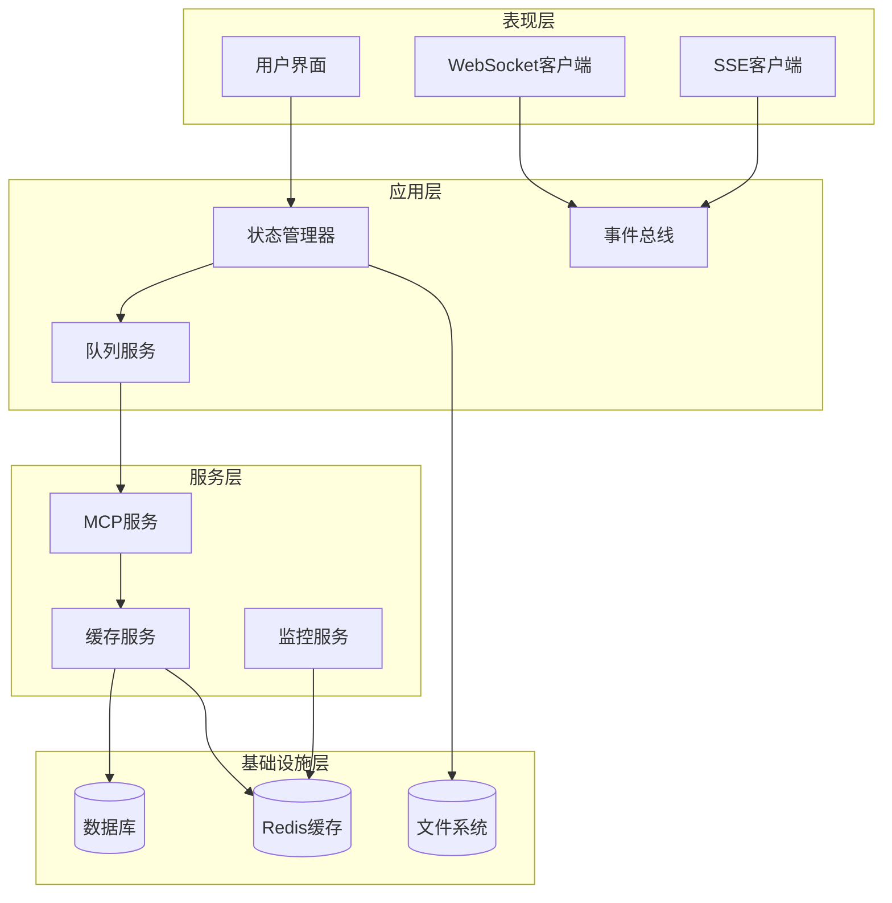

**图表来源**
- [src/services/mcp/McpHub.ts:1-800](file://src/services/mcp/McpHub.ts#L1-L800)
- [src/core/message-queue/MessageQueueService.ts:1-99](file://src/core/message-queue/MessageQueueService.ts#L1-L99)

## 详细组件分析

### 实时数据同步机制

#### 心跳检测系统
心跳检测系统确保了评估运行状态的实时监控：

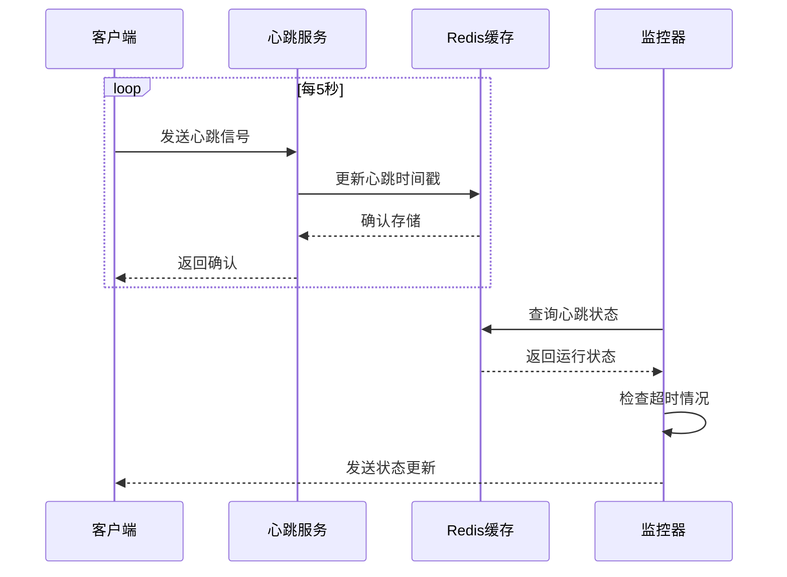

**图表来源**
- [apps/web-evals/src/actions/heartbeat.ts:1-9](file://apps/web-evals/src/actions/heartbeat.ts#L1-L9)

#### 数据格式化处理
系统支持多种数据格式的自动处理和转换：

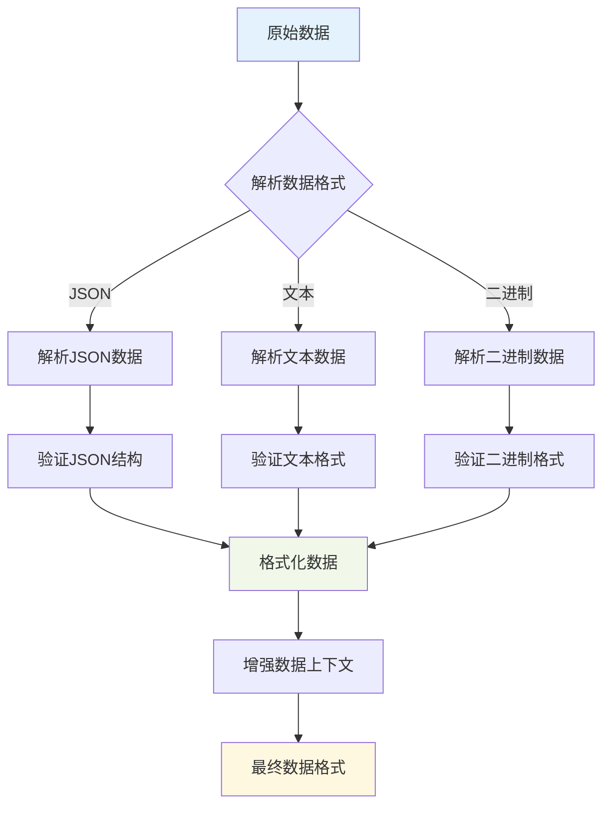

**图表来源**
- [apps/web-evals/src/lib/server/sse-stream.ts:13-28](file://apps/web-evals/src/lib/server/sse-stream.ts#L13-L28)

**章节来源**
- [apps/web-evals/src/actions/heartbeat.ts:1-9](file://apps/web-evals/src/actions/heartbeat.ts#L1-L9)
- [apps/web-evals/src/lib/server/sse-stream.ts:1-60](file://apps/web-evals/src/lib/server/sse-stream.ts#L1-L60)

### 错误处理和恢复机制

#### 断路器模式实现
系统实现了断路器模式来处理网络异常和服务器故障：

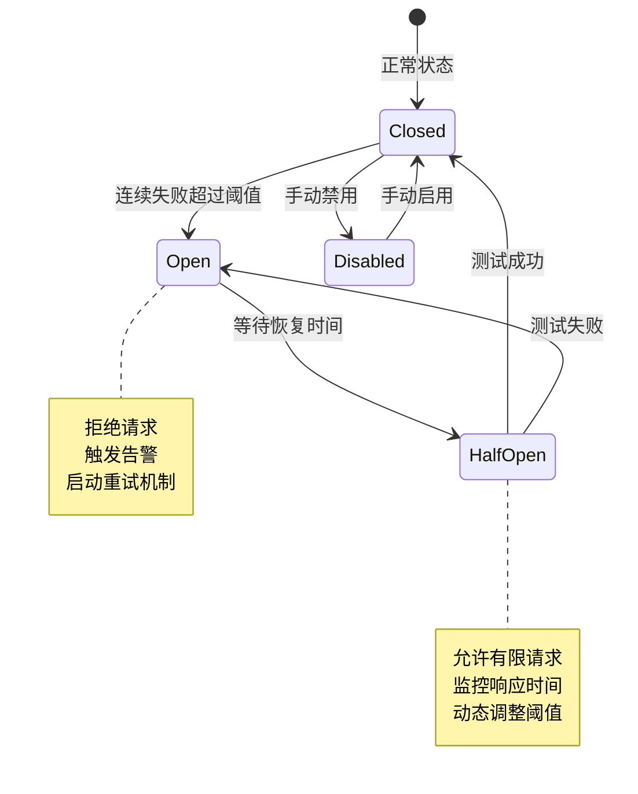

#### 自动重连策略
EventSource实现了智能的自动重连机制：

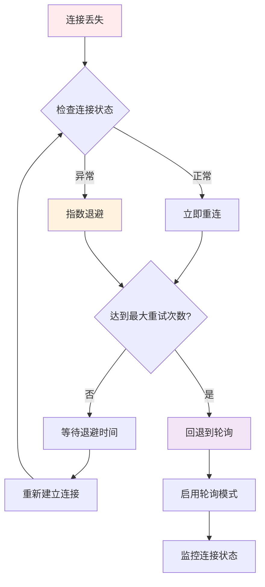

**图表来源**
- [apps/web-evals/src/hooks/use-event-source.ts:62-79](file://apps/web-evals/src/hooks/use-event-source.ts#L62-L79)

**章节来源**
- [apps/web-evals/src/hooks/use-event-source.ts:1-102](file://apps/web-evals/src/hooks/use-event-source.ts#L1-L102)

### 离线处理和数据一致性

#### 离线队列管理
系统提供了完整的离线数据处理能力：

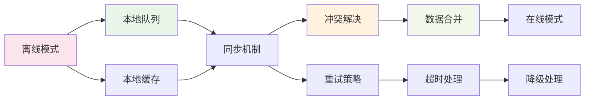

**图表来源**
- [src/core/message-queue/MessageQueueService.ts:17-99](file://src/core/message-queue/MessageQueueService.ts#L17-L99)

**章节来源**
- [src/core/message-queue/MessageQueueService.ts:1-99](file://src/core/message-queue/MessageQueueService.ts#L1-L99)

## 依赖关系分析

### 组件间依赖关系

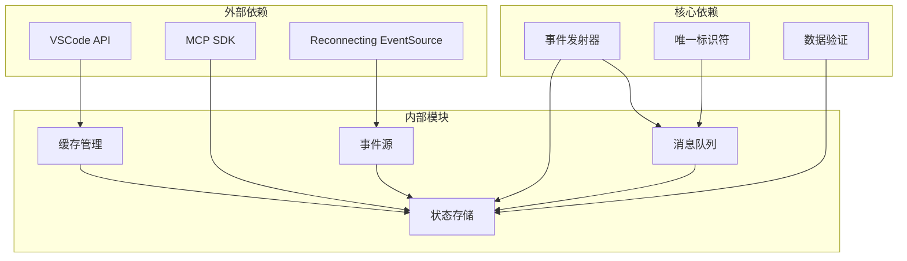

**图表来源**
- [src/core/message-queue/MessageQueueService.ts:1-99](file://src/core/message-queue/MessageQueueService.ts#L1-L99)
- [src/services/mcp/McpHub.ts:1-800](file://src/services/mcp/McpHub.ts#L1-L800)

### 数据流依赖链

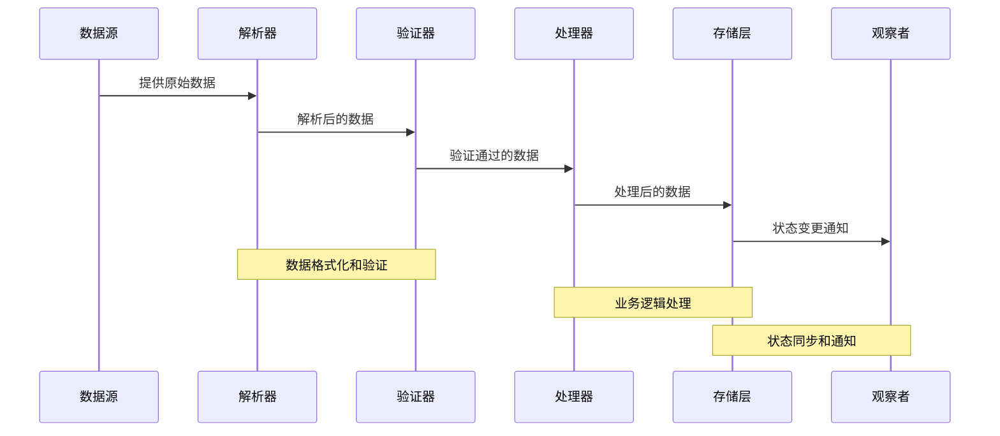

**图表来源**
- [apps/cli/src/commands/cli/stdin-stream.ts:483-536](file://apps/cli/src/commands/cli/stdin-stream.ts#L483-L536)

**章节来源**
- [src/core/message-queue/MessageQueueService.ts:1-99](file://src/core/message-queue/MessageQueueService.ts#L1-L99)
- [apps/cli/src/commands/cli/stdin-stream.ts:483-536](file://apps/cli/src/commands/cli/stdin-stream.ts#L483-L536)

## 性能考虑

### 缓存策略优化

系统采用了多层次的缓存策略来提升性能：

1. **智能缓存失效**: 基于文件哈希的缓存失效机制，确保数据一致性
2. **防抖延迟保存**: 使用防抖机制减少磁盘I/O操作
3. **内存缓存优先**: 优先使用内存缓存，磁盘缓存作为后备

### 连接池管理

MCP Hub实现了高效的连接池管理：

- **连接复用**: 复用现有的MCP连接，避免频繁建立新连接
- **超时控制**: 设置合理的连接超时时间，防止资源泄露
- **错误隔离**: 单个连接的错误不影响其他连接的正常工作

### 内存管理

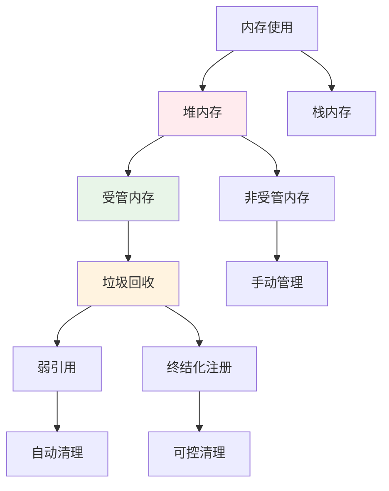

**图表来源**
- [src/services/code-index/cache-manager.ts:28-31](file://src/services/code-index/cache-manager.ts#L28-L31)

## 故障排除指南

### 常见问题诊断

#### 连接问题排查
1. **检查网络连接**: 确保客户端能够访问服务器
2. **验证认证信息**: 检查API密钥和访问令牌
3. **查看防火墙设置**: 确认端口未被阻止

#### 性能问题诊断
1. **监控内存使用**: 使用性能分析工具检查内存泄漏
2. **分析CPU使用率**: 查找性能瓶颈的代码段
3. **检查网络延迟**: 监控请求响应时间

#### 缓存问题处理
1. **验证缓存一致性**: 检查缓存数据是否过期
2. **清理损坏缓存**: 删除有问题的缓存文件
3. **调整缓存策略**: 根据使用模式优化缓存配置

**章节来源**
- [src/services/mcp/McpHub.ts:736-782](file://src/services/mcp/McpHub.ts#L736-L782)

### 错误恢复流程

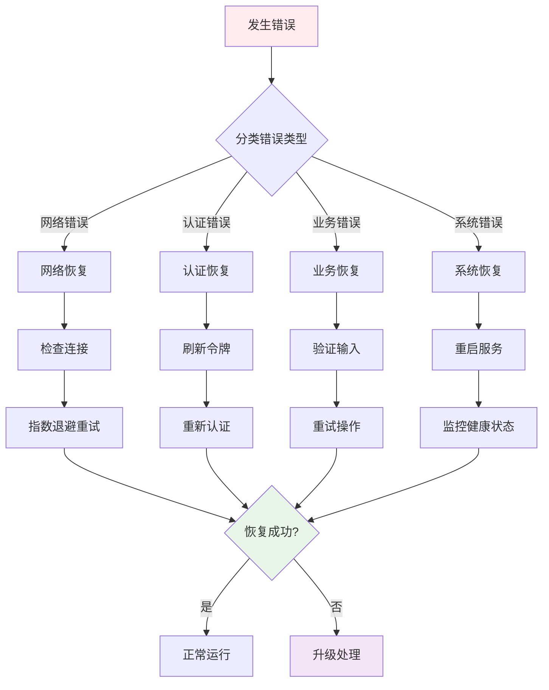

## 结论

Njust-AI的数据流管理系统展现了现代软件架构的最佳实践。通过多层次的实时通信机制、智能的缓存策略和完善的错误处理体系，系统实现了高可用性和高性能的数据流管理。

### 主要优势

1. **模块化设计**: 清晰的组件分离和职责划分
2. **实时性保障**: 多种实时通信协议的支持
3. **可靠性保证**: 完善的错误处理和恢复机制
4. **性能优化**: 智能缓存和连接池管理
5. **可扩展性**: 灵活的架构设计支持功能扩展

### 未来改进方向

1. **监控增强**: 集成更全面的性能监控指标
2. **自动化运维**: 实现更智能的故障自愈能力
3. **安全性加强**: 增强数据传输和存储的安全性
4. **用户体验**: 优化实时反馈和状态展示

该系统为评估应用提供了坚实的数据流基础，能够有效支撑复杂的实时数据处理需求。