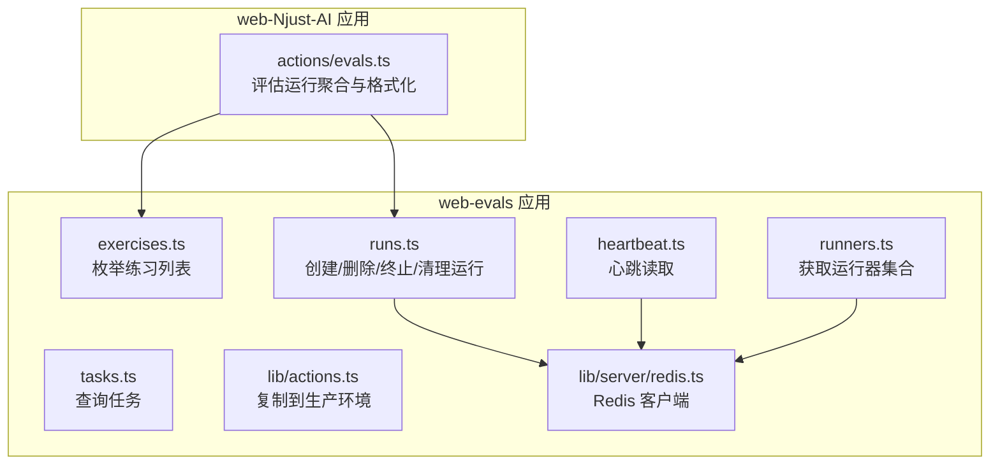
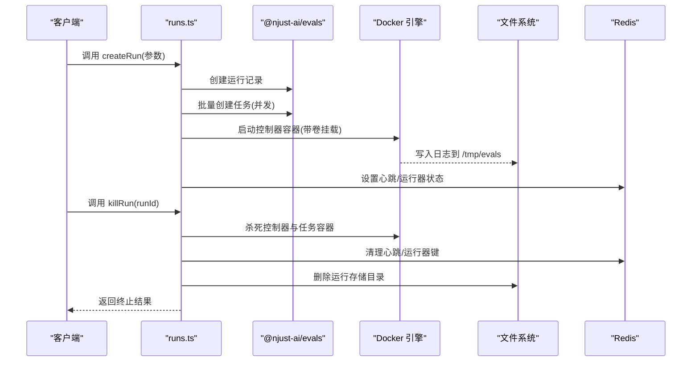
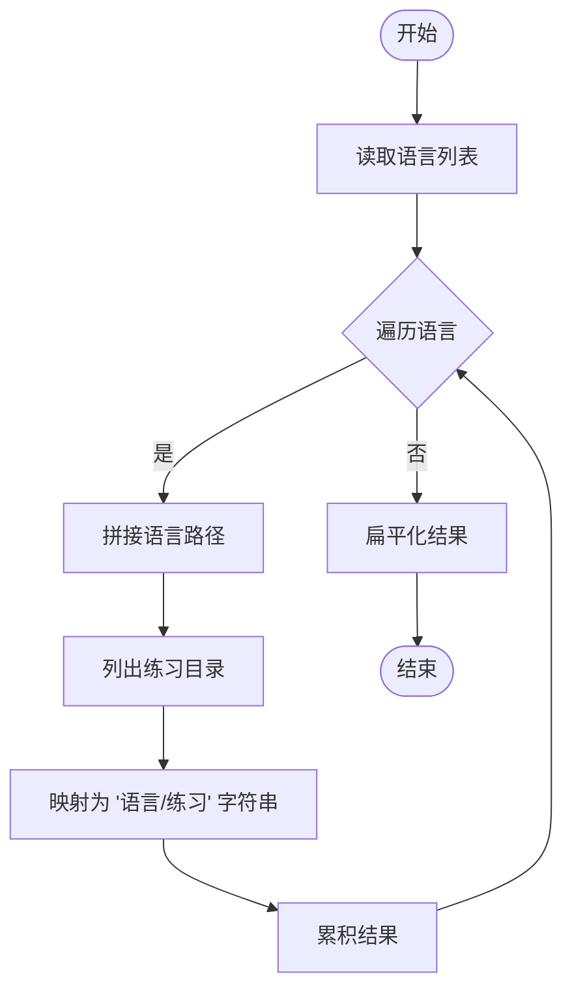
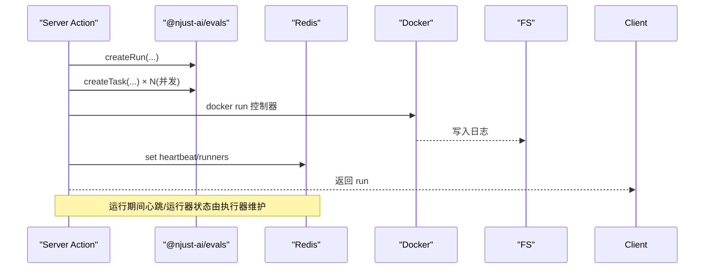
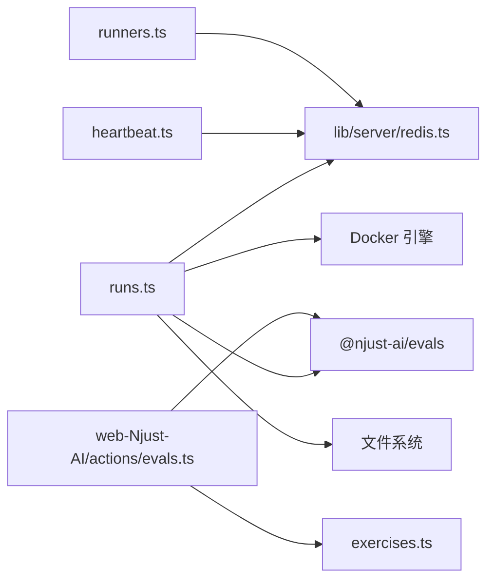

# 服务器端操作

<cite>
**本文引用的文件**
- [apps/web-evals/src/actions/exercises.ts](file://apps/web-evals/src/actions/exercises.ts)
- [apps/web-evals/src/actions/runners.ts](file://apps/web-evals/src/actions/runners.ts)
- [apps/web-evals/src/actions/runs.ts](file://apps/web-evals/src/actions/runs.ts)
- [apps/web-evals/src/actions/tasks.ts](file://apps/web-evals/src/actions/tasks.ts)
- [apps/web-evals/src/actions/heartbeat.ts](file://apps/web-evals/src/actions/heartbeat.ts)
- [apps/web-evals/src/lib/actions.ts](file://apps/web-evals/src/lib/actions.ts)
- [apps/web-evals/src/lib/server/redis.ts](file://apps/web-evals/src/lib/server/redis.ts)
- [apps/web-Njust-AI/src/actions/evals.ts](file://apps/web-Njust-AI/src/actions/evals.ts)
</cite>

## 目录
1. [简介](#简介)
2. [项目结构](#项目结构)
3. [核心组件](#核心组件)
4. [架构总览](#架构总览)
5. [详细组件分析](#详细组件分析)
6. [依赖关系分析](#依赖关系分析)
7. [性能考虑](#性能考虑)
8. [故障排查指南](#故障排查指南)
9. [结论](#结论)
10. [附录](#附录)

## 简介
本文件面向服务器端操作的开发与维护，系统性阐述以下主题：
- Next.js Server Actions 的使用模式与最佳实践
- 数据验证与安全处理机制
- 评估操作的服务器端实现、数据库交互与文件处理流程
- 错误处理、事务管理与性能优化策略
- 评估练习的创建、运行管理与心跳检测机制
- 具体服务器端操作示例与可复用的最佳实践

## 项目结构
本项目的服务器端操作主要集中在两个应用中：
- web-evals：评估运行生命周期管理（创建、删除、终止、清理）、任务与练习枚举、心跳监控与Redis状态管理
- web-Njust-AI：评估结果聚合与展示（筛选、解析设置、格式化分数）

图表来源
- [apps/web-evals/src/actions/exercises.ts:1-23](file://apps/web-evals/src/actions/exercises.ts#L1-L23)
- [apps/web-evals/src/actions/runs.ts:1-378](file://apps/web-evals/src/actions/runs.ts#L1-L378)
- [apps/web-evals/src/actions/tasks.ts:1-12](file://apps/web-evals/src/actions/tasks.ts#L1-L12)
- [apps/web-evals/src/actions/heartbeat.ts:1-9](file://apps/web-evals/src/actions/heartbeat.ts#L1-L9)
- [apps/web-evals/src/actions/runners.ts:1-9](file://apps/web-evals/src/actions/runners.ts#L1-L9)
- [apps/web-evals/src/lib/actions.ts:1-20](file://apps/web-evals/src/lib/actions.ts#L1-L20)
- [apps/web-evals/src/lib/server/redis.ts:1-14](file://apps/web-evals/src/lib/server/redis.ts#L1-L14)
- [apps/web-Njust-AI/src/actions/evals.ts:1-30](file://apps/web-Njust-AI/src/actions/evals.ts#L1-L30)

章节来源
- [apps/web-evals/src/actions/exercises.ts:1-23](file://apps/web-evals/src/actions/exercises.ts#L1-L23)
- [apps/web-evals/src/actions/runs.ts:1-378](file://apps/web-evals/src/actions/runs.ts#L1-L378)
- [apps/web-evals/src/actions/tasks.ts:1-12](file://apps/web-evals/src/actions/tasks.ts#L1-L12)
- [apps/web-evals/src/actions/heartbeat.ts:1-9](file://apps/web-evals/src/actions/heartbeat.ts#L1-L9)
- [apps/web-evals/src/actions/runners.ts:1-9](file://apps/web-evals/src/actions/runners.ts#L1-L9)
- [apps/web-evals/src/lib/actions.ts:1-20](file://apps/web-evals/src/lib/actions.ts#L1-L20)
- [apps/web-evals/src/lib/server/redis.ts:1-14](file://apps/web-evals/src/lib/server/redis.ts#L1-L14)
- [apps/web-Njust-AI/src/actions/evals.ts:1-30](file://apps/web-Njust-AI/src/actions/evals.ts#L1-L30)

## 核心组件
- Server Actions 文件均以 "use server" 开头，明确声明为服务器端执行函数，支持在客户端通过表单或直接调用触发服务端逻辑。
- 关键模块职责：
  - exercises.ts：枚举可用语言下的练习目录，返回扁平化的练习路径列表
  - runs.ts：创建运行、批量创建任务、启动容器化执行器、终止运行、清理存储与Redis状态、更新描述等
  - tasks.ts：按运行ID查询任务列表，并触发Next缓存失效
  - heartbeat.ts：从Redis读取心跳值，用于监控运行状态
  - runners.ts：从Redis读取某运行的运行器集合
  - lib/server/redis.ts：延迟初始化Redis连接，统一错误事件处理
  - lib/actions.ts：将指定运行复制到生产数据库
  - web-Njust-AI/actions/evals.ts：聚合评估运行，校验设置、格式化分数与语言得分

章节来源
- [apps/web-evals/src/actions/exercises.ts:1-23](file://apps/web-evals/src/actions/exercises.ts#L1-L23)
- [apps/web-evals/src/actions/runs.ts:1-378](file://apps/web-evals/src/actions/runs.ts#L1-L378)
- [apps/web-evals/src/actions/tasks.ts:1-12](file://apps/web-evals/src/actions/tasks.ts#L1-L12)
- [apps/web-evals/src/actions/heartbeat.ts:1-9](file://apps/web-evals/src/actions/heartbeat.ts#L1-L9)
- [apps/web-evals/src/actions/runners.ts:1-9](file://apps/web-evals/src/actions/runners.ts#L1-L9)
- [apps/web-evals/src/lib/server/redis.ts:1-14](file://apps/web-evals/src/lib/server/redis.ts#L1-L14)
- [apps/web-evals/src/lib/actions.ts:1-20](file://apps/web-evals/src/lib/actions.ts#L1-L20)
- [apps/web-Njust-AI/src/actions/evals.ts:1-30](file://apps/web-Njust-AI/src/actions/evals.ts#L1-L30)

## 架构总览
下图展示了评估运行的全生命周期与关键交互点：

图表来源
- [apps/web-evals/src/actions/runs.ts:31-128](file://apps/web-evals/src/actions/runs.ts#L31-L128)
- [apps/web-evals/src/lib/server/redis.ts:1-14](file://apps/web-evals/src/lib/server/redis.ts#L1-L14)

## 详细组件分析

### 组件一：练习枚举（exercises.ts）
- 功能要点
  - 遍历支持的语言列表，拼接仓库路径，读取各语言下的练习目录
  - 将每个练习路径格式化为 "语言/练习名" 的字符串列表
- 数据流
  - 输入：语言数组（来自 evals 包）
  - 输出：扁平化的练习路径数组
- 复杂度
  - 时间复杂度：O(L × E)，其中 L 为语言数，E 为每语言平均练习数
  - 空间复杂度：O(L × E)
- 安全与验证
  - 未进行输入校验；建议在上层调用处对语言与路径进行白名单校验

图表来源
- [apps/web-evals/src/actions/exercises.ts:12-22](file://apps/web-evals/src/actions/exercises.ts#L12-L22)

章节来源
- [apps/web-evals/src/actions/exercises.ts:1-23](file://apps/web-evals/src/actions/exercises.ts#L1-L23)

### 组件二：运行管理（runs.ts）
- 功能要点
  - createRun：创建运行、根据套件类型批量创建任务、并发写入、启动容器化执行器、记录日志、触发Next缓存失效
  - killRun：先杀控制器，等待后杀任务容器，清理Redis心跳与运行器键
  - deleteIncompleteRuns/deleteOldRuns：清理不完整或过期运行（数据库+存储+Redis）
  - updateRunDescription：更新运行描述并失效缓存
- 数据流与外部依赖
  - 依赖 @njust-ai/evals 提供的运行/任务 CRUD 与查询接口
  - 使用 Redis 存储心跳与运行器集合
  - 使用 Docker 运行控制器与任务容器，挂载日志卷
  - 使用文件系统清理运行存储目录
- 并发与性能
  - 任务创建采用并发限制（p-map 并发度 10），避免资源争用
  - 日志输出通过子进程标准输出/错误流重定向到文件
- 错误处理
  - 对容器操作、Redis清理、存储删除分别捕获异常并记录
  - 返回结构化结果，便于前端展示

图表来源
- [apps/web-evals/src/actions/runs.ts:31-128](file://apps/web-evals/src/actions/runs.ts#L31-L128)
- [apps/web-evals/src/lib/server/redis.ts:1-14](file://apps/web-evals/src/lib/server/redis.ts#L1-L14)

章节来源
- [apps/web-evals/src/actions/runs.ts:1-378](file://apps/web-evals/src/actions/runs.ts#L1-L378)

### 组件三：任务查询（tasks.ts）
- 功能要点
  - 按运行ID查询任务列表，并触发Next缓存失效
- 使用场景
  - 在运行详情页或任务列表页刷新数据

章节来源
- [apps/web-evals/src/actions/tasks.ts:1-12](file://apps/web-evals/src/actions/tasks.ts#L1-L12)

### 组件四：心跳与运行器（heartbeat.ts、runners.ts）
- 功能要点
  - getHeartbeat：读取 Redis 中 heartbeat:<runId> 的值，用于前端轮询显示
  - getRunners：读取 Redis 中 runners:<runId> 的集合，标识当前活跃运行器
- 适用场景
  - 实时监控运行状态、统计活跃执行器数量

章节来源
- [apps/web-evals/src/actions/heartbeat.ts:1-9](file://apps/web-evals/src/actions/heartbeat.ts#L1-L9)
- [apps/web-evals/src/actions/runners.ts:1-9](file://apps/web-evals/src/actions/runners.ts#L1-L9)
- [apps/web-evals/src/lib/server/redis.ts:1-14](file://apps/web-evals/src/lib/server/redis.ts#L1-L14)

### 组件五：复制到生产（lib/actions.ts）
- 功能要点
  - 将指定运行从源数据库复制到生产数据库
  - 返回成功/失败信息，便于前端反馈
- 安全与验证
  - 建议在调用前进行权限校验与运行存在性检查

章节来源
- [apps/web-evals/src/lib/actions.ts:1-20](file://apps/web-evals/src/lib/actions.ts#L1-L20)

### 组件六：评估运行聚合（web-Njust-AI/evals.ts）
- 功能要点
  - 获取所有运行，过滤已产生任务指标的运行
  - 使用 NjustAiSettingsSchema 校验设置有效性
  - 计算通过率作为分数，格式化标签与语言得分
- 数据流
  - 输入：getRuns() 返回的运行列表
  - 输出：标准化后的运行对象数组

章节来源
- [apps/web-Njust-AI/src/actions/evals.ts:1-30](file://apps/web-Njust-AI/src/actions/evals.ts#L1-L30)

## 依赖关系分析
- 内部依赖
  - runs.ts 依赖 @njust-ai/evals 的运行/任务接口与并发工具 p-map
  - 所有Redis相关操作依赖 lib/server/redis.ts 提供的客户端
- 外部依赖
  - Docker：用于容器化执行器
  - 文件系统：用于日志与运行存储目录管理
  - Redis：用于心跳与运行器状态持久化

图表来源
- [apps/web-evals/src/actions/runs.ts:11-25](file://apps/web-evals/src/actions/runs.ts#L11-L25)
- [apps/web-evals/src/lib/server/redis.ts:1-14](file://apps/web-evals/src/lib/server/redis.ts#L1-L14)
- [apps/web-Njust-AI/src/actions/evals.ts:3-6](file://apps/web-Njust-AI/src/actions/evals.ts#L3-L6)
- [apps/web-evals/src/actions/heartbeat.ts:3](file://apps/web-evals/src/actions/heartbeat.ts#L3)
- [apps/web-evals/src/actions/runners.ts:3](file://apps/web-evals/src/actions/runners.ts#L3)

## 性能考虑
- 并发控制
  - 任务创建使用 p-map 并发度 10，平衡吞吐与资源占用
- I/O 优化
  - 子进程日志直接写入文件，减少内存占用
  - 批量删除运行时逐个清理存储与Redis，避免阻塞主线程
- 缓存与失效
  - 关键操作后调用 revalidatePath 触发Next缓存失效，保证数据一致性
- 资源隔离
  - Docker 容器网络与卷挂载确保执行环境隔离与日志持久化

## 故障排查指南
- 容器无法启动或无日志
  - 检查 Docker 是否可用、网络名称是否正确、卷挂载路径是否存在
  - 查看 /tmp/Njust-AI-evals.log 与容器日志
- Redis 连接失败
  - 确认 REDIS_URL 环境变量、Redis 服务可达性
  - 观察 lib/server/redis.ts 的错误事件日志
- 运行无法终止
  - 确认容器命名规范（控制器与任务容器）是否匹配
  - 检查 killRun 的返回结果与错误列表
- 存储清理失败
  - 检查运行存储目录权限与磁盘空间
  - 关注 deleteIncompleteRuns/deleteOldRuns 的存储错误列表

章节来源
- [apps/web-evals/src/actions/runs.ts:152-230](file://apps/web-evals/src/actions/runs.ts#L152-L230)
- [apps/web-evals/src/lib/server/redis.ts:5-13](file://apps/web-evals/src/lib/server/redis.ts#L5-L13)

## 结论
本项目通过 Server Actions 将业务逻辑集中于服务端，结合 @njust-ai/evals 的运行/任务模型、Docker 执行器、Redis 状态管理与文件系统存储，构建了完整的评估运行生命周期管理方案。建议在生产环境中强化输入校验、完善权限控制与审计日志，并持续优化并发与I/O策略。

## 附录
- 最佳实践清单
  - 输入校验：对路径、语言、运行ID等进行白名单校验
  - 权限控制：在调用前进行用户身份与资源访问授权
  - 错误分类：区分可恢复与不可恢复错误，提供重试与降级策略
  - 监控告警：心跳缺失、容器异常退出、存储清理失败需触发告警
  - 安全加固：限制容器权限、最小化卷挂载范围、定期轮换密钥与凭据