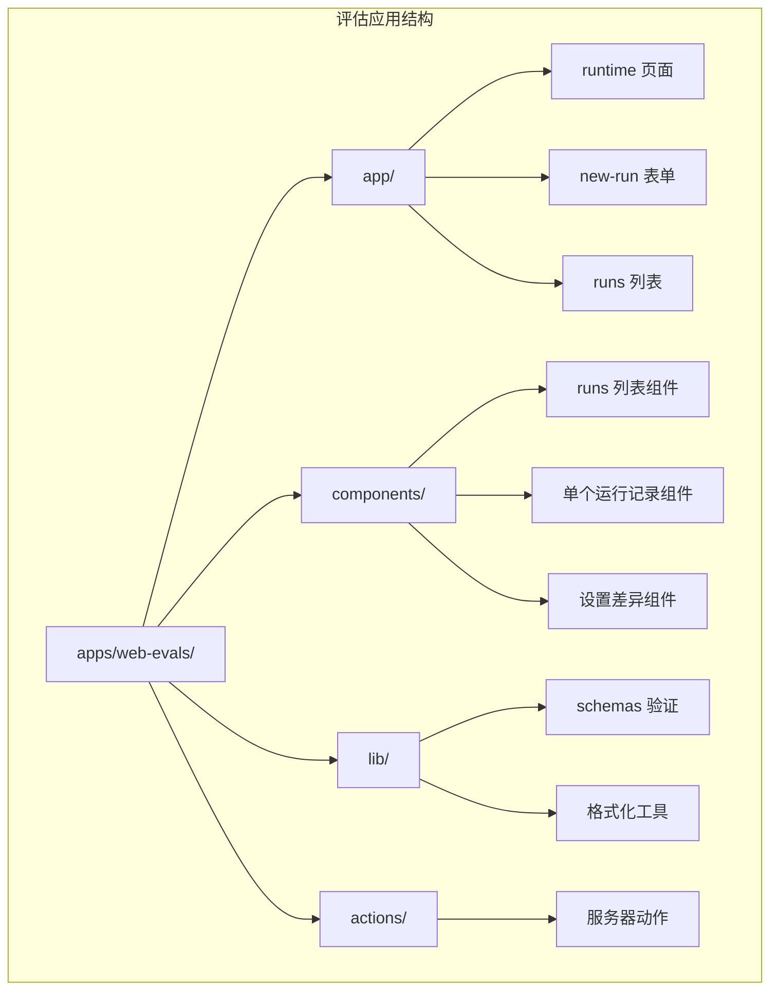
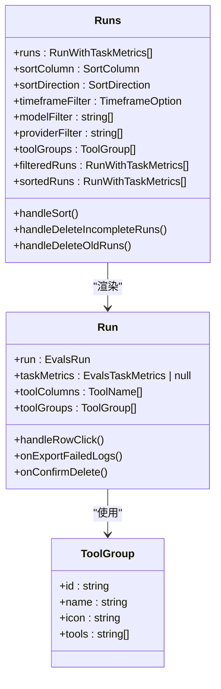
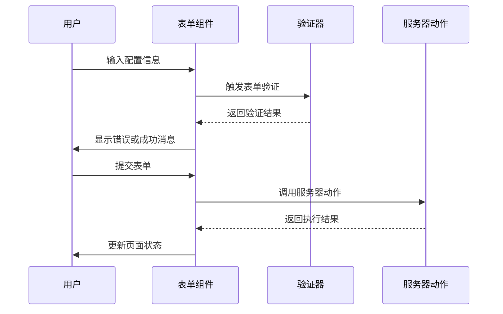
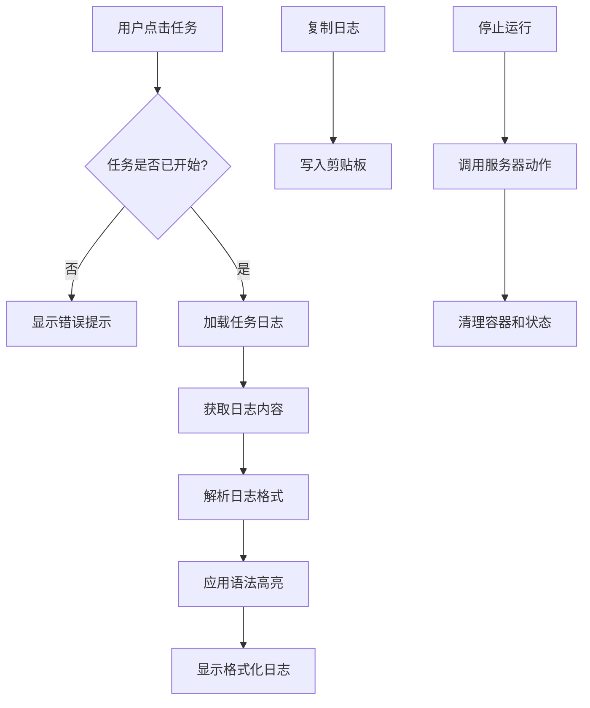
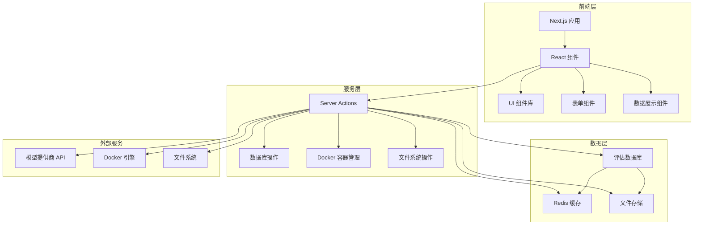
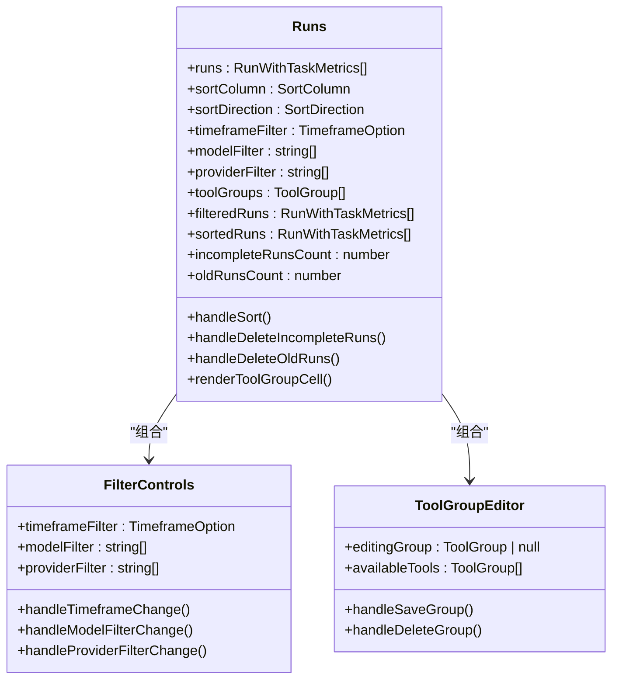
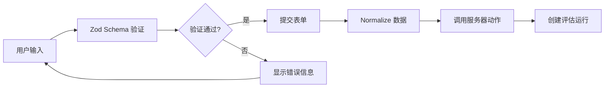
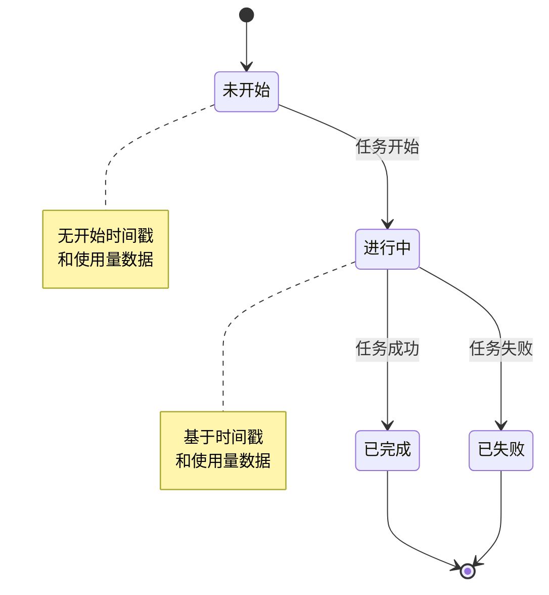
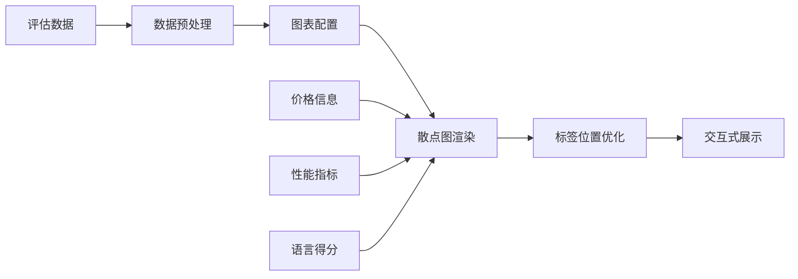
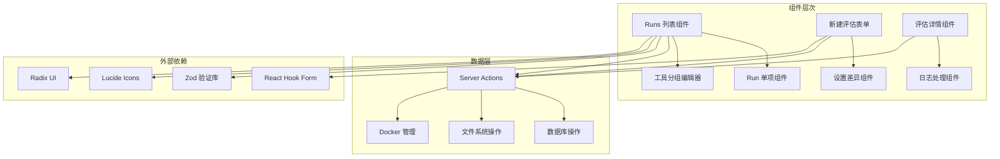

# 评估 UI 组件

<cite>
**本文档引用的文件**
- [apps/web-evals/src/app/runs/[id]/run.tsx](file://apps/web-evals/src/app/runs/[id]/run.tsx)
- [apps/web-evals/src/components/home/runs.tsx](file://apps/web-evals/src/components/home/runs.tsx)
- [apps/web-evals/src/components/home/run.tsx](file://apps/web-evals/src/components/home/run.tsx)
- [apps/web-evals/src/app/runs/new/new-run.tsx](file://apps/web-evals/src/app/runs/new/new-run.tsx)
- [apps/web-evals/src/app/runs/new/settings-diff.tsx](file://apps/web-evals/src/app/runs/new/settings-diff.tsx)
- [apps/web-evals/src/lib/schemas.ts](file://apps/web-evals/src/lib/schemas.ts)
- [apps/web-evals/src/actions/runs.ts](file://apps/web-evals/src/actions/runs.ts)
- [apps/web-Njust-AI/src/app/evals/evals.tsx](file://apps/web-Njust-AI/src/app/evals/evals.tsx)
- [apps/web-Njust-AI/src/app/evals/plot.tsx](file://apps/web-Njust-AI/src/app/evals/plot.tsx)
</cite>

## 目录
1. [简介](#简介)
2. [项目结构](#项目结构)
3. [核心组件](#核心组件)
4. [架构概览](#架构概览)
5. [详细组件分析](#详细组件分析)
6. [依赖关系分析](#依赖关系分析)
7. [性能考虑](#性能考虑)
8. [故障排除指南](#故障排除指南)
9. [结论](#结论)

## 简介

本文件为评估 UI 组件的详细技术文档，专注于评估应用专用的 UI 组件设计、表单处理和数据展示模式。文档深入解释了 Runs 组件、Home 页面布局和评估结果展示组件的实现细节，包括表单验证、数据绑定和状态管理的实现方案。

评估系统采用 React + Next.js 架构，通过组件化设计实现了完整的评估流程管理，从评估配置到结果展示的全生命周期支持。

## 项目结构

评估 UI 组件主要分布在以下目录中：

**图表来源**
- [apps/web-evals/src/app/runs/[id]/run.tsx](file://apps/web-evals/src/app/runs/[id]/run.tsx#L1-L1059)
- [apps/web-evals/src/components/home/runs.tsx:1-1025](file://apps/web-evals/src/components/home/runs.tsx#L1-L1025)

**章节来源**
- [apps/web-evals/src/app/runs/[id]/run.tsx](file://apps/web-evals/src/app/runs/[id]/run.tsx#L1-L1059)
- [apps/web-evals/src/components/home/runs.tsx:1-1025](file://apps/web-evals/src/components/home/runs.tsx#L1-L1025)

## 核心组件

### Runs 列表组件

Runs 列表组件是评估系统的核心界面组件，提供了完整的评估运行记录管理和数据展示功能。

#### 主要特性
- **多维度筛选**：支持时间范围、模型、提供商等多条件筛选
- **动态排序**：支持按多个字段进行升序/降序排序
- **工具分组**：可自定义工具使用情况的分组展示
- **批量操作**：支持删除不完整或过期的评估运行
- **实时状态**：显示评估运行的实时状态和统计数据

#### 数据结构设计

**图表来源**
- [apps/web-evals/src/components/home/runs.tsx:315-595](file://apps/web-evals/src/components/home/runs.tsx#L315-L595)
- [apps/web-evals/src/components/home/run.tsx:62-434](file://apps/web-evals/src/components/home/run.tsx#L62-L434)

#### 状态管理模式

组件采用 React Hooks 实现状态管理，包括：

- **本地状态**：组件内部的状态管理（如筛选器、排序状态）
- **持久化状态**：使用 localStorage 存储用户偏好设置
- **服务器状态**：通过 Next.js Server Actions 管理服务器端数据

**章节来源**
- [apps/web-evals/src/components/home/runs.tsx:315-595](file://apps/web-evals/src/components/home/runs.tsx#L315-L595)
- [apps/web-evals/src/components/home/run.tsx:62-434](file://apps/web-evals/src/components/home/run.tsx#L62-L434)

### 新建评估表单组件

新建评估表单组件提供了完整的评估配置界面，支持多种模型提供商的选择和配置。

#### 表单设计模式

**图表来源**
- [apps/web-evals/src/app/runs/new/new-run.tsx:106-513](file://apps/web-evals/src/app/runs/new/new-run.tsx#L106-L513)

#### 多提供商支持

表单支持三种不同的模型提供商：

- **导入配置**：支持从外部 JSON 文件导入 API 配置
- **NJUST_AI Cloud**：支持直接使用云服务令牌
- **OpenRouter**：支持第三方模型平台集成

**章节来源**
- [apps/web-evals/src/app/runs/new/new-run.tsx:106-513](file://apps/web-evals/src/app/runs/new/new-run.tsx#L106-L513)
- [apps/web-evals/src/app/runs/new/settings-diff.tsx:1-59](file://apps/web-evals/src/app/runs/new/settings-diff.tsx#L1-L59)

### 评估详情展示组件

评估详情展示组件提供了详细的评估运行信息和日志查看功能。

#### 日志处理机制

**图表来源**
- [apps/web-evals/src/app/runs/[id]/run.tsx](file://apps/web-evals/src/app/runs/[id]/run.tsx#L397-L433)

#### 数据可视化组件

评估结果展示组件集成了数据可视化功能，用于直观展示评估结果。

**章节来源**
- [apps/web-evals/src/app/runs/[id]/run.tsx](file://apps/web-evals/src/app/runs/[id]/run.tsx#L246-L800)

## 架构概览

评估系统的整体架构采用分层设计，确保了良好的可维护性和扩展性。

**图表来源**
- [apps/web-evals/src/actions/runs.ts:31-128](file://apps/web-evals/src/actions/runs.ts#L31-L128)

### 数据流设计

评估系统采用单向数据流设计，确保了数据的一致性和可预测性：

1. **用户交互**：用户通过界面组件与系统交互
2. **状态更新**：组件状态通过 React Hooks 进行更新
3. **服务器通信**：通过 Server Actions 与后端服务通信
4. **数据持久化**：数据通过数据库和文件系统进行持久化
5. **状态同步**：通过 Next.js 的 revalidation 机制保持状态同步

**章节来源**
- [apps/web-evals/src/actions/runs.ts:31-128](file://apps/web-evals/src/actions/runs.ts#L31-L128)

## 详细组件分析

### Runs 列表组件深度分析

Runs 列表组件是评估系统的核心界面，实现了复杂的数据管理和用户交互功能。

#### 组件架构

**图表来源**
- [apps/web-evals/src/components/home/runs.tsx:315-655](file://apps/web-evals/src/components/home/runs.tsx#L315-L655)

#### 筛选和排序机制

组件实现了强大的筛选和排序功能：

- **时间范围筛选**：支持所有时间、24小时、7天、30天、90天等选项
- **多值筛选**：支持同时选择多个模型和提供商
- **动态排序**：支持按模型、提供商、通过率、失败数、成本、持续时间等字段排序
- **智能缓存**：使用 localStorage 缓存用户筛选偏好

#### 工具分组功能

工具分组功能允许用户将相关的工具使用情况进行聚合展示：

- **图标选择**：提供丰富的图标选项用于区分不同的工具组
- **动态编辑**：支持创建、编辑和删除工具组
- **智能分组**：自动排除已在其他组中的工具
- **统计计算**：对每个工具组的使用情况进行聚合统计

**章节来源**
- [apps/web-evals/src/components/home/runs.tsx:315-655](file://apps/web-evals/src/components/home/runs.tsx#L315-L655)

### 新建评估表单组件深度分析

新建评估表单组件提供了完整的评估配置界面，采用了现代化的表单处理模式。

#### 表单验证体系

表单使用 Zod 进行类型安全的验证，确保数据的完整性和正确性：

**图表来源**
- [apps/web-evals/src/lib/schemas.ts:28-44](file://apps/web-evals/src/lib/schemas.ts#L28-L44)

#### 多提供商集成

表单支持三种不同的模型提供商，每种都有特定的配置要求：

- **导入配置模式**：支持从 JSON 文件导入完整的 API 配置
- **NJUST_AI Cloud 模式**：需要有效的访问令牌
- **OpenRouter 模式**：支持第三方模型平台的直接集成

#### 语言和练习选择

表单提供了智能的语言和练习选择功能：

- **语言分组**：按编程语言对练习进行分组
- **批量选择**：支持一键选择整个语言的所有练习
- **部分套件**：支持选择特定的练习集合进行评估

**章节来源**
- [apps/web-evals/src/app/runs/new/new-run.tsx:106-513](file://apps/web-evals/src/app/runs/new/new-run.tsx#L106-L513)
- [apps/web-evals/src/lib/schemas.ts:28-44](file://apps/web-evals/src/lib/schemas.ts#L28-L44)

### 评估详情展示组件深度分析

评估详情展示组件提供了详细的评估运行信息和交互功能。

#### 日志处理和展示

组件实现了复杂的日志处理逻辑：

- **时间戳解析**：自动提取和格式化日志中的时间戳
- **语法高亮**：使用正则表达式对日志内容进行语法高亮
- **状态标识**：根据日志内容自动识别任务状态
- **格式化输出**：将原始日志转换为用户友好的格式

#### 实时状态监控

组件提供了实时的状态监控功能：

- **心跳检测**：通过 Redis 实时检测评估运行状态
- **容器管理**：支持停止正在运行的评估容器
- **进度跟踪**：显示评估运行的实时进度和统计数据

#### 任务状态分类

组件实现了智能的任务状态分类：

**图表来源**
- [apps/web-evals/src/app/runs/[id]/run.tsx](file://apps/web-evals/src/app/runs/[id]/run.tsx#L563-L595)

**章节来源**
- [apps/web-evals/src/app/runs/[id]/run.tsx](file://apps/web-evals/src/app/runs/[id]/run.tsx#L246-L800)

### 结果展示组件深度分析

web-Njust-AI 应用中的评估结果展示组件提供了专业的数据可视化功能。

#### 数据可视化设计

**图表来源**
- [apps/web-Njust-AI/src/app/evals/evals.tsx:12-150](file://apps/web-Njust-AI/src/app/evals/evals.tsx#L12-L150)
- [apps/web-Njust-AI/src/app/evals/plot.tsx:1-42](file://apps/web-Njust-AI/src/app/evals/plot.tsx#L1-L42)

#### 可视化组件实现

评估结果展示组件包含了专门的可视化组件：

- **散点图**：展示评估结果的成本和性能关系
- **标签优化**：自动避免标签重叠，提升可读性
- **响应式设计**：适配不同屏幕尺寸的显示需求

**章节来源**
- [apps/web-Njust-AI/src/app/evals/evals.tsx:12-150](file://apps/web-Njust-AI/src/app/evals/evals.tsx#L12-L150)
- [apps/web-Njust-AI/src/app/evals/plot.tsx:1-42](file://apps/web-Njust-AI/src/app/evals/plot.tsx#L1-L42)

## 依赖关系分析

评估 UI 组件之间的依赖关系体现了清晰的分层架构设计。

**图表来源**
- [apps/web-evals/src/components/home/runs.tsx:1-1025](file://apps/web-evals/src/components/home/runs.tsx#L1-L1025)
- [apps/web-evals/src/app/runs/new/new-run.tsx:1-1084](file://apps/web-evals/src/app/runs/new/new-run.tsx#L1-L1084)

### 关键依赖关系

1. **验证依赖**：所有表单组件都依赖 Zod 进行数据验证
2. **状态管理依赖**：组件间通过 React Hooks 和 Server Actions 进行状态同步
3. **UI 组件依赖**：统一使用 Radix UI 和自定义 UI 组件库
4. **图标依赖**：使用 Lucide Icons 提供一致的图标系统

**章节来源**
- [apps/web-evals/src/components/home/runs.tsx:1-1025](file://apps/web-evals/src/components/home/runs.tsx#L1-L1025)
- [apps/web-evals/src/app/runs/new/new-run.tsx:1-1084](file://apps/web-evals/src/app/runs/new/new-run.tsx#L1-L1084)

## 性能考虑

评估 UI 组件在设计时充分考虑了性能优化，采用了多种策略来确保良好的用户体验。

### 渲染优化

- **虚拟滚动**：对于大量数据的列表，采用虚拟滚动技术减少 DOM 元素数量
- **懒加载**：图片和大型组件采用懒加载策略
- **防抖处理**：搜索和筛选操作使用防抖技术减少不必要的重新渲染
- **记忆化**：使用 useMemo 和 useCallback 优化昂贵的计算和函数创建

### 数据加载优化

- **增量加载**：支持分页和增量加载大量评估数据
- **缓存策略**：合理使用浏览器缓存和服务器端缓存
- **并发控制**：限制同时进行的网络请求数量
- **状态恢复**：在网络中断后能够恢复之前的加载状态

### 内存管理

- **组件卸载清理**：及时清理事件监听器和定时器
- **大数据处理**：对大量数据进行分块处理，避免内存峰值
- **垃圾回收**：及时释放不再使用的对象引用

## 故障排除指南

### 常见问题和解决方案

#### 表单验证错误

**问题**：表单提交时出现验证错误
**解决方案**：
1. 检查必填字段是否已填写
2. 确认数据格式符合要求（如数字范围、字符串长度）
3. 查看具体的错误消息并进行修正

#### 评估运行状态异常

**问题**：评估运行状态显示不正确
**解决方案**：
1. 检查 Redis 服务连接状态
2. 验证 Docker 容器运行状态
3. 查看服务器日志获取详细错误信息

#### 数据加载失败

**问题**：页面无法加载评估数据
**解决方案**：
1. 检查数据库连接状态
2. 验证文件系统权限
3. 确认网络连接正常

#### 性能问题

**问题**：页面加载缓慢或响应迟钝
**解决方案**：
1. 检查网络连接速度
2. 清理浏览器缓存
3. 减少同时打开的标签页数量

**章节来源**
- [apps/web-evals/src/actions/runs.ts:152-230](file://apps/web-evals/src/actions/runs.ts#L152-L230)

## 结论

评估 UI 组件系统展现了现代前端开发的最佳实践，通过组件化设计、状态管理和数据可视化实现了完整的评估流程管理。系统具有以下特点：

1. **模块化设计**：清晰的组件层次结构，便于维护和扩展
2. **用户体验优化**：直观的界面设计和流畅的交互体验
3. **数据安全保障**：完善的表单验证和错误处理机制
4. **性能优化**：采用多种优化策略确保系统的高效运行
5. **可扩展性**：灵活的架构设计支持未来的功能扩展

该系统为评估应用提供了坚实的技术基础，能够满足复杂评估场景的需求，并为用户提供了优秀的使用体验。通过持续的优化和改进，评估 UI 组件将继续为用户提供更好的服务。