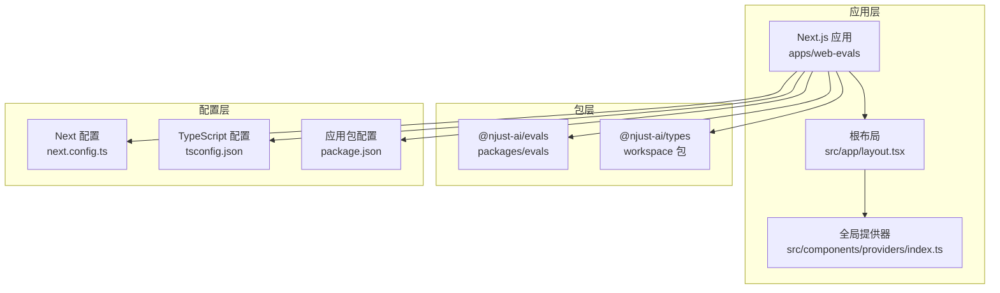
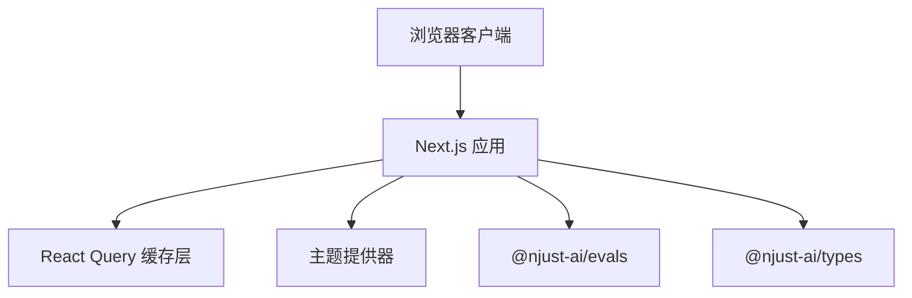
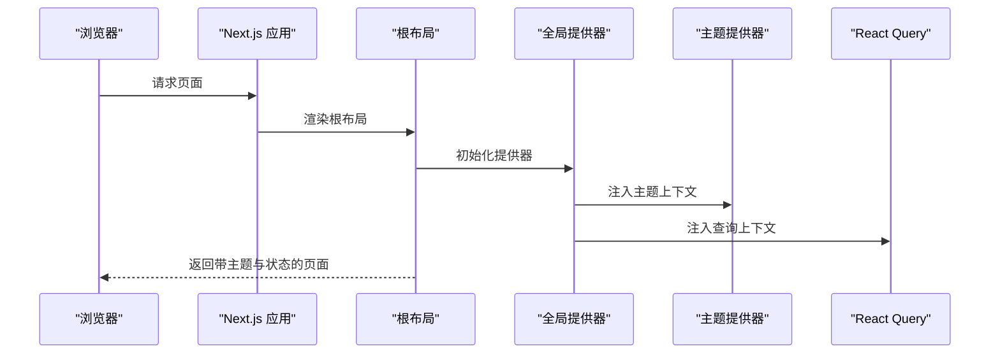
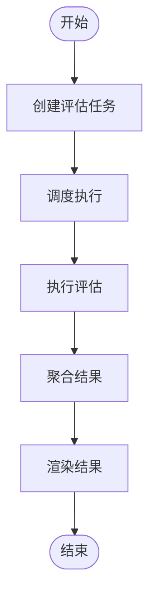
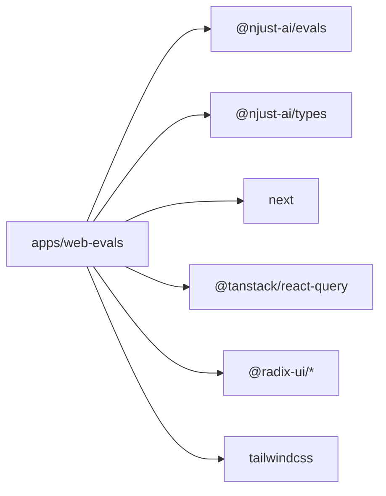

# 评估 Web 应用 (web-evals)

<cite>
**本文档引用的文件**
- [apps/web-evals/package.json](file://apps/web-evals/package.json)
- [apps/web-evals/next.config.ts](file://apps/web-evals/next.config.ts)
- [apps/web-evals/tsconfig.json](file://apps/web-evals/tsconfig.json)
- [apps/web-evals/src/app/layout.tsx](file://apps/web-evals/src/app/layout.tsx)
- [apps/web-evals/src/components/providers/index.ts](file://apps/web-evals/src/components/providers/index.ts)
- [packages/evals/package.json](file://packages/evals/package.json)
</cite>

## 目录
1. [简介](#简介)
2. [项目结构](#项目结构)
3. [核心组件](#核心组件)
4. [架构总览](#架构总览)
5. [详细组件分析](#详细组件分析)
6. [依赖关系分析](#依赖关系分析)
7. [性能考虑](#性能考虑)
8. [故障排除指南](#故障排除指南)
9. [结论](#结论)

## 简介
本文件为评估 Web 应用（web-evals）的集成开发文档，聚焦于该应用的专用架构设计、服务器端操作处理与评估流程管理。文档从系统架构、组件关系、数据流与处理逻辑、集成点与状态同步方案入手，结合与主应用的数据共享机制与统一认证系统，提供评估任务的创建、执行与结果展示机制说明，并给出具体流程示例与性能优化策略。

## 项目结构
评估 Web 应用基于 Next.js 16 构建，采用工作区（workspace）组织方式，核心依赖 @njust-ai/evals 与 @njust-ai/types 提供评估能力与类型定义。应用通过自定义主题与 React Query 提供器进行全局状态与主题管理，并在根布局中注入全局样式与通知组件。

**图表来源**
- [apps/web-evals/src/app/layout.tsx:17-35](file://apps/web-evals/src/app/layout.tsx#L17-L35)
- [apps/web-evals/src/components/providers/index.ts:1-3](file://apps/web-evals/src/components/providers/index.ts#L1-L3)
- [apps/web-evals/next.config.ts:1-8](file://apps/web-evals/next.config.ts#L1-L8)
- [apps/web-evals/tsconfig.json:1-11](file://apps/web-evals/tsconfig.json#L1-L11)
- [apps/web-evals/package.json:1-64](file://apps/web-evals/package.json#L1-L64)
- [packages/evals/package.json:1-56](file://packages/evals/package.json#L1-L56)

**章节来源**
- [apps/web-evals/src/app/layout.tsx:1-36](file://apps/web-evals/src/app/layout.tsx#L1-L36)
- [apps/web-evals/src/components/providers/index.ts:1-3](file://apps/web-evals/src/components/providers/index.ts#L1-L3)
- [apps/web-evals/next.config.ts:1-8](file://apps/web-evals/next.config.ts#L1-L8)
- [apps/web-evals/tsconfig.json:1-11](file://apps/web-evals/tsconfig.json#L1-L11)
- [apps/web-evals/package.json:1-64](file://apps/web-evals/package.json#L1-L64)
- [packages/evals/package.json:1-56](file://packages/evals/package.json#L1-L56)

## 核心组件
- 全局布局与主题：根布局负责注入字体、主题提供器、全局样式与通知组件，确保一致的视觉与交互体验。
- 全局提供器：集中导出 React Query 与主题提供器，为页面与组件提供状态管理与主题切换能力。
- 评估包依赖：通过 @njust-ai/evals 获取评估相关能力，结合 @njust-ai/types 提供类型支持。
- Next 配置与 TypeScript 配置：Next 配置启用 turbopack；TypeScript 配置扩展工作区 TS 规则并设置路径别名。

**章节来源**
- [apps/web-evals/src/app/layout.tsx:17-35](file://apps/web-evals/src/app/layout.tsx#L17-L35)
- [apps/web-evals/src/components/providers/index.ts:1-3](file://apps/web-evals/src/components/providers/index.ts#L1-L3)
- [apps/web-evals/next.config.ts:3-5](file://apps/web-evals/next.config.ts#L3-L5)
- [apps/web-evals/tsconfig.json:3-6](file://apps/web-evals/tsconfig.json#L3-L6)
- [apps/web-evals/package.json:14-50](file://apps/web-evals/package.json#L14-L50)
- [packages/evals/package.json:30-44](file://packages/evals/package.json#L30-L44)

## 架构总览
评估 Web 应用采用“前端渲染 + 工作区包”的架构模式：
- 前端渲染：Next.js 负责页面路由、SSR/CSR 渲染与静态资源服务。
- 评估能力：通过 @njust-ai/evals 暴露的接口与工具，实现评估任务的创建、执行与结果聚合。
- 数据与状态：React Query 负责远端数据缓存与同步；主题提供器统一管理暗色主题与过渡控制。
- 类型与工具：@njust-ai/types 提供跨应用一致的类型定义，确保数据契约稳定。

**图表来源**
- [apps/web-evals/src/app/layout.tsx:24-31](file://apps/web-evals/src/app/layout.tsx#L24-L31)
- [apps/web-evals/package.json:29-30](file://apps/web-evals/package.json#L29-L30)
- [packages/evals/package.json:30-32](file://packages/evals/package.json#L30-L32)

## 详细组件分析

### 组件 A 分析：根布局与全局提供器
- 根布局职责：设置字体变量、强制暗色主题、包裹 React Query 与主题提供器、渲染子组件与通知组件。
- 全局提供器：集中导出 React Query 与主题提供器，简化页面导入与复用。
- 服务器端行为：Next.js 在构建时生成静态资源与类型声明，运行时负责页面渲染与状态注入。

**图表来源**
- [apps/web-evals/src/app/layout.tsx:24-31](file://apps/web-evals/src/app/layout.tsx#L24-L31)

**章节来源**
- [apps/web-evals/src/app/layout.tsx:17-35](file://apps/web-evals/src/app/layout.tsx#L17-L35)
- [apps/web-evals/src/components/providers/index.ts:1-3](file://apps/web-evals/src/components/providers/index.ts#L1-L3)

### 组件 B 分析：评估流程管理（概念性）
评估流程管理涉及以下关键步骤（概念性说明，不绑定具体源码文件）：
- 任务创建：接收用户输入或外部触发，构造评估任务元数据与参数。
- 执行调度：将任务分发至评估引擎，支持并发与队列控制。
- 结果聚合：收集各子任务结果，进行合并与格式化。
- 展示更新：通过 React Query 缓存与主题提供器驱动 UI 更新。

[此图为概念性流程图，无需图表来源]

## 依赖关系分析
- 应用依赖：@njust-ai/evals 与 @njust-ai/types 作为核心评估与类型依赖，确保功能与类型一致性。
- 运行时依赖：Next.js、React Query、Radix UI 组件库、Tailwind CSS 等，支撑页面渲染与交互。
- 开发与构建：TypeScript 配置继承工作区规则，Next 配置启用 turbopack 以提升开发体验。

**图表来源**
- [apps/web-evals/package.json:14-50](file://apps/web-evals/package.json#L14-L50)
- [packages/evals/package.json:30-44](file://packages/evals/package.json#L30-L44)

**章节来源**
- [apps/web-evals/package.json:14-50](file://apps/web-evals/package.json#L14-L50)
- [packages/evals/package.json:30-44](file://packages/evals/package.json#L30-L44)

## 性能考虑
- 开发体验：启用 turbopack 以加速构建与热重载。
- 状态缓存：利用 React Query 的缓存与失效策略，减少重复请求与提升响应速度。
- 主题渲染：强制暗色主题与禁用过渡动画，降低主题切换对首屏渲染的影响。
- 资源优化：Next.js 自动进行静态资源优化与按需加载，配合 Tailwind CSS 的原子类减少冗余样式。

**章节来源**
- [apps/web-evals/next.config.ts:3-5](file://apps/web-evals/next.config.ts#L3-L5)
- [apps/web-evals/src/app/layout.tsx:25-31](file://apps/web-evals/src/app/layout.tsx#L25-L31)

## 故障排除指南
- 服务启动问题：确认本地服务脚本与环境变量配置正确，必要时参考 @njust-ai/evals 的数据库与 Redis 服务管理脚本。
- 类型检查失败：检查 TypeScript 配置是否正确继承工作区规则，确保路径别名与插件配置生效。
- 构建错误：清理 Next.js 构建缓存与类型声明后重新构建，确保依赖版本兼容。

**章节来源**
- [packages/evals/package.json:27-28](file://packages/evals/package.json#L27-L28)
- [apps/web-evals/tsconfig.json:2-6](file://apps/web-evals/tsconfig.json#L2-L6)

## 结论
评估 Web 应用（web-evals）通过 Next.js 与工作区包体系，实现了清晰的前端渲染架构与可扩展的评估能力集成。根布局与全局提供器确保主题与状态的一致性，而 @njust-ai/evals 与 @njust-ai/types 则提供了稳定的评估与类型基础。结合 React Query 的缓存策略与 turbopack 的开发体验，应用具备良好的可维护性与性能表现。建议在后续迭代中进一步完善评估流程的可视化与可观测性，以及统一认证与数据共享机制的文档化与测试覆盖。