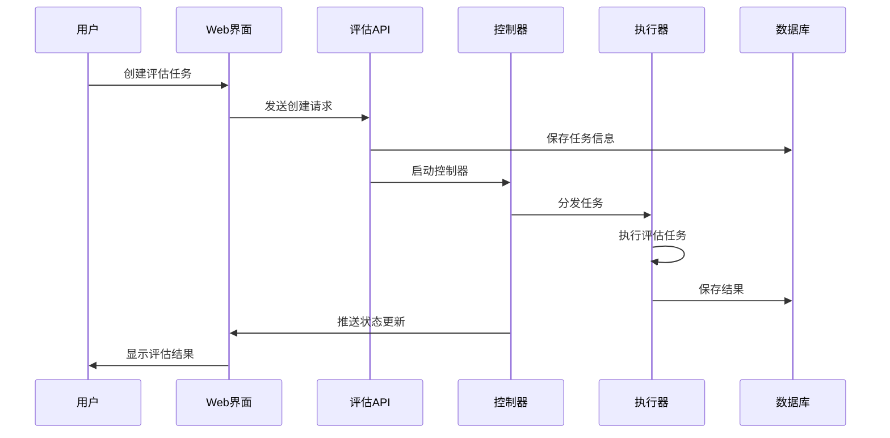
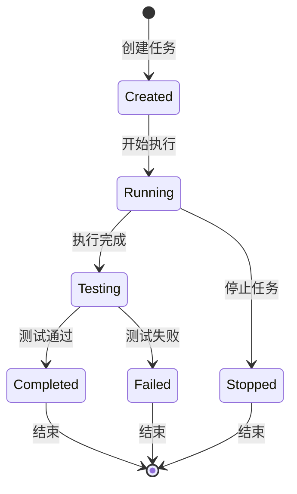
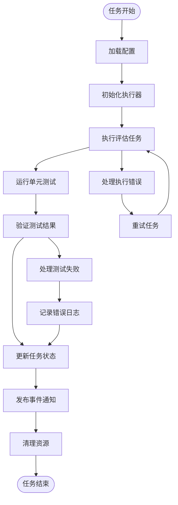

# 评估架构设计

<cite>
**本文档引用的文件**
- [packages/evals/ARCHITECTURE.md](file://packages/evals/ARCHITECTURE.md)
- [packages/evals/ADDING-EVALS.md](file://packages/evals/ADDING-EVALS.md)
- [packages/evals/package.json](file://packages/evals/package.json)
- [packages/evals/src/index.ts](file://packages/evals/src/index.ts)
- [packages/evals/src/cli/runEvals.ts](file://packages/evals/src/cli/runEvals.ts)
- [packages/evals/src/cli/processTask.ts](file://packages/evals/src/cli/processTask.ts)
- [packages/evals/src/db/schema.ts](file://packages/evals/src/db/schema.ts)
- [packages/evals/src/exercises/index.ts](file://packages/evals/src/exercises/index.ts)
- [packages/evals/Dockerfile.runner](file://packages/evals/Dockerfile.runner)
- [apps/web-evals/src/actions/runs.ts](file://apps/web-evals/src/actions/runs.ts)
- [apps/web-evals/src/app/layout.tsx](file://apps/web-evals/src/app/layout.tsx)
- [apps/web-evals/src/app/runs/new/new-run.tsx](file://apps/web-evals/src/app/runs/new/new-run.tsx)
- [apps/web-Njust-AI/src/app/evals/evals.tsx](file://apps/web-Njust-AI/src/app/evals/evals.tsx)
- [apps/web-Njust-AI/src/app/evals/types.ts](file://apps/web-Njust-AI/src/app/evals/types.ts)
- [.njust-ai/skills/evals-context/SKILL.md](file://.njust-ai/skills/evals-context/SKILL.md)
</cite>

## 目录
1. [简介](#简介)
2. [项目结构](#项目结构)
3. [核心组件](#核心组件)
4. [架构概览](#架构概览)
5. [详细组件分析](#详细组件分析)
6. [依赖关系分析](#依赖关系分析)
7. [性能考虑](#性能考虑)
8. [故障排除指南](#故障排除指南)
9. [结论](#结论)
10. [附录](#附录)

## 简介

评估架构设计是NJUST_AI项目中的一个专门化系统，用于在隔离环境中运行AI编码任务评估。该系统采用分布式架构模式，通过容器化技术确保环境隔离和资源管理，为AI模型的性能评估提供了标准化的测试框架。

评估系统的核心目标是解决传统AI评估设置中的两个关键问题：复杂的多语言依赖管理和状态污染问题。通过预配置的容器环境，系统消除了主机系统的复杂性，提供了可重现的评估条件。

## 项目结构

评估架构由四个主要部分组成，每个部分都有明确的职责分工：

```mermaid
graph TB
subgraph "评估系统架构"
subgraph "前端应用"
WEBAPI[Web Evals API]
NjustAi[Web Njust-AI Code]
end
subgraph "核心包"
EVALSPKG[@njust-ai/evals]
EXERCISES[Exercises Package]
end
subgraph "执行环境"
CONTROLLER[Controller Container]
RUNNERS[Runner Containers]
DOCKER[Isolated Docker Environment]
end
subgraph "基础设施"
POSTGRES[(PostgreSQL)]
REDIS[(Redis)]
end
end
WEBAPI --> EVALSPKG
NjustAi --> EVALSPKG
EVALSPKG --> CONTROLLER
CONTROLLER --> RUNNERS
RUNNERS --> DOCKER
CONTROLLER --> POSTGRES
CONTROLLER --> REDIS
RUNNERS --> POSTGRES
RUNNERS --> REDIS
```

**图表来源**
- [packages/evals/ARCHITECTURE.md:1-21](file://packages/evals/ARCHITECTURE.md#L1-L21)
- [apps/web-evals/src/actions/runs.ts:1-128](file://apps/web-evals/src/actions/runs.ts#L1-L128)

**章节来源**
- [packages/evals/ARCHITECTURE.md:1-21](file://packages/evals/ARCHITECTURE.md#L1-L21)
- [.njust-ai/skills/evals-context/SKILL.md:99-189](file://.njust-ai/skills/evals-context/SKILL.md#L99-L189)

## 核心组件

评估系统的核心组件包括数据库层、CLI工具集、Web界面和容器化执行环境。每个组件都经过精心设计以支持分布式评估工作负载。

### 数据库层组件

数据库层采用Drizzle ORM进行类型安全的数据库操作，支持PostgreSQL作为主要存储后端。核心表结构包括runs、tasks和taskMetrics，这些表共同构成了评估任务的完整生命周期管理。

### CLI工具集

CLI工具集提供了完整的评估执行能力，包括任务调度、容器化执行和结果验证。主要工具包括runEvals、processTask和runUnitTest，它们协同工作确保评估任务的正确执行。

### Web界面组件

Web界面提供了用户友好的交互接口，支持评估任务的创建、监控和结果展示。前端应用采用Next.js框架，提供了响应式的用户体验和实时的状态更新。

**章节来源**
- [packages/evals/src/db/schema.ts:1-144](file://packages/evals/src/db/schema.ts#L1-L144)
- [packages/evals/src/cli/runEvals.ts:1-89](file://packages/evals/src/cli/runEvals.ts#L1-L89)
- [apps/web-evals/src/actions/runs.ts:1-378](file://apps/web-evals/src/actions/runs.ts#L1-L378)

## 架构概览

评估系统采用三层架构设计，从上到下分别是用户界面层、业务逻辑层和基础设施层。这种分层设计确保了系统的可维护性和可扩展性。



**图表来源**
- [apps/web-evals/src/actions/runs.ts:31-128](file://apps/web-evals/src/actions/runs.ts#L31-L128)
- [packages/evals/src/cli/runEvals.ts:10-89](file://packages/evals/src/cli/runEvals.ts#L10-L89)

**章节来源**
- [packages/evals/ARCHITECTURE.md:1-21](file://packages/evals/ARCHITECTURE.md#L1-L21)
- [packages/evals/src/cli/processTask.ts:13-65](file://packages/evals/src/cli/processTask.ts#L13-L65)

## 详细组件分析

### 评估任务生命周期管理

评估任务的生命周期管理是系统的核心功能之一，涵盖了从任务创建到结果发布的完整流程。系统通过状态机模式管理任务的不同阶段，确保每个任务都能得到正确的处理。



**图表来源**
- [packages/evals/src/db/schema.ts:55-90](file://packages/evals/src/db/schema.ts#L55-L90)
- [packages/evals/src/cli/processTask.ts:13-65](file://packages/evals/src/cli/processTask.ts#L13-L65)

### 数据流处理机制

数据流处理机制确保了评估过程中各个组件之间的协调工作。系统采用事件驱动架构，通过Redis实现组件间的异步通信。



**图表来源**
- [packages/evals/src/cli/processTask.ts:37-65](file://packages/evals/src/cli/processTask.ts#L37-L65)
- [apps/web-evals/src/actions/runs.ts:152-230](file://apps/web-evals/src/actions/runs.ts#L152-L230)

### 状态同步机制

状态同步机制通过Redis实现，确保所有组件都能及时获取最新的任务状态。系统使用发布/订阅模式实现事件驱动的状态更新。

**章节来源**
- [packages/evals/src/cli/processTask.ts:37-65](file://packages/evals/src/cli/processTask.ts#L37-L65)
- [apps/web-evals/src/actions/runs.ts:204-220](file://apps/web-evals/src/actions/runs.ts#L204-L220)

### 服务器端组件使用模式

服务器端组件采用模块化设计，每个组件都有明确的职责边界。组件间通过明确定义的接口进行通信，确保了系统的可维护性。

#### 组件接口设计

系统定义了清晰的组件接口，包括任务管理接口、数据库访问接口和外部服务接口。这些接口确保了组件间的松耦合设计。

#### 错误处理策略

错误处理策略采用分层设计，从底层的异常捕获到上层的用户反馈都有相应的处理机制。系统实现了自动重试、降级处理和优雅降级等策略。

**章节来源**
- [packages/evals/src/cli/runEvals.ts:40-89](file://packages/evals/src/cli/runEvals.ts#L40-L89)
- [packages/evals/src/cli/processTask.ts:109-151](file://packages/evals/src/cli/processTask.ts#L109-L151)

### API设计和集成点

API设计遵循RESTful原则，提供了清晰的资源表示和标准的HTTP方法。系统支持多种集成方式，包括直接API调用和Web界面操作。

#### API版本控制

系统实现了API版本控制机制，确保向后兼容性和平滑升级。每个API端点都有明确的版本标识和变更历史。

#### 认证和授权

认证系统采用多层设计，包括API密钥认证、会话认证和角色权限控制。系统支持多种认证提供商，包括本地认证和云服务认证。

**章节来源**
- [apps/web-evals/src/app/runs/new/new-run.tsx:414-513](file://apps/web-evals/src/app/runs/new/new-run.tsx#L414-L513)
- [apps/web-Njust-AI/src/app/evals/evals.tsx:12-31](file://apps/web-Njust-AI/src/app/evals/evals.tsx#L12-L31)

### 评估应用与主应用的数据共享

评估应用与主应用之间建立了安全的数据共享机制，通过统一的认证系统实现跨应用的数据访问。

#### 数据同步策略

数据同步采用增量同步策略，只传输必要的数据变更，减少了网络开销和同步延迟。系统实现了冲突检测和解决机制，确保数据一致性。

#### 缓存机制

系统实现了多层次缓存机制，包括内存缓存、分布式缓存和持久化缓存。缓存策略根据数据访问模式动态调整，优化了系统性能。

**章节来源**
- [apps/web-Njust-AI/src/app/evals/types.ts:1-9](file://apps/web-Njust-AI/src/app/evals/types.ts#L1-L9)
- [apps/web-Njust-AI/src/app/evals/evals.tsx:15-31](file://apps/web-Njust-AI/src/app/evals/evals.tsx#L15-L31)

## 依赖关系分析

评估系统的依赖关系呈现星型拓扑结构，所有组件都依赖于核心的评估包，而评估包又依赖于基础服务。

```mermaid
graph TB
subgraph "外部依赖"
PGSQL[(PostgreSQL)]
REDIS[(Redis)]
DOCKER[(Docker)]
NODEJS[Node.js Runtime]
end
subgraph "核心依赖"
DRIZZLE[Drizzle ORM]
PQUEUE[p-queue]
REDISLIB[Redis Client]
EXECALIB[Execa]
end
subgraph "业务依赖"
TYPES[@njust-ai/types]
IPC[@njust-ai/ipc]
VSCODE[VS Code Extension]
end
subgraph "评估包"
EVALS[@njust-ai/evals]
end
EVALS --> DRIZZLE
EVALS --> PQUEUE
EVALS --> REDISLIB
EVALS --> EXECALIB
EVALS --> TYPES
EVALS --> IPC
EVALS --> PGSQL
EVALS --> REDIS
EVALS --> DOCKER
EVALS --> NODEJS
EVALS --> VSCODE
```

**图表来源**
- [packages/evals/package.json:30-54](file://packages/evals/package.json#L30-L54)
- [packages/evals/src/index.ts:1-3](file://packages/evals/src/index.ts#L1-L3)

**章节来源**
- [packages/evals/package.json:30-54](file://packages/evals/package.json#L30-L54)
- [packages/evals/src/exercises/index.ts:1-26](file://packages/evals/src/exercises/index.ts#L1-L26)

## 性能考虑

评估系统在设计时充分考虑了性能优化，采用了多种策略来提升系统的整体性能和可扩展性。

### 并发控制策略

系统采用基于队列的并发控制策略，通过p-queue实现任务的有序执行。并发度可以根据系统资源动态调整，避免了资源争用和性能瓶颈。

### 资源隔离机制

容器化技术确保了每个评估任务都在独立的环境中执行，防止了资源泄漏和状态污染。系统还实现了资源配额和限制机制，确保公平的资源分配。

### 缓存优化

系统实现了多层缓存策略，包括数据库查询缓存、计算结果缓存和静态资源缓存。缓存策略根据数据访问模式自适应调整，最大化缓存命中率。

## 故障排除指南

评估系统提供了完善的故障排除机制，帮助用户快速定位和解决问题。

### 常见问题诊断

系统记录了详细的日志信息，包括执行日志、错误日志和性能日志。用户可以通过查看日志文件快速定位问题原因。

### 错误恢复策略

系统实现了自动错误恢复机制，包括任务重试、状态回滚和资源清理。对于不可恢复的错误，系统会提供详细的错误报告和修复建议。

### 监控和告警

系统集成了监控和告警功能，可以实时监控系统的健康状况和性能指标。当出现异常情况时，系统会自动发送告警通知。

**章节来源**
- [packages/evals/src/cli/processTask.ts:109-151](file://packages/evals/src/cli/processTask.ts#L109-L151)
- [apps/web-evals/src/actions/runs.ts:152-230](file://apps/web-evals/src/actions/runs.ts#L152-L230)

## 结论

评估架构设计是一个高度模块化和可扩展的系统，通过容器化技术和事件驱动架构实现了可靠的AI评估功能。系统的设计充分考虑了性能、可维护性和可扩展性，在保证功能完整性的同时提供了良好的用户体验。

评估系统的核心优势在于其分布式架构设计和严格的资源隔离机制，这使得系统能够稳定地处理大规模的评估任务。同时，系统的模块化设计也为未来的功能扩展和技术升级奠定了坚实的基础。

## 附录

### 扩展指南

系统提供了完整的扩展指南，包括添加新编程语言支持、自定义评估任务和集成新的外部服务。开发者可以根据需要选择合适的扩展方式来满足特定的评估需求。

### 最佳实践

评估系统遵循了多项最佳实践，包括容器化部署、微服务架构、事件驱动设计和可观测性。这些实践确保了系统的稳定性、可维护性和可扩展性。

### 技术规范

系统制定了详细的技术规范，包括代码风格、命名约定、文档标准和测试要求。这些规范确保了代码质量和团队协作效率。

**章节来源**
- [packages/evals/ADDING-EVALS.md:1-66](file://packages/evals/ADDING-EVALS.md#L1-L66)
- [packages/evals/Dockerfile.runner:1-174](file://packages/evals/Dockerfile.runner#L1-L174)