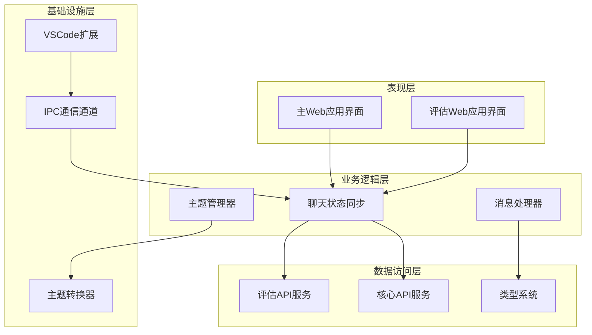
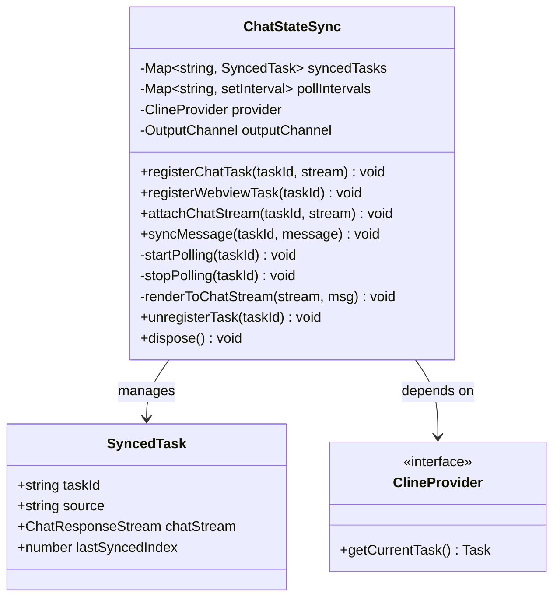
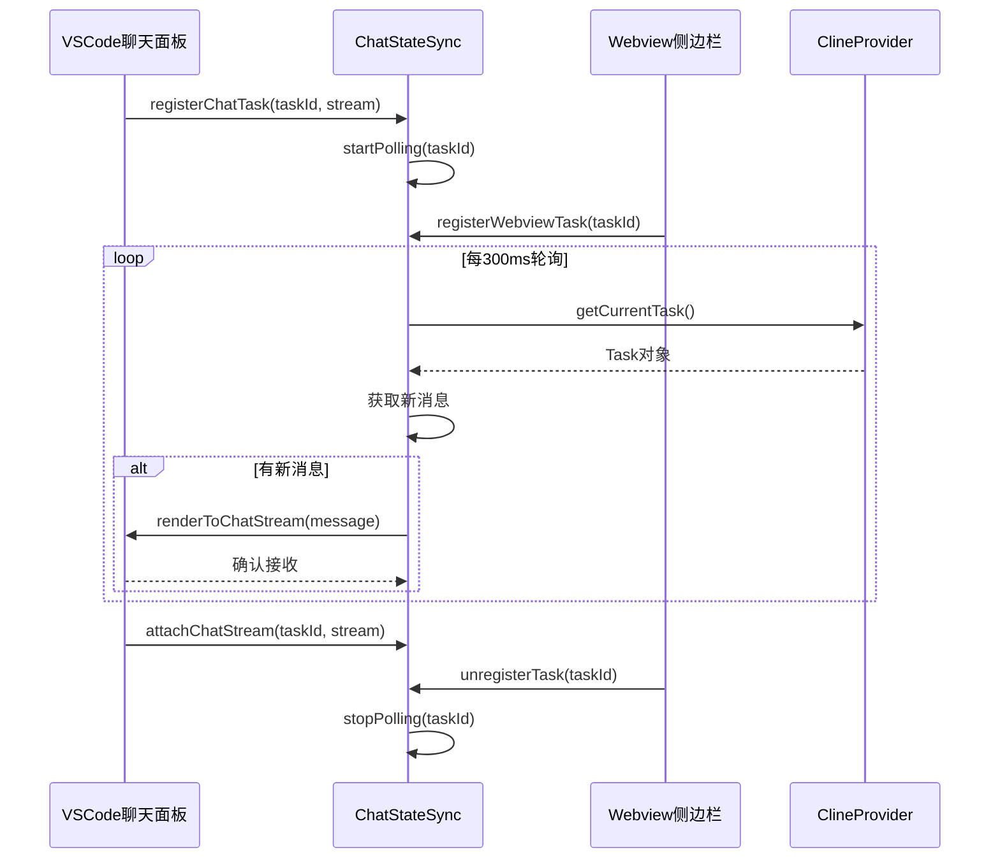
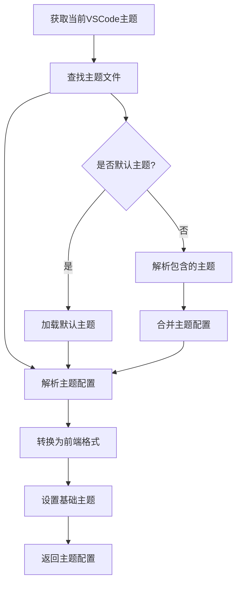

# 跨应用集成

<cite>
**本文档引用的文件**
- [apps/web-Njust-AI/package.json](file://apps/web-Njust-AI/package.json)
- [apps/web-evals/package.json](file://apps/web-evals/package.json)
- [packages/core/package.json](file://packages/core/package.json)
- [packages/evals/package.json](file://packages/evals/package.json)
- [packages/types/src/index.ts](file://packages/types/src/index.ts)
- [src/chat/ChatStateSync.ts](file://src/chat/ChatStateSync.ts)
- [apps/web-Njust-AI/src/app/layout.tsx](file://apps/web-Njust-AI/src/app/layout.tsx)
- [apps/web-evals/src/app/layout.tsx](file://apps/web-evals/src/app/layout.tsx)
- [src/shared/WebviewMessage.ts](file://src/shared/WebviewMessage.ts)
- [src/integrations/theme/getTheme.ts](file://src/integrations/theme/getTheme.ts)
- [packages/ipc/src/index.ts](file://packages/ipc/src/index.ts)
- [packages/core/src/browser.ts](file://packages/core/src/browser.ts)
</cite>

## 目录
1. [简介](#简介)
2. [项目结构](#项目结构)
3. [核心组件](#核心组件)
4. [架构概览](#架构概览)
5. [详细组件分析](#详细组件分析)
6. [依赖分析](#依赖分析)
7. [性能考虑](#性能考虑)
8. [故障排除指南](#故障排除指南)
9. [结论](#结论)

## 简介

本项目是一个跨应用集成解决方案，主要包含两个Web应用：主Web应用（web-Njust-AI）和评估Web应用（web-evals）。该项目的核心目标是实现两个应用之间的数据共享、统一认证系统和状态同步方案。

项目采用Monorepo架构，使用pnpm工作区管理多个包，包括核心功能包、评估包、类型定义包和IPC通信包。两个Web应用都依赖于共享的类型定义和核心功能模块，确保了代码的一致性和可维护性。

## 项目结构

项目采用现代化的Monorepo架构，主要分为以下几个部分：

```mermaid
graph TB
subgraph "应用层"
WebNjustAi[主Web应用<br/>web-Njust-AI]
WebEvals[评估Web应用<br/>web-evals]
end
subgraph "共享包层"
Types[类型定义包<br/>@njust-ai/types]
Core[核心功能包<br/>@njust-ai/core]
Evals[评估包<br/>@njust-ai/evals]
IPC[IPC通信包<br/>@njust-ai/ipc]
end
subgraph "基础设施"
NextJS[Next.js框架]
TailwindCSS[TailwindCSS样式]
RadixUI[Radix UI组件]
Zustand[Zustand状态管理]
end
WebNjustAi --> Types
WebNjustAi --> Core
WebNjustAi --> Evals
WebNjustAi --> IPC
WebEvals --> Types
WebEvals --> Core
WebEvals --> Evals
WebEvals --> IPC
WebNjustAi --> NextJS
WebEvals --> NextJS
WebNjustAi --> TailwindCSS
WebEvals --> TailwindCSS
WebNjustAi --> RadixUI
WebEvals --> RadixUI
```

**图表来源**
- [apps/web-Njust-AI/package.json:16-47](file://apps/web-Njust-AI/package.json#L16-L47)
- [apps/web-evals/package.json:14-51](file://apps/web-evals/package.json#L14-L51)
- [packages/core/package.json:17-24](file://packages/core/package.json#L17-L24)

**章节来源**
- [apps/web-Njust-AI/package.json:1-62](file://apps/web-Njust-AI/package.json#L1-L62)
- [apps/web-evals/package.json:1-64](file://apps/web-evals/package.json#L1-L64)
- [packages/core/package.json:1-32](file://packages/core/package.json#L1-L32)

## 核心组件

### 数据共享机制

两个应用通过共享的类型定义包实现数据结构的统一。类型定义包导出了所有必要的接口和类型，确保两个应用在数据交换时具有一致的数据模型。

### 统一认证系统

项目实现了基于VSCode扩展的认证系统，通过ChatStateSync组件实现任务状态的实时同步。该组件支持从VSCode聊天面板和Webview侧边栏创建的任务之间的双向同步。

### 状态同步方案

ChatStateSync类提供了完整的状态同步机制，包括：
- 任务注册和注销
- 实时消息同步
- 流式进度更新
- 错误处理和清理

**章节来源**
- [packages/types/src/index.ts:1-38](file://packages/types/src/index.ts#L1-L38)
- [src/chat/ChatStateSync.ts:17-159](file://src/chat/ChatStateSync.ts#L17-L159)

## 架构概览

项目采用分层架构设计，确保各组件职责清晰、耦合度低：



**图表来源**
- [src/chat/ChatStateSync.ts:17-159](file://src/chat/ChatStateSync.ts#L17-L159)
- [src/integrations/theme/getTheme.ts:35-95](file://src/integrations/theme/getTheme.ts#L35-L95)

## 详细组件分析

### 聊天状态同步组件

ChatStateSync是整个集成系统的核心组件，负责在不同界面之间同步任务状态。



**图表来源**
- [src/chat/ChatStateSync.ts:5-24](file://src/chat/ChatStateSync.ts#L5-L24)
- [src/chat/ChatStateSync.ts:21-24](file://src/chat/ChatStateSync.ts#L21-L24)

#### 同步流程



**图表来源**
- [src/chat/ChatStateSync.ts:30-111](file://src/chat/ChatStateSync.ts#L30-L111)

**章节来源**
- [src/chat/ChatStateSync.ts:17-159](file://src/chat/ChatStateSync.ts#L17-L159)

### 主题管理系统

主题管理系统负责在不同应用之间保持视觉一致性。



**图表来源**
- [src/integrations/theme/getTheme.ts:35-95](file://src/integrations/theme/getTheme.ts#L35-L95)

**章节来源**
- [src/integrations/theme/getTheme.ts:1-152](file://src/integrations/theme/getTheme.ts#L1-L152)

### 布局和外观组件

两个应用都采用了现代化的布局设计，但各有特色：

#### 主Web应用布局特点
- 使用Inter字体系列
- 集成Cookie同意管理
- 支持SEO优化和Open Graph元数据
- 提供完整的网站结构标记

#### 评估Web应用布局特点
- 使用Geist和Geist Mono字体
- 固定深色主题模式
- 集成React Query状态管理
- 提供Toast通知系统

**章节来源**
- [apps/web-Njust-AI/src/app/layout.tsx:19-87](file://apps/web-Njust-AI/src/app/layout.tsx#L19-L87)
- [apps/web-evals/src/app/layout.tsx:13-15](file://apps/web-evals/src/app/layout.tsx#L13-L15)

## 依赖分析

项目使用pnpm工作区管理依赖关系，确保版本一致性和减少重复安装。

```mermaid
graph TB
subgraph "主Web应用依赖"
WebNjustAiDep[web-Njust-AI]
EvalDep[@njust-ai/evals]
TypeDep[@njust-ai/types]
RadixDep[@radix-ui/react-*]
NextDep[next]
QueryDep[@tanstack/react-query]
end
subgraph "评估Web应用依赖"
WebEvalsDep[web-evals]
EvalDep2[@njust-ai/evals]
TypeDep2[@njust-ai/types]
HookFormDep[react-hook-form]
RedisDep[redis]
CmdkDep[cmdk]
end
subgraph "共享依赖"
CoreDep[@njust-ai/core]
IPCDep[@njust-ai/ipc]
ZodDep[zod]
PostCSSDep[postcss]
end
WebNjustAiDep --> EvalDep
WebNjustAiDep --> TypeDep
WebNjustAiDep --> CoreDep
WebNjustAiDep --> IPCDep
WebEvalsDep --> EvalDep2
WebEvalsDep --> TypeDep2
WebEvalsDep --> CoreDep
WebEvalsDep --> IPCDep
EvalDep --> ZodDep
TypeDep --> ZodDep
CoreDep --> ZodDep
IPCDep --> ZodDep
```

**图表来源**
- [apps/web-Njust-AI/package.json:16-47](file://apps/web-Njust-AI/package.json#L16-L47)
- [apps/web-evals/package.json:14-51](file://apps/web-evals/package.json#L14-L51)

**章节来源**
- [packages/evals/package.json:30-44](file://packages/evals/package.json#L30-L44)
- [packages/core/package.json:17-24](file://packages/core/package.json#L17-L24)

## 性能考虑

### 内存管理
- 使用WeakMap和Map正确管理任务状态
- 及时清理定时器和事件监听器
- 避免循环引用导致的内存泄漏

### 网络优化
- 实现300ms轮询间隔平衡实时性和性能
- 错误处理中包含流清理逻辑
- 条件检查避免不必要的API调用

### 渲染优化
- 使用React.memo和useMemo优化组件渲染
- 条件渲染减少DOM操作
- 合理的样式系统避免重绘

## 故障排除指南

### 常见问题及解决方案

#### 1. 任务状态不同步
**症状**: VSCode聊天面板和Webview侧边栏显示不同的任务状态
**解决方案**:
- 检查ChatStateSync实例是否正确初始化
- 验证任务ID是否唯一且一致
- 确认轮询定时器正常运行

#### 2. 主题不一致
**症状**: 两个应用显示不同的颜色方案
**解决方案**:
- 验证VSCode主题设置
- 检查主题文件路径和权限
- 确认主题转换过程无错误

#### 3. 依赖版本冲突
**症状**: 构建失败或运行时错误
**解决方案**:
- 使用`pnpm store prune`清理缓存
- 检查workspace依赖版本
- 确保所有包使用相同的Node.js版本

#### 4. IPC通信失败
**症状**: 应用间消息传递失败
**解决方案**:
- 验证IPC服务器是否启动
- 检查进程间通信端口
- 确认消息序列化/反序列化正确

**章节来源**
- [src/chat/ChatStateSync.ts:147-159](file://src/chat/ChatStateSync.ts#L147-L159)
- [src/integrations/theme/getTheme.ts:91-94](file://src/integrations/theme/getTheme.ts#L91-L94)

## 结论

本跨应用集成为两个Web应用提供了完整的技术解决方案，包括：

1. **统一的数据模型**: 通过共享类型定义包确保数据一致性
2. **实时状态同步**: ChatStateSync组件提供可靠的任务状态同步
3. **一致的视觉体验**: 主题管理系统保持视觉风格统一
4. **模块化的架构**: 清晰的分层设计便于维护和扩展

该解决方案为后续的功能扩展奠定了坚实的基础，包括用户认证、路由同步和更复杂的状态管理需求。通过持续的优化和改进，可以进一步提升系统的性能和用户体验。