# GitHub 集成

<cite>
**本文档引用的文件**
- [upgrade.ts](file://apps/cli/src/commands/cli/upgrade.ts)
- [stats.ts](file://apps/web-Njust-AI/src/lib/stats.ts)
- [oauth.ts](file://src/integrations/openai-codex/oauth.ts)
- [urls.ts](file://webview-ui/src/oauth/urls.ts)
- [git.ts](file://src/utils/git.ts)
- [credentials.ts](file://apps/cli/src/lib/storage/credentials.ts)
- [ShadowCheckpointService.ts](file://src/services/checkpoints/ShadowCheckpointService.ts)
- [TaskHistoryStore.ts](file://src/core/task-persistence/TaskHistoryStore.ts)
- [website-preview.yml](file://.github/workflows/website-preview.yml)
- [5_pull_request_workflow.xml](file://.njust-ai/rule-issue-fixer/5_pull_request_workflow.xml)
- [3_common_patterns.xml](file://.njust-ai/rules-pr-fixer/3_common_patterns.xml)
- [1_Workflow.xml](file://.njust-ai/rules-issue-writer/1_workflow.xml)
- [constants.spec.ts](file://src/api/providers/__tests__/constants.spec.ts)
</cite>

## 目录
1. [简介](#简介)
2. [项目结构](#项目结构)
3. [核心组件](#核心组件)
4. [架构概览](#架构概览)
5. [详细组件分析](#详细组件分析)
6. [依赖关系分析](#依赖关系分析)
7. [性能考虑](#性能考虑)
8. [故障排除指南](#故障排除指南)
9. [结论](#结论)

## 简介

本文件为 GitHub 集成的详细开发文档，深入解释了 GitHub PR 评论系统、状态同步机制、分支管理集成的实现细节。文档涵盖了 GitHub API 的调用方式、OAuth 认证流程、Webhook 处理和事件监听，以及与现有任务系统的数据交换协议。

该系统通过多种方式与 GitHub 进行集成：
- 使用 GitHub CLI 进行 PR 创建、检查和状态监控
- 通过 GitHub API 获取仓库信息和星标数
- 实现 OAuth 认证流程以访问用户 GitHub 资源
- 建立分支管理和任务持久化机制
- 自动化 PR 状态更新、代码审查反馈和分支合并流程

## 项目结构

GitHub 集成功能分布在多个模块中，形成了完整的集成体系：

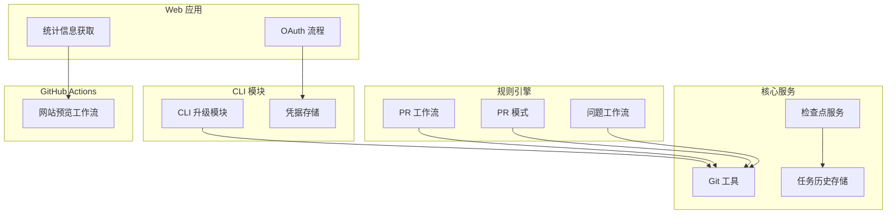

**图表来源**
- [upgrade.ts:1-156](file://apps/cli/src/commands/cli/upgrade.ts#L1-L156)
- [stats.ts:1-125](file://apps/web-Njust-AI/src/lib/stats.ts#L1-L125)
- [git.ts:84-130](file://src/utils/git.ts#L84-L130)
- [ShadowCheckpointService.ts:450-489](file://src/services/checkpoints/ShadowCheckpointService.ts#L450-L489)

**章节来源**
- [upgrade.ts:1-156](file://apps/cli/src/commands/cli/upgrade.ts#L1-L156)
- [stats.ts:1-125](file://apps/web-Njust-AI/src/lib/stats.ts#L1-L125)
- [git.ts:84-130](file://src/utils/git.ts#L84-L130)

## 核心组件

### GitHub API 调用组件

系统通过多种方式与 GitHub API 交互，主要包括版本检查和统计信息获取：

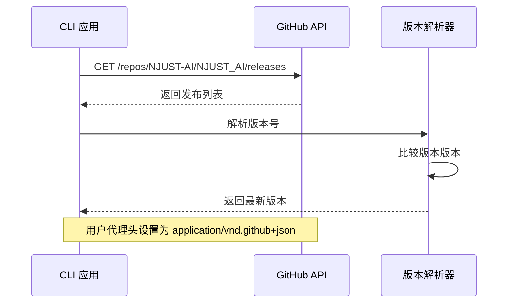

**图表来源**
- [upgrade.ts:68-110](file://apps/cli/src/commands/cli/upgrade.ts#L68-L110)

### OAuth 认证组件

系统实现了 OAuth 认证流程，用于访问 GitHub 资源：

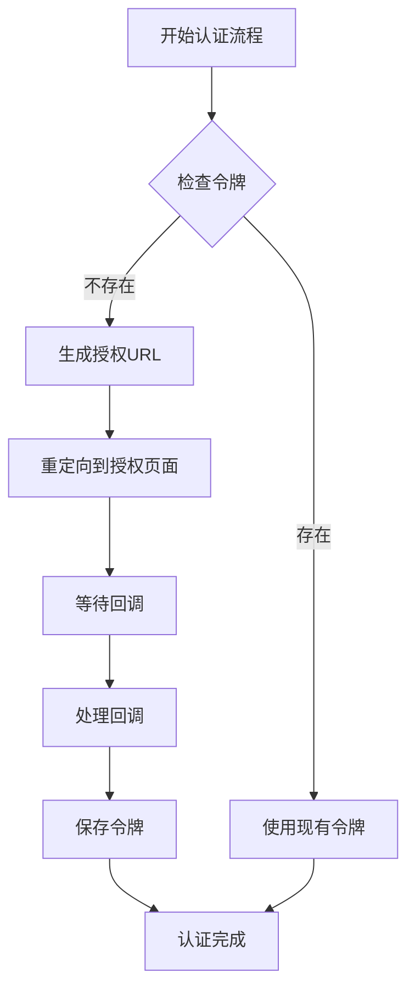

**图表来源**
- [oauth.ts:1-39](file://src/integrations/openai-codex/oauth.ts#L1-L39)
- [urls.ts:1-14](file://webview-ui/src/oauth/urls.ts#L1-L14)

### Git 工具组件

提供了 Git URL 转换和安全处理功能：

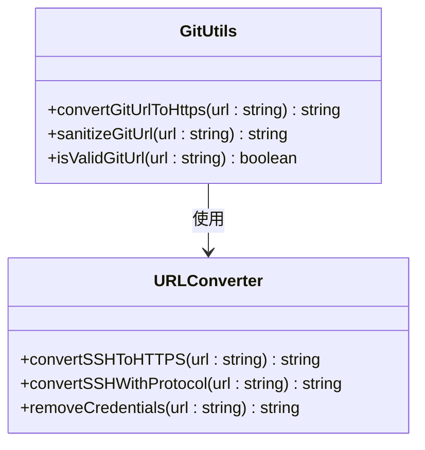

**图表来源**
- [git.ts:84-130](file://src/utils/git.ts#L84-L130)

**章节来源**
- [upgrade.ts:68-110](file://apps/cli/src/commands/cli/upgrade.ts#L68-L110)
- [oauth.ts:1-39](file://src/integrations/openai-codex/oauth.ts#L1-L39)
- [urls.ts:1-14](file://webview-ui/src/oauth/urls.ts#L1-L14)
- [git.ts:84-130](file://src/utils/git.ts#L84-L130)

## 架构概览

GitHub 集成系统采用分层架构设计，各组件职责明确：

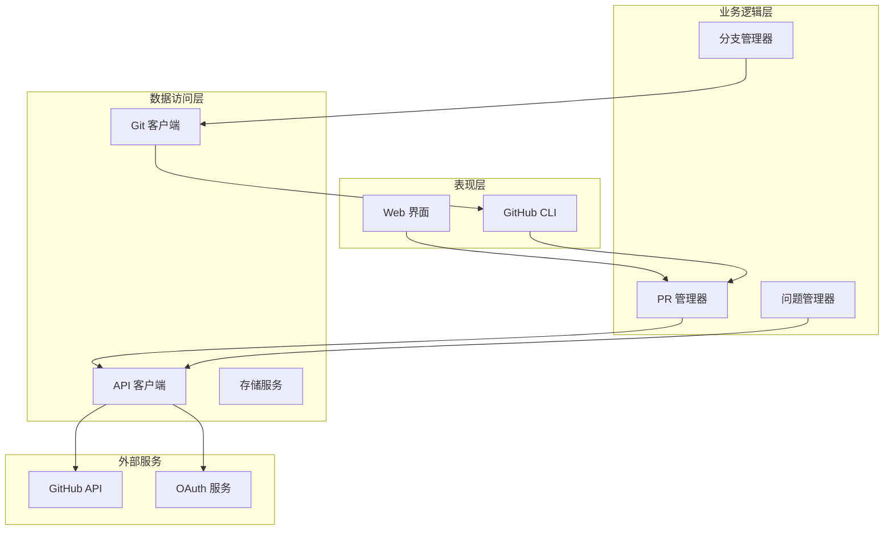

**图表来源**
- [upgrade.ts:68-110](file://apps/cli/src/commands/cli/upgrade.ts#L68-L110)
- [stats.ts:1-125](file://apps/web-Njust-AI/src/lib/stats.ts#L1-L125)

## 详细组件分析

### PR 评论系统

系统实现了完整的 PR 评论和状态监控机制：

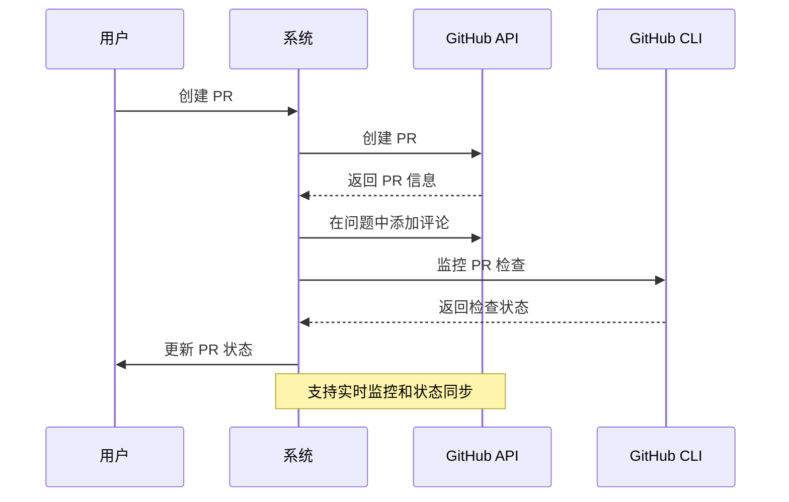

**图表来源**
- [5_pull_request_workflow.xml:35-52](file://.njust-ai/rule-issue-fixer/5_pull_request_workflow.xml#L35-L52)
- [website-preview.yml:71-102](file://.github/workflows/website-preview.yml#L71-L102)

### 分支管理集成

系统提供了智能的分支管理功能，支持 fork 和原仓库的不同场景：

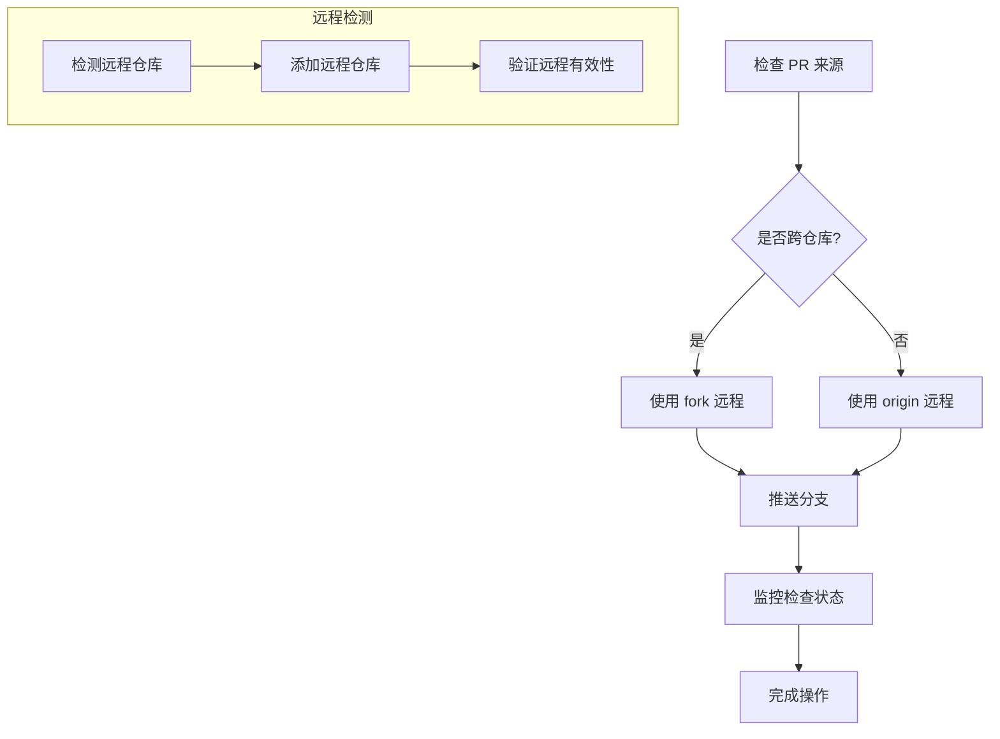

**图表来源**
- [3_common_patterns.xml:59-88](file://.njust-ai/rules-pr-fixer/3_common_patterns.xml#L59-L88)

### 任务持久化系统

系统实现了复杂的状态持久化机制，确保任务状态的一致性：

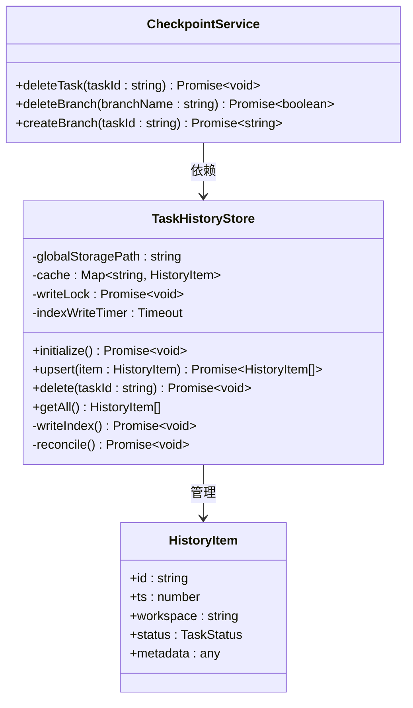

**图表来源**
- [TaskHistoryStore.ts:44-573](file://src/core/task-persistence/TaskHistoryStore.ts#L44-L573)
- [ShadowCheckpointService.ts:450-489](file://src/services/checkpoints/ShadowCheckpointService.ts#L450-L489)

**章节来源**
- [5_pull_request_workflow.xml:35-52](file://.njust-ai/rule-issue-fixer/5_pull_request_workflow.xml#L35-L52)
- [3_common_patterns.xml:59-88](file://.njust-ai/rules-pr-fixer/3_common_patterns.xml#L59-L88)
- [TaskHistoryStore.ts:44-573](file://src/core/task-persistence/TaskHistoryStore.ts#L44-L573)
- [ShadowCheckpointService.ts:450-489](file://src/services/checkpoints/ShadowCheckpointService.ts#L450-L489)

### 凭据管理系统

系统提供了安全的凭据存储和管理机制：

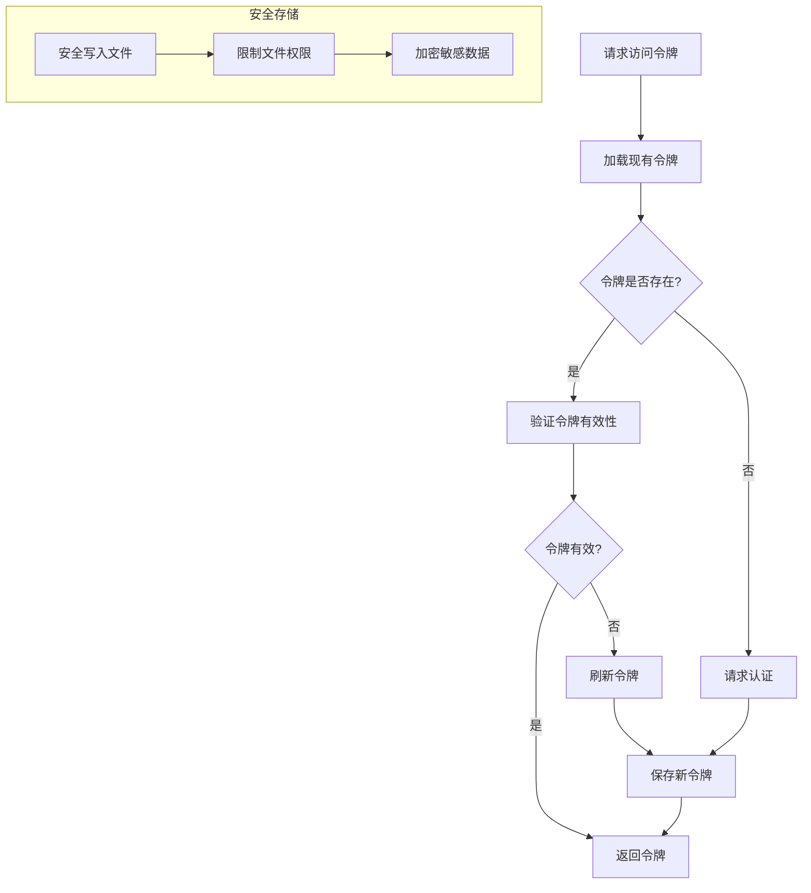

**图表来源**
- [credentials.ts:15-63](file://apps/cli/src/lib/storage/credentials.ts#L15-L63)

**章节来源**
- [credentials.ts:15-63](file://apps/cli/src/lib/storage/credentials.ts#L15-L63)

## 依赖关系分析

系统各组件之间的依赖关系如下：

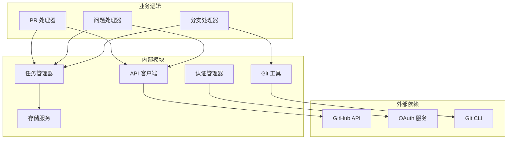

**图表来源**
- [upgrade.ts:68-110](file://apps/cli/src/commands/cli/upgrade.ts#L68-L110)
- [oauth.ts:1-39](file://src/integrations/openai-codex/oauth.ts#L1-L39)

**章节来源**
- [upgrade.ts:68-110](file://apps/cli/src/commands/cli/upgrade.ts#L68-L110)
- [oauth.ts:1-39](file://src/integrations/openai-codex/oauth.ts#L1-L39)

## 性能考虑

系统在设计时充分考虑了性能优化：

1. **缓存策略**：使用内存缓存和索引文件减少重复的 API 调用
2. **异步处理**：所有网络请求都采用异步模式，避免阻塞主线程
3. **批量操作**：支持批量任务处理，减少 API 调用次数
4. **连接复用**：重用 HTTP 连接，减少连接建立开销
5. **增量更新**：只更新变化的数据，避免全量同步

## 故障排除指南

### 常见问题及解决方案

| 问题类型 | 症状 | 解决方案 |
|---------|------|----------|
| 认证失败 | 401 未授权错误 | 检查令牌有效期，重新执行认证流程 |
| API 限流 | 403 速率限制错误 | 实现指数退避重试机制 |
| 网络超时 | 请求超时异常 | 增加超时时间，实现重试逻辑 |
| 分支冲突 | Git 操作失败 | 使用 merge-resolver 模式自动解决冲突 |
| 存储损坏 | 数据读取失败 | 清理缓存，重建索引文件 |

### 错误处理策略

系统采用多层次的错误处理机制：

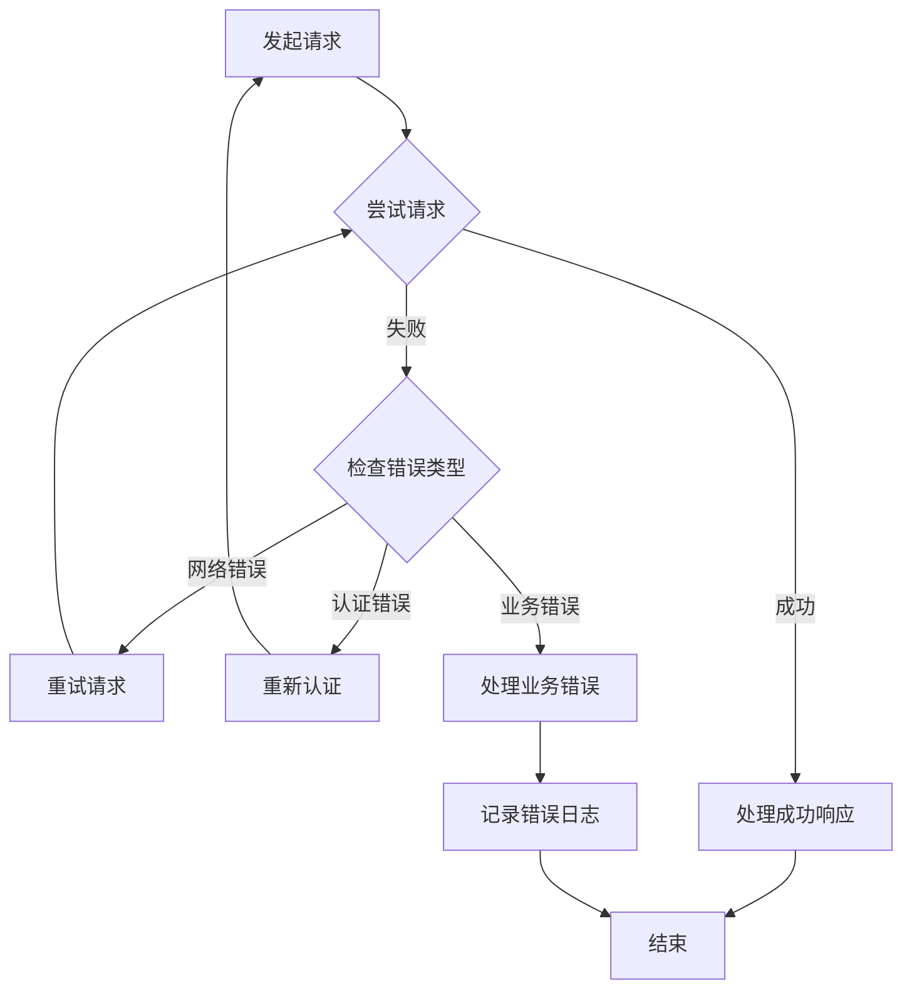

**章节来源**
- [TaskHistoryStore.ts:44-573](file://src/core/task-persistence/TaskHistoryStore.ts#L44-L573)
- [ShadowCheckpointService.ts:450-489](file://src/services/checkpoints/ShadowCheckpointService.ts#L450-L489)

## 结论

本 GitHub 集成系统提供了完整的 PR 管理、状态同步和分支控制功能。通过模块化的架构设计和完善的错误处理机制，系统能够稳定地处理各种复杂的 GitHub 集成场景。

关键特性包括：
- 全面的 PR 生命周期管理
- 智能的分支和远程仓库处理
- 安全的认证和凭据管理
- 高效的任务持久化机制
- 实时的状态监控和通知

该系统为开发者提供了一个强大而灵活的 GitHub 集成平台，支持从简单的 PR 创建到复杂的分支合并流程的自动化处理。