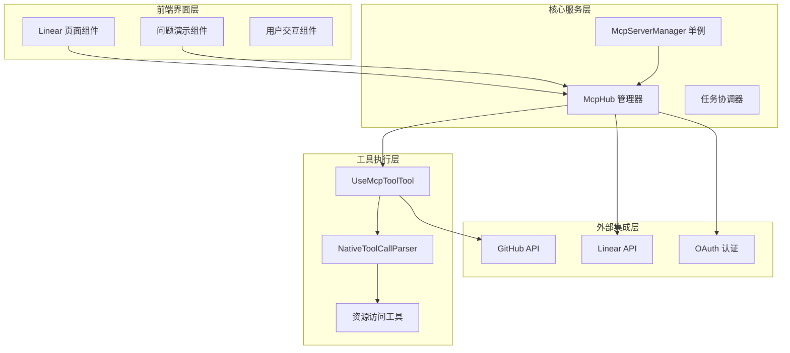
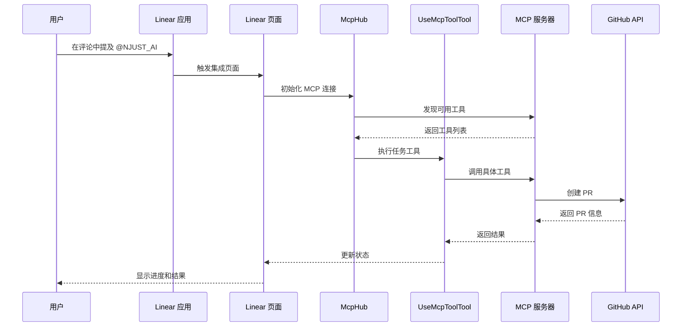
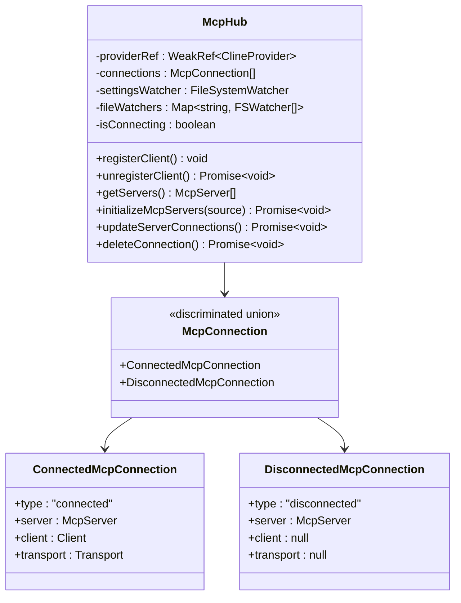
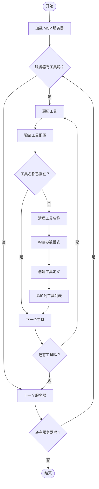
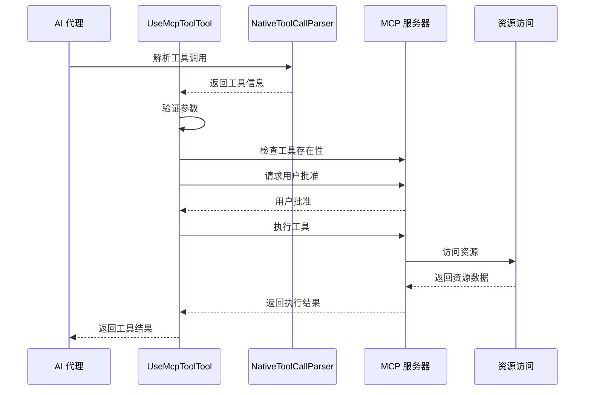
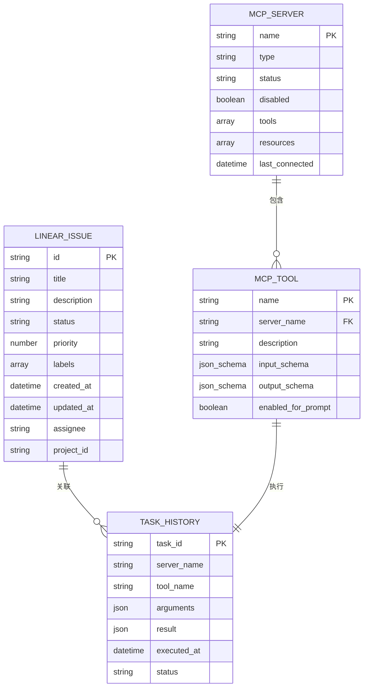
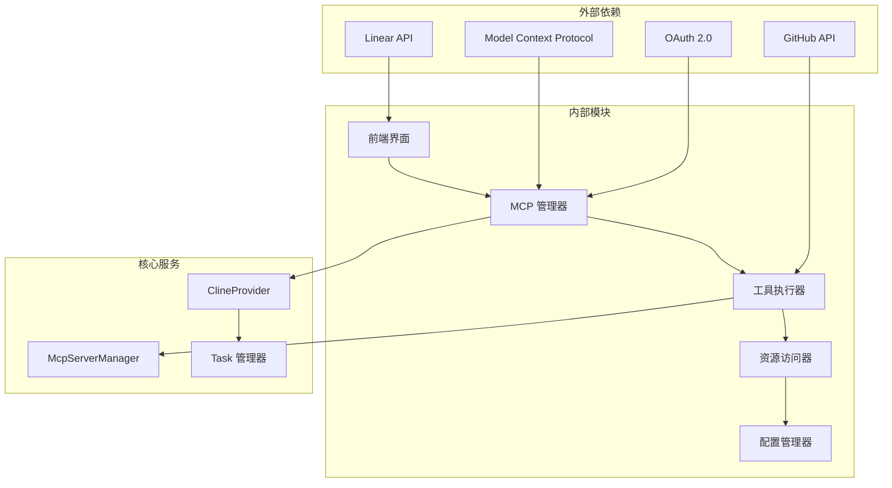

# Linear 集成

<cite>
**本文档引用的文件**
- [apps/web-Njust-AI/src/app/linear/page.tsx](file://apps/web-Njust-AI/src/app/linear/page.tsx)
- [apps/web-Njust-AI/src/components/linear/linear-issue-demo.tsx](file://apps/web-Njust-AI/src/components/linear/linear-issue-demo.tsx)
- [src/services/mcp/McpHub.ts](file://src/services/mcp/McpHub.ts)
- [src/services/mcp/McpServerManager.ts](file://src/services/mcp/McpServerManager.ts)
- [src/core/prompts/tools/native-tools/mcp_server.ts](file://src/core/prompts/tools/native-tools/mcp_server.ts)
- [src/core/prompts/tools/native-tools/access_mcp_resource.ts](file://src/core/prompts/tools/native-tools/access_mcp_resource.ts)
- [src/core/tools/UseMcpToolTool.ts](file://src/core/tools/UseMcpToolTool.ts)
- [src/core/assistant-message/NativeToolCallParser.ts](file://src/core/assistant-message/NativeToolCallParser.ts)
- [src/api/providers/__tests__/openai-native-tools.spec.ts](file://src/api/providers/__tests__/openai-native-tools.spec.ts)
</cite>

## 目录
1. [简介](#简介)
2. [项目结构](#项目结构)
3. [核心组件](#核心组件)
4. [架构概览](#架构概览)
5. [详细组件分析](#详细组件分析)
6. [依赖关系分析](#依赖关系分析)
7. [性能考虑](#性能考虑)
8. [故障排除指南](#故障排除指南)
9. [结论](#结论)

## 简介

Linear 集成是 NJUST_AI Cloud 平台的重要功能模块，允许用户直接从 Linear 任务管理系统中分配开发工作给 AI 代理。该集成实现了完整的任务生命周期管理，包括任务创建、状态同步、进度跟踪和项目管理。

该系统基于 Model Context Protocol (MCP) 架构，通过动态工具生成机制实现与 Linear API 的无缝集成。用户可以在 Linear 中直接提及 @NJUST_AI 来启动任务，AI 代理会自动分析需求、编写代码并创建 Pull Request，整个过程在 Linear 界面内完成，无需切换工具。

## 项目结构

Linear 集成采用分层架构设计，主要包含以下关键层次：

**图表来源**
- [apps/web-Njust-AI/src/app/linear/page.tsx:191-413](file://apps/web-Njust-AI/src/app/linear/page.tsx#L191-L413)
- [src/services/mcp/McpHub.ts:151-176](file://src/services/mcp/McpHub.ts#L151-L176)

**章节来源**
- [apps/web-Njust-AI/src/app/linear/page.tsx:1-414](file://apps/web-Njust-AI/src/app/linear/page.tsx#L1-L414)
- [src/services/mcp/McpHub.ts:1-800](file://src/services/mcp/McpHub.ts#L1-L800)

## 核心组件

### 前端展示组件

Linear 集成的前端界面由两个主要组件构成：

1. **Linear 页面组件** (`page.tsx`): 提供完整的集成页面，包含价值主张展示、引导步骤和演示内容
2. **问题演示组件** (`linear-issue-demo.tsx`): 展示 AI 代理在 Linear 中的工作流程，包括评论、状态变更和 PR 链接

### MCP 服务器管理

系统使用 MCP (Model Context Protocol) 作为核心通信协议，通过以下组件实现：

- **McpHub**: 主要的 MCP 服务器管理器，负责连接、配置和监控 MCP 服务器
- **McpServerManager**: 单例模式的 MCP 服务器管理器，确保全局唯一实例
- **动态工具生成**: 自动从 MCP 服务器发现和生成工具定义

**章节来源**
- [apps/web-Njust-AI/src/components/linear/linear-issue-demo.tsx:130-443](file://apps/web-Njust-AI/src/components/linear/linear-issue-demo.tsx#L130-L443)
- [src/services/mcp/McpHub.ts:151-800](file://src/services/mcp/McpHub.ts#L151-L800)
- [src/services/mcp/McpServerManager.ts:1-87](file://src/services/mcp/McpServerManager.ts#L1-L87)

## 架构概览

Linear 集成采用事件驱动的异步架构，支持实时状态同步和双向通信：

**图表来源**
- [src/services/mcp/McpHub.ts:656-800](file://src/services/mcp/McpHub.ts#L656-L800)
- [src/core/tools/UseMcpToolTool.ts:30-43](file://src/core/tools/UseMcpToolTool.ts#L30-L43)

## 详细组件分析

### MCP 服务器管理器 (McpHub)

McpHub 是 Linear 集成的核心组件，负责管理所有 MCP 服务器连接：

**图表来源**
- [src/services/mcp/McpHub.ts:151-176](file://src/services/mcp/McpHub.ts#L151-L176)
- [src/services/mcp/McpHub.ts:44-59](file://src/services/mcp/McpHub.ts#L44-L59)

### 动态工具生成机制

系统实现了智能的工具发现和生成机制：

**图表来源**
- [src/core/prompts/tools/native-tools/mcp_server.ts:14-69](file://src/core/prompts/tools/native-tools/mcp_server.ts#L14-L69)

### 工具执行流程

UseMcpToolTool 实现了完整的工具执行生命周期：

**图表来源**
- [src/core/tools/UseMcpToolTool.ts:30-43](file://src/core/tools/UseMcpToolTool.ts#L30-L43)
- [src/core/assistant-message/NativeToolCallParser.ts:1094-1130](file://src/core/assistant-message/NativeToolCallParser.ts#L1094-L1130)

**章节来源**
- [src/services/mcp/McpHub.ts:216-274](file://src/services/mcp/McpHub.ts#L216-L274)
- [src/core/prompts/tools/native-tools/mcp_server.ts:14-69](file://src/core/prompts/tools/native-tools/mcp_server.ts#L14-L69)
- [src/core/tools/UseMcpToolTool.ts:1-43](file://src/core/tools/UseMcpToolTool.ts#L1-L43)

### 数据模型和同步策略

Linear 集成使用标准化的数据模型来确保跨平台兼容性：

**图表来源**
- [src/core/prompts/tools/native-tools/mcp_server.ts:34-62](file://src/core/prompts/tools/native-tools/mcp_server.ts#L34-L62)
- [src/services/mcp/McpHub.ts:22-30](file://src/services/mcp/McpHub.ts#L22-L30)

## 依赖关系分析

Linear 集成的依赖关系呈现清晰的分层结构：

**图表来源**
- [src/services/mcp/McpServerManager.ts:20-54](file://src/services/mcp/McpServerManager.ts#L20-L54)
- [src/core/tools/UseMcpToolTool.ts:1-16](file://src/core/tools/UseMcpToolTool.ts#L1-L16)

**章节来源**
- [src/services/mcp/McpHub.ts:147-149](file://src/services/mcp/McpHub.ts#L147-L149)
- [src/core/prompts/tools/native-tools/access_mcp_resource.ts:19-42](file://src/core/prompts/tools/native-tools/access_mcp_resource.ts#L19-L42)

## 性能考虑

Linear 集成在设计时充分考虑了性能优化：

### 连接池管理
- 使用弱引用避免内存泄漏
- 实现连接复用减少初始化开销
- 支持断线重连和错误恢复

### 缓存策略
- 工具定义缓存避免重复查询
- 服务器状态缓存提高响应速度
- 文件变更监听减少轮询频率

### 异步处理
- 非阻塞的工具执行
- 流式响应处理
- 并发连接管理

## 故障排除指南

### 常见问题诊断

1. **MCP 服务器连接失败**
   - 检查服务器配置格式
   - 验证网络连接和认证信息
   - 查看服务器日志输出

2. **工具执行超时**
   - 检查工具参数完整性
   - 验证服务器响应时间
   - 调整超时配置

3. **权限问题**
   - 确认 OAuth 授权状态
   - 检查 GitHub 仓库访问权限
   - 验证 Linear 团队计划要求

### 调试工具

系统提供了完善的调试和监控功能：
- 详细的错误日志记录
- 实时状态监控面板
- 性能指标收集
- 连接健康检查

**章节来源**
- [src/services/mcp/McpHub.ts:281-283](file://src/services/mcp/McpHub.ts#L281-L283)
- [src/core/assistant-message/NativeToolCallParser.ts:1084-1087](file://src/core/assistant-message/NativeToolCallParser.ts#L1084-L1087)

## 结论

Linear 集成通过创新的 MCP 架构实现了 AI 代理与任务管理系统的深度整合。该系统不仅提供了完整的任务生命周期管理，还确保了良好的用户体验和可扩展性。

关键优势包括：
- **无缝集成**: 在 Linear 内部完成所有操作，无需工具切换
- **实时同步**: 支持实时状态更新和进度跟踪
- **安全可靠**: 基于 OAuth 的认证机制和受控的工具执行
- **高度可扩展**: 基于 MCP 的插件化架构支持无限扩展

未来发展方向：
- 增强自然语言处理能力
- 扩展更多第三方服务集成
- 优化性能和响应速度
- 改进用户体验和界面设计