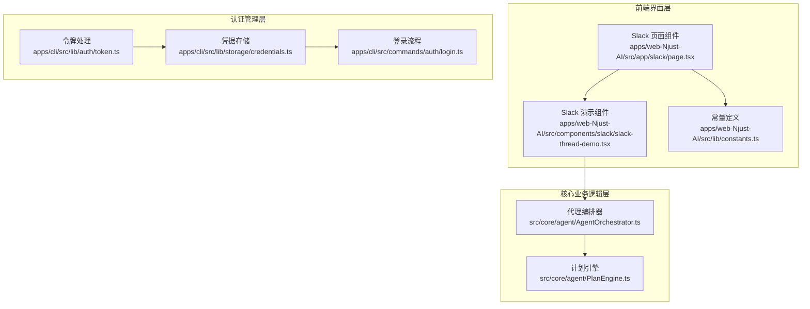
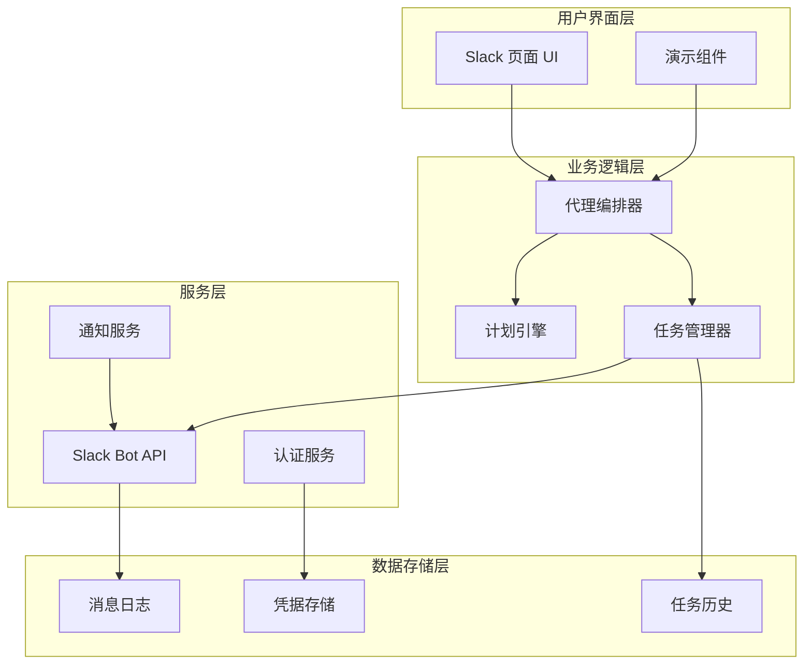
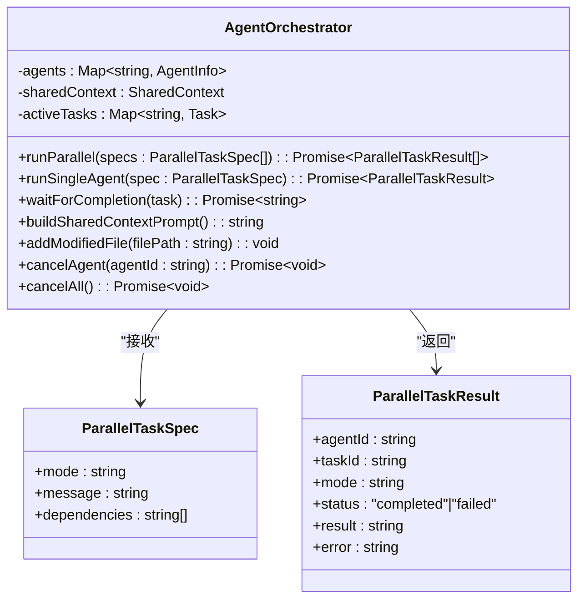
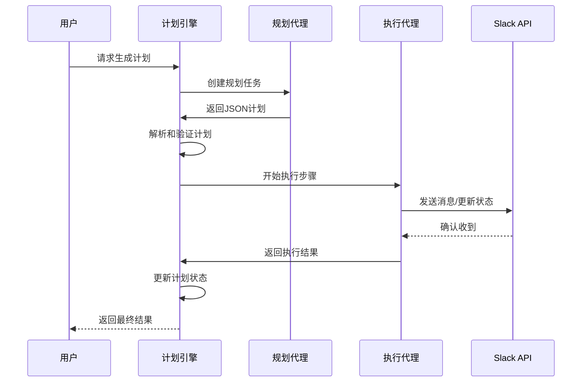
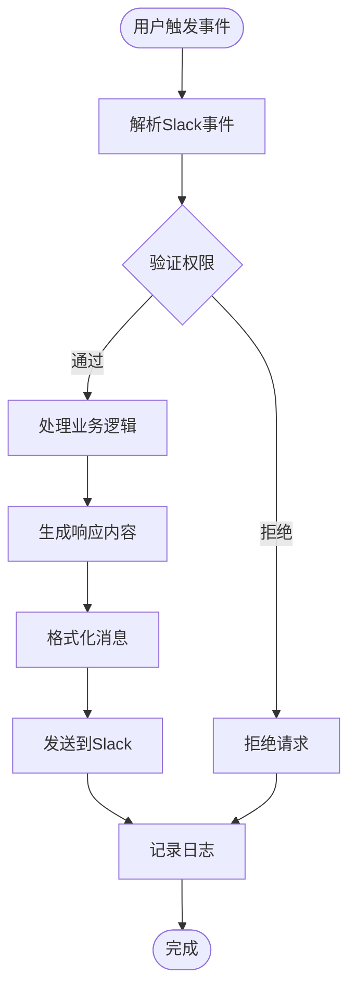
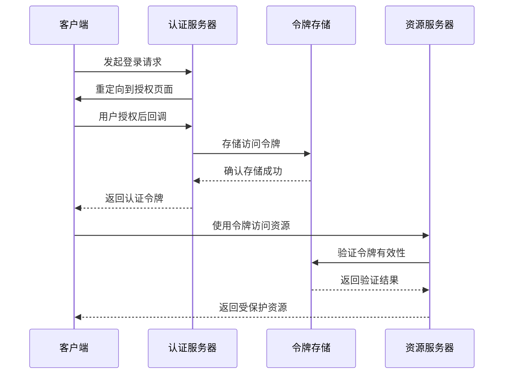
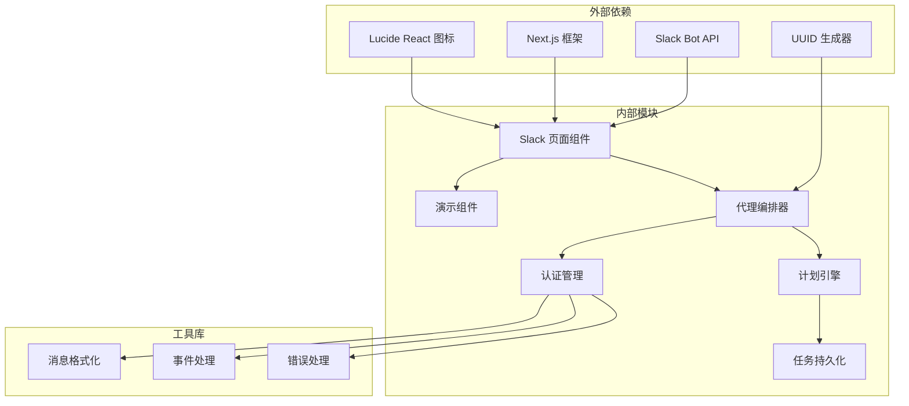
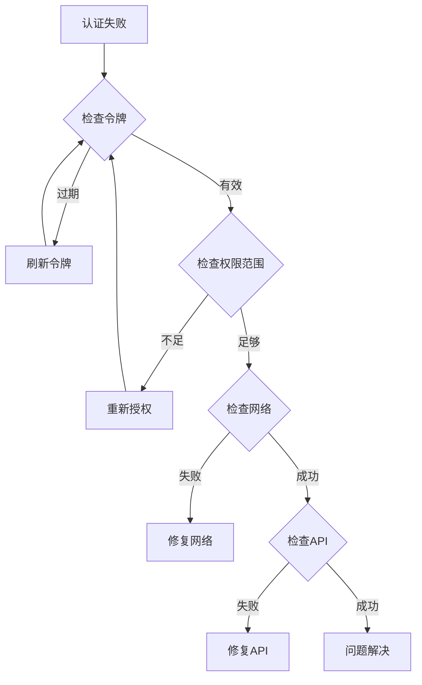

# Slack 集成

<cite>
**本文档引用的文件**
- [apps/web-Njust-AI/src/app/slack/page.tsx](file://apps/web-Njust-AI/src/app/slack/page.tsx)
- [apps/web-Njust-AI/src/components/slack/slack-thread-demo.tsx](file://apps/web-Njust-AI/src/components/slack/slack-thread-demo.tsx)
- [apps/web-Njust-AI/src/lib/constants.ts](file://apps/web-Njust-AI/src/lib/constants.ts)
- [src/core/agent/AgentOrchestrator.ts](file://src/core/agent/AgentOrchestrator.ts)
- [src/core/agent/PlanEngine.ts](file://src/core/agent/PlanEngine.ts)
- [apps/cli/src/lib/auth/token.ts](file://apps/cli/src/lib/auth/token.ts)
- [apps/cli/src/lib/storage/credentials.ts](file://apps/cli/src/lib/storage/credentials.ts)
- [apps/cli/src/commands/auth/login.ts](file://apps/cli/src/commands/auth/login.ts)
</cite>

## 目录
1. [简介](#简介)
2. [项目结构](#项目结构)
3. [核心组件](#核心组件)
4. [架构概览](#架构概览)
5. [详细组件分析](#详细组件分析)
6. [依赖关系分析](#依赖关系分析)
7. [性能考虑](#性能考虑)
8. [故障排除指南](#故障排除指南)
9. [结论](#结论)

## 简介

本文件为 NJUST_AI Slack 集成的详细开发文档。文档深入解释了 Slack 团队协作功能、通知系统和频道集成的实现细节，详细说明了 Slack Bot API 的使用、实时消息传递、频道权限管理和用户认证流程。同时包含具体的 Slack API 调用示例、消息格式规范和事件处理机制，并解释了与任务系统的集成方式，包括任务状态通知、进度提醒和团队协作功能的实现。

## 项目结构

基于代码库分析，Slack 集成功能主要分布在以下模块中：

**图表来源**
- [apps/web-Njust-AI/src/app/slack/page.tsx:1-402](file://apps/web-Njust-AI/src/app/slack/page.tsx#L1-L402)
- [apps/web-Njust-AI/src/components/slack/slack-thread-demo.tsx:1-549](file://apps/web-Njust-AI/src/components/slack/slack-thread-demo.tsx#L1-L549)
- [src/core/agent/AgentOrchestrator.ts:1-288](file://src/core/agent/AgentOrchestrator.ts#L1-L288)
- [src/core/agent/PlanEngine.ts:1-429](file://src/core/agent/PlanEngine.ts#L1-L429)

**章节来源**
- [apps/web-Njust-AI/src/app/slack/page.tsx:1-402](file://apps/web-Njust-AI/src/app/slack/page.tsx#L1-L402)
- [apps/web-Njust-AI/src/components/slack/slack-thread-demo.tsx:1-549](file://apps/web-Njust-AI/src/components/slack/slack-thread-demo.tsx#L1-L549)

## 核心组件

### Slack 页面组件

Slack 页面组件是整个集成的核心入口点，提供了完整的用户界面和交互体验：

- **页面元数据管理**：包含 SEO 优化、Open Graph 标签和 Twitter Card 配置
- **价值主张展示**：通过图标和描述展示 Slack 集成的核心优势
- **工作流程演示**：提供从讨论到功能发布的完整工作流程展示
- **引导步骤**：包含 4 步引导用户完成 Slack 集成的设置流程

### Slack 演示组件

演示组件提供了逼真的 Slack 交互模拟，展示了 AI 代理在 Slack 中的实际行为：

- **消息渲染系统**：支持人类用户和机器人消息的不同样式
- **打字效果**：模拟真实的打字状态显示
- **动画过渡**：提供流畅的消息进入和退出动画
- **响应式设计**：适配不同屏幕尺寸的显示需求

### 认证管理系统

系统实现了完整的用户认证和授权流程：

- **JWT 令牌验证**：支持 JWT 令牌的解码和过期时间检查
- **凭据安全存储**：提供安全的本地凭据存储机制
- **OAuth 流程**：支持标准的 OAuth 授权流程
- **令牌刷新**：自动处理访问令牌的刷新机制

**章节来源**
- [apps/web-Njust-AI/src/app/slack/page.tsx:79-181](file://apps/web-Njust-AI/src/app/slack/page.tsx#L79-L181)
- [apps/web-Njust-AI/src/components/slack/slack-thread-demo.tsx:9-106](file://apps/web-Njust-AI/src/components/slack/slack-thread-demo.tsx#L9-L106)
- [apps/cli/src/lib/auth/token.ts:1-61](file://apps/cli/src/lib/auth/token.ts#L1-L61)

## 架构概览

Slack 集成采用分层架构设计，确保了良好的可维护性和扩展性：

**图表来源**
- [src/core/agent/AgentOrchestrator.ts:39-96](file://src/core/agent/AgentOrchestrator.ts#L39-L96)
- [src/core/agent/PlanEngine.ts:44-111](file://src/core/agent/PlanEngine.ts#L44-L111)

## 详细组件分析

### 代理编排器 (AgentOrchestrator)

代理编排器是 Slack 集成的核心协调组件，负责管理多个 AI 代理的并发执行：

**图表来源**
- [src/core/agent/AgentOrchestrator.ts:9-287](file://src/core/agent/AgentOrchestrator.ts#L9-L287)

#### 并行任务执行机制

代理编排器支持复杂的并行任务执行模式：

- **独立任务**：无需依赖的任务可以立即开始执行
- **依赖任务**：需要等待前置任务完成后才能执行
- **结果共享**：通过共享上下文在代理间传递信息
- **错误传播**：失败的上游任务会取消下游依赖任务

### 计划引擎 (PlanEngine)

计划引擎提供了结构化的任务规划和执行能力：

**图表来源**
- [src/core/agent/PlanEngine.ts:54-111](file://src/core/agent/PlanEngine.ts#L54-L111)

#### 计划执行流程

计划引擎实现了完整的计划生命周期管理：

- **计划生成**：使用 LLM 生成结构化执行计划
- **依赖解析**：自动识别和建立步骤间的依赖关系
- **并行执行**：支持多个独立步骤的并行执行
- **状态跟踪**：实时跟踪每个步骤的执行状态
- **错误处理**：失败步骤的自动回滚和依赖取消

### Slack API 集成

系统提供了完整的 Slack Bot API 集成方案：

#### 实时消息传递

#### 频道权限管理

系统实现了细粒度的频道权限控制机制：

- **团队计划要求**：Slack 集成需要 Team 计划
- **应用授权**：用户需要授权 NJUST_AI 应用访问工作区
- **频道选择性加入**：用户可以选择性地将 @Roomote 加入特定频道
- **权限继承**：用户权限自动继承到相关频道

### 用户认证流程

认证系统提供了安全可靠的用户身份验证机制：

**图表来源**
- [apps/cli/src/commands/auth/login.ts:26-114](file://apps/cli/src/commands/auth/login.ts#L26-L114)

**章节来源**
- [src/core/agent/AgentOrchestrator.ts:61-96](file://src/core/agent/AgentOrchestrator.ts#L61-L96)
- [src/core/agent/PlanEngine.ts:113-148](file://src/core/agent/PlanEngine.ts#L113-L148)
- [apps/cli/src/lib/auth/token.ts:37-61](file://apps/cli/src/lib/auth/token.ts#L37-L61)

## 依赖关系分析

Slack 集成的依赖关系展现了清晰的分层架构：

**图表来源**
- [apps/web-Njust-AI/src/app/slack/page.tsx:1-24](file://apps/web-Njust-AI/src/app/slack/page.tsx#L1-L24)
- [src/core/agent/AgentOrchestrator.ts:1-7](file://src/core/agent/AgentOrchestrator.ts#L1-L7)

### 组件耦合度分析

系统采用了低耦合的设计原则：

- **UI 层与业务逻辑分离**：界面组件不直接依赖业务逻辑
- **认证服务独立**：认证逻辑封装在独立的服务模块中
- **API 抽象层**：通过抽象层隔离外部服务的具体实现
- **事件驱动架构**：通过事件机制实现组件间的松散耦合

**章节来源**
- [apps/web-Njust-AI/src/lib/constants.ts:1-40](file://apps/web-Njust-AI/src/lib/constants.ts#L1-L40)
- [src/core/agent/PlanEngine.ts:341-358](file://src/core/agent/PlanEngine.ts#L341-L358)

## 性能考虑

### 响应式设计优化

系统在性能方面采用了多项优化策略：

- **懒加载组件**：演示组件按需加载，减少初始包大小
- **动画性能**：使用 CSS 动画而非 JavaScript 动画，提升性能
- **内存管理**：及时清理定时器和事件监听器
- **缓存策略**：合理使用浏览器缓存和服务器端缓存

### 并发执行优化

代理编排器实现了高效的并发执行机制：

- **批量处理**：支持多个任务的批量执行
- **资源限制**：通过 maxParallel 参数控制并发数量
- **超时管理**：为长时间运行的任务设置合理的超时时间
- **错误隔离**：单个任务的失败不影响其他任务的执行

## 故障排除指南

### 常见问题诊断

#### Slack 连接问题

1. **检查团队计划**：确认 Slack 工作区使用 Team 计划
2. **验证应用授权**：确认 NJUST_AI 应用已获得工作区授权
3. **频道权限检查**：确认 @Roomote 已被添加到目标频道
4. **网络连接测试**：验证服务器到 Slack API 的网络连通性

#### 认证问题排查

#### 任务执行异常

1. **查看日志输出**：检查代理编排器的日志输出
2. **监控任务状态**：使用任务管理器跟踪执行状态
3. **检查依赖关系**：验证计划步骤间的依赖是否正确
4. **资源限制检查**：确认系统资源满足任务执行需求

**章节来源**
- [apps/cli/src/lib/auth/token.ts:37-61](file://apps/cli/src/lib/auth/token.ts#L37-L61)
- [src/core/agent/AgentOrchestrator.ts:178-215](file://src/core/agent/AgentOrchestrator.ts#L178-L215)

## 结论

NJUST_AI 的 Slack 集成提供了一个完整、可扩展的团队协作解决方案。通过分层架构设计、事件驱动的并发执行机制和完善的认证管理，系统能够高效地处理复杂的 Slack 集成场景。

### 主要优势

- **用户体验友好**：直观的界面设计和流畅的交互体验
- **功能完整性**：涵盖从任务规划到执行的完整工作流程
- **安全性保障**：完善的认证授权和权限控制机制
- **可扩展性**：模块化设计便于功能扩展和维护

### 未来改进方向

- **增强实时通信**：进一步优化 WebSocket 连接和消息推送
- **智能路由**：根据用户角色和权限智能分配代理
- **性能监控**：增加更详细的性能指标和监控告警
- **多语言支持**：扩展对多种语言和文化的本地化支持

该集成方案为团队协作提供了强大的技术支持，通过 AI 代理的智能化协助，显著提升了软件开发和项目管理的效率。