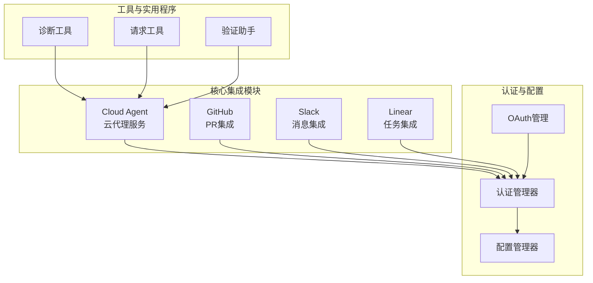
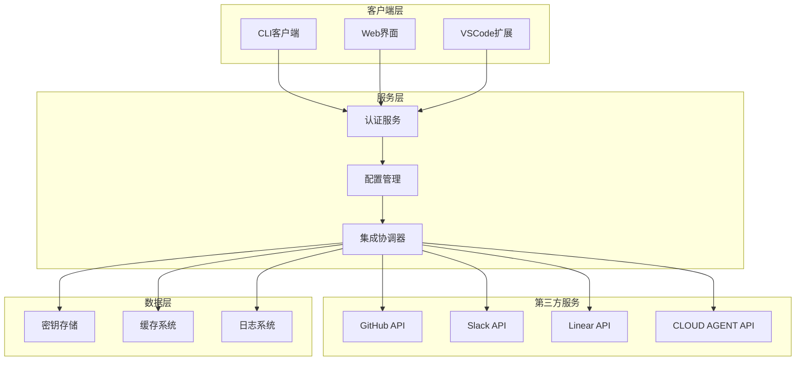
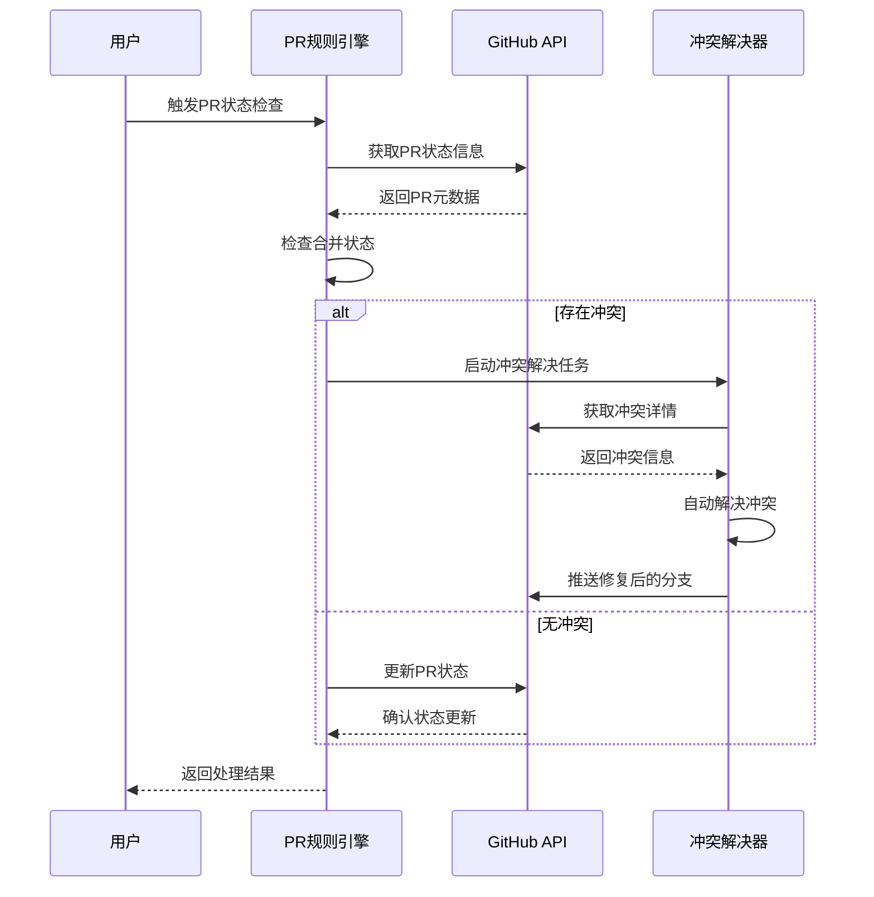
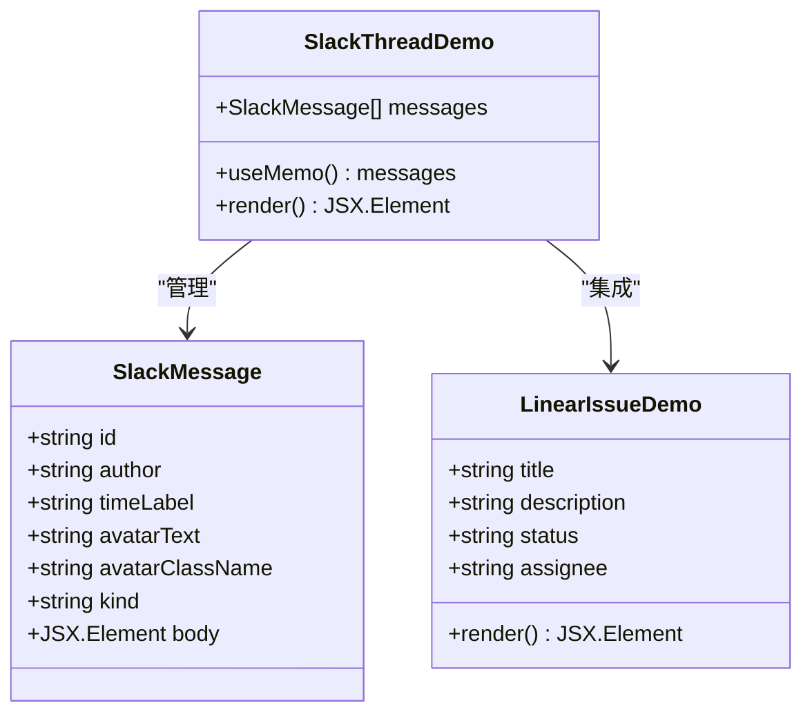
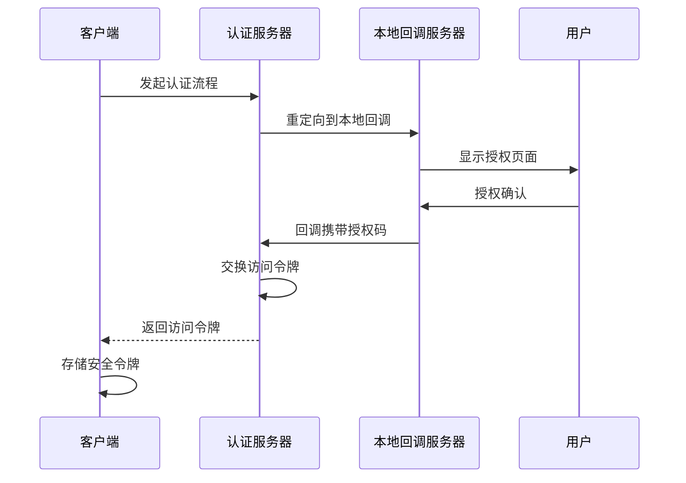
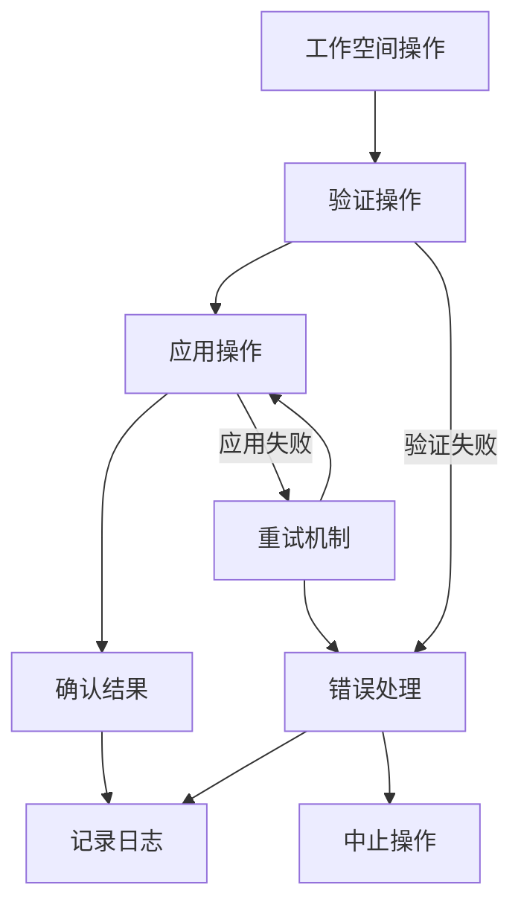
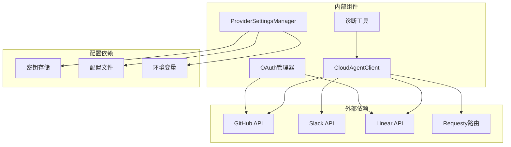

# 第三方服务集成

<cite>
**本文档引用的文件**
- [CloudAgentClient.ts](file://src/services/cloud-agent/CloudAgentClient.ts)
- [applyCloudWorkspaceOps.ts](file://src/services/cloud-agent/applyCloudWorkspaceOps.ts)
- [parseWorkspaceOps.ts](file://src/services/cloud-agent/parseWorkspaceOps.ts)
- [login.ts](file://apps/cli/src/commands/auth/login.ts)
- [ProviderSettingsManager.ts](file://src/core/config/ProviderSettingsManager.ts)
- [index.ts](file://src/integrations/diagnostics/index.ts)
- [qwen-code.ts](file://src/api/providers/qwen-code.ts)
- [oauth.ts](file://src/integrations/openai-codex/oauth.ts)
- [3_common_patterns.xml](file://.njust-ai/rules-pr-fixer/3_common_patterns.xml)
- [1_workflow.xml](file://.njust-ai/rules-merge-resolver/1_workflow.xml)
- [3_tool_usage.xml](file://.njust-ai/rules-merge-resolver/3_tool_usage.xml)
- [page.tsx](file://apps/web-Njust-AI/src/app/linear/page.tsx)
- [slack-thread-demo.tsx](file://apps/web-Njust-AI/src/components/slack/slack-thread-demo.tsx)
- [page.js](file://apps/web-Njust-AI/.next/server/app/slack/page.js)
- [requesty.ts](file://src/shared/utils/requesty.ts)
- [validation-helpers.ts](file://src/services/code-index/shared/validation-helpers.ts)
- [Task.ts](file://src/core/task/Task.ts)
- [test-cloud-agent-mock.mjs](file://src/test-cloud-agent-mock.mjs)
</cite>

## 目录
1. [简介](#简介)
2. [项目结构](#项目结构)
3. [核心组件](#核心组件)
4. [架构概览](#架构概览)
5. [详细组件分析](#详细组件分析)
6. [依赖关系分析](#依赖关系分析)
7. [性能考虑](#性能考虑)
8. [故障排除指南](#故障排除指南)
9. [结论](#结论)

## 简介

本文件为第三方服务集成的详细开发文档，深入解释了系统中现有的第三方服务集成实现，包括GitHub集成（PR评论、状态同步、分支管理）、Slack集成（团队协作、通知系统、频道集成）、Linear集成（任务管理、进度跟踪）等核心第三方服务的实现细节。

文档详细说明了每个集成的服务端点、认证机制、数据同步策略和错误处理，包含具体的API调用示例、配置参数说明和安全最佳实践。同时解释了与现有系统的数据交换协议和集成模式。

## 项目结构

项目采用模块化架构，第三方服务集成功能分布在多个关键目录中：



**图表来源**
- [CloudAgentClient.ts:1-339](file://src/services/cloud-agent/CloudAgentClient.ts#L1-L339)
- [ProviderSettingsManager.ts:99-137](file://src/core/config/ProviderSettingsManager.ts#L99-L137)
- [login.ts:26-83](file://apps/cli/src/commands/auth/login.ts#L26-L83)

**章节来源**
- [CloudAgentClient.ts:1-339](file://src/services/cloud-agent/CloudAgentClient.ts#L1-L339)
- [ProviderSettingsManager.ts:99-137](file://src/core/config/ProviderSettingsManager.ts#L99-L137)
- [login.ts:26-83](file://apps/cli/src/commands/auth/login.ts#L26-L83)

## 核心组件

### 云代理客户端 (CloudAgentClient)

云代理客户端是第三方服务集成的核心组件，负责与云端服务进行通信和数据交换。

**主要功能特性：**
- REST API通信协议
- 设备令牌认证机制
- 请求超时和中断处理
- 工作空间操作应用
- 延迟执行协议支持

**关键接口：**
- `connect()`: 健康检查连接
- `submitTask()`: 提交任务执行
- `compile()`: 远程编译执行
- `deferredStart()`: 延迟执行启动
- `deferredResume()`: 延迟执行恢复

**章节来源**
- [CloudAgentClient.ts:43-339](file://src/services/cloud-agent/CloudAgentClient.ts#L43-L339)

### 认证管理系统

提供统一的认证管理机制，支持多种认证方式和配置存储。

**核心功能：**
- 多提供商配置管理
- 密钥轮换和刷新
- 安全存储机制
- 配置迁移和兼容性

**章节来源**
- [ProviderSettingsManager.ts:99-137](file://src/core/config/ProviderSettingsManager.ts#L99-L137)
- [login.ts:26-83](file://apps/cli/src/commands/auth/login.ts#L26-L83)

### GitHub集成规则

基于Roo规则引擎的GitHub集成，提供PR管理和分支操作的自动化流程。

**主要规则模式：**
- PR状态检查和监控
- 冲突检测和解决
- 实时检查运行监控
- 安全推送操作

**章节来源**
- [3_common_patterns.xml:1-88](file://.njust-ai/rules-pr-fixer/3_common_patterns.xml#L1-L88)
- [1_workflow.xml:100-133](file://.njust-ai/rules-merge-resolver/1_workflow.xml#L100-L133)
- [3_tool_usage.xml:31-73](file://.njust-ai/rules-merge-resolver/3_tool_usage.xml#L31-L73)

## 架构概览

系统采用分层架构设计，实现了松耦合的第三方服务集成：



**图表来源**
- [CloudAgentClient.ts:96-105](file://src/services/cloud-agent/CloudAgentClient.ts#L96-L105)
- [ProviderSettingsManager.ts:580-598](file://src/core/config/ProviderSettingsManager.ts#L580-L598)

## 详细组件分析

### GitHub集成实现

GitHub集成通过Roo规则引擎实现PR的完整生命周期管理：

#### PR状态监控流程



**图表来源**
- [3_common_patterns.xml:72-80](file://.njust-ai/rules-pr-fixer/3_common_patterns.xml#L72-L80)
- [1_workflow.xml:100-133](file://.njust-ai/rules-merge-resolver/1_workflow.xml#L100-L133)

#### 分支管理策略

系统支持多种分支操作场景：

**强制检出PR分支：**
- 使用 `gh pr checkout [PR_NUMBER] --force` 强制检出
- 处理本地分支冲突
- 确保工作区清洁状态

**主分支变基：**
- `git fetch origin main` 获取最新代码
- `GITHUB_EDITOR=true git rebase origin/main` 变基到主分支
- 自动检测和报告冲突

**远程推送策略：**
- 检测PR来源（fork或直接）
- 选择正确的远程仓库（origin或fork）
- 使用 `--force-with-lease` 安全推送

**章节来源**
- [3_common_patterns.xml:50-88](file://.njust-ai/rules-pr-fixer/3_common_patterns.xml#L50-L88)
- [3_tool_usage.xml:31-73](file://.njust-ai/rules-merge-resolver/3_tool_usage.xml#L31-L73)

### Slack集成实现

Slack集成为团队协作提供了完整的消息传递和通知系统：

#### Slack消息线程演示

系统提供了完整的Slack消息线程交互演示，展示如何在Slack中进行AI驱动的对话：



**图表来源**
- [slack-thread-demo.tsx:113-153](file://apps/web-Njust-AI/src/components/slack/slack-thread-demo.tsx#L113-L153)

#### Web界面集成

Web界面提供了Slack集成的完整展示页面：

**页面特性：**
- 响应式设计适配
- 现代UI组件库
- SEO优化元数据
- 社交媒体分享支持

**章节来源**
- [page.js:1-18](file://apps/web-Njust-AI/.next/server/app/slack/page.js#L1-L18)
- [slack-thread-demo.tsx:113-153](file://apps/web-Njust-AI/src/components/slack/slack-thread-demo.tsx#L113-L153)

### Linear集成实现

Linear集成为任务管理和进度跟踪提供了无缝的AI驱动体验：

#### Linear任务工作流

```mermaid
flowchart TD
Start([开始Linear集成]) --> Assign[分配任务给@NJUST_AI]
Assign --> Analyze[AI分析需求]
Analyze --> Write[编写代码]
Write --> Test[自动测试]
Test --> Branch[创建分支]
Branch --> PR[创建PR]
PR --> Review[团队审查]
Review --> Merge[合并代码]
Merge --> Notify[通知Linear]
Notify --> Complete[任务完成]
Analyze --> |需要澄清| Clarify[要求澄清]
Clarify --> Analyze
Test --> |测试失败| Fix[自动修复]
Fix --> Test
```

**图表来源**
- [page.tsx:1-313](file://apps/web-Njust-AI/src/app/linear/page.tsx#L1-L313)

#### 集成特性

**核心价值主张：**
- 在Linear中直接分配开发任务
- 实时进度可见性
- AI驱动的代码生成和审查
- 完整的审计追踪
- 组织级配置管理

**章节来源**
- [page.tsx:78-115](file://apps/web-Njust-AI/src/app/linear/page.tsx#L78-L115)

### 云代理服务集成

云代理服务是系统与第三方服务通信的核心桥梁：

#### API端点定义

| 端点 | 方法 | 功能描述 | 认证要求 |
|------|------|----------|----------|
| `/health` | GET | 健康检查 | 设备令牌 |
| `/v1/run` | POST | 任务执行 | 设备令牌 + API密钥 |
| `/v1/run/compile` | POST | 编译执行 | 设备令牌 + API密钥 |
| `/v1/run/deferred/start` | POST | 延迟执行启动 | 设备令牌 + API密钥 |
| `/v1/run/deferred/resume` | POST | 延迟执行恢复 | 设备令牌 + API密钥 |

#### 请求头规范

**必需请求头：**
- `Content-Type: application/json`
- `X-Device-Token: [设备令牌]`

**可选请求头：**
- `X-API-Key: [API密钥]`

#### 响应格式

**标准响应结构：**
```json
{
  "ok": true,
  "memory_summary": "内存摘要信息",
  "tokens_in": 0,
  "tokens_out": 0,
  "cost": 0.0,
  "logs": ["日志条目"],
  "workspace_ops": {
    "version": 1,
    "operations": [
      {
        "op": "write_file",
        "path": "/path/to/file",
        "content": "文件内容"
      }
    ]
  }
}
```

**章节来源**
- [CloudAgentClient.ts:118-206](file://src/services/cloud-agent/CloudAgentClient.ts#L118-L206)
- [CloudAgentClient.ts:212-257](file://src/services/cloud-agent/CloudAgentClient.ts#L212-L257)

### 认证机制实现

系统采用多层认证机制确保安全性：

#### OAuth认证流程



**图表来源**
- [login.ts:26-83](file://apps/cli/src/commands/auth/login.ts#L26-L83)

#### 设备令牌认证

**设备令牌生成：**
- 基于随机字节生成唯一标识符
- 支持本地回调服务器验证
- 防止CSRF攻击的状态参数验证

**章节来源**
- [login.ts:26-83](file://apps/cli/src/commands/auth/login.ts#L26-L83)

### 数据同步策略

系统实现了多种数据同步策略以确保数据一致性：

#### 工作空间操作同步



**图表来源**
- [applyCloudWorkspaceOps.ts:38-63](file://src/services/cloud-agent/applyCloudWorkspaceOps.ts#L38-L63)

#### 诊断数据同步

系统提供诊断数据的增量同步能力：

**诊断差异检测：**
- 深度比较新旧诊断数据
- 识别新增问题
- 支持按严重级别过滤

**章节来源**
- [index.ts:5-22](file://src/integrations/diagnostics/index.ts#L5-L22)

## 依赖关系分析

系统中的第三方服务集成存在以下关键依赖关系：



**图表来源**
- [CloudAgentClient.ts:96-105](file://src/services/cloud-agent/CloudAgentClient.ts#L96-L105)
- [ProviderSettingsManager.ts:580-598](file://src/core/config/ProviderSettingsManager.ts#L580-L598)

**章节来源**
- [CloudAgentClient.ts:96-105](file://src/services/cloud-agent/CloudAgentClient.ts#L96-L105)
- [ProviderSettingsManager.ts:580-598](file://src/core/config/ProviderSettingsManager.ts#L580-L598)

## 性能考虑

### 缓存策略

系统实现了多层次的缓存机制：

**配置缓存：**
- ProviderSettingsManager使用内存缓存
- 支持配置热更新
- 避免频繁的密钥存储访问

**诊断缓存：**
- 诊断结果增量比较
- 文件统计缓存减少I/O操作
- 支持最大诊断数量限制

### 错误处理优化

**超时和重试机制：**
- 请求超时控制（默认5分钟）
- 断线重连支持
- 延迟执行的优雅降级

**资源管理：**
- 自动清理AbortController
- 异步操作的内存泄漏防护
- 文件操作的原子性保证

## 故障排除指南

### 常见问题诊断

#### 认证失败排查

**401未授权错误：**
- 检查X-API-Key是否正确设置
- 验证设备令牌有效性
- 确认API密钥权限范围

**章节来源**
- [CloudAgentClient.ts:32-41](file://src/services/cloud-agent/CloudAgentClient.ts#L32-L41)

#### 网络连接问题

**健康检查失败：**
- 验证服务器URL可达性
- 检查防火墙和代理设置
- 确认SSL证书有效性

**请求超时处理：**
- 增加requestTimeoutMs配置
- 检查网络延迟
- 考虑使用CDN加速

#### 数据同步问题

**工作空间操作失败：**
- 检查文件路径长度限制
- 验证操作权限
- 确认磁盘空间充足

**章节来源**
- [applyCloudWorkspaceOps.ts:21-33](file://src/services/cloud-agent/applyCloudWorkspaceOps.ts#L21-L33)

### 日志和监控

系统提供了全面的日志记录机制：

**日志级别：**
- 错误级别：API错误和异常
- 警告级别：配置问题和性能警告
- 信息级别：正常操作和状态更新
- 调试级别：详细的技术信息

**监控指标：**
- API调用成功率
- 响应时间分布
- 错误类型统计
- 资源使用情况

## 结论

本第三方服务集成功档详细阐述了系统中现有的GitHub、Slack、Linear等第三方服务的集成实现。通过模块化的架构设计、完善的认证机制、可靠的数据同步策略和全面的错误处理，系统为开发者提供了稳定可靠的第三方服务集成解决方案。

未来可以考虑的功能扩展包括：
- 更多第三方服务的标准化集成接口
- 增强的监控和告警机制
- 更灵活的配置管理和动态加载
- 改进的性能优化和资源管理

这些集成组件为构建企业级的AI辅助开发平台奠定了坚实的基础，支持从个人开发者到大型团队的各种使用场景。