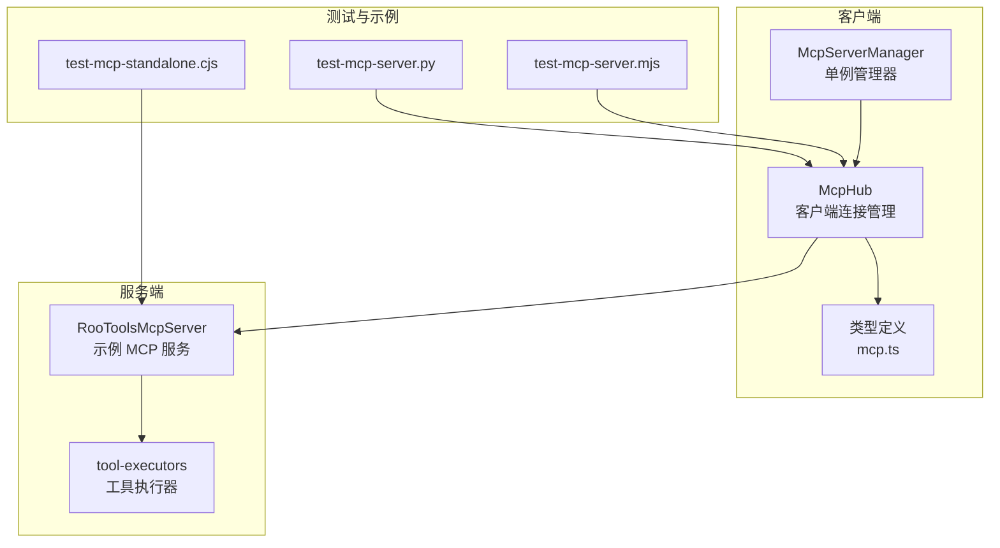
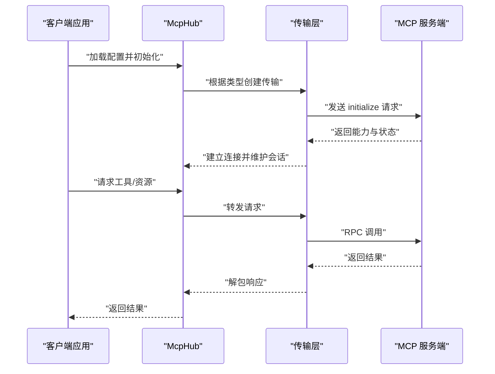
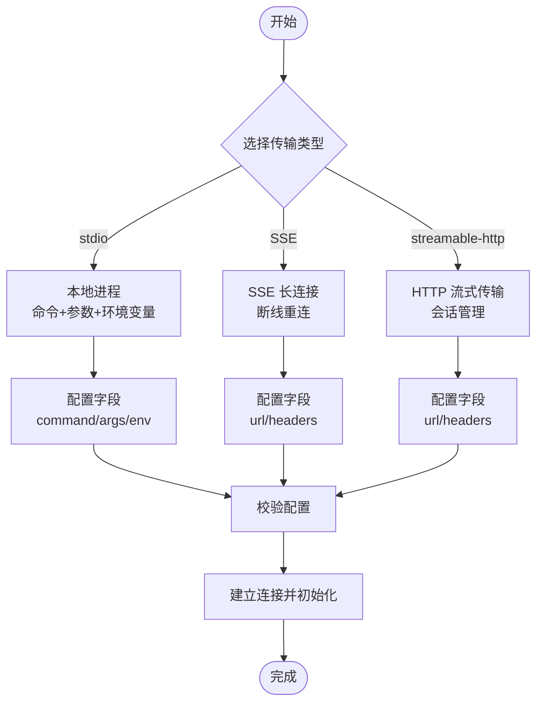
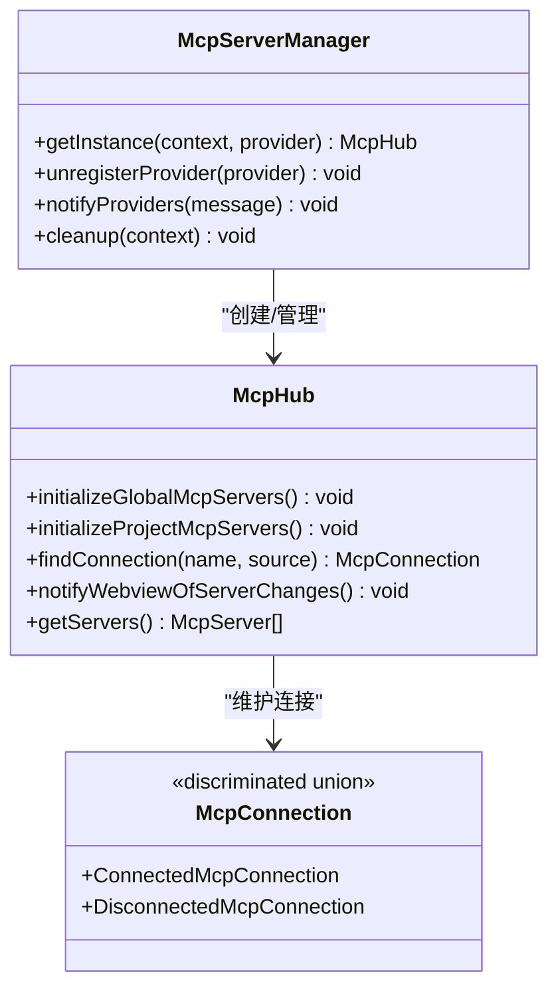
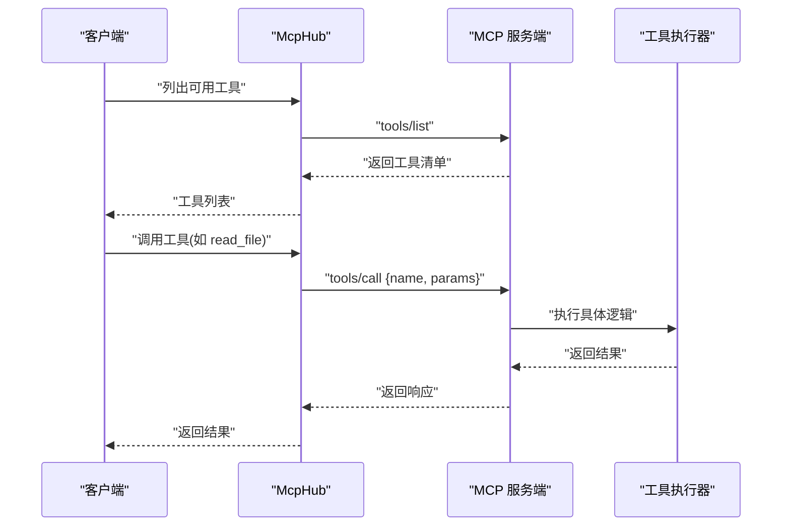
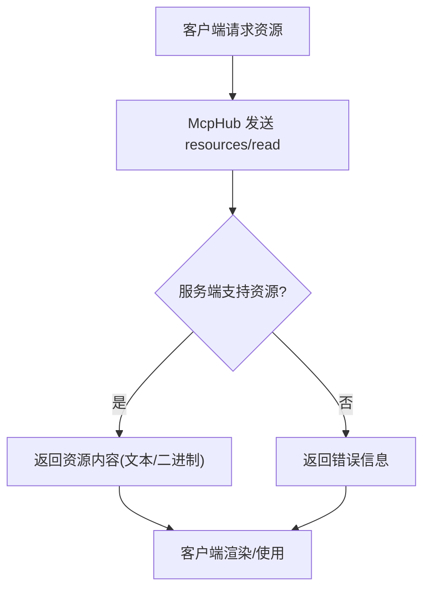
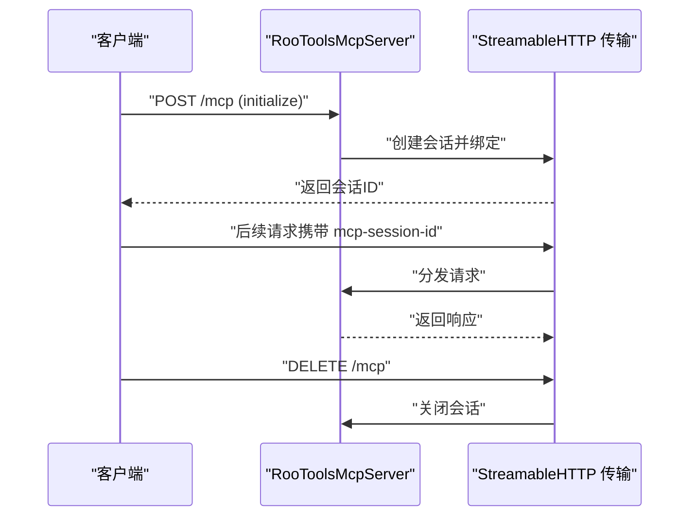
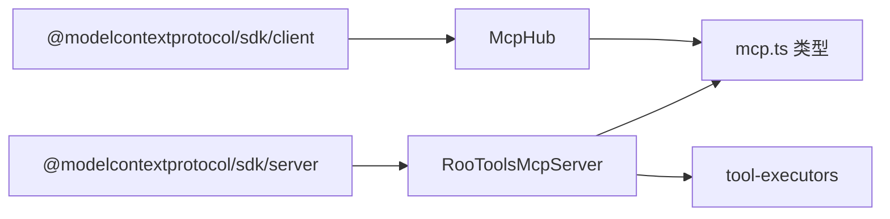

# MCP 协议基础

<cite>
**本文引用的文件**
- [cangjie-mcp.md](file://docs/cangjie-mcp.md)
- [mcp.ts](file://packages/types/src/mcp.ts)
- [McpHub.ts](file://src/services/mcp/McpHub.ts)
- [McpServerManager.ts](file://src/services/mcp/McpServerManager.ts)
- [RooToolsMcpServer.ts](file://src/services/mcp-server/RooToolsMcpServer.ts)
- [tool-executors.ts](file://src/services/mcp-server/tool-executors.ts)
- [mcp_server.ts](file://src/core/prompts/tools/native-tools/mcp_server.ts)
- [mcp.ts](file://src/core/auto-approval/mcp.ts)
- [cangjie-mcp.example.json](file://docs/examples/cangjie-mcp.example.json)
- [test-mcp-server.mjs](file://test-mcp-server.mjs)
- [test-mcp-standalone.cjs](file://test-mcp-standalone.cjs)
- [test-mcp-server.py](file://test-mcp-server.py)
- [sse-stream.ts](file://apps/web-evals/src/lib/server/sse-stream.ts)
</cite>

## 目录
1. [简介](#简介)
2. [项目结构](#项目结构)
3. [核心组件](#核心组件)
4. [架构总览](#架构总览)
5. [详细组件分析](#详细组件分析)
6. [依赖关系分析](#依赖关系分析)
7. [性能考虑](#性能考虑)
8. [故障排除指南](#故障排除指南)
9. [结论](#结论)
10. [附录](#附录)

## 简介
本指南面向希望快速掌握 MCP（Model Context Protocol）协议基础的开发者与用户。文档从协议核心概念入手，结合代码库中的实现细节，系统讲解 MCP 的三种传输类型（stdio、SSE、streamable-http）、服务器发现与连接、工具注册与调用、资源管理与会话管理，并提供最佳实践与性能优化建议。读者无需具备深厚的协议背景，也能通过本指南理解并实现在本地或云端部署 MCP 服务，以及在客户端中集成与使用。

## 项目结构
本仓库围绕 MCP 协议提供了完整的客户端与服务端实现，涵盖配置、连接、工具与资源管理、会话与传输层等模块。关键目录与文件如下：
- 配置与文档：docs/cangjie-mcp.md、docs/examples/cangjie-mcp.example.json
- 类型定义：packages/types/src/mcp.ts
- 客户端 Hub：src/services/mcp/McpHub.ts、src/services/mcp/McpServerManager.ts
- 服务端示例：src/services/mcp-server/RooToolsMcpServer.ts、src/services/mcp-server/tool-executors.ts
- 工具与资源集成：src/core/prompts/tools/native-tools/mcp_server.ts、src/core/auto-approval/mcp.ts
- 测试与示例：test-mcp-server.mjs、test-mcp-standalone.cjs、test-mcp-server.py
- SSE 实现参考：apps/web-evals/src/lib/server/sse-stream.ts

**图表来源**
- [McpHub.ts:151-200](file://src/services/mcp/McpHub.ts#L151-L200)
- [McpServerManager.ts:9-54](file://src/services/mcp/McpServerManager.ts#L9-L54)
- [RooToolsMcpServer.ts:27-161](file://src/services/mcp-server/RooToolsMcpServer.ts#L27-L161)
- [tool-executors.ts:28-207](file://src/services/mcp-server/tool-executors.ts#L28-L207)
- [mcp.ts:1-187](file://packages/types/src/mcp.ts#L1-L187)

**章节来源**
- [McpHub.ts:151-200](file://src/services/mcp/McpHub.ts#L151-L200)
- [McpServerManager.ts:9-54](file://src/services/mcp/McpServerManager.ts#L9-L54)
- [RooToolsMcpServer.ts:27-161](file://src/services/mcp-server/RooToolsMcpServer.ts#L27-L161)
- [tool-executors.ts:28-207](file://src/services/mcp-server/tool-executors.ts#L28-L207)
- [mcp.ts:1-187](file://packages/types/src/mcp.ts#L1-L187)

## 核心组件
- 类型与数据模型：定义了服务器、工具、资源、执行状态、错误条目等核心类型，用于客户端与服务端之间的契约约束。
- 客户端 Hub：负责服务器配置解析、连接建立、状态管理、事件通知与资源/工具查询。
- 服务端示例：提供基于 HTTP 的流式传输（streamable-http）示例，注册常用文件与命令操作工具。
- 工具执行器：封装文件读写、目录遍历、正则搜索、命令执行、diff 应用等本地能力。
- 集成与自动审批：将 MCP 工具动态注入到大模型 API 的函数调用签名中，并支持白名单策略。

**章节来源**
- [mcp.ts:13-187](file://packages/types/src/mcp.ts#L13-L187)
- [McpHub.ts:44-87](file://src/services/mcp/McpHub.ts#L44-L87)
- [RooToolsMcpServer.ts:44-161](file://src/services/mcp-server/RooToolsMcpServer.ts#L44-L161)
- [tool-executors.ts:28-207](file://src/services/mcp-server/tool-executors.ts#L28-L207)
- [mcp_server.ts:14-69](file://src/core/prompts/tools/native-tools/mcp_server.ts#L14-L69)
- [mcp.ts:3-11](file://src/core/auto-approval/mcp.ts#L3-L11)

## 架构总览
MCP 客户端通过 McpHub 统一管理多个 MCP 服务器实例，支持三种传输类型：
- stdio：本地进程通信，适合通过命令行启动的 MCP 服务。
- SSE：基于 Server-Sent Events 的长连接，适合远程托管的 MCP 服务。
- streamable-http：基于 HTTP 的流式传输，支持初始化、请求与关闭生命周期。

**图表来源**
- [McpHub.ts:782-831](file://src/services/mcp/McpHub.ts#L782-L831)
- [RooToolsMcpServer.ts:178-200](file://src/services/mcp-server/RooToolsMcpServer.ts#L178-L200)

**章节来源**
- [McpHub.ts:782-831](file://src/services/mcp/McpHub.ts#L782-L831)
- [RooToolsMcpServer.ts:178-200](file://src/services/mcp-server/RooToolsMcpServer.ts#L178-L200)

## 详细组件分析

### 传输类型与适用场景
- stdio（本地进程）
  - 适用场景：本地开发调试、通过命令行启动的 MCP 服务。
  - 关键特性：通过命令、参数与环境变量启动子进程，标准输入输出进行通信。
  - 配置要点：提供 command 字段，可选 args 与 env；路径建议使用正斜杠或转义。
- SSE（远程服务）
  - 适用场景：云端托管的 MCP 服务，需要长连接与断线重连。
  - 关键特性：基于 EventSource 的断线重连机制，支持自定义请求头。
  - 配置要点：提供 url 与可选 headers；当存在 Authorization 时启用凭证。
- streamable-http（远程服务）
  - 适用场景：HTTP API 风格的 MCP 服务，支持会话管理与流式响应。
  - 关键特性：基于 HTTP 的初始化、请求与关闭流程，支持 mcp-session-id 头部。
  - 配置要点：提供 url 与可选 headers；服务端需实现 /mcp 路径与 CORS 支持。

**图表来源**
- [McpHub.ts:90-141](file://src/services/mcp/McpHub.ts#L90-L141)
- [McpHub.ts:782-831](file://src/services/mcp/McpHub.ts#L782-L831)
- [RooToolsMcpServer.ts:178-200](file://src/services/mcp-server/RooToolsMcpServer.ts#L178-L200)

**章节来源**
- [McpHub.ts:90-141](file://src/services/mcp/McpHub.ts#L90-L141)
- [McpHub.ts:782-831](file://src/services/mcp/McpHub.ts#L782-L831)
- [RooToolsMcpServer.ts:178-200](file://src/services/mcp-server/RooToolsMcpServer.ts#L178-L200)

### 服务器发现与连接
- 配置文件：支持全局与项目级配置，自动监听变更并重连。
- 连接状态：维护连接、连接中、断开状态，记录错误历史。
- 自动化：McpServerManager 提供单例管理，确保跨视图共享同一 Hub 实例。

**图表来源**
- [McpServerManager.ts:20-54](file://src/services/mcp/McpServerManager.ts#L20-L54)
- [McpHub.ts:151-200](file://src/services/mcp/McpHub.ts#L151-L200)
- [McpHub.ts:44-59](file://src/services/mcp/McpHub.ts#L44-L59)

**章节来源**
- [McpServerManager.ts:20-54](file://src/services/mcp/McpServerManager.ts#L20-L54)
- [McpHub.ts:151-200](file://src/services/mcp/McpHub.ts#L151-L200)
- [McpHub.ts:44-59](file://src/services/mcp/McpHub.ts#L44-L59)

### 工具注册与调用
- 工具注册：服务端通过 McpServer.tool 注册工具，定义名称、描述与输入模式。
- 工具执行：工具执行器封装安全的文件系统访问与命令执行，严格限制工作区边界。
- 动态注入：客户端将可用工具转换为大模型 API 的函数签名，支持去重与模式兼容。

**图表来源**
- [RooToolsMcpServer.ts:50-161](file://src/services/mcp-server/RooToolsMcpServer.ts#L50-L161)
- [tool-executors.ts:28-207](file://src/services/mcp-server/tool-executors.ts#L28-L207)
- [mcp_server.ts:14-69](file://src/core/prompts/tools/native-tools/mcp_server.ts#L14-L69)

**章节来源**
- [RooToolsMcpServer.ts:50-161](file://src/services/mcp-server/RooToolsMcpServer.ts#L50-L161)
- [tool-executors.ts:28-207](file://src/services/mcp-server/tool-executors.ts#L28-L207)
- [mcp_server.ts:14-69](file://src/core/prompts/tools/native-tools/mcp_server.ts#L14-L69)

### 资源管理
- 资源读取：客户端通过 resources/read 请求资源，服务端返回文本或二进制内容。
- 资源模板：支持资源 URI 模板，便于动态生成资源访问链接。
- 错误处理：对越界路径、不存在文件、目录访问等进行严格校验与错误反馈。

**图表来源**
- [mcp.ts:78-100](file://packages/types/src/mcp.ts#L78-L100)
- [McpHub.ts:1712-1729](file://src/services/mcp/McpHub.ts#L1712-L1729)

**章节来源**
- [mcp.ts:78-100](file://packages/types/src/mcp.ts#L78-L100)
- [McpHub.ts:1712-1729](file://src/services/mcp/McpHub.ts#L1712-L1729)

### 会话管理与生命周期
- 初始化：客户端首次请求携带 initialize，服务端返回会话标识与能力。
- 请求路由：通过 mcp-session-id 头部识别会话，区分新会话与已有会话。
- 关闭：支持 GET /mcp 与 DELETE /mcp 的生命周期管理。

**图表来源**
- [RooToolsMcpServer.ts:274-338](file://src/services/mcp-server/RooToolsMcpServer.ts#L274-L338)
- [test-mcp-server.mjs:26-73](file://test-mcp-server.mjs#L26-L73)

**章节来源**
- [RooToolsMcpServer.ts:274-338](file://src/services/mcp-server/RooToolsMcpServer.ts#L274-L338)
- [test-mcp-server.mjs:26-73](file://test-mcp-server.mjs#L26-L73)

### 协议规范与消息格式
- JSON-RPC 2.0：所有请求与响应遵循 JSON-RPC 2.0 格式，包含 id、method、params 与结果/错误字段。
- 会话头：通过 mcp-session-id 头部传递会话标识，确保多路复用与状态保持。
- SSE 格式：服务端以 text/event-stream 形式推送事件，每条事件以 data: 开头。
- 错误码：客户端与服务端约定错误码范围，如 -32000（坏请求）、-32700（解析错误）等。

**章节来源**
- [test-mcp-standalone.cjs:220-259](file://test-mcp-standalone.cjs#L220-L259)
- [test-mcp-server.mjs:49-73](file://test-mcp-server.mjs#L49-L73)

## 依赖关系分析
- 客户端依赖：@modelcontextprotocol/sdk 的 client 与 transport 实现，包括 StdioClientTransport、SSEClientTransport、StreamableHTTPClientTransport。
- 服务端依赖：@modelcontextprotocol/sdk 的 server 与 StreamableHTTPServerTransport。
- 工具执行器依赖：文件系统、子进程、正则搜索与目录遍历等本地能力。
- 配置与校验：使用 zod 对服务器配置进行强类型校验，提供清晰的错误信息。

**图表来源**
- [McpHub.ts:4-9](file://src/services/mcp/McpHub.ts#L4-L9)
- [RooToolsMcpServer.ts:4-6](file://src/services/mcp-server/RooToolsMcpServer.ts#L4-L6)
- [mcp.ts:1-10](file://packages/types/src/mcp.ts#L1-L10)

**章节来源**
- [McpHub.ts:4-9](file://src/services/mcp/McpHub.ts#L4-L9)
- [RooToolsMcpServer.ts:4-6](file://src/services/mcp-server/RooToolsMcpServer.ts#L4-L6)
- [mcp.ts:1-10](file://packages/types/src/mcp.ts#L1-L10)

## 性能考虑
- 工具数量阈值：当启用的 MCP 工具超过阈值时，建议减少工具数量或分组启用，避免模型选择困难与性能下降。
- 会话复用：优先使用现有会话而非频繁创建新会话，降低初始化成本。
- SSE 断线重连：合理配置最大重试时间与凭证传递，平衡稳定性与资源消耗。
- 工作区边界检查：工具执行器严格限制路径访问，避免不必要的磁盘扫描与 IO。
- 超时控制：为命令执行与网络请求设置合理的超时时间，防止阻塞影响用户体验。

**章节来源**
- [mcp.ts:7-8](file://packages/types/src/mcp.ts#L7-L8)
- [McpHub.ts:782-831](file://src/services/mcp/McpHub.ts#L782-L831)
- [tool-executors.ts:116-180](file://src/services/mcp-server/tool-executors.ts#L116-L180)

## 故障排除指南
- 连接失败
  - 检查服务器配置类型与字段是否匹配（stdio 需 command，SSE/streamable-http 需 url）。
  - 确认网络可达性与 CORS 配置，特别是 streamable-http 的 mcp-session-id 头部。
  - 查看输出面板中的 MCP 日志通道，定位错误原因。
- 工具调用异常
  - 确认工具名称与输入模式一致，必要时更新工具注册。
  - 检查工作区边界限制，避免路径逃逸导致的权限错误。
- SSE 断线
  - 检查 Authorization 头部与 withCredentials 设置，确保断线重连正常。
  - 调整最大重试时间，避免过短导致频繁抖动。
- 会话问题
  - 确保每次请求都携带正确的 mcp-session-id。
  - 使用 DELETE /mcp 显式关闭会话，释放资源。

**章节来源**
- [McpHub.ts:782-831](file://src/services/mcp/McpHub.ts#L782-L831)
- [RooToolsMcpServer.ts:178-200](file://src/services/mcp-server/RooToolsMcpServer.ts#L178-L200)
- [tool-executors.ts:13-20](file://src/services/mcp-server/tool-executors.ts#L13-L20)
- [test-mcp-server.mjs:49-73](file://test-mcp-server.mjs#L49-L73)

## 结论
本指南从协议基础出发，结合代码库中的客户端 Hub、服务端示例与工具执行器，系统阐述了 MCP 的三种传输类型、服务器发现与连接、工具与资源管理、会话生命周期以及错误处理机制。通过合理的配置与最佳实践，可以在本地或云端高效地部署与使用 MCP 服务，并将其无缝集成到大模型应用中。

## 附录
- 配置示例：参考 docs/examples/cangjie-mcp.example.json，按需调整命令、参数与环境变量。
- 文档说明：参见 docs/cangjie-mcp.md，了解项目级与全局级配置方式及验证方法。
- 测试脚本：使用 test-mcp-server.mjs、test-mcp-server.py 与 test-mcp-standalone.cjs 进行端到端验证。

**章节来源**
- [cangjie-mcp.example.json:1-20](file://docs/examples/cangjie-mcp.example.json#L1-L20)
- [cangjie-mcp.md:1-119](file://docs/cangjie-mcp.md#L1-L119)
- [test-mcp-server.mjs:1-98](file://test-mcp-server.mjs#L1-L98)
- [test-mcp-standalone.cjs:45-91](file://test-mcp-standalone.cjs#L45-L91)
- [test-mcp-server.py:155-213](file://test-mcp-server.py#L155-L213)