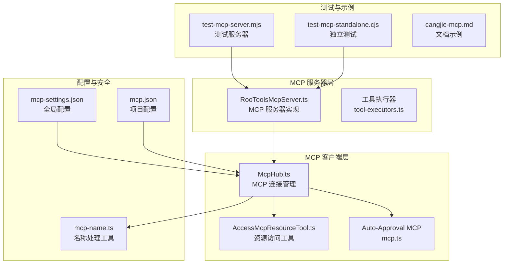
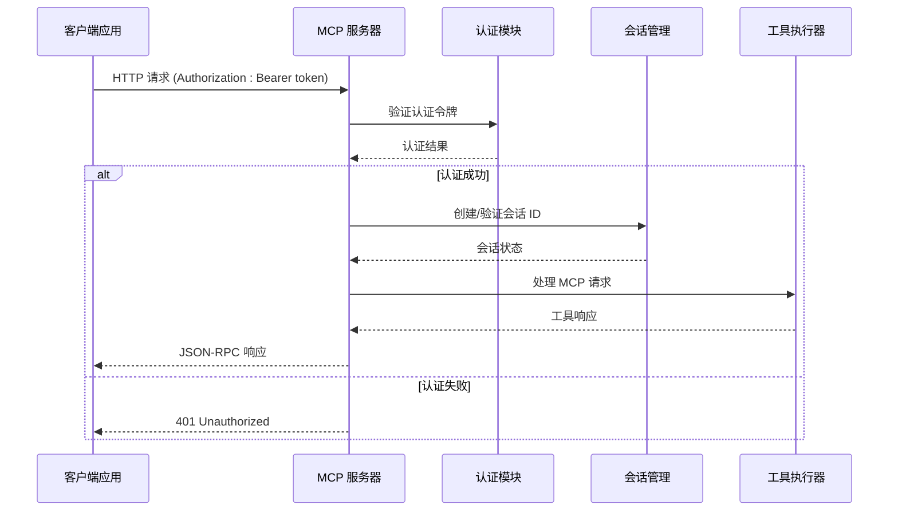
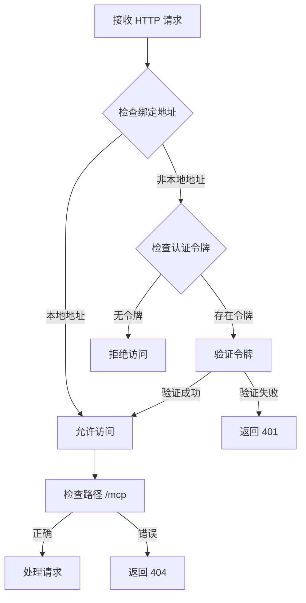
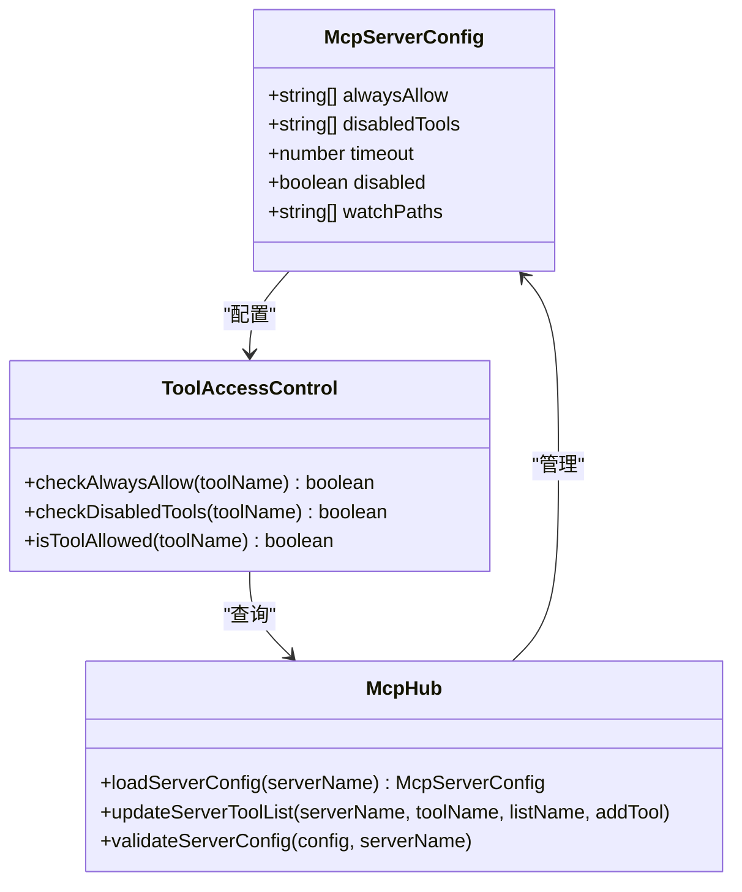
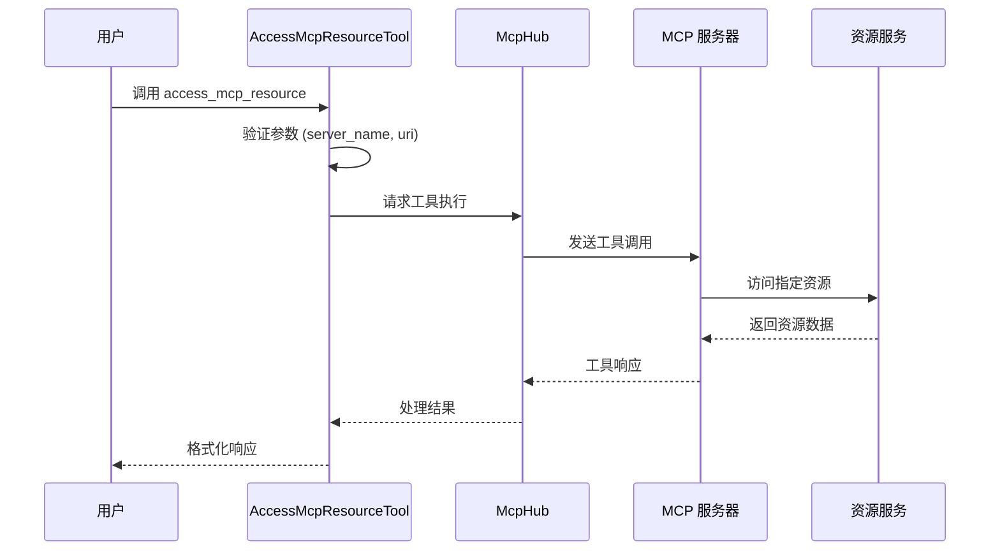

# MCP 安全与认证

<cite>
**本文档引用的文件**
- [RooToolsMcpServer.ts](file://src/services/mcp-server/RooToolsMcpServer.ts)
- [McpHub.ts](file://src/services/mcp/McpHub.ts)
- [accessMcpResourceTool.ts](file://src/core/tools/accessMcpResourceTool.ts)
- [access_mcp_resource.ts](file://src/core/prompts/tools/native-tools/access_mcp_resource.ts)
- [mcp.ts](file://src/core/auto-approval/mcp.ts)
- [mcp-name.ts](file://src/utils/mcp-name.ts)
- [cangjie-mcp.md](file://docs/cangjie-mcp.md)
- [SECURITY.md](file://SECURITY.md)
- [test-mcp-server.mjs](file://test-mcp-server.mjs)
- [test-mcp-standalone.cjs](file://test-mcp-standalone.cjs)
</cite>

## 目录
1. [简介](#简介)
2. [项目结构](#项目结构)
3. [核心组件](#核心组件)
4. [架构概览](#架构概览)
5. [详细组件分析](#详细组件分析)
6. [依赖关系分析](#依赖关系分析)
7. [性能考虑](#性能考虑)
8. [故障排除指南](#故障排除指南)
9. [结论](#结论)

## 简介

本文档为 MCP（Model Context Protocol）安全与认证提供全面的安全指南。MCP 是一个用于连接 AI 模型与外部工具和服务的协议，本项目实现了完整的 MCP 客户端和服务器功能，包括身份验证、授权控制和访问管理。

系统支持三种 MCP 服务器类型：本地进程（stdio）、服务器发送事件（SSE）和可流式 HTTP 传输。每个连接都通过会话 ID 进行管理，并支持基于配置的工具访问控制。

## 项目结构



**图表来源**
- [RooToolsMcpServer.ts:168-235](file://src/services/mcp-server/RooToolsMcpServer.ts#L168-L235)
- [McpHub.ts:151-176](file://src/services/mcp/McpHub.ts#L151-L176)
- [accessMcpResourceTool.ts:1-101](file://src/core/tools/accessMcpResourceTool.ts#L1-L101)

**章节来源**
- [RooToolsMcpServer.ts:163-202](file://src/services/mcp-server/RooToolsMcpServer.ts#L163-L202)
- [McpHub.ts:1-200](file://src/services/mcp/McpHub.ts#L1-L200)

## 核心组件

### MCP 服务器实现

系统的核心服务器实现位于 `RooToolsMcpServer.ts`，提供了完整的 MCP 协议支持：

- **身份验证机制**：支持 Bearer Token 认证
- **会话管理**：基于 UUID 的会话 ID 管理
- **传输协议**：支持 HTTP 和 SSE 传输
- **安全检查**：仅允许本地绑定或需要认证令牌

### MCP 连接管理

`McpHub.ts` 提供了高级别的 MCP 连接管理功能：

- **配置验证**：Zod 模式验证确保配置结构正确
- **工具访问控制**：支持 `alwaysAllow` 和 `disabledTools` 列表
- **多源配置**：支持全局和项目级配置
- **动态重连**：自动监控配置文件变化

### 安全工具

系统提供了多种安全相关的工具和实用程序：

- **名称规范化**：防止注入攻击和命名冲突
- **资源访问控制**：受控的 MCP 资源访问
- **自动批准机制**：基于配置的工具自动授权

**章节来源**
- [RooToolsMcpServer.ts:254-257](file://src/services/mcp-server/RooToolsMcpServer.ts#L254-L257)
- [McpHub.ts:68-74](file://src/services/mcp/McpHub.ts#L68-L74)
- [mcp-name.ts:90-115](file://src/utils/mcp-name.ts#L90-L115)

## 架构概览



**图表来源**
- [RooToolsMcpServer.ts:171-195](file://src/services/mcp-server/RooToolsMcpServer.ts#L171-L195)
- [RooToolsMcpServer.ts:254-257](file://src/services/mcp-server/RooToolsMcpServer.ts#L254-L257)

## 详细组件分析

### 服务器安全机制

#### 身份验证流程



**图表来源**
- [RooToolsMcpServer.ts:168-202](file://src/services/mcp-server/RooToolsMcpServer.ts#L168-L202)
- [RooToolsMcpServer.ts:197-202](file://src/services/mcp-server/RooToolsMcpServer.ts#L197-L202)

#### 会话管理

服务器使用 UUID 生成器创建会话 ID，并通过 `mcp-session-id` 头部进行传递：

- **会话生命周期**：从初始化到关闭的完整生命周期管理
- **传输层抽象**：支持多种传输协议（HTTP、SSE、STDIO）
- **错误处理**：完善的异常捕获和错误响应机制

**章节来源**
- [RooToolsMcpServer.ts:284-303](file://src/services/mcp-server/RooToolsMcpServer.ts#L284-L303)
- [RooToolsMcpServer.ts:315-337](file://src/services/mcp-server/RooToolsMcpServer.ts#L315-L337)

### 客户端认证流程

#### 配置驱动的访问控制



**图表来源**
- [McpHub.ts:68-74](file://src/services/mcp/McpHub.ts#L68-L74)
- [McpHub.ts:1781-1807](file://src/services/mcp/McpHub.ts#L1781-L1807)

#### 工具访问控制机制

系统实现了多层次的工具访问控制：

1. **全局配置**：通过 `mcp_settings.json` 设置
2. **项目配置**：通过 `.njust_ai/mcp.json` 设置
3. **动态控制**：运行时的工具启用/禁用操作

**章节来源**
- [McpHub.ts:998-1018](file://src/services/mcp/McpHub.ts#L998-L1018)
- [mcp.ts:3-11](file://src/core/auto-approval/mcp.ts#L3-L11)

### 资源访问安全

#### MCP 资源访问工具



**图表来源**
- [accessMcpResourceTool.ts:18-85](file://src/core/tools/accessMcpResourceTool.ts#L18-L85)
- [access_mcp_resource.ts:19-41](file://src/core/prompts/tools/native-tools/access_mcp_resource.ts#L19-L41)

**章节来源**
- [accessMcpResourceTool.ts:10-35](file://src/core/tools/accessMcpResourceTool.ts#L10-L35)
- [access_mcp_resource.ts:1-41](file://src/core/prompts/tools/native-tools/access_mcp_resource.ts#L1-L41)

## 依赖关系分析

```mermaid
graph LR
subgraph "核心依赖"
A[@modelcontextprotocol/sdk]
B[zod]
C[chokidar]
D[reconnecting-eventsource]
end
subgraph "内部模块"
E[McpHub]
F[RooToolsMcpServer]
G[工具执行器]
H[配置管理]
end
subgraph "安全组件"
I[认证验证]
J[会话管理]
K[访问控制]
L[名称规范化]
end
A --> E
B --> E
C --> E
D --> E
E --> F
E --> G
E --> H
F --> I
F --> J
E --> K
E --> L
```

**图表来源**
- [McpHub.ts:1-42](file://src/services/mcp/McpHub.ts#L1-L42)
- [RooToolsMcpServer.ts:1-10](file://src/services/mcp-server/RooToolsMcpServer.ts#L1-L10)

**章节来源**
- [McpHub.ts:1-42](file://src/services/mcp/McpHub.ts#L1-L42)
- [RooToolsMcpServer.ts:1-10](file://src/services/mcp-server/RooToolsMcpServer.ts#L1-L10)

## 性能考虑

### 服务器性能优化

1. **连接池管理**：复用 HTTP 连接减少延迟
2. **会话缓存**：缓存活跃会话提高响应速度
3. **异步处理**：非阻塞的请求处理机制
4. **资源监控**：实时监控服务器负载和性能指标

### 客户端性能优化

1. **配置缓存**：缓存 MCP 服务器配置减少 I/O 操作
2. **批量处理**：支持批量工具调用提高效率
3. **错误重试**：智能的错误重试机制
4. **超时管理**：合理的超时设置避免资源泄露

## 故障排除指南

### 常见安全问题

#### 认证失败排查

1. **检查认证令牌配置**
   - 确认 `njust-ai.mcpServer.authToken` 设置正确
   - 验证令牌格式为 Bearer Token
   - 检查令牌有效期和权限范围

2. **网络绑定问题**
   - 本地开发环境可以使用 localhost 绑定
   - 生产环境必须配置认证令牌
   - 检查防火墙和网络访问权限

#### 工具访问被拒绝

1. **检查工具配置**
   ```json
   {
     "mcpServers": {
       "server-name": {
         "alwaysAllow": ["tool1", "tool2"],
         "disabledTools": ["tool3"]
       }
     }
   }
   ```

2. **验证工具名称**
   - 使用 `sanitizeMcpName` 函数处理特殊字符
   - 确保工具名称符合 API 函数命名规范
   - 检查大小写敏感性问题

**章节来源**
- [RooToolsMcpServer.ts:171-176](file://src/services/mcp-server/RooToolsMcpServer.ts#L171-L176)
- [McpHub.ts:1015-1018](file://src/services/mcp/McpHub.ts#L1015-L1018)

### 监控和日志

#### 安全审计日志

系统提供了完整的安全审计功能：

1. **访问日志**：记录所有 MCP 请求和响应
2. **认证日志**：跟踪认证尝试和结果
3. **工具使用日志**：监控工具调用频率和成功率
4. **错误日志**：记录安全相关的错误和异常

#### 性能监控

1. **响应时间监控**：跟踪 MCP 请求的处理时间
2. **连接数监控**：监控活跃连接数量
3. **内存使用监控**：跟踪服务器内存使用情况
4. **错误率监控**：统计安全相关错误的发生频率

**章节来源**
- [SECURITY.md:1-18](file://SECURITY.md#L1-L18)

## 结论

本系统的 MCP 安全架构提供了全面的身份验证、授权控制和访问管理功能。通过多层次的安全机制，包括认证令牌、会话管理和工具访问控制，确保了 MCP 通信的安全性和可靠性。

关键安全特性包括：
- 强制的认证要求（非本地绑定场景）
- 基于配置的工具访问控制
- 完整的会话生命周期管理
- 实时的监控和审计功能
- 灵活的配置管理机制

建议的安全最佳实践：
1. 始终在生产环境中启用认证令牌
2. 定期审查和更新工具访问控制列表
3. 监控安全日志和异常活动
4. 及时应用安全更新和补丁
5. 实施最小权限原则配置工具访问

通过遵循这些指导原则，可以确保 MCP 系统在各种部署环境中的安全性、可靠性和合规性。