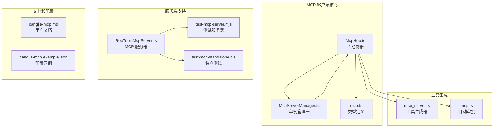
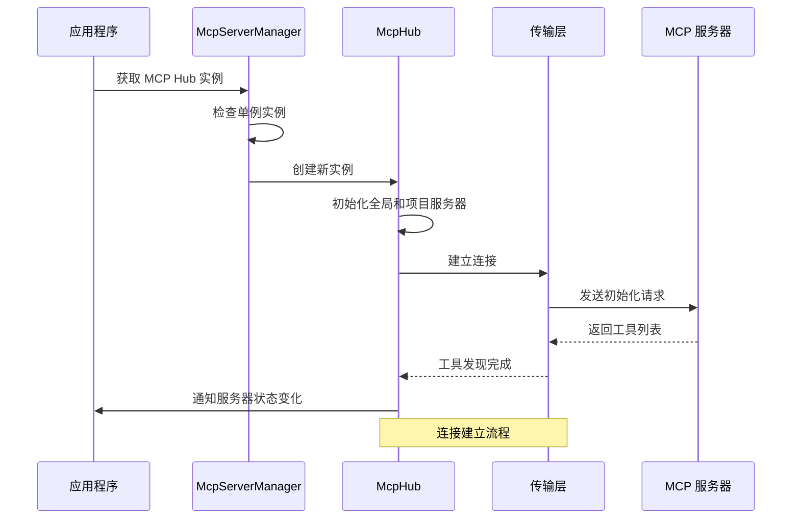
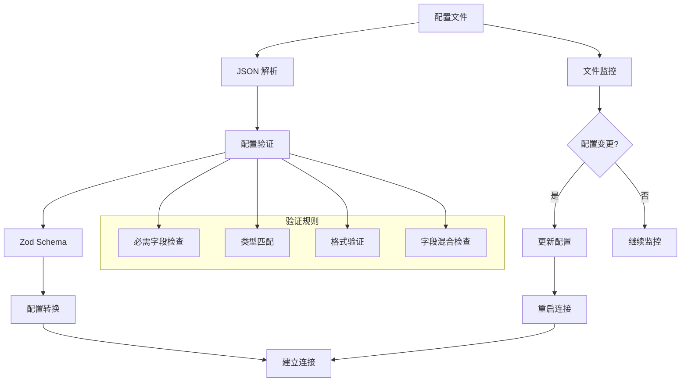
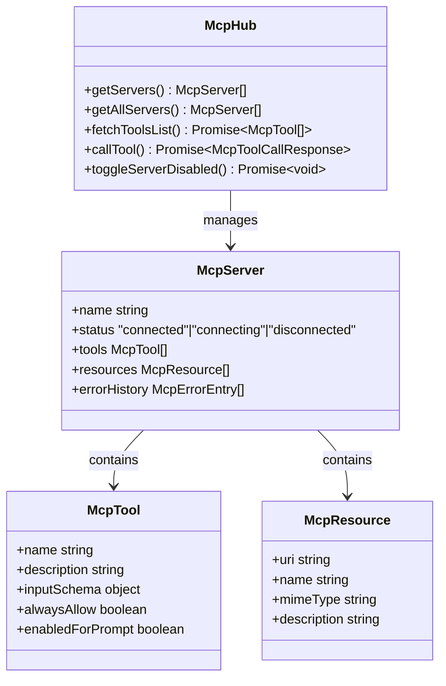
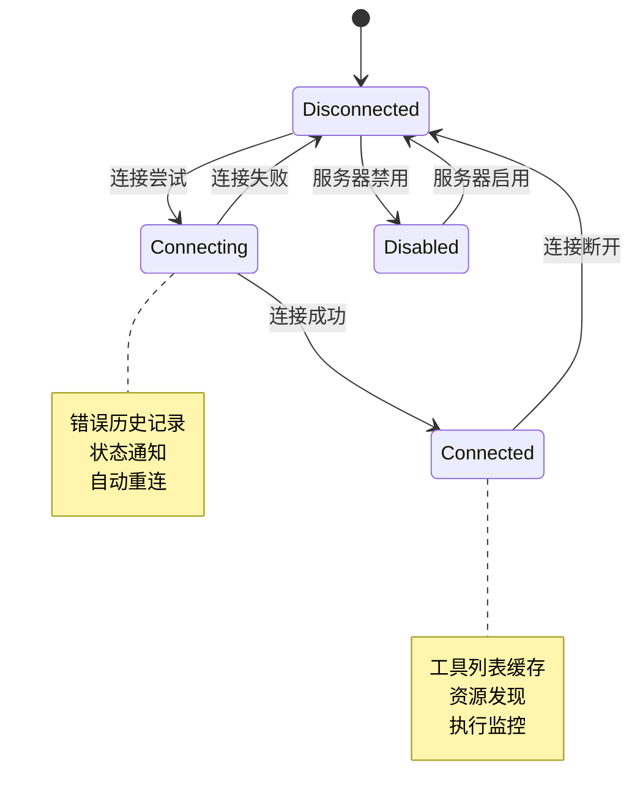

# MCP 客户端集成

<cite>
**本文档引用的文件**
- [McpHub.ts](file://src/services/mcp/McpHub.ts)
- [McpServerManager.ts](file://src/services/mcp/McpServerManager.ts)
- [mcp.ts](file://packages/types/src/mcp.ts)
- [cangjie-mcp.md](file://docs/cangjie-mcp.md)
- [cangjie-mcp.example.json](file://docs/examples/cangjie-mcp.example.json)
- [mcp_server.ts](file://src/core/prompts/tools/native-tools/mcp_server.ts)
- [mcp.ts](file://src/core/auto-approval/mcp.ts)
- [RooToolsMcpServer.ts](file://src/services/mcp-server/RooToolsMcpServer.ts)
- [test-mcp-server.mjs](file://test-mcp-server.mjs)
- [test-mcp-standalone.cjs](file://test-mcp-standalone.cjs)
</cite>

## 目录
1. [简介](#简介)
2. [项目结构](#项目结构)
3. [核心组件](#核心组件)
4. [架构概览](#架构概览)
5. [详细组件分析](#详细组件分析)
6. [依赖关系分析](#依赖关系分析)
7. [性能考虑](#性能考虑)
8. [故障排除指南](#故障排除指南)
9. [结论](#结论)
10. [附录](#附录)

## 简介

本文档提供了 NJUST_AI 扩展中 MCP（Model Context Protocol）客户端的全面集成指南。MCP 是一个开放协议，允许 AI 模型与外部工具和服务进行交互。该客户端实现了对 MCP 协议的支持，使扩展能够连接到各种 MCP 服务器（本地进程、SSE 流或 HTTP 流），并动态发现和调用可用工具。

该集成支持多种传输协议，包括标准输入输出（stdio）、服务器发送事件（SSE）和可流式 HTTP 传输，并提供了完整的配置管理、状态监控和错误处理机制。

## 项目结构

基于代码库分析，MCP 客户端相关的核心文件分布如下：



**图表来源**
- [McpHub.ts:151-176](file://src/services/mcp/McpHub.ts#L151-L176)
- [McpServerManager.ts:9-54](file://src/services/mcp/McpServerManager.ts#L9-L54)
- [mcp.ts:54-68](file://packages/types/src/mcp.ts#L54-L68)

**章节来源**
- [McpHub.ts:1-80](file://src/services/mcp/McpHub.ts#L1-L80)
- [McpServerManager.ts:1-87](file://src/services/mcp/McpServerManager.ts#L1-L87)
- [mcp.ts:1-187](file://packages/types/src/mcp.ts#L1-L187)

## 核心组件

### McpHub - 主控制器

McpHub 是 MCP 客户端的核心控制器，负责管理所有 MCP 服务器连接、配置更新和状态监控。

**主要功能：**
- 服务器连接管理（连接、断开、重启）
- 配置文件监控和自动更新
- 工具和服务发现
- 错误处理和状态跟踪
- 文件变更监听和自动重启

**关键特性：**
- 支持三种传输协议：stdio、SSE、streamable-http
- 自动配置验证和错误报告
- 项目级和全局级配置优先级管理
- 实时状态通知和 Webview 同步

**章节来源**
- [McpHub.ts:151-1997](file://src/services/mcp/McpHub.ts#L151-L1997)

### McpServerManager - 单例管理器

提供 MCP 服务器实例的单例管理模式，确保在整个扩展中只运行一组 MCP 服务器实例。

**主要功能：**
- 线程安全的单例实例管理
- 提供者注册和通知机制
- 资源清理和生命周期管理

**章节来源**
- [McpServerManager.ts:9-87](file://src/services/mcp/McpServerManager.ts#L9-L87)

### 类型定义系统

提供了完整的 TypeScript 类型定义，确保类型安全和开发体验。

**核心类型：**
- `McpServer`: 服务器配置和状态
- `McpTool`: 工具定义和权限
- `McpResource`: 资源和模板
- `McpExecutionStatus`: 执行状态

**章节来源**
- [mcp.ts:54-187](file://packages/types/src/mcp.ts#L54-L187)

## 架构概览



**图表来源**
- [McpServerManager.ts:20-54](file://src/services/mcp/McpServerManager.ts#L20-L54)
- [McpHub.ts:656-897](file://src/services/mcp/McpHub.ts#L656-L897)

## 详细组件分析

### 传输协议支持

MCP 客户端支持三种不同的传输协议：

#### 1. 标准输入输出 (stdio) 传输

用于本地进程通信，支持命令行参数和环境变量注入。

**配置选项：**
- `type`: "stdio"（必需）
- `command`: 可执行文件路径（必需）
- `args`: 命令行参数数组
- `env`: 环境变量映射
- `cwd`: 工作目录
- `watchPaths`: 监听的文件路径数组

**错误处理：**
- 标准错误流捕获和解析
- 进程启动失败检测
- 自动重启机制

#### 2. 服务器发送事件 (SSE) 传输

支持基于 HTTP 的事件流通信。

**配置选项：**
- `type`: "sse"（必需）
- `url`: 服务器 URL（必需）
- `headers`: HTTP 请求头
- `withCredentials`: 凭据支持

**重连机制：**
- 最大重连时间：5000ms
- 凭据自动处理
- 断线自动重连

#### 3. 可流式 HTTP 传输

支持标准 HTTP 请求/响应模式。

**配置选项：**
- `type`: "streamable-http"（必需）
- `url`: 服务器 URL（必需）
- `headers`: HTTP 请求头

**章节来源**
- [McpHub.ts:707-854](file://src/services/mcp/McpHub.ts#L707-L854)

### 配置管理系统



**图表来源**
- [McpHub.ts:216-274](file://src/services/mcp/McpHub.ts#L216-L274)
- [McpHub.ts:325-361](file://src/services/mcp/McpHub.ts#L325-L361)

**配置验证规则：**
- 必需字段完整性检查
- 类型与字段匹配验证
- 字段混合使用限制
- URL 格式和命令有效性

**章节来源**
- [McpHub.ts:68-149](file://src/services/mcp/McpHub.ts#L68-L149)

### 工具发现和管理



**图表来源**
- [McpHub.ts:454-477](file://src/services/mcp/McpHub.ts#L454-L477)
- [mcp.ts:54-90](file://packages/types/src/mcp.ts#L54-L90)

**工具管理功能：**
- 动态工具发现和缓存
- 工具权限控制（alwaysAllow）
- 工具启用状态管理
- 资源和模板管理

**章节来源**
- [mcp_server.ts:14-69](file://src/core/prompts/tools/native-tools/mcp_server.ts#L14-L69)
- [mcp.ts:3-11](file://src/core/auto-approval/mcp.ts#L3-L11)

### 错误处理和状态监控



**图表来源**
- [McpHub.ts:899-924](file://src/services/mcp/McpHub.ts#L899-L924)
- [McpHub.ts:1255-1295](file://src/services/mcp/McpHub.ts#L1255-L1295)

**错误处理机制：**
- 错误历史记录（最多100条）
- 截断错误消息（最大1000字符）
- 级别分类（error、warn、info）
- 实时状态更新

**章节来源**
- [McpHub.ts:899-924](file://src/services/mcp/McpHub.ts#L899-L924)

## 依赖关系分析

```mermaid
graph TB
subgraph "外部依赖"
A[@modelcontextprotocol/sdk<br/>MCP SDK]
B[chokidar<br/>文件监控]
C[zod<br/>配置验证]
D[reconnecting-eventsource<br/>SSE 重连]
end
subgraph "内部模块"
E[McpHub]
F[McpServerManager]
G[ClineProvider]
H[工具生成器]
end
A --> E
B --> E
C --> E
D --> E
E --> F
E --> G
E --> H
subgraph "配置文件"
I[mcp_settings.json<br/>全局配置]
J[mcp.json<br/>项目配置]
end
E --> I
E --> J
```

**图表来源**
- [McpHub.ts:1-42](file://src/services/mcp/McpHub.ts#L1-L42)
- [McpServerManager.ts:1-3](file://src/services/mcp/McpServerManager.ts#L1-L3)

**依赖特点：**
- 松耦合设计，便于测试和维护
- 强类型约束，减少运行时错误
- 模块化架构，支持功能扩展

**章节来源**
- [McpHub.ts:1-42](file://src/services/mcp/McpHub.ts#L1-L42)

## 性能考虑

### 连接管理优化

1. **连接池管理**：通过单例模式避免重复连接
2. **延迟加载**：仅在需要时建立连接
3. **资源清理**：及时释放不再使用的连接

### 内存管理

1. **错误历史限制**：最多保留100条错误记录
2. **配置缓存**：避免重复解析配置文件
3. **文件监听器管理**：及时关闭不再需要的监听器

### 网络优化

1. **SSE 自动重连**：智能重连策略减少连接中断
2. **超时控制**：可配置的请求超时机制
3. **并发控制**：避免过多并发连接

## 故障排除指南

### 常见连接问题

**问题：服务器无法连接**
- 检查配置文件格式（JSON 语法）
- 验证命令路径和参数
- 确认网络连接和防火墙设置

**问题：SSE 连接失败**
- 检查 URL 格式和可达性
- 验证认证头设置
- 查看浏览器开发者工具网络面板

**问题：工具列表为空**
- 确认服务器正确实现 MCP 协议
- 检查服务器日志输出
- 验证工具声明格式

### 配置验证错误

**错误：配置格式无效**
- 使用提供的示例配置作为参考
- 检查必需字段是否完整
- 验证数据类型匹配

**错误：字段混合使用**
- stdio 配置不能包含 SSE 字段
- SSE 配置必须明确指定类型
- 避免在同一配置中混用不同类型的字段

### 性能问题诊断

**问题：连接缓慢**
- 检查服务器响应时间
- 分析网络延迟
- 优化工具发现过程

**问题：内存使用过高**
- 检查错误历史记录增长
- 关闭不必要的文件监听器
- 清理废弃的连接

**章节来源**
- [cangjie-mcp.md:98-119](file://docs/cangjie-mcp.md#L98-L119)
- [McpHub.ts:325-361](file://src/services/mcp/McpHub.ts#L325-L361)

## 结论

NJUST_AI 的 MCP 客户端集成了完整的 Model Context Protocol 支持，提供了：

1. **多协议支持**：同时支持 stdio、SSE 和 HTTP 传输
2. **智能配置管理**：自动验证、热重载和优先级管理
3. **完善的错误处理**：详细的错误记录和恢复机制
4. **实时状态监控**：连接状态、工具发现和资源管理
5. **扩展性设计**：模块化架构支持功能扩展

该集成使得开发者能够轻松地将外部 MCP 服务器集成到应用程序中，为 AI 模型提供丰富的工具调用能力。

## 附录

### 配置示例

完整的 MCP 配置示例可以在以下位置找到：
- [cangjie-mcp.example.json:1-20](file://docs/examples/cangjie-mcp.example.json#L1-L20)

### 开发测试

提供了多种测试工具用于开发和调试：
- [test-mcp-server.mjs:85-98](file://test-mcp-server.mjs#L85-L98)
- [test-mcp-standalone.cjs:234-248](file://test-mcp-standalone.cjs#L234-L248)

### API 参考

核心 API 方法包括：
- `getServers()`: 获取可用的 MCP 服务器列表
- `callTool()`: 调用 MCP 工具
- `readResource()`: 读取 MCP 资源
- `toggleServerDisabled()`: 切换服务器启用状态

**章节来源**
- [mcp_server.ts:14-69](file://src/core/prompts/tools/native-tools/mcp_server.ts#L14-L69)
- [McpHub.ts:1712-1770](file://src/services/mcp/McpHub.ts#L1712-L1770)