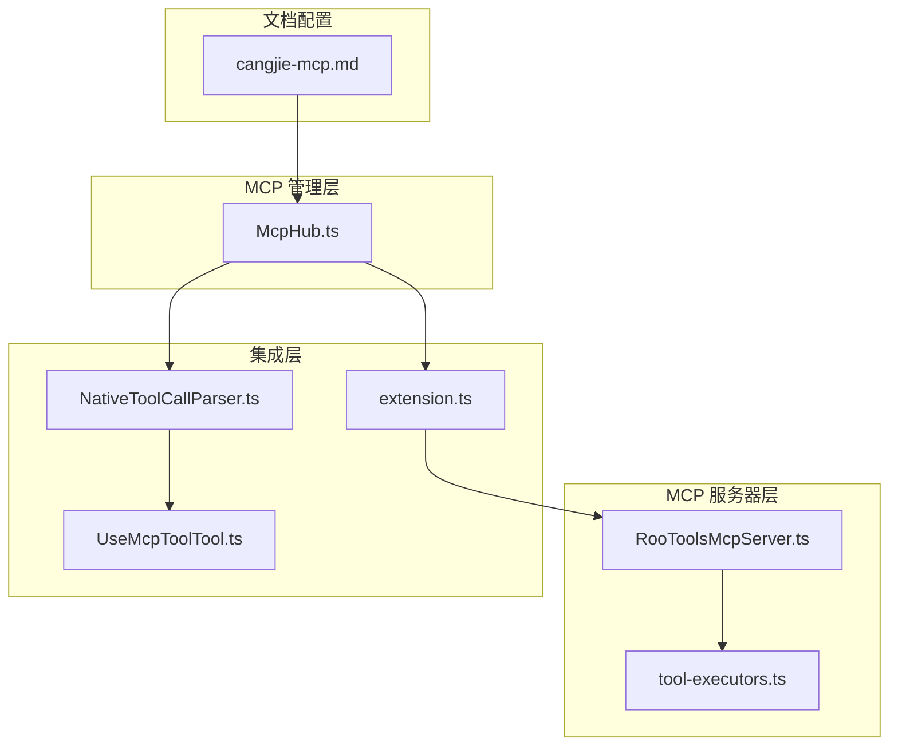
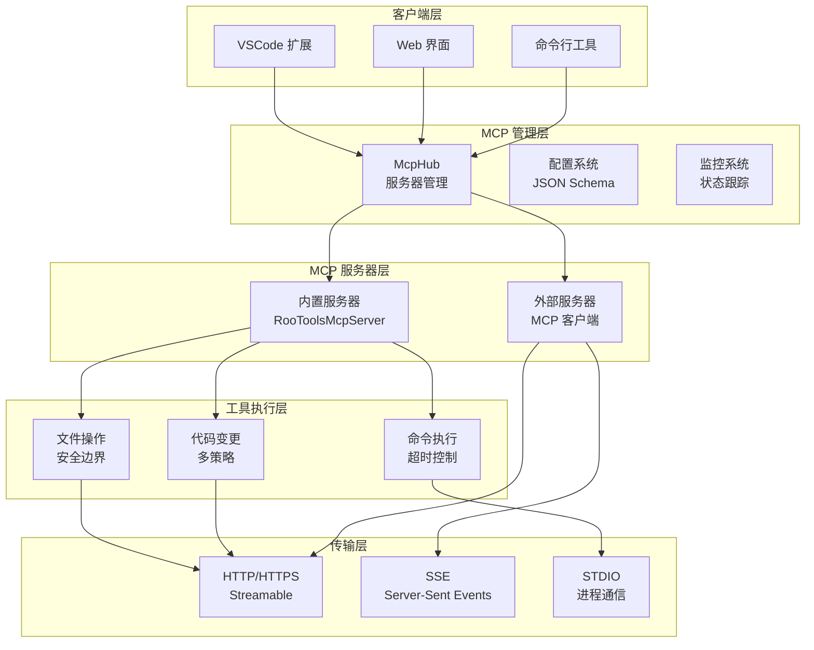
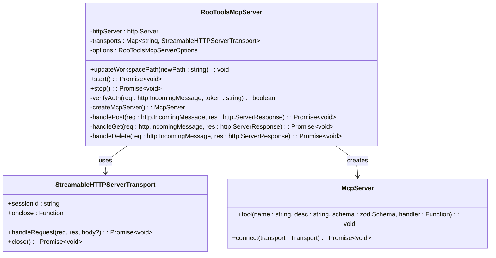
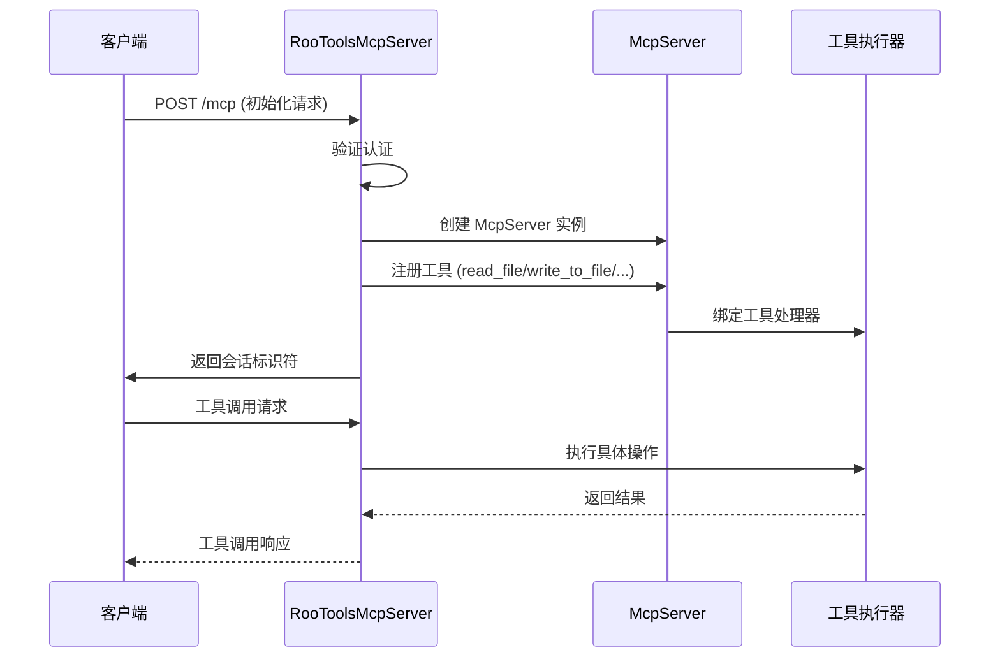
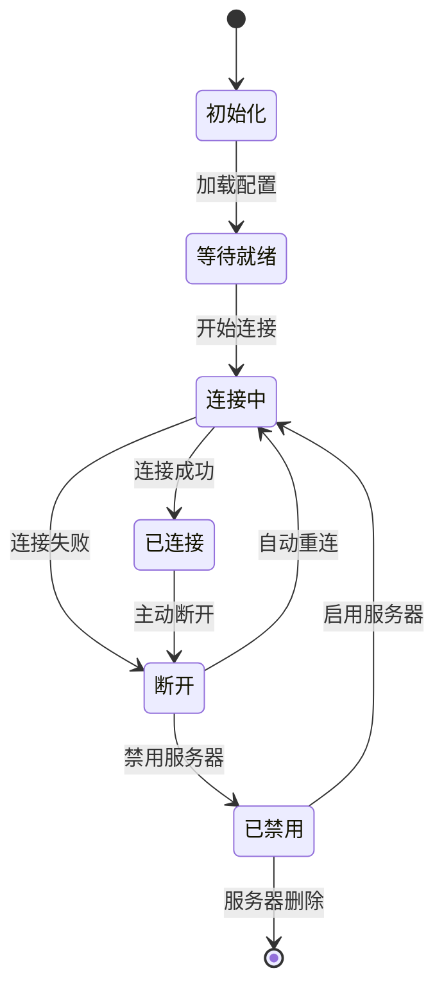
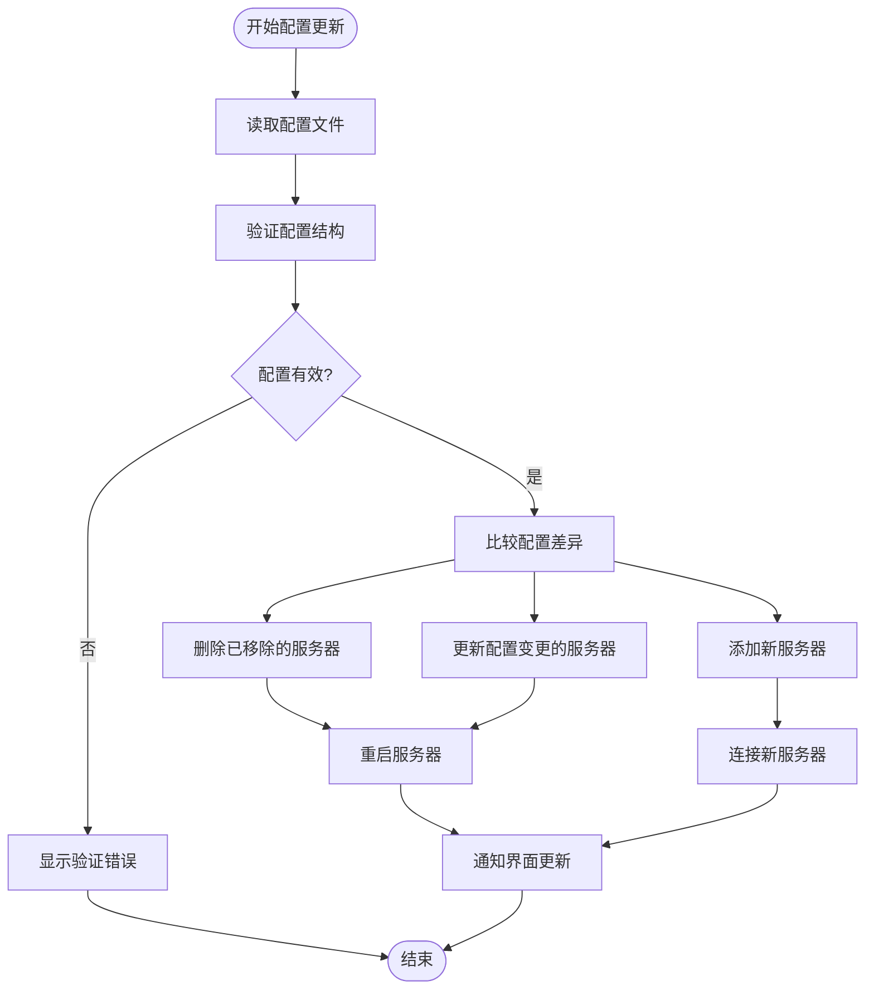
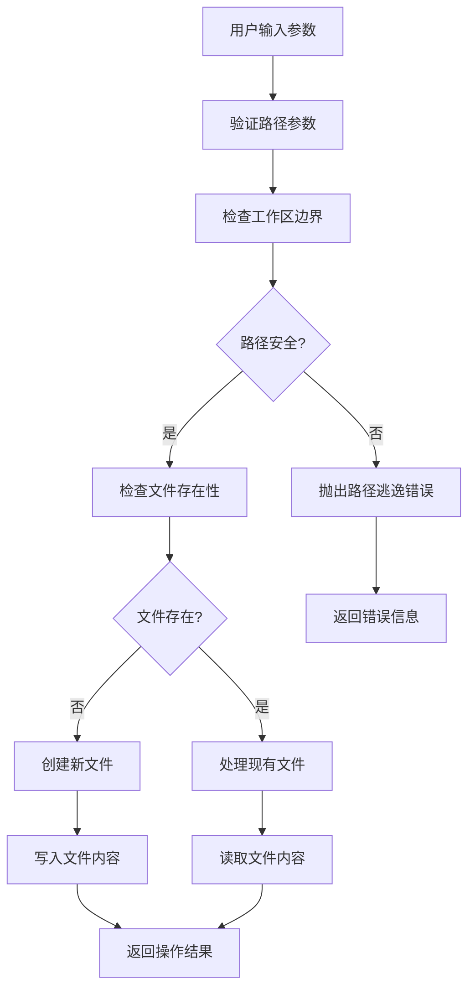

# MCP 服务器架构

<cite>
**本文档引用的文件**
- [RooToolsMcpServer.ts](file://src/services/mcp-server/RooToolsMcpServer.ts)
- [tool-executors.ts](file://src/services/mcp-server/tool-executors.ts)
- [McpHub.ts](file://src/services/mcp/McpHub.ts)
- [extension.ts](file://src/extension.ts)
- [NativeToolCallParser.ts](file://src/core/assistant-message/NativeToolCallParser.ts)
- [UseMcpToolTool.ts](file://src/core/tools/UseMcpToolTool.ts)
- [cangjie-mcp.md](file://docs/cangjie-mcp.md)
</cite>

## 目录
1. [简介](#简介)
2. [项目结构](#项目结构)
3. [核心组件](#核心组件)
4. [架构概览](#架构概览)
5. [详细组件分析](#详细组件分析)
6. [依赖关系分析](#依赖关系分析)
7. [性能考虑](#性能考虑)
8. [故障排除指南](#故障排除指南)
9. [结论](#结论)
10. [附录](#附录)

## 简介

本文档深入解析 Njust-AI 项目中的 MCP（Model Context Protocol）服务器架构，重点涵盖三个核心组件：

- **RooToolsMcpServer**：内置的 MCP 服务器实现，提供文件操作、命令执行、代码搜索等工具
- **McpHub**：MCP 服务器管理器，负责配置加载、连接状态监控和故障恢复
- **工具执行器**：具体的工具实现模块，提供安全的文件系统访问和命令执行能力

该架构支持多种传输协议（stdio、SSE、streamable-http），具备完善的错误处理、安全控制和性能优化机制。

## 项目结构

基于代码库分析，MCP 相关的核心文件组织如下：



**图表来源**
- [RooToolsMcpServer.ts:1-339](file://src/services/mcp-server/RooToolsMcpServer.ts#L1-L339)
- [McpHub.ts:151-1997](file://src/services/mcp/McpHub.ts#L151-L1997)

**章节来源**
- [RooToolsMcpServer.ts:1-339](file://src/services/mcp-server/RooToolsMcpServer.ts#L1-L339)
- [McpHub.ts:151-1997](file://src/services/mcp/McpHub.ts#L151-L1997)

## 核心组件

### RooToolsMcpServer 架构设计

RooToolsMcpServer 是一个轻量级的 MCP 服务器实现，提供以下核心功能：

#### 服务器生命周期管理
- **启动流程**：验证绑定地址安全性，建立 HTTP 服务器，配置 CORS 头部
- **停止流程**：优雅关闭所有传输连接，清理会话管理器
- **认证机制**：支持 Bearer Token 认证，非本地绑定需要认证令牌

#### 工具注册与执行
- **文件操作工具**：read_file、write_to_file、list_files、search_files
- **命令执行工具**：execute_command（带安全策略）
- **代码变更工具**：apply_diff（多搜索替换策略）

#### 连接处理机制
- **会话管理**：基于 UUID 的会话标识符
- **传输协议**：Streamable HTTP 传输
- **错误处理**：完整的异常捕获和错误响应

**章节来源**
- [RooToolsMcpServer.ts:168-252](file://src/services/mcp-server/RooToolsMcpServer.ts#L168-L252)
- [RooToolsMcpServer.ts:44-161](file://src/services/mcp-server/RooToolsMcpServer.ts#L44-L161)

### McpHub 服务器管理功能

McpHub 提供了企业级的 MCP 服务器管理能力：

#### 配置加载与验证
- **双层配置**：支持全局和项目级配置文件
- **类型安全**：使用 Zod Schema 进行配置验证
- **动态更新**：实时监听配置文件变化

#### 连接状态监控
- **多协议支持**：stdio、SSE、streamable-http
- **自动重连**：断线自动重连机制
- **健康检查**：定期状态检查和错误记录

#### 故障恢复机制
- **渐进式恢复**：分阶段的连接恢复策略
- **错误隔离**：单个服务器故障不影响整体系统
- **资源清理**：完整的连接和文件句柄清理

**章节来源**
- [McpHub.ts:216-274](file://src/services/mcp/McpHub.ts#L216-L274)
- [McpHub.ts:656-897](file://src/services/mcp/McpHub.ts#L656-L897)

### 工具执行器架构设计

工具执行器模块提供了安全的底层操作能力：

#### 安全边界控制
- **工作区限制**：防止路径逃逸攻击
- **权限验证**：命令白名单和黑名单机制
- **资源保护**：文件系统访问限制

#### 执行策略
- **文件操作**：原子性文件读写，目录遍历限制
- **命令执行**：超时控制，输出截断，错误处理
- **代码变更**：多搜索替换策略，diff 应用

**章节来源**
- [tool-executors.ts:13-20](file://src/services/mcp-server/tool-executors.ts#L13-L20)
- [tool-executors.ts:116-180](file://src/services/mcp-server/tool-executors.ts#L116-L180)

## 架构概览



**图表来源**
- [McpHub.ts:151-1997](file://src/services/mcp/McpHub.ts#L151-L1997)
- [RooToolsMcpServer.ts:1-339](file://src/services/mcp-server/RooToolsMcpServer.ts#L1-L339)

## 详细组件分析

### RooToolsMcpServer 详细分析

#### 类架构设计



**图表来源**
- [RooToolsMcpServer.ts:27-339](file://src/services/mcp-server/RooToolsMcpServer.ts#L27-L339)

#### 工具注册流程



**图表来源**
- [RooToolsMcpServer.ts:284-303](file://src/services/mcp-server/RooToolsMcpServer.ts#L284-L303)
- [tool-executors.ts:28-207](file://src/services/mcp-server/tool-executors.ts#L28-L207)

**章节来源**
- [RooToolsMcpServer.ts:44-161](file://src/services/mcp-server/RooToolsMcpServer.ts#L44-L161)
- [tool-executors.ts:28-207](file://src/services/mcp-server/tool-executors.ts#L28-L207)

### McpHub 详细分析

#### 连接管理架构



**图表来源**
- [McpHub.ts:656-897](file://src/services/mcp/McpHub.ts#L656-L897)
- [McpHub.ts:1255-1295](file://src/services/mcp/McpHub.ts#L1255-L1295)

#### 配置管理流程



**图表来源**
- [McpHub.ts:1110-1177](file://src/services/mcp/McpHub.ts#L1110-L1177)
- [McpHub.ts:1546-1620](file://src/services/mcp/McpHub.ts#L1546-L1620)

**章节来源**
- [McpHub.ts:1110-1177](file://src/services/mcp/McpHub.ts#L1110-L1177)
- [McpHub.ts:1546-1620](file://src/services/mcp/McpHub.ts#L1546-L1620)

### 工具执行器详细分析

#### 安全边界控制



**图表来源**
- [tool-executors.ts:13-20](file://src/services/mcp-server/tool-executors.ts#L13-L20)
- [tool-executors.ts:28-50](file://src/services/mcp-server/tool-executors.ts#L28-L50)

**章节来源**
- [tool-executors.ts:13-20](file://src/services/mcp-server/tool-executors.ts#L13-L20)
- [tool-executors.ts:116-180](file://src/services/mcp-server/tool-executors.ts#L116-L180)

## 依赖关系分析

```mermaid
graph TB
subgraph "外部依赖"
SDK[@modelcontextprotocol/sdk]
Zod[zod]
Chokidar[chokidar]
Delay[delay]
FastDeepEqual[fast-deep-equal]
end
subgraph "内部模块"
Utils[utils/*]
Services[services/*]
Core[core/*]
end
subgraph "MCP 核心"
McpHub --> SDK
McpHub --> Zod
McpHub --> Chokidar
McpHub --> Delay
McpHub --> FastDeepEqual
RooTools --> SDK
RooTools --> Zod
ToolExec --> Utils
ToolExec --> Services
end
Utils --> Core
Services --> Core
```

**图表来源**
- [McpHub.ts:1-21](file://src/services/mcp/McpHub.ts#L1-L21)
- [RooToolsMcpServer.ts:1-8](file://src/services/mcp-server/RooToolsMcpServer.ts#L1-L8)

**章节来源**
- [McpHub.ts:1-21](file://src/services/mcp/McpHub.ts#L1-L21)
- [RooToolsMcpServer.ts:1-8](file://src/services/mcp-server/RooToolsMcpServer.ts#L1-L8)

## 性能考虑

### 内存管理
- **会话清理**：服务器停止时清理所有传输连接和会话映射
- **文件句柄管理**：使用 try-catch 确保文件句柄正确关闭
- **缓存策略**：工具列表和资源列表的内存缓存

### 并发控制
- **连接池**：每个服务器维护独立的传输连接
- **超时机制**：命令执行超时控制，防止阻塞
- **并发限制**：通过队列和状态标志控制并发操作

### 网络优化
- **CORS 配置**：灵活的跨域资源共享设置
- **传输协议选择**：根据场景选择最优传输协议
- **连接复用**：会话级别的连接复用

## 故障排除指南

### 常见问题诊断

#### 服务器启动失败
1. **检查绑定地址**：确保本地绑定或设置认证令牌
2. **验证端口可用性**：确认端口未被占用
3. **检查工作区路径**：验证工作区路径有效性

#### 工具执行错误
1. **路径验证**：检查文件路径是否在工作区内
2. **权限检查**：验证命令执行权限
3. **超时设置**：调整命令执行超时时间

#### 连接问题
1. **网络配置**：检查防火墙和代理设置
2. **认证配置**：验证 Bearer Token 设置
3. **服务器状态**：查看服务器连接状态

**章节来源**
- [RooToolsMcpServer.ts:171-176](file://src/services/mcp-server/RooToolsMcpServer.ts#L171-L176)
- [McpHub.ts:888-896](file://src/services/mcp/McpHub.ts#L888-L896)

## 结论

Njust-AI 的 MCP 服务器架构展现了现代 AI 辅助开发工具的设计理念：

### 架构优势
- **模块化设计**：清晰的职责分离和接口定义
- **安全性优先**：多层次的安全边界和权限控制
- **可扩展性**：支持多种传输协议和工具类型
- **可靠性**：完善的错误处理和故障恢复机制

### 技术创新
- **智能工具发现**：动态工具注册和管理
- **实时监控**：连接状态和性能指标监控
- **配置即代码**：声明式的服务器配置管理
- **安全沙箱**：受控的文件系统和命令执行环境

该架构为 AI 驱动的软件开发提供了坚实的基础，既满足了开发效率的需求，又确保了系统的安全性和稳定性。

## 附录

### 服务器配置选项

| 配置项 | 类型 | 默认值 | 描述 |
|--------|------|--------|------|
| `mcpServer.enabled` | boolean | false | 是否启用内置 MCP 服务器 |
| `mcpServer.port` | number | 3100 | 服务器监听端口 |
| `mcpServer.bindAddress` | string | "127.0.0.1" | 绑定地址 |
| `mcpServer.authToken` | string | "" | 认证令牌 |
| `deniedCommands` | string[] | [] | 禁止执行的命令列表 |

### 性能调优建议

1. **连接池优化**：合理设置服务器数量和连接超时
2. **缓存策略**：利用工具列表和资源的内存缓存
3. **监控指标**：设置关键性能指标的告警阈值
4. **资源限制**：为命令执行设置合理的资源配额

### 扩展开发指南

1. **工具开发**：参考现有工具的实现模式
2. **安全考虑**：严格遵守工作区边界和权限控制
3. **错误处理**：提供清晰的错误信息和回退策略
4. **测试验证**：编写完整的单元测试和集成测试

**章节来源**
- [extension.ts:422-483](file://src/extension.ts#L422-L483)
- [cangjie-mcp.md:35-119](file://docs/cangjie-mcp.md#L35-L119)