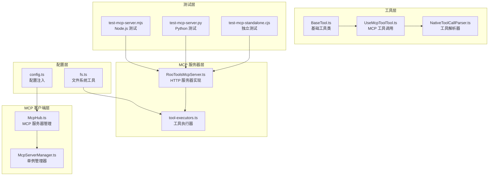
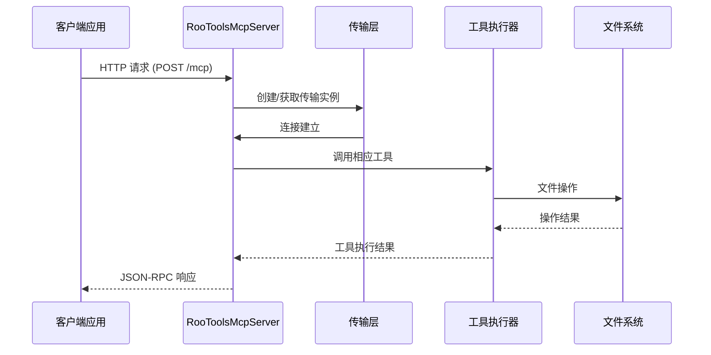
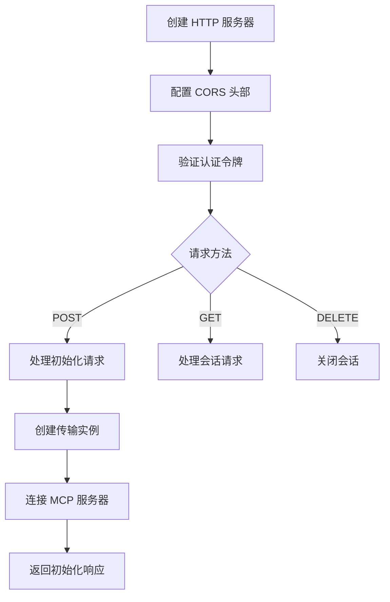
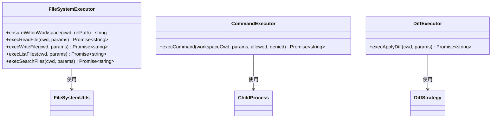
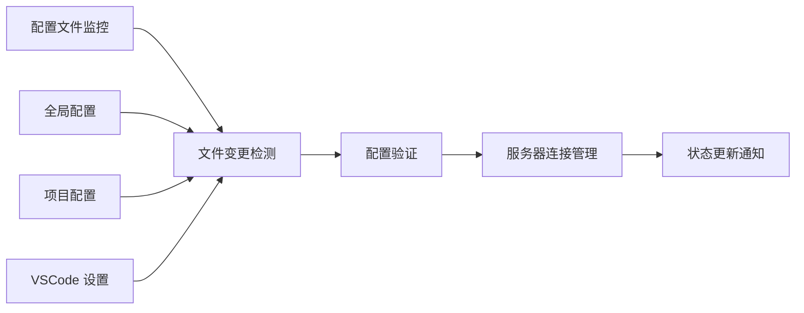
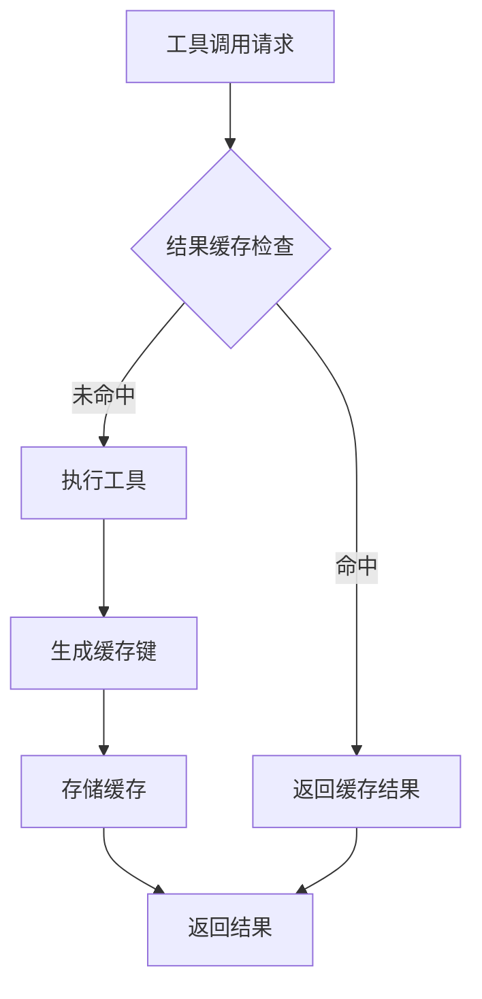

# 自定义 MCP 服务器开发

<cite>
**本文档引用的文件**
- [RooToolsMcpServer.ts](file://src/services/mcp-server/RooToolsMcpServer.ts)
- [tool-executors.ts](file://src/services/mcp-server/tool-executors.ts)
- [McpHub.ts](file://src/services/mcp/McpHub.ts)
- [McpServerManager.ts](file://src/services/mcp/McpServerManager.ts)
- [cangjie-mcp.md](file://docs/cangjie-mcp.md)
- [cangjie-mcp.example.json](file://docs/examples/cangjie-mcp.example.json)
- [config.ts](file://src/utils/config.ts)
- [fs.ts](file://src/utils/fs.ts)
- [BaseTool.ts](file://src/core/tools/BaseTool.ts)
- [UseMcpToolTool.ts](file://src/core/tools/UseMcpToolTool.ts)
- [NativeToolCallParser.ts](file://src/core/assistant-message/NativeToolCallParser.ts)
- [test-mcp-server.mjs](file://test-mcp-server.mjs)
- [test-mcp-server.py](file://test-mcp-server.py)
- [test-mcp-standalone.cjs](file://test-mcp-standalone.cjs)
</cite>

## 目录
1. [简介](#简介)
2. [项目结构](#项目结构)
3. [核心组件](#核心组件)
4. [架构概览](#架构概览)
5. [详细组件分析](#详细组件分析)
6. [依赖关系分析](#依赖关系分析)
7. [性能考虑](#性能考虑)
8. [故障排除指南](#故障排除指南)
9. [结论](#结论)
10. [附录](#附录)

## 简介

本指南面向需要开发自定义 MCP（Model Context Protocol）服务器的开发者，基于 Njust-AI 项目的现有实现，提供完整的开发框架和最佳实践。MCP 是一个开放协议，允许 AI 客户端与各种工具和服务进行交互。

本项目提供了两种 MCP 实现模式：
- **MCP 服务端**：向其他客户端暴露本地工具（如文件操作、命令执行等）
- **MCP 客户端**：连接外部 MCP 服务，使用第三方工具

## 项目结构

项目采用模块化架构，主要包含以下核心模块：



**图表来源**
- [RooToolsMcpServer.ts:1-339](file://src/services/mcp-server/RooToolsMcpServer.ts#L1-L339)
- [McpHub.ts:1-800](file://src/services/mcp/McpHub.ts#L1-L800)

**章节来源**
- [RooToolsMcpServer.ts:1-339](file://src/services/mcp-server/RooToolsMcpServer.ts#L1-L339)
- [McpHub.ts:1-800](file://src/services/mcp/McpHub.ts#L1-L800)

## 核心组件

### MCP 服务器实现

RooToolsMcpServer 提供了完整的 MCP 服务器实现，支持多种文件操作工具：

| 工具名称 | 功能描述 | 参数 |
|---------|----------|------|
| read_file | 读取文件内容并返回带行号的文本 | path, start_line, end_line |
| write_to_file | 写入文件内容，自动创建目录 | path, content |
| list_files | 列出目录内容 | path, recursive |
| search_files | 在目录中搜索正则表达式模式 | path, regex, file_pattern |
| execute_command | 执行 shell 命令 | command, cwd, timeout |
| apply_diff | 应用 SEARCH/REPLACE diff | path, diff |

### MCP 客户端管理

McpHub 提供了强大的 MCP 客户端管理功能，支持：
- 多种传输协议（stdio, SSE, streamable-http）
- 配置文件监控和热重载
- 服务器状态管理和错误处理
- 环境变量注入和路径监控

**章节来源**
- [RooToolsMcpServer.ts:44-161](file://src/services/mcp-server/RooToolsMcpServer.ts#L44-L161)
- [McpHub.ts:151-176](file://src/services/mcp/McpHub.ts#L151-L176)

## 架构概览



**图表来源**
- [RooToolsMcpServer.ts:168-235](file://src/services/mcp-server/RooToolsMcpServer.ts#L168-L235)
- [tool-executors.ts:28-50](file://src/services/mcp-server/tool-executors.ts#L28-L50)

## 详细组件分析

### RooToolsMcpServer 类分析

RooToolsMcpServer 是 MCP 服务器的核心实现，具有以下特点：

#### 服务器初始化流程



**图表来源**
- [RooToolsMcpServer.ts:178-227](file://src/services/mcp-server/RooToolsMcpServer.ts#L178-L227)

#### 工具注册机制

服务器通过 `server.tool()` 方法注册工具，每个工具包含：
- **名称**：工具的唯一标识符
- **描述**：工具功能的详细说明
- **参数验证**：使用 Zod schema 进行参数验证
- **执行函数**：异步工具执行逻辑

**章节来源**
- [RooToolsMcpServer.ts:44-161](file://src/services/mcp-server/RooToolsMcpServer.ts#L44-L161)

### 工具执行器设计

工具执行器采用职责分离的设计模式，每个工具都有独立的执行函数：

#### 文件操作工具



**图表来源**
- [tool-executors.ts:9-208](file://src/services/mcp-server/tool-executors.ts#L9-L208)

#### 安全边界检查

所有文件操作都经过严格的安全检查：
- 路径规范化和边界检查
- 文件存在性验证
- 目录权限验证
- 命令白名单/黑名单过滤

**章节来源**
- [tool-executors.ts:13-20](file://src/services/mcp-server/tool-executors.ts#L13-L20)
- [tool-executors.ts:116-180](file://src/services/mcp-server/tool-executors.ts#L116-L180)

### MCP Hub 管理系统

McpHub 提供了企业级的 MCP 服务器管理功能：

#### 配置文件监控



**图表来源**
- [McpHub.ts:325-361](file://src/services/mcp/McpHub.ts#L325-L361)

#### 传输协议支持

McpHub 支持三种传输协议：
- **stdio**：本地进程通信，适合 Node.js/Python 等脚本
- **SSE**：服务器推送事件，适合实时数据流
- **streamable-http**：HTTP 流式传输，适合 REST API

**章节来源**
- [McpHub.ts:689-800](file://src/services/mcp/McpHub.ts#L689-L800)

## 依赖关系分析

```mermaid
graph TB
subgraph "外部依赖"
A[@modelcontextprotocol/sdk]
B[zod]
C[chokidar]
D[reconnecting-eventsource]
end
subgraph "内部模块"
E[RooToolsMcpServer]
F[tool-executors]
G[McpHub]
H[McpServerManager]
I[BaseTool]
J[UseMcpToolTool]
end
subgraph "工具函数"
K[config.injectVariables]
L[fs.createDirectoriesForFile]
M[fileExistsAtPath]
end
A --> E
B --> E
C --> G
D --> G
E --> F
G --> K
F --> L
F --> M
I --> J
```

**图表来源**
- [RooToolsMcpServer.ts:4-7](file://src/services/mcp-server/RooToolsMcpServer.ts#L4-L7)
- [McpHub.ts:5-20](file://src/services/mcp/McpHub.ts#L5-L20)

**章节来源**
- [config.ts:35-66](file://src/utils/config.ts#L35-L66)
- [fs.ts:11-47](file://src/utils/fs.ts#L11-L47)

## 性能考虑

### 连接池管理

服务器实现了智能的连接池管理：
- **会话复用**：支持多客户端共享同一会话
- **内存优化**：及时清理断开的连接
- **并发控制**：限制同时活跃的工具调用数量

### 缓存策略



### 资源限制

- **超时控制**：默认 60 秒超时，可配置
- **内存使用**：大文件读取分块处理
- **并发限制**：避免资源耗尽

## 故障排除指南

### 常见问题诊断

#### 认证问题
- **症状**：401 未授权错误
- **原因**：缺少或错误的认证令牌
- **解决方案**：检查 `authToken` 配置和请求头

#### 路径安全问题
- **症状**：路径逃逸错误
- **原因**：尝试访问工作区外的文件
- **解决方案**：使用相对路径，避免 `../`

#### 命令执行问题
- **症状**：命令超时或权限错误
- **原因**：命令不在白名单或权限不足
- **解决方案**：检查 `allowedCommands` 和 `deniedCommands` 配置

### 调试技巧

#### 启用详细日志
```javascript
// 在 VS Code 设置中添加
{
  "mcp.debug": true,
  "mcp.logLevel": "debug"
}
```

#### 使用测试脚本
项目提供了多种测试脚本：
- `test-mcp-server.mjs`：Node.js 测试客户端
- `test-mcp-server.py`：Python 测试客户端  
- `test-mcp-standalone.cjs`：独立测试服务器

**章节来源**
- [test-mcp-server.mjs:85-191](file://test-mcp-server.mjs#L85-L191)
- [test-mcp-server.py:114-214](file://test-mcp-server.py#L114-L214)

## 结论

本指南展示了如何基于 Njust-AI 项目构建自定义 MCP 服务器。通过理解现有的实现模式，开发者可以快速创建符合 MCP 协议标准的服务器，支持文件操作、命令执行等多种工具。

关键要点：
- 使用职责分离的设计模式
- 实施严格的安全边界检查
- 提供灵活的配置选项
- 实现完善的错误处理机制
- 支持多种传输协议

## 附录

### 配置文件结构

#### 全局 MCP 配置
```json
{
  "mcpServers": {
    "server-name": {
      "type": "stdio",
      "command": "node",
      "args": ["path/to/server.js"],
      "env": {
        "ENV_VAR": "value"
      },
      "timeout": 60,
      "alwaysAllow": [],
      "disabledTools": []
    }
  }
}
```

#### 项目级 MCP 配置
```json
{
  "mcpServers": {
    "local-server": {
      "type": "streamable-http",
      "url": "http://localhost:3100/mcp",
      "headers": {
        "Authorization": "Bearer YOUR_TOKEN"
      }
    }
  }
}
```

### 最佳实践

1. **安全性优先**：始终验证用户输入，实施路径安全检查
2. **错误处理**：提供清晰的错误消息和回退策略
3. **性能优化**：合理使用缓存，限制资源使用
4. **监控告警**：实现全面的日志记录和健康检查
5. **文档完善**：为每个工具提供详细的使用说明

### 扩展开发建议

- **工具接口标准化**：定义统一的工具接口规范
- **参数验证增强**：使用更严格的参数验证规则
- **结果格式化**：提供一致的结果格式化策略
- **插件系统**：支持动态加载和卸载工具
- **版本兼容**：确保向后兼容性和版本迁移支持