# 自定义扩展开发

<cite>
**本文档引用的文件**
- [McpHub.ts](file://src/services/mcp/McpHub.ts)
- [McpServerManager.ts](file://src/services/mcp/McpServerManager.ts)
- [RooToolsMcpServer.ts](file://src/services/mcp-server/RooToolsMcpServer.ts)
- [tool-executors.ts](file://src/services/mcp-server/tool-executors.ts)
- [cangjie-mcp.md](file://docs/cangjie-mcp.md)
- [mcp.ts](file://src/core/auto-approval/mcp.ts)
- [UseMcpToolTool.ts](file://src/core/tools/UseMcpToolTool.ts)
- [mcp-name.ts](file://src/utils/mcp-name.ts)
- [cangjie-mcp.example.json](file://docs/examples/cangjie-mcp.example.json)
- [test-mcp-server.mjs](file://test-mcp-server.mjs)
- [tools.ts](file://src/shared/tools.ts)
- [access_mcp_resource.ts](file://src/core/prompts/tools/native-tools/access_mcp_resource.ts)
- [accessMcpResourceTool.ts](file://src/core/tools/accessMcpResourceTool.ts)
- [NativeToolCallParser.ts](file://src/core/assistant-message/NativeToolCallParser.ts)
- [mcp.ts](file://packages/types/src/mcp.ts)
</cite>

## 目录
1. [简介](#简介)
2. [项目结构](#项目结构)
3. [核心组件](#核心组件)
4. [架构概览](#架构概览)
5. [详细组件分析](#详细组件分析)
6. [依赖关系分析](#依赖关系分析)
7. [性能考虑](#性能考虑)
8. [故障排除指南](#故障排除指南)
9. [结论](#结论)
10. [附录](#附录)

## 简介

本指南面向需要开发自定义扩展的开发者，详细介绍Njust-AI项目中Model Context Protocol (MCP)协议的实现、MCP服务器架构和工具执行器的设计模式。文档涵盖了从基础概念到高级应用的完整开发流程，包括：

- MCP协议客户端和服务端的实现细节
- 自定义MCP服务器的开发方法
- 工具执行器的设计模式和安全机制
- 客户端集成和工具调用流程
- 协议规范说明和调试技巧
- 安全机制、权限控制和性能优化策略
- 扩展发布和分发的最佳实践

## 项目结构

基于代码库分析，MCP相关功能主要分布在以下模块中：

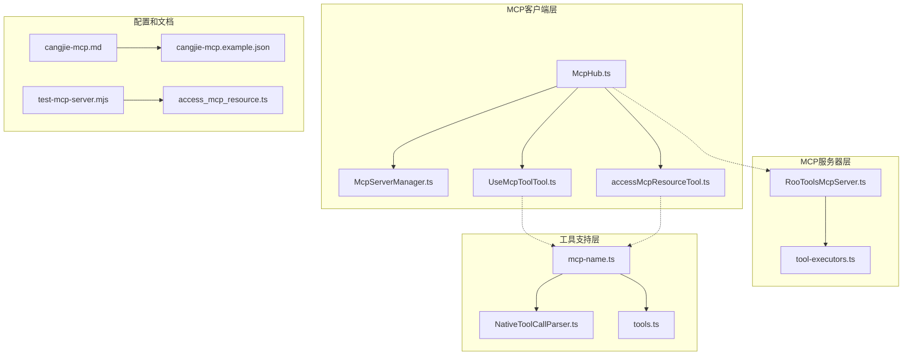

**图表来源**
- [McpHub.ts:151-176](file://src/services/mcp/McpHub.ts#L151-L176)
- [RooToolsMcpServer.ts:27-34](file://src/services/mcp-server/RooToolsMcpServer.ts#L27-L34)
- [UseMcpToolTool.ts:27-35](file://src/core/tools/UseMcpToolTool.ts#L27-L35)

**章节来源**
- [McpHub.ts:151-176](file://src/services/mcp/McpHub.ts#L151-L176)
- [McpServerManager.ts:9-54](file://src/services/mcp/McpServerManager.ts#L9-L54)

## 核心组件

### MCP Hub管理器

McpHub是MCP系统的核心协调器，负责管理所有MCP服务器连接、配置监控和状态同步。

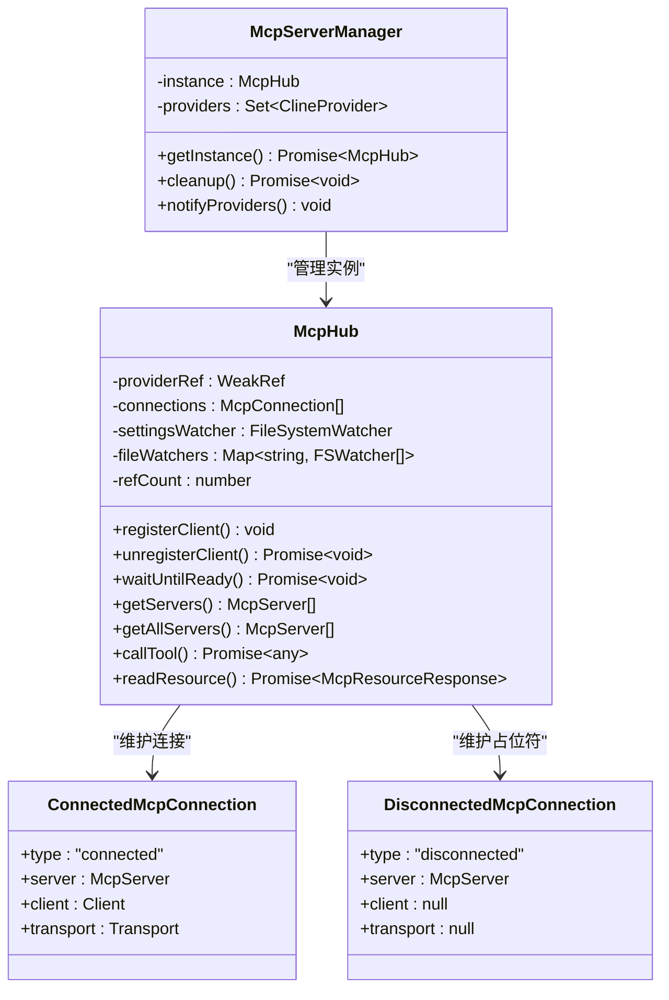

**图表来源**
- [McpHub.ts:44-65](file://src/services/mcp/McpHub.ts#L44-L65)
- [McpServerManager.ts:9-54](file://src/services/mcp/McpServerManager.ts#L9-L54)

### MCP服务器架构

RooToolsMcpServer提供了完整的MCP服务器实现，支持多种传输协议和安全机制。

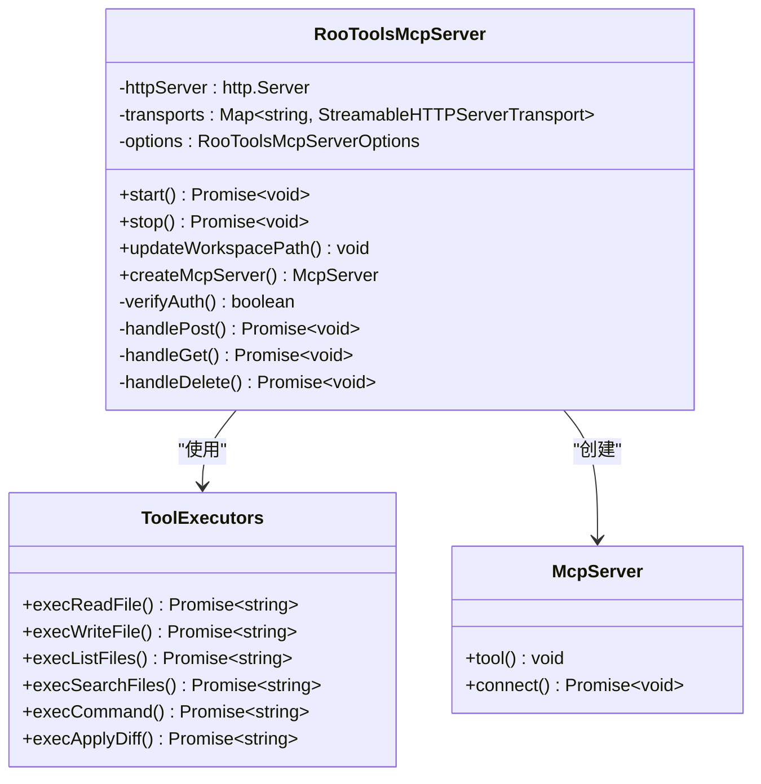

**图表来源**
- [RooToolsMcpServer.ts:27-34](file://src/services/mcp-server/RooToolsMcpServer.ts#L27-L34)
- [tool-executors.ts:28-68](file://src/services/mcp-server/tool-executors.ts#L28-L68)

**章节来源**
- [McpHub.ts:151-176](file://src/services/mcp/McpHub.ts#L151-L176)
- [RooToolsMcpServer.ts:27-34](file://src/services/mcp-server/RooToolsMcpServer.ts#L27-L34)

## 架构概览

### MCP协议通信流程

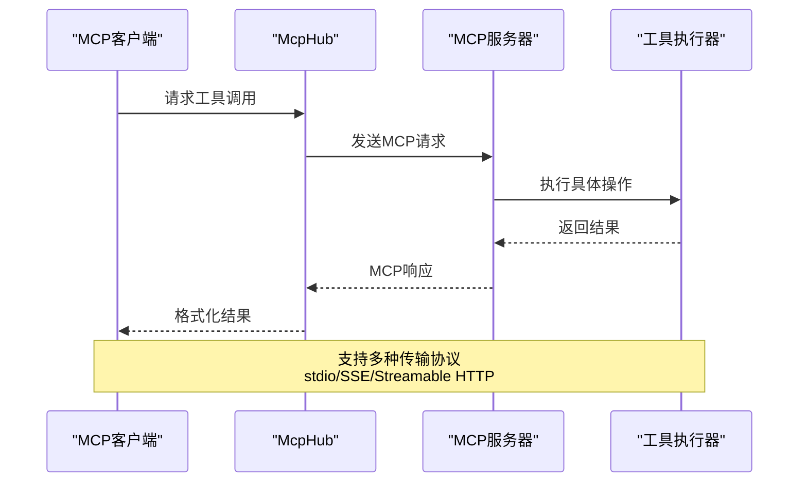

**图表来源**
- [McpHub.ts:656-800](file://src/services/mcp/McpHub.ts#L656-L800)
- [UseMcpToolTool.ts:300-351](file://src/core/tools/UseMcpToolTool.ts#L300-L351)

### 安全认证机制

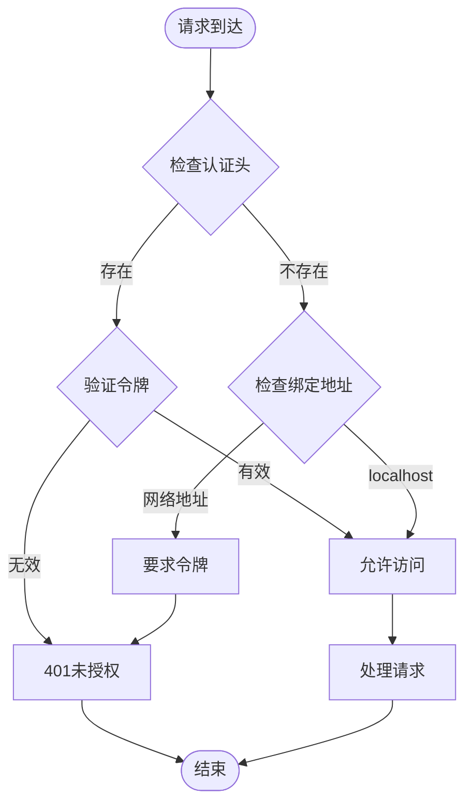

**图表来源**
- [RooToolsMcpServer.ts:168-176](file://src/services/mcp-server/RooToolsMcpServer.ts#L168-L176)
- [RooToolsMcpServer.ts:254-257](file://src/services/mcp-server/RooToolsMcpServer.ts#L254-L257)

## 详细组件分析

### MCP Hub配置管理

McpHub实现了智能的配置管理，支持全局和项目级配置的优先级处理。

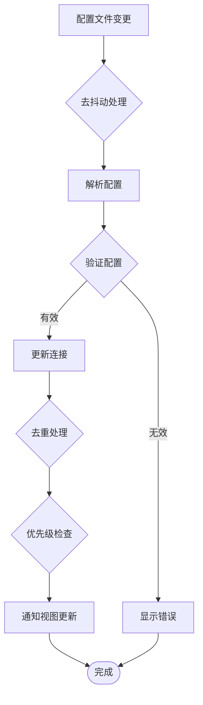

**图表来源**
- [McpHub.ts:302-323](file://src/services/mcp/McpHub.ts#L302-L323)
- [McpHub.ts:408-452](file://src/services/mcp/McpHub.ts#L408-L452)

### 工具执行器设计模式

工具执行器采用职责分离的设计模式，每个工具都有独立的执行函数：

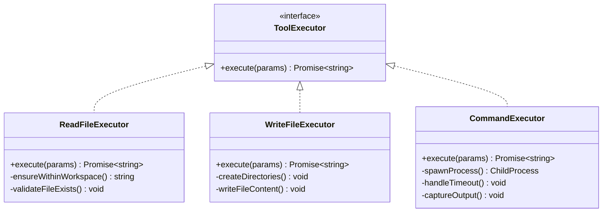

**图表来源**
- [tool-executors.ts:28-50](file://src/services/mcp-server/tool-executors.ts#L28-L50)
- [tool-executors.ts:116-180](file://src/services/mcp-server/tool-executors.ts#L116-L180)

**章节来源**
- [McpHub.ts:216-274](file://src/services/mcp/McpHub.ts#L216-L274)
- [tool-executors.ts:13-20](file://src/services/mcp-server/tool-executors.ts#L13-L20)

### 客户端工具调用流程

UseMcpToolTool实现了完整的工具调用生命周期管理：

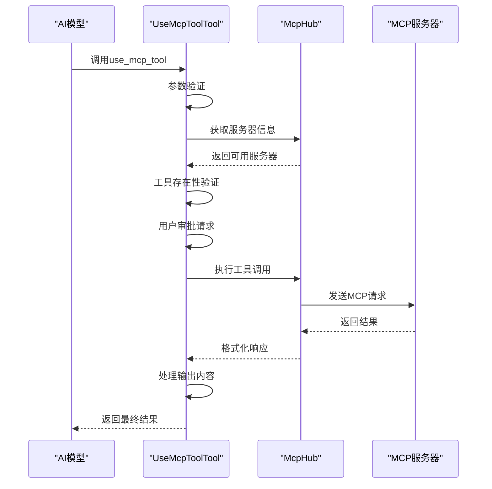

**图表来源**
- [UseMcpToolTool.ts:30-82](file://src/core/tools/UseMcpToolTool.ts#L30-L82)
- [UseMcpToolTool.ts:294-351](file://src/core/tools/UseMcpToolTool.ts#L294-L351)

**章节来源**
- [UseMcpToolTool.ts:27-355](file://src/core/tools/UseMcpToolTool.ts#L27-L355)

### 名称规范化和匹配机制

mcp-name模块提供了强大的名称处理功能，支持跨平台兼容性：

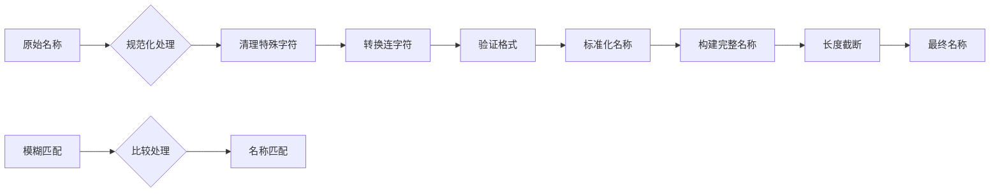

**图表来源**
- [mcp-name.ts:90-115](file://src/utils/mcp-name.ts#L90-L115)
- [mcp-name.ts:188-190](file://src/utils/mcp-name.ts#L188-L190)

**章节来源**
- [mcp-name.ts:1-191](file://src/utils/mcp-name.ts#L1-L191)

## 依赖关系分析

### 核心依赖关系

```mermaid
graph TB
subgraph "外部依赖"
A[@modelcontextprotocol/sdk]
B[zod]
C[chokidar]
D[fast-deep-equal]
end
subgraph "内部模块"
E[McpHub]
F[McpServerManager]
G[RooToolsMcpServer]
H[tool-executors]
I[UseMcpToolTool]
end
subgraph "工具函数"
J[mcp-name]
K[fs utilities]
L[path utilities]
end
A --> E
A --> G
B --> E
C --> E
D --> E
E --> I
F --> E
G --> H
J --> I
J --> G
K --> H
L --> H
```

**图表来源**
- [McpHub.ts:1-42](file://src/services/mcp/McpHub.ts#L1-L42)
- [RooToolsMcpServer.ts:1-16](file://src/services/mcp-server/RooToolsMcpServer.ts#L1-L16)

### 类型定义和接口

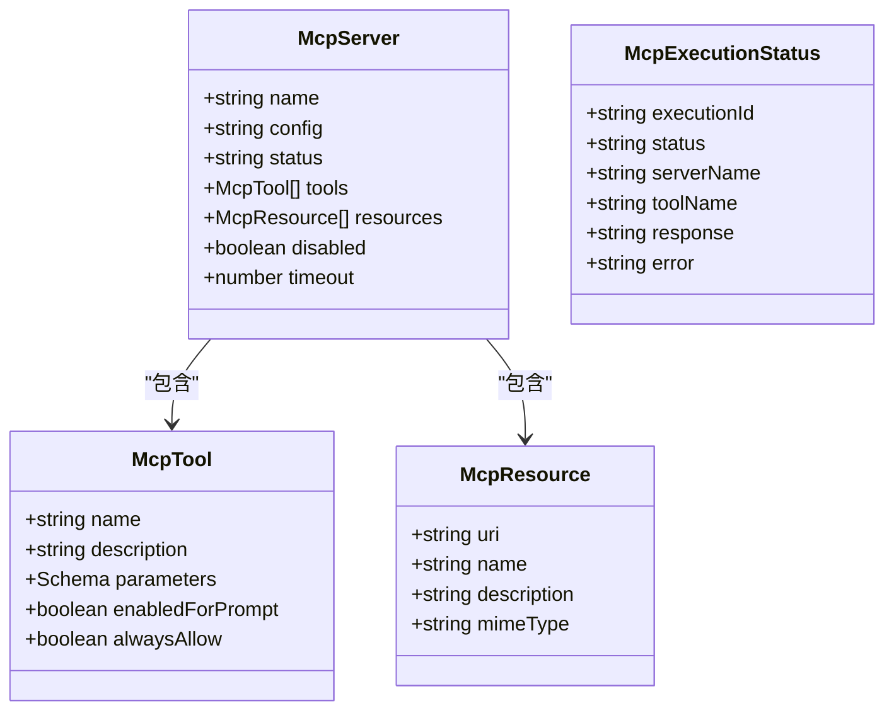

**图表来源**
- [mcp.ts:54-64](file://packages/types/src/mcp.ts#L54-L64)
- [mcp.ts:24-46](file://packages/types/src/mcp.ts#L24-L46)

**章节来源**
- [packages/types/src/mcp.ts:1-64](file://packages/types/src/mcp.ts#L1-L64)

## 性能考虑

### 连接池和资源管理

McpHub实现了智能的连接管理和资源回收机制：

- **连接复用**: 通过WeakRef避免内存泄漏
- **文件监控**: 使用chokidar进行高效的文件变更监听
- **去抖动处理**: 500ms去抖动防止频繁重启
- **超时控制**: 默认60秒超时，可配置范围1-3600秒

### 工具执行优化

- **工作空间边界检查**: 防止路径遍历攻击
- **结果限制**: 文件列表限制500个条目
- **超时机制**: 命令执行默认30秒超时
- **输出缓冲**: 分块处理大文件输出

### 缓存和预取策略

- **服务器名称注册**: O(1)查找时间复杂度
- **配置变更缓存**: 防止重复解析配置
- **错误历史记录**: 提供诊断信息

## 故障排除指南

### 常见问题诊断

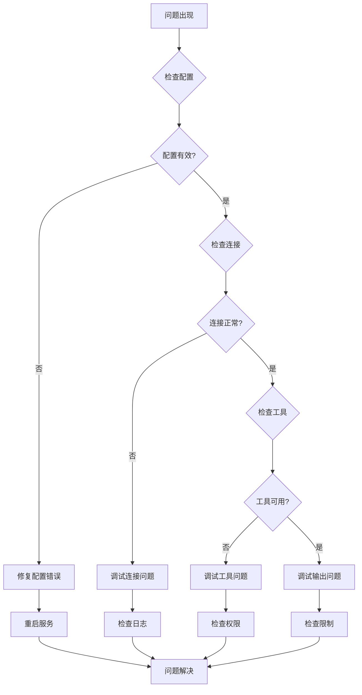

**图表来源**
- [McpHub.ts:281-283](file://src/services/mcp/McpHub.ts#L281-L283)
- [McpHub.ts:325-361](file://src/services/mcp/McpHub.ts#L325-L361)

### 调试工具和技巧

1. **日志级别**: 使用VS Code输出面板查看MCP相关日志
2. **配置验证**: 利用Zod schema进行配置语法和语义验证
3. **连接测试**: 使用test-mcp-server.mjs进行手动测试
4. **资源监控**: 监控文件系统变更和进程状态

**章节来源**
- [test-mcp-server.mjs:85-191](file://test-mcp-server.mjs#L85-L191)

## 结论

本指南详细介绍了Njust-AI项目中MCP协议的完整实现，包括客户端管理、服务器架构、工具执行器设计和安全机制。通过理解这些核心组件的工作原理，开发者可以：

- 快速开发自定义MCP服务器
- 设计安全可靠的工具执行器
- 实现高效的客户端集成
- 应用最佳实践进行性能优化
- 建立完善的故障排除流程

MCP协议为AI代理提供了强大的工具调用能力，通过本文档的指导，开发者可以充分利用这一技术栈构建功能丰富的扩展应用。

## 附录

### 开发示例模板

基于cangjie-mcp.example.json提供的配置模板，开发者可以快速创建自己的MCP服务器配置。

### 最佳实践清单

- **安全性**: 始终进行输入验证和路径边界检查
- **性能**: 合理设置超时和结果限制
- **可维护性**: 使用清晰的错误消息和日志记录
- **兼容性**: 支持多种传输协议和平台
- **测试**: 提供完整的单元测试和集成测试

### 发布和分发

- **版本管理**: 遵循语义化版本控制
- **文档**: 提供详细的API文档和使用示例
- **测试**: 确保跨平台兼容性和稳定性
- **监控**: 实施性能监控和错误报告机制