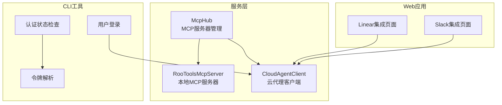
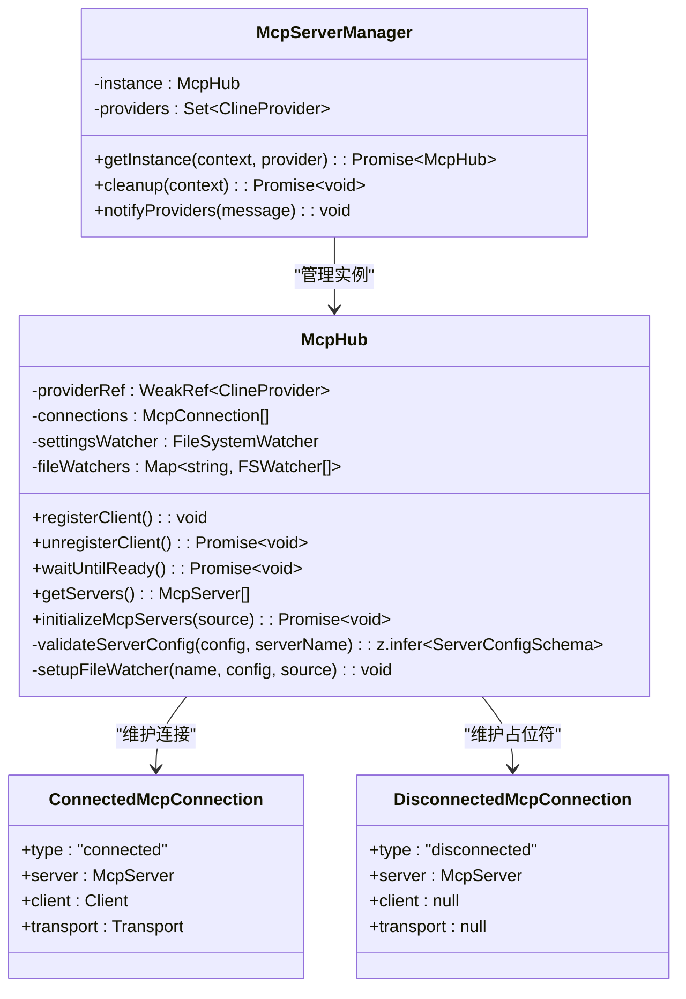
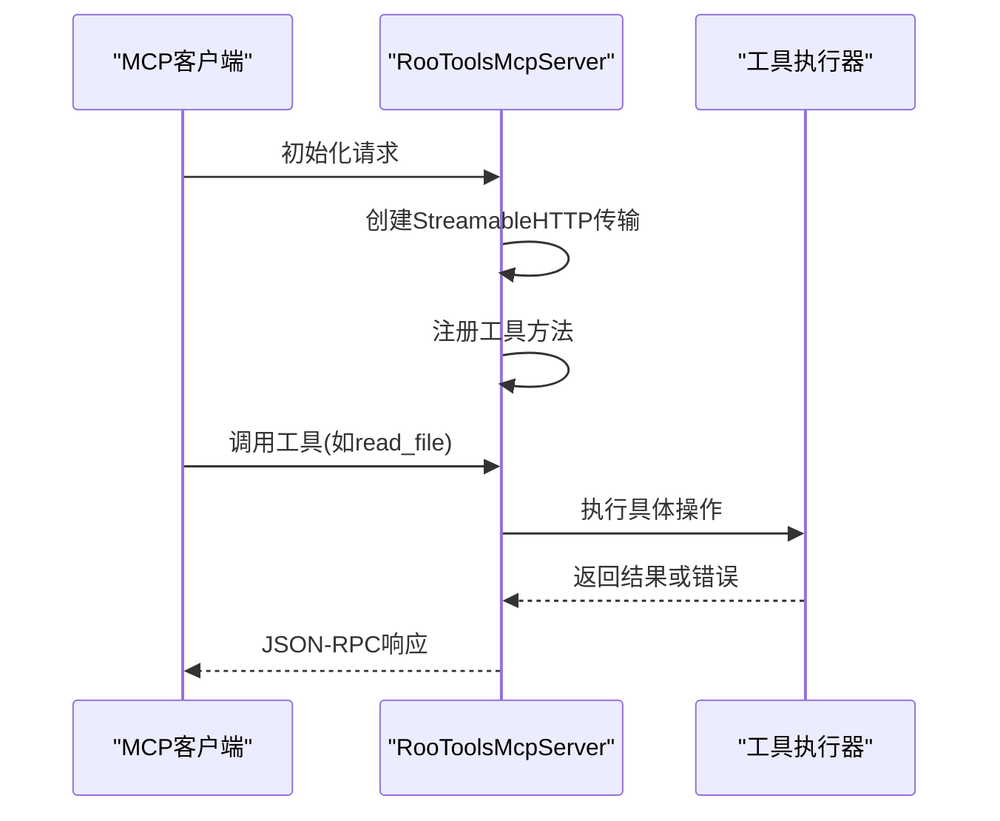
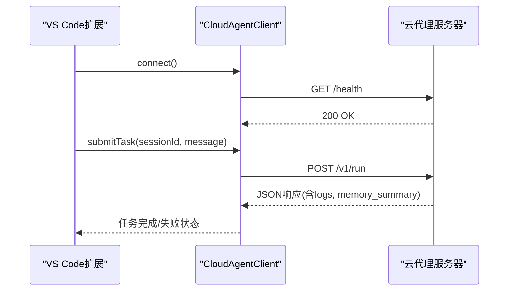
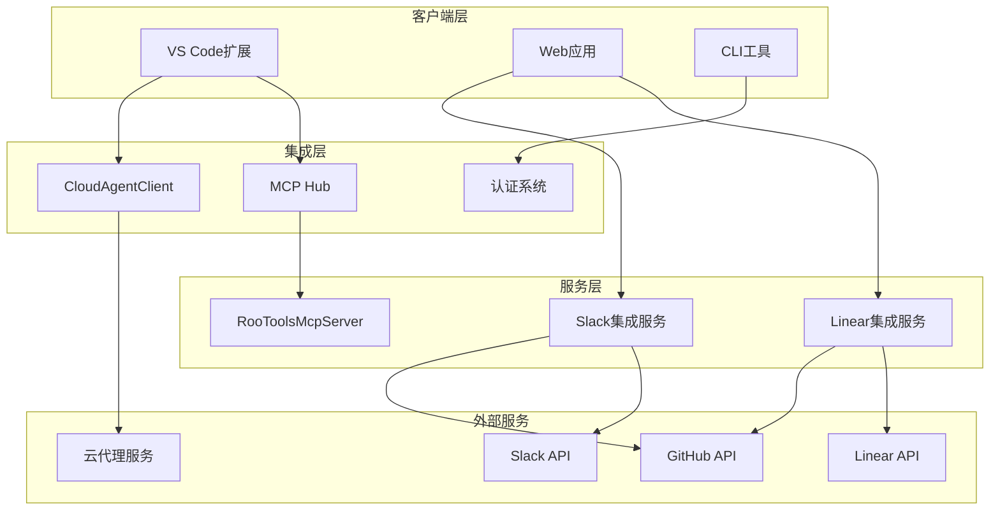
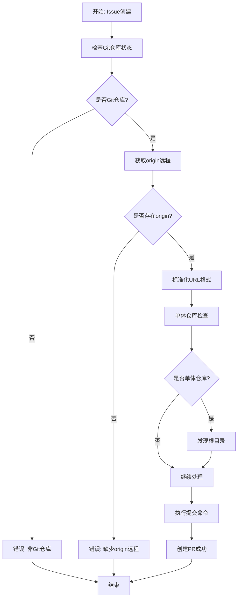
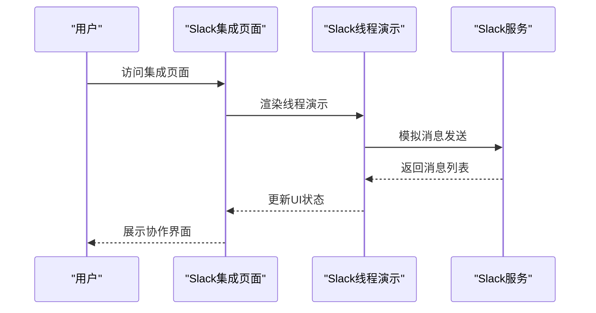
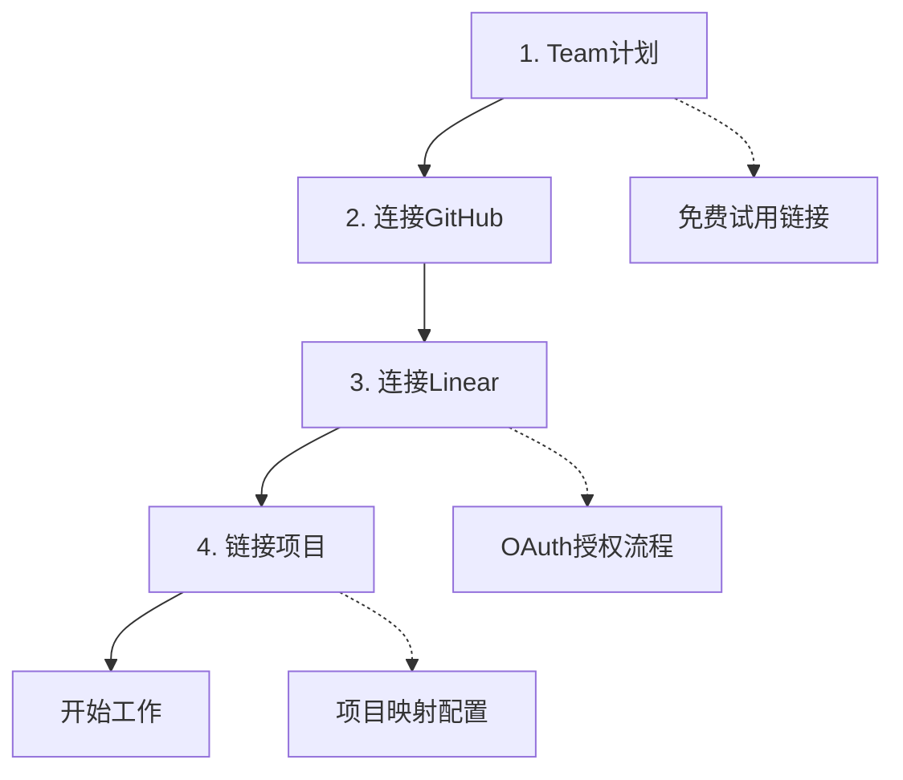

# 集成与扩展

<cite>
**本文档引用的文件**
- [McpHub.ts](file://src/services/mcp/McpHub.ts)
- [McpServerManager.ts](file://src/services/mcp/McpServerManager.ts)
- [RooToolsMcpServer.ts](file://src/services/mcp-server/RooToolsMcpServer.ts)
- [tool-executors.ts](file://src/services/mcp-server/tool-executors.ts)
- [CloudAgentClient.ts](file://src/services/cloud-agent/CloudAgentClient.ts)
- [page.tsx（Linear）](file://apps/web-Njust-AI/src/app/linear/page.tsx)
- [page.tsx（Slack）](file://apps/web-Njust-AI/src/app/slack/page.tsx)
- [slack-thread-demo.tsx](file://apps/web-Njust-AI/src/components/slack/slack-thread-demo.tsx)
- [index.ts（API 提供商）](file://src/api/providers/index.ts)
- [status.ts（CLI 认证）](file://apps/cli/src/commands/auth/status.ts)
- [login.ts（CLI 认证）](file://apps/cli/src/commands/auth/login.ts)
- [token.ts（CLI 认证）](file://apps/cli/src/lib/auth/token.ts)
- [git.ts（Git 工具）](file://src/utils/git.ts)
- [1_workflow.xml（规则工作流）](file://.njust-ai/rules-issue-writer/1_workflow.xml)
- [test-mcp-standalone.cjs](file://test-mcp-standalone.cjs)
</cite>

## 目录
1. [简介](#简介)
2. [项目结构](#项目结构)
3. [核心组件](#核心组件)
4. [架构概览](#架构概览)
5. [详细组件分析](#详细组件分析)
6. [依赖关系分析](#依赖关系分析)
7. [性能考虑](#性能考虑)
8. [故障排除指南](#故障排除指南)
9. [结论](#结论)
10. [附录](#附录)

## 简介
本文件面向需要集成和扩展NJUST_AI项目的开发者，提供完整的第三方服务集成指南。内容涵盖GitHub集成、Slack集成、Linear集成、Web应用集成等，并深入解释MCP（Model Context Protocol）服务器架构、云代理客户端、认证机制以及自定义集成开发的最佳实践。

## 项目结构
项目采用多包架构，主要涉及以下与集成相关的关键模块：
- 服务层：MCP Hub、MCP服务器管理器、云代理客户端
- Web应用：Next.js页面组件，提供Linear和Slack集成页面
- CLI工具：认证状态检查、登录流程、令牌解析
- 工具函数：Git URL转换、仓库信息提取



**图表来源**
- [McpHub.ts:151-176](file://src/services/mcp/McpHub.ts#L151-L176)
- [RooToolsMcpServer.ts:27-34](file://src/services/mcp-server/RooToolsMcpServer.ts#L27-L34)
- [CloudAgentClient.ts:43-59](file://src/services/cloud-agent/CloudAgentClient.ts#L43-L59)
- [page.tsx（Linear）:191-233](file://apps/web-Njust-AI/src/app/linear/page.tsx#L191-L233)
- [page.tsx（Slack）:331-369](file://apps/web-Njust-AI/src/app/slack/page.tsx#L331-L369)

**章节来源**
- [McpHub.ts:151-176](file://src/services/mcp/McpHub.ts#L151-L176)
- [McpServerManager.ts:9-54](file://src/services/mcp/McpServerManager.ts#L9-L54)
- [RooToolsMcpServer.ts:27-34](file://src/services/mcp-server/RooToolsMcpServer.ts#L27-L34)

## 核心组件
本节详细介绍支撑集成能力的核心组件及其职责。

### MCP Hub（MCP服务器中心）
MCP Hub负责管理全局和项目级的MCP服务器配置，提供统一的连接生命周期管理和错误处理机制。其关键特性包括：
- 支持三种传输类型：stdio、sse、streamable-http
- 文件系统监控自动重连机制
- 基于Zod的配置验证和错误消息格式化
- 连接状态跟踪和Webview通知



**图表来源**
- [McpHub.ts:151-176](file://src/services/mcp/McpHub.ts#L151-L176)
- [McpServerManager.ts:9-54](file://src/services/mcp/McpServerManager.ts#L9-L54)

**章节来源**
- [McpHub.ts:151-176](file://src/services/mcp/McpHub.ts#L151-L176)
- [McpHub.ts:216-274](file://src/services/mcp/McpHub.ts#L216-L274)
- [McpServerManager.ts:9-54](file://src/services/mcp/McpServerManager.ts#L9-L54)

### RooToolsMcpServer（本地MCP服务器）
RooToolsMcpServer提供一组安全的文件操作工具，支持读取、写入、搜索、命令执行和diff应用。其安全特性包括：
- 路径边界检查防止目录遍历攻击
- 命令白名单/黑名单策略
- CORS配置和可选的Bearer Token认证
- 多会话支持和传输管理



**图表来源**
- [RooToolsMcpServer.ts:44-161](file://src/services/mcp-server/RooToolsMcpServer.ts#L44-L161)
- [tool-executors.ts:28-50](file://src/services/mcp-server/tool-executors.ts#L28-L50)

**章节来源**
- [RooToolsMcpServer.ts:27-34](file://src/services/mcp-server/RooToolsMcpServer.ts#L27-L34)
- [RooToolsMcpServer.ts:168-235](file://src/services/mcp-server/RooToolsMcpServer.ts#L168-L235)
- [tool-executors.ts:13-20](file://src/services/mcp-server/tool-executors.ts#L13-L20)

### CloudAgentClient（云代理客户端）
CloudAgentClient提供与云端代理服务的REST通信接口，支持任务提交、编译执行和延迟执行协议。其关键功能包括：
- 健康检查和错误处理
- 会话管理和设备令牌认证
- 请求超时和中止信号合并
- 日志流式传输和内存摘要



**图表来源**
- [CloudAgentClient.ts:118-141](file://src/services/cloud-agent/CloudAgentClient.ts#L118-L141)
- [CloudAgentClient.ts:143-206](file://src/services/cloud-agent/CloudAgentClient.ts#L143-L206)

**章节来源**
- [CloudAgentClient.ts:43-59](file://src/services/cloud-agent/CloudAgentClient.ts#L43-L59)
- [CloudAgentClient.ts:118-141](file://src/services/cloud-agent/CloudAgentClient.ts#L118-L141)
- [CloudAgentClient.ts:143-206](file://src/services/cloud-agent/CloudAgentClient.ts#L143-L206)

## 架构概览
系统采用分层架构，通过MCP协议实现本地工具与AI模型的解耦集成，同时提供云代理服务以支持远程任务执行。



**图表来源**
- [McpHub.ts:151-176](file://src/services/mcp/McpHub.ts#L151-L176)
- [CloudAgentClient.ts:43-59](file://src/services/cloud-agent/CloudAgentClient.ts#L43-L59)
- [page.tsx（Linear）:191-233](file://apps/web-Njust-AI/src/app/linear/page.tsx#L191-L233)
- [page.tsx（Slack）:331-369](file://apps/web-Njust-AI/src/app/slack/page.tsx#L331-L369)

## 详细组件分析

### GitHub集成分析
GitHub集成为Linear工作流的核心组成部分，通过规则引擎和Git工具实现从Issue到Pull Request的自动化转换。



**图表来源**
- [1_workflow.xml:57-81](file://.njust-ai/rules-issue-writer/1_workflow.xml#L57-L81)
- [git.ts:87-118](file://src/utils/git.ts#L87-L118)

**章节来源**
- [1_workflow.xml:57-81](file://.njust-ai/rules-issue-writer/1_workflow.xml#L57-L81)
- [git.ts:87-118](file://src/utils/git.ts#L87-L118)
- [git.ts:125-147](file://src/utils/git.ts#L125-L147)

### Slack集成分析
Slack集成提供实时协作和任务管理功能，通过Web应用页面展示集成流程和演示组件。



**图表来源**
- [page.tsx（Slack）:331-369](file://apps/web-Njust-AI/src/app/slack/page.tsx#L331-L369)
- [slack-thread-demo.tsx:113-153](file://apps/web-Njust-AI/src/components/slack/slack-thread-demo.tsx#L113-L153)

**章节来源**
- [page.tsx（Slack）:331-369](file://apps/web-Njust-AI/src/app/slack/page.tsx#L331-L369)
- [slack-thread-demo.tsx:113-153](file://apps/web-Njust-AI/src/components/slack/slack-thread-demo.tsx#L113-L153)

### Linear集成分析
Linear集成页面提供完整的Onboarding流程，展示从Team计划到项目映射的完整设置过程。



**图表来源**
- [page.tsx（Linear）:156-181](file://apps/web-Njust-AI/src/app/linear/page.tsx#L156-L181)

**章节来源**
- [page.tsx（Linear）:156-181](file://apps/web-Njust-AI/src/app/linear/page.tsx#L156-L181)

### 自定义集成开发指南
基于现有架构，开发者可以创建自定义集成服务：

#### MCP服务器扩展
```typescript
// 示例：创建自定义MCP工具
server.tool(
  "custom_operation",
  "执行自定义操作",
  {
    param1: z.string().describe("参数描述"),
    param2: z.number().optional(),
  },
  async (params) => {
    try {
      const result = await executeCustomOperation(params)
      return { content: [{ type: "text", text: result }] }
    } catch (e) {
      return { 
        content: [{ type: "text", text: `Error: ${e.message}` }], 
        isError: true 
      }
    }
  }
)
```

#### 云代理扩展
```typescript
// 示例：添加新的云代理端点
async customEndpoint(sessionId: string, data: any): Promise<any> {
  const response = await fetch(`${this.serverUrl}/v1/custom`, {
    method: "POST",
    headers: this.buildHeaders(),
    body: JSON.stringify({ sessionId, data }),
  })
  
  if (!response.ok) {
    throw new Error(`HTTP ${response.status}: ${response.statusText}`)
  }
  
  return response.json()
}
```

**章节来源**
- [RooToolsMcpServer.ts:44-161](file://src/services/mcp-server/RooToolsMcpServer.ts#L44-L161)
- [CloudAgentClient.ts:143-206](file://src/services/cloud-agent/CloudAgentClient.ts#L143-L206)

## 依赖关系分析

```mermaid
graph TB
subgraph "MCP相关依赖"
MCP_SDK[@modelcontextprotocol/sdk]
ZOD[zod]
CHOKIDAR[chokidar]
RECONNECT_EVENTSOURCE[reconnecting-eventsource]
end
subgraph "认证相关依赖"
JWT[JWT令牌处理]
NODE_FETCH[Undici Fetch]
CRYPTO[crypto]
end
subgraph "工具函数依赖"
FS[fs/promises]
PATH[path]
CHILD_PROCESS[child_process]
RIPGREP[ripgrep]
end
McpHub --> MCP_SDK
McpHub --> ZOD
McpHub --> CHOKIDAR
McpHub --> RECONNECT_EVENTSOURCE
CloudAgentClient --> NODE_FETCH
CloudAgentClient --> CRYPTO
tool-executors --> FS
tool-executors --> PATH
tool-executors --> CHILD_PROCESS
tool-executors --> RIPGREP
```

**图表来源**
- [McpHub.ts:1-20](file://src/services/mcp/McpHub.ts#L1-L20)
- [CloudAgentClient.ts:1-15](file://src/services/cloud-agent/CloudAgentClient.ts#L1-L15)
- [tool-executors.ts:1-7](file://src/services/mcp-server/tool-executors.ts#L1-L7)

**章节来源**
- [McpHub.ts:1-20](file://src/services/mcp/McpHub.ts#L1-L20)
- [CloudAgentClient.ts:1-15](file://src/services/cloud-agent/CloudAgentClient.ts#L1-L15)
- [tool-executors.ts:1-7](file://src/services/mcp-server/tool-executors.ts#L1-L7)

## 性能考虑
- **MCP服务器性能优化**
  - 使用文件系统监控减少轮询开销
  - 实现连接池和会话复用
  - 启用适当的超时和重试机制
  - 实施背压控制防止资源耗尽

- **云代理通信优化**
  - 实现请求合并和批处理
  - 使用连接复用减少握手开销
  - 实施指数退避重试策略
  - 添加请求超时和取消支持

- **内存管理**
  - 及时清理未使用的传输连接
  - 实施缓存策略避免重复计算
  - 监控内存使用防止泄漏

## 故障排除指南

### MCP服务器常见问题
- **连接失败**：检查服务器配置语法和网络可达性
- **权限错误**：验证文件路径边界和命令执行权限
- **超时问题**：调整超时设置和增加日志级别

### 云代理通信问题
- **认证失败**：确认设备令牌和API密钥配置
- **网络超时**：检查防火墙设置和代理配置
- **响应格式错误**：验证JSON解析和数据结构

### CLI认证问题
- **令牌过期**：使用`njust-ai auth login`重新登录
- **状态检查**：运行`njust-ai auth status`查看当前状态
- **环境变量**：确保正确的API密钥环境变量设置

**章节来源**
- [McpHub.ts:281-283](file://src/services/mcp/McpHub.ts#L281-L283)
- [CloudAgentClient.ts:32-41](file://src/services/cloud-agent/CloudAgentClient.ts#L32-L41)
- [status.ts（CLI 认证）:18-51](file://apps/cli/src/commands/auth/status.ts#L18-L51)

## 结论
本集成开发文档提供了NJUST_AI项目与第三方服务集成的完整技术指南。通过MCP协议实现的安全工具访问、云代理服务的远程执行能力，以及Web应用的直观集成界面，为开发者构建了强大的扩展平台。遵循本文档的最佳实践和安全考虑，可以确保集成系统的稳定性、可维护性和安全性。

## 附录

### API端点设计规范
- **MCP服务器端点**：`/mcp` - 支持GET、POST、DELETE方法
- **云代理端点**：`/health`、`/v1/run`、`/v1/run/compile`、`/v1/run/deferred/*`
- **认证端点**：CLI登录流程和令牌验证

### 安全最佳实践
- 实施严格的路径验证和命令白名单
- 使用HTTPS和Bearer Token认证
- 实现适当的超时和重试机制
- 添加详细的日志记录和错误处理

### 扩展开发模板
- MCP工具：参考`RooToolsMcpServer.ts`中的工具注册模式
- 云服务：参考`CloudAgentClient.ts`的REST客户端实现
- Web集成：参考`page.tsx`文件的Next.js页面组件模式