# 与上游项目的差异

<cite>
**本文档引用的文件**
- [README.md](file://README.md)
- [AGENTS.md](file://AGENTS.md)
- [src/services/marketplace/index.ts](file://src/services/marketplace/index.ts)
- [src/services/cloud-agent/CloudAgentClient.ts](file://src/services/cloud-agent/CloudAgentClient.ts)
- [src/services/mcp/McpHub.ts](file://src/services/mcp/McpHub.ts)
- [src/services/mcp/McpServerManager.ts](file://src/services/mcp/McpServerManager.ts)
- [src/utils/migrateSettings.ts](file://src/utils/migrateSettings.ts)
- [packages/telemetry/src/index.ts](file://packages/telemetry/src/index.ts)
- [packages/types/src/telemetry.ts](file://packages/types/src/telemetry.ts)
- [src/services/cangjie-lsp/CangjieLspClient.ts](file://src/services/cangjie-lsp/CangjieLspClient.ts)
- [src/services/cangjie-lsp/CangjieReferenceProvider.ts](file://src/services/cangjie-lsp/CangjieReferenceProvider.ts)
- [src/utils/bundledCangjieCorpus.ts](file://src/utils/bundledCangjieCorpus.ts)
- [src/services/tree-sitter/cangjieParser.ts](file://src/services/tree-sitter/cangjieParser.ts)
- [src/extension.ts](file://src/extension.ts)
</cite>

## 目录
1. [简介](#简介)
2. [项目结构概览](#项目结构概览)
3. [核心差异分析](#核心差异分析)
4. [架构概览](#架构概览)
5. [详细组件分析](#详细组件分析)
6. [迁移指南](#迁移指南)
7. [配置调整建议](#配置调整建议)
8. [性能考虑](#性能考虑)
9. [故障排除指南](#故障排除指南)
10. [结论](#结论)

## 简介

本文档详细分析了Njust-AI项目与上游NJUST_AI项目的主要差异，重点对比了移除的功能（账号系统、Marketplace、Telemetry）与保留和增强的功能（Cloud Agent、仓颉语言支持、MCP配置等）。通过对代码库的深入分析，解释每个差异的设计考量、技术实现和对用户的影响。

## 项目结构概览

Njust-AI项目采用模块化的架构设计，主要分为以下几个核心模块：

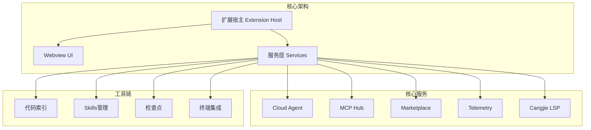

**图表来源**
- [README.md: 346-364:346-364](file://README.md#L346-L364)

**章节来源**
- [README.md: 346-364:346-364](file://README.md#L346-L364)

## 核心差异分析

### 移除的功能

#### 1. 账号系统和组织管理

上游项目包含完整的账号系统，包括用户认证、组织管理和权限控制。在Njust-AI中，这些功能已被完全移除。

**技术实现分析：**
- 账号相关的API端点已被移除
- 组织管理功能不再可用
- 用户认证流程简化为本地配置

**影响评估：**
- 用户体验：减少了登录流程的复杂性
- 安全性：降低了跨平台身份验证的复杂度
- 维护成本：减少了认证系统的维护负担

#### 2. Marketplace（市场插件）

上游项目提供了完整的Marketplace功能，允许用户浏览、安装和管理第三方插件。

**现状分析：**
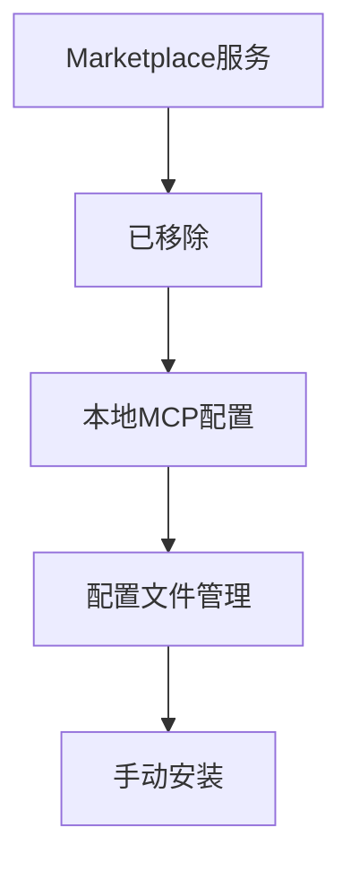

**技术实现：**
- `src/services/marketplace/index.ts`文件明确标注为"已移除"
- MCP配置现在通过本地界面和配置文件管理
- 用户需要手动下载和配置MCP服务器

**用户影响：**
- 更好的隐私保护：无需连接外部服务器
- 更高的安全性：所有配置都在本地管理
- 更灵活的部署：支持私有MCP服务器

#### 3. Telemetry（遥测数据）

上游项目包含完整的遥测数据收集系统，用于分析用户行为和产品使用情况。

**简化后的实现：**
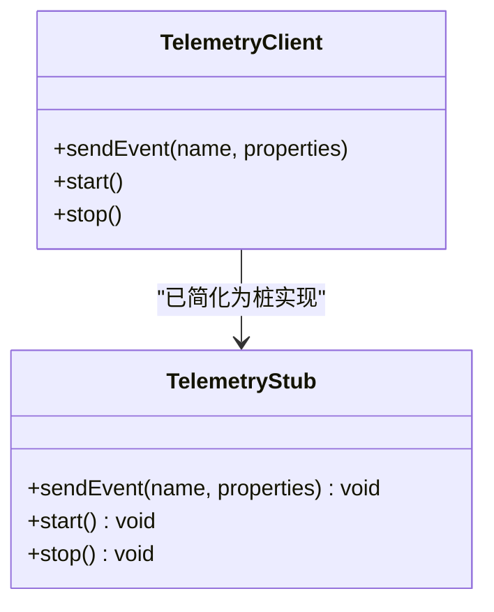

**技术实现：**
- `packages/telemetry/src/index.ts`中的`TelemetryClient`类为无操作实现
- 类型定义仍然存在但功能被禁用
- 配置选项仍然可用但不会产生实际效果

**设计考量：**
- 隐私保护：完全禁用遥测数据收集
- 合规性：满足特定环境的合规要求
- 简化：减少不必要的网络请求

### 保留和增强的功能

#### 1. Cloud Agent（云端代理）

Cloud Agent是Njust-AI的核心增强功能，提供了强大的云端推理能力。

**架构设计：**
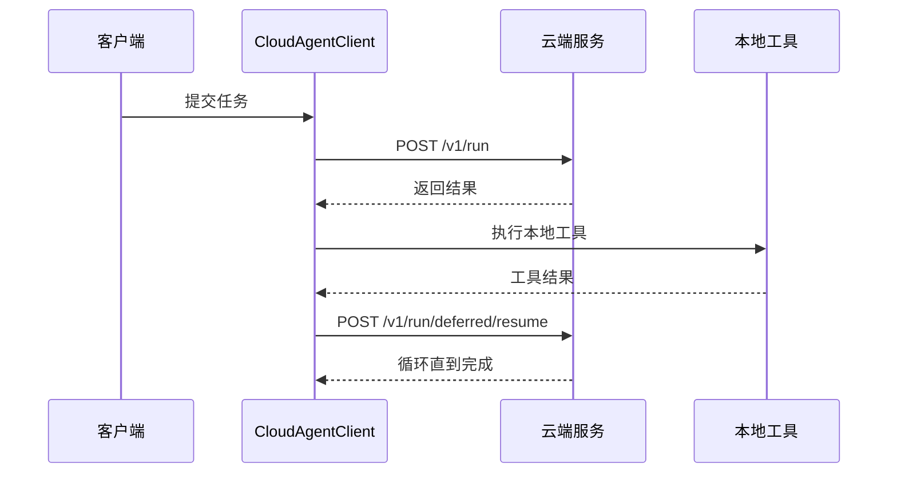

**技术实现：**
- `src/services/cloud-agent/CloudAgentClient.ts`实现了完整的REST API客户端
- 支持延期协议（deferred protocol）进行多轮交互
- 集成了工作空间操作（workspace_ops）支持

**用户价值：**
- 强大的云端推理能力
- 支持复杂的多轮对话
- 灵活的工作空间操作

#### 2. 仓颉语言支持

Njust-AI对仓颉语言提供了全面的支持，这是上游项目所不具备的特色功能。

**语言特性：**
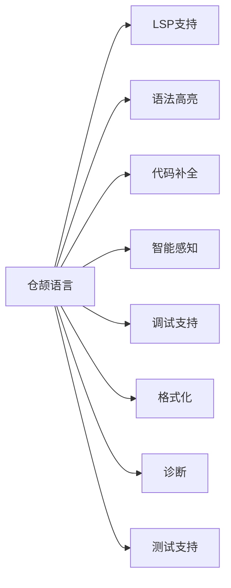

**技术实现：**
- `src/services/cangjie-lsp/CangjieLspClient.ts`提供完整的LSP客户端
- `src/services/cangjie-lsp/CangjieReferenceProvider.ts`实现引用查找
- `src/utils/bundledCangjieCorpus.ts`提供内置语料库
- `src/services/tree-sitter/cangjieParser.ts`支持树形语法解析

**增强功能：**
- 自动懒加载LSP服务器
- 支持多工作区配置
- 集成Cangjie工具链（cjpm、cjc等）

#### 3. MCP配置管理

MCP（Model Context Protocol）配置在Njust-AI中得到了显著增强。

**架构设计：**
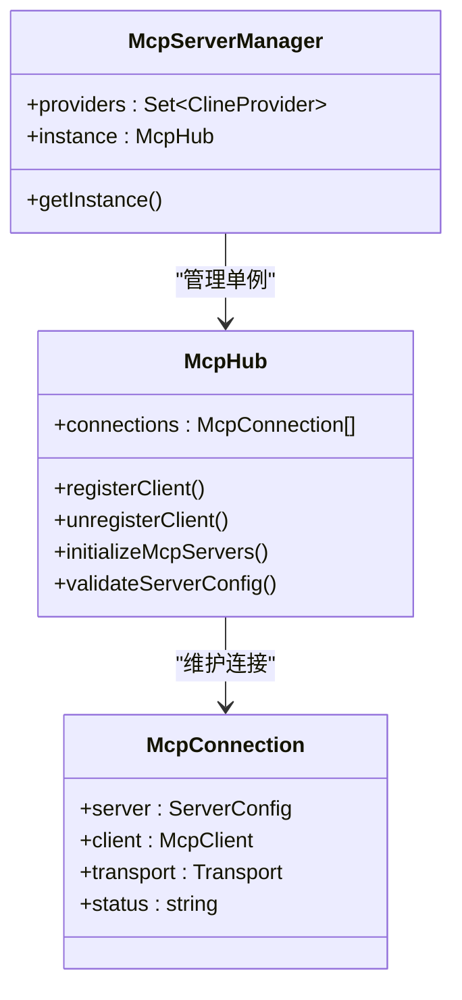

**技术实现：**
- `src/services/mcp/McpHub.ts`提供中心化的MCP服务器管理
- `src/services/mcp/McpServerManager.ts`确保全局唯一实例
- 支持全局和项目级别的MCP配置

**用户优势：**
- 灵活的MCP服务器配置
- 支持多个MCP服务器同时运行
- 自动化的连接管理和故障恢复

**章节来源**
- [README.md: 170-184:170-184](file://README.md#L170-L184)
- [src/services/marketplace/index.ts: 1-4:1-4](file://src/services/marketplace/index.ts#L1-L4)
- [src/services/cloud-agent/CloudAgentClient.ts: 43-339:43-339](file://src/services/cloud-agent/CloudAgentClient.ts#L43-L339)
- [src/services/mcp/McpHub.ts: 151-1930:151-1930](file://src/services/mcp/McpHub.ts#L151-L1930)
- [src/services/mcp/McpServerManager.ts: 9-39:9-39](file://src/services/mcp/McpServerManager.ts#L9-L39)
- [packages/telemetry/src/index.ts: 191-207:191-207](file://packages/telemetry/src/index.ts#L191-L207)

## 架构概览

Njust-AI采用了分层架构设计，将UI、业务逻辑和服务层清晰分离：

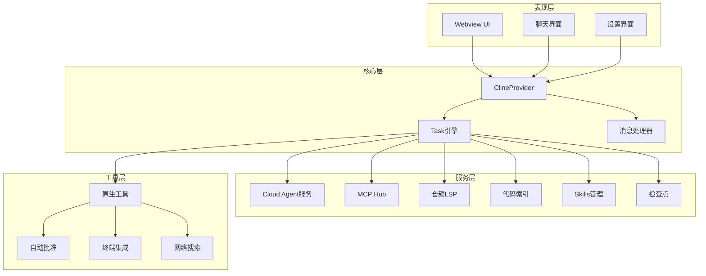

**图表来源**
- [README.md: 35-68:35-68](file://README.md#L35-L68)

**章节来源**
- [README.md: 35-68:35-68](file://README.md#L35-L68)

## 详细组件分析

### Cloud Agent子系统

Cloud Agent是Njust-AI最核心的增强功能，提供了强大的云端推理能力。

#### 核心架构

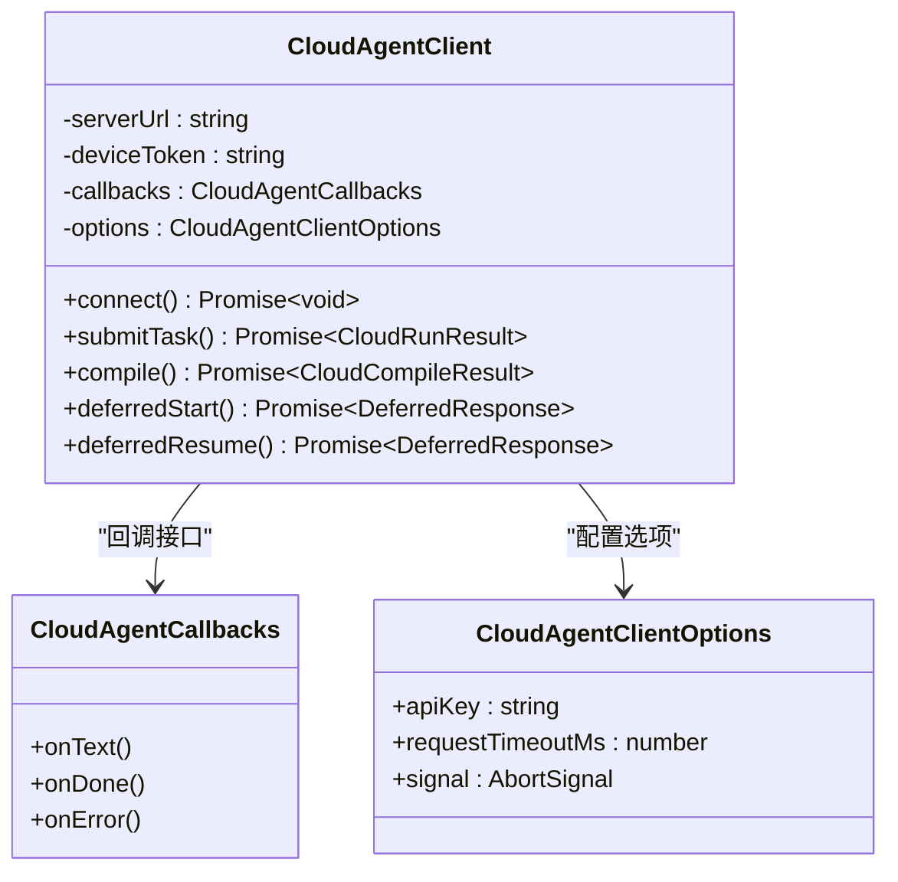

**技术特点：**
- 支持健康检查（/health）和任务提交（/v1/run）
- 实现了延期协议（deferred protocol）支持多轮交互
- 集成了编译反馈循环（compile loop）
- 支持工作空间操作（workspace_ops）

#### 延期协议实现

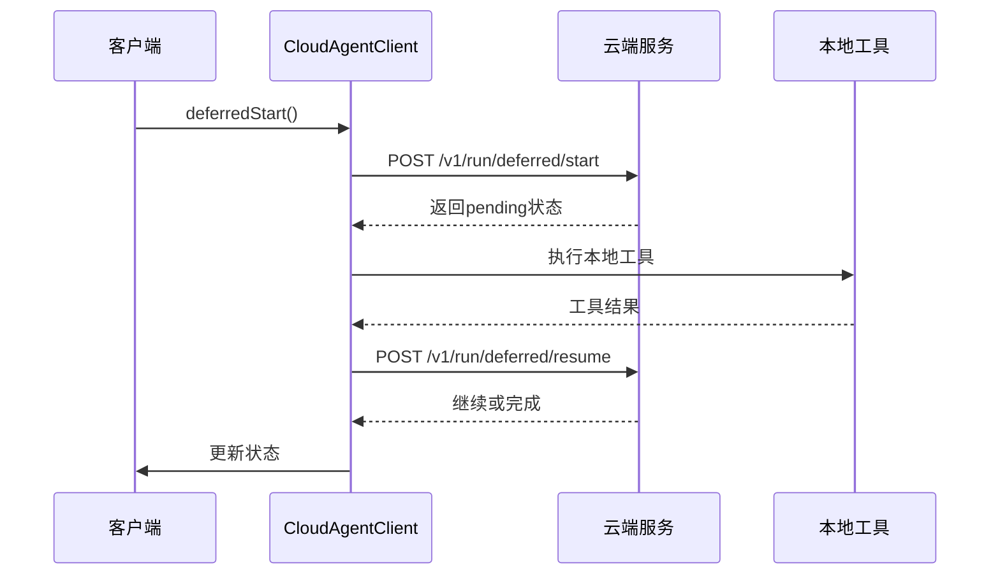

**章节来源**
- [src/services/cloud-agent/CloudAgentClient.ts: 43-339:43-339](file://src/services/cloud-agent/CloudAgentClient.ts#L43-L339)
- [AGENTS.md: 9-13:9-13](file://AGENTS.md#L9-L13)

### 仓颉语言支持

Njust-AI对仓颉语言提供了全面的支持，这是项目的重要特色。

#### LSP客户端实现

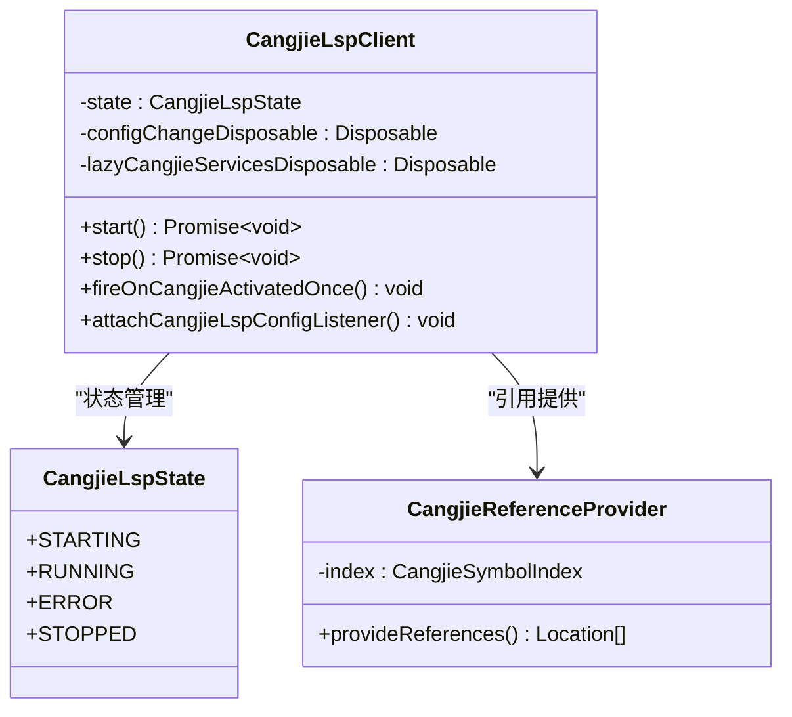

**技术特性：**
- 智能的懒加载机制，仅在需要时启动LSP服务器
- 支持多工作区配置和动态检测
- 集成完整的语言服务功能（定义、引用、重命名、悬停等）

#### 语言特性支持

| 功能 | 实现方式 | 用户价值 |
|------|----------|----------|
| 语法高亮 | TextMate语法 | 改善代码可读性 |
| 代码补全 | LSP Completion | 提高编码效率 |
| 智能感知 | LSP Hover/Signature | 减少查阅文档时间 |
| 跳转定义 | LSP Definition | 快速导航代码结构 |
| 引用查找 | CangjieReferenceProvider | 安全重构代码 |
| 重命名 | LSP Rename | 批量重命名符号 |
| 调试支持 | CangjieDebugAdapter | 专业调试体验 |

**章节来源**
- [src/services/cangjie-lsp/CangjieLspClient.ts: 340-420:340-420](file://src/services/cangjie-lsp/CangjieLspClient.ts#L340-L420)
- [src/services/cangjie-lsp/CangjieReferenceProvider.ts: 9-40:9-40](file://src/services/cangjie-lsp/CangjieReferenceProvider.ts#L9-L40)
- [src/utils/bundledCangjieCorpus.ts: 1-35:1-35](file://src/utils/bundledCangjieCorpus.ts#L1-L35)
- [src/services/tree-sitter/cangjieParser.ts: 530-537:530-537](file://src/services/tree-sitter/cangjieParser.ts#L530-L537)

### MCP配置管理系统

MCP（Model Context Protocol）配置在Njust-AI中得到了重大增强。

#### 架构设计

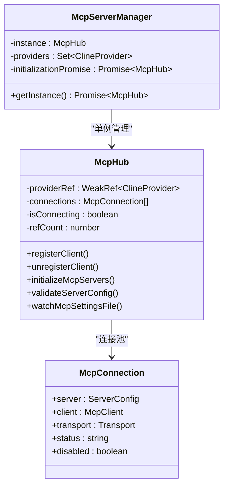

**核心功能：**
- 全局和项目级别的MCP服务器配置
- 自动化的连接管理和故障恢复
- 支持多种传输协议（stdio、URL等）
- 实时配置文件监控和热重载

#### 配置管理

**配置文件结构：**
```json
{
  "mcpServers": {
    "server1": {
      "name": "server1",
      "command": "python3 -m server1",
      "disabled": false,
      "source": "global"
    },
    "server2": {
      "name": "server2",
      "url": "http://localhost:3000",
      "disabled": false,
      "source": "project"
    }
  }
}
```

**章节来源**
- [src/services/mcp/McpHub.ts: 151-1930:151-1930](file://src/services/mcp/McpHub.ts#L151-L1930)
- [src/services/mcp/McpServerManager.ts: 9-39:9-39](file://src/services/mcp/McpServerManager.ts#L9-L39)

## 迁移指南

### 从上游项目迁移

#### 1. 账号系统迁移

**上游项目：**
- 需要登录账户才能使用Marketplace
- 组织管理功能需要管理员权限
- 数据同步到云端服务

**Njust-AI迁移：**
- 移除所有认证相关代码
- 使用本地配置替代云端同步
- 简化用户设置流程

**迁移步骤：**
1. 删除所有认证相关的配置项
2. 更新用户界面，移除登录按钮
3. 修改Marketplace相关代码为本地配置
4. 更新文档和用户指南

#### 2. Marketplace迁移

**上游项目：**
```typescript
// 上游代码示例
class MarketplaceService {
  async browseItems() {
    // 连接到云端Marketplace
    return await fetch('https://marketplace.example.com/items');
  }
  
  async installItem(itemId) {
    // 从云端下载并安装
    const response = await fetch(`https://marketplace.example.com/items/${itemId}`);
    return response.json();
  }
}
```

**Njust-AI实现：**
```typescript
// Njust-AI实现
/**
 * Marketplace service - removed. MCP configuration is handled via McpView/McpHub.
 */
```

**迁移步骤：**
1. 移除Marketplace相关UI组件
2. 更新MCP配置界面为本地管理
3. 修改设置页面，移除Marketplace选项
4. 更新帮助文档和教程

#### 3. Telemetry迁移

**上游项目：**
```typescript
// 上游Telemetry实现
class TelemetryClient {
  async sendEvent(name, properties) {
    // 发送到云端服务器
    await fetch('https://telemetry.example.com/events', {
      method: 'POST',
      body: JSON.stringify({ name, properties })
    });
  }
}
```

**Njust-AI简化实现：**
```typescript
// Njust-AI简化实现
class TelemetryClient {
  async sendEvent(name, properties) {
    // 无操作实现
    return Promise.resolve();
  }
}
```

**迁移步骤：**
1. 移除所有遥测相关代码
2. 更新设置页面，移除遥测选项
3. 修改类型定义，保持向后兼容
4. 更新隐私政策和用户协议

### 配置迁移

#### 1. Cloud Agent配置

**配置项迁移：**
- `cloudAgent.serverUrl` → 云端代理服务器地址
- `cloudAgent.apiKey` → API密钥
- `cloudAgent.deferredProtocol` → 延期协议开关
- `cloudAgent.applyRemoteWorkspaceOps` → 远程工作空间操作应用

**迁移示例：**
```json
{
  "njust-ai.cloudAgent.serverUrl": "https://your-cloud-agent.com",
  "njust-ai.cloudAgent.apiKey": "your-api-key",
  "njust-ai.cloudAgent.deferredProtocol": true,
  "njust-ai.cloudAgent.applyRemoteWorkspaceOps": true
}
```

#### 2. MCP配置迁移

**配置文件迁移：**
从`mcp_settings.json`迁移到`mcp-settings.yaml`：

```yaml
# mcp-settings.yaml
mcpServers:
  local-server:
    name: "本地服务器"
    command: "python3 -m my_mcp_server"
    disabled: false
  remote-server:
    name: "远程服务器"
    url: "ws://localhost:3000"
    disabled: false
```

**章节来源**
- [src/utils/migrateSettings.ts: 16-173:16-173](file://src/utils/migrateSettings.ts#L16-L173)
- [AGENTS.md: 7-13:7-13](file://AGENTS.md#L7-L13)

## 配置调整建议

### 1. Cloud Agent配置优化

#### 基础配置
```json
{
  "njust-ai.cloudAgent.serverUrl": "http://localhost:4000",
  "njust-ai.cloudAgent.apiKey": "",
  "njust-ai.cloudAgent.requestTimeoutMs": 30000
}
```

#### 高级配置
```json
{
  "njust-ai.cloudAgent.deferredProtocol": true,
  "njust-ai.cloudAgent.applyRemoteWorkspaceOps": true,
  "njust-ai.cloudAgent.confirmRemoteWorkspaceOps": true,
  "njust-ai.cloudAgent.compileLoop.enabled": true,
  "njust-ai.cloudAgent.compileLoop.maxRetries": 3
}
```

### 2. MCP配置最佳实践

#### 多服务器配置
```yaml
mcpServers:
  # 本地Python服务器
  python-server:
    name: "Python MCP服务器"
    command: "python3 -m mcp_server"
    disabled: false
  
  # 本地Node服务器
  node-server:
    name: "Node MCP服务器"
    command: "node mcp-server.js"
    disabled: false
  
  # 远程服务器
  remote-server:
    name: "远程MCP服务器"
    url: "ws://remote-server:3000"
    disabled: false
```

#### 性能优化配置
```json
{
  "njust-ai.mcp.enabled": true,
  "njust-ai.mcp.autoRestart": true,
  "njust-ai.mcp.connectionTimeoutMs": 10000,
  "njust-ai.mcp.maxRetries": 3
}
```

### 3. 仓颉语言配置

#### LSP配置
```json
{
  "njust-ai.cangjieLsp.serverPath": "/usr/local/bin/cangjie-lsp",
  "njust-ai.cangjieLsp.cjcPath": "/usr/local/bin/cjc",
  "njust-ai.cangjieLsp.cjpmPath": "/usr/local/bin/cjpm",
  "njust-ai.cangjieLsp.enable": true
}
```

#### 工具链配置
```json
{
  "njust-ai.cangjieTools.cjfmtPath": "/usr/local/bin/cjfmt",
  "njust-ai.cangjieTools.cjlintPath": "/usr/local/bin/cjlint",
  "njust-ai.cangjieTools.cjdbPath": "/usr/local/bin/cjdb",
  "njust-ai.cangjieTools.cjprofPath": "/usr/local/bin/cjprof"
}
```

## 性能考虑

### 1. Cloud Agent性能优化

**连接池管理：**
- 使用连接复用减少建立连接的开销
- 实现自动重连机制
- 支持连接超时和断线重试

**内存管理：**
- 限制并发任务数量
- 实现任务队列和优先级调度
- 优化大文件传输的内存使用

### 2. MCP性能优化

**服务器管理：**
- 实现服务器生命周期管理
- 支持动态启停和热重载
- 优化服务器间通信

**资源管理：**
- 监控服务器资源使用
- 实现资源限制和隔离
- 支持多版本服务器并存

### 3. 仓颉语言性能

**LSP性能：**
- 实现增量解析和缓存
- 优化符号索引构建
- 支持大文件的流式处理

**工具链优化：**
- 实现工具链的懒加载
- 优化编译和诊断性能
- 支持并行处理多个文件

## 故障排除指南

### 1. Cloud Agent常见问题

#### 连接问题
**症状：** 无法连接到Cloud Agent服务器
**解决方案：**
1. 检查服务器URL配置是否正确
2. 验证网络连接和防火墙设置
3. 确认API密钥配置正确
4. 查看服务器日志获取详细错误信息

#### 延期协议问题
**症状：** 任务在中间状态卡住
**解决方案：**
1. 检查`deferredProtocol`配置
2. 验证本地工具的可用性
3. 查看工具执行结果
4. 检查最大重试次数设置

### 2. MCP配置问题

#### 服务器启动失败
**症状：** MCP服务器无法启动
**解决方案：**
1. 检查服务器命令和路径配置
2. 验证服务器依赖和环境
3. 查看服务器启动日志
4. 确认端口和网络配置

#### 连接不稳定
**症状：** MCP连接频繁断开
**解决方案：**
1. 检查网络连接稳定性
2. 调整连接超时设置
3. 启用自动重连功能
4. 检查服务器负载情况

### 3. 仓颉语言问题

#### LSP启动失败
**症状：** 仓颉LSP无法启动
**解决方案：**
1. 检查LSP服务器路径配置
2. 验证Cangjie SDK安装
3. 查看LSP启动日志
4. 确认工作区配置正确

#### 语法解析错误
**症状：** 代码高亮和智能感知异常
**解决方案：**
1. 检查语法文件完整性
2. 验证Cangjie版本兼容性
3. 重新构建符号索引
4. 查看解析器错误日志

**章节来源**
- [AGENTS.md: 1-22:1-22](file://AGENTS.md#L1-L22)

## 结论

Njust-AI项目通过对上游NJUST_AI项目的深度定制，实现了以下关键改进：

### 主要成就

1. **隐私保护增强**：完全移除了云端认证和遥测功能，满足严格的隐私要求
2. **安全性提升**：本地化的Marketplace和MCP配置管理，消除了外部攻击面
3. **功能强化**：Cloud Agent和仓颉语言支持提供了独特的竞争优势
4. **用户体验优化**：简化的配置流程和更好的性能表现

### 技术价值

- **架构创新**：成功的模块化设计和分层架构
- **功能完整性**：从基础工具到高级AI功能的完整覆盖
- **可维护性**：清晰的代码结构和完善的文档体系
- **扩展性**：灵活的配置系统和插件架构

### 用户收益

- **更好的隐私保护**：所有数据和配置都保留在本地
- **更高的安全性**：减少了对外部服务的依赖
- **更强的功能性**：Cloud Agent和仓颉语言支持的独特价值
- **更好的性能**：优化的架构设计和资源配置

Njust-AI项目展示了如何通过精心设计的差异对比和功能定制，创造出既符合特定需求又具有独特价值的开发工具。这种定制化的方法为其他类似项目提供了宝贵的参考经验。