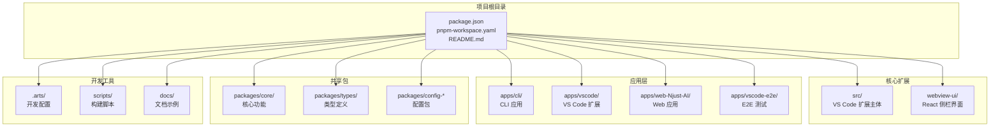
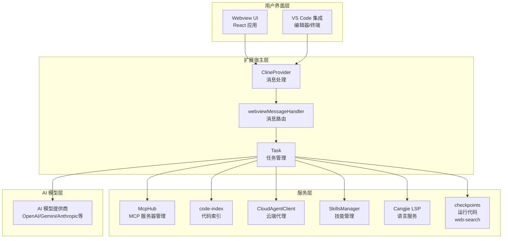
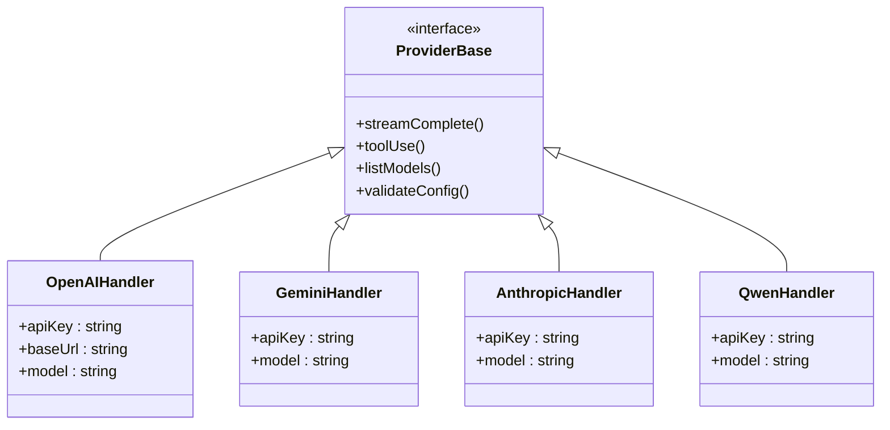
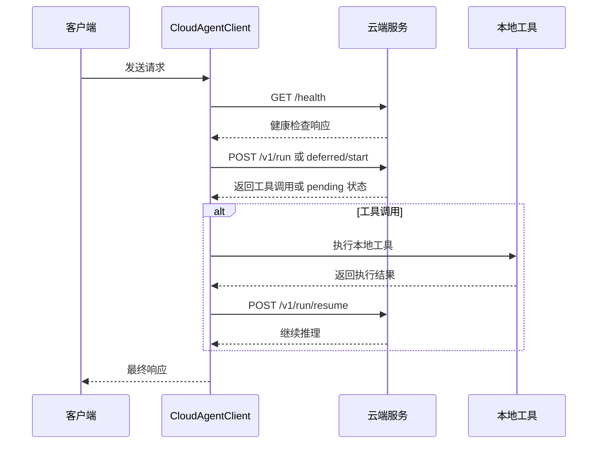
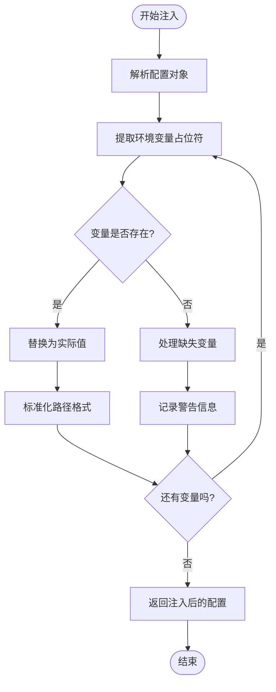

# 快速开始指南

<cite>
**本文档引用的文件**
- [package.json](file://package.json)
- [pnpm-workspace.yaml](file://pnpm-workspace.yaml)
- [README.md](file://README.md)
- [.arts/settings.json](file://.arts/settings.json)
- [.arts/launch.json](file://.arts/launch.json)
- [.arts/tasks.json](file://.arts/tasks.json)
- [scripts/bootstrap.mjs](file://scripts/bootstrap.mjs)
- [src/api/providers/index.ts](file://src/api/providers/index.ts)
- [docs/examples/cangjie-mcp.example.json](file://docs/examples/cangjie-mcp.example.json)
- [AGENTS.md](file://AGENTS.md)
- [src/utils/config.ts](file://src/utils/config.ts)
</cite>

## 目录
1. [简介](#简介)
2. [项目结构](#项目结构)
3. [核心组件](#核心组件)
4. [架构概览](#架构概览)
5. [详细组件分析](#详细组件分析)
6. [依赖分析](#依赖分析)
7. [性能考虑](#性能考虑)
8. [故障排除指南](#故障排除指南)
9. [结论](#结论)
10. [附录](#附录)

## 简介

Njust-AI 是一个基于 VS Code 的 AI 编程助手扩展，专为 NJUST 内部使用而定制。该项目提供了完整的 AI 编程辅助功能，包括：

- **多模型提供商支持**：支持 OpenAI、Anthropic、Gemini、OpenRouter、Ollama、LM Studio、DeepSeek、Qwen、Bedrock 等主流 AI 模型
- **本地/云端混合架构**：支持本地模型和云端服务的灵活配置
- **仓颉语言集成**：深度集成仓颉（Cangjie）语言工具链，包括 LSP、cjpm 任务、调试等功能
- **MCP 服务器支持**：支持 MCP（Model Context Protocol）服务器的配置和管理
- **代码索引与语义搜索**：提供智能的代码索引和语义搜索功能
- **多模式工作流**：支持 Cloud Agent、Architect、Code、Ask、Debug、Cangjie Dev、Orchestrator 等多种工作模式

## 项目结构

项目采用 monorepo 结构，使用 pnpm workspace 进行管理：



**图表来源**
- [pnpm-workspace.yaml:1-6](file://pnpm-workspace.yaml#L1-L6)
- [package.json:1-68](file://package.json#L1-L68)

**章节来源**
- [pnpm-workspace.yaml:1-6](file://pnpm-workspace.yaml#L1-L6)
- [package.json:1-68](file://package.json#L1-L68)

## 核心组件

### 环境要求

项目对 Node.js 和 pnpm 版本有严格要求：

- **Node.js**: 20.19.2
- **pnpm**: 10.8.1

这些要求确保了开发环境的一致性和构建过程的稳定性。

### 依赖管理

项目使用 pnpm workspace 进行多包管理，支持以下工作空间包：

- `src` - VS Code 扩展主体
- `webview-ui` - React 侧栏界面
- `apps/*` - 应用程序集合
- `packages/*` - 共享包

### 开发环境配置

项目提供了完整的开发环境配置，包括：

- **VS Code 配置**：预设的 settings.json 和 launch.json
- **任务配置**：自动化的构建和监视任务
- **Bootstrap 脚本**：智能的依赖安装和环境检测

**章节来源**
- [package.json:4-6](file://package.json#L4-L6)
- [package.json:50-66](file://package.json#L50-L66)
- [pnpm-workspace.yaml:1-6](file://pnpm-workspace.yaml#L1-L6)

## 架构概览

Njust-AI 采用了分层架构设计，实现了 UI、业务逻辑和服务层的有效分离：



**图表来源**
- [README.md:35-68](file://README.md#L35-L68)
- [README.md:211-215](file://README.md#L211-L215)

## 详细组件分析

### VS Code 扩展开发环境

#### 启动开发模式

要启动 VS Code 扩展开发环境，请按照以下步骤操作：

1. **克隆仓库**：
   ```bash
   git clone <repo-url>
   cd NJUST_AI
   ```

2. **安装依赖**：
   ```bash
   pnpm install
   ```

3. **启动开发模式**：
   在 VS Code 中按 `F5` 启动调试，会打开一个加载了 NJUST_AI 扩展的新窗口。

#### 开发配置详解

项目提供了完善的开发配置文件：

**launch.json 配置要点**：
- 类型：extensionHost
- 请求：launch
- 包含禁用扩展和开发路径参数
- 支持 source maps 和热重载

**tasks.json 自动化任务**：
- `watch`：同时监视 webview、bundle 和 TypeScript 编译
- `watch:webview`：React 前端开发服务器
- `watch:bundle`：ESBuild 构建监视
- `watch:tsc`：TypeScript 编译监视

**章节来源**
- [README.md:302-327](file://README.md#L302-L327)
- [.arts/launch.json:1-30](file://.arts/launch.json#L1-L30)
- [.arts/tasks.json:1-75](file://.arts/tasks.json#L1-L75)

### AI 模型提供商配置

#### 支持的模型提供商

项目支持多种 AI 模型提供商，所有提供商都通过统一的接口进行管理：



**图表来源**
- [src/api/providers/index.ts:1-33](file://src/api/providers/index.ts#L1-L33)

#### 配置示例

每个模型提供商都有特定的配置要求：

**OpenAI 配置示例**：
- API 密钥：必需
- 模型名称：如 gpt-4-turbo、gpt-3.5-turbo
- 基础 URL：可选，用于自定义端点

**Gemini 配置示例**：
- API 密钥：必需
- 模型名称：如 gemini-pro、gemini-pro-vision
- 顶点 AI 配置：可选

**Qwen 配置示例**：
- API 密钥：必需
- 模型名称：如 qwen-plus、qwen-turbo
- 兼容模式：可选

**章节来源**
- [src/api/providers/index.ts:1-33](file://src/api/providers/index.ts#L1-L33)

### MCP 服务器配置

#### MCP 服务器设置

MCP（Model Context Protocol）服务器是 Njust-AI 的重要功能组件：

**配置文件示例**：
```json
{
  "mcpServers": {
    "cangjie-sdk": {
      "disabled": false,
      "timeout": 120,
      "type": "stdio",
      "command": "node",
      "args": ["C:/path/to/your/cangjie-mcp-server/index.js"],
      "env": {
        "CANGJIE_HOME": "C:/cangjie",
        "PATH": "C:/cangjie/bin;${env:PATH}"
      },
      "alwaysAllow": [],
      "disabledTools": []
    }
  }
}
```

**配置参数说明**：
- `disabled`：是否禁用该 MCP 服务器
- `timeout`：请求超时时间（秒）
- `type`：服务器类型（stdio、tcp 等）
- `command`：启动命令
- `args`：命令参数数组
- `env`：环境变量配置
- `alwaysAllow`：始终允许的工具列表
- `disabledTools`：禁用的工具列表

**章节来源**
- [docs/examples/cangjie-mcp.example.json:1-20](file://docs/examples/cangjie-mcp.example.json#L1-L20)

### Cloud Agent 配置

#### Cloud Agent 协议

Cloud Agent 提供了云端推理和本地工具执行的混合模式：



**图表来源**
- [AGENTS.md:9-13](file://AGENTS.md#L9-L13)

**章节来源**
- [AGENTS.md:1-22](file://AGENTS.md#L1-L22)

## 依赖分析

### 项目依赖关系

```mermaid
graph TB
subgraph "开发依赖"
Turbo[turbo 2.5.6<br/>构建工具]
ESLint[eslint 9.27.0<br/>代码检查]
Prettier[prettier 3.4.2<br/>代码格式化]
Vitest[vitest 1.6.0<br/>测试框架]
end
subgraph "VS Code 扩展依赖"
VSCE[@vscode/vsce 3.3.2<br/>VSIX 打包]
OVSX[ovsx 0.10.4<br/>Open VSX 发布]
end
subgraph "构建工具"
ESBuild[esbuild 0.25.0<br/>快速构建]
TypeScript[typescript 5.8.3<br/>类型检查]
end
subgraph "配置包"
ConfigTS[@njust-ai/config-typescript<br/>TypeScript 配置]
end
Turbo --> VSCE
ESLint --> Prettier
Vitest --> TypeScript
ConfigTS --> TypeScript
```

**图表来源**
- [package.json:30-48](file://package.json#L30-L48)

### 环境变量注入机制

项目实现了强大的环境变量注入功能，支持在配置中使用环境变量：



**图表来源**
- [src/utils/config.ts:20-66](file://src/utils/config.ts#L20-L66)

**章节来源**
- [package.json:30-48](file://package.json#L30-L48)
- [src/utils/config.ts:1-67](file://src/utils/config.ts#L1-L67)

## 性能考虑

### 构建优化

项目采用了多种性能优化策略：

1. **增量构建**：使用 turbo 实现增量构建，只重新构建受影响的包
2. **并行处理**：充分利用多核 CPU 进行并行构建
3. **缓存机制**：智能缓存构建结果，减少重复工作
4. **摇树优化**：Tree-shaking 移除未使用的代码

### 内存管理

- **垃圾回收优化**：合理管理大对象的生命周期
- **内存泄漏防护**：及时清理事件监听器和定时器
- **资源池管理**：复用数据库连接和网络连接

### 网络性能

- **连接池**：数据库和 API 调用使用连接池
- **请求缓存**：频繁访问的数据进行缓存
- **批量处理**：合并多个小请求为批量请求

## 故障排除指南

### 环境配置问题

#### Node.js 版本不匹配

**问题症状**：
- 安装过程中出现版本不兼容错误
- 构建失败或运行时报错

**解决方案**：
1. 检查当前 Node.js 版本：`node -v`
2. 如果版本不正确，使用 nvm 切换到 20.19.2 版本
3. 重新安装依赖：`pnpm install`

#### pnpm 安装问题

**问题症状**：
- pnpm 无法找到或安装失败
- 依赖安装卡住

**解决方案**：
1. 检查 pnpm 是否已安装：`pnpm -v`
2. 如果未安装，使用临时安装方式：`npm install --no-save pnpm`
3. 运行 bootstrap 脚本：`node scripts/bootstrap.mjs`

#### 端口占用问题

**问题症状**：
- 开发服务器启动失败
- 端口被其他进程占用

**解决方案**：
1. 查找占用端口的进程：`netstat -ano | findstr :PORT`
2. 杀死占用进程：`taskkill /PID <PID> /F`
3. 更改配置中的端口号

### AI 模型连接问题

#### API 密钥验证失败

**问题症状**：
- 模型调用返回认证错误
- 请求被拒绝

**解决方案**：
1. 检查 API 密钥格式是否正确
2. 验证 API 密钥是否有足够的权限
3. 确认模型名称拼写正确
4. 检查网络连接和防火墙设置

#### 模型响应超时

**问题症状**：
- 请求在规定时间内无响应
- 出现超时错误

**解决方案**：
1. 增加超时时间配置
2. 检查网络连接质量
3. 尝试使用不同的模型提供商
4. 优化请求负载

### MCP 服务器问题

#### 服务器启动失败

**问题症状**：
- MCP 服务器无法启动
- 报告端口占用或权限不足

**解决方案**：
1. 检查 MCP 服务器的可执行文件路径
2. 验证环境变量配置
3. 确认端口未被占用
4. 检查防火墙设置

#### 工具调用失败

**问题症状**：
- MCP 工具调用返回错误
- 工具执行异常终止

**解决方案**：
1. 检查工具的输入参数
2. 验证工具的执行权限
3. 查看 MCP 服务器的日志输出
4. 确认工具的依赖项已正确安装

### Cloud Agent 问题

#### 健康检查失败

**问题症状**：
- Cloud Agent 无法连接到云端服务
- 健康检查返回错误

**解决方案**：
1. 验证 serverUrl 配置是否正确
2. 检查 API Key 设置
3. 确认网络连接正常
4. 查看云端服务的状态

#### 延迟协议循环问题

**问题症状**：
- deferred protocol 循环无法正常结束
- 工具调用结果无法正确返回

**解决方案**：
1. 检查工具调用的返回格式
2. 验证 workspace_ops 的配置
3. 确认最大重试次数设置合理
4. 查看详细的错误日志

**章节来源**
- [scripts/bootstrap.mjs:1-82](file://scripts/bootstrap.mjs#L1-L82)
- [AGENTS.md:7-22](file://AGENTS.md#L7-L22)

## 结论

Njust-AI 项目提供了完整的 AI 编程助手解决方案，具有以下优势：

1. **完整的开发环境**：提供了从环境搭建到开发调试的全流程支持
2. **灵活的配置系统**：支持多种 AI 模型提供商和配置选项
3. **强大的扩展性**：基于 VS Code 平台，具有丰富的扩展能力
4. **企业级特性**：支持 Cloud Agent、MCP 等企业级功能
5. **良好的开发体验**：提供了完善的开发工具和调试支持

对于新用户来说，按照本指南的步骤进行环境搭建和配置，可以在最短时间内成功运行项目并开始使用各种功能。

## 附录

### 常用命令参考

| 命令 | 功能 | 说明 |
|------|------|------|
| `pnpm install` | 安装依赖 | 安装所有项目依赖 |
| `pnpm build` | 构建项目 | 构建所有包 |
| `pnpm test` | 运行测试 | 运行单元测试 |
| `pnpm lint` | 代码检查 | 运行 ESLint 检查 |
| `pnpm format` | 代码格式化 | 运行 Prettier 格式化 |
| `pnpm vsix` | 打包 VSIX | 生成 VS Code 扩展包 |
| `pnpm clean` | 清理缓存 | 清理构建缓存 |

### 最佳实践建议

1. **版本管理**：严格遵循项目要求的 Node.js 和 pnpm 版本
2. **依赖更新**：定期更新依赖包，关注安全漏洞
3. **配置管理**：使用环境变量管理敏感配置
4. **代码规范**：遵循项目的代码风格和最佳实践
5. **测试覆盖**：保持良好的测试覆盖率
6. **文档维护**：及时更新相关文档和注释