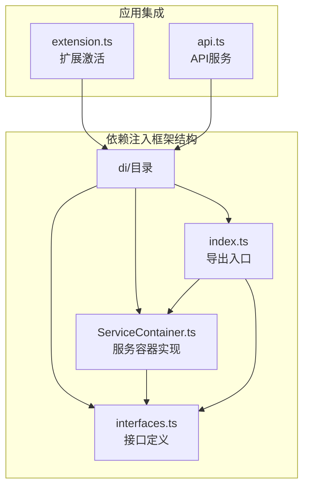
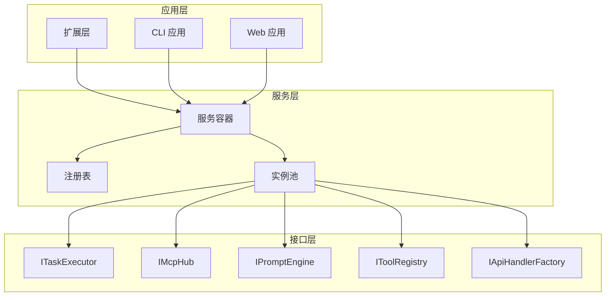
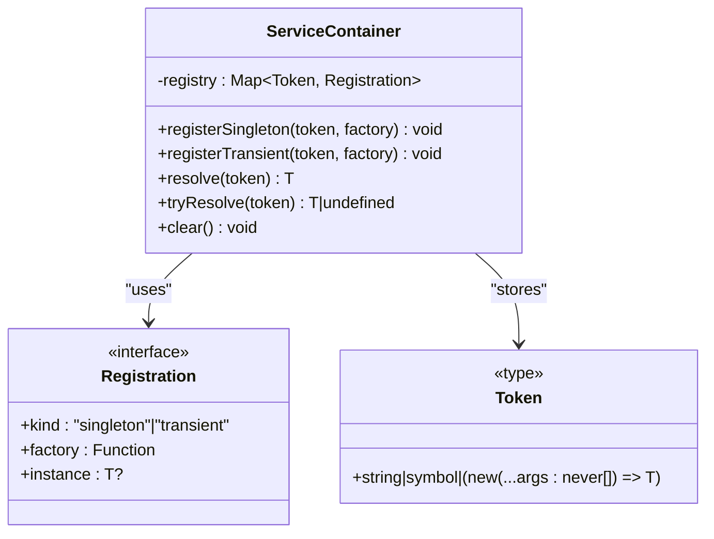
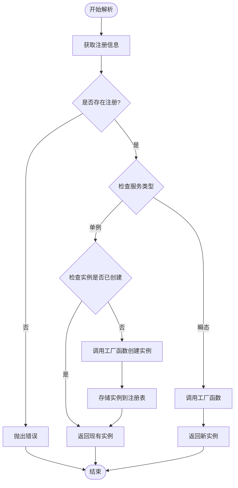
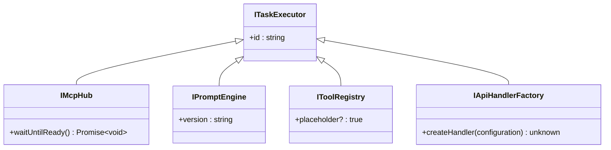
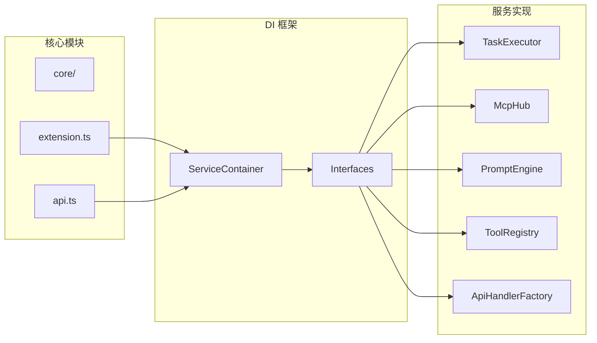

# 依赖注入框架

<cite>
**本文档引用的文件**
- [ServiceContainer.ts](file://src/core/di/ServiceContainer.ts)
- [interfaces.ts](file://src/core/di/interfaces.ts)
- [index.ts](file://src/core/di/index.ts)
- [extension.ts](file://src/extension.ts)
- [api.ts](file://src/extension/api.ts)
</cite>

## 目录
1. [简介](#简介)
2. [项目结构](#项目结构)
3. [核心组件](#核心组件)
4. [架构概览](#架构概览)
5. [详细组件分析](#详细组件分析)
6. [依赖关系分析](#依赖关系分析)
7. [性能考虑](#性能考虑)
8. [故障排除指南](#故障排除指南)
9. [结论](#结论)

## 简介

Njust-AI 项目中的依赖注入框架是一个轻量级但功能完整的控制反转容器，旨在为整个应用程序提供服务管理能力。该框架支持单例模式和瞬态模式的服务注册与解析，为项目的模块化架构提供了坚实的基础。

该依赖注入系统的设计遵循了最小实现原则，专注于提供核心的依赖管理功能，同时保持代码的简洁性和可维护性。通过类型安全的令牌系统和灵活的服务注册机制，开发者可以轻松地管理和组织应用程序中的各种服务。

## 项目结构

依赖注入框架位于 `src/core/di/` 目录下，包含以下核心文件：

**图表来源**
- [ServiceContainer.ts:1-47](file://src/core/di/ServiceContainer.ts#L1-L47)
- [interfaces.ts:1-29](file://src/core/di/interfaces.ts#L1-L29)
- [index.ts:1-9](file://src/core/di/index.ts#L1-L9)

**章节来源**
- [ServiceContainer.ts:1-47](file://src/core/di/ServiceContainer.ts#L1-L47)
- [interfaces.ts:1-29](file://src/core/di/interfaces.ts#L1-L29)
- [index.ts:1-9](file://src/core/di/index.ts#L1-L9)

## 核心组件

### ServiceContainer 类

ServiceContainer 是依赖注入框架的核心实现，提供了完整的服务注册和解析功能。

#### 主要特性

1. **类型安全的令牌系统**：支持字符串、符号和构造函数作为服务令牌
2. **双模式服务管理**：支持单例模式和瞬态模式
3. **延迟实例化**：单例服务采用延迟创建策略
4. **错误处理**：提供详细的错误信息和安全解析方法

#### 关键方法

- `registerSingleton()`: 注册单例服务
- `registerTransient()`: 注册瞬态服务  
- `resolve()`: 解析服务实例
- `tryResolve()`: 安全解析服务实例
- `clear()`: 清空注册表

**章节来源**
- [ServiceContainer.ts:10-46](file://src/core/di/ServiceContainer.ts#L10-L46)

### 接口定义系统

框架定义了多个核心接口，为不同类型的服务提供抽象层：

#### 核心接口

1. **ITaskExecutor**: 任务执行器接口
2. **IMcpHub**: MCP Hub 接口
3. **IPromptEngine**: 提示引擎接口
4. **IToolRegistry**: 工具注册表接口
5. **IApiHandlerFactory**: API 处理器工厂接口

这些接口为未来的功能扩展预留了空间，并确保了系统的可扩展性。

**章节来源**
- [interfaces.ts:6-28](file://src/core/di/interfaces.ts#L6-L28)

## 架构概览

依赖注入框架在整个应用程序中扮演着基础设施的角色，为各个模块提供统一的服务管理能力。

**图表来源**
- [ServiceContainer.ts:10-46](file://src/core/di/ServiceContainer.ts#L10-L46)
- [interfaces.ts:6-28](file://src/core/di/interfaces.ts#L6-L28)

## 详细组件分析

### ServiceContainer 实现分析

ServiceContainer 采用了简洁而高效的实现方式，通过 Map 数据结构存储服务注册信息。

#### 数据结构设计

**图表来源**
- [ServiceContainer.ts:3-19](file://src/core/di/ServiceContainer.ts#L3-L19)

#### 解析流程

**图表来源**
- [ServiceContainer.ts:21-33](file://src/core/di/ServiceContainer.ts#L21-L33)

**章节来源**
- [ServiceContainer.ts:21-33](file://src/core/di/ServiceContainer.ts#L21-L33)

### 接口系统设计

接口系统为不同类型的依赖提供了清晰的抽象边界，确保了系统的模块化和可测试性。

#### 接口层次结构

**图表来源**
- [interfaces.ts:6-28](file://src/core/di/interfaces.ts#L6-L28)

**章节来源**
- [interfaces.ts:6-28](file://src/core/di/interfaces.ts#L6-L28)

## 依赖关系分析

依赖注入框架在整个项目中的集成情况如下：

**图表来源**
- [ServiceContainer.ts:10-46](file://src/core/di/ServiceContainer.ts#L10-L46)
- [interfaces.ts:6-28](file://src/core/di/interfaces.ts#L6-L28)

### 依赖注入使用场景

虽然当前代码库中直接使用 ServiceContainer 的示例较少，但框架已经为未来的扩展做好了准备：

1. **扩展激活**: 在 `extension.ts` 中可以集成服务容器进行服务管理
2. **API 服务**: 在 `api.ts` 中可以使用容器管理 API 相关服务
3. **工具注册**: 可以通过容器管理各种工具服务
4. **配置管理**: 可以使用容器管理配置相关的服务实例

**章节来源**
- [extension.ts:125-200](file://src/extension.ts#L125-L200)
- [api.ts:31-163](file://src/extension/api.ts#L31-L163)

## 性能考虑

依赖注入框架在设计时充分考虑了性能因素：

### 内存效率
- 使用 Map 数据结构提供 O(1) 的查找性能
- 单例服务采用延迟创建，避免不必要的内存占用
- 瞬态服务直接调用工厂函数，减少额外的包装开销

### 访问性能
- 服务解析操作为常数时间复杂度
- 注册操作同样为常数时间复杂度
- 避免了反射等昂贵的操作

### 内存管理
- 单例实例在容器清空时才会被释放
- 提供了 clear() 方法用于手动内存管理
- 支持垃圾回收机制自动清理未使用的实例

## 故障排除指南

### 常见问题及解决方案

#### 1. 未注册令牌错误
**问题**: 尝试解析未注册的令牌时抛出异常
**解决方案**: 确保在解析前正确注册服务，或使用 tryResolve() 方法进行安全解析

#### 2. 服务循环依赖
**问题**: 两个或多个服务相互依赖导致初始化失败
**解决方案**: 重构服务设计，引入接口抽象或使用懒加载模式

#### 3. 单例实例状态污染
**问题**: 单例服务的状态在不同使用场景间共享
**解决方案**: 设计无状态的单例服务，或使用工厂方法创建有状态的实例

#### 4. 内存泄漏
**问题**: 服务实例无法被垃圾回收
**解决方案**: 定期调用 clear() 方法清理不再需要的服务，或在适当的生命周期结束时释放资源

**章节来源**
- [ServiceContainer.ts:23-25](file://src/core/di/ServiceContainer.ts#L23-L25)
- [ServiceContainer.ts:43-45](file://src/core/di/ServiceContainer.ts#L43-L45)

## 结论

Njust-AI 项目的依赖注入框架是一个设计精良、实现简洁的控制反转容器。它提供了必要的服务管理功能，同时保持了高度的灵活性和可扩展性。

### 主要优势

1. **简洁性**: 最小实现原则确保了代码的易理解和维护性
2. **类型安全**: 完整的 TypeScript 类型支持
3. **性能高效**: 优化的数据结构和算法
4. **扩展性强**: 为未来功能扩展预留了充足的空间

### 发展建议

1. **增强功能**: 考虑添加构造函数注入、属性注入等高级特性
2. **生命周期管理**: 添加更精细的服务生命周期控制
3. **配置支持**: 提供基于配置的服务注册机制
4. **监控能力**: 添加服务使用统计和性能监控功能

该框架为 Njust-AI 项目奠定了坚实的基础设施基础，为后续的功能扩展和技术演进提供了良好的支撑。