# 技术架构概览

<cite>
**本文档引用的文件**
- [README.md](file://README.md)
- [extension.ts](file://src/extension.ts)
- [ClineProvider.ts](file://src/core/webview/ClineProvider.ts)
- [Task.ts](file://src/core/task/Task.ts)
- [base-provider.ts](file://src/api/providers/base-provider.ts)
- [index.ts](file://src/api/index.ts)
- [McpHub.ts](file://src/services/mcp/McpHub.ts)
- [manager.ts](file://src/services/code-index/manager.ts)
- [ChatParticipantHandler.ts](file://src/chat/ChatParticipantHandler.ts)
- [webviewMessageHandler.ts](file://src/core/webview/webviewMessageHandler.ts)
- [App.tsx](file://webview-ui/src/App.tsx)
- [CloudAgentClient.ts](file://src/services/cloud-agent/CloudAgentClient.ts)
- [SkillsManager.ts](file://src/services/skills/SkillsManager.ts)
- [AGENTS.md](file://AGENTS.md)
</cite>

## 目录
1. [简介](#简介)
2. [项目结构](#项目结构)
3. [核心组件](#核心组件)
4. [架构概览](#架构概览)
5. [详细组件分析](#详细组件分析)
6. [依赖关系分析](#依赖关系分析)
7. [性能考虑](#性能考虑)
8. [故障排除指南](#故障排除指南)
9. [结论](#结论)

## 简介

Njust-AI 是一个基于 VS Code 的 AI 编程助手扩展，采用分层架构设计，实现了 Webview 与扩展宿主的分离。该系统通过统一的 AI 模型提供商抽象层，支持多种大语言模型（LLM）提供商，包括 OpenAI、Anthropic、Gemini 等主流平台。系统的核心设计理念是将用户界面与业务逻辑分离，通过消息传递机制实现组件间的松耦合通信。

## 项目结构

项目采用模块化的目录结构，主要分为以下几个核心层次：

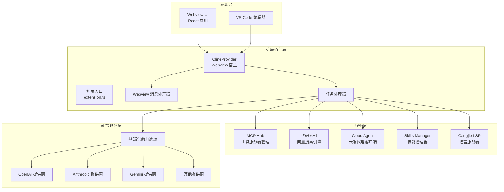

**图表来源**
- [extension.ts:95-543](file://src/extension.ts#L95-L543)
- [ClineProvider.ts:126-800](file://src/core/webview/ClineProvider.ts#L126-L800)

**章节来源**
- [README.md:346-364](file://README.md#L346-L364)
- [extension.ts:95-543](file://src/extension.ts#L95-L543)

## 核心组件

### Webview 与扩展宿主分离架构

系统采用 Webview 与扩展宿主分离的设计模式，实现了真正的进程边界隔离：

- **Webview UI**：基于 React 的用户界面，运行在独立的 Webview 进程中
- **扩展宿主**：VS Code 扩展的主进程，负责与 VS Code 生态系统交互
- **消息传递**：通过 postMessage 机制实现双向通信

这种设计的优势包括：
- 提升系统稳定性，避免 UI 崩溃影响整个扩展
- 支持热重载和独立开发
- 增强安全性，UI 层无法直接访问系统资源

### ClineProvider 与 Task 协作机制

ClineProvider 作为 Webview 的宿主，承担着全局状态管理和任务协调的重要职责：

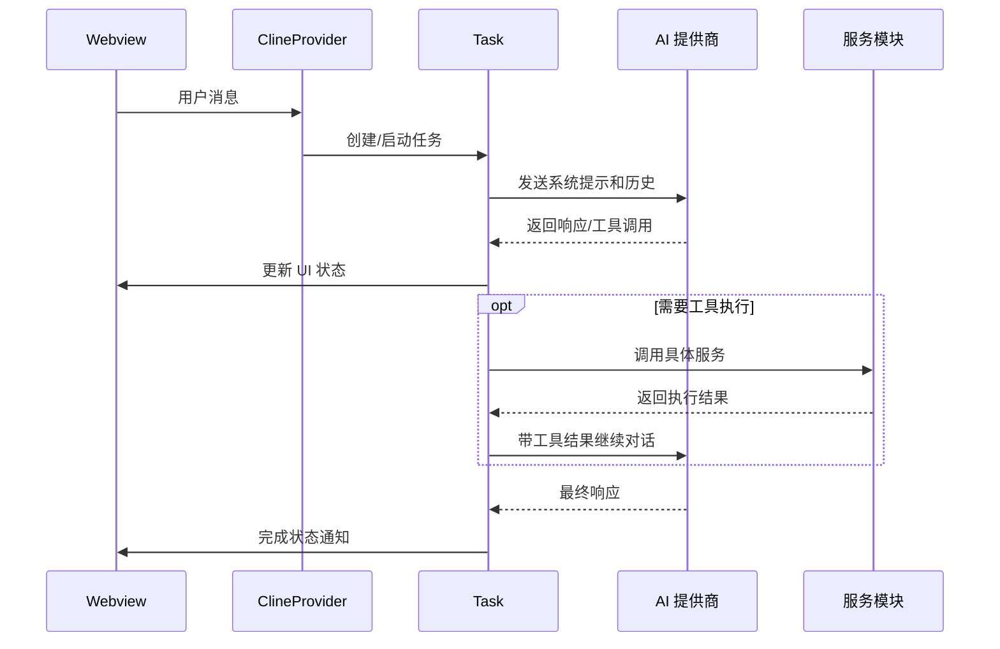

**图表来源**
- [ClineProvider.ts:374-480](file://src/core/webview/ClineProvider.ts#L374-L480)
- [Task.ts:176-200](file://src/core/task/Task.ts#L176-L200)

**章节来源**
- [ClineProvider.ts:126-800](file://src/core/webview/ClineProvider.ts#L126-L800)
- [Task.ts:176-200](file://src/core/task/Task.ts#L176-L200)

## 架构概览

### 运行时逻辑分层

系统采用清晰的分层架构，从进程边界到功能模块都有明确的职责划分：

```mermaid
flowchart TB
subgraph "呈现层"
W[Webview UI<br/>React 组件]
VSC[VS Code 编辑器<br/>内置 Chat]
end
subgraph "扩展宿主层"
CP[ClineProvider<br/>Webview 宿主]
TH[Webview 消息处理器]
TK[Task<br/>任务管理器]
end
subgraph "服务层"
MCP[MCP Hub<br/>工具服务器]
IDX[代码索引<br/>向量搜索]
CA[Cloud Agent<br/>云端代理]
SK[Skills Manager<br/>技能管理]
CJ[Cangjie LSP<br/>语言服务]
OTH[其他服务<br/>终端、检查点等]
end
subgraph "AI 提供商层"
PR[AI 提供商抽象层]
end
W < --> |"postMessage"| CP
CP --> TH
TH --> TK
TK --> PR
TK --> MCP
TK --> IDX
TK --> CA
TK --> SK
TK --> CJ
TK --> OTH
VSC --> |"LM 工具/参与者"| TK
```

**图表来源**
- [README.md:37-68](file://README.md#L37-L68)
- [extension.ts:240-272](file://src/extension.ts#L240-L272)

### 本地模型模式对话流程

在本地模型模式下，系统实现了完整的工具调用闭环：

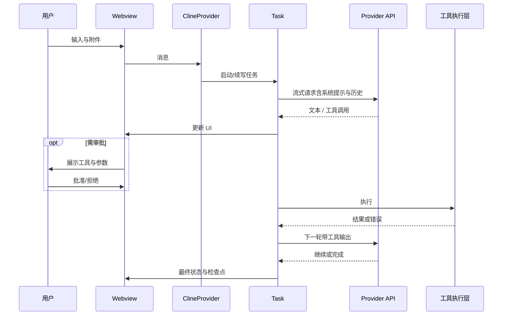

**图表来源**
- [README.md:74-97](file://README.md#L74-L97)

**章节来源**
- [README.md:33-97](file://README.md#L33-L97)

## 详细组件分析

### AI 模型提供商统一抽象层

系统通过统一的抽象层实现了对多家 AI 提供商的支持：

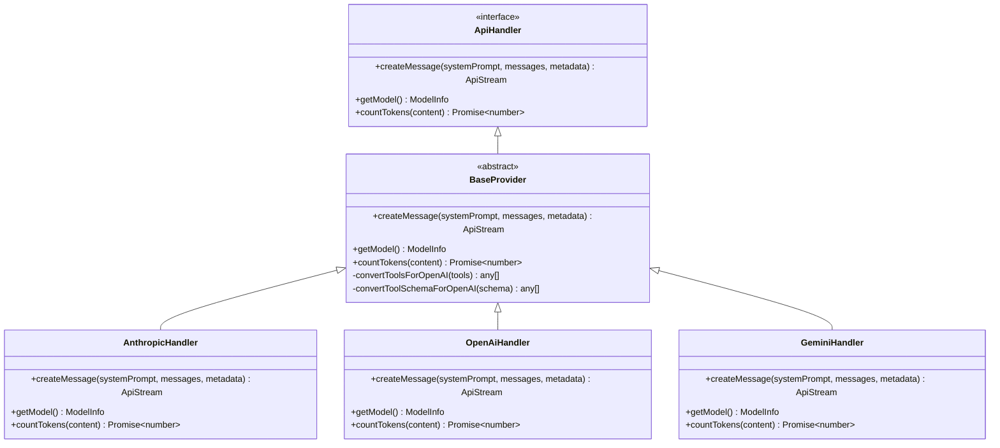

**图表来源**
- [base-provider.ts:13-123](file://src/api/providers/base-provider.ts#L13-L123)
- [index.ts:94-192](file://src/api/index.ts#L94-L192)

**章节来源**
- [base-provider.ts:13-123](file://src/api/providers/base-provider.ts#L13-L123)
- [index.ts:114-192](file://src/api/index.ts#L114-L192)

### MCP 子系统架构

MCP（Model Context Protocol）子系统提供了强大的工具执行能力：

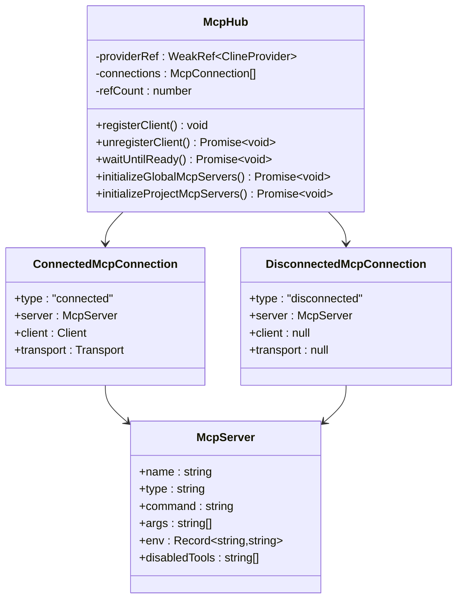

**图表来源**
- [McpHub.ts:151-200](file://src/services/mcp/McpHub.ts#L151-L200)

**章节来源**
- [McpHub.ts:151-200](file://src/services/mcp/McpHub.ts#L151-L200)

### 代码索引与语义搜索

系统实现了完整的代码索引和语义搜索功能：

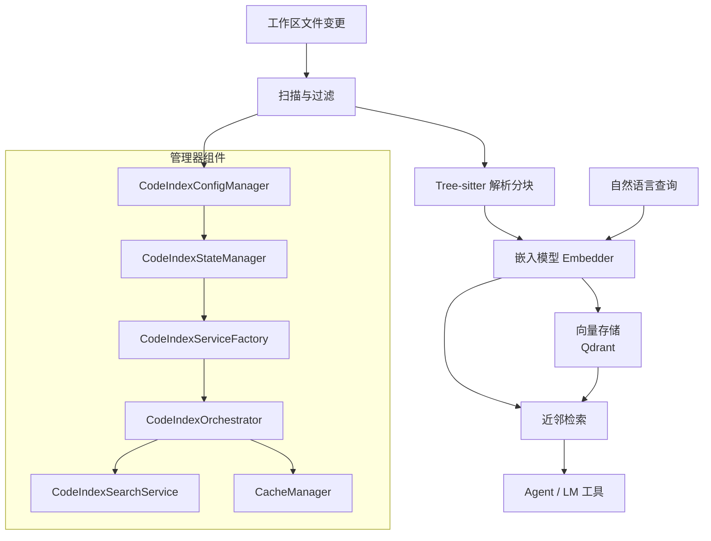

**图表来源**
- [README.md:131-141](file://README.md#L131-L141)
- [manager.ts:18-200](file://src/services/code-index/manager.ts#L18-L200)

**章节来源**
- [README.md:127-141](file://README.md#L127-L141)
- [manager.ts:18-200](file://src/services/code-index/manager.ts#L18-L200)

### Cloud Agent 子系统

Cloud Agent 实现了云端推理与本地工具执行的混合架构：

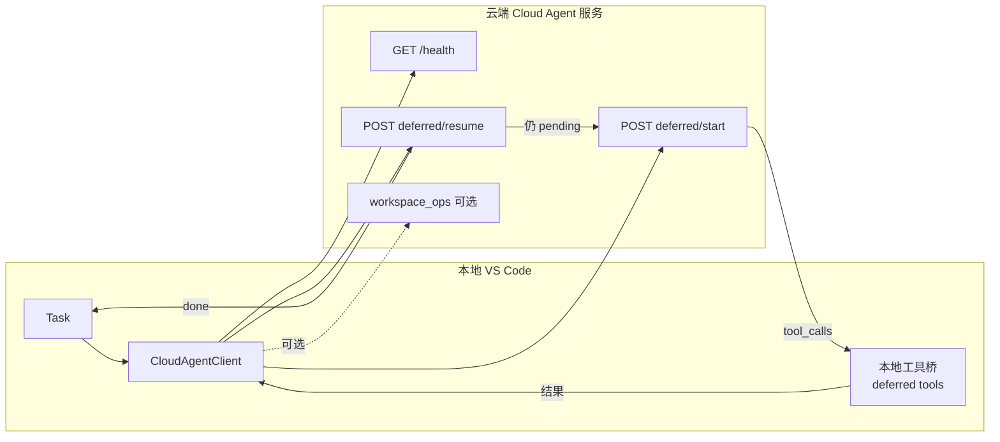

**图表来源**
- [README.md:103-125](file://README.md#L103-L125)
- [CloudAgentClient.ts:43-200](file://src/services/cloud-agent/CloudAgentClient.ts#L43-L200)

**章节来源**
- [README.md:99-125](file://README.md#L99-L125)
- [CloudAgentClient.ts:43-200](file://src/services/cloud-agent/CloudAgentClient.ts#L43-L200)
- [AGENTS.md:9-13](file://AGENTS.md#L9-L13)

### Skills 子系统

Skills Manager 提供了灵活的技能管理机制：

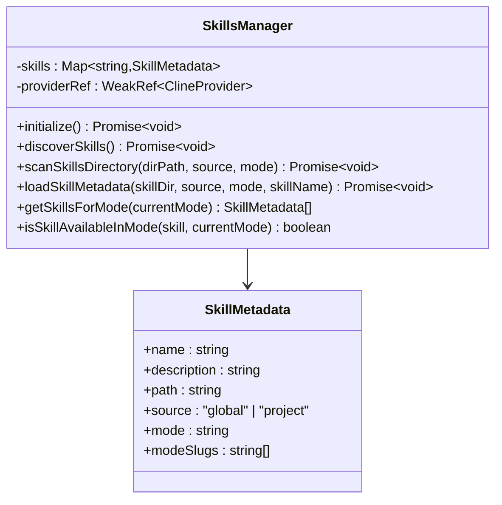

**图表来源**
- [SkillsManager.ts:22-200](file://src/services/skills/SkillsManager.ts#L22-L200)

**章节来源**
- [SkillsManager.ts:22-200](file://src/services/skills/SkillsManager.ts#L22-L200)

## 依赖关系分析

### 组件耦合度分析

系统采用了低耦合的设计原则，通过接口和抽象层实现模块间的松散耦合：

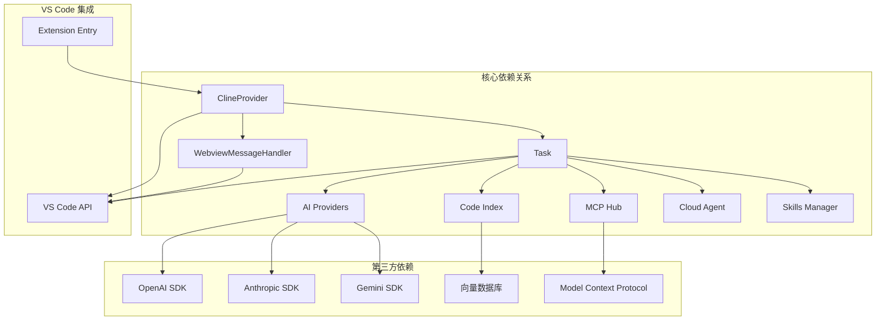

**图表来源**
- [extension.ts:240-272](file://src/extension.ts#L240-L272)
- [ClineProvider.ts:91-105](file://src/core/webview/ClineProvider.ts#L91-L105)

**章节来源**
- [extension.ts:240-272](file://src/extension.ts#L240-L272)
- [ClineProvider.ts:91-105](file://src/core/webview/ClineProvider.ts#L91-L105)

### 数据流与控制流

系统的数据流遵循严格的单向原则，确保状态的一致性和可预测性：

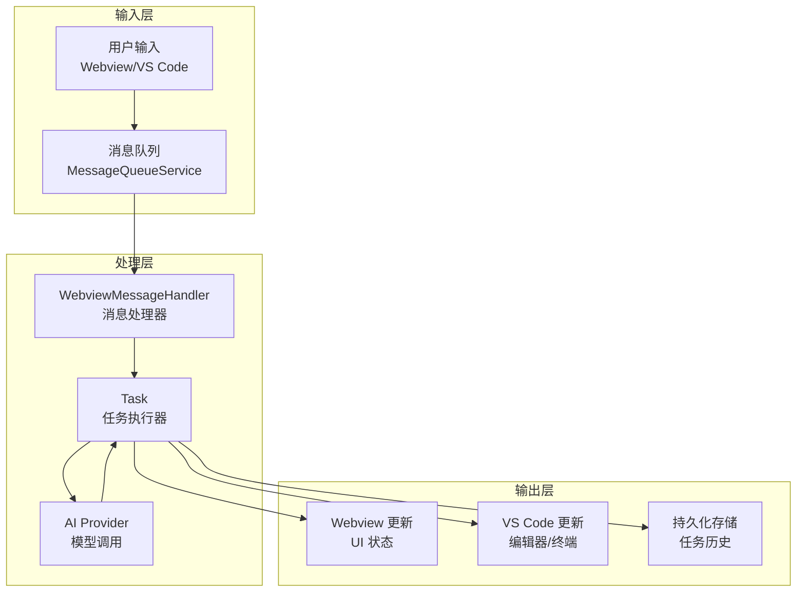

**图表来源**
- [webviewMessageHandler.ts:81-200](file://src/core/webview/webviewMessageHandler.ts#L81-L200)
- [Task.ts:176-200](file://src/core/task/Task.ts#L176-L200)

## 性能考虑

### 进程边界优化

系统通过 Webview 与扩展宿主的分离，实现了以下性能优化：

- **内存隔离**：UI 进程崩溃不会影响扩展宿主
- **CPU 隔离**：复杂的 UI 计算不影响 VS Code 主进程
- **垃圾回收优化**：独立的 GC 周期减少内存碎片

### 缓存策略

系统实现了多层次的缓存机制：

- **模型列表缓存**：避免频繁的 API 调用
- **工具调用结果缓存**：减少重复计算
- **向量索引缓存**：提升代码搜索性能
- **配置状态缓存**：降低状态同步开销

### 异步处理

所有耗时操作都采用异步处理模式：

- **非阻塞 UI**：保持界面响应性
- **并发执行**：多个任务可以并行处理
- **背压控制**：防止系统过载

## 故障排除指南

### 常见问题诊断

#### Webview 通信问题

当 Webview 无法接收消息时，检查以下要点：

1. **消息序列化**：确保消息对象可正确序列化
2. **事件监听器**：确认消息处理器已正确注册
3. **进程状态**：验证 Webview 进程是否正常运行

#### AI 提供商连接问题

针对不同提供商的连接问题：

1. **API 密钥验证**：检查密钥格式和权限
2. **网络连接**：确认防火墙和代理设置
3. **速率限制**：监控 API 调用频率

#### MCP 工具执行失败

MCP 工具执行失败的排查步骤：

1. **服务器状态**：检查 MCP 服务器是否在线
2. **工具权限**：验证工具调用权限
3. **参数验证**：确认工具参数格式正确

**章节来源**
- [webviewMessageHandler.ts:81-200](file://src/core/webview/webviewMessageHandler.ts#L81-L200)
- [ClineProvider.ts:570-620](file://src/core/webview/ClineProvider.ts#L570-L620)

### 错误处理策略

系统采用分级的错误处理策略：

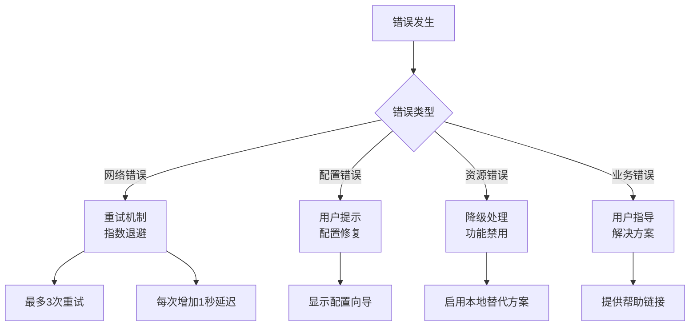

## 结论

Njust-AI 项目展现了现代 VS Code 扩展的最佳实践，通过精心设计的分层架构和模块化组件，实现了高度的可维护性和扩展性。系统的核心优势包括：

1. **架构清晰**：Webview 与扩展宿主分离，职责明确
2. **抽象统一**：AI 提供商抽象层支持多家平台
3. **服务解耦**：各服务模块独立部署，便于维护
4. **用户体验**：流畅的交互和完善的错误处理

这种设计为后续的功能扩展和技术演进奠定了坚实的基础，是一个值得学习的优秀开源项目架构案例。