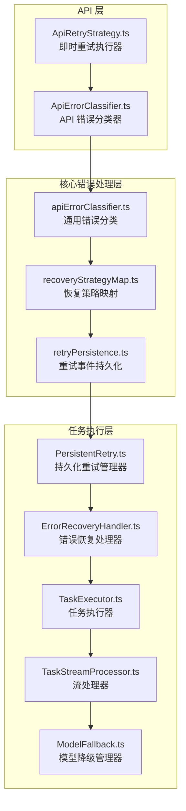
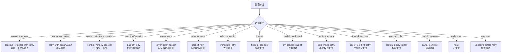
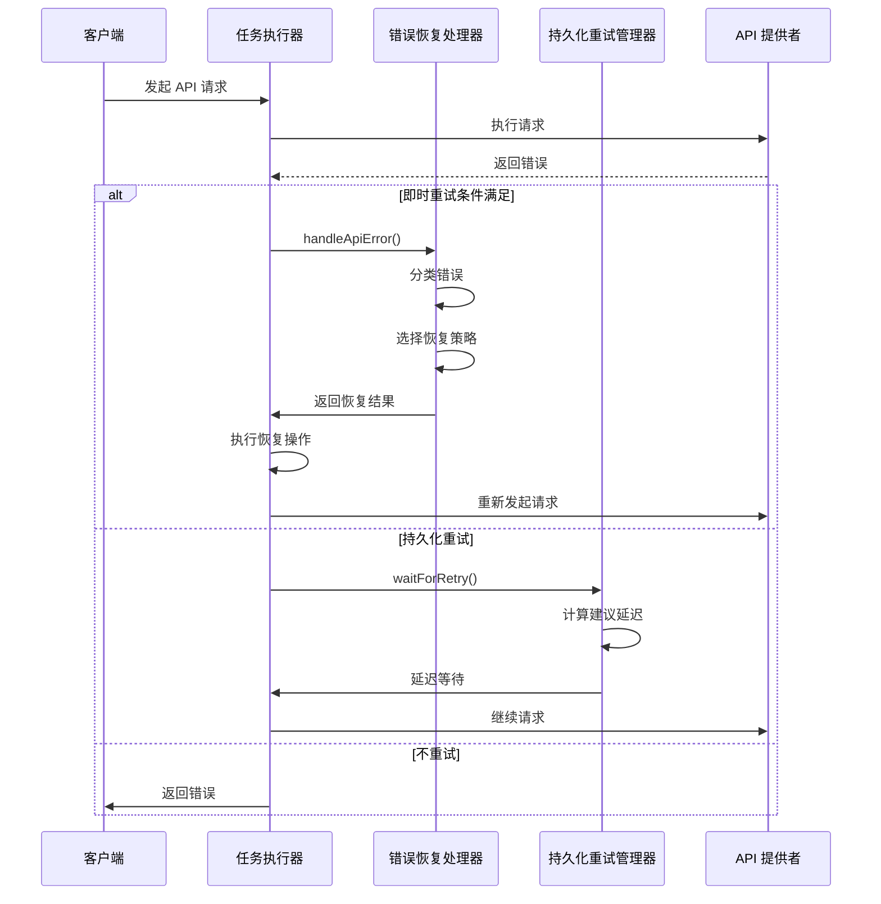
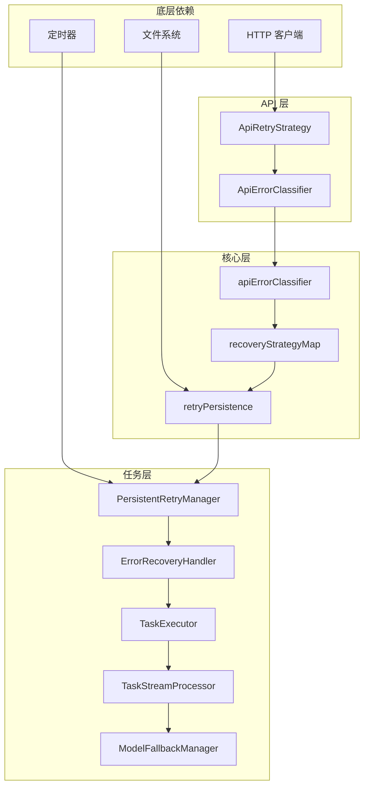

# 重试机制系统

<cite>
**本文档引用的文件**
- [ApiRetryStrategy.ts](file://src/api/retry/ApiRetryStrategy.ts)
- [ApiErrorClassifier.ts](file://src/api/retry/ApiErrorClassifier.ts)
- [apiErrorClassifier.ts](file://src/core/errors/apiErrorClassifier.ts)
- [recoveryStrategyMap.ts](file://src/core/errors/recoveryStrategyMap.ts)
- [retryPersistence.ts](file://src/core/errors/retryPersistence.ts)
- [PersistentRetry.ts](file://src/core/task/PersistentRetry.ts)
- [ErrorRecoveryHandler.ts](file://src/core/task/ErrorRecoveryHandler.ts)
- [TaskExecutor.ts](file://src/core/task/TaskExecutor.ts)
- [TaskStreamProcessor.ts](file://src/core/task/TaskStreamProcessor.ts)
- [ModelFallback.ts](file://src/core/task/ModelFallback.ts)
- [retryPersistence.spec.ts](file://src/core/errors/__tests__/retryPersistence.spec.ts)
- [grace-retry-errors.spec.ts](file://src/core/task/__tests__/grace-retry-errors.spec.ts)
</cite>

## 目录
1. [简介](#简介)
2. [项目结构](#项目结构)
3. [核心组件](#核心组件)
4. [架构概览](#架构概览)
5. [详细组件分析](#详细组件分析)
6. [依赖关系分析](#依赖关系分析)
7. [性能考虑](#性能考虑)
8. [故障排除指南](#故障排除指南)
9. [结论](#结论)

## 简介

重试机制系统是 Njust-AI AI 助手的核心基础设施，负责处理 API 调用失败、网络错误和各种异常情况。该系统采用分层设计，结合了即时重试、持久化重试管理和智能错误分类等多种策略，确保在面对不稳定网络环境和 API 服务波动时仍能提供可靠的用户体验。

系统主要包含三个层面的重试机制：
- **即时重试层**：基于指数退避算法的快速重试
- **持久化重试层**：跨会话的任务级重试状态管理
- **智能恢复层**：针对不同类型错误的专门恢复策略

## 项目结构

重试机制系统分布在以下关键目录中：



**图表来源**
- [ApiRetryStrategy.ts:1-90](file://src/api/retry/ApiRetryStrategy.ts#L1-L90)
- [apiErrorClassifier.ts:1-98](file://src/core/errors/apiErrorClassifier.ts#L1-L98)
- [recoveryStrategyMap.ts:1-122](file://src/core/errors/recoveryStrategyMap.ts#L1-L122)
- [PersistentRetry.ts:1-287](file://src/core/task/PersistentRetry.ts#L1-L287)

## 核心组件

### 即时重试执行器 (ApiRetryExecutor)

即时重试执行器提供了基础的指数退避重试功能，支持可选的 Retry-After 头部处理和抖动机制。

**关键特性：**
- 指数退避延迟计算
- 可配置的最大重试次数
- 支持 HTTP Retry-After 头部
- 随机抖动避免雪崩效应
- 回调函数支持重试进度监控

**默认配置：**
- 最大重试次数：4次
- 基础延迟：1秒
- 最大延迟：60秒
- 抖动比例：10%

**图表来源**
- [ApiRetryStrategy.ts:11-16](file://src/api/retry/ApiRetryStrategy.ts#L11-L16)

### 错误分类系统

系统实现了两级错误分类机制：

#### API 错误分类 (ApiErrorCategory)
基于 HTTP 状态码的快速分类：
- `retryable_network`：网络相关错误
- `rate_limited`：速率限制错误 (429)
- `server_error`：服务器错误 (5xx)
- `client_error`：客户端错误 (4xx)
- `unknown`：未知错误

#### 通用错误分类 (ApiErrorKind)
更详细的错误类型识别，包括：
- 内容格式错误：`prompt_too_long`, `media_too_large`, `content_policy`
- 上下文限制：`context_window_exceeded`, `max_output_tokens`
- 认证错误：`auth_error`
- 速率限制：`rate_limit`, `capacity`
- 模型可用性：`model_overloaded`, `model_unavailable`
- 连接错误：`network_error`, `stale_connection`, `timeout`

**图表来源**
- [ApiErrorClassifier.ts:6-12](file://src/api/retry/ApiErrorClassifier.ts#L6-L12)
- [apiErrorClassifier.ts:1-20](file://src/core/errors/apiErrorClassifier.ts#L1-L20)

### 恢复策略映射

根据错误类型映射到相应的恢复动作：



**图表来源**
- [recoveryStrategyMap.ts:41-102](file://src/core/errors/recoveryStrategyMap.ts#L41-L102)

### 持久化重试管理器

持久化重试管理器提供跨会话的重试状态跟踪：

**核心功能：**
- 会话级重试计数器
- 分类级重试限制
- 自动重置机制
- 建议延迟计算
- 取消支持

**配置参数：**
- 总重试限制：30次
- 分类重试限制：按错误类型定制
- 重置窗口：5分钟
- 基础延迟：1-5秒不等

**图表来源**
- [PersistentRetry.ts:30-48](file://src/core/task/PersistentRetry.ts#L30-L48)

## 架构概览

重试机制系统的整体架构采用分层设计，确保不同层面的重试策略能够协同工作：



**图表来源**
- [TaskExecutor.ts:540-613](file://src/core/task/TaskExecutor.ts#L540-L613)
- [ErrorRecoveryHandler.ts:36-208](file://src/core/task/ErrorRecoveryHandler.ts#L36-L208)

## 详细组件分析

### 错误恢复处理器 (ErrorRecoveryHandler)

错误恢复处理器是整个重试系统的核心协调器，负责：

**主要职责：**
1. **错误分类**：使用 `classifyApiError` 对错误进行精确分类
2. **策略选择**：基于 `mapErrorToRecoveryAction` 选择合适的恢复策略
3. **状态记录**：通过 `appendRetryEvent` 记录重试事件
4. **上下文管理**：处理上下文压缩和消息历史修改
5. **用户交互**：与用户进行必要的确认和通知

**恢复动作详解：**

#### 上下文恢复策略
- **reactive_compact_then_retry**：对提示过长的错误，先进行上下文压缩再重试
- **retry_with_continuation**：对输出令牌限制错误，添加继续提示后重试
- **context_window_recover**：对上下文窗口超限错误，执行上下文恢复

#### 连接稳定性策略
- **immediate_retry**：对陈旧连接错误，立即重试而不消耗重试配额
- **backoff_retry**：对一般网络错误和速率限制，执行指数退避
- **server_error_backoff**：对服务器错误，执行更严格的退避策略

#### 智能内容处理
- **strip_media_retry**：对媒体过大错误，移除大尺寸媒体内容后重试
- **inject_tool_hint_retry**：对工具调用格式错误，注入修正提示后重试
- **partial_continue**：对部分响应错误，发送继续请求恢复生成

**图表来源**
- [ErrorRecoveryHandler.ts:61-208](file://src/core/task/ErrorRecoveryHandler.ts#L61-L208)

### 持久化重试管理器 (PersistentRetryManager)

持久化重试管理器提供高级的重试控制能力：

**状态管理：**
- `records`：按错误类型跟踪重试统计
- `totalRetries`：会话总重试次数
- `lastErrorTime`：最后错误时间戳
- `cancelled`：取消标志

**延迟计算算法：**
```
建议延迟 = 基础延迟 × 2^重试次数
```

其中基础延迟根据错误类型设置：
- `rate_limit`：2秒
- `model_overloaded`：5秒  
- `timeout`：2秒
- `server_error`：2秒
- 其他：1秒

**自动重置机制：**
如果在 `resetWindowMs`（默认5分钟）内没有发生错误，自动重置所有计数器。

**图表来源**
- [PersistentRetry.ts:177-179](file://src/core/task/PersistentRetry.ts#L177-L179)

### 重试事件持久化

系统提供完整的重试事件追踪功能：

**数据结构：**
```typescript
type RetryEvent = {
  taskId: string                    // 任务ID
  retryAttempt: number             // 重试次数
  errorKind: string               // 错误类型
  errorMessage?: string           // 错误消息
  timestamp: number               // 时间戳
  backoffSeconds?: number         // 退避秒数
}
```

**存储机制：**
- 文件位置：`{taskDir}/retry-events.json`
- 最大事件数量：200条
- 自动清理：超出限制时保留最新的事件

**使用场景：**
- 故障诊断和分析
- 用户反馈和报告
- 性能监控和优化

**图表来源**
- [retryPersistence.ts:6-13](file://src/core/errors/retryPersistence.ts#L6-L13)

## 依赖关系分析

重试机制系统的依赖关系呈现清晰的层次结构：



**图表来源**
- [TaskExecutor.ts:62-63](file://src/core/task/TaskExecutor.ts#L62-L63)
- [ErrorRecoveryHandler.ts:1-3](file://src/core/task/ErrorRecoveryHandler.ts#L1-L3)

**依赖分析：**
- **低耦合设计**：各层之间通过接口通信，减少直接依赖
- **单一职责**：每层专注于特定的重试功能
- **可扩展性**：新错误类型和恢复策略易于添加
- **可测试性**：模块化设计便于单元测试

## 性能考虑

### 指数退避优化

系统采用多种策略优化重试性能：

**抖动机制：**
- 随机抖动 ±10% 避免同步重试
- 减少服务端压力峰值
- 提高整体系统稳定性

**智能退避：**
- 基于错误类型的差异化退避时间
- 429 速率限制优先使用 Retry-After 头部
- 最大退避时间限制防止无限等待

### 内存管理

**事件存储优化：**
- 限制重试事件数量（200条）
- 自动清理过期事件
- 异步文件写入避免阻塞

**状态跟踪：**
- 按需创建和销毁重试管理器
- 自动重置机制防止内存泄漏
- 最大重试次数限制防止资源耗尽

### 并发控制

**任务隔离：**
- 每个任务独立的重试状态
- 避免跨任务干扰
- 支持并行任务同时重试

**资源保护：**
- 取消信号支持
- 超时机制
- 资源清理保证

## 故障排除指南

### 常见问题诊断

**问题1：重试循环无法停止**
- 检查 `maxTotalRetries` 和分类重试限制
- 验证错误分类准确性
- 查看持久化重试状态

**问题2：重试延迟过长**
- 检查指数退避配置
- 验证 Retry-After 头部处理
- 确认服务端实际延迟

**问题3：重试事件丢失**
- 检查文件权限和存储路径
- 验证异步写入完成
- 查看事件清理逻辑

### 调试工具

**重试事件查询：**
```typescript
// 读取指定任务的重试事件
const events = await readRetryEvents(globalStoragePath, taskId);
console.log('重试事件:', events);
```

**状态监控：**
```typescript
// 获取持久化重试统计
const stats = persistentRetryManager.getStats();
console.log('重试统计:', stats);
```

**测试验证：**
- 使用单元测试验证错误分类准确性
- 集成测试验证完整重试流程
- 性能测试验证退避算法效果

**章节来源**
- [retryPersistence.spec.ts:1-29](file://src/core/errors/__tests__/retryPersistence.spec.ts#L1-L29)
- [grace-retry-errors.spec.ts:280-352](file://src/core/task/__tests__/grace-retry-errors.spec.ts#L280-L352)

## 结论

重试机制系统通过分层设计和智能策略实现了高可靠性的 API 调用处理。系统的主要优势包括：

**技术优势：**
- 多层次重试策略确保不同类型的错误得到适当处理
- 智能错误分类提高恢复准确性
- 持久化状态管理提供跨会话的重试能力
- 完善的监控和调试工具支持

**用户体验：**
- 减少因临时网络问题导致的失败
- 提供渐进式的错误恢复体验
- 透明的重试过程让用户了解系统状态
- 智能降级避免长时间等待

**可维护性：**
- 模块化设计便于扩展和维护
- 清晰的错误分类体系
- 完整的测试覆盖
- 良好的文档和注释

该系统为 Njust-AI AI 助手提供了坚实的基础设施，确保在复杂多变的生产环境中仍能保持稳定的性能表现。