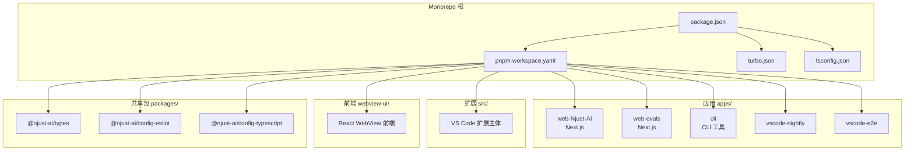
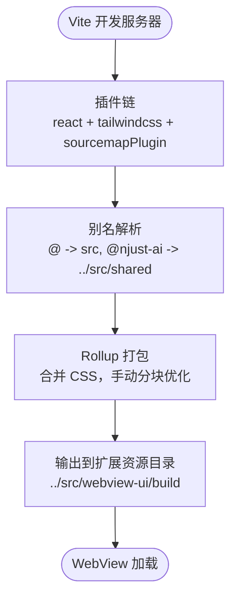
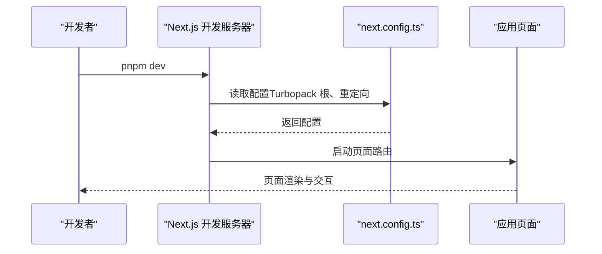
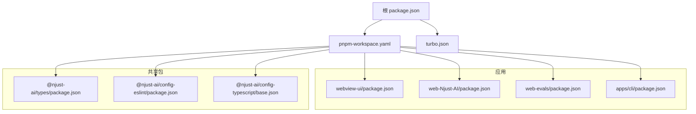

# 技术栈与依赖

<cite>
**本文引用的文件**
- [package.json](file://package.json)
- [pnpm-workspace.yaml](file://pnpm-workspace.yaml)
- [turbo.json](file://turbo.json)
- [tsconfig.json](file://tsconfig.json)
- [README.md](file://README.md)
- [packages/config-typescript/base.json](file://packages/config-typescript/base.json)
- [packages/config-eslint/package.json](file://packages/config-eslint/package.json)
- [apps/web-Njust-AI/package.json](file://apps/web-Njust-AI/package.json)
- [apps/web-Njust-AI/next.config.ts](file://apps/web-Njust-AI/next.config.ts)
- [apps/web-evals/package.json](file://apps/web-evals/package.json)
- [webview-ui/package.json](file://webview-ui/package.json)
- [webview-ui/vite.config.ts](file://webview-ui/vite.config.ts)
- [apps/cli/package.json](file://apps/cli/package.json)
- [apps/cli/tsup.config.ts](file://apps/cli/tsup.config.ts)
- [packages/types/package.json](file://packages/types/package.json)
</cite>

## 目录
1. [简介](#简介)
2. [项目结构](#项目结构)
3. [核心组件](#核心组件)
4. [架构总览](#架构总览)
5. [详细组件分析](#详细组件分析)
6. [依赖分析](#依赖分析)
7. [性能考虑](#性能考虑)
8. [故障排查指南](#故障排查指南)
9. [结论](#结论)
10. [附录](#附录)

## 简介
本文件系统性梳理 Njust-AI 项目的整体技术栈与依赖，涵盖 TypeScript/JavaScript、React/Next.js、VS Code 扩展开发、Monorepo 架构与 Turbo 构建系统等。文档同时说明关键技术选型原因、版本要求与配置要点，列举关键第三方依赖库及其作用，并提供学习路径与参考资料。

## 项目结构
Njust-AI 采用 pnpm workspaces + Turbo 的 Monorepo 架构，核心目录与职责如下：
- apps：多应用入口
  - web-Njust-AI：Next.js 官网首页与内容站点
  - web-evals：Next.js 评测与实验页面
  - cli：命令行工具（打包为可执行二进制）
  - vscode-nightly：VS Code 扩展夜版构建配置
  - vscode-e2e：VS Code 扩展端到端测试
- src：VS Code 扩展主体（包含 API、核心引擎、服务层、UI 等）
- webview-ui：React 侧栏/WebView 前端（与扩展宿主通信）
- packages：共享包
  - types：跨包共享类型定义
  - config-eslint / config-typescript：统一 ESLint 与 TS 配置
  - 其他工具包（如 build、telemetry 等）
- 根目录配置：package.json、pnpm-workspace.yaml、turbo.json、tsconfig.json 等



**图表来源**
- [pnpm-workspace.yaml:1-6](file://pnpm-workspace.yaml#L1-L6)
- [package.json:1-68](file://package.json#L1-L68)

**章节来源**
- [README.md:346-364](file://README.md#L346-L364)
- [pnpm-workspace.yaml:1-6](file://pnpm-workspace.yaml#L1-L6)
- [package.json:1-68](file://package.json#L1-L68)

## 核心组件
- TypeScript/JavaScript
  - 统一使用严格 TS 配置，目标 ES2022，启用 NodeNext 模块解析与严格模式，确保类型安全与跨平台一致性。
  - 根 tsconfig 继承共享配置，确保所有包一致的编译选项。
- VS Code 扩展主体
  - 包含 API 提供商适配、任务引擎、消息管线、服务层（MCP、Cloud Agent、代码索引、Skills、仓颉 LSP 等）与对外 API。
- React/Next.js 前端
  - webview-ui：React + Vite，构建为扩展内嵌 WebView 资源。
  - web-Njust-AI：Next.js 16，TailwindCSS，Radix UI，用于官网与内容站点。
  - web-evals：Next.js 评测页面，集成表单、图表与 Redis 等。
- CLI 工具
  - 基于 Ink/React CLI，打包为可执行二进制，提供命令行交互与集成测试能力。
- 共享包
  - types：跨包共享类型定义，支持 ESM/CJS 双导出。
  - config-eslint / config-typescript：统一 ESLint 与 TS 配置，保证风格与类型检查一致性。

**章节来源**
- [tsconfig.json:1-10](file://tsconfig.json#L1-L10)
- [packages/config-typescript/base.json:1-21](file://packages/config-typescript/base.json#L1-L21)
- [webview-ui/package.json:1-111](file://webview-ui/package.json#L1-L111)
- [apps/web-Njust-AI/package.json:1-62](file://apps/web-Njust-AI/package.json#L1-L62)
- [apps/web-evals/package.json:1-64](file://apps/web-evals/package.json#L1-L64)
- [apps/cli/package.json:1-51](file://apps/cli/package.json#L1-L51)
- [packages/types/package.json:1-37](file://packages/types/package.json#L1-L37)

## 架构总览
Njust-AI 的运行时逻辑分层清晰：Webview 与扩展宿主分离，宿主内 ClineProvider/Task 串联 UI、模型与各类服务。AI 模型通过统一抽象接入多家提供商，服务层包含 MCP、代码索引、Cloud Agent、Skills、仓颉 LSP 等。

```mermaid
flowchart TB
subgraph "呈现层"
W["webview-uiReact"]
VSC["VS Code：编辑器·终端·内置 Chat"]
end
subgraph "扩展宿主"
CP["ClineProvider"]
TH["webviewMessageHandler"]
TK["Task"]
PR["api/providers"]
end
subgraph "服务层"
MCP["McpHub · RooToolsMcpServer"]
IDX["code-index · tree-sitter"]
CA["cloud-agent"]
SK["SkillsManager"]
CJ["cangjie-lsp · cjpm · debug"]
OTH["checkpoints · run-code · web-search"]
end
W < --> |"postMessage"| CP
CP --> TH
TH --> TK
TK --> PR
TK --> MCP
TK --> IDX
TK --> CA
TK --> SK
TK --> CJ
TK --> OTH
VSC --> |"LM Tools / Participant"| TK
```

**图表来源**
- [README.md:35-68](file://README.md#L35-L68)

**章节来源**
- [README.md:33-68](file://README.md#L33-L68)

## 详细组件分析

### TypeScript/JavaScript 配置与类型系统
- 编译目标与模块解析
  - 目标 ES2022，模块解析 NodeNext，严格模式，启用 DOM/Iterable 类库，提升浏览器与 Node 环境兼容性。
- 类型与声明
  - 启用声明生成与映射，严格访问索引，提升类型安全性。
- 与工作空间集成
  - 根 tsconfig 继承共享 TS 配置，确保所有包一致的编译行为。

**章节来源**
- [packages/config-typescript/base.json:1-21](file://packages/config-typescript/base.json#L1-L21)
- [tsconfig.json:1-10](file://tsconfig.json#L1-L10)

### VS Code 扩展前端（webview-ui）
- 技术栈
  - React 18、Vite、TailwindCSS、Radix UI、VS Code Toolkit、Mermaid、Shiki、React Query 等。
- 构建与打包
  - 使用 Vite 构建，生成 Source Map，合并 CSS，手动分块优化大型依赖（如 mermaid 生态）。
  - 定义全局常量（包名、版本、Git SHA），区分 Nightly 构建。
- 开发体验
  - HMR、CORS 放通、端口持久化插件，便于与扩展宿主联调。



**图表来源**
- [webview-ui/vite.config.ts:55-199](file://webview-ui/vite.config.ts#L55-L199)

**章节来源**
- [webview-ui/package.json:1-111](file://webview-ui/package.json#L1-L111)
- [webview-ui/vite.config.ts:1-199](file://webview-ui/vite.config.ts#L1-L199)

### Next.js 应用（web-Njust-AI 与 web-evals）
- web-Njust-AI
  - Next.js 16，TailwindCSS，Radix UI，Framer Motion，Zod，PostHog，Next Themes 等。
  - 配置 Turbopack 根路径，启用重定向（www 到非 www、HTTP 到 HTTPS、特定路径跳转）。
- web-evals
  - Next.js 评测页面，集成表单、图表、Redis、归档等能力，提供服务健康检查脚本。



**图表来源**
- [apps/web-Njust-AI/next.config.ts:1-40](file://apps/web-Njust-AI/next.config.ts#L1-L40)
- [apps/web-Njust-AI/package.json:1-62](file://apps/web-Njust-AI/package.json#L1-L62)
- [apps/web-evals/package.json:1-64](file://apps/web-evals/package.json#L1-L64)

**章节来源**
- [apps/web-Njust-AI/next.config.ts:1-40](file://apps/web-Njust-AI/next.config.ts#L1-L40)
- [apps/web-Njust-AI/package.json:1-62](file://apps/web-Njust-AI/package.json#L1-L62)
- [apps/web-evals/package.json:1-64](file://apps/web-evals/package.json#L1-L64)

### CLI 工具（apps/cli）
- 技术栈
  - Ink/React CLI、commander、execa、cross-spawn、superjson、zustand 等。
- 构建配置
  - 使用 tsup，目标 Node 20，生成 ESM，保留部分原生模块外部化，打包 workspace 包为内部依赖。
- 用途
  - 提供命令行交互与集成测试能力，支持本地开发环境变量注入。

**章节来源**
- [apps/cli/package.json:1-51](file://apps/cli/package.json#L1-L51)
- [apps/cli/tsup.config.ts:1-32](file://apps/cli/tsup.config.ts#L1-L32)

### 共享包（packages/types 与配置包）
- @njust-ai/types
  - 跨包共享类型定义，支持 ESM/CJS 双导出，使用 tsup 构建。
- 配置包
  - @njust-ai/config-typescript：统一 TS 配置。
  - @njust-ai/config-eslint：统一 ESLint 配置（含 React Hooks、Turbo、Prettier 等插件）。

**章节来源**
- [packages/types/package.json:1-37](file://packages/types/package.json#L1-L37)
- [packages/config-eslint/package.json:1-23](file://packages/config-eslint/package.json#L1-L23)

### AI 模型提供商 SDK 与统一抽象
- 统一抽象
  - src/api/providers 下按厂商实现流式补全、工具调用、错误与超时处理；fetchers 负责拉取模型列表与端点缓存。
- 常见接入方式
  - OpenAI 兼容、Anthropic、Gemini、OpenRouter、Ollama、LM Studio、DeepSeek、Qwen、Bedrock、VS Code Language Model API 等。
- 索引专用嵌入
  - 代码索引模块可使用独立的嵌入模型与端点，与对话模型分开配置。

**章节来源**
- [README.md:211-216](file://README.md#L211-L216)

### 数据库与向量存储（代码索引）
- 管理器与流水线
  - services/code-index/manager.ts 按工作区文件夹维护索引生命周期；扫描文件 → Tree-sitter 解析分块 → 嵌入模型 → 写入向量存储（如 Qdrant 客户端）。
- 搜索服务
  - 自然语言查询命中向量库，供 Agent 工具 codebase_search 与 VS Code 注册的 NJUST_AIbaseSearch 使用。
- 缓存
  - cache-manager 等减少重复嵌入与重建成本。

**章节来源**
- [README.md:237-243](file://README.md#L237-L243)

### UI 组件库与样式方案
- webview-ui
  - Radix UI、VS Code Toolkit、TailwindCSS、Mermaid、Shiki、React Query 等。
- web-Njust-AI
  - Radix UI、TailwindCSS、Framer Motion、Zod、Next Themes 等。
- web-evals
  - Radix UI、TailwindCSS、Zod、Sonner、CMDK、Recharts 等。

**章节来源**
- [webview-ui/package.json:17-86](file://webview-ui/package.json#L17-L86)
- [apps/web-Njust-AI/package.json:16-47](file://apps/web-Njust-AI/package.json#L16-L47)
- [apps/web-evals/package.json:14-51](file://apps/web-evals/package.json#L14-L51)

## 依赖分析
- Monorepo 管理
  - pnpm workspaces 定义包集合，Turbo 管理任务依赖与缓存。
- 版本与引擎
  - Node.js 20.19.2，pnpm 10.8.1；根 package.json 提供统一脚本与开发工具链。
- 关键依赖分布
  - webview-ui：React、Vite、TailwindCSS、Radix UI、Mermaid、Shiki、Axios、React Query 等。
  - web-Njust-AI：Next.js、TailwindCSS、Radix UI、Framer Motion、Zod、PostHog、Next Themes 等。
  - web-evals：Next.js、Radix UI、Zod、Sonner、CMDK、Recharts、Redis、Archiver 等。
  - CLI：Ink、commander、execa、cross-spawn、superjson、zustand 等。
  - 共享包：zod、tsup、globals、eslint 等。



**图表来源**
- [package.json:1-68](file://package.json#L1-L68)
- [pnpm-workspace.yaml:1-6](file://pnpm-workspace.yaml#L1-L6)
- [turbo.json:1-22](file://turbo.json#L1-L22)
- [webview-ui/package.json:1-111](file://webview-ui/package.json#L1-L111)
- [apps/web-Njust-AI/package.json:1-62](file://apps/web-Njust-AI/package.json#L1-L62)
- [apps/web-evals/package.json:1-64](file://apps/web-evals/package.json#L1-L64)
- [apps/cli/package.json:1-51](file://apps/cli/package.json#L1-L51)
- [packages/types/package.json:1-37](file://packages/types/package.json#L1-L37)
- [packages/config-eslint/package.json:1-23](file://packages/config-eslint/package.json#L1-L23)
- [packages/config-typescript/base.json:1-21](file://packages/config-typescript/base.json#L1-L21)

**章节来源**
- [package.json:1-68](file://package.json#L1-L68)
- [pnpm-workspace.yaml:1-6](file://pnpm-workspace.yaml#L1-L6)
- [turbo.json:1-22](file://turbo.json#L1-L22)
- [webview-ui/package.json:1-111](file://webview-ui/package.json#L1-L111)
- [apps/web-Njust-AI/package.json:1-62](file://apps/web-Njust-AI/package.json#L1-L62)
- [apps/web-evals/package.json:1-64](file://apps/web-evals/package.json#L1-L64)
- [apps/cli/package.json:1-51](file://apps/cli/package.json#L1-L51)
- [packages/types/package.json:1-37](file://packages/types/package.json#L1-L37)
- [packages/config-eslint/package.json:1-23](file://packages/config-eslint/package.json#L1-L23)
- [packages/config-typescript/base.json:1-21](file://packages/config-typescript/base.json#L1-L21)

## 性能考虑
- 构建与打包
  - webview-ui 使用 Vite + Rollup，合并 CSS、手动分块优化大型依赖（如 mermaid 生态），生产环境启用 esbuild 压缩与 Source Map。
  - CLI 使用 tsup，目标 Node 20，保留原生模块外部化，减少运行时体积。
- 类型与检查
  - 统一严格 TS 配置，结合 Turbo 并行任务，提升类型检查与构建效率。
- 依赖管理
  - pnpm overrides 与 onlyBuiltDependencies 策略，确保关键依赖版本一致与原生二进制正确打包。

**章节来源**
- [webview-ui/vite.config.ts:105-175](file://webview-ui/vite.config.ts#L105-L175)
- [apps/cli/tsup.config.ts:1-32](file://apps/cli/tsup.config.ts#L1-32)
- [packages/config-typescript/base.json:1-21](file://packages/config-typescript/base.json#L1-L21)
- [package.json:50-66](file://package.json#L50-L66)

## 故障排查指南
- 构建失败
  - 检查 Node 与 pnpm 版本是否满足根 package.json 引擎要求；确认 Turbo 任务缓存与输出目录清理。
- webview-ui 端口与 HMR
  - Vite 插件会将端口写入 .vite-port 文件，确认监听端口与 CORS 配置。
- CLI 运行
  - 使用 dev:local 环境变量注入本地服务地址，确认依赖安装与 tsup 构建产物。
- 类型错误
  - 使用统一 TS 配置，确保根 tsconfig 继承共享配置；检查 packages/types 是否正确构建与发布。

**章节来源**
- [package.json:4-6](file://package.json#L4-L6)
- [webview-ui/vite.config.ts:37-52](file://webview-ui/vite.config.ts#L37-L52)
- [apps/cli/package.json:20](file://apps/cli/package.json#L20)
- [packages/types/package.json:16-24](file://packages/types/package.json#L16-L24)

## 结论
Njust-AI 采用现代前端与 Node 生态，结合 VS Code 扩展与 Monorepo 架构，形成从 UI 到服务、从模型接入到工具执行的完整技术栈。通过统一的 TS/ESLint 配置、Turbo 构建与 pnpm 工作空间，项目在可维护性、可扩展性与开发效率方面具备良好基础。

## 附录
- 学习路径建议
  - TypeScript/JavaScript：从严格 TS 配置入手，掌握 NodeNext 模块解析与严格模式。
  - React/Vite：学习 Vite 插件体系、别名解析、手动分块与 Source Map。
  - Next.js：掌握 Turbopack、重定向与静态生成。
  - VS Code 扩展：理解 WebView 与宿主通信、消息管线与任务生命周期。
  - Monorepo：掌握 pnpm workspaces、Turbo 任务与共享配置。
- 参考资料
  - TypeScript 官方配置与严格模式文档
  - Vite 官方插件与构建优化指南
  - Next.js 官方 Turbopack 与重定向文档
  - VS Code 扩展开发官方指南
  - pnpm 工作空间与 Turbo 官方文档