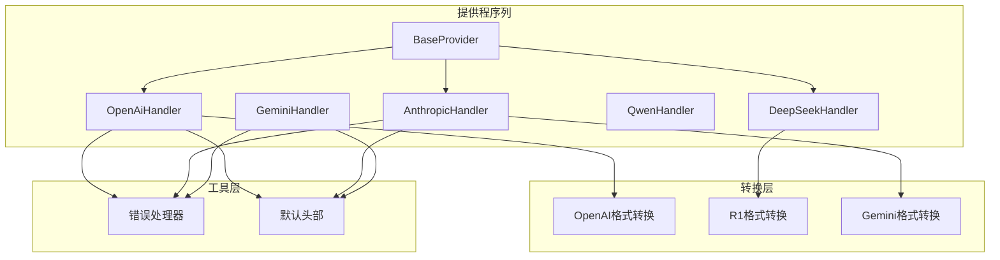
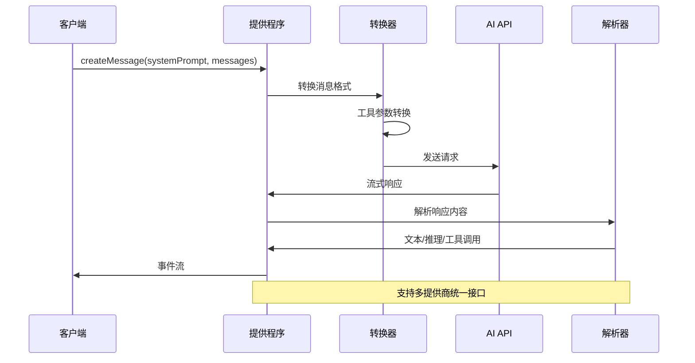
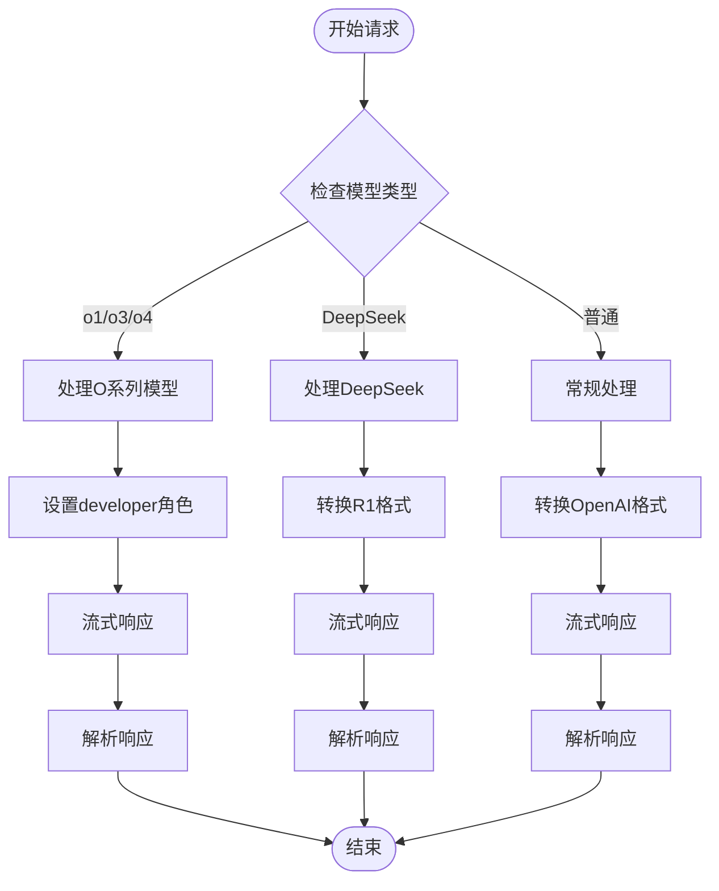
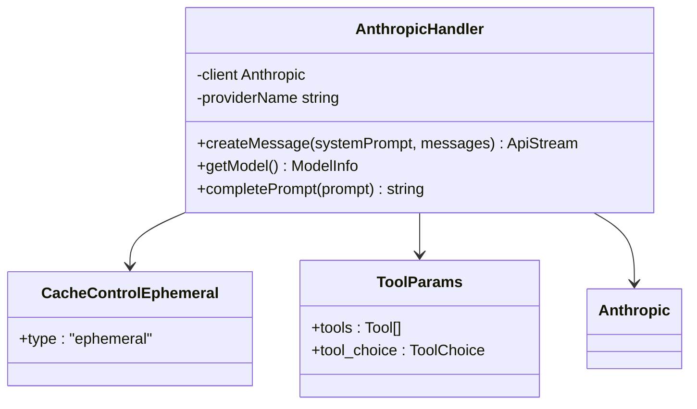
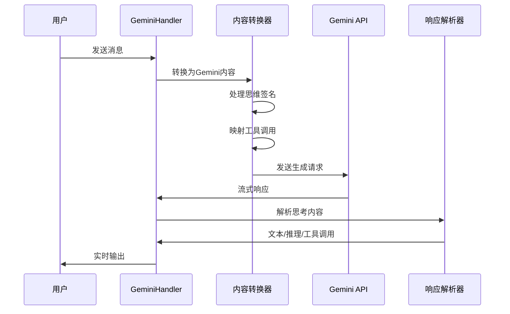
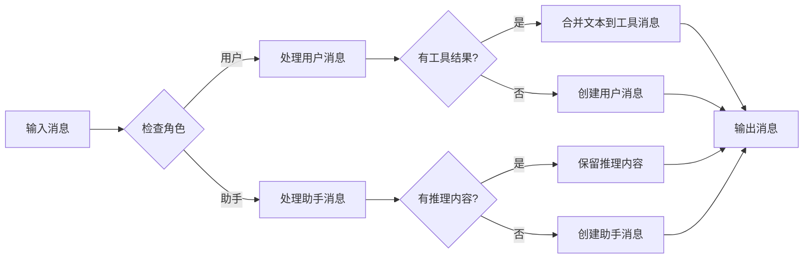

# 具体提供商实现

<cite>
**本文档引用的文件**
- [openai.ts](file://src/api/providers/openai.ts)
- [anthropic.ts](file://src/api/providers/anthropic.ts)
- [gemini.ts](file://src/api/providers/gemini.ts)
- [qwen.ts](file://src/api/providers/qwen.ts)
- [deepseek.ts](file://src/api/providers/deepseek.ts)
- [base-provider.ts](file://src/api/providers/base-provider.ts)
- [constants.ts](file://src/api/providers/constants.ts)
- [openai-compatible.ts](file://src/api/providers/openai-compatible.ts)
- [openai-error-handler.ts](file://src/api/providers/utils/openai-error-handler.ts)
- [error-handler.ts](file://src/api/providers/utils/error-handler.ts)
- [openai-format.ts](file://src/api/transform/openai-format.ts)
- [r1-format.ts](file://src/api/transform/r1-format.ts)
- [gemini-format.ts](file://src/api/transform/gemini-format.ts)
- [api.ts](file://src/shared/api.ts)
</cite>

## 目录
1. [简介](#简介)
2. [项目结构](#项目结构)
3. [核心组件](#核心组件)
4. [架构概览](#架构概览)
5. [详细组件分析](#详细组件分析)
6. [依赖关系分析](#依赖关系分析)
7. [性能考虑](#性能考虑)
8. [故障排除指南](#故障排除指南)
9. [结论](#结论)

## 简介

本文档深入分析了Njust-AI项目中各个主流AI提供商的具体实现细节，包括OpenAI、Anthropic Claude、Google Gemini、阿里Qwen、DeepSeek等。详细说明了每个提供商的API调用方式、认证机制、参数映射规则、响应格式处理，并解释了各提供商的独特功能支持，如函数调用、图像理解、流式响应等。

## 项目结构

项目采用模块化架构，主要分为以下几个核心部分：



**图表来源**
- [openai.ts:31-80](file://src/api/providers/openai.ts#L31-L80)
- [anthropic.ts:30-46](file://src/api/providers/anthropic.ts#L30-L46)
- [gemini.ts:36-72](file://src/api/providers/gemini.ts#L36-L72)
- [qwen.ts:10-26](file://src/api/providers/qwen.ts#L10-L26)
- [deepseek.ts:25-35](file://src/api/providers/deepseek.ts#L25-L35)

**章节来源**
- [openai.ts:1-571](file://src/api/providers/openai.ts#L1-L571)
- [anthropic.ts:1-386](file://src/api/providers/anthropic.ts#L1-L386)
- [gemini.ts:1-538](file://src/api/providers/gemini.ts#L1-L538)

## 核心组件

### 基础提供程序(BaseProvider)

所有具体的AI提供程序都继承自BaseProvider基类，它提供了通用的功能和工具方法：

- **工具转换**: 将工具参数转换为OpenAI兼容格式
- **模式转换**: 处理工具模式的严格模式要求
- **令牌计数**: 使用tiktoken进行令牌计算
- **错误处理**: 提供统一的错误处理接口

### 默认头部设置

系统设置了标准的HTTP头部信息，包括：
- HTTP-Referer: 指向GitHub仓库
- X-Title: Njust-AI项目标识
- User-Agent: 包含版本信息的应用标识

**章节来源**
- [base-provider.ts:13-122](file://src/api/providers/base-provider.ts#L13-L122)
- [constants.ts:3-7](file://src/api/providers/constants.ts#L3-L7)

## 架构概览

系统采用分层架构设计，确保不同AI提供商的统一接口和特定功能支持：



**图表来源**
- [openai.ts:82-270](file://src/api/providers/openai.ts#L82-L270)
- [anthropic.ts:48-316](file://src/api/providers/anthropic.ts#L48-L316)
- [gemini.ts:74-351](file://src/api/providers/gemini.ts#L74-L351)

## 详细组件分析

### OpenAI提供程序

OpenAiHandler是系统中最复杂的提供程序，支持多种OpenAI兼容的API变体：

#### 认证机制
- 支持标准OpenAI API密钥
- 支持Azure OpenAI服务
- 支持Azure AI推理服务
- 支持自定义基础URL

#### 特殊功能支持

**流式响应处理**:
- 支持实时文本流输出
- 处理推理内容流
- 工具调用的增量更新
- 使用TagMatcher解析<think>标签

**模型特化**:
- 支持o1/o3/o4系列模型的特殊处理
- DeepSeek Reasoner的R1格式支持
- Prompt缓存控制（cache_control）



**图表来源**
- [openai.ts:329-429](file://src/api/providers/openai.ts#L329-L429)
- [openai.ts:82-270](file://src/api/providers/openai.ts#L82-L270)

**章节来源**
- [openai.ts:31-535](file://src/api/providers/openai.ts#L31-L535)

### Anthropic Claude提供程序

AnthropicHandler专门处理Anthropic Claude系列模型：

#### 推理缓存机制
- 支持最新的prompt-caching-2024-07-31特性
- 为系统提示和用户消息设置ephemeral缓存
- 自动检测支持缓存的模型（如Claude Sonnet 4.x）

#### 工具调用支持
- 支持细粒度工具流式传输
- 自动转换工具选择策略
- 多模型beta功能支持



**图表来源**
- [anthropic.ts:30-386](file://src/api/providers/anthropic.ts#L30-L386)

**章节来源**
- [anthropic.ts:30-386](file://src/api/providers/anthropic.ts#L30-L386)

### Google Gemini提供程序

GeminiHandler处理Google Gemini系列模型，具有独特的推理和工具调用能力：

#### 思维签名处理
- 自动管理thoughtSignature
- 支持工具调用的思维验证
- 多模型兼容性（Gemini 2.5 Pro, 3.0等）

#### 工具调用机制
- 支持函数声明和内置工具
- 允许函数名限制模式
- 自动工具结果映射



**图表来源**
- [gemini.ts:74-351](file://src/api/providers/gemini.ts#L74-L351)
- [gemini-format.ts:183-200](file://src/api/transform/gemini-format.ts#L183-L200)

**章节来源**
- [gemini.ts:36-538](file://src/api/providers/gemini.ts#L36-L538)

### 阿里Qwen提供程序

QwenHandler基于OpenAI兼容层实现，专门为阿里云DashScope服务：

#### OpenAI兼容层
- 继承OpenAICompatibleHandler基类
- 使用@ai-sdk/openai-compatible
- 标准化的工具调用支持

#### 特定配置
- 默认基础URL: https://dashscope.aliyuncs.com/compatible-mode/v1
- 支持温度和最大令牌配置
- 自定义头部设置

**章节来源**
- [qwen.ts:10-64](file://src/api/providers/qwen.ts#L10-L64)

### DeepSeek提供程序

DeepSeekHandler专门处理DeepSeek推理模型：

#### R1格式转换
- 必须合并连续相同角色的消息
- 支持推理内容的保留
- 工具结果文本的智能合并

#### 推理模式支持
- 支持thinking: { type: "enabled" }
- 特殊的reasoning_content处理
- 缓存写入和读取统计



**图表来源**
- [r1-format.ts:39-244](file://src/api/transform/r1-format.ts#L39-L244)

**章节来源**
- [deepseek.ts:25-157](file://src/api/providers/deepseek.ts#L25-L157)

## 依赖关系分析

系统中的依赖关系体现了清晰的分层架构：

```mermaid
graph TB
subgraph "外部依赖"
OpenAISDK[openai SDK]
AnthropicSDK[@anthropic-ai/sdk]
GeminiSDK[@google/generative-ai]
Axios[axios]
end
subgraph "内部模块"
BaseProvider[BaseProvider]
OpenAIHandler[OpenAiHandler]
AnthropicHandler[AnthropicHandler]
GeminiHandler[GeminiHandler]
QwenHandler[QwenHandler]
DeepSeekHandler[DeepSeekHandler]
OpenAICompatible[OpenAICompatibleHandler]
ErrorHandler[错误处理器]
FormatConverters[格式转换器]
end
OpenAIHandler --> OpenAISDK
AnthropicHandler --> AnthropicSDK
GeminiHandler --> GeminiSDK
QwenHandler --> OpenAICompatible
DeepSeekHandler --> OpenAISDK
OpenAIHandler --> BaseProvider
AnthropicHandler --> BaseProvider
DeepSeekHandler --> BaseProvider
QwenHandler --> OpenAICompatible
OpenAIHandler --> FormatConverters
DeepSeekHandler --> FormatConverters
AnthropicHandler --> FormatConverters
OpenAIHandler --> ErrorHandler
AnthropicHandler --> ErrorHandler
GeminiHandler --> ErrorHandler
```

**图表来源**
- [openai.ts:1-26](file://src/api/providers/openai.ts#L1-L26)
- [anthropic.ts:1-28](file://src/api/providers/anthropic.ts#L1-L28)
- [gemini.ts:1-29](file://src/api/providers/gemini.ts#L1-L29)

**章节来源**
- [openai-compatible.ts:6-20](file://src/api/providers/openai-compatible.ts#L6-L20)

## 性能考虑

### 令牌计数优化
- 使用Web Worker进行异步令牌计算
- 支持原生模型令牌计数端点
- 缓存常用的令牌计数结果

### 流式响应处理
- 实现增量内容解析
- 最小化内存占用
- 支持快速失败恢复

### 错误处理策略
- 统一的错误包装和元数据保留
- HTTP状态码透传
- 重试逻辑支持

## 故障排除指南

### 常见问题及解决方案

**认证错误**
- 检查API密钥格式和有效期
- 验证基础URL配置正确性
- 确认网络连接和代理设置

**流式响应问题**
- 检查超时设置
- 验证网络稳定性
- 确认模型支持流式响应

**工具调用失败**
- 验证工具定义的JSON Schema
- 检查工具名称匹配
- 确认参数类型正确性

**章节来源**
- [error-handler.ts:38-107](file://src/api/providers/utils/error-handler.ts#L38-L107)
- [openai-error-handler.ts:17-19](file://src/api/providers/utils/openai-error-handler.ts#L17-L19)

## 结论

该AI提供商实现系统展现了高度的模块化和可扩展性设计。通过统一的接口抽象和灵活的转换层，系统能够有效支持多个主流AI提供商，同时保持各提供商特有的功能特性。

关键优势包括：
- **统一接口**: 所有提供商提供一致的API接口
- **灵活配置**: 支持多种认证方式和自定义设置
- **功能完整**: 全面支持函数调用、图像理解、流式响应等高级功能
- **错误处理**: 完善的错误处理和调试支持
- **性能优化**: 高效的令牌计数和流式处理机制

这种架构设计为未来的AI提供商集成奠定了坚实的基础，便于添加新的模型和服务提供商。