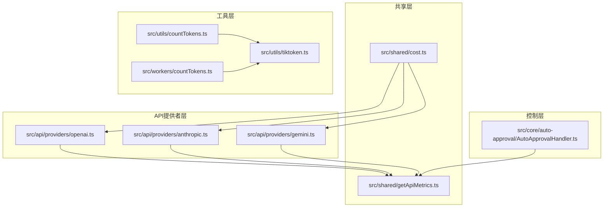
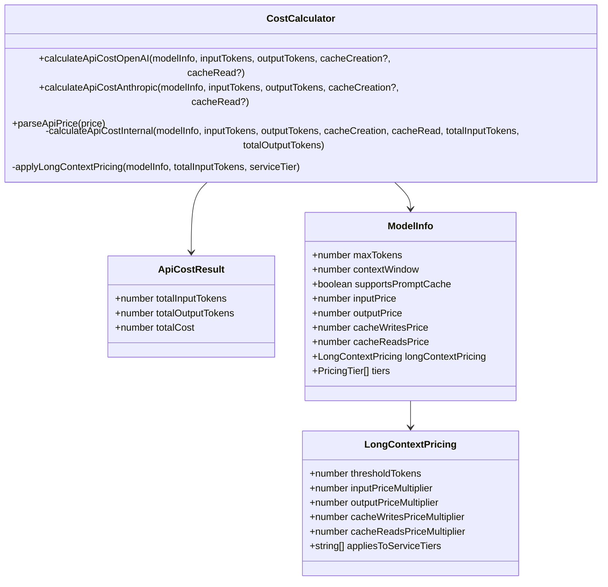
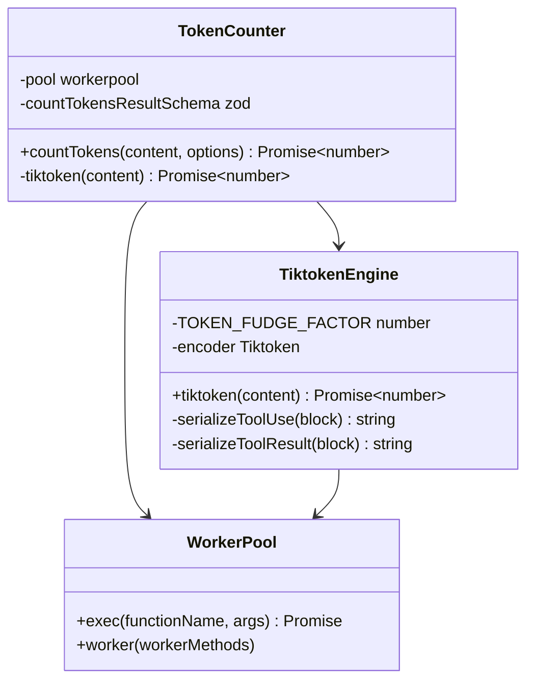
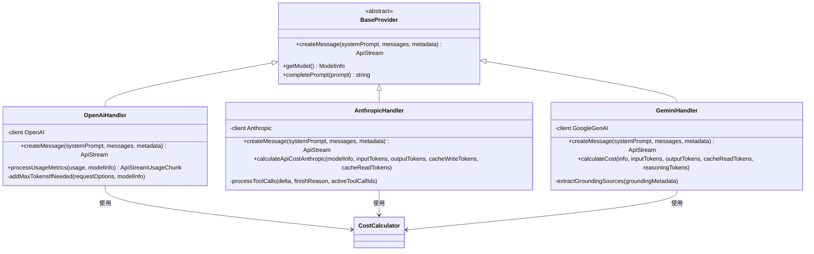
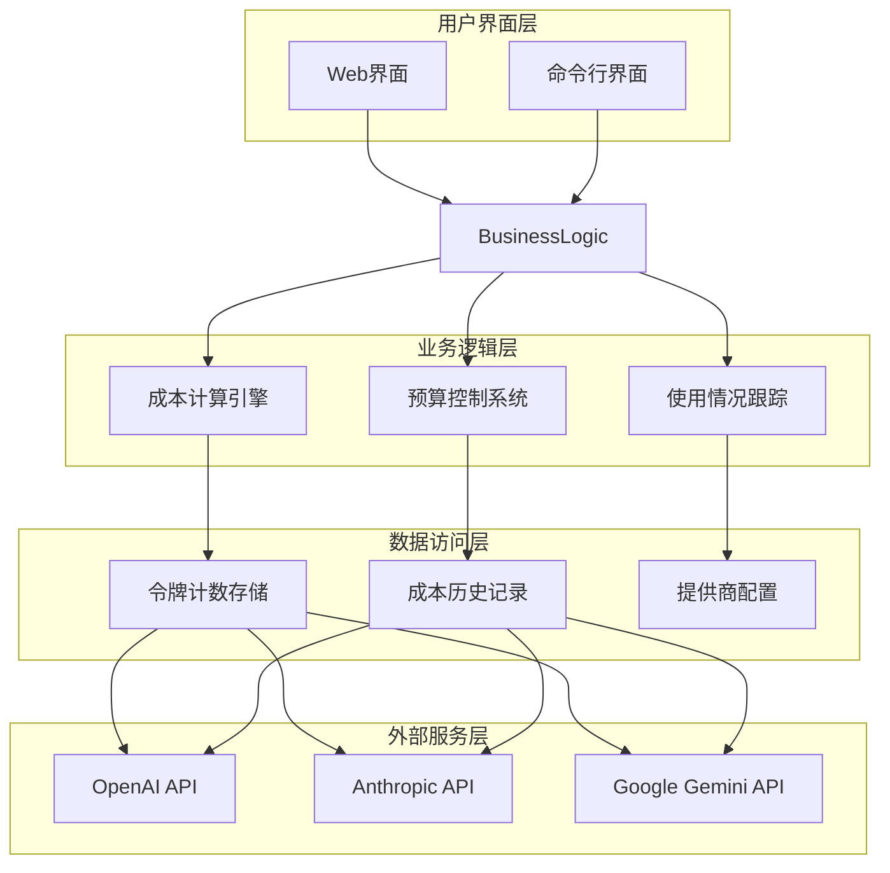
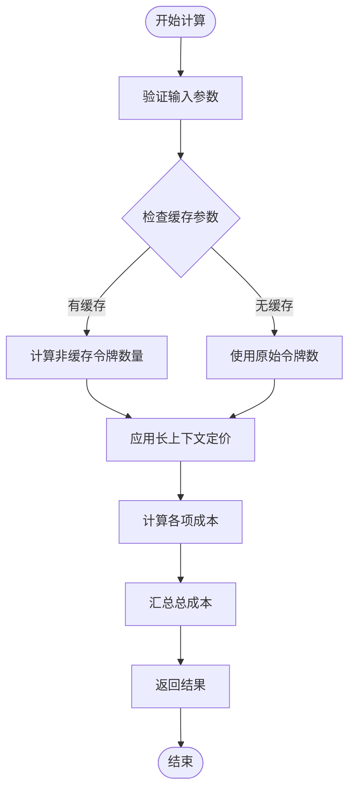
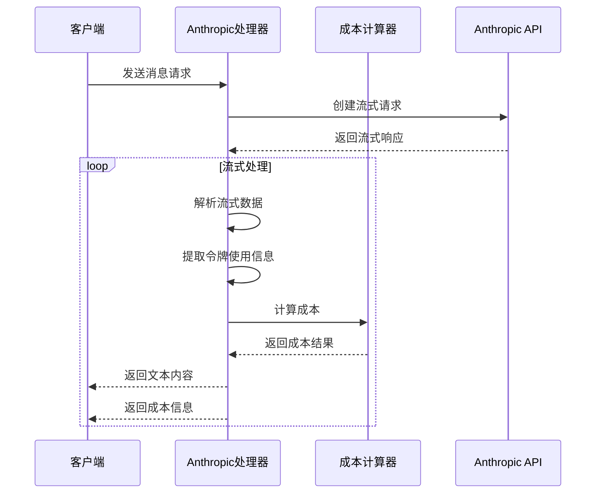
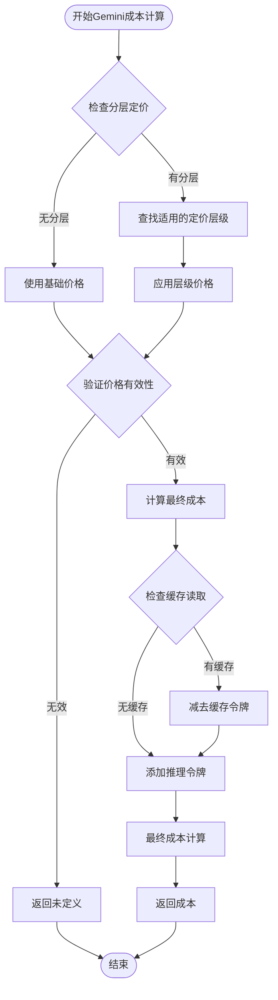
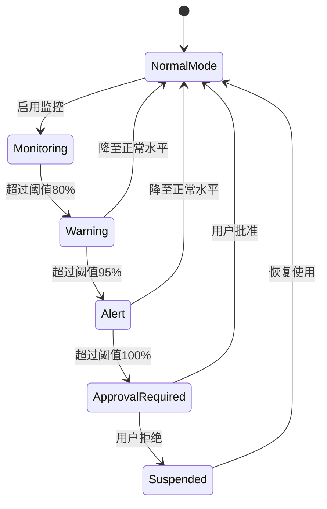

# 成本计算与跟踪

<cite>
**本文档引用的文件**
- [src/shared/cost.ts](file://src/shared/cost.ts)
- [src/utils/countTokens.ts](file://src/utils/countTokens.ts)
- [src/workers/countTokens.ts](file://src/workers/countTokens.ts)
- [src/utils/tiktoken.ts](file://src/utils/tiktoken.ts)
- [src/api/providers/openai.ts](file://src/api/providers/openai.ts)
- [src/api/providers/anthropic.ts](file://src/api/providers/anthropic.ts)
- [src/api/providers/gemini.ts](file://src/api/providers/gemini.ts)
- [src/core/auto-approval/AutoApprovalHandler.ts](file://src/core/auto-approval/AutoApprovalHandler.ts)
- [src/shared/getApiMetrics.ts](file://src/shared/getApiMetrics.ts)
- [src/utils/__tests__/cost.spec.ts](file://src/utils/__tests__/cost.spec.ts)
- [apps/web-Njust-AI/src/app/provider/pricing/components/model-card.tsx](file://apps/web-Njust-AI/src/app/provider/pricing/components/model-card.tsx)
- [apps/web-Njust-AI/src/content/blog/manage-ai-spend-by-measuring-return-not-cost.md](file://apps/web-Njust-AI/src/content/blog/manage-ai-spend-by-measuring-return-not-cost.md)
</cite>

## 目录
1. [简介](#简介)
2. [项目结构](#项目结构)
3. [核心组件](#核心组件)
4. [架构概览](#架构概览)
5. [详细组件分析](#详细组件分析)
6. [依赖关系分析](#依赖关系分析)
7. [性能考虑](#性能考虑)
8. [故障排除指南](#故障排除指南)
9. [结论](#结论)

## 简介

成本计算与跟踪系统是NJUS_AI_CJ平台的核心功能模块，负责精确计算和监控AI API调用的成本。该系统支持多种AI提供商（OpenAI、Anthropic、Google Gemini等），实现了统一的成本计算接口，能够处理不同提供商的差异化计费模式。

系统的主要功能包括：
- **多提供商成本计算**：支持OpenAI、Anthropic、Google Gemini等主流AI提供商的成本计算
- **智能令牌计数**：使用tiktoken引擎进行准确的令牌数量统计
- **缓存成本追踪**：监控和计算提示缓存的写入和读取成本
- **预算控制**：提供自动审批和预算限制功能
- **长上下文定价**：支持基于使用量的分层定价模式
- **实时监控**：提供详细的使用统计和成本分析

## 项目结构

成本计算与跟踪系统采用模块化设计，主要分布在以下目录中：



**图表来源**
- [src/shared/cost.ts:1-119](file://src/shared/cost.ts#L1-L119)
- [src/utils/countTokens.ts:1-46](file://src/utils/countTokens.ts#L1-L46)
- [src/api/providers/openai.ts:1-571](file://src/api/providers/openai.ts#L1-L571)

**章节来源**
- [src/shared/cost.ts:1-119](file://src/shared/cost.ts#L1-L119)
- [src/utils/countTokens.ts:1-46](file://src/utils/countTokens.ts#L1-L46)
- [src/api/providers/openai.ts:1-571](file://src/api/providers/openai.ts#L1-L571)

## 核心组件

### 成本计算器 (Cost Calculator)

成本计算器是系统的核心组件，提供了统一的API用于计算不同提供商的AI调用成本。



**图表来源**
- [src/shared/cost.ts:4-119](file://src/shared/cost.ts#L4-L119)

### 令牌计数器 (Token Counter)

令牌计数器负责准确计算AI消息中的令牌数量，支持多线程处理以提高性能。



**图表来源**
- [src/utils/countTokens.ts:1-46](file://src/utils/countTokens.ts#L1-L46)
- [src/utils/tiktoken.ts:1-107](file://src/utils/tiktoken.ts#L1-L107)
- [src/workers/countTokens.ts:1-22](file://src/workers/countTokens.ts#L1-L22)

### API提供者集成

不同的AI提供者通过各自的处理器实现成本计算的集成：



**图表来源**
- [src/api/providers/openai.ts:31-535](file://src/api/providers/openai.ts#L31-L535)
- [src/api/providers/anthropic.ts:30-385](file://src/api/providers/anthropic.ts#L30-L385)
- [src/api/providers/gemini.ts:36-537](file://src/api/providers/gemini.ts#L36-L537)

**章节来源**
- [src/shared/cost.ts:1-119](file://src/shared/cost.ts#L1-L119)
- [src/utils/countTokens.ts:1-46](file://src/utils/countTokens.ts#L1-L46)
- [src/api/providers/openai.ts:1-571](file://src/api/providers/openai.ts#L1-L571)

## 架构概览

系统采用分层架构设计，确保了良好的可扩展性和维护性：



**图表来源**
- [src/shared/cost.ts:1-119](file://src/shared/cost.ts#L1-L119)
- [src/core/auto-approval/AutoApprovalHandler.ts:109-155](file://src/core/auto-approval/AutoApprovalHandler.ts#L109-L155)

## 详细组件分析

### 成本计算算法

系统实现了三种主要的成本计算算法，针对不同提供商的计费模式进行了优化：

#### OpenAI兼容算法

OpenAI的计费模式相对简单，采用每百万令牌计价的方式：



**图表来源**
- [src/shared/cost.ts:92-116](file://src/shared/cost.ts#L92-L116)

#### Anthropic算法

Anthropic的算法需要特别处理缓存令牌的计算方式：



**图表来源**
- [src/api/providers/anthropic.ts:197-316](file://src/api/providers/anthropic.ts#L197-L316)

#### Google Gemini算法

Gemini的算法支持复杂的分层定价模式：



**图表来源**
- [src/api/providers/gemini.ts:474-536](file://src/api/providers/gemini.ts#L474-L536)

### 缓存策略实现

系统实现了智能的缓存策略，能够有效降低重复查询的成本：

| 缓存类型 | 描述 | 优势 | 适用场景 |
|---------|------|------|----------|
| 提示缓存 | 存储常用的系统提示和用户消息 | 显著降低输入令牌成本 | 频繁重复的任务 |
| 结果缓存 | 缓存模型的输出结果 | 减少重复生成时间 | 相同或相似查询 |
| 模型参数缓存 | 缓存模型配置和参数 | 提高初始化速度 | 多次使用同一模型 |

### 预算控制机制

系统提供了多层次的预算控制功能：



**图表来源**
- [src/core/auto-approval/AutoApprovalHandler.ts:109-155](file://src/core/auto-approval/AutoApprovalHandler.ts#L109-L155)

**章节来源**
- [src/shared/cost.ts:1-119](file://src/shared/cost.ts#L1-L119)
- [src/api/providers/anthropic.ts:197-316](file://src/api/providers/anthropic.ts#L197-L316)
- [src/api/providers/gemini.ts:474-536](file://src/api/providers/gemini.ts#L474-L536)
- [src/core/auto-approval/AutoApprovalHandler.ts:109-155](file://src/core/auto-approval/AutoApprovalHandler.ts#L109-L155)

## 依赖关系分析

系统各组件之间的依赖关系如下：

```mermaid
graph TD
subgraph "核心依赖"
Zod[zod] --> SharedCost[src/shared/cost.ts]
WorkerPool[workerpool] --> UtilsCountTokens[src/utils/countTokens.ts]
Axios[axios] --> OpenAIHandler[src/api/providers/openai.ts]
end
subgraph "第三方库"
AnthropicSDK[@anthropic-ai/sdk] --> AnthropicHandler[src/api/providers/anthropic.ts]
OpenAISDK[openai] --> OpenAIHandler
GenaiSDK[@google/generative-ai] --> GeminiHandler[src/api/providers/gemini.ts]
Tiktoken[tiktoken] --> TiktokenEngine[src/utils/tiktoken.ts]
end
subgraph "测试依赖"
Vitest[vitest] --> CostSpec[src/utils/__tests__/cost.spec.ts]
ReactQuery[@tanstack/react-query] --> WebComponents[Web组件]
end
SharedCost --> AnthropicHandler
SharedCost --> OpenAIHandler
SharedCost --> GeminiHandler
UtilsCountTokens --> WorkerCount[src/workers/countTokens.ts]
TiktokenEngine --> WorkerCount
```

**图表来源**
- [src/shared/cost.ts:1-119](file://src/shared/cost.ts#L1-L119)
- [src/utils/countTokens.ts:1-46](file://src/utils/countTokens.ts#L1-L46)
- [src/api/providers/openai.ts:1-571](file://src/api/providers/openai.ts#L1-L571)

**章节来源**
- [src/shared/cost.ts:1-119](file://src/shared/cost.ts#L1-L119)
- [src/utils/countTokens.ts:1-46](file://src/utils/countTokens.ts#L1-L46)
- [src/api/providers/openai.ts:1-571](file://src/api/providers/openai.ts#L1-L571)

## 性能考虑

### 令牌计数性能优化

系统采用了多种策略来优化令牌计数的性能：

1. **多线程处理**：使用workerpool在独立线程中执行令牌计数，避免阻塞主线程
2. **缓存机制**：tiktoken编码器被缓存，避免重复创建
3. **错误恢复**：当worker失败时自动降级到主线程处理
4. **批量处理**：支持批量令牌计数以提高效率

### 内存管理

- **编码器缓存**：tiktoken编码器只创建一次并全局缓存
- **工作池管理**：智能的工作池配置，限制最大工作线程数
- **错误处理**：优雅的错误恢复机制，防止内存泄漏

### 网络优化

- **连接复用**：API客户端支持连接复用
- **超时配置**：合理的请求超时设置
- **重试机制**：网络错误时的自动重试

## 故障排除指南

### 常见问题及解决方案

#### 成本计算异常

**问题**：成本计算结果不正确
**可能原因**：
- 令牌计数不准确
- 缓存参数处理错误
- 分层定价配置问题

**解决步骤**：
1. 检查令牌计数准确性
2. 验证缓存参数设置
3. 确认分层定价配置

#### 令牌计数错误

**问题**：令牌计数结果异常
**可能原因**：
- 工作池初始化失败
- tiktoken编码器创建失败
- 内容格式不正确

**解决步骤**：
1. 检查工作池状态
2. 验证tiktoken编码器
3. 确认输入内容格式

#### 预算控制失效

**问题**：预算控制功能不生效
**可能原因**：
- 自动审批配置错误
- 使用统计获取失败
- 权限不足

**解决步骤**：
1. 检查自动审批配置
2. 验证使用统计获取
3. 确认权限设置

**章节来源**
- [src/utils/__tests__/cost.spec.ts:100-306](file://src/utils/__tests__/cost.spec.ts#L100-L306)
- [src/core/auto-approval/AutoApprovalHandler.ts:109-155](file://src/core/auto-approval/AutoApprovalHandler.ts#L109-L155)

## 结论

成本计算与跟踪系统通过模块化设计和多层架构，成功实现了对多种AI提供商的统一成本管理。系统的核心优势包括：

1. **统一接口**：提供一致的成本计算API，简化了多提供商集成
2. **精确计费**：支持复杂的计费模式，包括缓存成本、长上下文定价等
3. **智能监控**：实时跟踪使用情况，提供预算控制功能
4. **高性能**：采用多线程和缓存策略，确保系统性能
5. **可扩展性**：模块化设计便于添加新的AI提供商和功能

该系统为AI工具的商业化使用提供了坚实的技术基础，通过精确的成本控制和使用监控，帮助组织更好地管理和优化AI资源的使用。