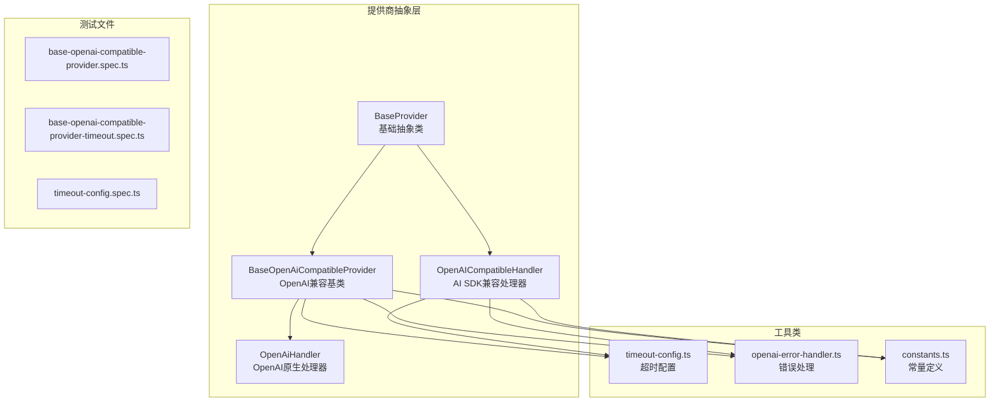
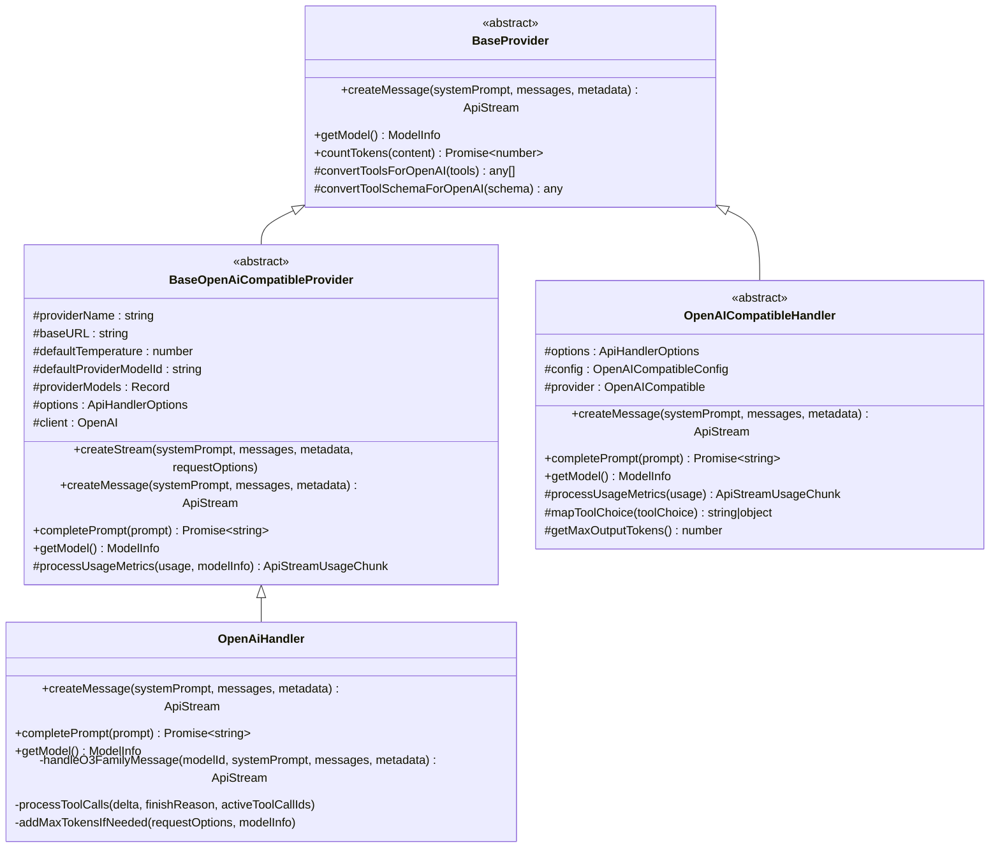
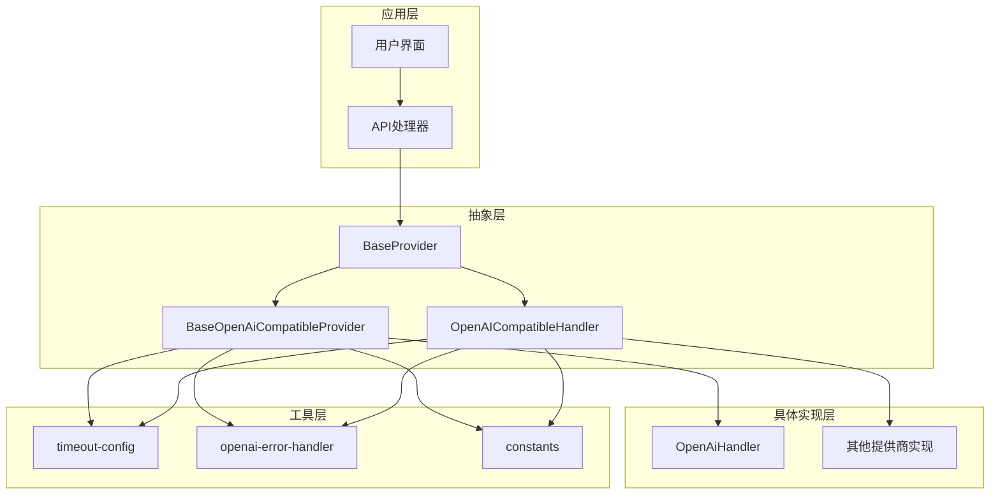
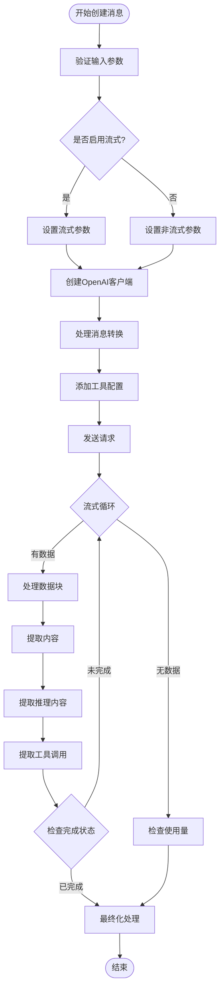
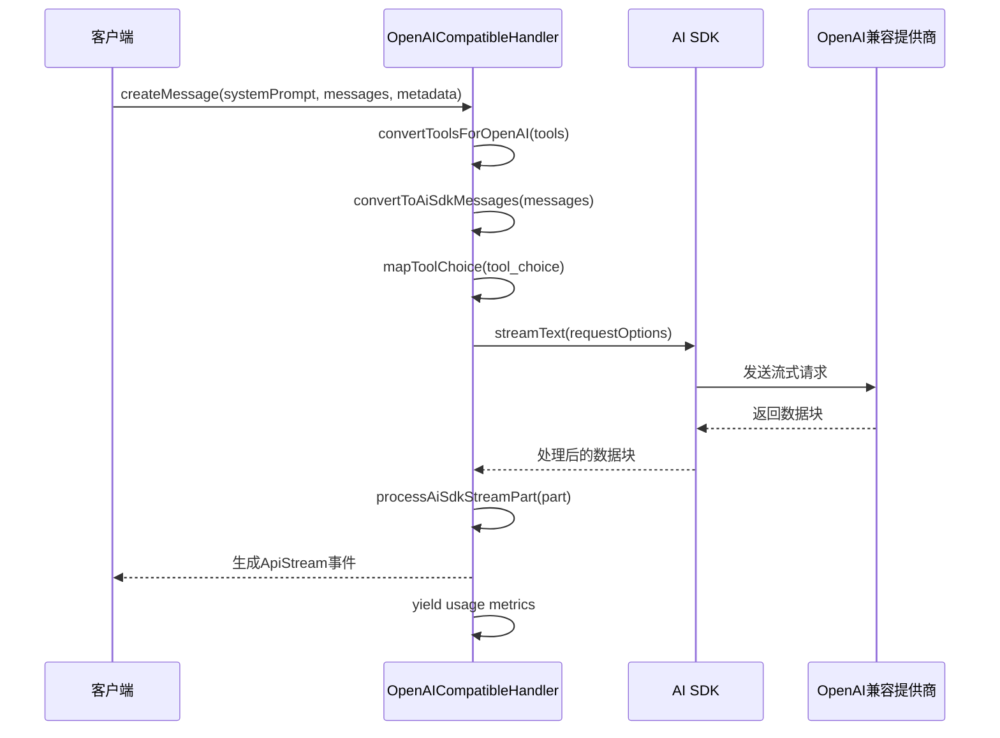
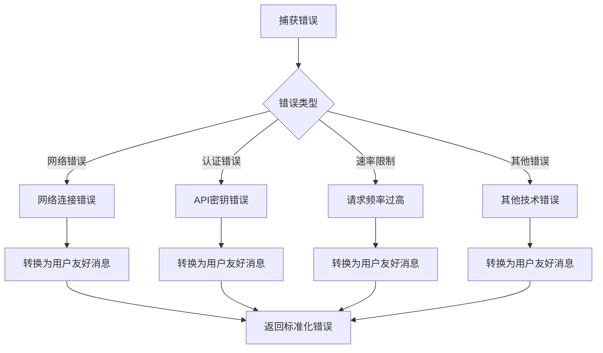
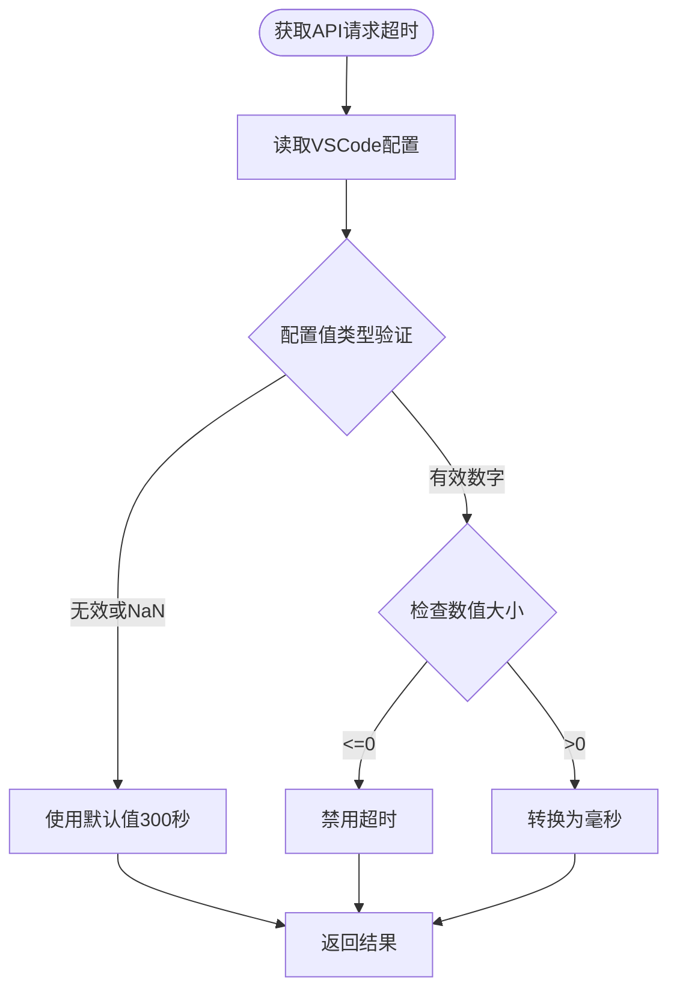

# 提供商抽象层设计

<cite>
**本文档引用的文件**
- [base-provider.ts](file://src/api/providers/base-provider.ts)
- [base-openai-compatible-provider.ts](file://src/api/providers/base-openai-compatible-provider.ts)
- [openai-compatible.ts](file://src/api/providers/openai-compatible.ts)
- [openai.ts](file://src/api/providers/openai.ts)
- [constants.ts](file://src/api/providers/constants.ts)
- [timeout-config.ts](file://src/api/providers/utils/timeout-config.ts)
- [openai-error-handler.ts](file://src/api/providers/utils/openai-error-handler.ts)
- [base-openai-compatible-provider.spec.ts](file://src/api/providers/__tests__/base-openai-compatible-provider.spec.ts)
- [base-openai-compatible-provider-timeout.spec.ts](file://src/api/providers/__tests__/base-openai-compatible-provider-timeout.spec.ts)
- [timeout-config.spec.ts](file://src/api/providers/utils/__tests__/timeout-config.spec.ts)
</cite>

## 目录
1. [简介](#简介)
2. [项目结构](#项目结构)
3. [核心组件](#核心组件)
4. [架构概览](#架构概览)
5. [详细组件分析](#详细组件分析)
6. [依赖关系分析](#依赖关系分析)
7. [性能考虑](#性能考虑)
8. [故障排除指南](#故障排除指南)
9. [结论](#结论)

## 简介

提供商抽象层是 Njust-AI 项目中用于统一管理各种 AI 模型提供商的核心架构组件。该设计通过抽象基类和统一接口，实现了对不同提供商（如 OpenAI、Anthropic、Azure AI 等）的标准化访问，同时提供了强大的扩展性，使得新提供商的集成变得简单而一致。

该抽象层的核心目标是：
- 提供统一的接口定义，屏蔽不同提供商的差异
- 实现标准化的错误处理机制
- 支持配置管理和动态参数映射
- 提供流式处理支持和工具调用能力
- 确保跨平台兼容性和可维护性

## 项目结构

提供商抽象层位于 `src/api/providers/` 目录下，采用模块化设计，包含以下关键组件：



**图表来源**
- [base-provider.ts:1-123](file://src/api/providers/base-provider.ts#L1-L123)
- [base-openai-compatible-provider.ts:1-261](file://src/api/providers/base-openai-compatible-provider.ts#L1-L261)
- [openai-compatible.ts:1-213](file://src/api/providers/openai-compatible.ts#L1-L213)
- [openai.ts:1-571](file://src/api/providers/openai.ts#L1-L571)

**章节来源**
- [base-provider.ts:1-123](file://src/api/providers/base-provider.ts#L1-L123)
- [constants.ts:1-8](file://src/api/providers/constants.ts#L1-L8)

## 核心组件

### BaseProvider 抽象基类

BaseProvider 是整个提供商抽象层的基础，定义了所有提供商必须实现的核心接口和通用功能：



**图表来源**
- [base-provider.ts:13-123](file://src/api/providers/base-provider.ts#L13-L123)
- [base-openai-compatible-provider.ts:26-261](file://src/api/providers/base-openai-compatible-provider.ts#L26-L261)
- [openai-compatible.ts:50-213](file://src/api/providers/openai-compatible.ts#L50-L213)
- [openai.ts:31-535](file://src/api/providers/openai.ts#L31-L535)

### 统一接口定义

所有提供商都必须实现以下核心接口：

1. **createMessage**: 处理消息生成的主入口点
2. **completePrompt**: 处理简单提示词完成
3. **getModel**: 返回当前使用的模型信息

这些接口确保了不同提供商之间的行为一致性，使得上层应用无需关心具体的提供商实现细节。

**章节来源**
- [base-provider.ts:14-20](file://src/api/providers/base-provider.ts#L14-L20)
- [base-openai-compatible-provider.ts:113-117](file://src/api/providers/base-openai-compatible-provider.ts#L113-L117)

## 架构概览

提供商抽象层采用了分层架构设计，通过继承关系实现代码复用和扩展：



**图表来源**
- [base-provider.ts:1-123](file://src/api/providers/base-provider.ts#L1-L123)
- [base-openai-compatible-provider.ts:1-261](file://src/api/providers/base-openai-compatible-provider.ts#L1-L261)
- [openai-compatible.ts:1-213](file://src/api/providers/openai-compatible.ts#L1-L213)
- [openai.ts:1-571](file://src/api/providers/openai.ts#L1-L571)

## 详细组件分析

### BaseOpenAiCompatibleProvider 分析

BaseOpenAiCompatibleProvider 是专门为 OpenAI 兼容 API 设计的抽象基类，提供了完整的流式处理和工具调用支持：

#### 关键特性

1. **参数映射**: 自动将内部消息格式转换为 OpenAI 兼容格式
2. **流式处理**: 支持实时流式响应处理
3. **工具调用**: 完整的工具调用状态管理
4. **成本计算**: 内置令牌使用量统计和费用计算

#### 流程图



**图表来源**
- [base-openai-compatible-provider.ts:113-200](file://src/api/providers/base-openai-compatible-provider.ts#L113-L200)

**章节来源**
- [base-openai-compatible-provider.ts:40-68](file://src/api/providers/base-openai-compatible-provider.ts#L40-L68)
- [base-openai-compatible-provider.ts:70-111](file://src/api/providers/base-openai-compatible-provider.ts#L70-L111)

### OpenAI 兼容提供商实现

#### OpenAICompatibleHandler

OpenAICompatibleHandler 使用 Vercel AI SDK 提供的兼容性层，支持多种 OpenAI 兼容的提供商：



**图表来源**
- [openai-compatible.ts:153-195](file://src/api/providers/openai-compatible.ts#L153-L195)

#### OpenAiHandler

OpenAiHandler 提供了对 OpenAI 原生 API 的完整支持，包括特殊模型族的处理：

**章节来源**
- [openai-compatible.ts:50-213](file://src/api/providers/openai-compatible.ts#L50-L213)
- [openai.ts:31-535](file://src/api/providers/openai.ts#L31-L535)

### 错误处理机制

提供商抽象层实现了统一的错误处理策略：



**图表来源**
- [openai-error-handler.ts:17-19](file://src/api/providers/utils/openai-error-handler.ts#L17-L19)

**章节来源**
- [openai-error-handler.ts:1-20](file://src/api/providers/utils/openai-error-handler.ts#L1-L20)

### 配置管理策略

#### 超时设置

提供商抽象层通过 `getApiRequestTimeout` 函数统一管理请求超时：



**图表来源**
- [timeout-config.ts:13-31](file://src/api/providers/utils/timeout-config.ts#L13-L31)

**章节来源**
- [timeout-config.ts:1-32](file://src/api/providers/utils/timeout-config.ts#L1-L32)

## 依赖关系分析

提供商抽象层的依赖关系体现了清晰的分层架构：

```mermaid
graph LR
subgraph "外部依赖"
OPENAI[openai SDK]
AI_SDK[ai SDK]
AXIOS[axios]
ANTHROPIC[@anthropic-ai/sdk]
end
subgraph "内部依赖"
BASE_PROVIDER[base-provider.ts]
TRANSFORM[transform模块]
UTILS[utils模块]
SHARED[shared模块]
end
subgraph "具体实现"
BOCP[base-openai-compatible-provider.ts]
OAH[openai-compatible.ts]
OAH2[openai.ts]
end
OPENAI --> BOCP
AI_SDK --> OAH
AXIOS --> OAH2
ANTHROPIC --> BASE_PROVIDER
BASE_PROVIDER --> TRANSFORM
BASE_PROVIDER --> UTILS
BASE_PROVIDER --> SHARED
BOCP --> BASE_PROVIDER
OAH --> BASE_PROVIDER
OAH2 --> BASE_PROVIDER
```

**图表来源**
- [base-provider.ts:1-8](file://src/api/providers/base-provider.ts#L1-L8)
- [base-openai-compatible-provider.ts:1-16](file://src/api/providers/base-openai-compatible-provider.ts#L1-L16)
- [openai-compatible.ts:6-19](file://src/api/providers/openai-compatible.ts#L6-L19)
- [openai.ts:1-26](file://src/api/providers/openai.ts#L1-L26)

**章节来源**
- [base-provider.ts:1-123](file://src/api/providers/base-provider.ts#L1-L123)
- [base-openai-compatible-provider.ts:1-261](file://src/api/providers/base-openai-compatible-provider.ts#L1-L261)

## 性能考虑

### 流式处理优化

提供商抽象层通过流式处理机制实现了高效的响应处理：

1. **实时响应**: 用户可以立即看到部分响应内容
2. **内存效率**: 避免一次性加载大量数据到内存
3. **并发处理**: 支持多路并发流式请求

### 缓存策略

- **令牌计数缓存**: 使用 worker 线程进行高效的令牌计数
- **模型信息缓存**: 避免重复查询模型配置信息
- **请求结果缓存**: 在适当场景下缓存昂贵的操作结果

### 连接管理

- **连接池**: 复用 HTTP 连接减少建立连接的开销
- **超时控制**: 合理的超时设置避免资源泄露
- **重试机制**: 对临时性错误提供自动重试支持

## 故障排除指南

### 常见问题诊断

1. **API 密钥错误**
   - 检查密钥格式和有效期
   - 验证提供商账户状态
   - 确认 API 权限配置

2. **网络连接问题**
   - 验证网络连通性
   - 检查防火墙设置
   - 确认代理配置

3. **超时错误**
   - 调整 `apiRequestTimeout` 设置
   - 检查提供商响应时间
   - 考虑增加超时阈值

### 调试建议

- 启用详细的日志记录
- 使用测试用例验证实现
- 监控资源使用情况
- 定期更新提供商 SDK

**章节来源**
- [base-openai-compatible-provider.spec.ts:1-56](file://src/api/providers/__tests__/base-openai-compatible-provider.spec.ts#L1-L56)
- [base-openai-compatible-provider-timeout.spec.ts:1-98](file://src/api/providers/__tests__/base-openai-compatible-provider-timeout.spec.ts#L1-L98)
- [timeout-config.spec.ts:1-102](file://src/api/providers/utils/__tests__/timeout-config.spec.ts#L1-L102)

## 结论

提供商抽象层设计成功地实现了以下目标：

1. **统一性**: 通过抽象基类提供了统一的接口和行为规范
2. **扩展性**: 清晰的继承层次结构便于新提供商的快速集成
3. **可靠性**: 完善的错误处理和超时管理机制
4. **性能**: 流式处理和缓存策略确保了高效的运行性能
5. **可维护性**: 模块化的架构设计便于代码维护和测试

该设计为 Njust-AI 项目提供了坚实的基础设施，支持未来更多 AI 模型提供商的无缝集成，同时保持了系统的稳定性和可扩展性。