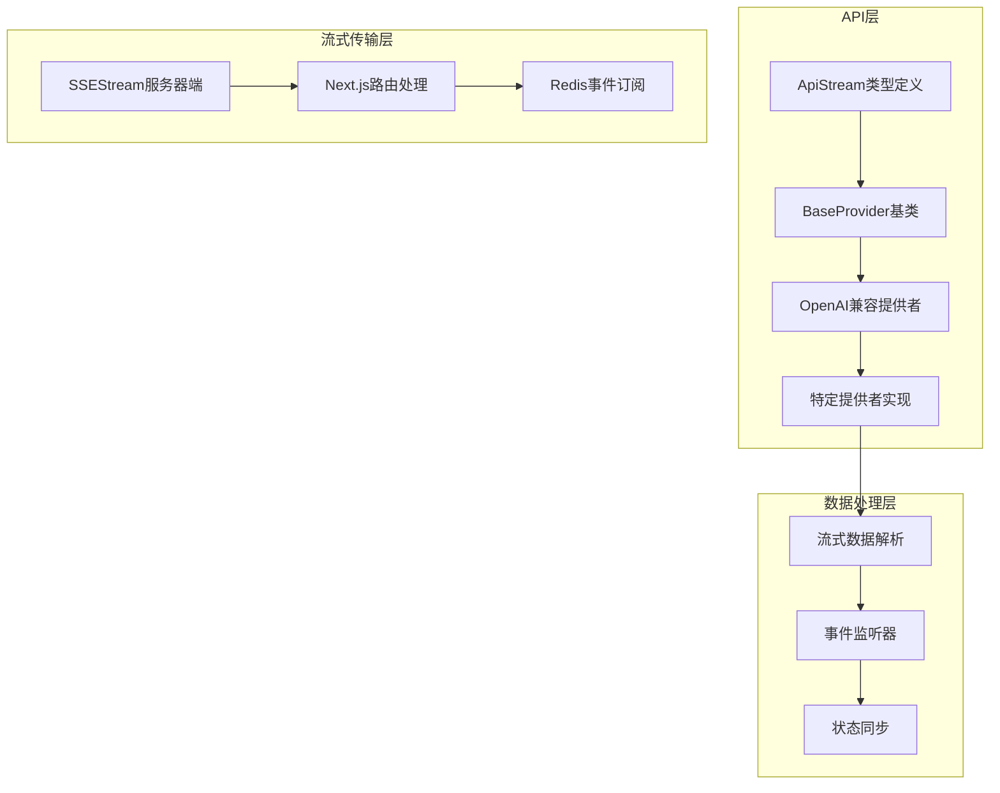
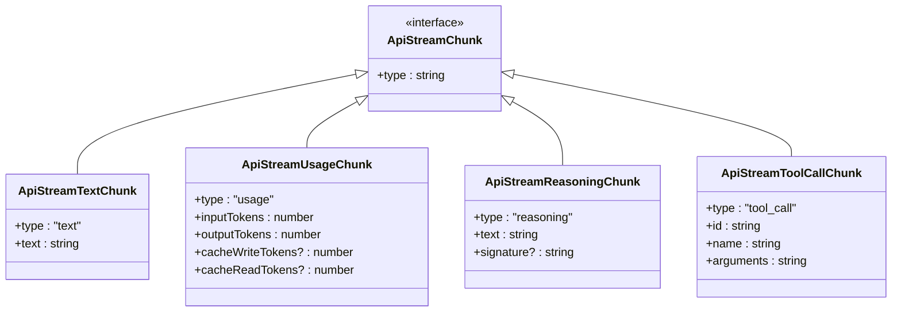
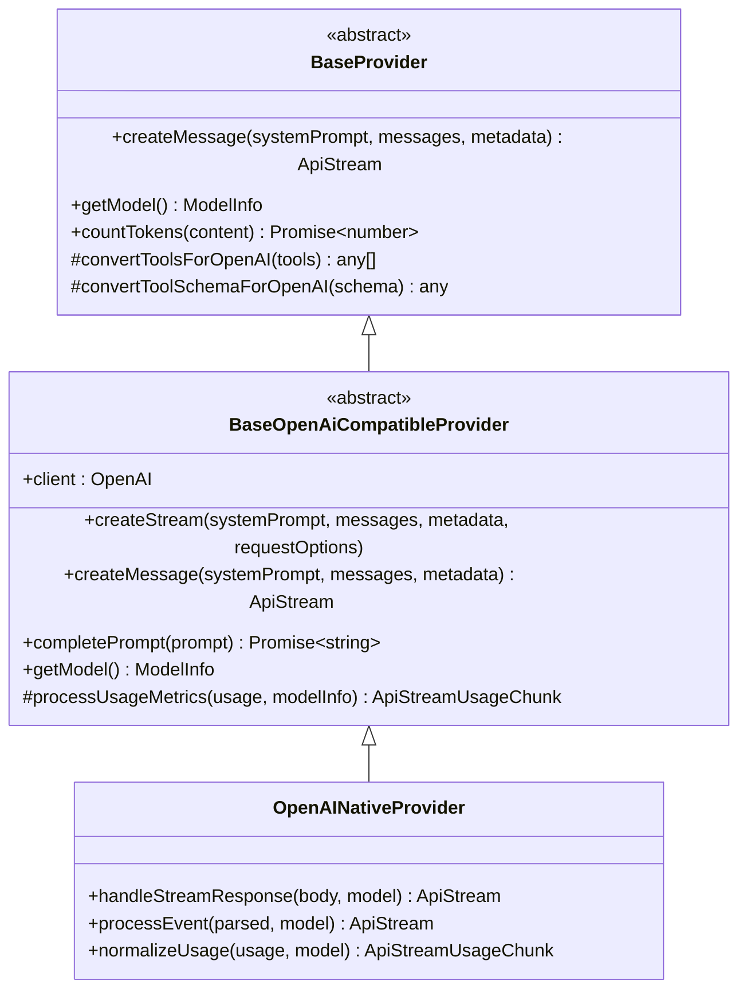
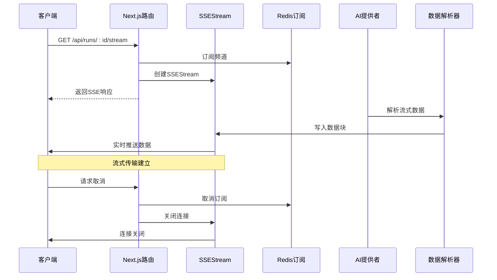
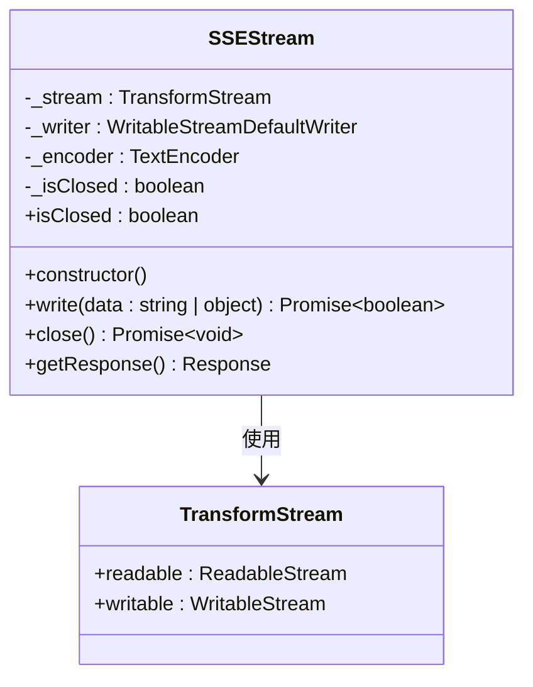
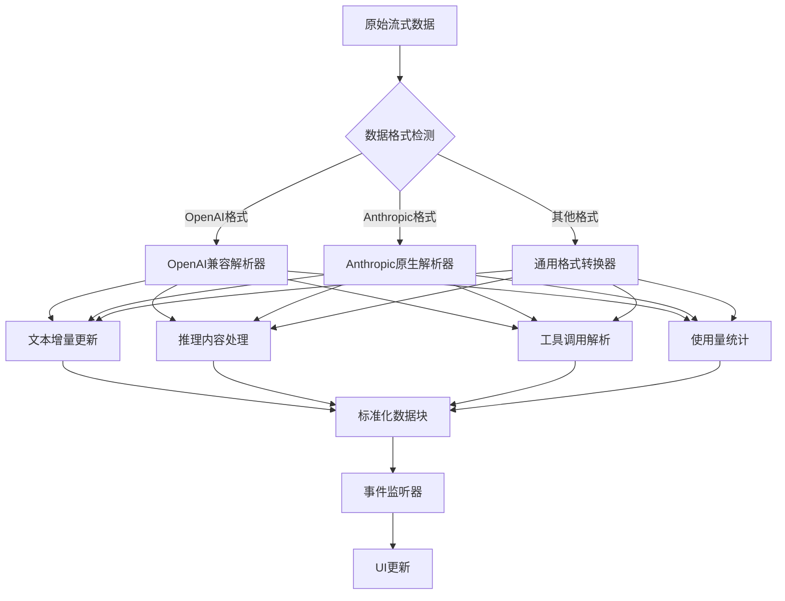
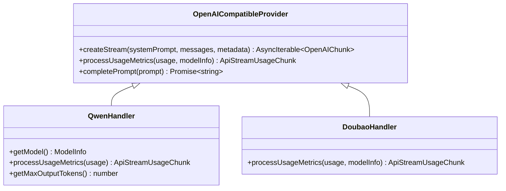
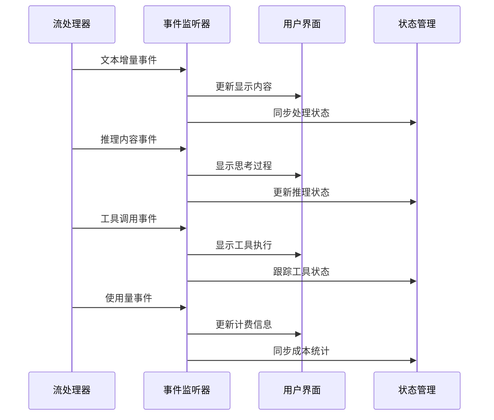
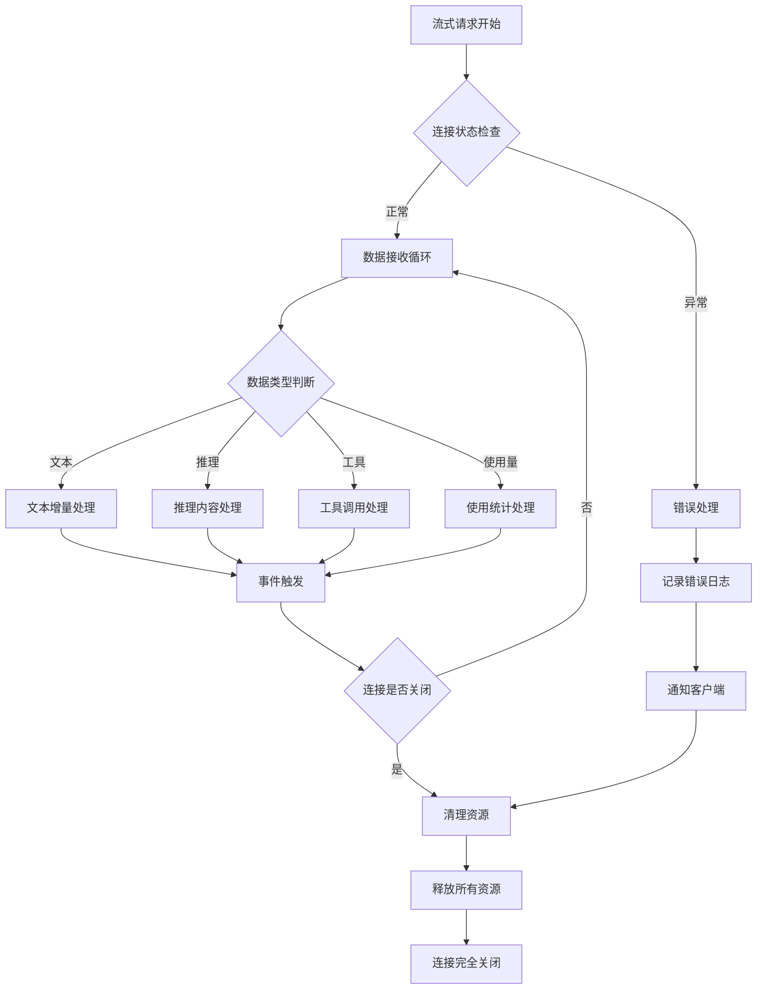
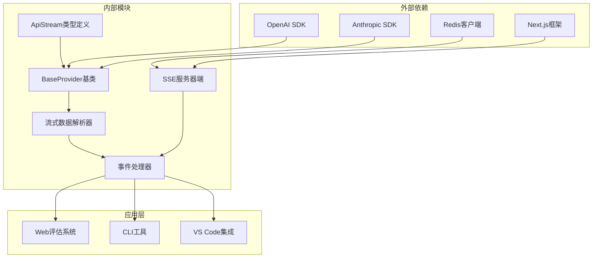

# 流式处理机制

<cite>
**本文档引用的文件**
- [stream.ts](file://src/api/transform/stream.ts)
- [base-provider.ts](file://src/api/providers/base-provider.ts)
- [base-openai-compatible-provider.ts](file://src/api/providers/base-openai-compatible-provider.ts)
- [openai-native.ts](file://src/api/providers/openai-native.ts)
- [qwen.ts](file://src/api/providers/qwen.ts)
- [sse-stream.ts](file://apps/web-evals/src/lib/server/sse-stream.ts)
- [route.ts](file://apps/web-evals/src/app/api/runs/[id]/stream/route.ts)
- [stream.spec.ts](file://src/api/transform/__tests__/stream.spec.ts)
- [ai-sdk.spec.ts](file://src/api/transform/__tests__/ai-sdk.spec.ts)
- [doubao.ts](file://src/api/providers/doubao.ts)
- [vscode-lm.ts](file://src/api/providers/vscode-lm.ts)
</cite>

## 目录
1. [引言](#引言)
2. [项目结构](#项目结构)
3. [核心组件](#核心组件)
4. [架构概览](#架构概览)
5. [详细组件分析](#详细组件分析)
6. [依赖关系分析](#依赖关系分析)
7. [性能考虑](#性能考虑)
8. [故障排除指南](#故障排除指南)
9. [结论](#结论)

## 引言

本文件深入解析Njust-AI项目中的流式处理机制，重点阐述AI响应流式传输的实现原理。该机制通过多种技术栈实现数据分片、实时处理和状态同步，确保在不同AI提供商间实现兼容性和性能优化。

流式处理机制的核心价值在于：
- **实时性**：数据分片传输，降低首字节延迟
- **兼容性**：统一的流式数据格式，支持多家AI提供商
- **可靠性**：完善的错误处理和连接管理
- **可扩展性**：模块化的架构设计，便于新增提供商支持

## 项目结构

流式处理机制在项目中的分布如下：

**图表来源**
- [stream.ts:1-115](file://src/api/transform/stream.ts#L1-L115)
- [base-provider.ts:1-123](file://src/api/providers/base-provider.ts#L1-L123)
- [sse-stream.ts:1-60](file://apps/web-evals/src/lib/server/sse-stream.ts#L1-L60)

**章节来源**
- [stream.ts:1-115](file://src/api/transform/stream.ts#L1-L115)
- [base-provider.ts:1-123](file://src/api/providers/base-provider.ts#L1-L123)
- [sse-stream.ts:1-60](file://apps/web-evals/src/lib/server/sse-stream.ts#L1-L60)

## 核心组件

### 流式数据类型系统

流式处理的核心是统一的数据类型定义，确保不同提供商的数据能够标准化处理：

**图表来源**
- [stream.ts:3-115](file://src/api/transform/stream.ts#L3-L115)

### 基础提供者架构

BaseProvider作为所有AI提供者的抽象基类，提供了统一的接口和通用功能：

**图表来源**
- [base-provider.ts:13-123](file://src/api/providers/base-provider.ts#L13-L123)
- [base-openai-compatible-provider.ts:26-261](file://src/api/providers/base-openai-compatible-provider.ts#L26-L261)
- [openai-native.ts:679-799](file://src/api/providers/openai-native.ts#L679-L799)

**章节来源**
- [base-provider.ts:1-123](file://src/api/providers/base-provider.ts#L1-L123)
- [base-openai-compatible-provider.ts:1-261](file://src/api/providers/base-openai-compatible-provider.ts#L1-L261)
- [openai-native.ts:600-899](file://src/api/providers/openai-native.ts#L600-L899)

## 架构概览

流式处理机制采用分层架构设计，从底层的流式数据传输到上层的应用逻辑：

**图表来源**
- [route.ts:11-71](file://apps/web-evals/src/app/api/runs/[id]/stream/route.ts#L11-L71)
- [sse-stream.ts:13-58](file://apps/web-evals/src/lib/server/sse-stream.ts#L13-L58)

## 详细组件分析

### SSE服务器端实现

SSEStream类实现了服务器端的SSE（Server-Sent Events）传输机制：

**图表来源**
- [sse-stream.ts:1-60](file://apps/web-evals/src/lib/server/sse-stream.ts#L1-L60)

SSEStream的关键特性：
- **缓冲管理**：使用TransformStream进行数据缓冲
- **编码处理**：自动将对象序列化为JSON格式
- **错误恢复**：写入失败时自动关闭连接
- **头部设置**：正确设置SSE所需的HTTP头部

**章节来源**
- [sse-stream.ts:1-60](file://apps/web-evals/src/lib/server/sse-stream.ts#L1-L60)

### 流式数据解析流程

不同AI提供商的数据格式存在差异，需要通过统一的解析器进行标准化处理：

**图表来源**
- [openai-native.ts:679-799](file://src/api/providers/openai-native.ts#L679-L799)
- [base-openai-compatible-provider.ts:113-200](file://src/api/providers/base-openai-compatible-provider.ts#L113-L200)

### 多提供商兼容性处理

系统支持多个AI提供商，每个提供商都有特定的处理逻辑：

#### OpenAI兼容格式处理

**图表来源**
- [qwen.ts:10-64](file://src/api/providers/qwen.ts#L10-L64)
- [doubao.ts:112-155](file://src/api/providers/doubao.ts#L112-L155)

#### 特定提供商实现

**Qwen处理器**：
- 支持通义千问模型系列
- 自定义使用量统计逻辑
- 最大输出令牌数限制

**Doubao处理器**：
- 支持豆包模型系列
- 独特的推理内容格式
- 工具调用部分更新支持

**章节来源**
- [qwen.ts:1-64](file://src/api/providers/qwen.ts#L1-L64)
- [doubao.ts:112-155](file://src/api/providers/doubao.ts#L112-L155)

### 事件监听与状态同步

流式处理中的事件监听机制确保了数据的实时更新和状态同步：

**图表来源**
- [openai-native.ts:726-741](file://src/api/providers/openai-native.ts#L726-L741)
- [base-openai-compatible-provider.ts:162-186](file://src/api/providers/base-openai-compatible-provider.ts#L162-L186)

### 错误处理与连接管理

流式处理中的错误处理和连接管理是确保系统稳定性的关键：

**图表来源**
- [sse-stream.ts:13-42](file://apps/web-evals/src/lib/server/sse-stream.ts#L13-L42)
- [route.ts:39-58](file://apps/web-evals/src/app/api/runs/[id]/stream/route.ts#L39-L58)

**章节来源**
- [sse-stream.ts:13-58](file://apps/web-evals/src/lib/server/sse-stream.ts#L13-L58)
- [route.ts:1-72](file://apps/web-evals/src/app/api/runs/[id]/stream/route.ts#L1-L72)

## 依赖关系分析

流式处理机制的依赖关系呈现清晰的层次结构：

**图表来源**
- [base-openai-compatible-provider.ts:1-17](file://src/api/providers/base-openai-compatible-provider.ts#L1-L17)
- [openai-native.ts:1-8](file://src/api/providers/openai-native.ts#L1-L8)

**章节来源**
- [base-openai-compatible-provider.ts:1-261](file://src/api/providers/base-openai-compatible-provider.ts#L1-L261)
- [openai-native.ts:1-8](file://src/api/providers/openai-native.ts#L1-L8)

## 性能考虑

流式处理机制在性能方面采用了多项优化策略：

### 内存管理优化

- **流式缓冲**：使用TransformStream避免大对象一次性加载
- **增量处理**：按数据块处理，减少内存峰值
- **及时释放**：连接关闭时立即释放相关资源

### 网络传输优化

- **SSE协议**：使用标准SSE协议，浏览器原生支持
- **Keep-Alive**：维持长连接，减少连接开销
- **压缩传输**：JSON数据自动压缩传输

### 并发处理优化

- **异步迭代**：使用AsyncGenerator实现非阻塞处理
- **事件驱动**：基于事件的回调机制
- **资源池管理**：复用连接和处理器实例

## 故障排除指南

### 常见问题诊断

**连接中断问题**：
1. 检查网络连接稳定性
2. 验证API密钥有效性
3. 确认提供商服务状态

**数据解析错误**：
1. 验证流式数据格式
2. 检查事件类型识别
3. 确认JSON序列化正确性

**内存泄漏问题**：
1. 确认事件监听器正确移除
2. 检查定时器清理
3. 验证资源释放完整性

### 调试工具使用

系统提供了完整的测试套件用于验证流式处理功能：

**单元测试覆盖**：
- 流式数据类型定义验证
- SSE协议格式测试
- 错误处理场景测试

**集成测试场景**：
- 多提供商兼容性测试
- 长连接稳定性测试
- 大数据量传输测试

**章节来源**
- [stream.spec.ts:1-116](file://src/api/transform/__tests__/stream.spec.ts#L1-L116)
- [ai-sdk.spec.ts:362-398](file://src/api/transform/__tests__/ai-sdk.spec.ts#L362-L398)

## 结论

Njust-AI项目的流式处理机制展现了现代AI应用开发的最佳实践。通过统一的类型系统、模块化的架构设计和完善的错误处理机制，系统实现了跨提供商的流式数据传输能力。

### 主要优势

1. **标准化程度高**：统一的ApiStream类型定义确保了数据格式的一致性
2. **扩展性强**：基于抽象基类的设计便于添加新的AI提供商支持
3. **性能优异**：流式处理和增量更新显著降低了延迟和内存占用
4. **可靠性强**：完善的错误处理和连接管理确保了系统的稳定性

### 技术创新点

- **多格式解析器**：支持不同提供商的差异化数据格式
- **智能事件处理**：自动识别和处理各种流式事件类型
- **实时状态同步**：确保UI界面与后端状态的实时一致性
- **优雅降级**：在异常情况下提供友好的用户体验

该流式处理机制为AI应用的实时交互提供了坚实的技术基础，为后续的功能扩展和性能优化奠定了良好的架构基础。