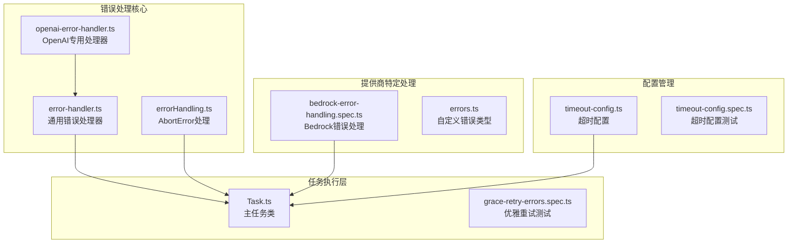
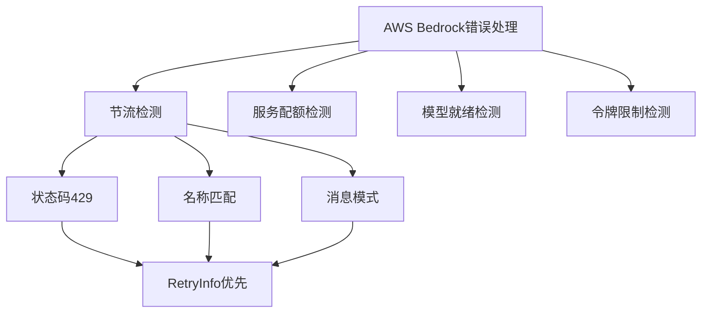
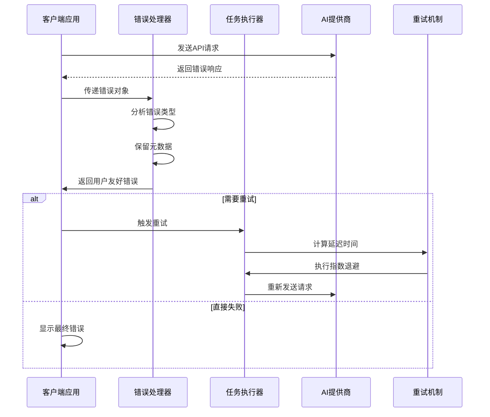
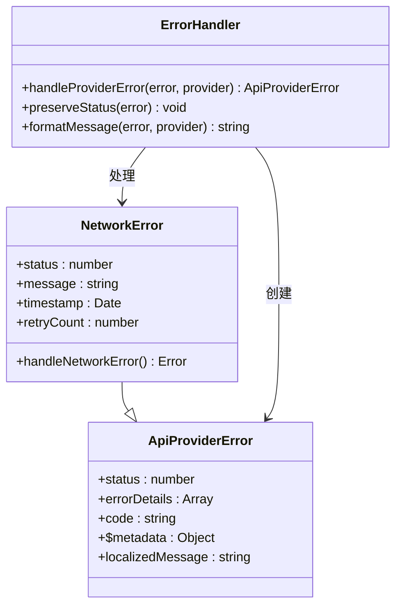
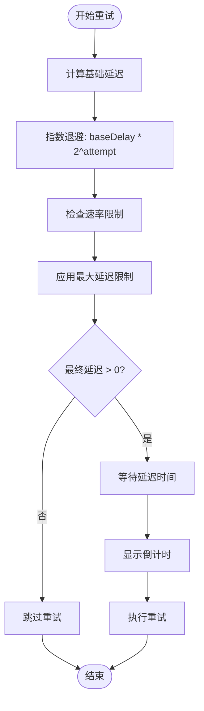
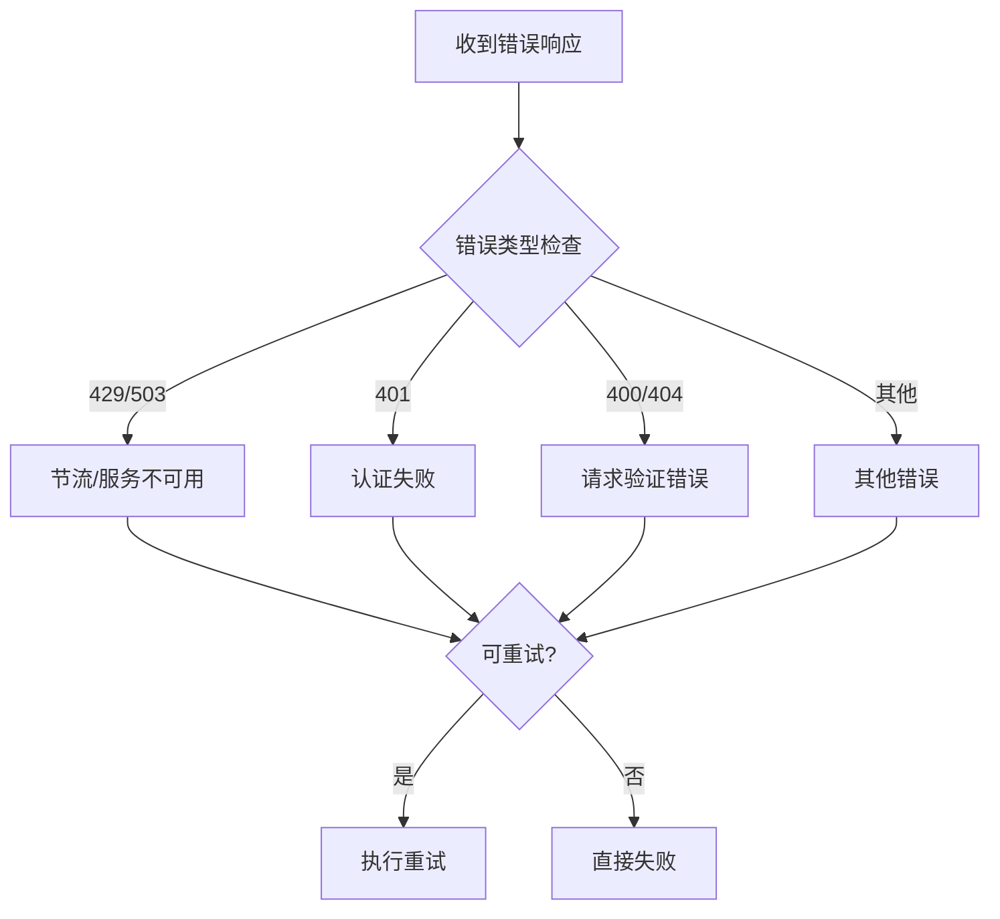
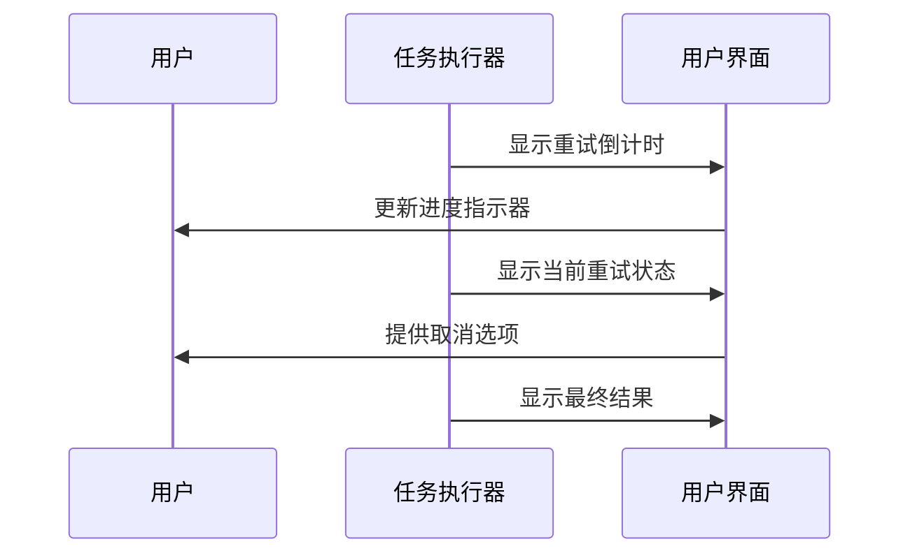
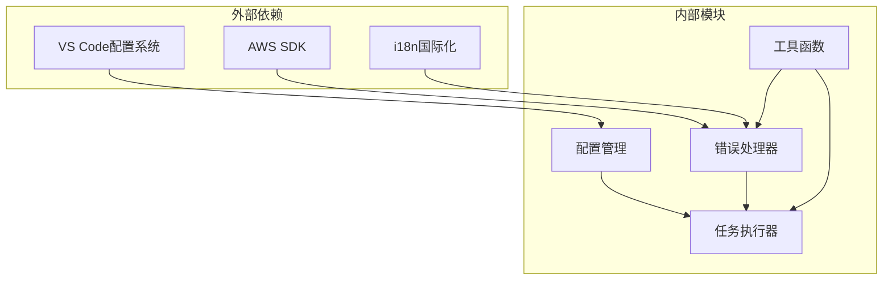

# 错误处理与重试

<cite>
**本文档引用的文件**
- [error-handler.ts](file://src/api/providers/utils/error-handler.ts)
- [openai-error-handler.ts](file://src/api/providers/utils/openai-error-handler.ts)
- [error-handler.spec.ts](file://src/api/providers/utils/__tests__/error-handler.spec.ts)
- [openai-error-handler.spec.ts](file://src/api/providers/utils/__tests__/openai-error-handler.spec.ts)
- [bedrock-error-handling.spec.ts](file://src/api/providers/__tests__/bedrock-error-handling.spec.ts)
- [Task.ts](file://src/core/task/Task.ts)
- [grace-retry-errors.spec.ts](file://src/core/task/__tests__/grace-retry-errors.spec.ts)
- [errorHandling.ts](file://src/utils/errorHandling.ts)
- [errors.ts](file://src/utils/errors.ts)
- [timeout-config.ts](file://src/api/providers/utils/timeout-config.ts)
- [timeout-config.spec.ts](file://src/api/providers/utils/__tests__/timeout-config.spec.ts)
</cite>

## 目录
1. [简介](#简介)
2. [项目结构](#项目结构)
3. [核心组件](#核心组件)
4. [架构概览](#架构概览)
5. [详细组件分析](#详细组件分析)
6. [依赖关系分析](#依赖关系分析)
7. [性能考虑](#性能考虑)
8. [故障排除指南](#故障排除指南)
9. [结论](#结论)

## 简介

本文件详细阐述了Njust-AI项目中AI API调用的错误处理与重试机制。该系统实现了全面的错误分类、智能重试策略、超时管理和连接优化，确保在各种异常情况下都能提供稳定可靠的AI服务。

系统主要涵盖以下关键特性：
- 多层次错误分类与处理策略
- 智能指数退避重试机制
- 统一的错误消息格式化
- 详细的错误元数据保留
- 针对不同提供商的特定错误处理
- 完善的超时配置与连接管理

## 项目结构

错误处理与重试机制分布在多个关键模块中：

**图表来源**
- [error-handler.ts:1-116](file://src/api/providers/utils/error-handler.ts#L1-L116)
- [Task.ts:4960-5033](file://src/core/task/Task.ts#L4960-L5033)
- [bedrock-error-handling.spec.ts:1-561](file://src/api/providers/__tests__/bedrock-error-handling.spec.ts#L1-L561)

**章节来源**
- [error-handler.ts:1-116](file://src/api/providers/utils/error-handler.ts#L1-L116)
- [Task.ts:4960-5033](file://src/core/task/Task.ts#L4960-L5033)

## 核心组件

### 通用错误处理器

通用错误处理器是整个错误处理系统的核心，负责将技术性错误转换为用户友好的消息，同时保留重要的元数据用于重试逻辑。

**关键特性：**
- **状态码保留**：自动提取并保留HTTP状态码
- **错误详情保留**：维护结构化错误详情（如RetryInfo）
- **AWS元数据支持**：特殊处理AWS SDK错误格式
- **本地化支持**：通过i18n系统支持多语言错误消息

### 任务重试引擎

Task类实现了复杂的重试机制，包括指数退避、速率限制尊重和优雅重试策略。

**重试策略特点：**
- **指数退避算法**：基于2的幂次方递增延迟
- **速率限制集成**：自动检测并遵守提供商速率限制
- **429状态优先级**：优先使用提供商提供的RetryInfo
- **中断响应**：支持用户取消操作

### 提供商特定错误处理

针对不同AI提供商实现了专门的错误处理逻辑：

**图表来源**
- [bedrock-error-handling.spec.ts:70-198](file://src/api/providers/__tests__/bedrock-error-handling.spec.ts#L70-L198)

**章节来源**
- [error-handler.ts:38-107](file://src/api/providers/utils/error-handler.ts#L38-L107)
- [Task.ts:4962-5033](file://src/core/task/Task.ts#L4962-L5033)
- [bedrock-error-handling.spec.ts:1-561](file://src/api/providers/__tests__/bedrock-error-handling.spec.ts#L1-L561)

## 架构概览

整个错误处理与重试系统采用分层架构设计：

**图表来源**
- [error-handler.ts:38-107](file://src/api/providers/utils/error-handler.ts#L38-L107)
- [Task.ts:4962-5033](file://src/core/task/Task.ts#L4962-L5033)

## 详细组件分析

### 错误分类与处理策略

系统实现了多层次的错误分类机制：

#### 1. 网络错误处理

网络错误是最常见的API调用问题，系统提供了完整的处理策略：

**图表来源**
- [error-handler.ts:38-107](file://src/api/providers/utils/error-handler.ts#L38-L107)

#### 2. 认证失败处理

认证错误具有特殊的处理逻辑，特别是API密钥验证：

**关键处理点：**
- **ByteString转换错误**：专门识别并处理OpenAI兼容SDK的API密钥错误
- **状态码401保留**：确保认证失败状态码正确传递
- **用户友好提示**：提供清晰的认证失败原因说明

#### 3. 速率限制处理

系统实现了智能的速率限制检测和处理：

**检测机制：**
- **HTTP状态码429**：标准的速率限制响应
- **AWS SDK元数据**：从`$metadata.httpStatusCode`提取状态
- **异常名称匹配**：识别`ThrottlingException`等特定异常
- **消息模式匹配**：检测包含"throttled"、"rate limit"等关键词的消息

#### 4. 模型过载处理

对于模型过载或服务不可用的情况：

**处理策略：**
- **立即重试**：对于临时性过载错误
- **延迟重试**：根据错误详情计算合适的等待时间
- **降级处理**：在严重过载时提供降级选项

**章节来源**
- [error-handler.spec.ts:1-284](file://src/api/providers/utils/__tests__/error-handler.spec.ts#L1-L284)
- [bedrock-error-handling.spec.ts:70-198](file://src/api/providers/__tests__/bedrock-error-handling.spec.ts#L70-L198)

### 重试机制实现原理

重试机制是系统的核心功能之一，实现了智能的错误恢复策略：

#### 指数退避算法

**图表来源**
- [Task.ts:4962-5033](file://src/core/task/Task.ts#L4962-L5033)

#### 关键参数配置

**重试参数：**
- **基础延迟**：可配置的初始等待时间
- **最大重试次数**：防止无限重试的保护机制
- **最大退避时间**：避免过长等待的上限
- **速率限制窗口**：尊重提供商的请求频率限制

#### 条件判断逻辑

重试决策基于多种条件：

**图表来源**
- [Task.ts:4980-4994](file://src/core/task/Task.ts#L4980-L4994)

**章节来源**
- [Task.ts:4962-5033](file://src/core/task/Task.ts#L4962-L5033)
- [grace-retry-errors.spec.ts:280-352](file://src/core/task/__tests__/grace-retry-errors.spec.ts#L280-L352)

### 超时配置与连接管理

系统提供了灵活的超时配置和连接管理机制：

#### 超时配置

**配置项：**
- **请求超时**：单个API请求的最大等待时间
- **读取超时**：从服务器接收数据的超时时间
- **连接超时**：建立网络连接的超时时间

**配置实现：**
- **用户可配置**：通过VS Code设置界面调整超时值
- **默认值**：提供合理的默认超时配置
- **动态调整**：根据网络状况自动调整超时策略

#### 连接管理

**连接优化：**
- **连接池管理**：复用已建立的连接减少开销
- **连接健康检查**：定期验证连接有效性
- **自动重连**：在网络中断后自动尝试重连

**章节来源**
- [timeout-config.ts](file://src/api/providers/utils/timeout-config.ts)
- [timeout-config.spec.ts:1-102](file://src/api/providers/utils/__tests__/timeout-config.spec.ts#L1-L102)

### 用户反馈机制

系统实现了多层次的用户反馈机制：

#### 实时进度反馈

#### 错误消息格式化

系统确保错误消息既对用户友好又包含足够的技术信息：

**消息格式：**
- **状态码前缀**：便于程序解析的数字状态码
- **详细描述**：人类可读的错误说明
- **调试信息**：保留原始错误详情用于诊断

**章节来源**
- [error-handler.ts:48-107](file://src/api/providers/utils/error-handler.ts#L48-L107)
- [Task.ts:4996-5011](file://src/core/task/Task.ts#L4996-L5011)

## 依赖关系分析

错误处理与重试机制涉及多个模块间的复杂交互：

**图表来源**
- [error-handler.ts:12-13](file://src/api/providers/utils/error-handler.ts#L12-L13)
- [Task.ts:4964-4965](file://src/core/task/Task.ts#L4964-L4965)

**章节来源**
- [error-handler.ts:1-116](file://src/api/providers/utils/error-handler.ts#L1-L116)
- [Task.ts:4960-5033](file://src/core/task/Task.ts#L4960-L5033)

## 性能考虑

### 内存管理

系统在错误处理过程中特别注意内存使用：

- **错误对象复用**：避免创建不必要的中间对象
- **异步处理**：使用Promise和async/await避免阻塞主线程
- **资源清理**：及时释放网络连接和临时资源

### 网络优化

**连接优化策略：**
- **持久连接**：复用HTTP连接减少握手开销
- **压缩传输**：启用GZIP压缩减少数据传输量
- **批量处理**：合并多个小请求提高效率

### 缓存策略

系统利用缓存机制提升性能：

- **错误类型缓存**：快速识别已知错误类型
- **配置缓存**：避免重复读取配置信息
- **连接缓存**：重用已验证的连接

## 故障排除指南

### 常见问题诊断

#### 重试循环问题

**症状：** 应用陷入无限重试循环

**诊断步骤：**
1. 检查错误日志中的重试次数
2. 验证速率限制配置是否正确
3. 确认提供商API状态正常

**解决方案：**
- 调整最大重试次数
- 检查网络连接稳定性
- 验证API密钥有效性

#### 超时问题

**症状：** 请求经常超时

**诊断方法：**
1. 检查当前网络延迟
2. 验证超时配置是否合理
3. 监控提供商API性能

**解决策略：**
- 增加超时阈值
- 优化网络连接
- 考虑使用CDN加速

#### 认证失败

**症状：** 反复出现401错误

**排查步骤：**
1. 验证API密钥格式正确
2. 检查密钥权限范围
3. 确认密钥未过期

**修复方案：**
- 重新生成API密钥
- 更新配置文件
- 检查防火墙设置

### 调试技巧

**启用详细日志：**
- 在开发环境中启用DEBUG级别日志
- 监控网络请求和响应
- 记录错误发生的时间和上下文

**性能监控：**
- 监控重试成功率
- 跟踪平均响应时间
- 分析错误分布模式

**章节来源**
- [errorHandling.ts:9-15](file://src/utils/errorHandling.ts#L9-L15)
- [errors.ts:1-6](file://src/utils/errors.ts#L1-L6)

## 结论

Njust-AI项目的错误处理与重试机制展现了现代AI应用的最佳实践。通过分层架构设计、智能重试策略和完善的用户反馈机制，系统能够在各种异常情况下保持稳定运行。

**主要优势：**
- **全面的错误覆盖**：支持多种错误类型和提供商
- **智能重试策略**：基于指数退避和速率限制的智能重试
- **优秀的用户体验**：提供清晰的错误信息和进度反馈
- **高度可配置**：支持用户自定义各种参数
- **强大的扩展性**：易于添加新的提供商和错误类型

**未来改进方向：**
- 增加机器学习驱动的重试决策
- 实现更精细的错误分类和处理
- 优化性能监控和告警机制
- 扩展对更多AI提供商的支持

这套错误处理与重试机制为AI应用的可靠性提供了坚实保障，是构建稳定AI服务的重要基础设施。