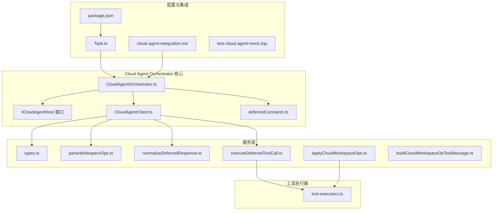
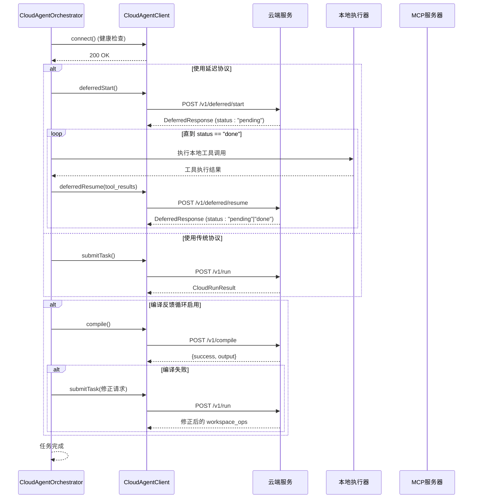
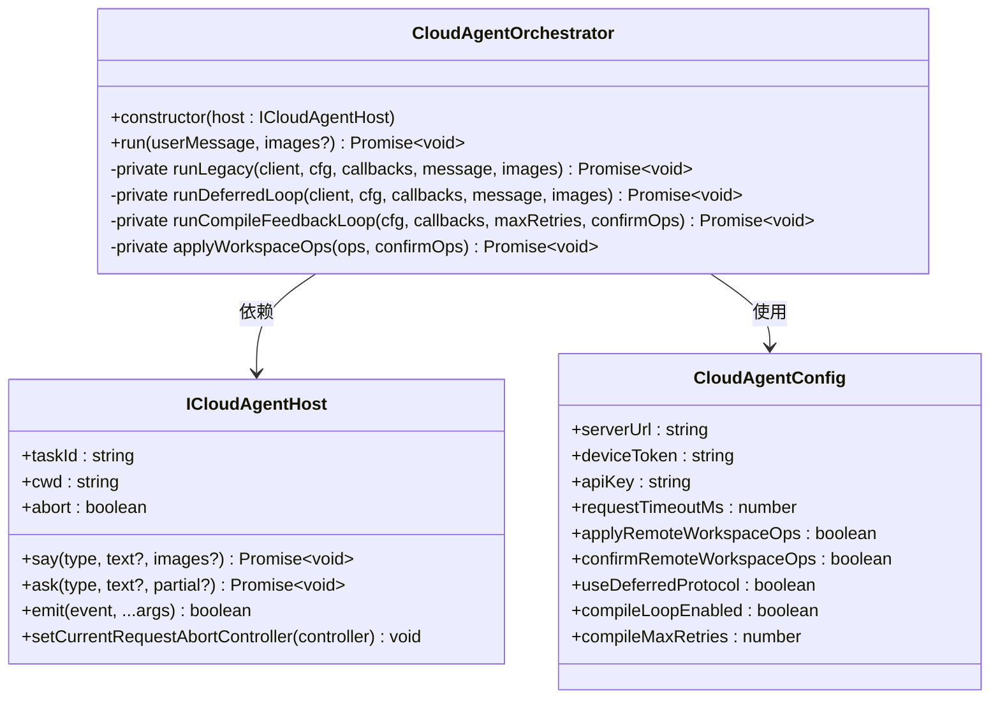
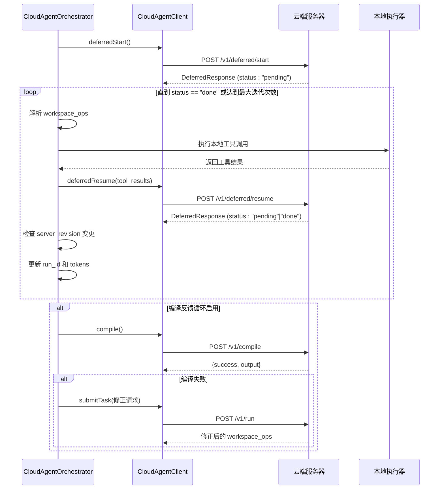
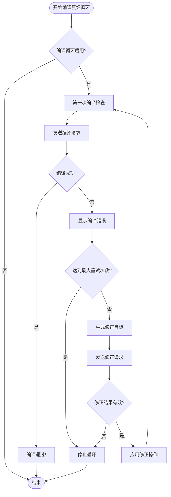
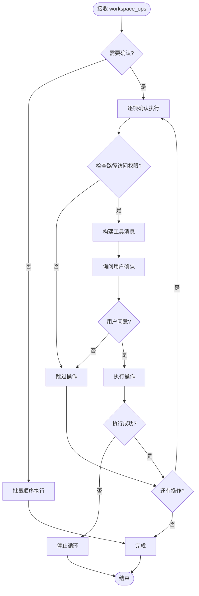
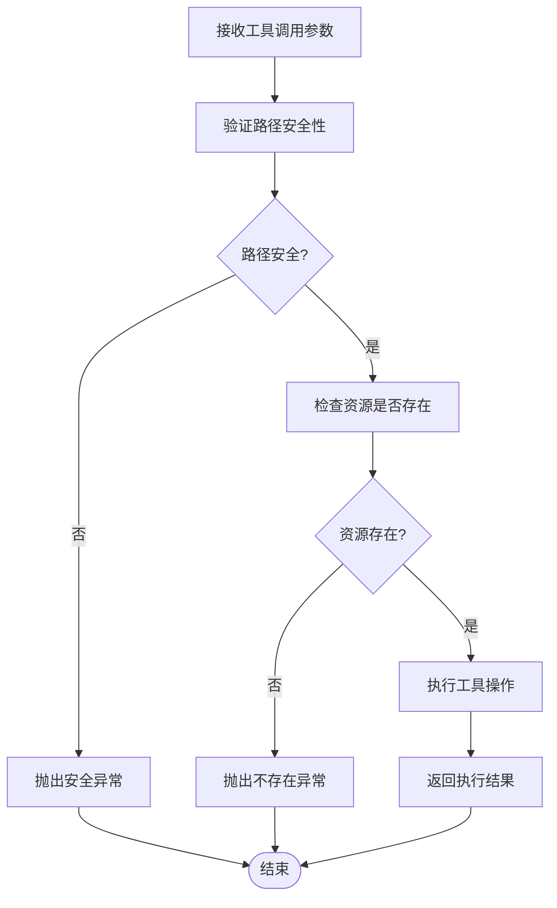
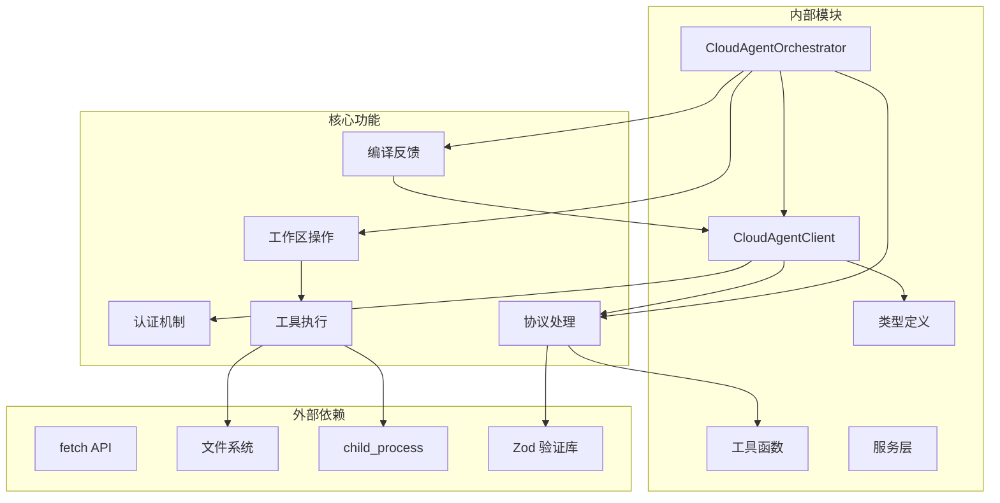

# Cloud Agent 云代理系统

<cite>
**本文档引用的文件**
- [CloudAgentOrchestrator.ts](file://src/core/task/CloudAgentOrchestrator.ts)
- [CloudAgentClient.ts](file://src/services/cloud-agent/CloudAgentClient.ts)
- [types.ts](file://src/services/cloud-agent/types.ts)
- [executeDeferredToolCall.ts](file://src/services/cloud-agent/executeDeferredToolCall.ts)
- [parseWorkspaceOps.ts](file://src/services/cloud-agent/parseWorkspaceOps.ts)
- [normalizeDeferredResponse.ts](file://src/services/cloud-agent/normalizeDeferredResponse.ts)
- [applyCloudWorkspaceOps.ts](file://src/services/cloud-agent/applyCloudWorkspaceOps.ts)
- [buildCloudWorkspaceOpToolMessage.ts](file://src/services/cloud-agent/buildCloudWorkspaceOpToolMessage.ts)
- [deferredConstants.ts](file://src/services/cloud-agent/deferredConstants.ts)
- [tool-executors.ts](file://src/services/mcp-server/tool-executors.ts)
- [Task.ts](file://src/core/task/Task.ts)
- [cloud-agent-integration.md](file://docs/cloud-agent-integration.md)
- [package.json](file://src/package.json)
- [test-cloud-agent-mock.mjs](file://src/test-cloud-agent-mock.mjs)
</cite>

## 更新摘要
**变更内容**
- CloudAgentOrchestrator 成为独立组件，提供完整的任务编排能力
- 新增延迟协议循环执行机制，支持多轮交互和工具调用
- 实现编译反馈循环，自动处理编译错误和代码修正
- 增强工作区操作确认系统，支持逐项确认和批量执行
- 完善错误处理和超时控制机制

## 目录
1. [简介](#简介)
2. [项目结构](#项目结构)
3. [核心组件](#核心组件)
4. [架构概览](#架构概览)
5. [详细组件分析](#详细组件分析)
6. [依赖关系分析](#依赖关系分析)
7. [性能考虑](#性能考虑)
8. [故障排除指南](#故障排除指南)
9. [结论](#结论)
10. [附录](#附录)

## 简介

Cloud Agent 云代理系统是一个基于 REST API 的分布式任务执行框架，专为 NJUST AI CJ 扩展设计。该系统通过云端代理与本地扩展的协作机制，实现了智能任务调度、工具调用映射、工作区操作处理和编译反馈循环等核心功能。

**重大更新**：系统现已重构为以 CloudAgentOrchestrator 为核心的独立组件架构，显著增强了与云端代理的交互能力和任务编排能力。

系统采用延迟协议（Deferred Protocol）设计，通过分阶段的交互模式，将复杂的任务分解为可管理的步骤，确保在云端和本地之间高效传递控制流和数据流。

## 项目结构

Cloud Agent 系统主要分布在以下关键目录中：

**图表来源**
- [CloudAgentOrchestrator.ts:106-588](file://src/core/task/CloudAgentOrchestrator.ts#L106-L588)
- [CloudAgentClient.ts:60-200](file://src/services/cloud-agent/CloudAgentClient.ts#L60-L200)
- [types.ts:1-106](file://src/services/cloud-agent/types.ts#L1-L106)

**章节来源**
- [CloudAgentOrchestrator.ts:106-588](file://src/core/task/CloudAgentOrchestrator.ts#L106-L588)
- [cloud-agent-integration.md:1-351](file://docs/cloud-agent-integration.md#L1-L351)

## 核心组件

### CloudAgentOrchestrator - 独立任务编排器

CloudAgentOrchestrator 是系统的核心编排组件，负责管理整个 Cloud Agent 任务生命周期，提供完整的任务执行、监控和错误处理能力。

**主要功能特性：**
- 独立的任务编排和生命周期管理
- 支持延迟协议和传统协议两种执行模式
- 智能的编译反馈循环处理
- 工作区操作的确认和应用系统
- 完善的错误处理和超时控制

### CloudAgentClient - 主要客户端类

CloudAgentClient 是系统的核心组件，负责与云端服务进行 HTTP 通信，处理认证、请求构建和响应解析。

**主要功能特性：**
- 设备令牌认证机制
- API 密钥支持
- 超时和中断处理
- JSON 响应解析
- 延迟协议支持

### 工作区操作处理

系统提供了完整的结构化工作区操作处理能力，包括文件写入、差异应用和批量操作执行。

**支持的操作类型：**
- `write_file`: 创建或覆盖文件
- `apply_diff`: 应用 SEARCH/REPLACE 式差异

### 工具调用映射

系统实现了从云端工具调用到本地执行器的完整映射机制，支持多种文件操作和命令执行。

**映射关系：**
- `read_file` → `execReadFile`
- `write_file` → `execWriteFile`
- `apply_diff` → `execApplyDiff`
- `list_files` → `execListFiles`
- `search_files` → `execSearchFiles`
- `execute_command` → `execCommand`

**章节来源**
- [CloudAgentOrchestrator.ts:106-588](file://src/core/task/CloudAgentOrchestrator.ts#L106-L588)
- [CloudAgentClient.ts:43-339](file://src/services/cloud-agent/CloudAgentClient.ts#L43-L339)
- [types.ts:1-106](file://src/services/cloud-agent/types.ts#L1-L106)
- [executeDeferredToolCall.ts:1-95](file://src/services/cloud-agent/executeDeferredToolCall.ts#L1-L95)

## 架构概览

Cloud Agent 系统采用分层架构设计，通过清晰的职责分离实现了高内聚、低耦合的系统结构。

**图表来源**
- [cloud-agent-integration.md:18-207](file://docs/cloud-agent-integration.md#L18-L207)
- [CloudAgentOrchestrator.ts:109-153](file://src/core/task/CloudAgentOrchestrator.ts#L109-L153)
- [CloudAgentOrchestrator.ts:225-438](file://src/core/task/CloudAgentOrchestrator.ts#L225-L438)

## 详细组件分析

### CloudAgentOrchestrator 类设计

**图表来源**
- [CloudAgentOrchestrator.ts:106-153](file://src/core/task/CloudAgentOrchestrator.ts#L106-L153)
- [CloudAgentOrchestrator.ts:30-43](file://src/core/task/CloudAgentOrchestrator.ts#L30-L43)
- [CloudAgentOrchestrator.ts:45-82](file://src/core/task/CloudAgentOrchestrator.ts#L45-L82)

### 延迟协议执行机制

**图表来源**
- [CloudAgentOrchestrator.ts:225-438](file://src/core/task/CloudAgentOrchestrator.ts#L225-L438)
- [CloudAgentOrchestrator.ts:442-536](file://src/core/task/CloudAgentOrchestrator.ts#L442-L536)

### 编译反馈循环机制

**图表来源**
- [CloudAgentOrchestrator.ts:442-536](file://src/core/task/CloudAgentOrchestrator.ts#L442-L536)

### 工作区操作确认系统

**图表来源**
- [CloudAgentOrchestrator.ts:540-587](file://src/core/task/CloudAgentOrchestrator.ts#L540-L587)

**章节来源**
- [CloudAgentOrchestrator.ts:106-588](file://src/core/task/CloudAgentOrchestrator.ts#L106-L588)
- [CloudAgentClient.ts:259-339](file://src/services/cloud-agent/CloudAgentClient.ts#L259-L339)

### 工具执行器安全机制

系统实现了严格的安全控制机制，确保所有文件操作都在工作区内进行，并防止路径遍历攻击。

**图表来源**
- [tool-executors.ts:13-20](file://src/services/mcp-server/tool-executors.ts#L13-L20)
- [tool-executors.ts:28-50](file://src/services/mcp-server/tool-executors.ts#L28-L50)

**章节来源**
- [tool-executors.ts:1-208](file://src/services/mcp-server/tool-executors.ts#L1-L208)

## 依赖关系分析

Cloud Agent 系统的依赖关系体现了清晰的分层架构和模块化设计。

**图表来源**
- [CloudAgentOrchestrator.ts:1-25](file://src/core/task/CloudAgentOrchestrator.ts#L1-L25)
- [CloudAgentClient.ts:1-15](file://src/services/cloud-agent/CloudAgentClient.ts#L1-L15)

**章节来源**
- [CloudAgentOrchestrator.ts:1-589](file://src/core/task/CloudAgentOrchestrator.ts#L1-L589)
- [CloudAgentClient.ts:1-452](file://src/services/cloud-agent/CloudAgentClient.ts#L1-L452)

## 性能考虑

### 请求超时和中断处理

系统实现了灵活的超时和中断机制，确保长时间运行的任务能够及时响应用户的取消操作。

**超时配置选项：**
- `requestTimeoutMs`: 单个请求的最大等待时间
- 支持动态中断信号传递
- 自动清理资源和事件监听器

### 编译反馈循环优化

系统提供了智能的编译反馈循环，通过多次尝试和错误修正实现自动化的问题解决。

**循环控制参数：**
- `compileLoop.enabled`: 是否启用编译反馈循环
- `compileLoop.maxRetries`: 最大重试次数（1-10）
- 智能错误分类和修复策略

### 工作区操作批处理

系统支持批量工作区操作，通过顺序执行和快速失败机制提高处理效率。

**批处理特性：**
- 支持多操作批量执行
- 失败时立即停止并报告错误
- 可选的逐个确认模式

**章节来源**
- [CloudAgentOrchestrator.ts:448-485](file://src/core/task/CloudAgentOrchestrator.ts#L448-L485)
- [CloudAgentOrchestrator.ts:576-586](file://src/core/task/CloudAgentOrchestrator.ts#L576-L586)

## 故障排除指南

### 常见认证问题

**设备令牌问题：**
- 确认设备令牌已正确生成和存储
- 检查全局状态中的令牌值
- 验证扩展配置中的令牌同步

**API 密钥问题：**
- 确认 API 密钥与服务器配置匹配
- 检查环境变量设置
- 验证请求头中的密钥传递

### 网络连接问题

**健康检查失败：**
- 验证服务器 URL 配置
- 检查网络连通性和防火墙设置
- 确认服务器正在运行

**请求超时问题：**
- 调整 `requestTimeoutMs` 配置
- 检查服务器响应时间
- 考虑网络延迟因素

### 延迟协议问题

**会话串线问题：**
- 检查 `server_revision` 变更日志
- 验证 `run_id` 的连续性
- 确认会话状态的一致性

**工具调用失败：**
- 查看工具执行结果的详细信息
- 检查本地工具的可用性
- 验证工具参数的有效性

### 工作区操作问题

**路径权限问题：**
- 检查工作区边界限制
- 验证文件访问权限
- 确认 `.rooignore` 配置

**操作失败问题：**
- 查看详细的错误信息
- 检查操作参数的有效性
- 验证目标文件的状态

**章节来源**
- [CloudAgentOrchestrator.ts:344-362](file://src/core/task/CloudAgentOrchestrator.ts#L344-L362)
- [CloudAgentClient.ts:32-58](file://src/services/cloud-agent/CloudAgentClient.ts#L32-L58)
- [cloud-agent-integration.md:330-351](file://docs/cloud-agent-integration.md#L330-L351)

## 结论

Cloud Agent 云代理系统通过精心设计的架构和完善的错误处理机制，为分布式任务执行提供了可靠的基础设施。**重大更新后**，系统的主要优势包括：

1. **独立组件化**：CloudAgentOrchestrator 成为独立的编排组件，提供清晰的职责分离
2. **增强的协议支持**：完整的延迟协议循环执行机制，支持多轮交互
3. **智能编译反馈**：自动化的编译错误检测和代码修正循环
4. **安全的工作区操作**：支持逐项确认和批量执行的双重模式
5. **完善的错误处理**：多层次的错误检测、报告和恢复机制
6. **灵活的配置选项**：丰富的配置参数支持不同的使用场景

该系统为 NJUST AI CJ 扩展提供了强大的云端代理能力，支持复杂的分布式任务执行场景，显著提升了系统的可靠性和用户体验。

## 附录

### 配置选项参考

**核心配置项：**
- `njust-ai.cloudAgent.serverUrl`: 云端服务地址
- `njust-ai.cloudAgent.deviceToken`: 自动生成的设备令牌
- `njust-ai.cloudAgent.apiKey`: API 认证密钥
- `njust-ai.cloudAgent.requestTimeoutMs`: 请求超时时间

**工作区操作配置：**
- `njust-ai.cloudAgent.applyRemoteWorkspaceOps`: 是否应用远程工作区操作
- `njust-ai.cloudAgent.confirmRemoteWorkspaceOps`: 是否显示确认界面

**协议配置：**
- `njust-ai.cloudAgent.deferredProtocol`: 是否使用延迟协议

**编译反馈循环配置：**
- `njust-ai.cloudAgent.compileLoop.enabled`: 是否启用编译反馈循环
- `njust-ai.cloudAgent.compileLoop.maxRetries`: 编译循环最大重试次数

### 开发者指南

**本地联调步骤：**
1. 启动模拟服务器：`node src/test-cloud-agent-mock.mjs`
2. 配置扩展设置：设置 `cloudAgent.serverUrl` 和 `cloudAgent.apiKey`
3. 测试 Cloud Agent 模式
4. 使用 Mock API Key 进行认证

**章节来源**
- [package.json:983-1031](file://src/package.json#L983-L1031)
- [test-cloud-agent-mock.mjs:170-213](file://src/test-cloud-agent-mock.mjs#L170-L213)