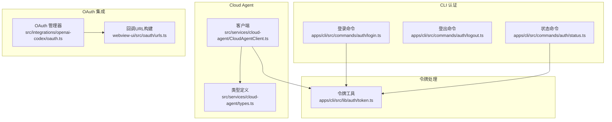
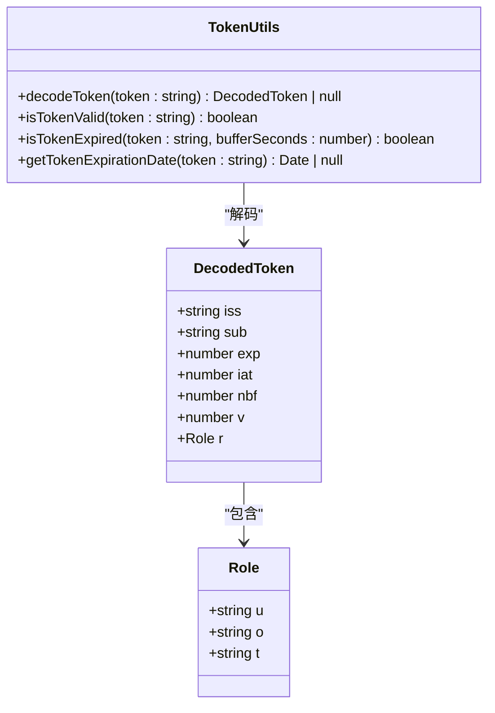
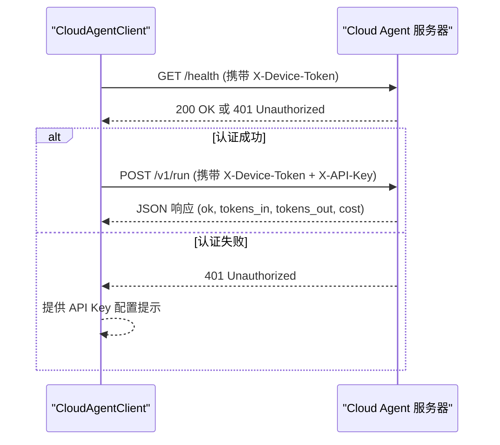
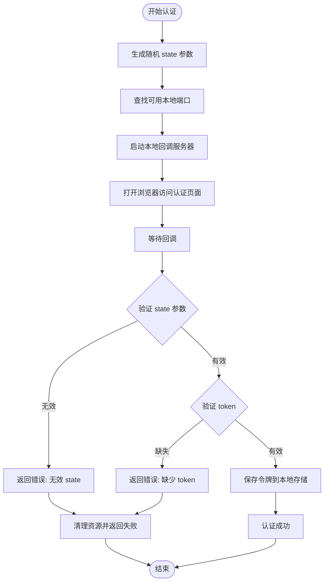
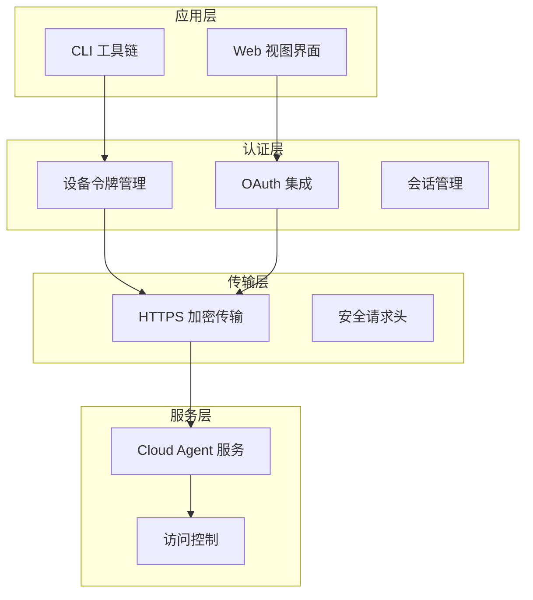
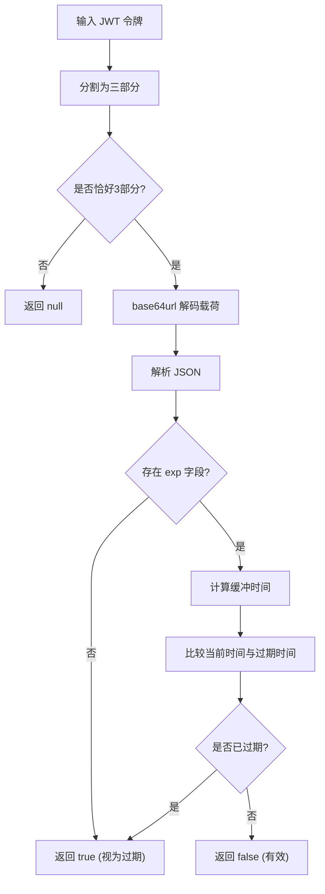
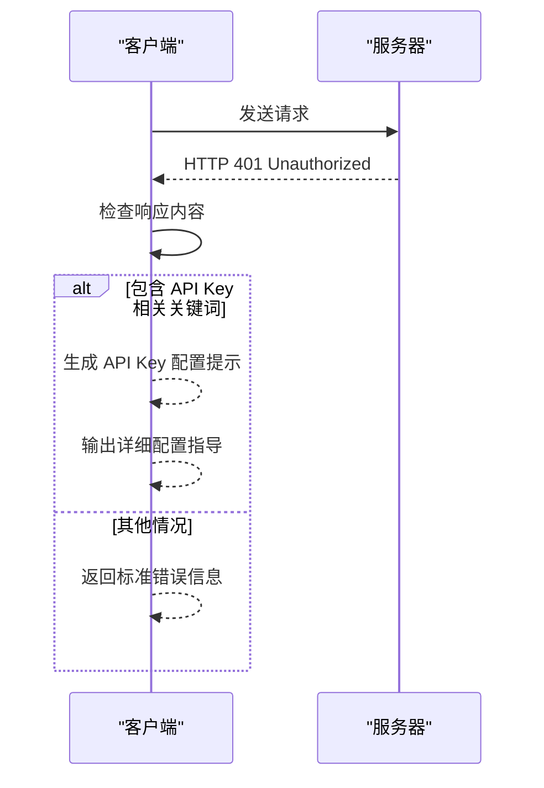
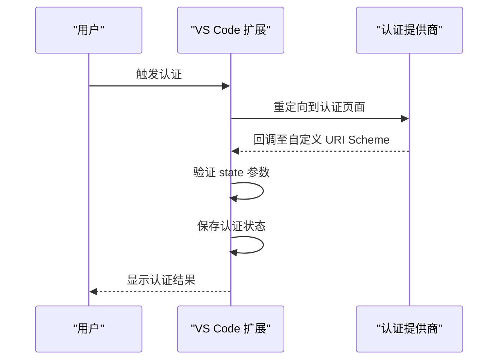
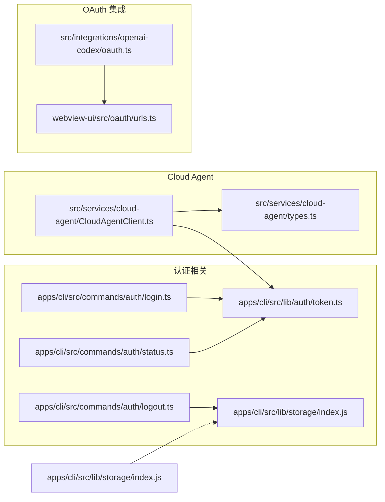

# 鉴权与安全机制

<cite>
**本文档引用的文件**
- [CloudAgentClient.ts](file://src/services/cloud-agent/CloudAgentClient.ts)
- [types.ts](file://src/services/cloud-agent/types.ts)
- [token.ts](file://apps/cli/src/lib/auth/token.ts)
- [login.ts](file://apps/cli/src/commands/auth/login.ts)
- [logout.ts](file://apps/cli/src/commands/auth/logout.ts)
- [status.ts](file://apps/cli/src/commands/auth/status.ts)
- [oauth.ts](file://src/integrations/openai-codex/oauth.ts)
- [urls.ts](file://webview-ui/src/oauth/urls.ts)
</cite>

## 目录
1. [简介](#简介)
2. [项目结构](#项目结构)
3. [核心组件](#核心组件)
4. [架构概览](#架构概览)
5. [详细组件分析](#详细组件分析)
6. [依赖关系分析](#依赖关系分析)
7. [性能考虑](#性能考虑)
8. [故障排除指南](#故障排除指南)
9. [结论](#结论)
10. [附录](#附录)

## 简介

本文件为 Cloud Agent 鉴权与安全机制的全面技术文档。重点介绍设备令牌的生成、验证、刷新机制，说明安全认证流程、会话管理策略、权限控制模型。深入解释客户端身份验证、API 密钥管理、访问控制列表的实现方式。结合具体代码示例展示鉴权配置、安全最佳实践、漏洞防护措施，并提供安全审计指南、合规性检查清单、应急响应流程。

## 项目结构

Cloud Agent 安全体系主要分布在以下模块：
- CLI 认证命令：登录、登出、状态查询
- 设备令牌处理：JWT 解码、过期验证
- Cloud Agent 客户端：设备令牌与 API 密钥传输
- OAuth 集成：外部服务认证支持
- 存储管理：凭据持久化

**图表来源**
- [login.ts:1-178](file://apps/cli/src/commands/auth/login.ts#L1-L178)
- [logout.ts:1-28](file://apps/cli/src/commands/auth/logout.ts#L1-L28)
- [status.ts:1-98](file://apps/cli/src/commands/auth/status.ts#L1-L98)
- [token.ts:1-62](file://apps/cli/src/lib/auth/token.ts#L1-L62)
- [CloudAgentClient.ts:1-339](file://src/services/cloud-agent/CloudAgentClient.ts#L1-L339)
- [types.ts:1-102](file://src/services/cloud-agent/types.ts#L1-L102)
- [oauth.ts:1-39](file://src/integrations/openai-codex/oauth.ts#L1-L39)
- [urls.ts:1-14](file://webview-ui/src/oauth/urls.ts#L1-L14)

**章节来源**
- [login.ts:1-178](file://apps/cli/src/commands/auth/login.ts#L1-L178)
- [logout.ts:1-28](file://apps/cli/src/commands/auth/logout.ts#L1-L28)
- [status.ts:1-98](file://apps/cli/src/commands/auth/status.ts#L1-L98)
- [token.ts:1-62](file://apps/cli/src/lib/auth/token.ts#L1-L62)
- [CloudAgentClient.ts:1-339](file://src/services/cloud-agent/CloudAgentClient.ts#L1-L339)
- [types.ts:1-102](file://src/services/cloud-agent/types.ts#L1-L102)
- [oauth.ts:1-39](file://src/integrations/openai-codex/oauth.ts#L1-L39)
- [urls.ts:1-14](file://webview-ui/src/oauth/urls.ts#L1-L14)

## 核心组件

### 设备令牌管理

设备令牌采用 JWT 格式，包含标准声明（iss、sub、exp、iat、nbf）和扩展字段（版本号 v、权限信息 r）。令牌验证通过以下函数实现：

- `isTokenValid(token: string): boolean` - 基础有效性检查
- `isTokenExpired(token: string, bufferSeconds?: number): boolean` - 过期时间检查（可设置缓冲期）
- `getTokenExpirationDate(token: string): Date | null` - 获取过期时间

**图表来源**
- [token.ts:1-62](file://apps/cli/src/lib/auth/token.ts#L1-L62)

**章节来源**
- [token.ts:1-62](file://apps/cli/src/lib/auth/token.ts#L1-L62)

### Cloud Agent 客户端安全

Cloud Agent 客户端负责与云端服务进行安全通信，使用双重认证机制：

- 设备令牌（X-Device-Token）：用于设备身份识别
- API 密钥（X-API-Key）：用于服务端访问控制

**图表来源**
- [CloudAgentClient.ts:118-141](file://src/services/cloud-agent/CloudAgentClient.ts#L118-L141)
- [CloudAgentClient.ts:143-206](file://src/services/cloud-agent/CloudAgentClient.ts#L143-L206)

**章节来源**
- [CloudAgentClient.ts:43-105](file://src/services/cloud-agent/CloudAgentClient.ts#L43-L105)
- [types.ts:42-49](file://src/services/cloud-agent/types.ts#L42-L49)

### CLI 认证流程

CLI 提供完整的认证生命周期管理：

**图表来源**
- [login.ts:26-121](file://apps/cli/src/commands/auth/login.ts#L26-L121)

**章节来源**
- [login.ts:1-178](file://apps/cli/src/commands/auth/login.ts#L1-L178)
- [logout.ts:1-28](file://apps/cli/src/commands/auth/logout.ts#L1-L28)
- [status.ts:1-98](file://apps/cli/src/commands/auth/status.ts#L1-L98)

## 架构概览

Cloud Agent 安全架构采用分层设计，确保多维度的安全防护：

**图表来源**
- [CloudAgentClient.ts:96-105](file://src/services/cloud-agent/CloudAgentClient.ts#L96-L105)
- [urls.ts:1-14](file://webview-ui/src/oauth/urls.ts#L1-L14)

## 详细组件分析

### 设备令牌验证机制

设备令牌验证是 Cloud Agent 安全体系的核心，采用以下策略：

#### 令牌结构解析
- 支持标准 JWT 结构（头部.载荷.签名）
- 载荷部分使用 base64url 编码
- 自动填充填充字符以确保解码正确性

#### 时间窗口控制
- 默认缓冲期：24小时，防止时钟偏差导致的误判
- 可配置缓冲期，适应不同业务场景
- 精确到秒的时间戳比较

**图表来源**
- [token.ts:15-47](file://apps/cli/src/lib/auth/token.ts#L15-L47)

**章节来源**
- [token.ts:1-62](file://apps/cli/src/lib/auth/token.ts#L1-L62)

### Cloud Agent 客户端安全实现

#### 请求头安全策略
客户端在每个请求中自动添加必要的安全头信息：

| 头部名称 | 用途 | 必填性 | 示例值 |
|---------|------|--------|--------|
| Content-Type | 指定请求体格式 | 必需 | application/json |
| X-Device-Token | 设备身份标识 | 必需 | 从用户令牌派生 |
| X-API-Key | 服务端访问密钥 | 可选 | 仅在配置时发送 |

#### 错误处理与安全提示
当服务器返回 401 未授权错误时，客户端提供智能诊断提示：

**图表来源**
- [CloudAgentClient.ts:32-41](file://src/services/cloud-agent/CloudAgentClient.ts#L32-L41)

**章节来源**
- [CloudAgentClient.ts:96-105](file://src/services/cloud-agent/CloudAgentClient.ts#L96-L105)
- [CloudAgentClient.ts:32-41](file://src/services/cloud-agent/CloudAgentClient.ts#L32-L41)

### OAuth 集成与外部认证

系统支持多种外部认证提供商，通过统一的回调机制实现安全集成：

#### 回调 URL 构建
- 支持自定义 URI Scheme
- 动态构建提供商特定的认证 URL
- 自动编码特殊字符确保安全性

#### 认证流程

**图表来源**
- [urls.ts:3-13](file://webview-ui/src/oauth/urls.ts#L3-L13)

**章节来源**
- [oauth.ts:1-39](file://src/integrations/openai-codex/oauth.ts#L1-L39)
- [urls.ts:1-14](file://webview-ui/src/oauth/urls.ts#L1-L14)

## 依赖关系分析

**图表来源**
- [login.ts:1-178](file://apps/cli/src/commands/auth/login.ts#L1-L178)
- [logout.ts:1-28](file://apps/cli/src/commands/auth/logout.ts#L1-L28)
- [status.ts:1-98](file://apps/cli/src/commands/auth/status.ts#L1-L98)
- [token.ts:1-62](file://apps/cli/src/lib/auth/token.ts#L1-L62)
- [CloudAgentClient.ts:1-339](file://src/services/cloud-agent/CloudAgentClient.ts#L1-L339)
- [types.ts:1-102](file://src/services/cloud-agent/types.ts#L1-L102)
- [oauth.ts:1-39](file://src/integrations/openai-codex/oauth.ts#L1-L39)
- [urls.ts:1-14](file://webview-ui/src/oauth/urls.ts#L1-L14)

**章节来源**
- [login.ts:1-178](file://apps/cli/src/commands/auth/login.ts#L1-L178)
- [logout.ts:1-28](file://apps/cli/src/commands/auth/logout.ts#L1-L28)
- [status.ts:1-98](file://apps/cli/src/commands/auth/status.ts#L1-L98)
- [token.ts:1-62](file://apps/cli/src/lib/auth/token.ts#L1-L62)
- [CloudAgentClient.ts:1-339](file://src/services/cloud-agent/CloudAgentClient.ts#L1-L339)
- [types.ts:1-102](file://src/services/cloud-agent/types.ts#L1-L102)
- [oauth.ts:1-39](file://src/integrations/openai-codex/oauth.ts#L1-L39)
- [urls.ts:1-14](file://webview-ui/src/oauth/urls.ts#L1-L14)

## 性能考虑

### 认证性能优化

1. **令牌缓存策略**
   - 在内存中缓存最近使用的令牌
   - 设置合理的缓存失效时间
   - 避免频繁的磁盘读取操作

2. **网络请求优化**
   - 合并并发的认证请求
   - 实现请求超时和重试机制
   - 使用连接池减少握手开销

3. **资源管理**
   - 及时关闭本地回调服务器
   - 清理临时文件和进程
   - 监控内存使用情况

### 安全性能平衡

- 在保证安全的前提下最小化性能开销
- 对敏感操作实施异步处理
- 实现渐进式认证验证

## 故障排除指南

### 常见认证问题

#### 401 未授权错误
当服务器返回 401 错误时，客户端会提供具体的配置指导：

**可能原因及解决方案：**
- API Key 配置错误：检查 VS Code 设置中的 `njust-ai.cloudAgent.apiKey`
- 环境变量未设置：确认 `CLOUD_AGENT_MOCK_API_KEY` 或 `NJUST_CLOUD_AGENT_API_KEY`
- 令牌过期：执行 `njust-ai auth login` 重新认证

#### 令牌验证失败
**排查步骤：**
1. 检查令牌格式是否为有效的 JWT
2. 验证载荷部分的 JSON 格式
3. 确认时间戳字段的有效性
4. 检查缓冲期设置是否合理

#### 网络连接问题
**诊断方法：**
- 验证服务器 URL 的可达性
- 检查防火墙和代理设置
- 确认 HTTPS 证书的有效性
- 测试基本的网络连通性

**章节来源**
- [CloudAgentClient.ts:32-41](file://src/services/cloud-agent/CloudAgentClient.ts#L32-L41)
- [status.ts:37-47](file://apps/cli/src/commands/auth/status.ts#L37-L47)

### 安全事件响应

#### 凭据泄露应急流程
1. 立即撤销受影响的令牌
2. 通知所有相关用户
3. 审计最近的访问日志
4. 更新安全配置
5. 监控异常活动模式

#### 定期安全检查清单
- [ ] 验证所有 API Key 的使用权限
- [ ] 检查令牌过期策略的有效性
- [ ] 审核访问日志中的异常模式
- [ ] 确认网络传输的加密强度
- [ ] 验证存储系统的访问控制

## 结论

Cloud Agent 的鉴权与安全机制通过多层次的设计实现了全面的安全防护。设备令牌验证确保了客户端身份的真实性，Cloud Agent 客户端的安全通信保障了数据传输的机密性和完整性，而完善的 CLI 认证工具链则提供了便捷的用户体验。

该体系的关键优势包括：
- 分层安全设计，各组件职责明确
- 智能的错误诊断和用户指导
- 灵活的配置选项适应不同部署环境
- 完善的审计和监控能力

建议在生产环境中进一步强化安全措施，包括定期的安全评估、持续的威胁监控和及时的补丁更新。

## 附录

### 安全最佳实践

#### 开发阶段
- 使用强随机数生成 state 参数
- 实施严格的输入验证和过滤
- 采用最小权限原则配置 API Key
- 实现详细的日志记录和审计追踪

#### 生产部署
- 定期轮换 API Key 和证书
- 实施多因素认证机制
- 配置入侵检测和防护系统
- 建立完整的备份和恢复策略

#### 维护管理
- 建立变更管理流程
- 实施定期的安全培训
- 制定应急预案和演练计划
- 建立供应商安全管理规范

### 合规性检查清单

#### 数据保护
- [ ] 符合数据最小化原则
- [ ] 实施数据加密存储
- [ ] 建立数据保留和销毁政策
- [ ] 确保跨境数据传输合规

#### 系统安全
- [ ] 定期进行安全漏洞扫描
- [ ] 实施网络分段和访问控制
- [ ] 建立安全事件响应机制
- [ ] 配置实时监控和告警系统

#### 人员管理
- [ ] 实施背景调查和安全培训
- [ ] 建立权限审批流程
- [ ] 定期进行安全意识教育
- [ ] 建立离职和权限回收机制