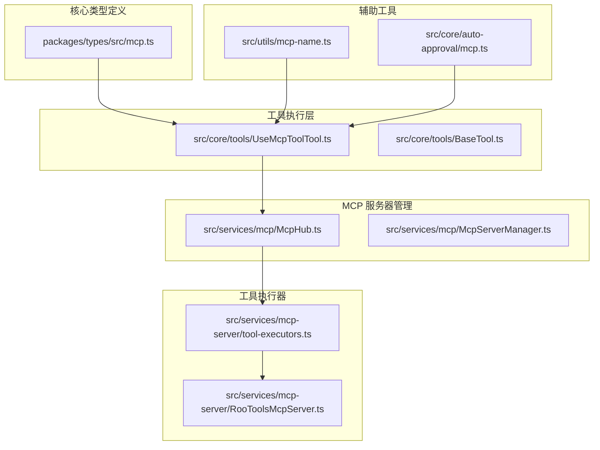
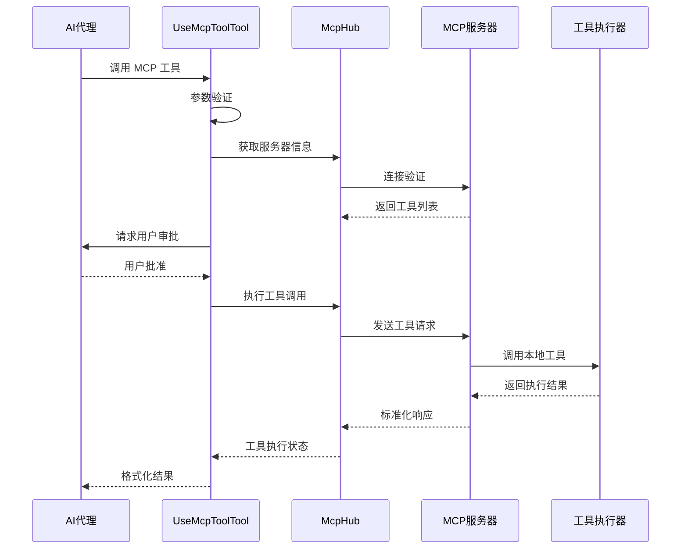
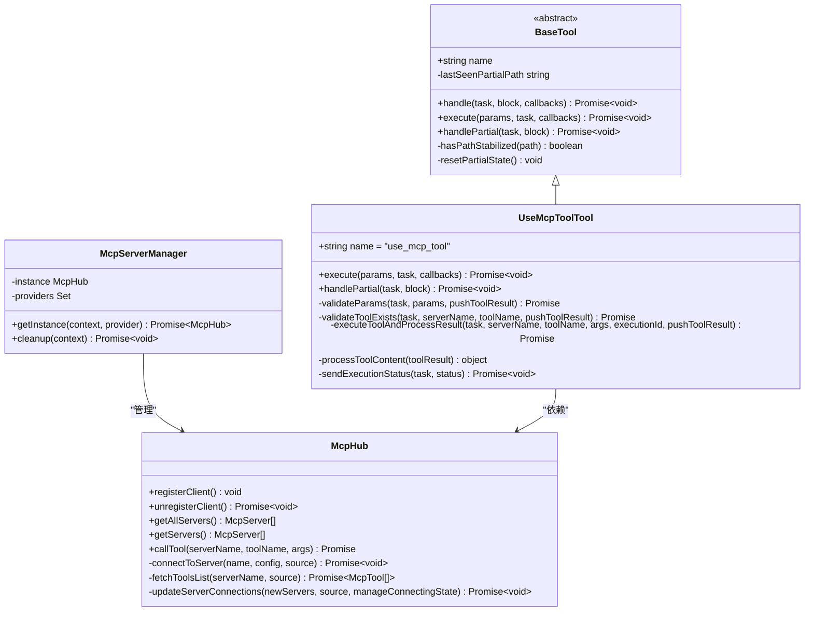
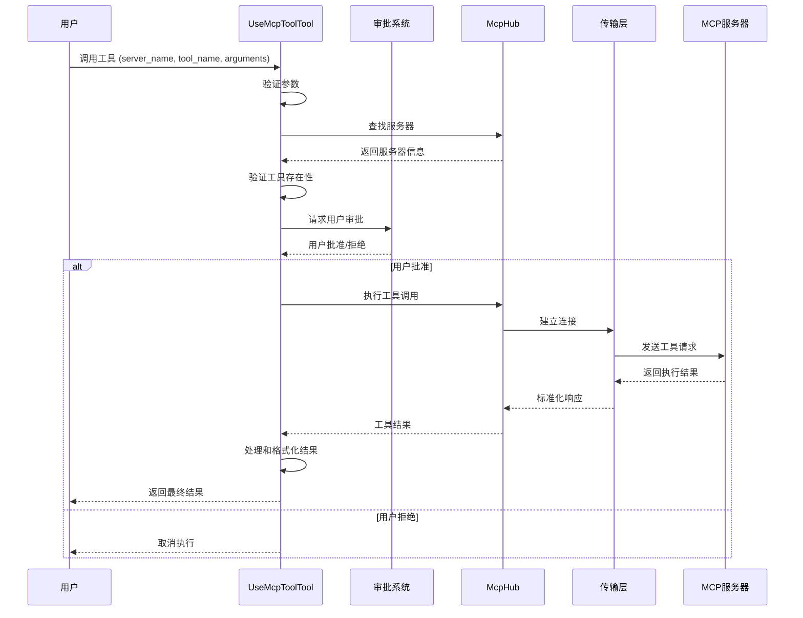
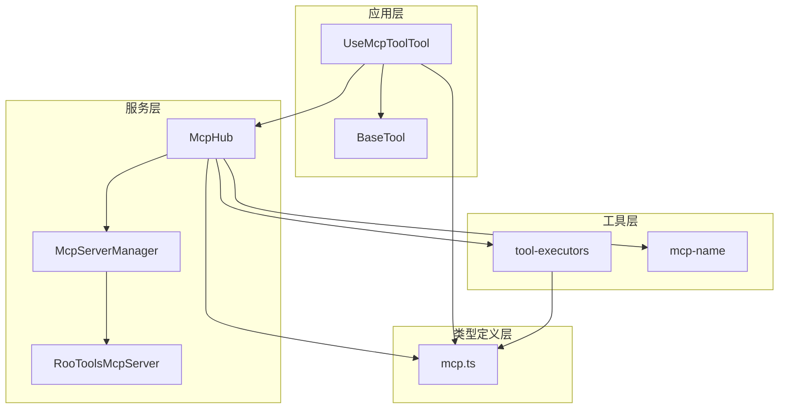

# MCP 工具执行机制

<cite>
**本文档引用的文件**
- [packages/types/src/mcp.ts](file://packages/types/src/mcp.ts)
- [src/core/tools/UseMcpToolTool.ts](file://src/core/tools/UseMcpToolTool.ts)
- [src/services/mcp/McpHub.ts](file://src/services/mcp/McpHub.ts)
- [src/services/mcp/McpServerManager.ts](file://src/services/mcp/McpServerManager.ts)
- [src/services/mcp-server/tool-executors.ts](file://src/services/mcp-server/tool-executors.ts)
- [src/services/mcp-server/RooToolsMcpServer.ts](file://src/services/mcp-server/RooToolsMcpServer.ts)
- [src/core/auto-approval/mcp.ts](file://src/core/auto-approval/mcp.ts)
- [src/utils/mcp-name.ts](file://src/utils/mcp-name.ts)
- [src/core/tools/BaseTool.ts](file://src/core/tools/BaseTool.ts)
- [docs/cangjie-mcp.md](file://docs/cangjie-mcp.md)
</cite>

## 目录
1. [简介](#简介)
2. [项目结构](#项目结构)
3. [核心组件](#核心组件)
4. [架构概览](#架构概览)
5. [详细组件分析](#详细组件分析)
6. [依赖关系分析](#依赖关系分析)
7. [性能考虑](#性能考虑)
8. [故障排除指南](#故障排除指南)
9. [结论](#结论)

## 简介

MCP（Model Context Protocol）工具执行机制是 NJUST_AI 扩展的核心功能之一，它实现了与外部 MCP 服务器的安全交互，为 AI 模型提供了访问本地和远程工具的能力。该机制支持多种传输协议（stdio、SSE、streamable-http），提供了完整的工具调用生命周期管理，包括参数验证、权限控制、安全沙箱、错误处理和超时控制。

该系统设计遵循以下核心原则：
- **安全性优先**：通过路径验证、命令白名单/黑名单、资源限制等多重安全措施
- **标准化接口**：统一的工具调用协议和响应格式
- **可扩展性**：支持多种 MCP 服务器类型和自定义工具
- **可观测性**：完整的执行状态跟踪和错误日志记录

## 项目结构

基于代码库分析，MCP 工具执行机制主要分布在以下几个核心模块：

**图表来源**
- [packages/types/src/mcp.ts:1-187](file://packages/types/src/mcp.ts#L1-L187)
- [src/core/tools/UseMcpToolTool.ts:1-355](file://src/core/tools/UseMcpToolTool.ts#L1-L355)
- [src/services/mcp/McpHub.ts:1-800](file://src/services/mcp/McpHub.ts#L1-L800)

**章节来源**
- [packages/types/src/mcp.ts:1-187](file://packages/types/src/mcp.ts#L1-L187)
- [src/core/tools/UseMcpToolTool.ts:1-355](file://src/core/tools/UseMcpToolTool.ts#L1-L355)
- [src/services/mcp/McpHub.ts:1-800](file://src/services/mcp/McpHub.ts#L1-L800)

## 核心组件

### 类型定义系统

MCP 系统的基础是完整的 TypeScript 类型定义，确保了类型安全和开发体验：

**MCP 执行状态类型**
- `McpExecutionStatus`: 定义了工具执行的四种状态（started、output、completed、error）
- 支持标准化的状态报告和错误处理

**MCP 服务器配置类型**
- `McpServer`: 描述服务器的基本信息、状态和配置
- `McpTool`: 定义工具的元数据和权限设置
- `McpResource`: 资源描述和模板定义

**章节来源**
- [packages/types/src/mcp.ts:24-48](file://packages/types/src/mcp.ts#L24-L48)
- [packages/types/src/mcp.ts:54-90](file://packages/types/src/mcp.ts#L54-L90)

### 工具执行器

`UseMcpToolTool` 是 MCP 工具执行的核心组件，负责处理所有 MCP 工具调用请求：

**主要功能特性**
- 参数验证和解析
- 工具存在性检查
- 用户审批流程集成
- 执行状态跟踪
- 结果格式化和返回

**章节来源**
- [src/core/tools/UseMcpToolTool.ts:27-82](file://src/core/tools/UseMcpToolTool.ts#L27-L82)

### MCP Hub 管理器

`McpHub` 提供了 MCP 服务器的集中管理和连接控制：

**核心职责**
- 服务器配置验证和加载
- 连接状态监控和维护
- 文件变更监听和热重载
- 错误历史记录和报告

**章节来源**
- [src/services/mcp/McpHub.ts:151-176](file://src/services/mcp/McpHub.ts#L151-L176)

## 架构概览

MCP 工具执行机制采用分层架构设计，确保了模块间的清晰分离和高内聚低耦合：

**图表来源**
- [src/core/tools/UseMcpToolTool.ts:30-82](file://src/core/tools/UseMcpToolTool.ts#L30-L82)
- [src/services/mcp/McpHub.ts:884-897](file://src/services/mcp/McpHub.ts#L884-L897)

## 详细组件分析

### 工具执行器类图

**图表来源**
- [src/core/tools/BaseTool.ts:30-167](file://src/core/tools/BaseTool.ts#L30-L167)
- [src/core/tools/UseMcpToolTool.ts:27-355](file://src/core/tools/UseMcpToolTool.ts#L27-L355)
- [src/services/mcp/McpHub.ts:151-176](file://src/services/mcp/McpHub.ts#L151-L176)
- [src/services/mcp/McpServerManager.ts:9-87](file://src/services/mcp/McpServerManager.ts#L9-L87)

### 工具调用序列图

**图表来源**
- [src/core/tools/UseMcpToolTool.ts:30-82](file://src/core/tools/UseMcpToolTool.ts#L30-L82)
- [src/core/tools/UseMcpToolTool.ts:294-351](file://src/core/tools/UseMcpToolTool.ts#L294-L351)

### 安全沙箱实现

MCP 工具执行器实现了多层次的安全保护机制：

**路径安全验证**
- 使用 `ensureWithinWorkspace` 函数确保文件操作仅限于工作区边界
- 通过路径规范化防止目录遍历攻击
- 对相对路径进行严格验证和转换

**命令执行安全**
- 支持命令白名单和黑名单机制
- 实施超时控制防止长时间运行的危险命令
- 限制工作目录范围避免意外的文件系统访问

**资源限制策略**
- 文件大小限制和读取超时
- 目录遍历深度限制
- 正则表达式搜索的性能限制

**章节来源**
- [src/services/mcp-server/tool-executors.ts:13-20](file://src/services/mcp-server/tool-executors.ts#L13-L20)
- [src/services/mcp-server/tool-executors.ts:116-180](file://src/services/mcp-server/tool-executors.ts#L116-L180)

### 权限控制系统

系统实现了灵活的权限控制机制：

**工具级别权限**
- `alwaysAllow` 标志允许特定工具绕过用户审批
- `enabledForPrompt` 控制工具是否显示在工具列表中
- 支持通配符 `*` 进行批量授权

**服务器级别权限**
- 全局禁用标志 (`mcpDisabled`)
- 单个服务器禁用 (`serverDisabled`)
- 自动审批策略配置

**章节来源**
- [src/core/auto-approval/mcp.ts:3-11](file://src/core/auto-approval/mcp.ts#L3-L11)
- [src/services/mcp/McpHub.ts:621-641](file://src/services/mcp/McpHub.ts#L621-L641)

### 错误处理和超时控制

系统提供了完善的错误处理和超时控制机制：

**执行状态跟踪**
- `McpExecutionStatus` 类型定义了标准的执行状态
- 实时状态更新和错误报告
- 支持流式输出和渐进式结果

**超时控制**
- 工具调用超时设置（默认60秒）
- 命令执行超时控制（默认30秒）
- 连接超时和重连机制

**错误恢复**
- 自动重连和故障转移
- 错误历史记录和诊断信息
- 降级模式和容错处理

**章节来源**
- [packages/types/src/mcp.ts:24-48](file://packages/types/src/mcp.ts#L24-L48)
- [src/services/mcp/McpHub.ts:68-74](file://src/services/mcp/McpHub.ts#L68-L74)
- [src/services/mcp-server/tool-executors.ts:136-180](file://src/services/mcp-server/tool-executors.ts#L136-L180)

## 依赖关系分析

MCP 工具执行机制的依赖关系体现了清晰的分层架构：

**图表来源**
- [src/core/tools/UseMcpToolTool.ts:1-10](file://src/core/tools/UseMcpToolTool.ts#L1-L10)
- [src/services/mcp/McpHub.ts:1-42](file://src/services/mcp/McpHub.ts#L1-L42)
- [src/services/mcp-server/tool-executors.ts:1-8](file://src/services/mcp-server/tool-executors.ts#L1-L8)

**章节来源**
- [src/core/tools/UseMcpToolTool.ts:1-10](file://src/core/tools/UseMcpToolTool.ts#L1-L10)
- [src/services/mcp/McpHub.ts:1-42](file://src/services/mcp/McpHub.ts#L1-L42)

## 性能考虑

MCP 工具执行机制在设计时充分考虑了性能优化：

**连接池管理**
- 复用 MCP 连接减少建立连接的开销
- 连接状态监控和健康检查
- 自动清理断开的连接

**缓存策略**
- 工具列表和服务器信息缓存
- 配置文件变更检测和增量更新
- 文件系统变更监听优化

**并发控制**
- 工具调用的并发限制
- 资源使用监控和节流
- 内存使用优化和垃圾回收

## 故障排除指南

### 常见问题和解决方案

**服务器连接问题**
- 检查 MCP 服务器配置格式
- 验证网络连接和防火墙设置
- 查看错误历史记录获取详细信息

**工具调用失败**
- 确认工具名称拼写正确
- 验证参数格式和类型
- 检查权限设置和审批状态

**安全限制错误**
- 验证工作区路径和文件权限
- 检查命令白名单配置
- 确认资源访问权限

**章节来源**
- [src/services/mcp/McpHub.ts:899-924](file://src/services/mcp/McpHub.ts#L899-L924)
- [src/services/mcp/McpHub.ts:1110-1177](file://src/services/mcp/McpHub.ts#L1110-L1177)

## 结论

NJUST_AI 的 MCP 工具执行机制展现了现代 AI 辅助开发工具的先进设计理念。通过精心设计的分层架构、完善的安全机制和灵活的配置选项，该系统为开发者提供了强大而安全的工具调用能力。

**核心优势**
- **安全性**：多层安全防护确保系统稳定运行
- **可扩展性**：支持多种 MCP 服务器类型和自定义工具
- **可靠性**：完善的错误处理和超时控制机制
- **易用性**：直观的配置界面和详细的文档支持

**未来发展方向**
- 更丰富的工具生态系统
- 增强的性能监控和优化
- 更智能的权限管理和自动化审批
- 更好的跨平台兼容性和部署方案

该机制为 AI 驱动的软件开发提供了坚实的基础，通过持续的改进和优化，将为开发者带来更加高效和安全的开发体验。