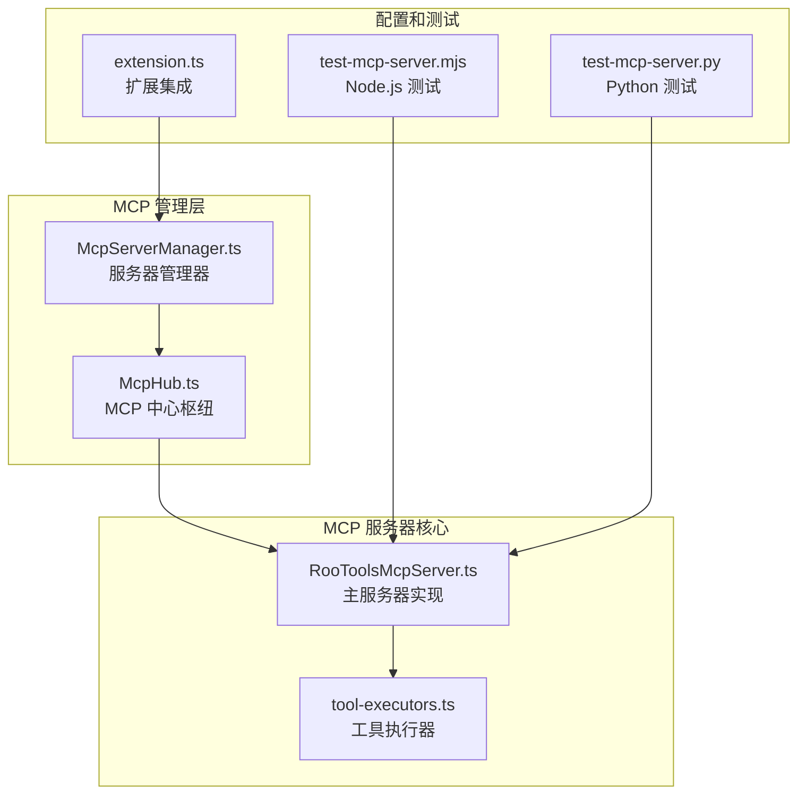
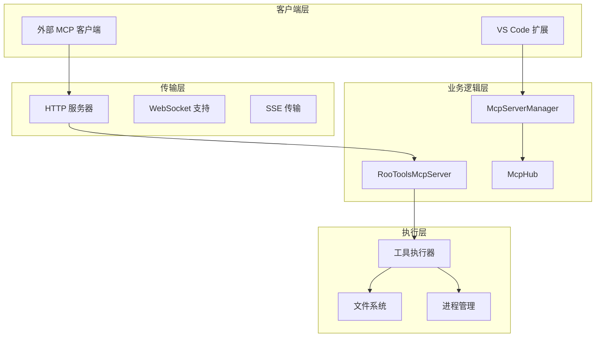
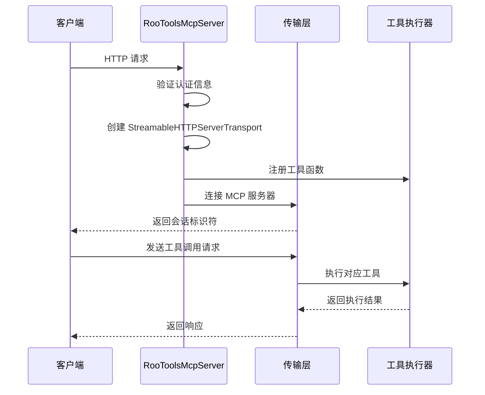
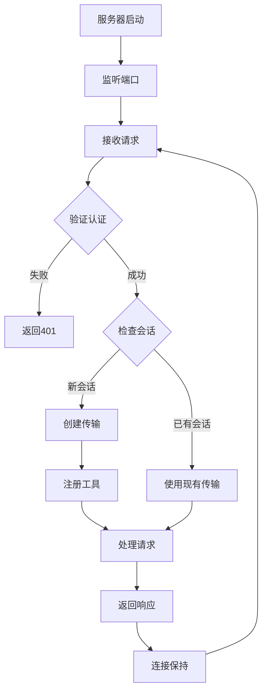
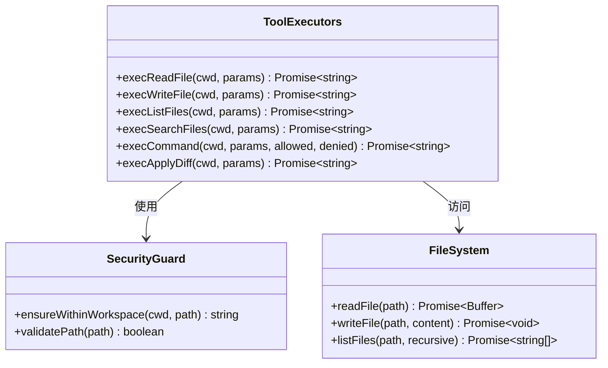
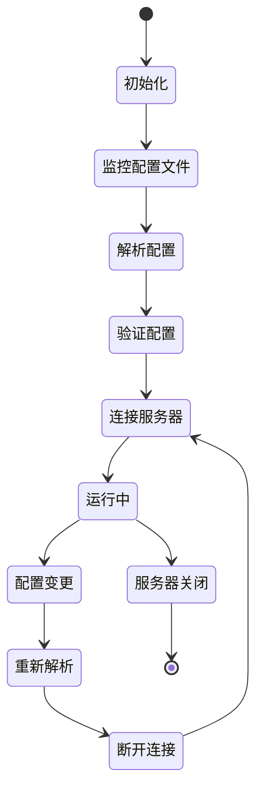
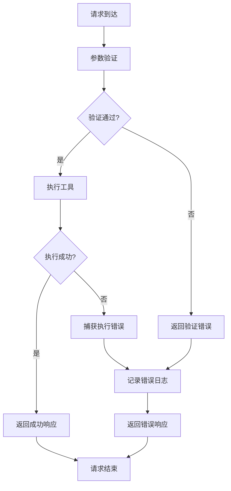

# MCP 服务器架构

<cite>
**本文档引用的文件**
- [RooToolsMcpServer.ts](file://src/services/mcp-server/RooToolsMcpServer.ts)
- [tool-executors.ts](file://src/services/mcp-server/tool-executors.ts)
- [McpServerManager.ts](file://src/services/mcp/McpServerManager.ts)
- [McpHub.ts](file://src/services/mcp/McpHub.ts)
- [extension.ts](file://src/extension.ts)
- [test-mcp-server.mjs](file://test-mcp-server.mjs)
- [test-mcp-server.py](file://test-mcp-server.py)
</cite>

## 目录
1. [简介](#简介)
2. [项目结构](#项目结构)
3. [核心组件](#核心组件)
4. [架构概览](#架构概览)
5. [详细组件分析](#详细组件分析)
6. [依赖关系分析](#依赖关系分析)
7. [性能考虑](#性能考虑)
8. [故障排除指南](#故障排除指南)
9. [结论](#结论)
10. [附录](#附录)

## 简介

MCP（Model Context Protocol）服务器架构是 Njust-AI 项目中的一个关键组件，它为 AI 助手提供了与本地开发环境进行交互的能力。该架构实现了标准化的 MCP 协议，允许外部客户端通过统一的接口访问本地文件系统、执行命令、搜索文件等功能。

本架构的核心目标是：
- 提供安全的本地工具访问接口
- 支持多种传输协议（HTTP、WebSocket、SSE）
- 实现工具执行器的统一管理和调度
- 提供完善的错误处理和状态管理机制
- 支持动态配置和热重载功能

## 项目结构

MCP 服务器架构主要分布在以下目录结构中：



**图表来源**
- [RooToolsMcpServer.ts:1-339](file://src/services/mcp-server/RooToolsMcpServer.ts#L1-L339)
- [McpServerManager.ts:1-87](file://src/services/mcp/McpServerManager.ts#L1-L87)
- [McpHub.ts:1-1997](file://src/services/mcp/McpHub.ts#L1-L1997)

**章节来源**
- [RooToolsMcpServer.ts:1-339](file://src/services/mcp-server/RooToolsMcpServer.ts#L1-L339)
- [McpServerManager.ts:1-87](file://src/services/mcp/McpServerManager.ts#L1-L87)
- [McpHub.ts:1-1997](file://src/services/mcp/McpHub.ts#L1-L1997)

## 核心组件

### RooToolsMcpServer 主服务器

RooToolsMcpServer 是 MCP 服务器的核心实现，负责处理 HTTP 请求、管理会话、执行工具调用等核心功能。

**主要特性：**
- HTTP 服务器实现，支持跨域请求
- 会话管理，基于 UUID 的会话标识符
- 安全认证，支持 Bearer Token 验证
- 工具执行器集成，提供文件操作、命令执行等功能
- 进程间通信，支持本地和远程访问

**章节来源**
- [RooToolsMcpServer.ts:27-339](file://src/services/mcp-server/RooToolsMcpServer.ts#L27-L339)

### 工具执行器系统

工具执行器模块提供了各种文件操作和系统命令执行的功能，所有操作都经过严格的安全检查和路径验证。

**支持的工具：**
- `read_file`: 读取文件内容，支持行范围选择
- `write_to_file`: 写入文件内容，自动创建目录
- `list_files`: 列出目录内容，支持递归遍历
- `search_files`: 使用正则表达式搜索文件内容
- `execute_command`: 执行系统命令，支持超时控制
- `apply_diff`: 应用搜索/替换 diff 到文件

**章节来源**
- [tool-executors.ts:1-208](file://src/services/mcp-server/tool-executors.ts#L1-L208)

### MCP 管理中心

McpHub 作为 MCP 服务器的管理中心，负责多个 MCP 服务器实例的协调管理、状态监控和配置更新。

**核心功能：**
- 多服务器管理，支持全局和项目级配置
- 自动配置文件监控，支持热重载
- 连接状态跟踪和错误处理
- 工具列表和资源列表的动态获取
- 服务器生命周期管理

**章节来源**
- [McpHub.ts:151-1997](file://src/services/mcp/McpHub.ts#L151-L1997)

## 架构概览

MCP 服务器架构采用分层设计，确保了良好的可维护性和扩展性：



**图表来源**
- [RooToolsMcpServer.ts:168-235](file://src/services/mcp-server/RooToolsMcpServer.ts#L168-L235)
- [McpServerManager.ts:20-54](file://src/services/mcp/McpServerManager.ts#L20-L54)
- [McpHub.ts:656-897](file://src/services/mcp/McpHub.ts#L656-L897)

## 详细组件分析

### RooToolsMcpServer 详细分析

#### 服务器初始化流程

服务器启动过程包含多个关键步骤：



**图表来源**
- [RooToolsMcpServer.ts:168-235](file://src/services/mcp-server/RooToolsMcpServer.ts#L168-L235)
- [RooToolsMcpServer.ts:274-313](file://src/services/mcp-server/RooToolsMcpServer.ts#L274-L313)

#### 连接管理机制

服务器实现了完整的连接生命周期管理：



**图表来源**
- [RooToolsMcpServer.ts:254-338](file://src/services/mcp-server/RooToolsMcpServer.ts#L254-L338)

#### 工具执行器实现

每个工具都有对应的执行器函数，实现了类型安全的参数验证和错误处理：



**图表来源**
- [tool-executors.ts:9-208](file://src/services/mcp-server/tool-executors.ts#L9-L208)

**章节来源**
- [RooToolsMcpServer.ts:44-161](file://src/services/mcp-server/RooToolsMcpServer.ts#L44-L161)
- [tool-executors.ts:22-208](file://src/services/mcp-server/tool-executors.ts#L22-L208)

### MCP 管理中心详细分析

#### 配置管理系统

McpHub 实现了复杂的配置管理功能，支持多层级配置和动态更新：



**图表来源**
- [McpHub.ts:547-588](file://src/services/mcp/McpHub.ts#L547-L588)
- [McpHub.ts:1110-1177](file://src/services/mcp/McpHub.ts#L1110-L1177)

#### 错误处理策略

系统实现了多层次的错误处理机制：



**图表来源**
- [RooToolsMcpServer.ts:58-82](file://src/services/mcp-server/RooToolsMcpServer.ts#L58-L82)
- [McpHub.ts:888-896](file://src/services/mcp/McpHub.ts#L888-L896)

**章节来源**
- [McpHub.ts:656-897](file://src/services/mcp/McpHub.ts#L656-L897)
- [McpHub.ts:899-924](file://src/services/mcp/McpHub.ts#L899-L924)

## 依赖关系分析

MCP 服务器架构的依赖关系体现了清晰的分层设计：

```mermaid
graph TB
subgraph "外部依赖"
SDK[@modelcontextprotocol/sdk]
Zod[zod 类型验证]
Chokidar[chokidar 文件监控]
end
subgraph "内部模块"
Extension[extension.ts]
Manager[McpServerManager]
Hub[McpHub]
Server[RooToolsMcpServer]
Executors[tool-executors]
end
subgraph "工具函数"
FS[文件系统工具]
Utils[通用工具]
end
Extension --> Manager
Manager --> Hub
Hub --> Server
Server --> Executors
Server --> SDK
Server --> Zod
Hub --> Chokidar
Executors --> FS
Executors --> Utils
```

**图表来源**
- [extension.ts:422-461](file://src/extension.ts#L422-L461)
- [McpServerManager.ts:1-87](file://src/services/mcp/McpServerManager.ts#L1-L87)
- [RooToolsMcpServer.ts:1-16](file://src/services/mcp-server/RooToolsMcpServer.ts#L1-L16)

**章节来源**
- [extension.ts:419-461](file://src/extension.ts#L419-L461)
- [McpServerManager.ts:1-87](file://src/services/mcp/McpServerManager.ts#L1-L87)

## 性能考虑

### 连接池管理
- 最大连接数限制：通过会话标识符管理并发连接
- 超时机制：默认 60 秒超时，可配置调整
- 内存管理：及时清理断开的连接和传输对象

### 工具执行优化
- 缓存策略：文件列表和搜索结果的缓存机制
- 并发控制：避免同时执行大量重型操作
- 资源限制：命令执行的超时和内存限制

### 网络传输优化
- HTTP/1.1 持久连接
- SSE 事件流支持
- 压缩和分块传输

## 故障排除指南

### 常见问题及解决方案

#### 服务器启动失败
**症状：** 服务器无法启动，端口被占用
**解决方案：**
1. 检查端口占用情况
2. 修改配置中的端口号
3. 确认防火墙设置

#### 认证失败
**症状：** 返回 401 未授权错误
**解决方案：**
1. 检查 `authToken` 配置
2. 确认请求头中的 Authorization 字段
3. 验证令牌格式是否正确

#### 工具执行错误
**症状：** 工具调用返回错误信息
**排查步骤：**
1. 检查工作区路径配置
2. 验证文件权限
3. 查看服务器日志输出

**章节来源**
- [test-mcp-server.mjs:181-191](file://test-mcp-server.mjs#L181-L191)
- [test-mcp-server.py:55-61](file://test-mcp-server.py#L55-L61)

## 结论

MCP 服务器架构展现了现代软件工程的最佳实践，具有以下特点：

**设计优势：**
- 清晰的分层架构，职责分离明确
- 完善的安全机制，防止路径遍历攻击
- 强大的错误处理和恢复能力
- 灵活的配置管理，支持动态更新

**技术亮点：**
- 基于标准 MCP 协议的实现
- 多种传输协议支持
- 类型安全的参数验证
- 统一的工具执行器接口

**扩展性：**
- 易于添加新的工具执行器
- 支持插件化架构
- 可配置的权限控制系统

该架构为 AI 助手与本地开发环境的深度集成提供了坚实的基础，为未来的功能扩展和技术演进奠定了良好的技术基础。

## 附录

### 服务器启动配置示例

创建自定义 MCP 服务器的基本配置：

```typescript
// 基础配置
const serverConfig = {
  workspacePath: "/path/to/workspace",
  port: 3100,
  bindAddress: "127.0.0.1",
  authToken: "your-secret-token"
}

// 创建服务器实例
const server = new RooToolsMcpServer(serverConfig)

// 启动服务器
await server.start()
```

**章节来源**
- [extension.ts:430-461](file://src/extension.ts#L430-L461)

### 工具执行器配置

配置工具执行器的高级选项：

```typescript
const advancedConfig = {
  workspacePath: "/path/to/workspace",
  port: 3100,
  bindAddress: "0.0.0.0",
  authToken: "your-secret-token",
  allowedCommands: ["git", "npm", "yarn"],
  deniedCommands: ["rm", "shutdown"]
}
```

### 测试和验证

使用提供的测试脚本验证服务器功能：

```bash
# Node.js 测试
node test-mcp-server.mjs --port=3100 --token=your-token

# Python 测试
python test-mcp-server.py
```