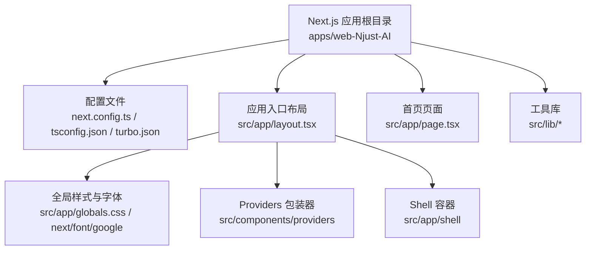
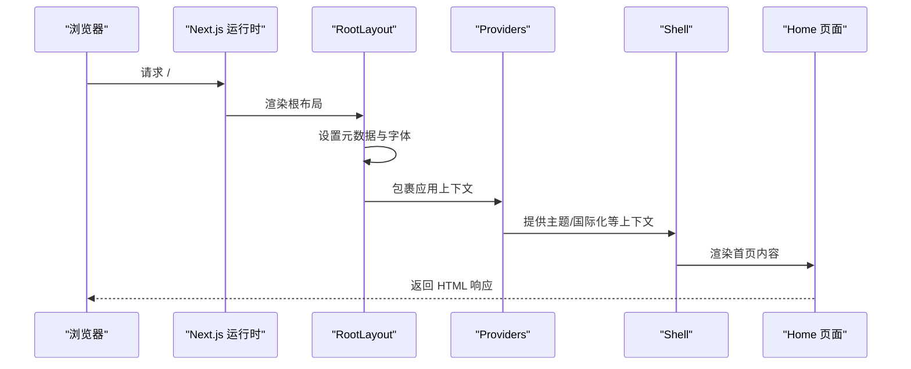
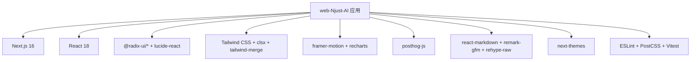

# React 前端架构

<cite>
**本文档引用的文件**
- [apps/web-Njust-AI/package.json](file://apps/web-Njust-AI/package.json)
- [apps/web-Njust-AI/next.config.ts](file://apps/web-Njust-AI/next.config.ts)
- [apps/web-Njust-AI/tsconfig.json](file://apps/web-Njust-AI/tsconfig.json)
- [apps/web-Njust-AI/turbo.json](file://apps/web-Njust-AI/turbo.json)
- [apps/web-Njust-AI/src/app/layout.tsx](file://apps/web-Njust-AI/src/app/layout.tsx)
- [apps/web-Njust-AI/src/app/page.tsx](file://apps/web-Njust-AI/src/app/page.tsx)
- [apps/web-Njust-AI/src/lib/seo.ts](file://apps/web-Njust-AI/src/lib/seo.ts)
- [apps/web-Njust-AI/src/lib/constants.ts](file://apps/web-Njust-AI/src/lib/constants.ts)
</cite>

## 目录
1. [简介](#简介)
2. [项目结构](#项目结构)
3. [核心组件](#核心组件)
4. [架构总览](#架构总览)
5. [详细组件分析](#详细组件分析)
6. [依赖关系分析](#依赖关系分析)
7. [性能考虑](#性能考虑)
8. [故障排除指南](#故障排除指南)
9. [结论](#结论)

## 简介
本文件面向 React 前端架构，聚焦于基于 Next.js 的应用设计与实现。文档从整体架构、组件层次、路由配置与构建系统入手，深入解释应用启动流程、全局状态管理策略、国际化支持与主题系统，并结合实际代码路径说明如何配置新页面、添加路由、实现国际化切换以及优化构建性能。

## 项目结构
该前端工程位于 `apps/web-Njust-AI`，采用 Next.js 16 应用模式（App Router），使用 TypeScript、Tailwind CSS 与 Turborepo 进行统一构建与缓存管理。关键特性包括：
- 使用 Next.js 元数据 API 配置 SEO 与 Open Graph 标签
- 通过自定义 Providers 包裹应用，集中处理主题、国际化等横切关注点
- 通过 next.config.ts 定义重定向规则与 Turbopack 根路径
- 通过 tsconfig.json 与工作区路径映射实现模块别名
- 通过 turbo.json 定义构建任务与输入输出，提升增量构建效率

图表来源
- [apps/web-Njust-AI/src/app/layout.tsx](file://apps/web-Njust-AI/src/app/layout.tsx)
- [apps/web-Njust-AI/src/app/page.tsx](file://apps/web-Njust-AI/src/app/page.tsx)
- [apps/web-Njust-AI/next.config.ts](file://apps/web-Njust-AI/next.config.ts)
- [apps/web-Njust-AI/tsconfig.json](file://apps/web-Njust-AI/tsconfig.json)
- [apps/web-Njust-AI/turbo.json](file://apps/web-Njust-AI/turbo.json)

章节来源
- [apps/web-Njust-AI/package.json](file://apps/web-Njust-AI/package.json)
- [apps/web-Njust-AI/next.config.ts](file://apps/web-Njust-AI/next.config.ts)
- [apps/web-Njust-AI/tsconfig.json](file://apps/web-Njust-AI/tsconfig.json)
- [apps/web-Njust-AI/turbo.json](file://apps/web-Njust-AI/turbo.json)

## 核心组件
- 根布局（RootLayout）：负责注入全局样式、元数据、第三方字体与 Cookie 同意横幅；通过 Providers 统一注入主题、国际化等上下文；包裹 Shell 作为页面容器。
- 首页页面（Home）：展示品牌信息、CTA 按钮、公司标识、功能概览、用户案例、评价与常见问题等模块化区块。
- SEO 工具（SEO）：集中管理站点 URL、名称、标题、描述、关键词、Twitter 卡片类型等 SEO 配置。
- 外部链接常量（EXTERNAL_LINKS）：统一维护所有外部链接，便于维护与变更。

章节来源
- [apps/web-Njust-AI/src/app/layout.tsx](file://apps/web-Njust-AI/src/app/layout.tsx)
- [apps/web-Njust-AI/src/app/page.tsx](file://apps/web-Njust-AI/src/app/page.tsx)
- [apps/web-Njust-AI/src/lib/seo.ts](file://apps/web-Njust-AI/src/lib/seo.ts)
- [apps/web-Njust-AI/src/lib/constants.ts](file://apps/web-Njust-AI/src/lib/constants.ts)

## 架构总览
下图展示了应用启动到页面渲染的关键流程，包括元数据生成、Providers 注入、Shell 容器与页面内容渲染。

图表来源
- [apps/web-Njust-AI/src/app/layout.tsx](file://apps/web-Njust-AI/src/app/layout.tsx)
- [apps/web-Njust-AI/src/app/page.tsx](file://apps/web-Njust-AI/src/app/page.tsx)

## 详细组件分析

### 根布局（RootLayout）
- 职责：设置语言属性、加载 Google Fonts 字体、注入 SEO 元数据（Open Graph、Twitter Card）、Schema.org 结构化数据、Cookie 同意横幅；通过 Providers 注入全局上下文；包裹 Shell 容器。
- 关键点：
  - 使用 Metadata API 配置站点标题模板、描述、图标、Open Graph 图像与 Twitter 卡片。
  - 通过 SEO 工具与 ogImageUrl 动态生成 Open Graph 图像。
  - 在 body 中注入第三方字体 CDN 以确保首屏渲染一致性。
  - 使用 `suppressHydrationWarning` 处理 SSR/CSR 水合差异（如主题切换）。

章节来源
- [apps/web-Njust-AI/src/app/layout.tsx](file://apps/web-Njust-AI/src/app/layout.tsx)
- [apps/web-Njust-AI/src/lib/seo.ts](file://apps/web-Njust-AI/src/lib/seo.ts)

### 首页页面（Home）
- 职责：组织首页内容区块，包含品牌介绍、CTA 按钮、合作伙伴标识、功能概览、使用示例、用户评价、FAQ 与行动号召。
- 关键点：
  - 使用 revalidate 控制静态生成缓存刷新频率。
  - 通过 EXTERNAL_LINKS 常量统一管理外部链接，便于维护。
  - 引入结构化数据组件以增强 SEO。

章节来源
- [apps/web-Njust-AI/src/app/page.tsx](file://apps/web-Njust-AI/src/app/page.tsx)
- [apps/web-Njust-AI/src/lib/constants.ts](file://apps/web-Njust-AI/src/lib/constants.ts)

### SEO 工具（SEO）
- 职责：集中管理站点基础信息与 SEO 配置，提供类型安全的配置对象。
- 关键点：
  - 通过环境变量 NEXT_PUBLIC_SITE_URL 动态确定站点 URL。
  - 暴露 keywords、twitterCard、category 等 SEO 相关字段。
  - 与根布局中的元数据配置配合，统一生成 Open Graph 与 Twitter 卡片。

章节来源
- [apps/web-Njust-AI/src/lib/seo.ts](file://apps/web-Njust-AI/src/lib/seo.ts)

### 外部链接常量（EXTERNAL_LINKS）
- 职责：集中维护所有外部链接，包括社区、文档、市场、隐私政策、博客等。
- 关键点：
  - 便于在多个页面与组件中复用，避免硬编码分散。
  - 支持在首页页面中直接使用，用于 CTA 按钮与导航链接。

章节来源
- [apps/web-Njust-AI/src/lib/constants.ts](file://apps/web-Njust-AI/src/lib/constants.ts)

### 构建与配置系统
- Next.js 配置（next.config.ts）：
  - 启用 Turbopack 并指定根目录，加速开发体验。
  - 定义多条重定向规则：www 到非 www、HTTP 到 HTTPS、云等待列表跳转、定价页重定向至供应商页。
- TypeScript 配置（tsconfig.json）：
  - 继承工作区 TypeScript 配置，启用路径映射 @/* 指向 src/*。
  - 包含 next-env.d.ts、src 下的 TS/TSX 文件与 .next/types 目录。
- Turborepo 配置（turbo.json）：
  - 将构建任务的输入输出定义为 src/**、package.json、tsconfig.json、next.config.ts，提升增量构建效率。

章节来源
- [apps/web-Njust-AI/next.config.ts](file://apps/web-Njust-AI/next.config.ts)
- [apps/web-Njust-AI/tsconfig.json](file://apps/web-Njust-AI/tsconfig.json)
- [apps/web-Njust-AI/turbo.json](file://apps/web-Njust-AI/turbo.json)

## 依赖关系分析
- 应用依赖：
  - React 18 与 Next.js 16，提供现代前端运行时与 App Router。
  - Radix UI 组件库与 Lucide React 图标，提供可访问性与视觉一致性。
  - Tailwind CSS 与 Tailwind Merge/Tailwind CSS Animate，提供实用优先的样式系统。
  - Framer Motion 与 Recharts，用于动画与可视化。
  - PostHog JS，用于埋点分析。
  - React Markdown 与相关插件，用于内容渲染。
  - next-themes，用于主题切换。
- 开发依赖：
  - ESLint、PostCSS、Tailwind CSS、Vitest 等，保证代码质量与构建稳定性。

图表来源
- [apps/web-Njust-AI/package.json](file://apps/web-Njust-AI/package.json)

章节来源
- [apps/web-Njust-AI/package.json](file://apps/web-Njust-AI/package.json)

## 性能考虑
- 静态生成与缓存：
  - 首页使用 revalidate 控制缓存刷新周期，平衡新鲜度与性能。
- 构建优化：
  - 通过 Turborepo 与 Turbopack 加速开发与构建。
  - 在 turbo.json 中明确构建输入输出，提升增量构建命中率。
- 样式与资源：
  - 使用 Tailwind 实用类减少 CSS 体积；按需引入第三方字体与图标。
- 重定向与 SEO：
  - 在 next.config.ts 中集中处理重定向，减少运行时分支判断。
  - 通过 Metadata API 与结构化数据提升 SEO 与社交分享效果。

章节来源
- [apps/web-Njust-AI/src/app/page.tsx](file://apps/web-Njust-AI/src/app/page.tsx)
- [apps/web-Njust-AI/next.config.ts](file://apps/web-Njust-AI/next.config.ts)
- [apps/web-Njust-AI/turbo.json](file://apps/web-Njust-AI/turbo.json)

## 故障排除指南
- 重定向不生效：
  - 检查 next.config.ts 中的重定向规则是否匹配请求头或主机名；确认目标 URL 正确且协议一致。
- SEO 元数据异常：
  - 确认 SEO 工具中的站点 URL 与环境变量一致；检查 Open Graph 图像生成逻辑与路径。
- 字体加载问题：
  - 确保根布局中正确引入第三方字体 CDN；检查语言属性与字体子集配置。
- 构建失败或缓存异常：
  - 清理 .next 与 .turbo 缓存后重新构建；核对 turbo.json 的输入输出定义是否覆盖最新源码。

章节来源
- [apps/web-Njust-AI/next.config.ts](file://apps/web-Njust-AI/next.config.ts)
- [apps/web-Njust-AI/src/lib/seo.ts](file://apps/web-Njust-AI/src/lib/seo.ts)
- [apps/web-Njust-AI/src/app/layout.tsx](file://apps/web-Njust-AI/src/app/layout.tsx)
- [apps/web-Njust-AI/turbo.json](file://apps/web-Njust-AI/turbo.json)

## 结论
该前端架构以 Next.js 16 为核心，结合 TypeScript、Tailwind CSS、Radix UI 与主题系统，实现了高性能、可维护且具备良好 SEO 表现的应用。通过集中化的元数据配置、重定向规则与构建优化，开发者可以快速扩展页面与功能，同时保持一致的用户体验与开发体验。建议在新增页面时遵循现有布局与配置规范，充分利用 Providers 机制进行全局状态与主题管理，并通过 SEO 工具与结构化数据提升搜索可见性。