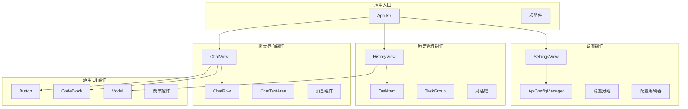
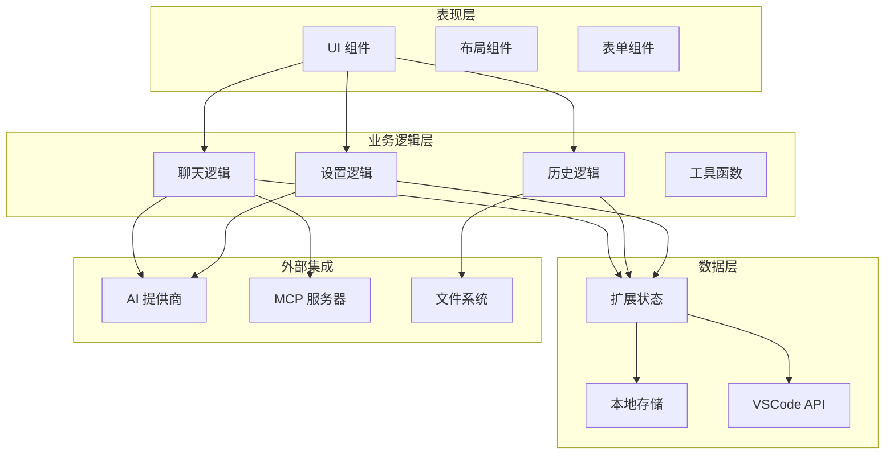
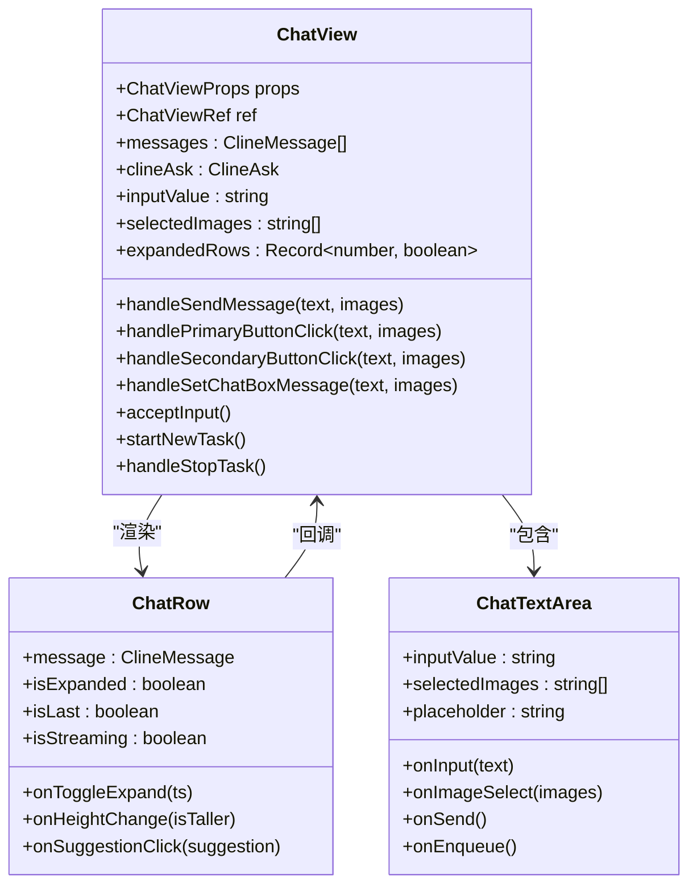
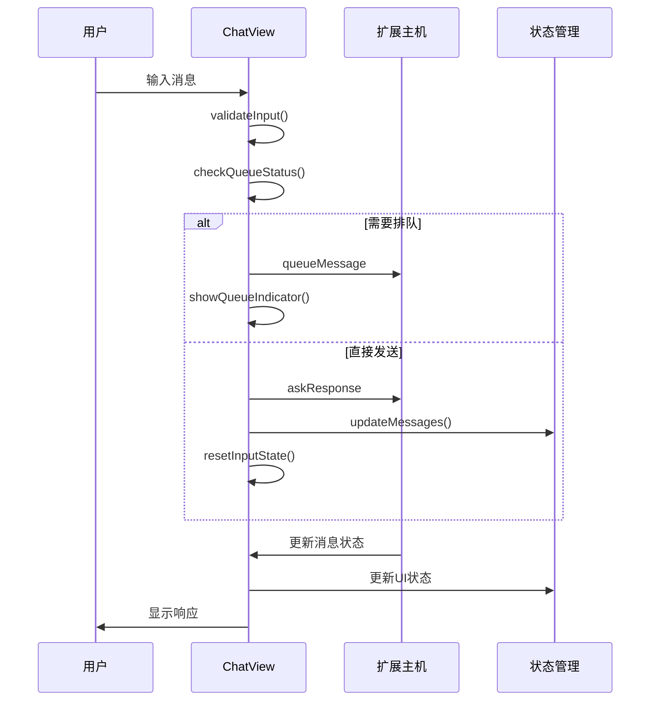
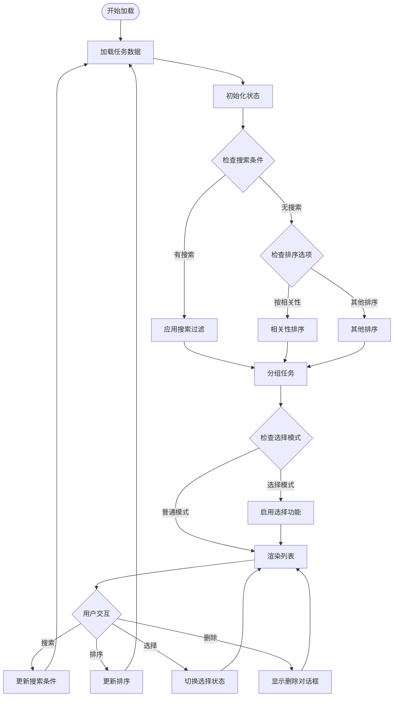
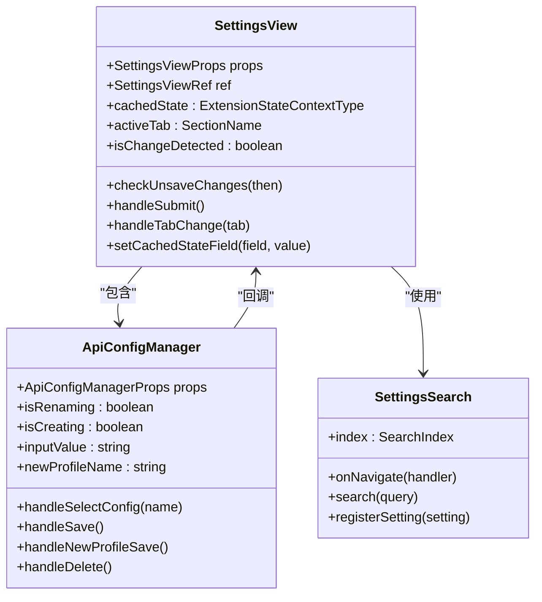
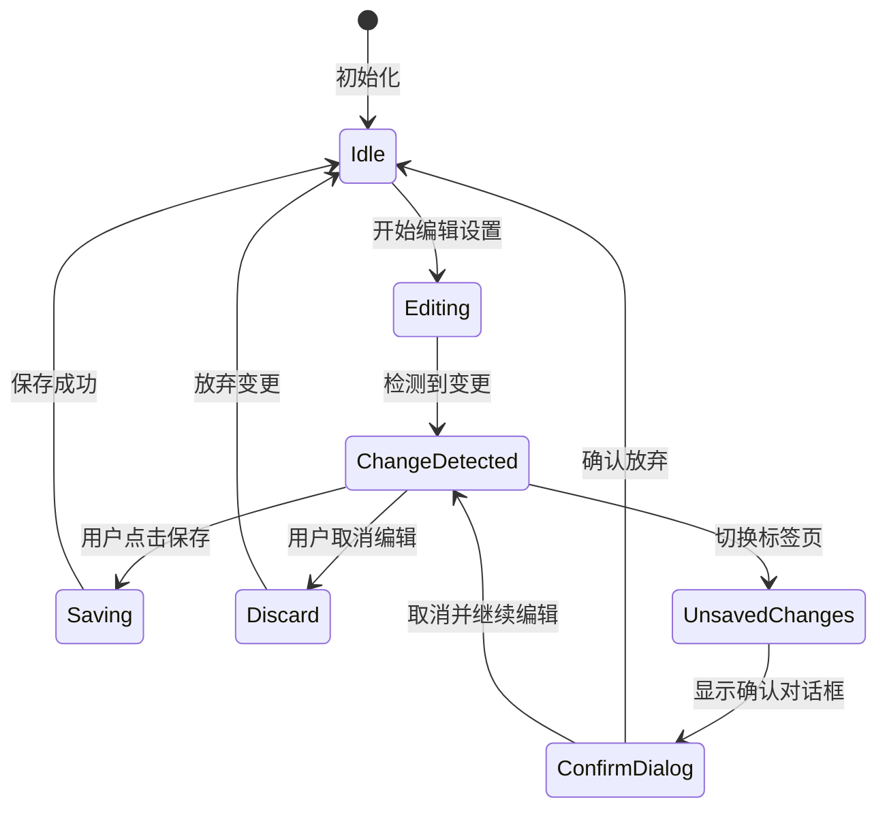

# UI 组件系统

<cite>
**本文档引用的文件**
- [App.tsx](file://webview-ui/src/App.tsx)
- [ChatView.tsx](file://webview-ui/src/components/chat/ChatView.tsx)
- [ChatRow.tsx](file://webview-ui/src/components/chat/ChatRow.tsx)
- [HistoryView.tsx](file://webview-ui/src/components/history/HistoryView.tsx)
- [TaskItem.tsx](file://webview-ui/src/components/history/TaskItem.tsx)
- [SettingsView.tsx](file://webview-ui/src/components/settings/SettingsView.tsx)
- [ApiConfigManager.tsx](file://webview-ui/src/components/settings/ApiConfigManager.tsx)
- [Button.tsx](file://webview-ui/src/components/ui/Button.tsx)
- [CodeBlock.tsx](file://webview-ui/src/components/common/CodeBlock.tsx)
- [Modal.tsx](file://webview-ui/src/components/common/Modal.tsx)
</cite>

## 目录
1. [简介](#简介)
2. [项目结构](#项目结构)
3. [核心组件](#核心组件)
4. [架构概览](#架构概览)
5. [详细组件分析](#详细组件分析)
6. [依赖关系分析](#依赖关系分析)
7. [性能考虑](#性能考虑)
8. [故障排除指南](#故障排除指南)
9. [结论](#结论)

## 简介

UI 组件系统是基于 React 和 VS Code Webview 工具包构建的现代化用户界面框架。该系统提供了完整的聊天界面、历史记录管理、设置配置等功能模块，支持丰富的交互体验和高度可定制的样式系统。

系统采用模块化设计，将不同功能领域的组件分离到独立的目录结构中，包括聊天组件、历史组件、设置组件和通用 UI 组件。每个组件都遵循一致的接口规范和最佳实践，确保了代码的可维护性和扩展性。

## 项目结构

UI 组件系统采用清晰的分层架构，主要包含以下核心目录：



**图表来源**
- [App.tsx:1-331](file://webview-ui/src/App.tsx#L1-L331)
- [ChatView.tsx:1-800](file://webview-ui/src/components/chat/ChatView.tsx#L1-L800)
- [HistoryView.tsx:1-363](file://webview-ui/src/components/history/HistoryView.tsx#L1-L363)
- [SettingsView.tsx:1-800](file://webview-ui/src/components/settings/SettingsView.tsx#L1-L800)

**章节来源**
- [App.tsx:1-331](file://webview-ui/src/App.tsx#L1-L331)

## 核心组件

### 聊天界面组件

聊天界面是系统的核心交互区域，包含完整的对话管理和消息渲染功能。

#### ChatView 组件
ChatView 是聊天界面的主要容器，负责管理整个聊天会话的状态和生命周期。

**关键特性：**
- 实时消息流处理
- 多种消息类型支持（文本、工具调用、命令执行等）
- 消息队列和优先级管理
- 音频反馈和通知系统
- 自动保存和恢复机制

**主要属性接口：**
- `isHidden`: 控制组件可见性
- `showAnnouncement`: 显示公告状态
- `hideAnnouncement`: 公告隐藏回调

**事件处理：**
- 用户输入处理
- 消息发送和响应
- 工具调用确认
- 命令执行控制

#### ChatRow 组件
ChatRow 负责单个消息项的渲染和交互，支持多种消息类型的可视化展示。

**支持的消息类型：**
- 文本回复和问题
- 文件操作请求和结果
- 工具调用和执行状态
- 命令执行和输出
- 错误和警告信息

**交互功能：**
- 消息展开/折叠
- 编辑模式切换
- 文件跳转和预览
- 批量操作支持

### 历史管理组件

历史管理组件提供任务历史的浏览、搜索和管理功能。

#### HistoryView 组件
HistoryView 提供完整的历史记录管理界面，支持复杂的筛选和排序功能。

**核心功能：**
- 任务历史列表显示
- 搜索和过滤机制
- 分组和排序选项
- 批量选择和操作
- 任务详情查看

**高级特性：**
- 虚拟滚动优化大量数据
- 智能分组算法
- 实时搜索索引
- 选择模式支持

#### TaskItem 组件
TaskItem 代表单个任务条目，提供简洁的任务摘要和快速操作入口。

**显示变体：**
- 紧凑模式：用于分组视图
- 完整模式：用于列表视图
- 选择模式：支持批量操作

**交互行为：**
- 点击查看详情
- 复选框选择
- 删除操作确认

### 设置组件

设置系统提供全面的配置管理功能，支持 API 配置、行为设置和外观定制。

#### SettingsView 组件
SettingsView 是设置界面的主容器，采用标签页布局组织各种设置选项。

**标签页结构：**
- 提供商配置
- 自动批准设置
- 技能和命令
- 检查点管理
- 通知配置
- 终端设置
- 实验性功能
- 外观定制

**智能功能：**
- 设置搜索和导航
- 变更检测和确认
- 响应式布局
- 本地缓存管理

#### ApiConfigManager 组件
ApiConfigManager 专门处理 API 配置文件的管理，支持多配置文件切换。

**管理功能：**
- 配置文件创建和删除
- 名称重命名和验证
- 组织权限检查
- 配置导入导出

**安全特性：**
- 组织允许列表验证
- 配置文件完整性检查
- 权限级别控制

### 通用 UI 组件

#### Button 组件
Button 提供统一的按钮样式和交互行为，支持多种变体和尺寸。

**变体类型：**
- primary：主要操作按钮
- secondary：次要操作按钮
- ghost：幽灵按钮
- destructive：破坏性操作
- outline：轮廓按钮
- link：链接样式

**尺寸规格：**
- default：默认尺寸
- sm：小尺寸
- lg：大尺寸
- icon：图标按钮

#### CodeBlock 组件
CodeBlock 提供语法高亮和代码块增强功能。

**核心功能：**
- 多语言语法高亮
- 自动换行和折叠
- 复制功能
- 滚动同步
- 选择状态跟踪

**高级特性：**
- 惯性滚动支持
- 动态按钮定位
- 性能优化的虚拟滚动
- 主题适配

#### Modal 组件
Modal 提供模态对话框的基础实现，支持遮罩层和内容容器。

**设计特点：**
- 自适应尺寸
- 遮罩层点击关闭
- 内容区域居中
- 边框和阴影效果

**使用场景：**
- 设置对话框
- 确认提示
- 详情查看
- 表单输入

**章节来源**
- [ChatView.tsx:49-57](file://webview-ui/src/components/chat/ChatView.tsx#L49-L57)
- [ChatRow.tsx:122-137](file://webview-ui/src/components/chat/ChatRow.tsx#L122-L137)
- [HistoryView.tsx:28-30](file://webview-ui/src/components/history/HistoryView.tsx#L28-L30)
- [TaskItem.tsx:12-22](file://webview-ui/src/components/history/TaskItem.tsx#L12-L22)
- [SettingsView.tsx:119-122](file://webview-ui/src/components/settings/SettingsView.tsx#L119-L122)
- [ApiConfigManager.tsx:19-27](file://webview-ui/src/components/settings/ApiConfigManager.tsx#L19-L27)
- [Button.tsx:36-40](file://webview-ui/src/components/ui/Button.tsx#L36-L40)
- [CodeBlock.tsx:32-40](file://webview-ui/src/components/common/CodeBlock.tsx#L32-L40)
- [Modal.tsx:1-6](file://webview-ui/src/components/common/Modal.tsx#L1-L6)

## 架构概览

系统采用分层架构设计，确保各组件间的松耦合和高内聚。



**图表来源**
- [App.tsx:10-21](file://webview-ui/src/App.tsx#L10-L21)
- [ChatView.tsx:74-89](file://webview-ui/src/components/chat/ChatView.tsx#L74-L89)
- [SettingsView.tsx:45-46](file://webview-ui/src/components/settings/SettingsView.tsx#L45-L46)

### 组件通信机制

系统采用多种组件通信模式：

1. **父子组件通信**：通过 props 和回调函数传递数据
2. **全局状态管理**：使用 React Context 管理共享状态
3. **事件总线模式**：通过 window.postMessage 实现跨组件通信
4. **双向绑定**：支持表单控件的受控和非受控模式

**章节来源**
- [App.tsx:102-146](file://webview-ui/src/App.tsx#L102-L146)
- [ChatView.tsx:595-679](file://webview-ui/src/components/chat/ChatView.tsx#L595-L679)

## 详细组件分析

### ChatView 组件深度分析

ChatView 是整个聊天系统的核心控制器，负责管理复杂的消息流和用户交互。



**图表来源**
- [ChatView.tsx:49-57](file://webview-ui/src/components/chat/ChatView.tsx#L49-L57)
- [ChatView.tsx:63-66](file://webview-ui/src/components/chat/ChatView.tsx#L63-L66)
- [ChatRow.tsx:122-137](file://webview-ui/src/components/chat/ChatRow.tsx#L122-L137)

#### 消息处理流程



**图表来源**
- [ChatView.tsx:595-679](file://webview-ui/src/components/chat/ChatView.tsx#L595-L679)
- [ChatView.tsx:724-796](file://webview-ui/src/components/chat/ChatView.tsx#L724-L796)

**章节来源**
- [ChatView.tsx:595-796](file://webview-ui/src/components/chat/ChatView.tsx#L595-L796)

### HistoryView 组件详细分析

HistoryView 提供了完整的任务历史管理功能，支持复杂的搜索和排序逻辑。



**图表来源**
- [HistoryView.tsx:34-48](file://webview-ui/src/components/history/HistoryView.tsx#L34-L48)
- [HistoryView.tsx:66-69](file://webview-ui/src/components/history/HistoryView.tsx#L66-L69)

#### 任务分组算法

系统实现了智能的任务分组机制，支持嵌套子任务的层次化展示。

**分组策略：**
1. **时间分组**：按日期和时间段分组
2. **工作区分组**：按项目工作区分组
3. **任务类型分组**：按任务性质分组
4. **状态分组**：按完成状态分组

**递归计数机制：**
- 支持子任务的递归统计
- 计算完整的任务树结构
- 实时更新分组统计信息

**章节来源**
- [HistoryView.tsx:47-63](file://webview-ui/src/components/history/HistoryView.tsx#L47-L63)
- [HistoryView.tsx:254-310](file://webview-ui/src/components/history/HistoryView.tsx#L254-L310)

### SettingsView 组件深度解析

SettingsView 采用了模块化的设置管理架构，支持动态加载和搜索功能。



**图表来源**
- [SettingsView.tsx:94-96](file://webview-ui/src/components/settings/SettingsView.tsx#L94-L96)
- [SettingsView.tsx:124-124](file://webview-ui/src/components/settings/SettingsView.tsx#L124-L124)
- [ApiConfigManager.tsx:19-27](file://webview-ui/src/components/settings/ApiConfigManager.tsx#L19-L27)

#### 设置变更检测机制



**图表来源**
- [SettingsView.tsx:435-445](file://webview-ui/src/components/settings/SettingsView.tsx#L435-L445)
- [SettingsView.tsx:449-461](file://webview-ui/src/components/settings/SettingsView.tsx#L449-L461)

**章节来源**
- [SettingsView.tsx:435-461](file://webview-ui/src/components/settings/SettingsView.tsx#L435-L461)
- [ApiConfigManager.tsx:121-179](file://webview-ui/src/components/settings/ApiConfigManager.tsx#L121-L179)

### 通用组件实现分析

#### Button 组件设计模式

Button 组件采用了变体模式（Variant Pattern），通过单一组件支持多种视觉风格。

**设计原则：**
- 使用 CSS 变量实现主题一致性
- 支持组合模式（asChild）以适应不同语义需求
- 响应式设计支持不同屏幕尺寸
- 无障碍访问支持键盘导航

**样式系统：**
- 基于 Tailwind CSS 的原子化样式
- 支持自定义样式覆盖
- 动态类名组合
- 状态样式映射

**章节来源**
- [Button.tsx:7-34](file://webview-ui/src/components/ui/Button.tsx#L7-L34)
- [Button.tsx:42-47](file://webview-ui/src/components/ui/Button.tsx#L42-L47)

#### CodeBlock 组件技术实现

CodeBlock 组件实现了高性能的代码渲染和交互功能。

**性能优化策略：**
- 语言包懒加载和缓存
- 虚拟滚动支持长代码块
- 惰性渲染和记忆化
- 内存泄漏防护

**交互功能：**
- 语法高亮实时更新
- 自动换行和折叠控制
- 复制到剪贴板
- 滚动位置同步
- 选择状态跟踪

**章节来源**
- [CodeBlock.tsx:168-286](file://webview-ui/src/components/common/CodeBlock.tsx#L168-L286)
- [CodeBlock.tsx:464-554](file://webview-ui/src/components/common/CodeBlock.tsx#L464-L554)

## 依赖关系分析

系统组件间的依赖关系体现了清晰的分层架构和模块化设计。

```mermaid
graph TB
subgraph "外部依赖"
React[React 18+]
VSCode[VS Code Webview Toolkit]
Radix[Radix UI]
ClassVariants[class-variance-authority]
LruCache[lru-cache]
UseSound[use-sound]
end
subgraph "内部模块"
App[App.tsx]
ChatView[ChatView]
HistoryView[HistoryView]
SettingsView[SettingsView]
UIComponents[UI Components]
CommonComponents[Common Components]
end
subgraph "类型定义"
Types[@njust-ai/types]
ExtensionState[ExtensionStateContext]
Utils[Utility Functions]
end
App --> ChatView
App --> HistoryView
App --> SettingsView
ChatView --> UIComponents
ChatView --> CommonComponents
ChatView --> ExtensionState
HistoryView --> UIComponents
HistoryView --> CommonComponents
SettingsView --> UIComponents
SettingsView --> ExtensionState
UIComponents --> Types
CommonComponents --> Types
ChatView --> Types
HistoryView --> Types
SettingsView --> Types
UIComponents --> React
CommonComponents --> React
App --> React
UIComponents --> VSCode
CommonComponents --> VSCode
UIComponents --> Radix
UIComponents --> ClassVariants
CommonComponents --> LruCache
ChatView --> UseSound
```

**图表来源**
- [App.tsx:1-10](file://webview-ui/src/App.tsx#L1-L10)
- [ChatView.tsx:15-35](file://webview-ui/src/components/chat/ChatView.tsx#L15-L35)
- [SettingsView.tsx:42-61](file://webview-ui/src/components/settings/SettingsView.tsx#L42-L61)

### 关键依赖特性

**状态管理依赖：**
- React Context 提供全局状态共享
- 自定义 Hook 实现逻辑复用
- 深度比较优化渲染性能

**UI 组件依赖：**
- 统一的样式系统和主题变量
- 无障碍访问支持
- 响应式设计适配
- 动画和过渡效果

**工具函数依赖：**
- 类型安全的数据转换
- 性能优化的算法实现
- 错误边界和异常处理
- 国际化支持

**章节来源**
- [App.tsx:1-10](file://webview-ui/src/App.tsx#L1-L10)
- [ChatView.tsx:1-25](file://webview-ui/src/components/chat/ChatView.tsx#L1-L25)

## 性能考虑

系统在多个层面实现了性能优化，确保在大数据量和复杂交互场景下的流畅体验。

### 渲染性能优化

**虚拟滚动实现：**
- React Virtuoso 提供高性能列表渲染
- 智能滚动位置保持
- 内容变化自动调整
- 大数据集高效处理

**组件记忆化：**
- React.memo 防止不必要的重渲染
- useMemo 优化昂贵计算
- useCallback 缓存回调函数
- 深度比较避免状态抖动

**异步加载策略：**
- 语言包按需加载
- 图片资源延迟加载
- 代码块懒渲染
- 对话框按需挂载

### 内存管理优化

**垃圾回收友好：**
- 及时清理事件监听器
- 取消未完成的异步操作
- 合理使用 ref 和副作用
- 避免内存泄漏

**状态管理优化：**
- 局部状态最小化
- 不可变数据结构
- 状态合并和去重
- 缓存策略优化

### 网络和 API 优化

**请求合并：**
- 连续 API 请求合并
- 命令序列优化
- 批量操作支持
- 速率限制处理

**缓存策略：**
- LRU 缓存机制
- 本地存储持久化
- 离线数据支持
- 数据同步优化

## 故障排除指南

### 常见问题诊断

**组件渲染问题：**
- 检查 props 类型和默认值
- 验证状态更新逻辑
- 确认事件处理器绑定
- 排查条件渲染逻辑

**样式和主题问题：**
- 验证 CSS 变量定义
- 检查主题切换逻辑
- 确认响应式断点
- 排查 z-index 层级

**交互功能问题：**
- 检查事件冒泡和捕获
- 验证焦点管理
- 确认键盘快捷键
- 排查触摸和手势支持

### 调试技巧和工具

**开发工具使用：**
- React DevTools 组件检查
- VS Code 扩展调试
- 浏览器开发者工具
- 性能分析工具

**日志和监控：**
- 结构化错误日志
- 性能指标收集
- 用户行为追踪
- 异常报告机制

**章节来源**
- [ChatView.tsx:595-679](file://webview-ui/src/components/chat/ChatView.tsx#L595-L679)
- [SettingsView.tsx:435-461](file://webview-ui/src/components/settings/SettingsView.tsx#L435-L461)

## 结论

UI 组件系统展现了现代前端开发的最佳实践，通过模块化设计、清晰的架构分层和完善的性能优化，在提供丰富功能的同时保持了良好的可维护性和扩展性。

**系统优势：**
- 完整的功能覆盖和用户体验
- 高度可定制的样式系统
- 强大的组件复用能力
- 优秀的性能表现
- 良好的可访问性支持

**未来发展建议：**
- 继续优化大型数据集的处理性能
- 增强组件的可测试性
- 扩展主题和样式的灵活性
- 完善国际化和本地化支持
- 加强错误处理和用户反馈机制

该系统为复杂的企业级应用提供了坚实的技术基础，通过持续的优化和改进，能够满足不断增长的功能需求和技术挑战。