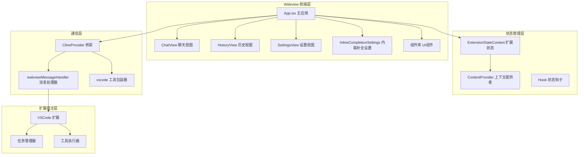
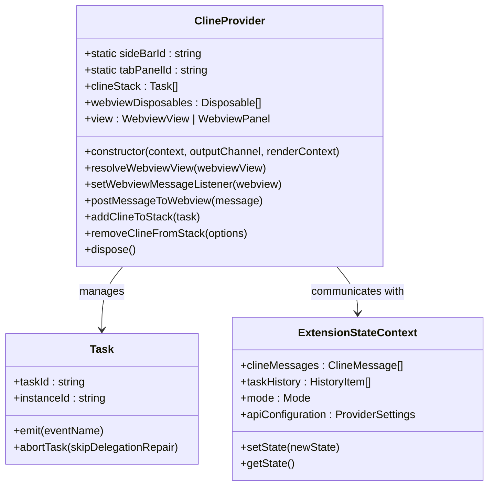
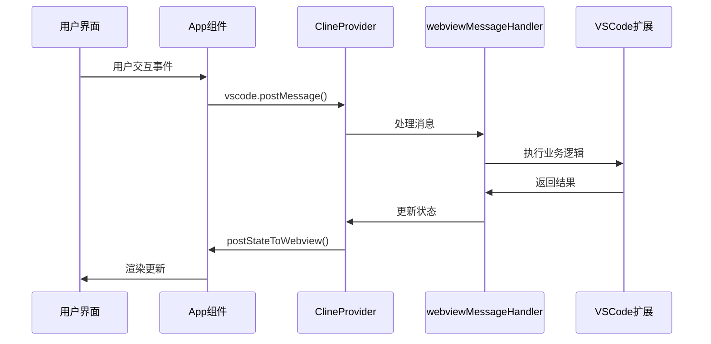
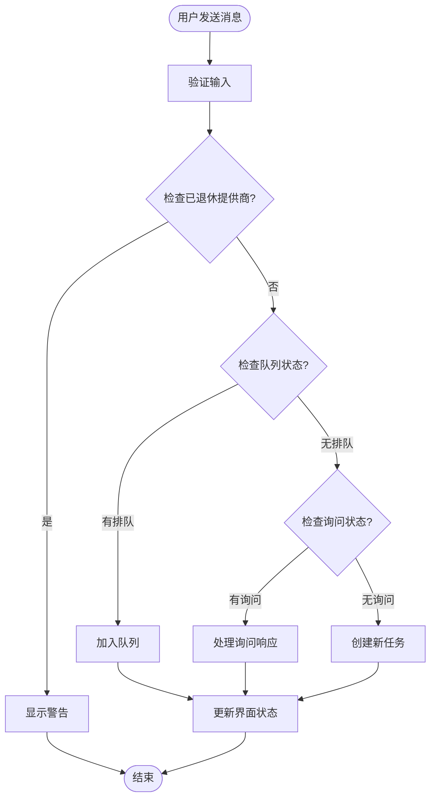
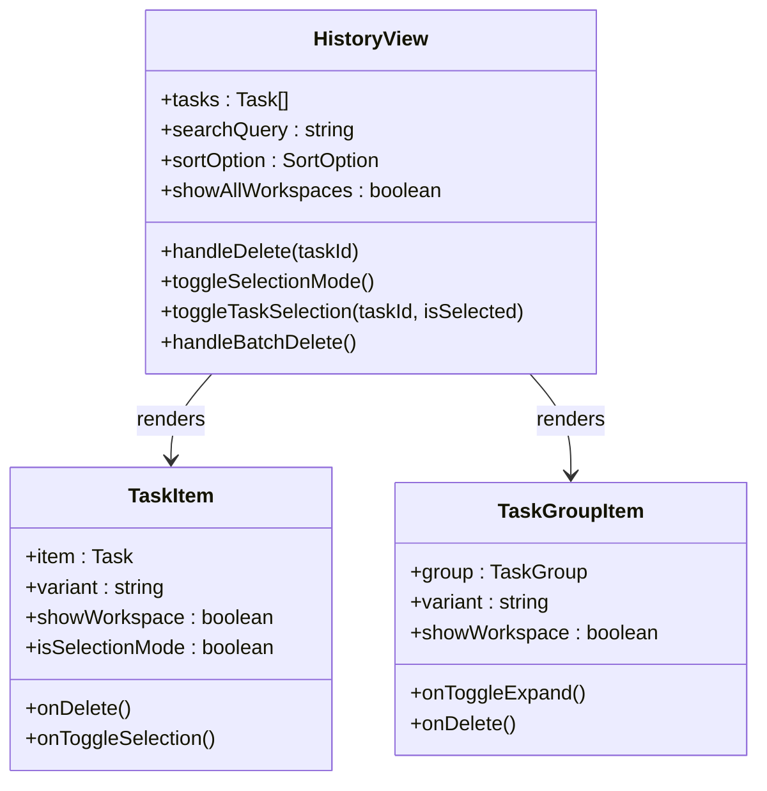
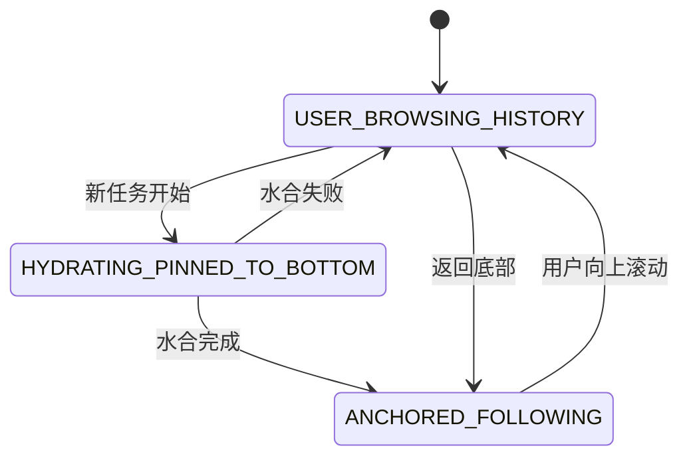
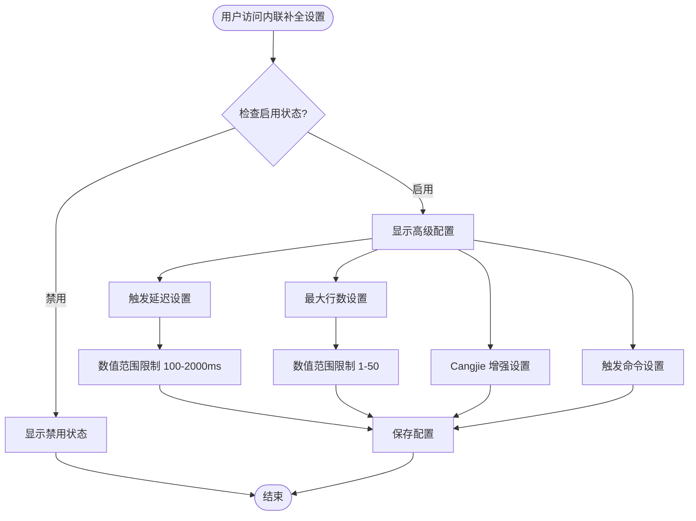
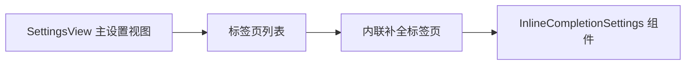

# Webview 界面系统

<cite>
**本文档引用的文件**
- [App.tsx](file://webview-ui/src/App.tsx)
- [index.tsx](file://webview-ui/src/index.tsx)
- [ClineProvider.ts](file://src/core/webview/ClineProvider.ts)
- [webviewMessageHandler.ts](file://src/core/webview/webviewMessageHandler.ts)
- [ExtensionStateContext.tsx](file://webview-ui/src/context/ExtensionStateContext.tsx)
- [vscode.ts](file://webview-ui/src/utils/vscode.ts)
- [ChatView.tsx](file://webview-ui/src/components/chat/ChatView.tsx)
- [HistoryView.tsx](file://webview-ui/src/components/history/HistoryView.tsx)
- [SettingsView.tsx](file://webview-ui/src/components/settings/SettingsView.tsx)
- [InlineCompletionSettings.tsx](file://webview-ui/src/components/settings/InlineCompletionSettings.tsx)
- [ChatRow.tsx](file://webview-ui/src/components/chat/ChatRow.tsx)
- [Tab.tsx](file://webview-ui/src/components/common/Tab.tsx)
- [useScrollLifecycle.ts](file://webview-ui/src/hooks/useScrollLifecycle.ts)
- [types.ts](file://webview-ui/src/components/settings/types.ts)
- [Section.tsx](file://webview-ui/src/components/settings/Section.tsx)
- [SearchableSetting.tsx](file://webview-ui/src/components/settings/SearchableSetting.tsx)
- [settings.json](file://webview-ui/src/i18n/locales/en/settings.json)
- [package.nls.json](file://src/package.nls.json)
</cite>

## 目录
1. [简介](#简介)
2. [项目结构](#项目结构)
3. [核心组件](#核心组件)
4. [架构概览](#架构概览)
5. [详细组件分析](#详细组件分析)
6. [内联代码补全设置组件](#内联代码补全设置组件)
7. [依赖关系分析](#依赖关系分析)
8. [性能考虑](#性能考虑)
9. [故障排除指南](#故障排除指南)
10. [结论](#结论)

## 简介

Webview 界面系统是 Njust-AI 扩展程序的核心前端架构，基于 React 构建，为用户提供现代化的 AI 对话界面。该系统通过 ClineProvider 作为界面与扩展宿主之间的桥梁，实现了双向的消息通信机制，支持聊天界面、工具调用审批、代码展示、历史管理、**内联代码补全设置**等多种功能。

系统采用模块化设计，具有清晰的组件层次结构和状态管理模式，能够高效处理复杂的 AI 交互场景，包括实时对话、工具调用、文件操作、**内联代码补全配置**等。

## 项目结构

Webview 界面系统主要由以下核心部分组成：



**图表来源**
- [App.tsx:1-331](file://webview-ui/src/App.tsx#L1-L331)
- [ClineProvider.ts:126-312](file://src/core/webview/ClineProvider.ts#L126-L312)
- [ExtensionStateContext.tsx:185-574](file://webview-ui/src/context/ExtensionStateContext.tsx#L185-L574)

**章节来源**
- [App.tsx:1-331](file://webview-ui/src/App.tsx#L1-L331)
- [index.tsx:1-18](file://webview-ui/src/index.tsx#L1-L18)

## 核心组件

### ClineProvider - 界面与扩展宿主的桥梁

ClineProvider 是整个系统的中枢控制器，实现了 VSCode 的 WebviewViewProvider 接口，负责：

- **视图生命周期管理**：处理 Webview 的创建、销毁和可见性变化
- **消息路由**：在前端界面和扩展宿主之间传递消息
- **任务协调**：管理多个任务实例的栈式结构
- **资源清理**：确保所有订阅和事件监听器正确释放



**图表来源**
- [ClineProvider.ts:126-312](file://src/core/webview/ClineProvider.ts#L126-L312)
- [ExtensionStateContext.tsx:32-140](file://webview-ui/src/context/ExtensionStateContext.tsx#L32-L140)

### 扩展状态管理系统

ExtensionStateContext 提供了完整的状态管理解决方案：

- **全局状态存储**：集中管理所有扩展相关的状态
- **实时状态同步**：通过序列号防止过期状态覆盖
- **类型安全**：完整的 TypeScript 类型定义
- **性能优化**：智能的状态合并和更新策略

**章节来源**
- [ExtensionStateContext.tsx:144-183](file://webview-ui/src/context/ExtensionStateContext.tsx#L144-L183)
- [ExtensionStateContext.tsx:297-440](file://webview-ui/src/context/ExtensionStateContext.tsx#L297-L440)

## 架构概览

系统采用分层架构设计，确保各层职责清晰分离：



**图表来源**
- [App.tsx:102-146](file://webview-ui/src/App.tsx#L102-L146)
- [ClineProvider.ts:790-792](file://src/core/webview/ClineProvider.ts#L790-L792)
- [webviewMessageHandler.ts:81-522](file://src/core/webview/webviewMessageHandler.ts#L81-L522)

## 详细组件分析

### 聊天界面组件 (ChatView)

ChatView 是最复杂的组件，负责处理所有聊天相关的交互：

#### 核心功能特性

- **实时消息流**：支持流式响应显示
- **工具调用审批**：提供工具使用确认界面
- **文件操作**：支持图片上传和文件上下文
- **自动完成**：智能的输入建议和补全
- **性能优化**：虚拟滚动和懒加载



**图表来源**
- [ChatView.tsx:595-679](file://webview-ui/src/components/chat/ChatView.tsx#L595-L679)

#### 消息处理流程

组件内部实现了复杂的消息处理逻辑：

- **消息队列管理**：处理并发消息的顺序执行
- **工具调用处理**：审批和执行各种工具调用
- **状态跟踪**：维护聊天状态和用户意图
- **错误恢复**：处理各种异常情况

**章节来源**
- [ChatView.tsx:1-800](file://webview-ui/src/components/chat/ChatView.tsx#L1-L800)

### 历史管理组件 (HistoryView)

HistoryView 提供了完整的任务历史管理功能：

#### 主要特性

- **搜索和过滤**：支持按多种条件搜索历史记录
- **分组显示**：按时间或项目分组显示任务
- **批量操作**：支持批量删除和管理
- **工作区切换**：支持在不同工作区间切换查看



**图表来源**
- [HistoryView.tsx:34-363](file://webview-ui/src/components/history/HistoryView.tsx#L34-L363)

**章节来源**
- [HistoryView.tsx:1-363](file://webview-ui/src/components/history/HistoryView.tsx#L1-L363)

### 设置管理组件 (SettingsView)

SettingsView 提供了全面的配置管理界面，**现已包含内联代码补全设置模块**：

#### 功能模块

- **API 配置管理**：管理各种 AI 服务的配置
- **模式设置**：自定义工作模式和行为
- **实验性功能**：控制实验性特性的开关
- **主题和外观**：个性化界面外观
- **快捷命令**：自定义快捷命令和提示
- **内联代码补全设置**：**新增** - 管理内联补全功能配置

**章节来源**
- [SettingsView.tsx:1-993](file://webview-ui/src/components/settings/SettingsView.tsx#L1-L993)

### 滚动生命周期管理 (useScrollLifecycle)

这是一个专门用于聊天界面滚动行为的高级 Hook：

#### 核心功能

- **智能跟随**：自动跟随最新消息
- **水合窗口**：优化初始渲染体验
- **用户意图检测**：识别用户的浏览行为
- **性能优化**：减少不必要的重渲染



**图表来源**
- [useScrollLifecycle.ts:26-69](file://webview-ui/src/hooks/useScrollLifecycle.ts#L26-L69)

**章节来源**
- [useScrollLifecycle.ts:1-490](file://webview-ui/src/hooks/useScrollLifecycle.ts#L1-L490)

## 内联代码补全设置组件

### InlineCompletionSettings - 内联代码补全配置界面

**新增** InlineCompletionSettings 是一个专门用于配置内联代码补全功能的设置组件，提供了完整的内联补全配置选项。

#### 核心功能特性

- **启用/禁用功能**：控制内联补全的整体开关
- **触发延迟配置**：设置自动触发补全的延迟时间（100-2000ms）
- **最大补全行数**：限制补全建议的最大行数（1-50行）
- **Cangjie 增强功能**：为 Cangjie 文件启用增强的 LLM+Grep 补全
- **触发命令配置**：自定义手动触发内联补全的快捷键
- **智能数值范围限制**：自动限制输入值在有效范围内



**图表来源**
- [InlineCompletionSettings.tsx:29-35](file://webview-ui/src/components/settings/InlineCompletionSettings.tsx#L29-L35)
- [InlineCompletionSettings.tsx:37-45](file://webview-ui/src/components/settings/InlineCompletionSettings.tsx#L37-L45)

#### 组件架构设计

组件采用了模块化的架构设计，集成了多个辅助组件：

- **SectionHeader**：设置区域标题
- **Section**：设置容器布局
- **SearchableSetting**：可搜索的设置项包装器
- **VSCodeCheckbox**：VSCode 风格的复选框
- **VSCodeTextField**：VSCode 风格的文本输入框

#### 国际化支持

组件完全支持多语言国际化，包括：

- **英文**：完整的英文翻译
- **简体中文**：中文本地化支持
- **繁体中文**：台湾地区本地化支持

**章节来源**
- [InlineCompletionSettings.tsx:1-167](file://webview-ui/src/components/settings/InlineCompletionSettings.tsx#L1-L167)
- [types.ts:5-8](file://webview-ui/src/components/settings/types.ts#L5-L8)
- [Section.tsx:7-9](file://webview-ui/src/components/settings/Section.tsx#L7-L9)
- [SearchableSetting.tsx:49-79](file://webview-ui/src/components/settings/SearchableSetting.tsx#L49-L79)

### 设置集成与导航

内联补全设置已完全集成到 SettingsView 的设置系统中：

#### 设置标签页注册

组件在设置系统中注册为独立的标签页：



**图表来源**
- [SettingsView.tsx:100-118](file://webview-ui/src/components/settings/SettingsView.tsx#L100-L118)
- [SettingsView.tsx:883-892](file://webview-ui/src/components/settings/SettingsView.tsx#L883-L892)

#### 状态管理集成

组件通过统一的状态管理接口与设置系统集成：

- **setCachedStateField**：设置缓存状态字段的回调函数
- **类型安全**：完整的 TypeScript 类型定义
- **默认值处理**：提供合理的默认配置值

**章节来源**
- [SettingsView.tsx:163-167](file://webview-ui/src/components/settings/SettingsView.tsx#L163-L167)
- [SettingsView.tsx:883-892](file://webview-ui/src/components/settings/SettingsView.tsx#L883-L892)

## 依赖关系分析

系统采用了清晰的依赖层次结构：

```mermaid
graph TB
subgraph "外部依赖"
A[React 18]
B[VSCode Webview API]
C[TanStack React Query]
D[React Use Hooks]
E[VSCode Webview UI Toolkit]
F[react-i18next]
end
subgraph "内部模块"
G[Webview UI]
H[Core Extensions]
I[Shared Utilities]
J[Services Layer]
K[Settings Components]
end
subgraph "类型定义"
L[@njust-ai/types]
M[VSCode Types]
N[Extension State Types]
end
A --> G
B --> G
C --> G
D --> G
E --> K
F --> K
G --> H
H --> I
I --> J
L --> G
M --> B
N --> K
```

**图表来源**
- [App.tsx:1-11](file://webview-ui/src/App.tsx#L1-L11)
- [ClineProvider.ts:1-106](file://src/core/webview/ClineProvider.ts#L1-L106)

**章节来源**
- [vscode.ts:1-81](file://webview-ui/src/utils/vscode.ts#L1-L81)
- [ChatRow.tsx:1-80](file://webview-ui/src/components/chat/ChatRow.tsx#L1-L80)

## 性能考虑

### 渲染优化策略

1. **组件记忆化**：大量使用 React.memo 和 useMemo
2. **虚拟滚动**：使用 react-virtuoso 处理大量消息
3. **懒加载**：延迟加载非关键组件
4. **状态分离**：避免不必要的状态更新
5. **数值范围限制**：**新增** - 通过 clamp 函数优化数值输入处理

### 内存管理

- **事件监听器清理**：确保组件卸载时清理所有监听器
- **定时器管理**：及时清理超时和间隔器
- **缓存策略**：合理使用 LRU 缓存
- **资源释放**：及时释放大对象和文件句柄

### 网络优化

- **请求去重**：避免重复的网络请求
- **批处理**：合并相似的操作
- **缓存机制**：利用本地缓存减少请求
- **错误重试**：智能的错误处理和重试策略

## 故障排除指南

### 常见问题及解决方案

#### 消息通信问题

**问题**：界面无法接收扩展消息
**解决方案**：
1. 检查 ClineProvider 是否正确初始化
2. 验证 webviewMessageHandler 是否正常工作
3. 确认消息序列号机制是否正常

#### 状态同步问题

**问题**：界面状态与扩展状态不一致
**解决方案**：
1. 检查序列号比较逻辑
2. 验证状态合并函数
3. 确认状态更新的时机

#### 性能问题

**问题**：聊天界面响应缓慢
**解决方案**：
1. 检查虚拟滚动配置
2. 优化组件渲染频率
3. 减少不必要的状态更新

#### 内联补全设置问题

**问题**：内联补全设置不生效
**解决方案**：
1. **新增** 检查数值范围限制函数是否正确工作
2. **新增** 验证设置缓存机制是否正常
3. **新增** 确认 VSCode 快捷键绑定是否正确配置
4. **新增** 检查 Cangjie 增强功能的依赖条件

**章节来源**
- [ExtensionStateContext.tsx:144-183](file://webview-ui/src/context/ExtensionStateContext.tsx#L144-L183)
- [ClineProvider.ts:561-620](file://src/core/webview/ClineProvider.ts#L561-L620)

## 结论

Webview 界面系统展现了现代前端架构的最佳实践，通过精心设计的分层结构和状态管理模式，成功地将复杂的 AI 交互场景抽象为直观易用的用户界面。**新增的内联代码补全设置组件进一步增强了系统的实用性，为开发者提供了精细的代码补全控制能力。**

系统的主要优势包括：

1. **模块化设计**：清晰的组件边界和职责分离
2. **类型安全**：完整的 TypeScript 支持
3. **性能优化**：针对大规模数据处理的优化策略
4. **可扩展性**：易于添加新功能和组件
5. **用户体验**：流畅的交互和响应式设计
6. **国际化支持**：完整的多语言本地化
7. **配置灵活性**：**新增** - 精细的内联补全配置选项

该系统为开发者提供了良好的扩展基础，可以轻松地添加新的 UI 组件、集成新的 AI 服务，以及实现更复杂的业务逻辑。**新增的内联补全设置组件展示了系统的可扩展性和对开发者需求的积极响应能力。** 通过遵循现有的架构模式和最佳实践，开发者可以快速而可靠地扩展系统功能。