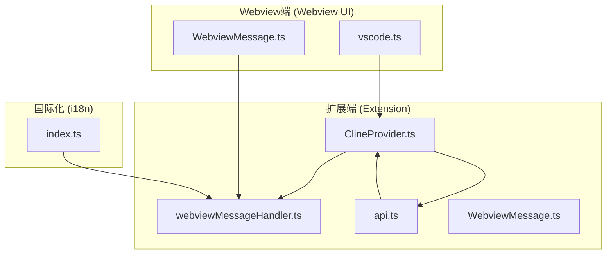
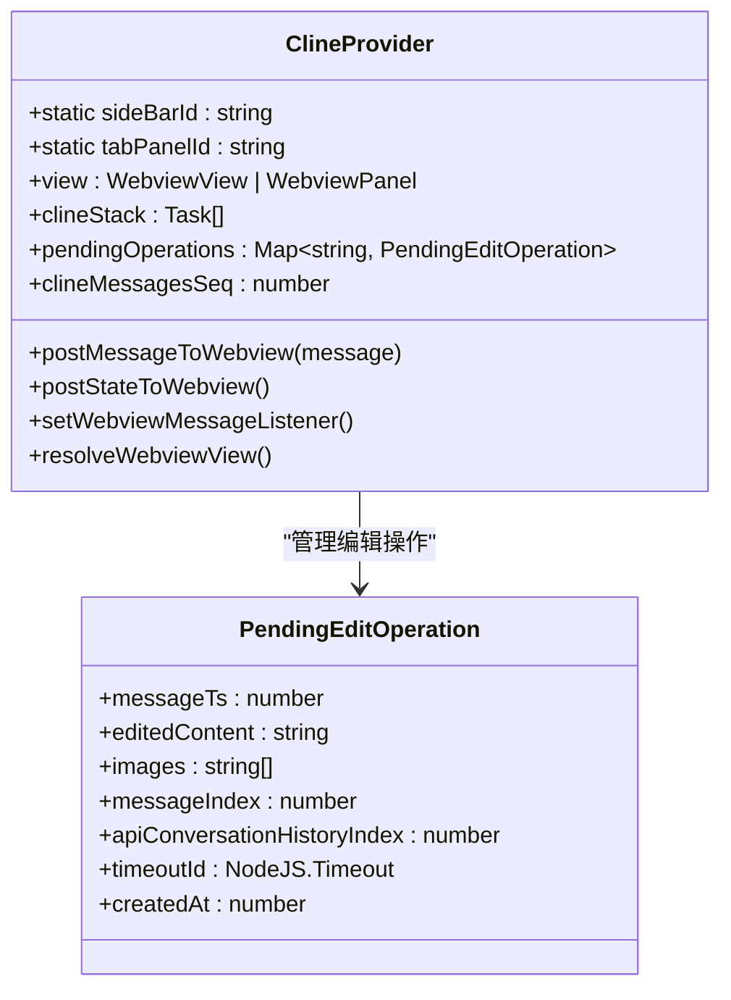
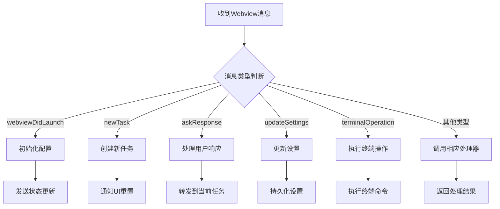
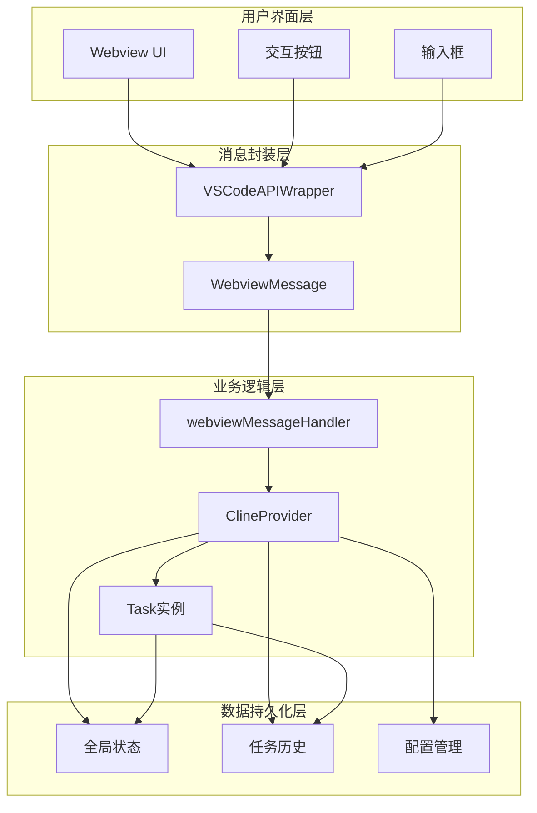
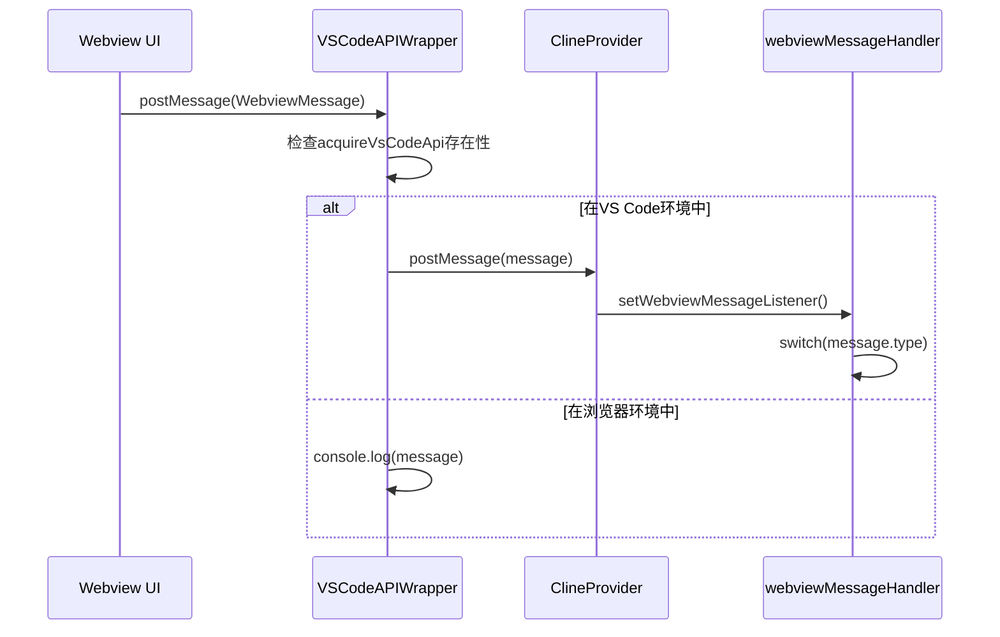
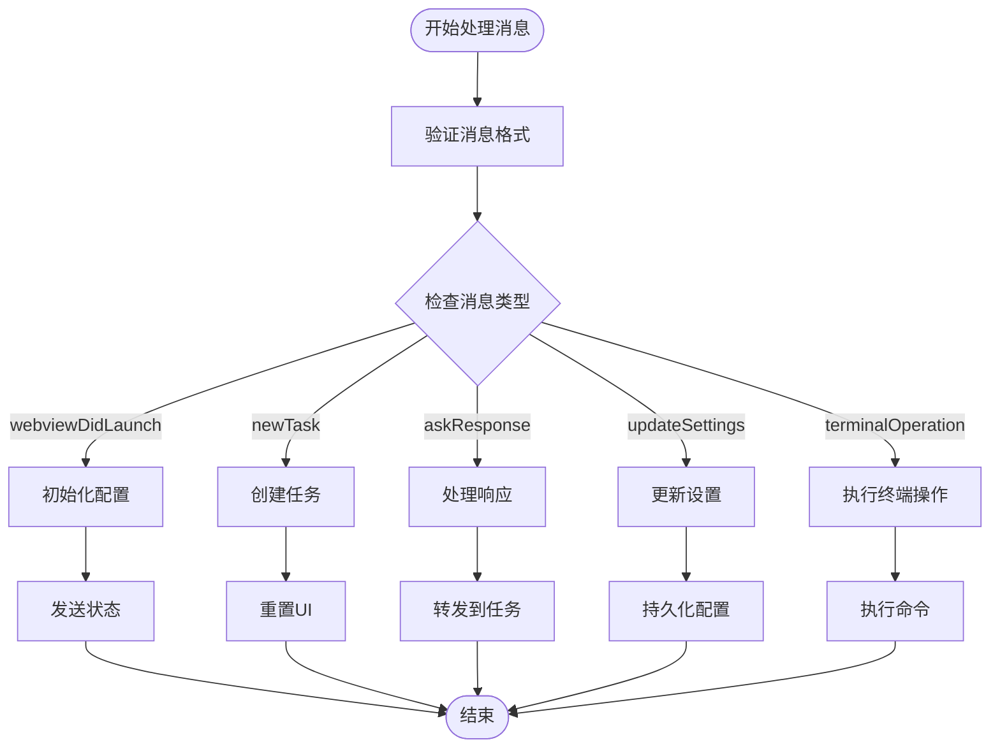
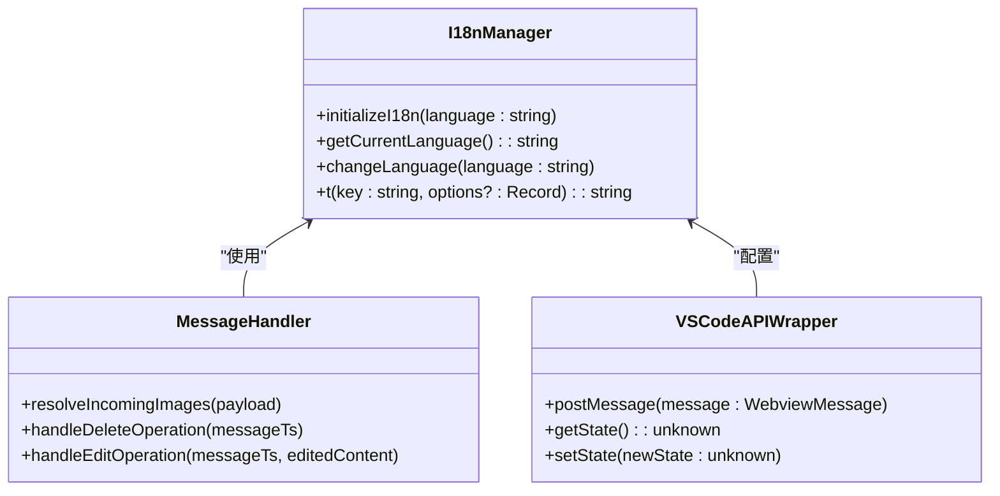
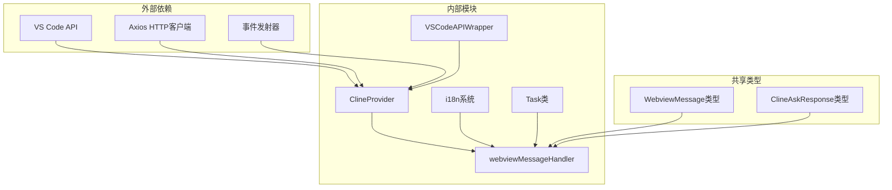
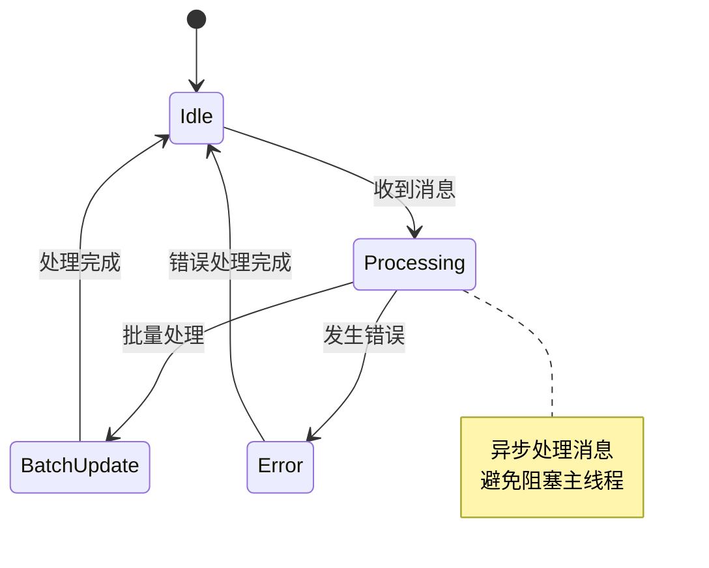

# 消息通信机制

<cite>
**本文档引用的文件**
- [ClineProvider.ts](file://src/core/webview/ClineProvider.ts)
- [webviewMessageHandler.ts](file://src/core/webview/webviewMessageHandler.ts)
- [WebviewMessage.ts](file://src/shared/WebviewMessage.ts)
- [vscode.ts](file://webview-ui/src/utils/vscode.ts)
- [api.ts](file://src/extension/api.ts)
- [index.ts](file://src/i18n/index.ts)
</cite>

## 目录
1. [简介](#简介)
2. [项目结构](#项目结构)
3. [核心组件](#核心组件)
4. [架构概览](#架构概览)
5. [详细组件分析](#详细组件分析)
6. [依赖关系分析](#依赖关系分析)
7. [性能考虑](#性能考虑)
8. [故障排除指南](#故障排除指南)
9. [结论](#结论)

## 简介

本文档深入分析了Njust-AI项目中Webview与VS Code扩展之间的消息通信机制。该系统实现了双向通信协议，支持实时消息传递、状态同步和事件处理。文档详细解释了ClineProvider的消息处理机制、webviewMessageHandler的消息路由、格式化工具的数据转换以及国际化消息的本地化处理。

## 项目结构

消息通信系统主要分布在以下关键目录中：

**图表来源**
- [ClineProvider.ts:126-312](file://src/core/webview/ClineProvider.ts#L126-L312)
- [webviewMessageHandler.ts:80-522](file://src/core/webview/webviewMessageHandler.ts#L80-L522)
- [api.ts:31-163](file://src/extension/api.ts#L31-L163)

**章节来源**
- [ClineProvider.ts:1-100](file://src/core/webview/ClineProvider.ts#L1-L100)
- [webviewMessageHandler.ts:1-100](file://src/core/webview/webviewMessageHandler.ts#L1-L100)

## 核心组件

### ClineProvider - 主要消息处理器

ClineProvider是消息通信的核心组件，负责管理Webview生命周期和消息处理：

**图表来源**
- [ClineProvider.ts:126-156](file://src/core/webview/ClineProvider.ts#L126-L156)

### webviewMessageHandler - 消息路由中心

webviewMessageHandler提供统一的消息处理入口点：

**图表来源**
- [webviewMessageHandler.ts:522-800](file://src/core/webview/webviewMessageHandler.ts#L522-L800)

**章节来源**
- [ClineProvider.ts:730-800](file://src/core/webview/ClineProvider.ts#L730-L800)
- [webviewMessageHandler.ts:80-200](file://src/core/webview/webviewMessageHandler.ts#L80-L200)

## 架构概览

消息通信系统采用分层架构设计，确保清晰的职责分离和可维护性：

**图表来源**
- [vscode.ts:14-80](file://webview-ui/src/utils/vscode.ts#L14-L80)
- [webviewMessageHandler.ts:80-117](file://src/core/webview/webviewMessageHandler.ts#L80-L117)
- [ClineProvider.ts:172-226](file://src/core/webview/ClineProvider.ts#L172-L226)

## 详细组件分析

### 消息格式定义

Webview消息使用统一的类型定义确保类型安全：

| 消息类型 | 描述 | 负载结构 | 使用场景 |
|---------|------|----------|----------|
| `webviewDidLaunch` | Webview启动完成 | `{ type: "webviewDidLaunch" }` | 初始化阶段 |
| `newTask` | 创建新任务 | `{ type: "newTask", text: string, images?: string[] }` | 用户发起新对话 |
| `askResponse` | 处理用户选择 | `{ type: "askResponse", askResponse: ClineAskResponse, text?: string, images?: string[] }` | 处理确认对话框 |
| `updateSettings` | 更新配置 | `{ type: "updateSettings", updatedSettings: Partial<Settings> }` | 配置变更 |

**章节来源**
- [WebviewMessage.ts:1-4](file://src/shared/WebviewMessage.ts#L1-L4)

### 消息发送机制

Webview端通过VSCodeAPIWrapper封装消息发送：

**图表来源**
- [vscode.ts:33-39](file://webview-ui/src/utils/vscode.ts#L33-L39)
- [ClineProvider.ts:789-792](file://src/core/webview/ClineProvider.ts#L789-L792)

### 消息处理流程

扩展端的消息处理采用模式匹配方式：

**图表来源**
- [webviewMessageHandler.ts:522-734](file://src/core/webview/webviewMessageHandler.ts#L522-L734)

**章节来源**
- [webviewMessageHandler.ts:80-522](file://src/core/webview/webviewMessageHandler.ts#L80-L522)

### 国际化消息处理

系统支持多语言消息本地化：

**图表来源**
- [index.ts:8-39](file://src/i18n/index.ts#L8-L39)
- [webviewMessageHandler.ts:41-41](file://src/core/webview/webviewMessageHandler.ts#L41-L41)

**章节来源**
- [index.ts:1-42](file://src/i18n/index.ts#L1-L42)
- [webviewMessageHandler.ts:161-175](file://src/core/webview/webviewMessageHandler.ts#L161-L175)

### 错误处理和超时机制

系统实现了完善的错误处理和超时管理：

| 错误类型 | 处理策略 | 超时时间 | 重试机制 |
|---------|----------|----------|----------|
| 网络请求失败 | 指数退避重试 | 最大60秒 | 最多重试3次 |
| 消息发送失败 | 直接抛出异常 | 无超时 | 不自动重试 |
| 编辑操作超时 | 自动清理挂起操作 | 30秒 | 清理后重新开始 |
| 设置更新失败 | 回滚到上一个有效状态 | 无超时 | 显示错误提示 |

**章节来源**
- [ClineProvider.ts:495-554](file://src/core/webview/ClineProvider.ts#L495-L554)

## 依赖关系分析

消息通信系统的依赖关系如下：

**图表来源**
- [ClineProvider.ts:1-100](file://src/core/webview/ClineProvider.ts#L1-L100)
- [webviewMessageHandler.ts:1-50](file://src/core/webview/webviewMessageHandler.ts#L1-L50)

**章节来源**
- [ClineProvider.ts:1-100](file://src/core/webview/ClineProvider.ts#L1-L100)
- [webviewMessageHandler.ts:1-50](file://src/core/webview/webviewMessageHandler.ts#L1-L50)

## 性能考虑

### 消息队列优化

系统采用异步消息处理确保UI响应性：

- **批量状态更新**: 使用序列号避免过期状态覆盖
- **延迟写入**: 全局状态写入采用防抖机制
- **内存管理**: 及时清理挂起的编辑操作

### 并发控制

### 缓存策略

- **模型信息缓存**: 减少重复的API调用
- **配置状态缓存**: 避免频繁的文件读写
- **图像处理缓存**: 优化大文件传输

## 故障排除指南

### 常见问题诊断

| 问题症状 | 可能原因 | 解决方案 |
|---------|----------|----------|
| 消息无法发送 | Webview未就绪 | 检查`viewLaunched`状态 |
| 设置更新无效 | 权限不足 | 确认VS Code配置权限 |
| 图像处理失败 | 文件大小限制 | 检查最大文件大小配置 |
| 编辑操作超时 | 内存泄漏 | 清理挂起操作 |

### 调试技巧

1. **启用详细日志**: 使用输出通道查看消息流向
2. **检查消息序列**: 验证`clineMessagesSeq`确保消息顺序
3. **监控资源使用**: 关注内存和CPU使用情况
4. **验证类型安全**: 确保所有消息符合WebviewMessage类型定义

**章节来源**
- [ClineProvider.ts:570-620](file://src/core/webview/ClineProvider.ts#L570-L620)
- [webviewMessageHandler.ts:321-329](file://src/core/webview/webviewMessageHandler.ts#L321-L329)

## 结论

Njust-AI的消息通信机制展现了现代VS Code扩展开发的最佳实践。通过清晰的分层架构、严格的类型定义和完善的错误处理，系统实现了可靠的双向通信。ClineProvider作为核心协调者，webviewMessageHandler提供灵活的消息路由，而VSCodeAPIWrapper确保跨环境兼容性。

该系统的关键优势包括：
- **类型安全**: 完整的消息类型定义
- **异步处理**: 非阻塞的消息处理机制
- **国际化支持**: 内置的多语言本地化
- **错误恢复**: 完善的错误处理和超时管理
- **性能优化**: 批量处理和缓存策略

这些特性共同确保了良好的用户体验和系统的可维护性。