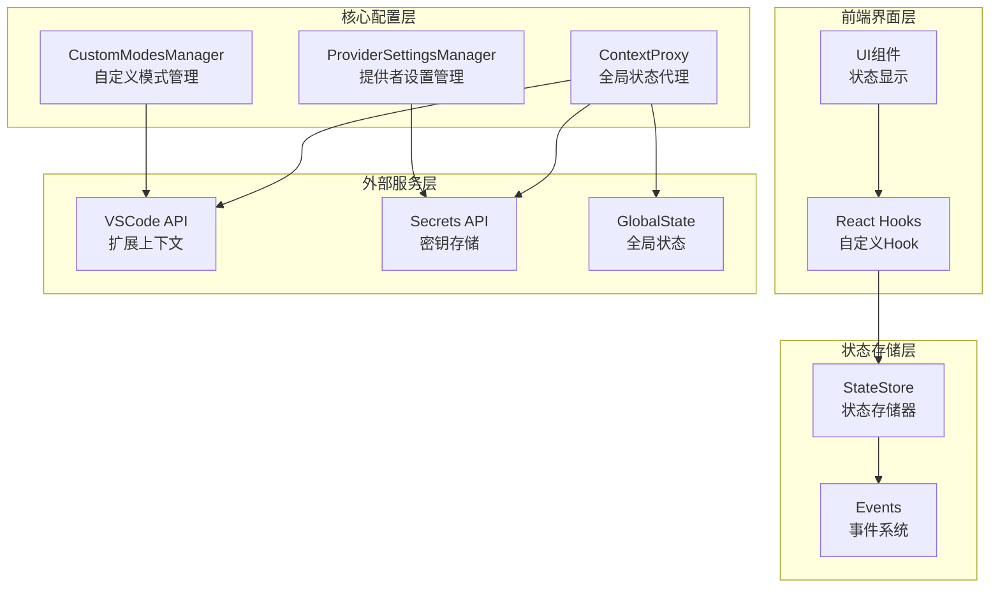
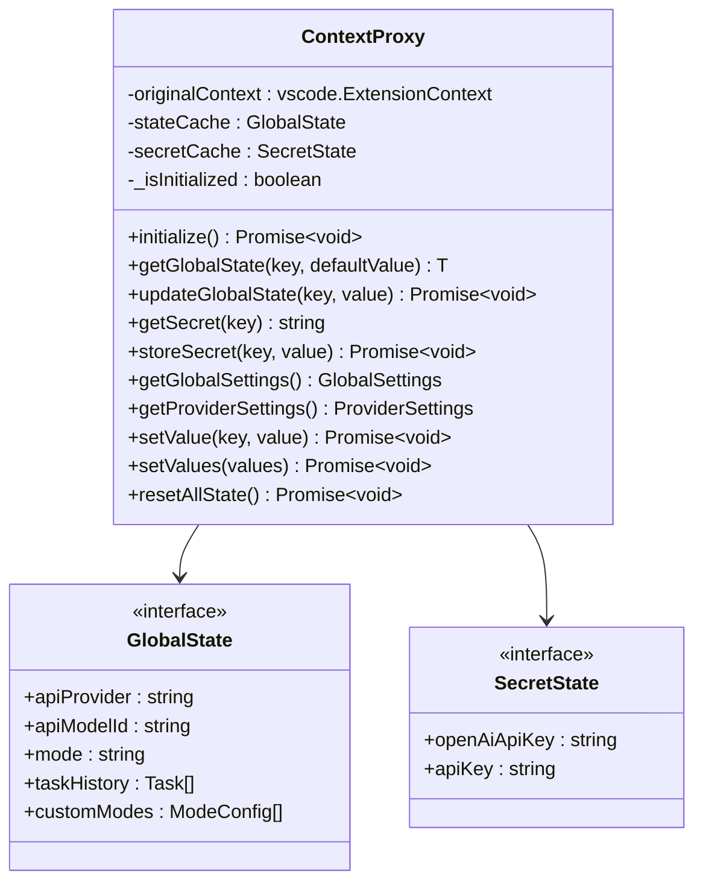
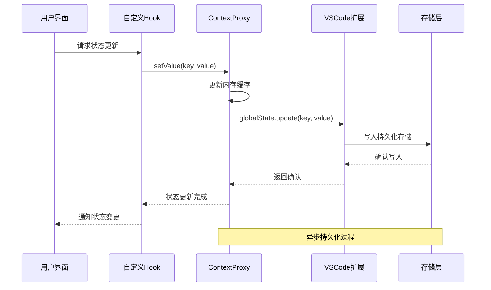
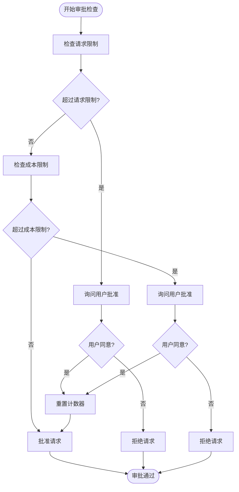
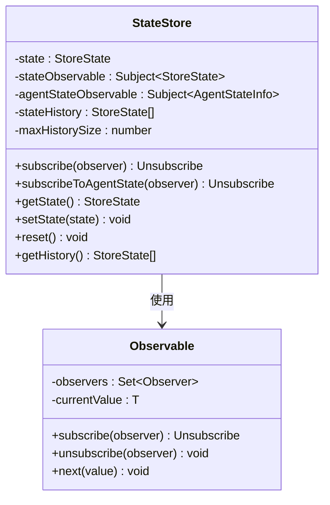
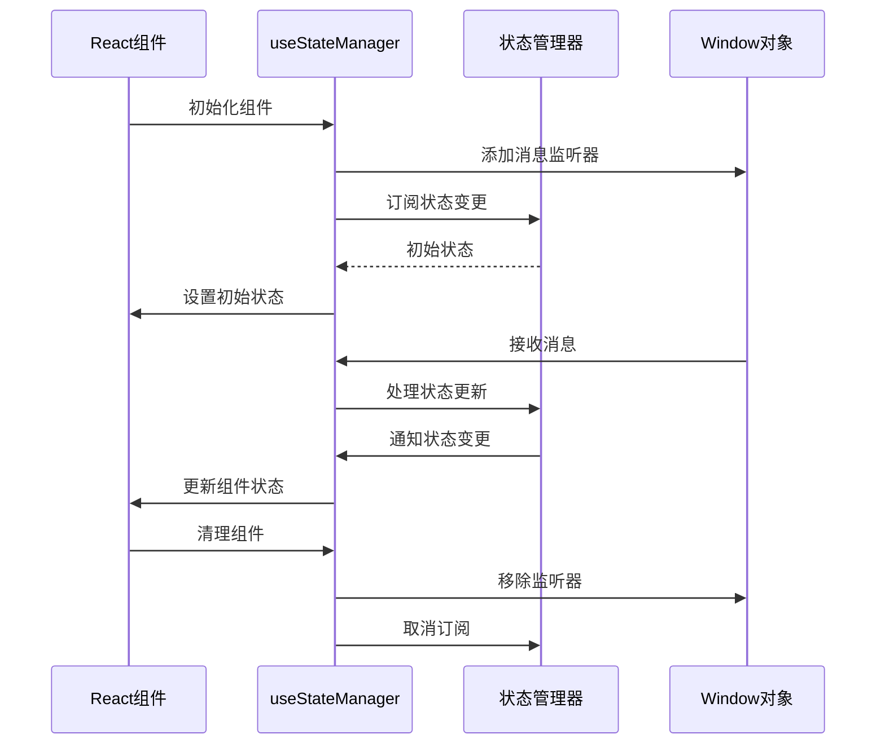
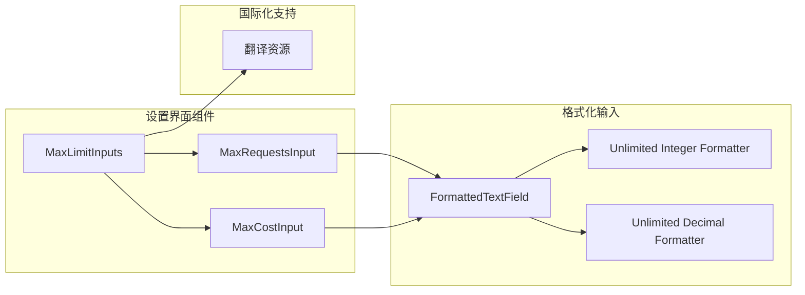
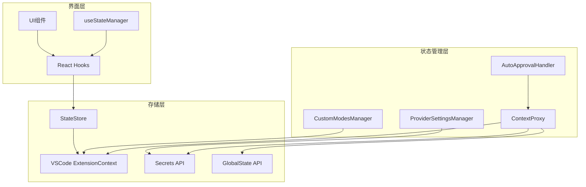

# 状态管理

<cite>
**本文档引用的文件**
- [ContextProxy.ts](file://src/core/config/ContextProxy.ts)
- [CustomModesManager.ts](file://src/core/config/CustomModesManager.ts)
- [ProviderSettingsManager.ts](file://src/core/config/ProviderSettingsManager.ts)
- [AutoApprovalHandler.ts](file://src/core/auto-approval/AutoApprovalHandler.ts)
- [state-store.ts](file://apps/cli/src/agent/state-store.ts)
- [events.ts](file://apps/cli/src/agent/events.ts)
- [useStateManager.ts](file://webview-ui/src/components/marketplace/useStateManager.ts)
- [MaxLimitInputs.tsx](file://webview-ui/src/components/settings/MaxLimitInputs.tsx)
- [MaxRequestsInput.tsx](file://webview-ui/src/components/settings/MaxRequestsInput.tsx)
- [MaxCostInput.tsx](file://webview-ui/src/components/settings/MaxCostInput.tsx)
</cite>

## 目录
1. [简介](#简介)
2. [项目结构](#项目结构)
3. [核心组件](#核心组件)
4. [架构概览](#架构概览)
5. [详细组件分析](#详细组件分析)
6. [依赖关系分析](#依赖关系分析)
7. [性能考虑](#性能考虑)
8. [故障排除指南](#故障排除指南)
9. [结论](#结论)

## 简介

本文档深入解析 Njust-AI 项目的状态管理系统，重点阐述基于 React Context 和自定义 Hook 的状态管理模式。系统采用分层架构设计，通过 ContextProxy 实现全局状态的统一管理和持久化，结合 ProviderSettingsManager 和 CustomModesManager 提供配置和模式管理功能。状态管理涵盖了自动审批状态、云服务状态处理、用户偏好设置等多个方面。

## 项目结构

状态管理系统主要分布在以下模块中：

**图表来源**
- [ContextProxy.ts:1-589](file://src/core/config/ContextProxy.ts#L1-L589)
- [ProviderSettingsManager.ts:1-882](file://src/core/config/ProviderSettingsManager.ts#L1-L882)
- [CustomModesManager.ts:1-1021](file://src/core/config/CustomModesManager.ts#L1-L1021)

**章节来源**
- [ContextProxy.ts:1-589](file://src/core/config/ContextProxy.ts#L1-L589)
- [ProviderSettingsManager.ts:1-882](file://src/core/config/ProviderSettingsManager.ts#L1-L882)
- [CustomModesManager.ts:1-1021](file://src/core/config/CustomModesManager.ts#L1-L1021)

## 核心组件

### ContextProxy - 全局状态代理

ContextProxy 是状态管理系统的核心组件，负责统一管理全局状态、密钥状态和提供者设置。它实现了以下关键功能：

- **状态缓存管理**：维护内存中的状态缓存，提高访问性能
- **类型安全验证**：使用 Zod 模式验证确保数据完整性
- **迁移兼容性**：处理旧版本数据结构的迁移
- **密钥安全管理**：区分普通状态和敏感信息的存储方式

**图表来源**
- [ContextProxy.ts:40-589](file://src/core/config/ContextProxy.ts#L40-L589)

### ProviderSettingsManager - 提供者设置管理

ProviderSettingsManager 负责管理 API 提供者的配置，包括：

- **配置文件管理**：处理提供者配置的增删改查操作
- **模型迁移**：自动处理模型 ID 的版本迁移
- **云同步**：支持云端配置的同步和冲突解决
- **锁机制**：确保并发操作的安全性

**章节来源**
- [ProviderSettingsManager.ts:57-882](file://src/core/config/ProviderSettingsManager.ts#L57-L882)

### CustomModesManager - 自定义模式管理

CustomModesManager 提供自定义工作模式的管理功能：

- **文件监听**：实时监控配置文件的变更
- **YAML 解析**：安全地解析和验证 YAML 配置
- **缓存机制**：避免频繁的文件读取操作
- **规则目录管理**：管理模式相关的规则文件

**章节来源**
- [CustomModesManager.ts:53-1021](file://src/core/config/CustomModesManager.ts#L53-L1021)

## 架构概览

状态管理系统的整体架构采用分层设计，确保了良好的可维护性和扩展性：

**图表来源**
- [ContextProxy.ts:320-340](file://src/core/config/ContextProxy.ts#L320-L340)
- [state-store.ts:330-384](file://apps/cli/src/agent/state-store.ts#L330-L384)

## 详细组件分析

### 自动审批状态管理

AutoApprovalHandler 实现了智能的自动审批机制，通过限制请求次数和成本来保护用户资源：

**图表来源**
- [AutoApprovalHandler.ts:21-135](file://src/core/auto-approval/AutoApprovalHandler.ts#L21-L135)

**章节来源**
- [AutoApprovalHandler.ts:13-155](file://src/core/auto-approval/AutoApprovalHandler.ts#L13-L155)

### 状态存储和订阅机制

StateStore 提供了完整的状态存储和订阅功能：

**图表来源**
- [state-store.ts:323-384](file://apps/cli/src/agent/state-store.ts#L323-L384)
- [events.ts:301-320](file://apps/cli/src/agent/events.ts#L301-L320)

**章节来源**
- [state-store.ts:323-415](file://apps/cli/src/agent/state-store.ts#L323-L415)
- [events.ts:266-320](file://apps/cli/src/agent/events.ts#L266-L320)

### 前端状态管理 Hook

useStateManager Hook 实现了 React 组件的状态管理：

**图表来源**
- [useStateManager.ts:28-50](file://webview-ui/src/components/marketplace/useStateManager.ts#L28-L50)

**章节来源**
- [useStateManager.ts:28-50](file://webview-ui/src/components/marketplace/useStateManager.ts#L28-L50)

### 用户偏好设置界面

MaxLimitInputs 组件提供了用户友好的设置界面：

**图表来源**
- [MaxLimitInputs.tsx:1-32](file://webview-ui/src/components/settings/MaxLimitInputs.tsx#L1-L32)
- [MaxRequestsInput.tsx:1-29](file://webview-ui/src/components/settings/MaxRequestsInput.tsx#L1-L29)
- [MaxCostInput.tsx:1-30](file://webview-ui/src/components/settings/MaxCostInput.tsx#L1-L30)

**章节来源**
- [MaxLimitInputs.tsx:1-32](file://webview-ui/src/components/settings/MaxLimitInputs.tsx#L1-L32)
- [MaxRequestsInput.tsx:1-29](file://webview-ui/src/components/settings/MaxRequestsInput.tsx#L1-L29)
- [MaxCostInput.tsx:1-30](file://webview-ui/src/components/settings/MaxCostInput.tsx#L1-L30)

## 依赖关系分析

状态管理系统各组件之间的依赖关系如下：

**图表来源**
- [ContextProxy.ts:1-589](file://src/core/config/ContextProxy.ts#L1-L589)
- [ProviderSettingsManager.ts:1-882](file://src/core/config/ProviderSettingsManager.ts#L1-L882)
- [CustomModesManager.ts:1-1021](file://src/core/config/CustomModesManager.ts#L1-L1021)

**章节来源**
- [ContextProxy.ts:1-589](file://src/core/config/ContextProxy.ts#L1-L589)
- [ProviderSettingsManager.ts:1-882](file://src/core/config/ProviderSettingsManager.ts#L1-L882)
- [CustomModesManager.ts:1-1021](file://src/core/config/CustomModesManager.ts#L1-L1021)

## 性能考虑

### 缓存策略

系统采用了多层缓存机制来提升性能：

1. **内存缓存**：ContextProxy 维护状态和密钥的内存缓存
2. **文件缓存**：CustomModesManager 使用 TTL 缓存机制
3. **观察者缓存**：StateStore 仅通知必要的观察者

### 异步操作优化

- **批量更新**：支持多个状态键的批量更新操作
- **锁机制**：ProviderSettingsManager 使用锁确保并发安全
- **延迟加载**：按需加载配置文件，避免不必要的 I/O 操作

### 内存管理

- **历史记录限制**：StateStore 支持限制状态历史记录大小
- **自动清理**：组件卸载时自动清理事件监听器
- **垃圾回收**：及时释放不再使用的资源

## 故障排除指南

### 常见问题及解决方案

1. **状态不同步问题**
   - 检查 ContextProxy 的初始化状态
   - 验证 VSCode 扩展上下文的可用性
   - 确认全局状态的持久化是否正常

2. **配置加载失败**
   - 检查 YAML 文件的语法正确性
   - 验证模式配置的完整性
   - 查看迁移日志以识别兼容性问题

3. **权限相关错误**
   - 确认扩展具有必要的文件系统权限
   - 检查密钥存储的访问权限
   - 验证 VSCode 设置的配置

**章节来源**
- [ContextProxy.ts:58-104](file://src/core/config/ContextProxy.ts#L58-L104)
- [CustomModesManager.ts:267-360](file://src/core/config/CustomModesManager.ts#L267-L360)

### 调试技巧

1. **启用调试模式**：在 StateStore 中启用调试模式获取详细日志
2. **监控状态变更**：使用订阅机制跟踪状态的实时变化
3. **检查缓存一致性**：验证内存缓存与持久化存储的一致性
4. **验证数据完整性**：使用 Zod 模式验证确保数据格式正确

## 结论

Njust-AI 的状态管理系统展现了现代前端状态管理的最佳实践。通过 ContextProxy 的统一代理模式、ProviderSettingsManager 的配置管理、CustomModesManager 的文件监听机制，以及完善的 React Hook 集成，系统实现了高性能、可维护、可扩展的状态管理解决方案。

系统的关键优势包括：
- **类型安全**：全面的 TypeScript 类型定义和 Zod 验证
- **性能优化**：多层缓存和异步操作优化
- **扩展性**：清晰的架构设计支持功能扩展
- **用户体验**：直观的设置界面和自动审批机制

这套状态管理系统为大型 VSCode 扩展项目提供了坚实的基础，能够有效支撑复杂的 AI 辅助开发场景。