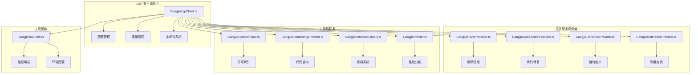
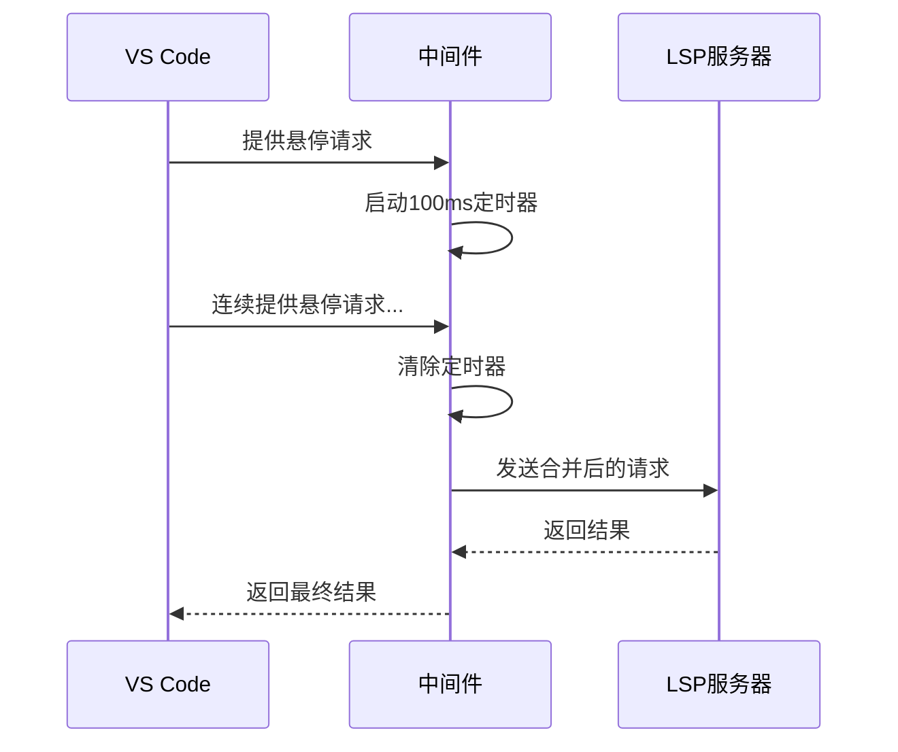
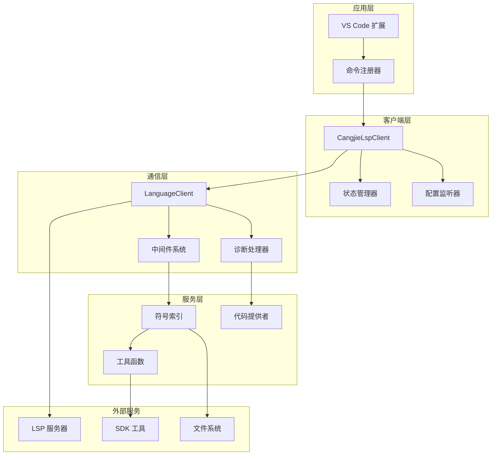
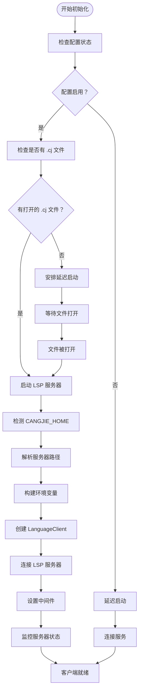
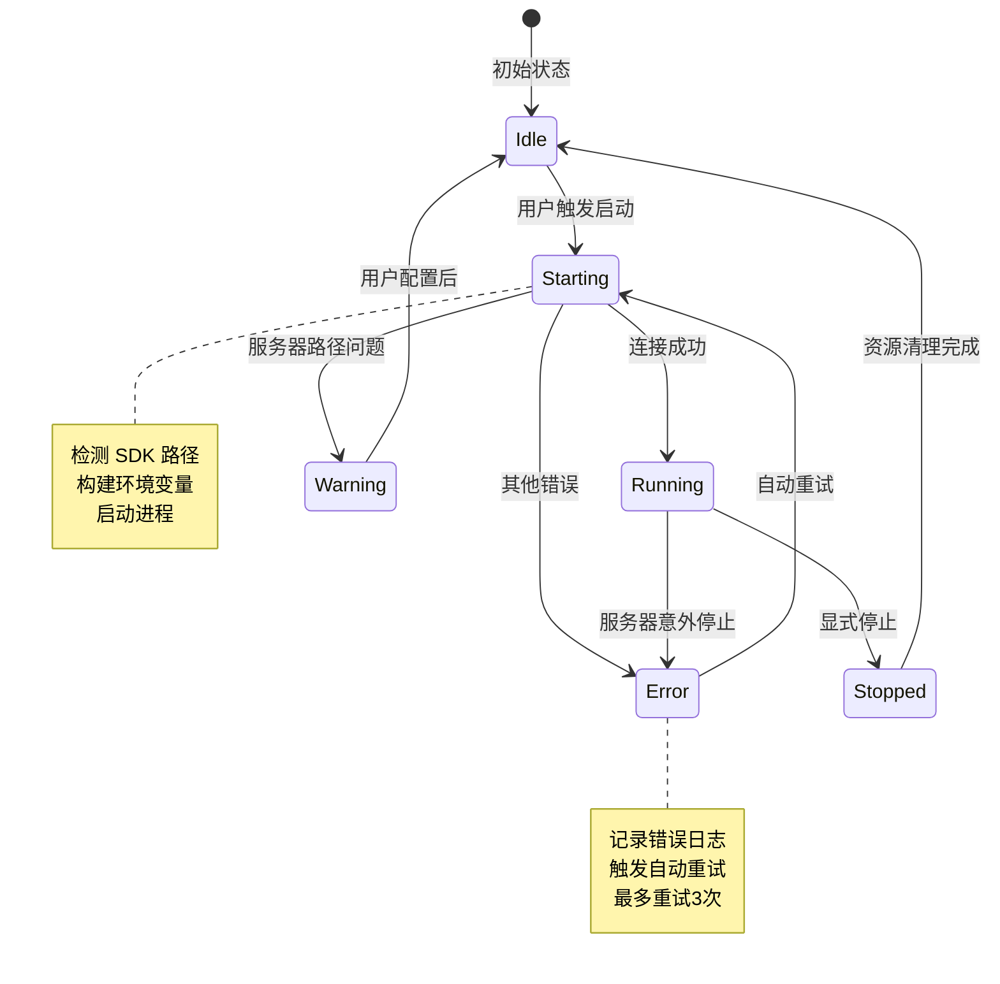
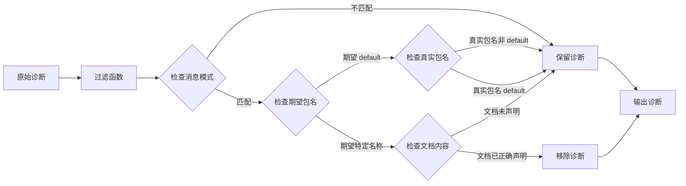
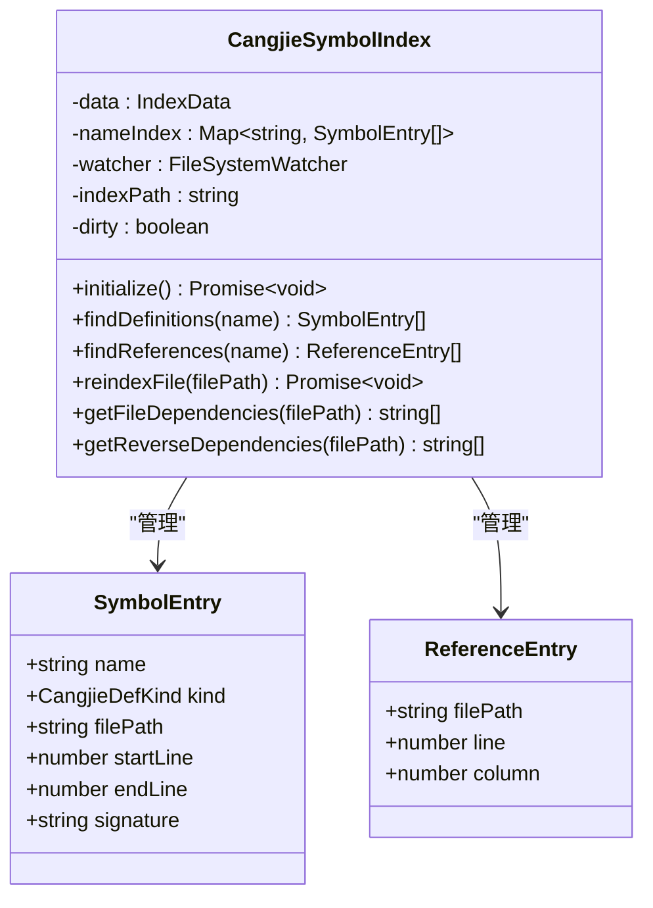
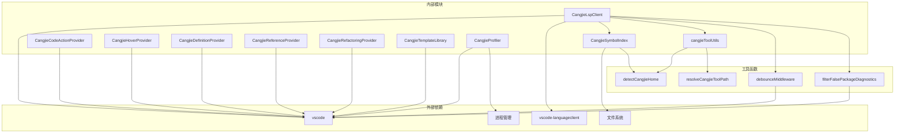

# LSP 客户端实现

<cite>
**本文档引用的文件**
- [CangjieLspClient.ts](file://src/services/cangjie-lsp/CangjieLspClient.ts)
- [cangjieCommands.ts](file://src/services/cangjie-lsp/cangjieCommands.ts)
- [cangjieToolUtils.ts](file://src/services/cangjie-lsp/cangjieToolUtils.ts)
- [CangjieHoverProvider.ts](file://src/services/cangjie-lsp/CangjieHoverProvider.ts)
- [CangjieCodeActionProvider.ts](file://src/services/cangjie-lsp/CangjieCodeActionProvider.ts)
- [CangjieDefinitionProvider.ts](file://src/services/cangjie-lsp/CangjieDefinitionProvider.ts)
- [CangjieReferenceProvider.ts](file://src/services/cangjie-lsp/CangjieReferenceProvider.ts)
- [CangjieSymbolIndex.ts](file://src/services/cangjie-lsp/CangjieSymbolIndex.ts)
- [CangjieRefactoringProvider.ts](file://src/services/cangjie-lsp/CangjieRefactoringProvider.ts)
- [CangjieTemplateLibrary.ts](file://src/services/cangjie-lsp/CangjieTemplateLibrary.ts)
- [CangjieProfiler.ts](file://src/services/cangjie-lsp/CangjieProfiler.ts)
- [registerCommands.ts](file://src/activate/registerCommands.ts)
</cite>

## 目录
1. [简介](#简介)
2. [项目结构](#项目结构)
3. [核心组件](#核心组件)
4. [架构概览](#架构概览)
5. [详细组件分析](#详细组件分析)
6. [依赖关系分析](#依赖关系分析)
7. [性能考虑](#性能考虑)
8. [故障排除指南](#故障排除指南)
9. [结论](#结论)

## 简介

Cangjie LSP 客户端是 VS Code 扩展中的核心组件，负责与 Cangjie 语言服务器进行通信，提供完整的语言支持功能。该实现基于 VS Code 的 LanguageClient 库，集成了多种高级特性，包括智能中间件、自动重启机制、符号索引系统和丰富的开发工具。

该 LSP 客户端不仅处理标准的 LSP 协议通信，还提供了本地化的增强功能，如符号索引、代码重构、模板库和性能分析工具。通过模块化的设计，它能够灵活地扩展各种功能，同时保持良好的性能和用户体验。

## 项目结构

Cangjie LSP 客户端位于 `src/services/cangjie-lsp/` 目录下，采用功能模块化组织：

**图表来源**
- [CangjieLspClient.ts:1-660](file://src/services/cangjie-lsp/CangjieLspClient.ts#L1-L660)
- [CangjieHoverProvider.ts:1-63](file://src/services/cangjie-lsp/CangjieHoverProvider.ts#L1-L63)
- [CangjieCodeActionProvider.ts:1-210](file://src/services/cangjie-lsp/CangjieCodeActionProvider.ts#L1-L210)

**章节来源**
- [CangjieLspClient.ts:1-660](file://src/services/cangjie-lsp/CangjieLspClient.ts#L1-L660)
- [cangjieToolUtils.ts:1-223](file://src/services/cangjie-lsp/cangjieToolUtils.ts#L1-L223)

## 核心组件

### LSP 客户端主类

CangjieLspClient 是整个系统的中枢，负责管理 LSP 服务器的生命周期和所有通信逻辑。

**主要特性：**
- **延迟启动**：仅在用户打开 .cj 文件时启动服务器
- **自动重启**：最多 3 次自动重启尝试
- **状态管理**：完整的状态跟踪和事件通知
- **配置监听**：实时响应配置变更

### 中间件系统

实现了智能的请求去抖动机制，优化高频请求的性能：

**图表来源**
- [CangjieLspClient.ts:20-56](file://src/services/cangjie-lsp/CangjieLspClient.ts#L20-L56)

**章节来源**
- [CangjieLspClient.ts:277-660](file://src/services/cangjie-lsp/CangjieLspClient.ts#L277-L660)

## 架构概览

Cangjie LSP 客户端采用分层架构设计，确保了良好的模块分离和可维护性：

**图表来源**
- [CangjieLspClient.ts:476-525](file://src/services/cangjie-lsp/CangjieLspClient.ts#L476-L525)
- [CangjieSymbolIndex.ts:43-83](file://src/services/cangjie-lsp/CangjieSymbolIndex.ts#L43-L83)

## 详细组件分析

### LSP 客户端初始化流程

LSP 客户端的初始化过程经过精心设计，确保了最佳的用户体验：

**图表来源**
- [CangjieLspClient.ts:376-565](file://src/services/cangjie-lsp/CangjieLspClient.ts#L376-L565)

### 连接管理机制

客户端实现了健壮的连接管理，包括自动重连和错误处理：

**图表来源**
- [CangjieLspClient.ts:270-290](file://src/services/cangjie-lsp/CangjieLspClient.ts#L270-L290)
- [CangjieLspClient.ts:567-594](file://src/services/cangjie-lsp/CangjieLspClient.ts#L567-L594)

**章节来源**
- [CangjieLspClient.ts:376-565](file://src/services/cangjie-lsp/CangjieLspClient.ts#L376-L565)

### 消息处理机制

LSP 客户端实现了多层次的消息处理机制：

#### 中间件系统
- **悬停请求去抖动**：100ms 去抖动间隔
- **补全请求去抖动**：150ms 去抖动间隔
- **诊断过滤**：智能过滤假阳性诊断

#### 诊断处理
实现了复杂的诊断过滤逻辑，解决常见的包名不匹配问题：

**图表来源**
- [CangjieLspClient.ts:86-129](file://src/services/cangjie-lsp/CangjieLspClient.ts#L86-L129)

**章节来源**
- [CangjieLspClient.ts:487-517](file://src/services/cangjie-lsp/CangjieLspClient.ts#L487-L517)

### 命令注册系统

命令系统提供了丰富的开发工具和快捷操作：

| 命令 ID | 功能描述 | 工具类型 |
|---------|----------|----------|
| `njust-ai.cangjieBuild` | 构建项目 | cjpm 命令 |
| `njust-ai.cangjieRun` | 运行程序 | cjpm 命令 |
| `njust-ai.cangjieTest` | 运行测试 | cjpm 命令 |
| `njust-ai.cangjieCheck` | 检查代码 | cjpm 命令 |
| `njust-ai.cangjieClean` | 清理构建 | cjpm 命令 |
| `njust-ai.cangjieRestartLsp` | 重启 LSP 服务器 | 服务器控制 |
| `njust-ai.cangjieInsertTemplate` | 插入代码模板 | 模板系统 |
| `njust-ai.cangjieProfile` | 性能分析 | 分析工具 |

**章节来源**
- [cangjieCommands.ts:64-141](file://src/services/cangjie-lsp/cangjieCommands.ts#L64-L141)

### 符号索引系统

CangjieSymbolIndex 提供了强大的本地符号索引功能：

**图表来源**
- [CangjieSymbolIndex.ts:43-470](file://src/services/cangjie-lsp/CangjieSymbolIndex.ts#L43-L470)

**章节来源**
- [CangjieSymbolIndex.ts:103-139](file://src/services/cangjie-lsp/CangjieSymbolIndex.ts#L103-L139)

### 代码提供者实现

实现了多个 VS Code 语言服务提供者：

#### 悬停提供者
- 解析 Cangjie 定义
- 提取完整签名行
- 支持多行定义显示

#### 代码动作提供者
- **快速修复**：自动修复常见语法错误
- **导入建议**：根据符号名推荐标准库包
- **不可变变量修复**：将 let 改为 var
- **模式匹配修复**：添加缺失的 case 分支

#### 定义和引用提供者
- 基于符号索引的跨文件跳转
- 文本基础的引用查找
- 支持包含声明的引用过滤

**章节来源**
- [CangjieCodeActionProvider.ts:50-183](file://src/services/cangjie-lsp/CangjieCodeActionProvider.ts#L50-L183)
- [CangjieDefinitionProvider.ts:9-31](file://src/services/cangjie-lsp/CangjieDefinitionProvider.ts#L9-L31)
- [CangjieReferenceProvider.ts:9-40](file://src/services/cangjie-lsp/CangjieReferenceProvider.ts#L9-L40)

### 工具函数集成

cangjieToolUtils 提供了 SDK 工具的统一访问接口：

#### 路径解析
- **CANGJIE_HOME 检测**：从环境变量和已知位置检测
- **工具路径解析**：支持用户配置和自动检测
- **缓存机制**：避免重复的文件系统检查

#### 环境配置
- **PATH 构建**：自动添加 SDK 库路径
- **动态环境**：根据平台调整环境变量
- **缓存优化**：环境构建结果缓存

**章节来源**
- [cangjieToolUtils.ts:18-130](file://src/services/cangjie-lsp/cangjieToolUtils.ts#L18-L130)

### 配置管理系统

客户端支持多种配置选项：

| 配置项 | 类型 | 默认值 | 描述 |
|--------|------|--------|------|
| `cangjieLsp.enabled` | boolean | true | 启用/禁用 LSP 服务 |
| `cangjieLsp.serverPath` | string | "" | LSP 服务器路径 |
| `cangjieLsp.enableLog` | boolean | false | 启用服务器日志 |
| `cangjieLsp.logPath` | string | "" | 日志文件路径 |
| `cangjieLsp.disableAutoImport` | boolean | false | 禁用自动导入 |

**章节来源**
- [CangjieLspClient.ts:139-148](file://src/services/cangjie-lsp/CangjieLspClient.ts#L139-L148)

## 依赖关系分析

**图表来源**
- [CangjieLspClient.ts:1-12](file://src/services/cangjie-lsp/CangjieLspClient.ts#L1-L12)
- [CangjieSymbolIndex.ts:1-11](file://src/services/cangjie-lsp/CangjieSymbolIndex.ts#L1-L11)

**章节来源**
- [CangjieLspClient.ts:1-12](file://src/services/cangjie-lsp/CangjieLspClient.ts#L1-L12)
- [CangjieSymbolIndex.ts:1-11](file://src/services/cangjie-lsp/CangjieSymbolIndex.ts#L1-L11)

## 性能考虑

### 去抖动机制
- **悬停请求**：100ms 去抖动间隔
- **补全请求**：150ms 去抖动间隔
- **性能提升**：显著减少 LSP 服务器负载

### 缓存策略
- **符号索引缓存**：内存中存储符号数据
- **文件读取缓存**：避免重复的文件系统访问
- **环境变量缓存**：SDK 路径检测结果缓存

### 异步处理
- **批量索引**：文件索引使用 Promise.all 并行处理
- **延迟启动**：仅在需要时启动 LSP 服务器
- **资源清理**：及时释放不再使用的资源

### 内存管理
- **索引大小限制**：文件搜索限制为 2000 个文件
- **垃圾回收**：定期清理无用的符号引用
- **内存监控**：避免符号索引无限增长

## 故障排除指南

### 常见问题及解决方案

#### LSP 服务器无法启动
**症状**：启动失败，显示 "Failed to start Cangjie Language Server"

**可能原因**：
1. CANGJIE_HOME 环境变量未设置
2. LSP 服务器二进制文件不存在
3. SDK 环境配置不正确

**解决方案**：
1. 设置 CANGJIE_HOME 环境变量
2. 在设置中配置正确的服务器路径
3. 运行 SDK 的 envsetup 脚本

#### 诊断信息不准确
**症状**：出现 "package name supposed to be 'default'" 等警告

**解决方案**：
1. 检查 cjpm.toml 文件中的包名配置
2. 确认源文件中的 package 声明
3. 使用内置的诊断过滤功能

#### 符号索引不更新
**症状**：跳转定义或引用查找不准确

**解决方案**：
1. 手动触发重新索引
2. 检查文件权限
3. 清理符号索引缓存

**章节来源**
- [CangjieLspClient.ts:546-564](file://src/services/cangjie-lsp/CangjieLspClient.ts#L546-L564)
- [CangjieLspClient.ts:86-129](file://src/services/cangjie-lsp/CangjieLspClient.ts#L86-L129)

### 调试技巧

#### 启用详细日志
1. 设置 `cangjieLsp.enableLog` 为 true
2. 查看输出面板中的 LSP 日志
3. 监控服务器启动和连接过程

#### 性能分析
1. 使用内置的性能计时功能
2. 监控首次补全和悬停响应时间
3. 分析符号索引构建时间

#### 状态监控
1. 监听状态变化事件
2. 检查服务器连接状态
3. 跟踪自动重启次数

## 结论

Cangjie LSP 客户端实现了一个功能完整、性能优异的语言服务系统。通过精心设计的架构和优化的算法，它提供了流畅的开发体验和强大的语言支持功能。

**主要优势：**
- **模块化设计**：清晰的职责分离和可维护性
- **性能优化**：智能去抖动和缓存机制
- **错误处理**：健壮的异常处理和恢复机制
- **扩展性**：易于添加新的语言服务功能

**未来改进方向：**
- 更智能的符号索引更新策略
- 增强的代码重构功能
- 更丰富的开发工具集成
- 改进的性能监控和分析

这个实现为 Cangjie 语言提供了一个坚实的基础，支持开发者高效地编写高质量的代码。