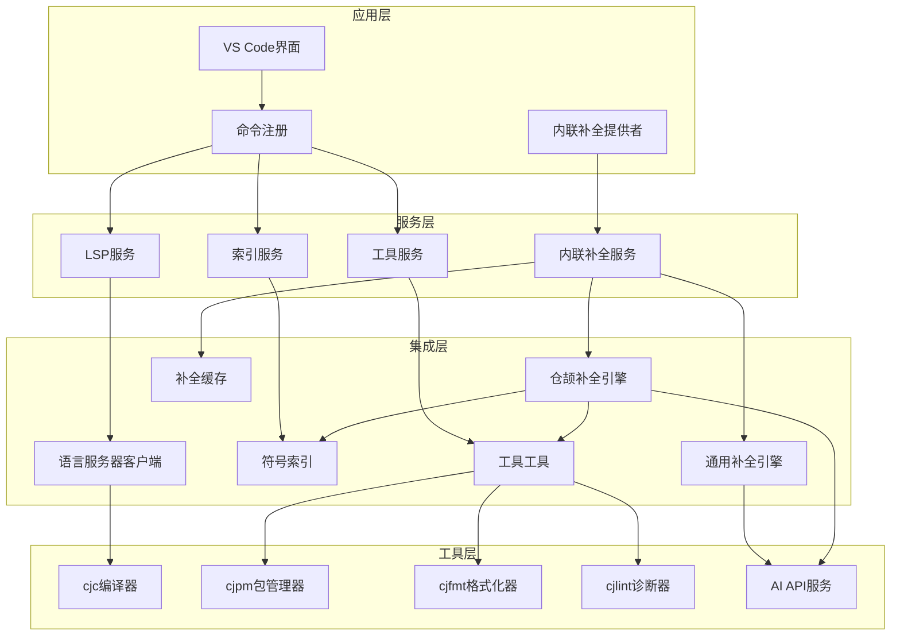
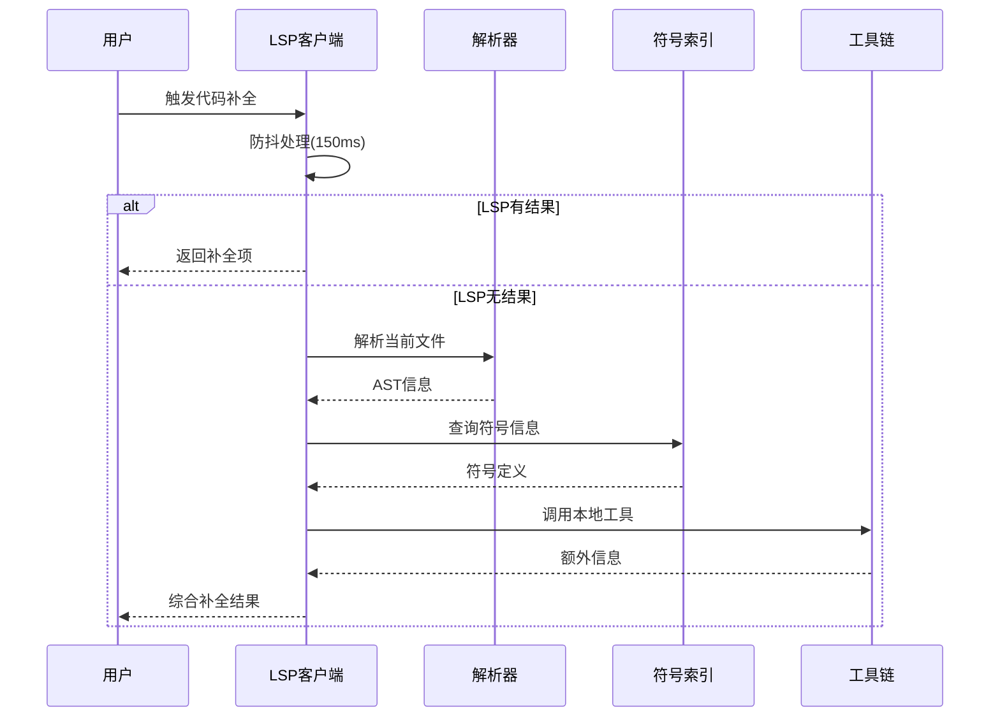
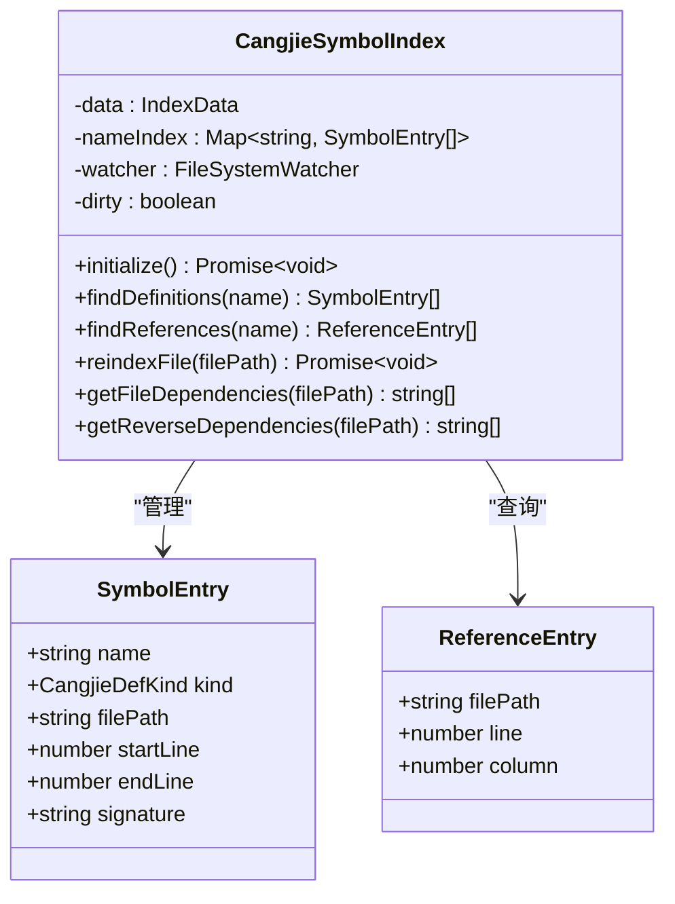
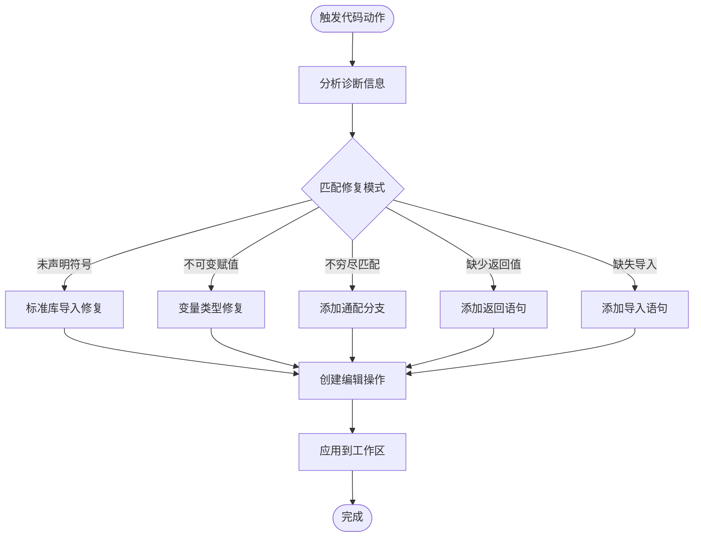
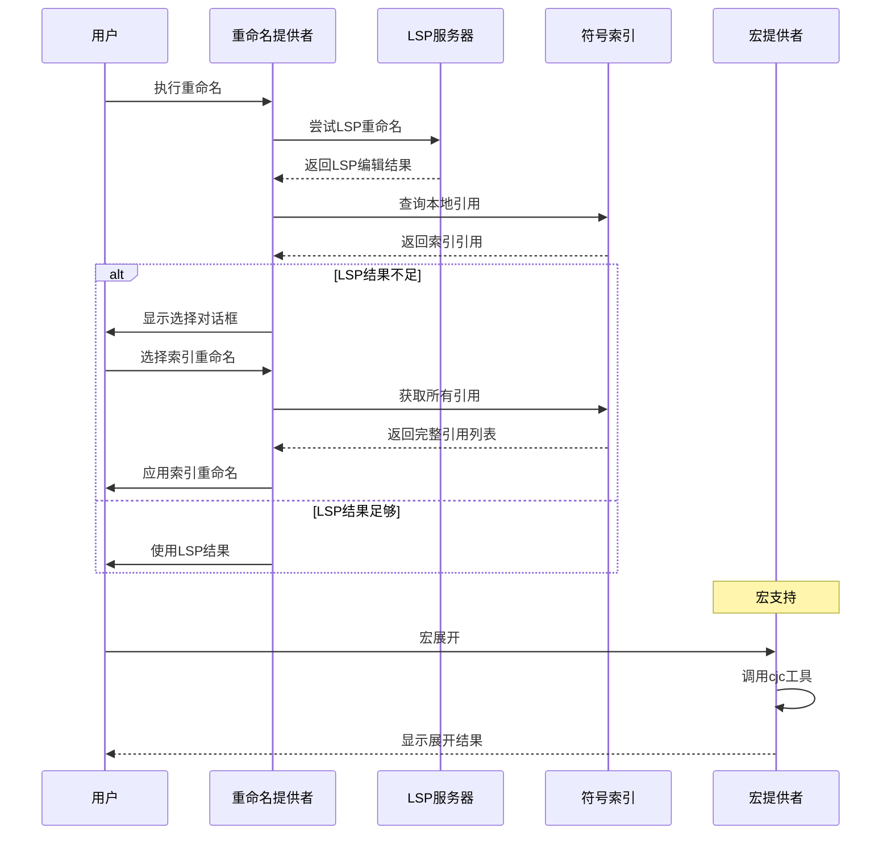
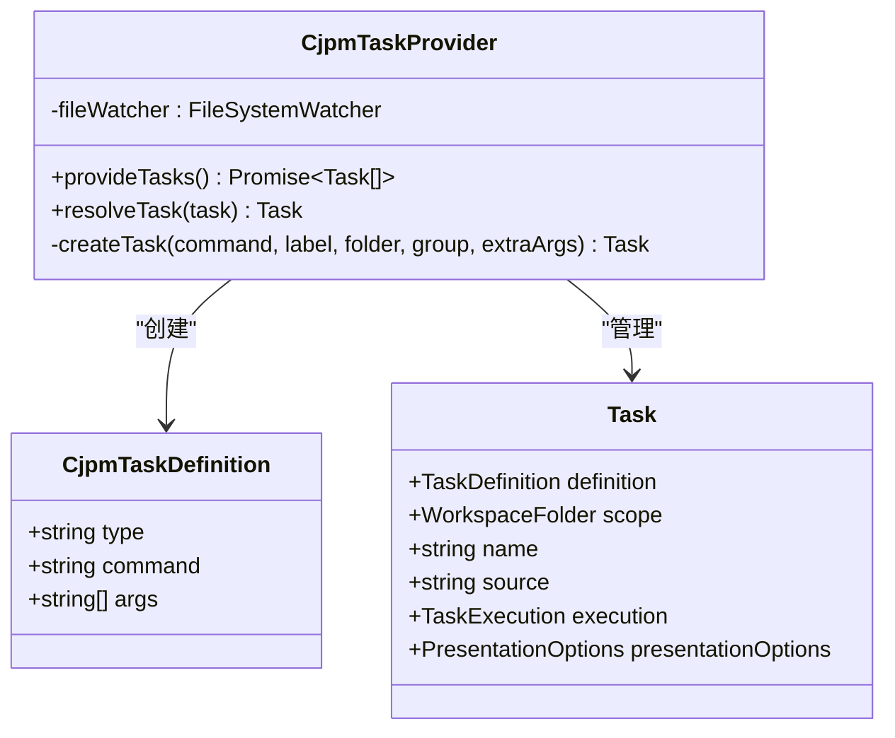
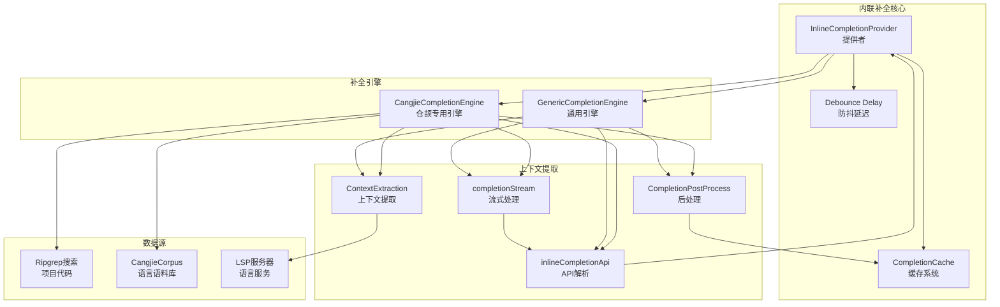

# 仓颉语言集成系统

<cite>
**本文档引用的文件**
- [CangjieLspClient.ts](file://src/services/cangjie-lsp/CangjieLspClient.ts)
- [CangjieSymbolIndex.ts](file://src/services/cangjie-lsp/CangjieSymbolIndex.ts)
- [CangjieCodeActionProvider.ts](file://src/services/cangjie-lsp/CangjieCodeActionProvider.ts)
- [CangjieEnhancedRenameProvider.ts](file://src/services/cangjie-lsp/CangjieEnhancedRenameProvider.ts)
- [CjfmtFormatter.ts](file://src/services/cangjie-lsp/CjfmtFormatter.ts)
- [CangjieHoverProvider.ts](file://src/services/cangjie-lsp/CangjieHoverProvider.ts)
- [CangjieDefinitionProvider.ts](file://src/services/cangjie-lsp/CangjieDefinitionProvider.ts)
- [CangjieReferenceProvider.ts](file://src/services/cangjie-lsp/CangjieReferenceProvider.ts)
- [CjlintDiagnostics.ts](file://src/services/cangjie-lsp/CjlintDiagnostics.ts)
- [CjpmTaskProvider.ts](file://src/services/cangjie-lsp/CjpmTaskProvider.ts)
- [CangjieMacroProvider.ts](file://src/services/cangjie-lsp/CangjieMacroProvider.ts)
- [CangjieDocumentSymbolProvider.ts](file://src/services/cangjie-lsp/CangjieDocumentSymbolProvider.ts)
- [CangjieFoldingRangeProvider.ts](file://src/services/cangjie-lsp/CangjieFoldingRangeProvider.ts)
- [CangjieTestCodeLensProvider.ts](file://src/services/cangjie-lsp/CangjieTestCodeLensProvider.ts)
- [cangjieToolUtils.ts](file://src/services/cangjie-lsp/cangjieToolUtils.ts)
- [InlineCompletionProvider.ts](file://src/services/inline-completion/InlineCompletionProvider.ts)
- [CangjieCompletionEngine.ts](file://src/services/inline-completion/CangjieCompletionEngine.ts)
- [GenericCompletionEngine.ts](file://src/services/inline-completion/GenericCompletionEngine.ts)
- [CompletionCache.ts](file://src/services/inline-completion/CompletionCache.ts)
- [completionStream.ts](file://src/services/inline-completion/completionStream.ts)
- [completionPostProcess.ts](file://src/services/inline-completion/completionPostProcess.ts)
- [contextExtraction.ts](file://src/services/inline-completion/contextExtraction.ts)
- [inlineCompletionApi.ts](file://src/services/inline-completion/inlineCompletionApi.ts)
</cite>

## 更新摘要
**所做更改**
- 新增内联代码补全系统章节，详细介绍 CangjieCompletionEngine 的实现
- 添加内联补全引擎架构图和工作流程图
- 更新核心组件分析，包含内联补全功能
- 新增内联补全配置和设置说明
- 扩展性能考虑部分，包含缓存策略和优化机制

## 目录
1. [简介](#简介)
2. [项目结构](#项目结构)
3. [核心组件](#核心组件)
4. [架构概览](#架构概览)
5. [详细组件分析](#详细组件分析)
6. [内联代码补全系统](#内联代码补全系统)
7. [依赖关系分析](#依赖关系分析)
8. [性能考虑](#性能考虑)
9. [故障排除指南](#故障排除指南)
10. [结论](#结论)

## 简介

仓颉语言集成系统是一个专为仓颉编程语言设计的完整IDE解决方案，集成了语言服务器协议(LSP)客户端、符号索引系统、代码补全与诊断功能，以及完整的开发工具链支持。该系统通过深度集成Cangjie SDK工具链，为开发者提供了从语法高亮、智能补全到代码重构、宏展开的全方位开发体验。

**最新更新**：系统现已集成先进的内联代码补全功能，通过专门的 CangjieCompletionEngine 提供智能化的代码建议，支持项目范围的代码搜索和语言特定优化。

系统的核心特色包括：
- **智能语言服务器集成**：基于vscode-languageclient实现的LSP客户端，提供高性能的代码分析和诊断
- **本地符号索引系统**：构建跨文件的符号索引，支持快速定义跳转和引用查找
- **多层代码分析**：结合LSP服务器和本地解析器，提供互补的代码分析能力
- **完整的工具链集成**：cjpm任务系统、cjfmt格式化、cjlint诊断、cjc宏展开等功能
- **智能代码动作**：自动修复常见错误，提升开发效率
- **内联代码补全**：基于LLM+Grep的智能补全系统，支持仓颉语言特定优化

## 项目结构

仓颉语言集成系统的项目结构采用模块化设计，主要集中在`src/services/cangjie-lsp`和`src/services/inline-completion`目录下：

```mermaid
graph TB
subgraph "核心服务层"
LSP[CangjieLspClient<br/>语言服务器客户端]
Index[CangjieSymbolIndex<br/>符号索引系统]
Tools[cangjieToolUtils<br/>工具链工具]
Inline[InlineCompletionProvider<br/>内联补全提供者]
end
subgraph "语言功能层"
Hover[CangjieHoverProvider<br/>悬停信息]
Def[CangjieDefinitionProvider<br/>定义跳转]
Ref[CangjieReferenceProvider<br/>引用查找]
DocSym[CangjieDocumentSymbolProvider<br/>文档符号]
Fold[CangjieFoldingRangeProvider<br/>折叠范围]
Macro[CangjieMacroProvider<br/>宏支持]
Test[TestCodeLensProvider<br/>测试代码镜头]
end
subgraph "工具集成层"
Format[CjfmtFormatter<br/>代码格式化]
Diag[CjlintDiagnostics<br/>代码诊断]
Task[CjpmTaskProvider<br/>任务管理]
CodeAction[CangjieCodeActionProvider<br/>代码动作]
Rename[CangjieEnhancedRenameProvider<br/>重命名]
end
subgraph "内联补全引擎"
CangjieEngine[CangjieCompletionEngine<br/>仓颉补全引擎]
GenericEngine[GenericCompletionEngine<br/>通用补全引擎]
Cache[CompletionCache<br/>补全缓存]
Context[ContextExtraction<br/>上下文提取]
PostProcess[CompletionPostProcess<br/>后处理]
end
subgraph "配置与状态"
Config[配置管理]
Status[状态监控]
end
LSP --> Index
LSP --> Tools
LSP --> Inline
Inline --> CangjieEngine
Inline --> GenericEngine
Inline --> Cache
Inline --> Context
Inline --> PostProcess
Index --> Def
Index --> Ref
Index --> Macro
Tools --> Format
Tools --> Diag
Tools --> Task
LSP --> Hover
LSP --> CodeAction
LSP --> Rename
```

**图表来源**
- [CangjieLspClient.ts:1-660](file://src/services/cangjie-lsp/CangjieLspClient.ts#L1-L660)
- [CangjieSymbolIndex.ts:1-470](file://src/services/cangjie-lsp/CangjieSymbolIndex.ts#L1-L470)
- [InlineCompletionProvider.ts:1-153](file://src/services/inline-completion/InlineCompletionProvider.ts#L1-L153)
- [CangjieCompletionEngine.ts:1-120](file://src/services/inline-completion/CangjieCompletionEngine.ts#L1-L120)

**章节来源**
- [CangjieLspClient.ts:1-660](file://src/services/cangjie-lsp/CangjieLspClient.ts#L1-L660)
- [CangjieSymbolIndex.ts:1-470](file://src/services/cangjie-lsp/CangjieSymbolIndex.ts#L1-L470)
- [InlineCompletionProvider.ts:1-153](file://src/services/inline-completion/InlineCompletionProvider.ts#L1-L153)

## 核心组件

### 语言服务器客户端 (CangjieLspClient)

CangjieLspClient是整个系统的核心组件，负责管理语言服务器的生命周期和配置。它实现了智能启动策略，只有在检测到仓颉文件时才启动服务器，避免不必要的资源消耗。

**主要特性：**
- **智能启动机制**：延迟启动，仅在需要时激活
- **自动重启策略**：最多3次自动重启，防止服务器崩溃影响开发体验
- **环境变量管理**：自动配置CANGJIE_HOME和PATH环境变量
- **中间件优化**：实现防抖机制，优化高频请求如悬停和补全

**状态管理：**
- idle：空闲状态
- starting：启动中
- running：运行中
- warning：警告状态
- error：错误状态
- stopped：已停止

**章节来源**
- [CangjieLspClient.ts:270-660](file://src/services/cangjie-lsp/CangjieLspClient.ts#L270-L660)

### 符号索引系统 (CangjieSymbolIndex)

符号索引系统是系统的核心基础设施，提供了跨文件的符号查找和管理能力。它通过文件系统监视器实时更新索引，确保符号信息的准确性。

**核心功能：**
- **增量索引**：仅重新索引修改过的文件
- **内存缓存**：使用读取缓存提高热路径性能
- **文件系统监视**：自动响应文件变化
- **反向依赖分析**：识别API变更的影响范围

**数据结构：**
- `SymbolEntry`：符号条目，包含名称、类型、文件路径和位置信息
- `ReferenceEntry`：引用条目，记录符号在文件中的位置
- 内存映射索引，支持O(1)符号查找

**章节来源**
- [CangjieSymbolIndex.ts:18-470](file://src/services/cangjie-lsp/CangjieSymbolIndex.ts#L18-L470)

### 工具链集成 (cangjieToolUtils)

工具链工具提供了统一的Cangjie SDK工具检测和环境配置功能，确保所有外部工具都能正确找到和执行。

**主要功能：**
- **SDK路径检测**：自动检测CANGJIE_HOME环境变量
- **环境变量构建**：配置PATH和LD_LIBRARY_PATH
- **工具路径解析**：支持用户配置和自动检测
- **缓存机制**：避免重复的环境检测开销

**章节来源**
- [cangjieToolUtils.ts:1-223](file://src/services/cangjie-lsp/cangjieToolUtils.ts#L1-L223)

### 内联补全提供者 (InlineCompletionProvider)

**新增功能**：内联补全提供者是系统的新组件，负责管理内联代码补全功能，支持智能的代码建议和预测输入。

**主要特性：**
- **双引擎架构**：支持通用补全引擎和仓颉专用补全引擎
- **智能路由**：根据文件类型自动选择合适的补全引擎
- **缓存优化**：实现LRU+TTL缓存机制，提升性能
- **延迟触发**：支持可配置的触发延迟，避免频繁请求
- **取消支持**：完全支持CancellationToken，确保响应性

**引擎选择逻辑：**
- 仓颉文件（languageId = "cangjie" 或 .cj扩展名）且启用增强模式 → 使用 CangjieCompletionEngine
- 其他情况 → 使用 GenericCompletionEngine

**章节来源**
- [InlineCompletionProvider.ts:44-153](file://src/services/inline-completion/InlineCompletionProvider.ts#L44-L153)

## 架构概览

系统采用分层架构设计，每层都有明确的职责分离。新增的内联补全系统位于应用层和工具层之间，提供智能的代码建议功能：

**图表来源**
- [CangjieLspClient.ts:1-660](file://src/services/cangjie-lsp/CangjieLspClient.ts#L1-L660)
- [CangjieSymbolIndex.ts:1-470](file://src/services/cangjie-lsp/CangjieSymbolIndex.ts#L1-L470)
- [cangjieToolUtils.ts:1-223](file://src/services/cangjie-lsp/cangjieToolUtils.ts#L1-L223)
- [InlineCompletionProvider.ts:1-153](file://src/services/inline-completion/InlineCompletionProvider.ts#L1-L153)

## 详细组件分析

### 代码补全与诊断系统

系统实现了多层次的代码补全和诊断功能，结合了LSP服务器的实时分析和本地解析器的静态分析。

**图表来源**
- [CangjieLspClient.ts:46-56](file://src/services/cangjie-lsp/CangjieLspClient.ts#L46-L56)
- [CangjieHoverProvider.ts:10-36](file://src/services/cangjie-lsp/CangjieHoverProvider.ts#L10-L36)

**章节来源**
- [CangjieLspClient.ts:46-56](file://src/services/cangjie-lsp/CangjieLspClient.ts#L46-L56)
- [CangjieHoverProvider.ts:1-63](file://src/services/cangjie-lsp/CangjieHoverProvider.ts#L1-L63)

### 符号索引与导航系统

符号索引系统提供了强大的跨文件导航能力，支持定义跳转、引用查找和依赖分析。

**图表来源**
- [CangjieSymbolIndex.ts:43-470](file://src/services/cangjie-lsp/CangjieSymbolIndex.ts#L43-L470)

**章节来源**
- [CangjieSymbolIndex.ts:43-470](file://src/services/cangjie-lsp/CangjieSymbolIndex.ts#L43-L470)

### 代码动作与自动修复

系统提供了智能的代码动作功能，能够自动识别和修复常见的编码错误。

**图表来源**
- [CangjieCodeActionProvider.ts:50-183](file://src/services/cangjie-lsp/CangjieCodeActionProvider.ts#L50-L183)

**章节来源**
- [CangjieCodeActionProvider.ts:1-210](file://src/services/cangjie-lsp/CangjieCodeActionProvider.ts#L1-L210)

### 重命名与宏支持

系统提供了增强的重命名功能和完整的宏支持，包括宏展开和导航。

**图表来源**
- [CangjieEnhancedRenameProvider.ts:31-78](file://src/services/cangjie-lsp/CangjieEnhancedRenameProvider.ts#L31-L78)
- [CangjieMacroProvider.ts:108-170](file://src/services/cangjie-lsp/CangjieMacroProvider.ts#L108-L170)

**章节来源**
- [CangjieEnhancedRenameProvider.ts:1-126](file://src/services/cangjie-lsp/CangjieEnhancedRenameProvider.ts#L1-L126)
- [CangjieMacroProvider.ts:1-170](file://src/services/cangjie-lsp/CangjieMacroProvider.ts#L1-L170)

### 任务系统与工具集成

cjpm任务系统提供了完整的项目管理功能，集成了构建、运行、测试等常用操作。

**图表来源**
- [CjpmTaskProvider.ts:25-132](file://src/services/cangjie-lsp/CjpmTaskProvider.ts#L25-L132)

**章节来源**
- [CjpmTaskProvider.ts:1-132](file://src/services/cangjie-lsp/CjpmTaskProvider.ts#L1-L132)

## 内联代码补全系统

**新增章节**：内联代码补全系统是仓颉语言集成系统的重要扩展功能，提供了智能化的代码建议和预测输入能力。

### 系统架构

内联补全系统采用双引擎架构设计，专门为仓颉语言提供优化的代码补全体验：

**图表来源**
- [InlineCompletionProvider.ts:44-153](file://src/services/inline-completion/InlineCompletionProvider.ts#L44-L153)
- [CangjieCompletionEngine.ts:33-120](file://src/services/inline-completion/CangjieCompletionEngine.ts#L33-L120)
- [GenericCompletionEngine.ts:16-70](file://src/services/inline-completion/GenericCompletionEngine.ts#L16-L70)

### 仓颉专用补全引擎

CangjieCompletionEngine是专门为仓颉语言设计的补全引擎，集成了项目范围的代码搜索和语言特定优化：

**核心特性：**
- **项目范围搜索**：使用 ripgrep 在工作空间和 CangjieCorpus 中搜索相关代码
- **语言特定提示**：针对仓颉语法和语义进行优化
- **上下文感知**：提取当前行前后的内容作为补全上下文
- **标识符智能识别**：自动提取光标前的标识符用于精确搜索

**搜索策略：**
- **项目搜索**：在 `.cj` 文件中搜索匹配的代码片段
- **语料库搜索**：在内置的 CangjieCorpus 中搜索相关示例
- **结果合并**：将搜索结果按来源分类合并

**章节来源**
- [CangjieCompletionEngine.ts:33-120](file://src/services/inline-completion/CangjieCompletionEngine.ts#L33-L120)

### 通用补全引擎

GenericCompletionEngine提供通用的代码补全功能，适用于所有编程语言：

**核心特性：**
- **多语言支持**：支持任何 VS Code 支持的语言
- **简洁提示**：提供通用的补全指导原则
- **上下文保留**：保持代码的缩进和格式
- **自然边界**：在逻辑语句或代码块完成时停止

**章节来源**
- [GenericCompletionEngine.ts:16-70](file://src/services/inline-completion/GenericCompletionEngine.ts#L16-L70)

### 缓存系统

CompletionCache 实现了 LRU + TTL 的混合缓存策略，确保补全结果的性能和一致性：

**缓存策略：**
- **LRU淘汰**：当缓存满时移除最久未使用的条目
- **TTL过期**：每个条目都有固定的有效期
- **键组合**：基于文件路径、位置、前缀哈希和引擎类型创建唯一键
- **内存限制**：最大20个条目，5分钟有效期

**章节来源**
- [CompletionCache.ts:19-55](file://src/services/inline-completion/CompletionCache.ts#L19-L55)

### 上下文提取与后处理

系统实现了复杂的上下文提取和文本后处理机制：

**上下文提取：**
- **光标标记**：使用 `[CURSOR]` 标记插入点
- **前缀提取**：提取光标前的标识符和文本
- **后缀提取**：获取光标后的行尾文本
- **上下文范围**：控制前后文的行数和字符限制

**后处理：**
- **重复内容过滤**：移除重复的前缀、后缀和整行内容
- **格式清理**：去除 Markdown 代码块包装
- **行数限制**：根据配置限制补全文本的行数
- **括号平衡**：基本的括号匹配验证

**章节来源**
- [contextExtraction.ts:1-62](file://src/services/inline-completion/contextExtraction.ts#L1-L62)
- [completionPostProcess.ts:77-116](file://src/services/inline-completion/completionPostProcess.ts#L77-L116)

### 流式API处理

completionStream 提供了统一的流式API处理接口：

**核心功能：**
- **流式文本收集**：从API流中收集纯文本内容
- **工具选择**：强制 `tool_choice: "none"` 以避免工具调用
- **推理回退**：当主文本为空时使用推理内容作为回退
- **取消支持**：完全支持CancellationToken

**章节来源**
- [completionStream.ts:10-50](file://src/services/inline-completion/completionStream.ts#L10-L50)

### 配置与设置

内联补全系统提供了丰富的配置选项：

**关键配置：**
- `inlineCompletion.enabled`：启用/禁用内联补全
- `inlineCompletion.triggerDelayMs`：触发延迟（默认300ms）
- `inlineCompletion.maxLines`：最大补全行数（默认10行）
- `inlineCompletion.enableCangjieEnhanced`：启用仓颉增强模式
- `inlineCompletion.triggerCommand`：手动触发快捷键（默认 alt+\）
- `inlineCompletion.verboseLog`：详细日志记录

**章节来源**
- [InlineCompletionProvider.ts:98-100](file://src/services/inline-completion/InlineCompletionProvider.ts#L98-L100)
- [InlineCompletionSettings.tsx:37-166](file://webview-ui/src/components/settings/InlineCompletionSettings.tsx#L37-L166)

## 依赖关系分析

系统采用了松耦合的设计，各组件之间的依赖关系清晰明确。新增的内联补全系统与现有组件的集成关系如下：

```mermaid
graph TB
subgraph "外部依赖"
VSCode[VS Code API]
LSPClient[vscode-languageclient]
TreeSitter[Tree-sitter解析器]
AI[AI API服务]
Ripgrep[Ripgrep搜索工具]
end
subgraph "内部组件"
LSPClientComp[CangjieLspClient]
SymbolIndex[CangjieSymbolIndex]
Providers[各种提供者]
Tools[cangjieToolUtils]
Diagnostics[CjlintDiagnostics]
Formatter[CjfmtFormatter]
Tasks[CjpmTaskProvider]
InlineProvider[InlineCompletionProvider]
CangjieEngine[CangjieCompletionEngine]
GenericEngine[GenericCompletionEngine]
Cache[CompletionCache]
Context[ContextExtraction]
PostProcess[CompletionPostProcess]
Stream[completionStream]
API[inlineCompletionApi]
end
subgraph "工具链"
CJC[cjc]
CJPM[cjpm]
CJFMT[cjfmt]
CJLINT[cjlint]
end
VSCode --> LSPClientComp
VSCode --> Providers
VSCode --> InlineProvider
InlineProvider --> CangjieEngine
InlineProvider --> GenericEngine
InlineProvider --> Cache
InlineProvider --> Context
InlineProvider --> PostProcess
InlineProvider --> Stream
InlineProvider --> API
CangjieEngine --> Context
CangjieEngine --> PostProcess
CangjieEngine --> Stream
CangjieEngine --> API
CangjieEngine --> Ripgrep
CangjieEngine --> TreeSitter
GenericEngine --> Context
GenericEngine --> PostProcess
GenericEngine --> Stream
GenericEngine --> API
LSPClientComp --> LSPClient
LSPClientComp --> Tools
LSPClientComp --> SymbolIndex
SymbolIndex --> TreeSitter
Providers --> SymbolIndex
Tools --> CJC
Tools --> CJPM
Tools --> CJFMT
Tools --> CJLINT
Diagnostics --> CJLINT
Formatter --> CJFMT
Tasks --> CJPM
```

**图表来源**
- [CangjieLspClient.ts:1-15](file://src/services/cangjie-lsp/CangjieLspClient.ts#L1-L15)
- [CangjieSymbolIndex.ts:1-11](file://src/services/cangjie-lsp/CangjieSymbolIndex.ts#L1-L11)
- [InlineCompletionProvider.ts:1-10](file://src/services/inline-completion/InlineCompletionProvider.ts#L1-L10)

**章节来源**
- [CangjieLspClient.ts:1-15](file://src/services/cangjie-lsp/CangjieLspClient.ts#L1-L15)
- [CangjieSymbolIndex.ts:1-11](file://src/services/cangjie-lsp/CangjieSymbolIndex.ts#L1-L11)
- [InlineCompletionProvider.ts:1-10](file://src/services/inline-completion/InlineCompletionProvider.ts#L1-L10)

## 性能考虑

系统在多个层面实现了性能优化，新增的内联补全系统也包含了相应的优化策略：

### 缓存策略
- **符号索引缓存**：内存中的符号索引，支持O(1)查找
- **文件读取缓存**：避免重复读取相同文件内容
- **环境变量缓存**：避免重复的SDK路径检测
- **防抖机制**：对高频请求进行防抖处理
- **补全结果缓存**：LRU+TTL缓存，避免重复计算

### 异步处理
- **增量索引**：仅重新索引修改过的文件
- **批量处理**：文件索引采用批处理方式
- **异步工具调用**：避免阻塞主线程
- **流式API处理**：异步处理AI模型响应

### 内存管理
- **定时保存**：5秒延迟保存索引，减少磁盘I/O
- **垃圾回收**：及时释放不再使用的缓存
- **资源清理**：正确的资源管理和销毁
- **缓存容量控制**：限制最大缓存条目数量

### 内联补全优化
- **延迟触发**：可配置的触发延迟，避免频繁请求
- **智能引擎选择**：根据文件类型自动选择最优引擎
- **上下文截断**：限制上下文大小，避免过长提示
- **结果预处理**：快速过滤重复和无效内容

**章节来源**
- [CompletionCache.ts:19-55](file://src/services/inline-completion/CompletionCache.ts#L19-L55)
- [CangjieCompletionEngine.ts:28-31](file://src/services/inline-completion/CangjieCompletionEngine.ts#L28-L31)

## 故障排除指南

### 常见问题及解决方案

**LSP服务器启动失败**
1. 检查CANGJIE_HOME环境变量是否正确设置
2. 确认LSPServer可执行文件存在
3. 验证SDK安装完整性
4. 查看输出面板中的详细错误信息

**符号索引不准确**
1. 手动触发重新索引
2. 检查文件权限和访问性
3. 清理索引缓存后重新生成
4. 验证文件编码格式

**工具链调用失败**
1. 检查工具路径配置
2. 验证环境变量设置
3. 确认工具版本兼容性
4. 查看工具输出的错误信息

**内联补全不工作**
1. 检查 `inlineCompletion.enabled` 设置
2. 验证 AI API 配置是否正确
3. 确认 `editor.inlineSuggest.enabled` 已启用
4. 查看输出面板中的详细日志信息
5. 使用 `NJUST_AI: 内联补全：检查 API 配置` 命令诊断问题

**章节来源**
- [CangjieLspClient.ts:567-660](file://src/services/cangjie-lsp/CangjieLspClient.ts#L567-L660)
- [CjlintDiagnostics.ts:287-294](file://src/services/cangjie-lsp/CjlintDiagnostics.ts#L287-L294)
- [InlineCompletionProvider.ts:385-398](file://src/services/inline-completion/InlineCompletionProvider.ts#L385-L398)

## 结论

仓颉语言集成系统通过精心设计的架构和完善的组件实现，为仓颉编程语言提供了全面的IDE支持。系统的主要优势包括：

1. **完整的功能覆盖**：从基础的语法高亮到高级的代码分析和重构
2. **优秀的性能表现**：通过多种缓存和优化策略确保流畅的开发体验
3. **灵活的扩展性**：模块化的架构便于添加新的功能和工具
4. **稳定的可靠性**：完善的错误处理和恢复机制
5. **智能化的内联补全**：新增的 CangjieCompletionEngine 提供了强大的代码建议能力

**最新增强**：内联代码补全系统的集成标志着系统在智能化开发体验方面迈出了重要一步。通过专门的仓颉补全引擎和智能缓存机制，开发者可以获得更准确、更快速的代码补全体验。

该系统不仅满足了当前的开发需求，还为未来的功能扩展和技术演进奠定了坚实的基础。通过持续的优化和完善，仓颉语言集成系统将成为仓颉生态系统中不可或缺的重要组成部分。