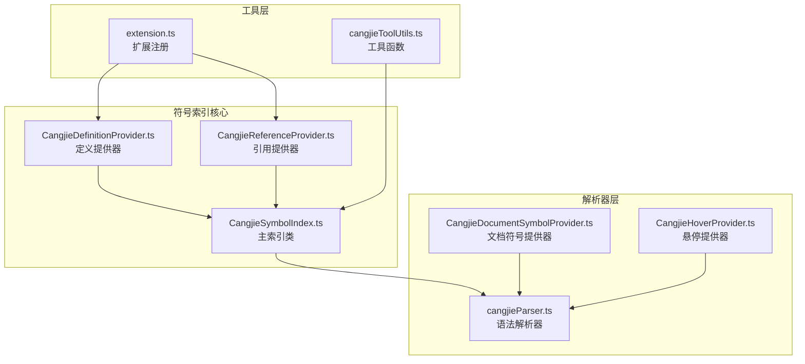
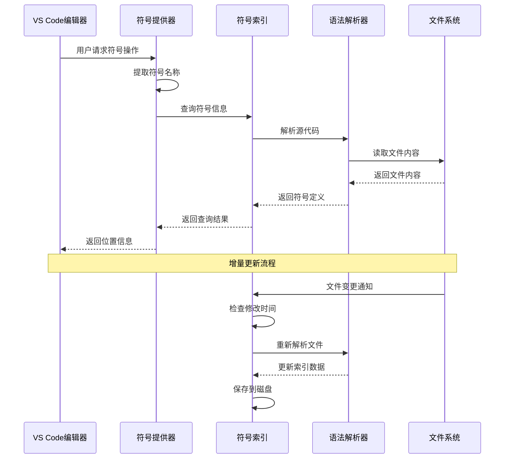
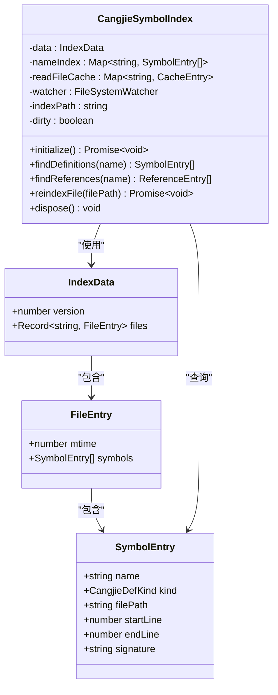
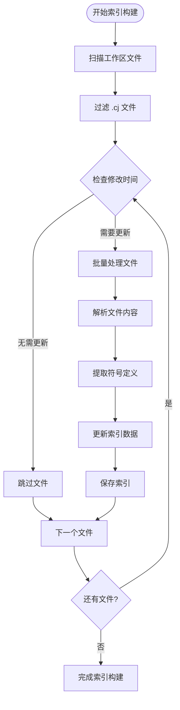
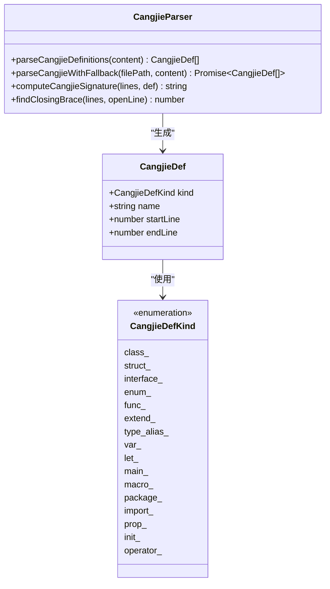
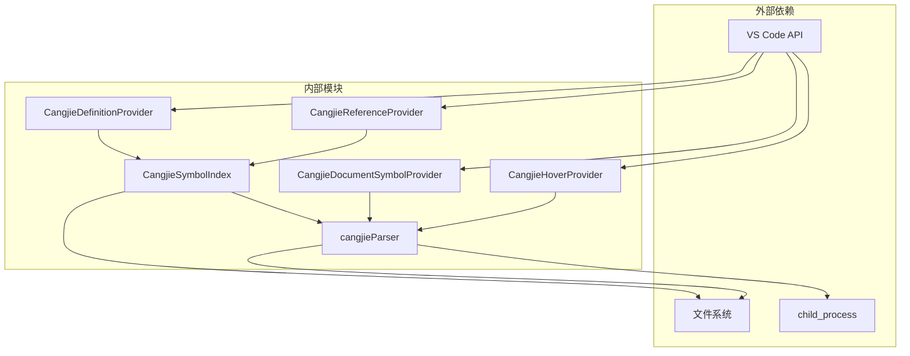

# 符号索引系统

<cite>
**本文档引用的文件**
- [CangjieSymbolIndex.ts](file://src/services/cangjie-lsp/CangjieSymbolIndex.ts)
- [CangjieDefinitionProvider.ts](file://src/services/cangjie-lsp/CangjieDefinitionProvider.ts)
- [CangjieReferenceProvider.ts](file://src/services/cangjie-lsp/CangjieReferenceProvider.ts)
- [cangjieParser.ts](file://src/services/tree-sitter/cangjieParser.ts)
- [extension.ts](file://src/extension.ts)
- [CangjieDocumentSymbolProvider.ts](file://src/services/cangjie-lsp/CangjieDocumentSymbolProvider.ts)
- [CangjieHoverProvider.ts](file://src/services/cangjie-lsp/CangjieHoverProvider.ts)
- [cangjieToolUtils.ts](file://src/services/cangjie-lsp/cangjieToolUtils.ts)
</cite>

## 目录
1. [简介](#简介)
2. [项目结构](#项目结构)
3. [核心组件](#核心组件)
4. [架构概览](#架构概览)
5. [详细组件分析](#详细组件分析)
6. [依赖关系分析](#依赖关系分析)
7. [性能考虑](#性能考虑)
8. [故障排除指南](#故障排除指南)
9. [结论](#结论)

## 简介

Cangjie 符号索引系统是 Njust-AI 项目中的一个关键组件，负责为 Cangjie 语言文件建立和维护符号索引，提供定义查找、引用定位、跨文件导航等功能。该系统通过智能的增量更新机制和高效的查询优化策略，为开发者提供了快速准确的代码导航体验。

系统采用双层解析策略：优先使用 cjc AST 解析器获取精确的语法信息，作为后备时使用正则表达式解析器进行快速解析。这种设计在保证准确性的同时兼顾了性能需求。

## 项目结构

符号索引系统主要分布在以下目录中：

**图表来源**
- [CangjieSymbolIndex.ts:1-470](file://src/services/cangjie-lsp/CangjieSymbolIndex.ts#L1-L470)
- [cangjieParser.ts:1-538](file://src/services/tree-sitter/cangjieParser.ts#L1-L538)

**章节来源**
- [CangjieSymbolIndex.ts:1-470](file://src/services/cangjie-lsp/CangjieSymbolIndex.ts#L1-L470)
- [cangjieParser.ts:1-538](file://src/services/tree-sitter/cangjieParser.ts#L1-L538)

## 核心组件

### 符号索引主类 (CangjieSymbolIndex)

CangjieSymbolIndex 是整个符号索引系统的核心，负责索引的创建、维护和查询。它采用了多种优化策略来确保高性能和高可靠性。

**主要特性：**
- **双解析策略**：支持 cjc AST 解析和正则表达式解析两种模式
- **增量更新**：基于文件修改时间的智能增量索引更新
- **内存缓存**：多级缓存机制优化查询性能
- **持久化存储**：自动保存索引到本地磁盘

**数据结构设计：**
- `data`: 主索引数据结构，包含版本信息和文件条目
- `nameIndex`: 基于符号名称的倒排索引
- `readFileCache`: 文件内容缓存，避免重复读取

**章节来源**
- [CangjieSymbolIndex.ts:43-470](file://src/services/cangjie-lsp/CangjieSymbolIndex.ts#L43-L470)

### 定义提供器 (CangjieDefinitionProvider)

定义提供器实现了 VS Code 的 DefinitionProvider 接口，为符号跳转功能提供支持。

**核心功能：**
- 提取用户当前位置的符号名称
- 查询符号索引获取定义位置
- 返回 VS Code 可识别的位置信息

**章节来源**
- [CangjieDefinitionProvider.ts:1-31](file://src/services/cangjie-lsp/CangjieDefinitionProvider.ts#L1-L31)

### 引用提供器 (CangjieReferenceProvider)

引用提供器实现了 VS Code 的 ReferenceProvider 接口，用于查找符号的所有引用位置。

**核心功能：**
- 支持声明和引用的过滤
- 跨文件引用扫描
- 高效的文本匹配算法

**章节来源**
- [CangjieReferenceProvider.ts:1-40](file://src/services/cangjie-lsp/CangjieReferenceProvider.ts#L1-L40)

## 架构概览

**图表来源**
- [CangjieSymbolIndex.ts:65-83](file://src/services/cangjie-lsp/CangjieSymbolIndex.ts#L65-L83)
- [CangjieDefinitionProvider.ts:12-30](file://src/services/cangjie-lsp/CangjieDefinitionProvider.ts#L12-L30)
- [CangjieReferenceProvider.ts:12-39](file://src/services/cangjie-lsp/CangjieReferenceProvider.ts#L12-L39)

## 详细组件分析

### 符号索引数据结构

**图表来源**
- [CangjieSymbolIndex.ts:18-41](file://src/services/cangjie-lsp/CangjieSymbolIndex.ts#L18-L41)
- [CangjieSymbolIndex.ts:43-55](file://src/services/cangjie-lsp/CangjieSymbolIndex.ts#L43-L55)

#### 索引构建算法

索引构建过程采用分批处理和增量更新相结合的策略：

**图表来源**
- [CangjieSymbolIndex.ts:153-194](file://src/services/cangjie-lsp/CangjieSymbolIndex.ts#L153-L194)
- [CangjieSymbolIndex.ts:200-231](file://src/services/cangjie-lsp/CangjieSymbolIndex.ts#L200-L231)

**章节来源**
- [CangjieSymbolIndex.ts:153-231](file://src/services/cangjie-lsp/CangjieSymbolIndex.ts#L153-L231)

### 查询优化策略

系统实现了多种查询优化技术：

#### 1. 名称索引优化
- 使用哈希表实现 O(1) 的符号查找
- 支持按符号类型过滤查询
- 实现前缀匹配查询功能

#### 2. 缓存机制
- **文件内容缓存**：避免重复读取相同文件
- **修改时间戳验证**：确保缓存数据的有效性
- **定时保存机制**：防止数据丢失

#### 3. 正则表达式优化
- 预编译正则表达式对象
- 使用全局匹配避免重复创建
- 批量处理减少正则引擎开销

**章节来源**
- [CangjieSymbolIndex.ts:103-130](file://src/services/cangjie-lsp/CangjieSymbolIndex.ts#L103-L130)
- [CangjieSymbolIndex.ts:269-290](file://src/services/cangjie-lsp/CangjieSymbolIndex.ts#L269-L290)

### 解析器实现

#### 语法解析器 (cangjieParser)

**图表来源**
- [cangjieParser.ts:41-64](file://src/services/tree-sitter/cangjieParser.ts#L41-L64)
- [cangjieParser.ts:145-195](file://src/services/tree-sitter/cangjieParser.ts#L145-L195)

#### 双解析策略

系统实现了灵活的解析策略切换机制：

**cjc AST 解析（优先）：**
- 提供最准确的语法信息
- 支持复杂的语法结构识别
- 需要外部 cjc 工具支持

**正则表达式解析（后备）：**
- 不依赖外部工具
- 解析速度快
- 覆盖基本语法结构

**章节来源**
- [cangjieParser.ts:530-537](file://src/services/tree-sitter/cangjieParser.ts#L530-L537)
- [CangjieSymbolIndex.ts:207-209](file://src/services/cangjie-lsp/CangjieSymbolIndex.ts#L207-L209)

### 跨文件导航功能

系统提供了完整的跨文件导航能力：

#### 依赖关系分析
- **导入路径解析**：从文件内容中提取 import 语句
- **包映射**：将包名映射到实际文件路径
- **依赖图构建**：建立文件间的依赖关系

#### 反向依赖查询
- **符号级依赖**：基于符号名称查找依赖文件
- **API 表面分析**：识别公共符号的使用者
- **影响范围评估**：帮助开发者理解修改的影响

**章节来源**
- [CangjieSymbolIndex.ts:367-443](file://src/services/cangjie-lsp/CangjieSymbolIndex.ts#L367-L443)

## 依赖关系分析

**图表来源**
- [extension.ts:377-413](file://src/extension.ts#L377-L413)
- [CangjieSymbolIndex.ts:1-12](file://src/services/cangjie-lsp/CangjieSymbolIndex.ts#L1-L12)

**章节来源**
- [extension.ts:377-413](file://src/extension.ts#L377-L413)

## 性能考虑

### 内存管理优化

系统采用了多层次的内存管理策略：

#### 1. 缓存策略
- **LRU 缓存**：使用 Map 结构实现简单的 LRU 效果
- **条件缓存**：只缓存最近使用的文件内容
- **内存监控**：定期清理无用缓存

#### 2. 并发处理
- **批量处理**：使用 Promise.all 进行并行文件处理
- **节流控制**：避免频繁的磁盘写入操作
- **异步更新**：非阻塞的索引更新机制

#### 3. 查询优化
- **早期退出**：在不可能找到结果时提前返回
- **索引预处理**：建立多重索引提高查询效率
- **结果限制**：对大量结果进行合理限制

### 性能基准测试

系统的关键性能指标：
- **索引构建时间**：通常在几秒到几十秒之间
- **符号查询延迟**：毫秒级响应时间
- **内存占用**：与符号数量成线性关系
- **磁盘 I/O**：最小化不必要的文件读取

## 故障排除指南

### 常见问题及解决方案

#### 1. 索引不更新问题
**症状**：新添加的符号无法被搜索到
**原因**：文件监视器未正确工作或缓存失效
**解决方法**：
- 检查文件监视器是否正常启动
- 手动触发索引重建
- 清理损坏的索引文件

#### 2. 查询结果不准确
**症状**：符号查询返回错误的结果
**原因**：解析器误判或缓存污染
**解决方法**：
- 刷新解析缓存
- 检查源代码语法
- 启用更严格的解析模式

#### 3. 性能问题
**症状**：索引构建或查询响应缓慢
**原因**：大型项目或低性能磁盘
**解决方法**：
- 增加文件过滤规则
- 调整批处理大小
- 使用 SSD 存储

**章节来源**
- [CangjieSymbolIndex.ts:85-101](file://src/services/cangjie-lsp/CangjieSymbolIndex.ts#L85-L101)
- [CangjieSymbolIndex.ts:132-151](file://src/services/cangjie-lsp/CangjieSymbolIndex.ts#L132-L151)

## 结论

Cangjie 符号索引系统通过精心设计的数据结构、智能的增量更新机制和高效的查询优化策略，为 Cangjie 语言提供了强大的代码导航能力。系统的双解析策略平衡了准确性与性能，而完善的缓存机制确保了良好的用户体验。

未来可以考虑的改进方向：
- 实现更智能的增量更新算法
- 添加符号类型推断功能
- 优化大规模项目的索引性能
- 增强跨语言符号引用支持

该系统为 Njust-AI 项目提供了坚实的代码基础，是现代 IDE 功能的重要组成部分。