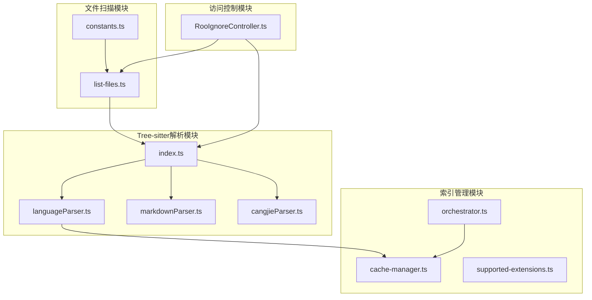
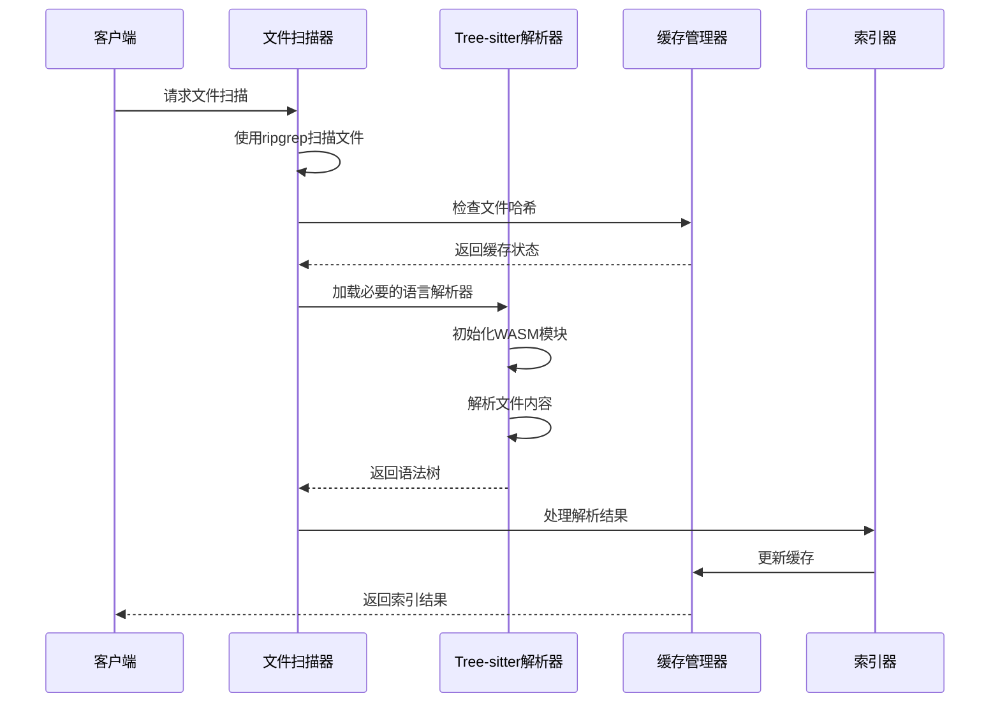
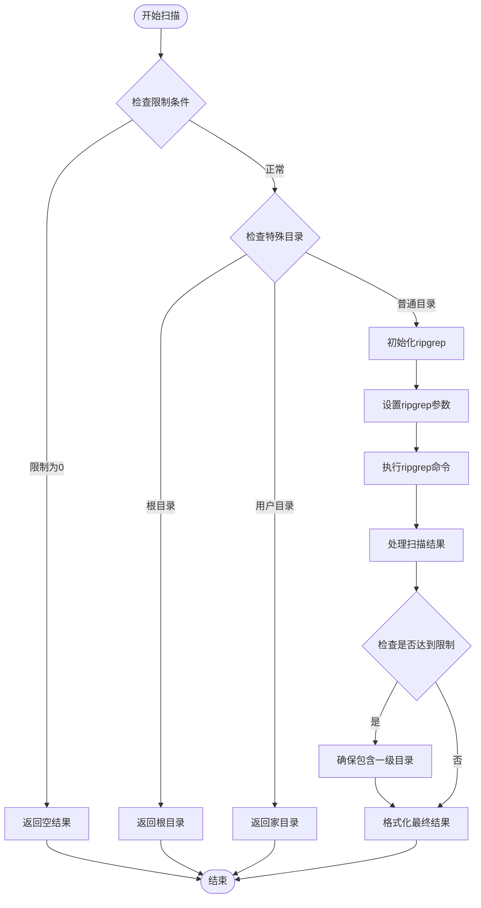
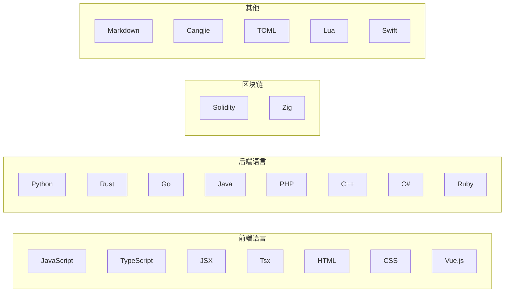
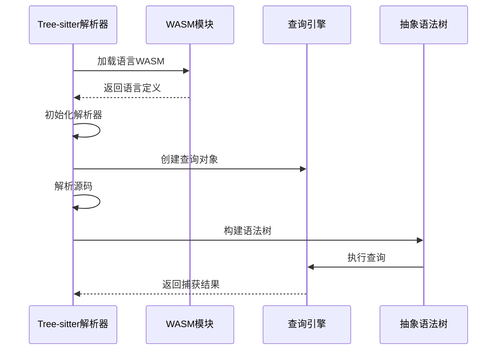
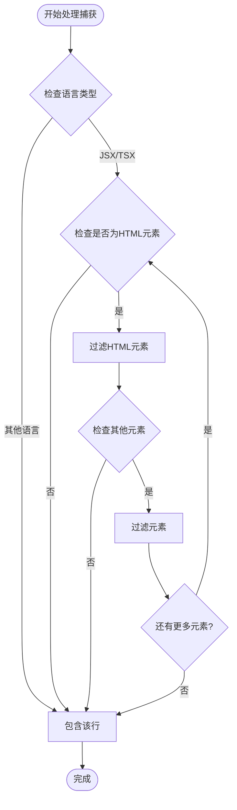
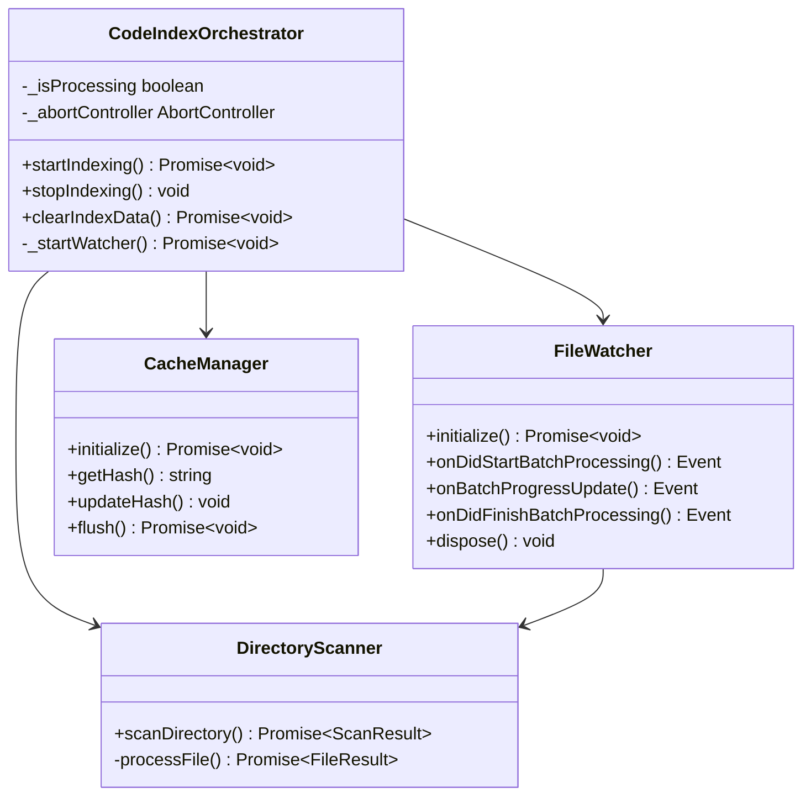
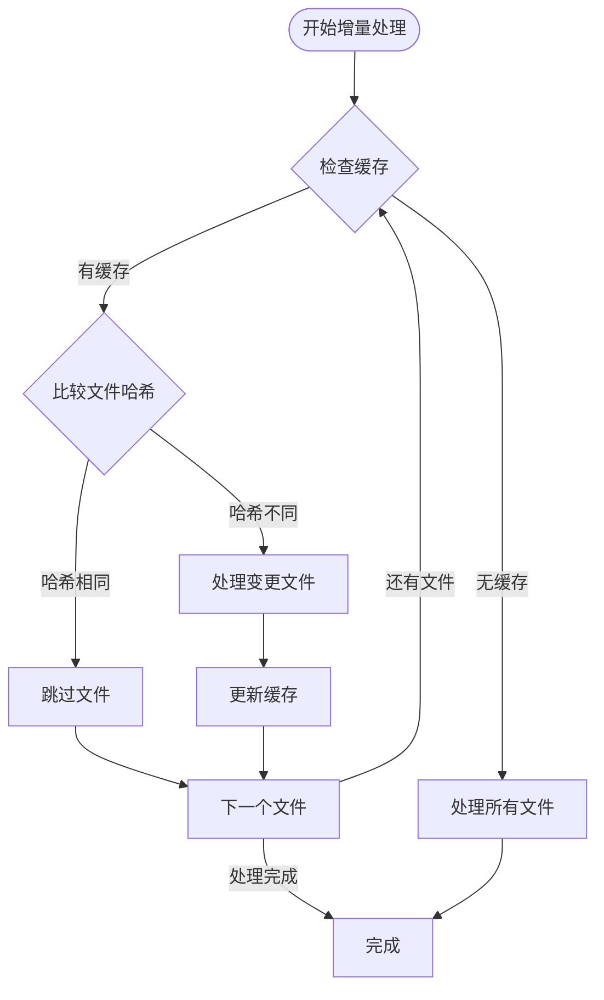
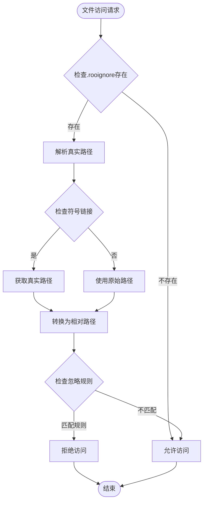
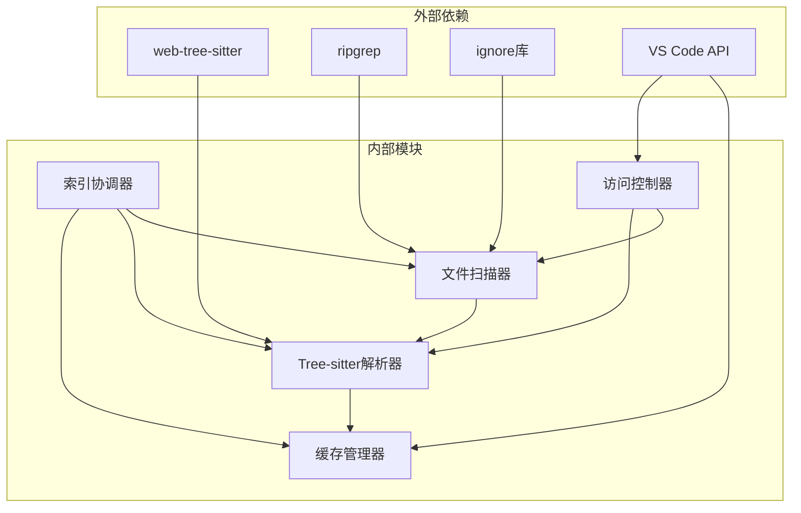

# 文件处理与解析

<cite>
**本文档引用的文件**
- [src/services/treessitter/index.ts](file://src/services/tree-sitter/index.ts)
- [src/services/treessitter/languageParser.ts](file://src/services/tree-sitter/languageParser.ts)
- [src/services/treessitter/markdownParser.ts](file://src/services/tree-sitter/markdownParser.ts)
- [src/services/treessitter/cangjieParser.ts](file://src/services/tree-sitter/cangjieParser.ts)
- [src/services/glob/list-files.ts](file://src/services/glob/list-files.ts)
- [src/services/glob/constants.ts](file://src/services/glob/constants.ts)
- [src/core/ignore/RooIgnoreController.ts](file://src/core/ignore/RooIgnoreController.ts)
- [src/services/code-index/cache-manager.ts](file://src/services/code-index/cache-manager.ts)
- [src/services/code-index/orchestrator.ts](file://src/services/code-index/orchestrator.ts)
- [src/services/code-index/shared/supported-extensions.ts](file://src/services/code-index/shared/supported-extensions.ts)
</cite>

## 目录
1. [简介](#简介)
2. [项目结构](#项目结构)
3. [核心组件](#核心组件)
4. [架构概览](#架构概览)
5. [详细组件分析](#详细组件分析)
6. [依赖关系分析](#依赖关系分析)
7. [性能考虑](#性能考虑)
8. [故障排除指南](#故障排除指南)
9. [结论](#结论)

## 简介

文件处理与解析系统是Njust-AI项目中的核心基础设施，负责高效地扫描、过滤和解析各种编程语言和文档格式的文件。该系统采用多层架构设计，结合了Tree-sitter语法解析引擎、智能文件过滤机制和增量索引策略，为AI代理提供了准确的代码理解和上下文感知能力。

系统的主要功能包括：
- **多语言文件扫描**：支持超过30种编程语言和文档格式
- **智能文件过滤**：基于.gitignore和自定义规则的精确过滤
- **Tree-sitter语法解析**：高性能的语法树构建和符号提取
- **增量索引**：基于文件哈希的缓存机制和增量更新
- **安全访问控制**：基于.rooignore的文件访问权限管理

## 项目结构

文件处理与解析系统主要分布在以下核心模块中：

**图表来源**
- [src/services/glob/list-files.ts:1-728](file://src/services/glob/list-files.ts#L1-L728)
- [src/services/tree-sitter/index.ts:1-352](file://src/services/tree-sitter/index.ts#L1-L352)
- [src/core/ignore/RooIgnoreController.ts:1-222](file://src/core/ignore/RooIgnoreController.ts#L1-L222)

**章节来源**
- [src/services/glob/list-files.ts:1-728](file://src/services/glob/list-files.ts#L1-L728)
- [src/services/tree-sitter/index.ts:1-352](file://src/services/tree-sitter/index.ts#L1-L352)
- [src/core/ignore/RooIgnoreController.ts:1-222](file://src/core/ignore/RooIgnoreController.ts#L1-L222)

## 核心组件

### 文件扫描器 (File Scanner)

文件扫描器使用ripgrep作为底层工具，提供高效的文件发现和过滤能力：

- **递归扫描**：支持深度递归遍历目录结构
- **智能过滤**：自动忽略大型目录（如node_modules、.git等）
- **限制机制**：可配置的最大文件数量限制
- **路径规范化**：统一处理相对路径和绝对路径

### Tree-sitter解析器 (Tree-sitter Parser)

支持30+种编程语言的语法解析，采用WebAssembly实现：

- **WASM加载**：动态加载语言特定的WASM模块
- **查询系统**：基于语言特定的查询模式提取符号
- **语法树构建**：构建精确的抽象语法树
- **批量处理**：一次加载多个语言解析器以提高效率

### 缓存管理系统 (Cache Manager)

实现智能的增量索引和缓存机制：

- **文件哈希**：基于内容生成唯一哈希值
- **去抖动保存**：防止频繁的磁盘写入操作
- **持久化存储**：使用VS Code扩展API进行安全存储
- **增量更新**：只重新索引变更的文件

**章节来源**
- [src/services/code-index/cache-manager.ts:1-110](file://src/services/code-index/cache-manager.ts#L1-L110)
- [src/services/tree-sitter/languageParser.ts:78-232](file://src/services/tree-sitter/languageParser.ts#L78-L232)

## 架构概览

系统采用分层架构设计，确保各组件职责清晰且松耦合：

**图表来源**
- [src/services/glob/list-files.ts:33-76](file://src/services/glob/list-files.ts#L33-L76)
- [src/services/tree-sitter/index.ts:100-169](file://src/services/tree-sitter/index.ts#L100-L169)
- [src/services/code-index/cache-manager.ts:73-85](file://src/services/code-index/cache-manager.ts#L73-L85)

## 详细组件分析

### 文件扫描机制

文件扫描器实现了复杂的目录遍历和过滤逻辑：

#### 核心扫描流程

**图表来源**
- [src/services/glob/list-files.ts:33-76](file://src/services/glob/list-files.ts#L33-L76)
- [src/services/glob/list-files.ts:163-181](file://src/services/glob/list-files.ts#L163-L181)

#### 过滤规则配置

系统内置了全面的目录过滤规则：

| 目录类型 | 默认忽略 | 特殊处理 |
|---------|----------|----------|
| 依赖管理 | node_modules, vendor | 递归扫描时可配置 |
| 构建输出 | dist, build, out | 仅在目标目录时显示 |
| 版本控制 | .git | 始终忽略 |
| 虚拟环境 | env, venv, __pycache__ | 隐藏目录优先级 |
| 临时文件 | tmp, temp, *.tmp | 可配置忽略 |

**章节来源**
- [src/services/glob/constants.ts:7-25](file://src/services/glob/constants.ts#L7-L25)
- [src/services/glob/list-files.ts:233-293](file://src/services/glob/list-files.ts#L233-L293)

### Tree-sitter语法解析

系统支持30+种编程语言的语法解析，每种语言都有专门的查询模式：

#### 支持的语言类型

**图表来源**
- [src/services/tree-sitter/index.ts:30-96](file://src/services/tree-sitter/index.ts#L30-L96)

#### 语法树构建过程

**图表来源**
- [src/services/tree-sitter/languageParser.ts:78-91](file://src/services/tree-sitter/languageParser.ts#L78-L91)
- [src/services/tree-sitter/languageParser.ts:225-227](file://src/services/tree-sitter/languageParser.ts#L225-L227)

**章节来源**
- [src/services/tree-sitter/index.ts:171-186](file://src/services/tree-sitter/index.ts#L171-L186)
- [src/services/tree-sitter/languageParser.ts:99-231](file://src/services/tree-sitter/languageParser.ts#L99-L231)

### 代码片段提取

系统实现了智能的代码片段提取算法，专注于提取有意义的代码结构：

#### 提取策略

| 提取类型 | 触发条件 | 输出格式 |
|---------|----------|----------|
| 函数定义 | 匹配函数声明模式 | 行号范围 | 名称 |
| 类定义 | 匹配类/结构体模式 | 行号范围 | 名称 |
| 接口定义 | 匹配接口模式 | 行号范围 | 名称 |
| 变量声明 | 匹配变量/常量模式 | 行号范围 | 名称 |
| 注释块 | 匹配注释模式 | 行号范围 | 内容摘要 |

#### HTML过滤机制

对于React/JSX组件，系统实现了智能的HTML元素过滤：

**图表来源**
- [src/services/tree-sitter/index.ts:204-304](file://src/services/tree-sitter/index.ts#L204-L304)

**章节来源**
- [src/services/tree-sitter/index.ts:196-304](file://src/services/tree-sitter/index.ts#L196-L304)

### 文件监控机制

系统实现了高效的文件监控和增量处理机制：

#### 监控架构

**图表来源**
- [src/services/code-index/orchestrator.ts:14-27](file://src/services/code-index/orchestrator.ts#L14-L27)
- [src/services/code-index/orchestrator.ts:39-83](file://src/services/code-index/orchestrator.ts#L39-L83)

#### 增量处理策略

**图表来源**
- [src/services/code-index/cache-manager.ts:73-94](file://src/services/code-index/cache-manager.ts#L73-L94)

**章节来源**
- [src/services/code-index/orchestrator.ts:32-83](file://src/services/code-index/orchestrator.ts#L32-L83)
- [src/services/code-index/cache-manager.ts:20-110](file://src/services/code-index/cache-manager.ts#L20-L110)

### 访问控制机制

系统实现了基于.rooignore的文件访问权限管理：

#### 权限验证流程

**图表来源**
- [src/core/ignore/RooIgnoreController.ts:89-116](file://src/core/ignore/RooIgnoreController.ts#L89-L116)

#### 忽略规则配置

系统支持标准的.gitignore语法：

| 规则类型 | 示例 | 说明 |
|---------|------|------|
| 目录忽略 | `node_modules/` | 忽略整个目录 |
| 文件类型 | `*.log` | 忽略特定扩展名 |
| 绝对路径 | `/config.json` | 忽略工作区根目录下的文件 |
| 排除规则 | `!important.txt` | 允许被忽略的文件例外 |
| 通配符 | `build/*/temp` | 匹配多级目录 |

**章节来源**
- [src/core/ignore/RooIgnoreController.ts:64-81](file://src/core/ignore/RooIgnoreController.ts#L64-L81)
- [src/core/ignore/RooIgnoreController.ts:118-192](file://src/core/ignore/RooIgnoreController.ts#L118-L192)

## 依赖关系分析

系统采用模块化设计，各组件之间的依赖关系清晰明确：

**图表来源**
- [src/services/glob/list-files.ts:1-10](file://src/services/glob/list-files.ts#L1-L10)
- [src/services/tree-sitter/languageParser.ts:1-31](file://src/services/tree-sitter/languageParser.ts#L1-L31)

**章节来源**
- [src/services/glob/list-files.ts:1-10](file://src/services/glob/list-files.ts#L1-L10)
- [src/services/tree-sitter/languageParser.ts:1-31](file://src/services/tree-sitter/languageParser.ts#L1-L31)

## 性能考虑

系统在设计时充分考虑了性能优化：

### 内存优化策略

1. **WASM模块复用**：一次性加载所有需要的语言解析器
2. **去重处理**：避免重复解析相同的文件
3. **流式处理**：使用ripgrep进行流式文件扫描
4. **缓存策略**：基于文件哈希的智能缓存

### 并发处理

- **批量处理**：文件监控器支持批处理模式
- **异步操作**：所有I/O操作都是异步的
- **去抖动机制**：防止频繁的文件系统事件触发

### 配置优化

| 配置项 | 默认值 | 优化建议 |
|--------|--------|----------|
| 扫描限制 | 10000个文件 | 根据项目规模调整 |
| 缓存刷新间隔 | 1500ms | 根据磁盘性能调整 |
| riPgrep超时 | 10秒 | 根据网络情况调整 |
| 最小组件行数 | 4行 | 根据需求调整 |

## 故障排除指南

### 常见问题及解决方案

#### Tree-sitter解析失败

**症状**：某些文件无法正确解析
**原因**：
- WASM模块加载失败
- 语法查询不匹配
- 文件编码问题

**解决方案**：
1. 检查WASM文件是否存在
2. 验证文件扩展名映射
3. 确认文件编码格式

#### 文件扫描性能问题

**症状**：扫描速度慢或内存占用高
**原因**：
- 忽略规则过多
- 大型二进制文件
- 网络驱动器

**解决方案**：
1. 优化.gitignore规则
2. 添加不必要的目录到忽略列表
3. 考虑使用本地磁盘

#### 缓存不一致问题

**症状**：索引结果与实际文件不匹配
**原因**：
- 缓存文件损坏
- 文件哈希计算错误
- 并发访问冲突

**解决方案**：
1. 清理缓存文件
2. 重启索引服务
3. 检查文件权限

**章节来源**
- [src/services/tree-sitter/index.ts:346-350](file://src/services/tree-sitter/index.ts#L346-L350)
- [src/services/code-index/cache-manager.ts:48-54](file://src/services/code-index/cache-manager.ts#L48-L54)

## 结论

文件处理与解析系统通过精心设计的架构和优化策略，为Njust-AI项目提供了强大而高效的文件处理能力。系统的主要优势包括：

1. **多语言支持**：全面支持现代编程语言和文档格式
2. **高性能解析**：基于WebAssembly的Tree-sitter解析器
3. **智能过滤**：精确的文件扫描和过滤机制
4. **增量索引**：高效的缓存和增量更新策略
5. **安全控制**：完善的文件访问权限管理

该系统为AI代理提供了准确的代码理解和上下文感知能力，是整个Njust-AI生态系统的重要基础设施。通过持续的优化和扩展，系统将继续为用户提供更好的开发体验。