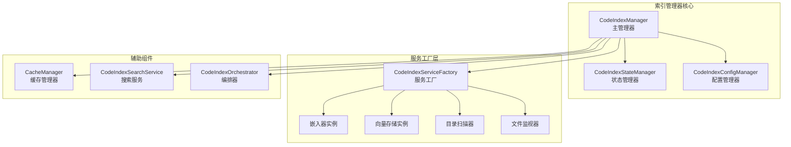
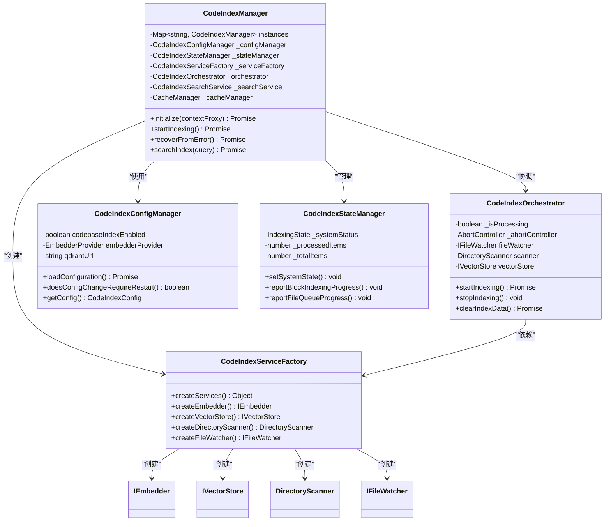
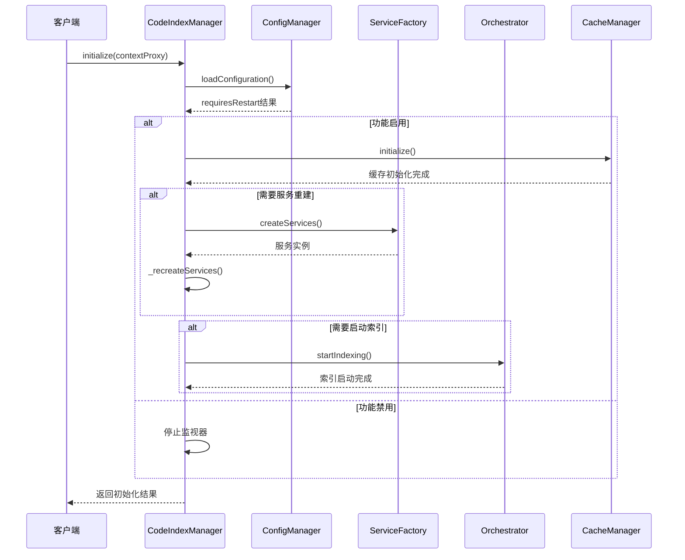
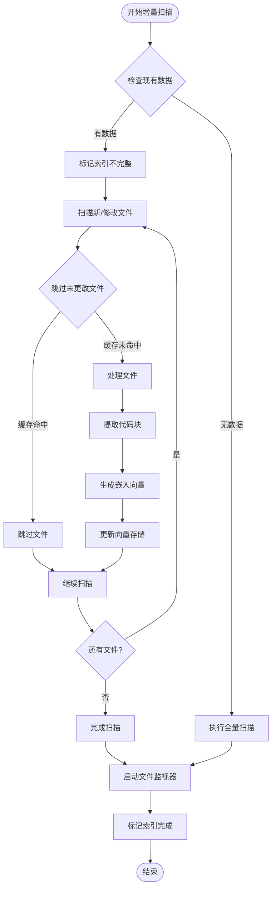
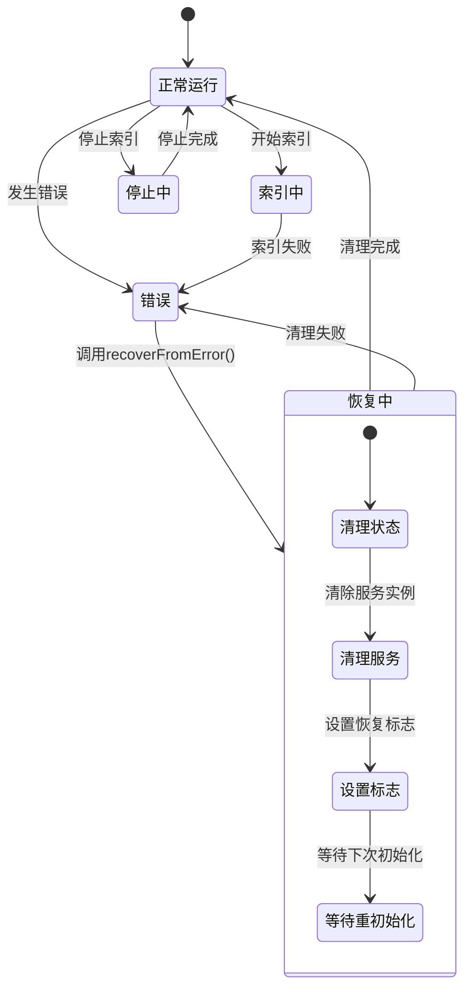
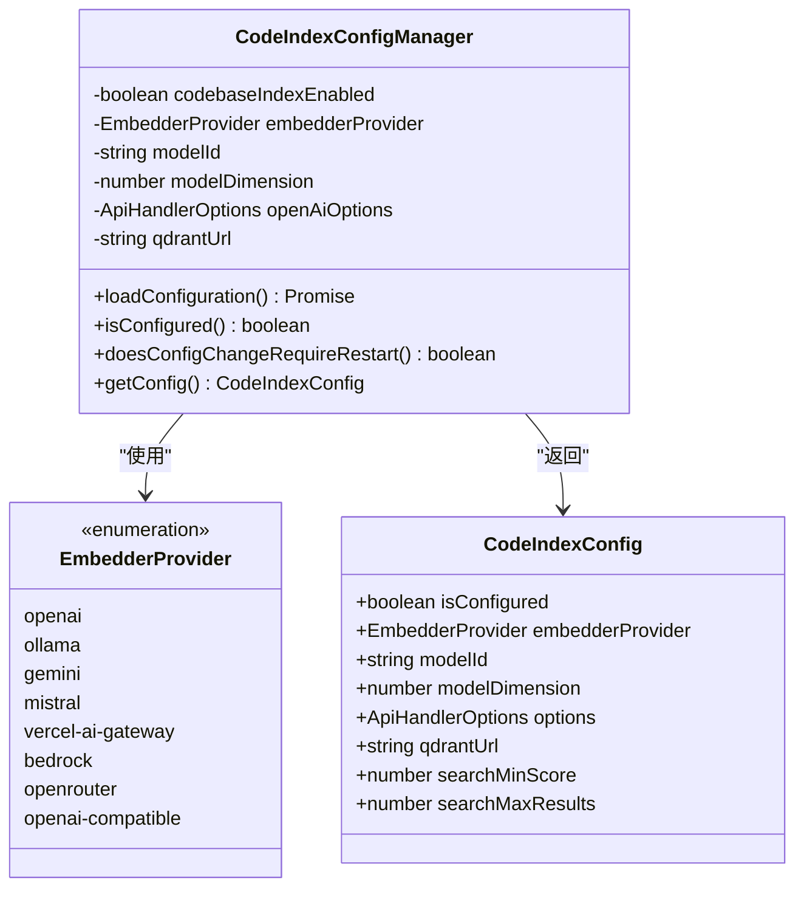
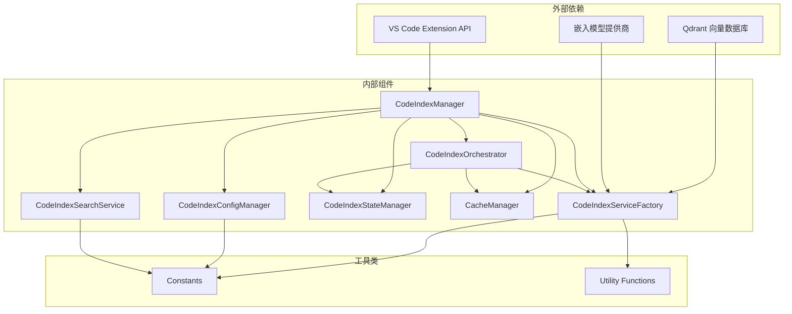

# 索引管理器

<cite>
**本文档引用的文件**
- [manager.ts](file://src/services/code-index/manager.ts)
- [orchestrator.ts](file://src/services/code-index/orchestrator.ts)
- [state-manager.ts](file://src/services/code-index/state-manager.ts)
- [config-manager.ts](file://src/services/code-index/config-manager.ts)
- [cache-manager.ts](file://src/services/code-index/cache-manager.ts)
- [search-service.ts](file://src/services/code-index/search-service.ts)
- [service-factory.ts](file://src/services/code-index/service-factory.ts)
- [qdrant-client.ts](file://src/services/code-index/vector-store/qdrant-client.ts)
- [index.ts](file://src/services/code-index/constants/index.ts)
</cite>

## 目录
1. [简介](#简介)
2. [项目结构](#项目结构)
3. [核心组件](#核心组件)
4. [架构概览](#架构概览)
5. [详细组件分析](#详细组件分析)
6. [依赖关系分析](#依赖关系分析)
7. [性能考虑](#性能考虑)
8. [故障排除指南](#故障排除指南)
9. [结论](#结论)

## 简介

代码索引管理器是Njust-AI项目中的核心组件，负责管理代码库的向量化索引过程。该系统实现了完整的索引生命周期管理，包括索引状态管理、索引编排器、增量更新机制等功能。系统支持多种嵌入模型提供商（OpenAI、Ollama、Gemini等），与Qdrant向量数据库集成，并提供了完整的错误恢复和并发控制机制。

## 项目结构

代码索引管理器位于`src/services/code-index/`目录下，采用模块化设计，包含以下主要组件：

**图表来源**
- [manager.ts:18-92](file://src/services/code-index/manager.ts#L18-L92)
- [service-factory.ts:31-36](file://src/services/code-index/service-factory.ts#L31-L36)

**章节来源**
- [manager.ts:18-92](file://src/services/code-index/manager.ts#L18-L92)
- [service-factory.ts:31-36](file://src/services/code-index/service-factory.ts#L31-L36)

## 核心组件

### CodeIndexManager 主管理器

主管理器采用单例模式设计，负责协调所有索引相关组件。其核心功能包括：

- **单例实例管理**：基于工作区路径维护多个实例
- **初始化流程控制**：管理配置加载、服务重建和索引启动
- **错误恢复机制**：提供完整的错误状态清理和重初始化能力
- **生命周期管理**：处理索引启动、停止、清理等操作

### CodeIndexOrchestrator 编排器

编排器负责协调整个索引流程，包括：

- **增量与全量索引**：根据现有数据决定索引策略
- **文件监视**：实时监控文件变化并进行增量更新
- **批处理管理**：管理嵌入生成和向量存储的批处理操作
- **状态同步**：确保各组件状态的一致性

### CodeIndexStateManager 状态管理器

提供统一的状态管理和事件通知机制：

- **多维度状态跟踪**：系统状态、进度信息、消息内容
- **事件驱动架构**：通过事件发射器通知状态变化
- **进度报告**：支持块级和文件级两种进度报告模式

**章节来源**
- [manager.ts:18-92](file://src/services/code-index/manager.ts#L18-L92)
- [orchestrator.ts:14-27](file://src/services/code-index/orchestrator.ts#L14-L27)
- [state-manager.ts:5-119](file://src/services/code-index/state-manager.ts#L5-L119)

## 架构概览

代码索引管理器采用分层架构设计，实现了高度的模块化和可扩展性：

**图表来源**
- [manager.ts:18-92](file://src/services/code-index/manager.ts#L18-L92)
- [orchestrator.ts:19-27](file://src/services/code-index/orchestrator.ts#L19-L27)
- [config-manager.ts:12-33](file://src/services/code-index/config-manager.ts#L12-L33)
- [service-factory.ts:31-36](file://src/services/code-index/service-factory.ts#L31-L36)

## 详细组件分析

### 初始化流程分析

索引管理器的初始化过程是一个复杂的多阶段流程，确保系统的正确配置和启动：

**图表来源**
- [manager.ts:162-214](file://src/services/code-index/manager.ts#L162-L214)
- [manager.ts:348-424](file://src/services/code-index/manager.ts#L348-L424)

### 增量更新机制

系统实现了智能的增量更新机制，能够在保持性能的同时确保索引的准确性：

**图表来源**
- [orchestrator.ts:141-200](file://src/services/code-index/orchestrator.ts#L141-L200)
- [orchestrator.ts:167-190](file://src/services/code-index/orchestrator.ts#L167-L190)

### 错误恢复机制

系统提供了完善的错误恢复机制，确保在各种异常情况下能够安全恢复：

**图表来源**
- [manager.ts:277-301](file://src/services/code-index/manager.ts#L277-L301)
- [orchestrator.ts:297-333](file://src/services/code-index/orchestrator.ts#L297-L333)

### 配置管理系统

配置管理器提供了灵活的配置加载和验证机制：

**图表来源**
- [config-manager.ts:12-151](file://src/services/code-index/config-manager.ts#L12-L151)
- [config-manager.ts:445-464](file://src/services/code-index/config-manager.ts#L445-L464)

**章节来源**
- [manager.ts:162-214](file://src/services/code-index/manager.ts#L162-L214)
- [orchestrator.ts:141-200](file://src/services/code-index/orchestrator.ts#L141-L200)
- [manager.ts:277-301](file://src/services/code-index/manager.ts#L277-L301)
- [config-manager.ts:12-151](file://src/services/code-index/config-manager.ts#L12-L151)

## 依赖关系分析

代码索引管理器的依赖关系体现了清晰的分层架构：

**图表来源**
- [manager.ts:1-16](file://src/services/code-index/manager.ts#L1-L16)
- [service-factory.ts:1-26](file://src/services/code-index/service-factory.ts#L1-L26)

**章节来源**
- [manager.ts:1-16](file://src/services/code-index/manager.ts#L1-L16)
- [service-factory.ts:1-26](file://src/services/code-index/service-factory.ts#L1-L26)

## 性能考虑

### 缓存策略

系统采用了多层次的缓存机制来优化性能：

- **文件哈希缓存**：使用SHA-256哈希值快速检测文件变更
- **批量处理**：通过配置的批处理大小平衡内存使用和网络效率
- **去抖动保存**：使用防抖机制减少磁盘写入频率

### 并发控制

系统实现了精细的并发控制机制：

- **批处理并发**：通过MAX_PENDING_BATCHES限制同时处理的批数量
- **解析并发**：PARSING_CONCURRENCY控制代码解析的并发度
- **中断机制**：AbortController提供优雅的索引停止能力

### 内存管理

- **渐进式索引**：避免一次性加载大量数据到内存
- **资源清理**：及时释放文件监视器和其他临时资源
- **错误隔离**：确保单个文件错误不影响整体索引进程

## 故障排除指南

### 常见问题诊断

**索引无法启动**
1. 检查配置是否正确设置
2. 验证嵌入模型提供商的API密钥
3. 确认Qdrant服务器连接正常
4. 查看状态管理器的错误消息

**索引卡住或停滞**
1. 检查是否有文件监视器订阅
2. 验证缓存文件是否损坏
3. 确认批处理大小设置合理
4. 查看是否有未处理的异常

**搜索结果不准确**
1. 调整最小分数阈值
2. 检查嵌入模型配置
3. 验证向量维度匹配
4. 考虑增加最大结果数量

### 错误恢复步骤

1. **调用恢复方法**：`await manager.recoverFromError()`
2. **重新初始化**：调用`await manager.initialize(contextProxy)`
3. **检查状态**：确认状态管理器显示正常状态
4. **重启索引**：如需要，调用`await manager.startIndexing()`

**章节来源**
- [manager.ts:277-301](file://src/services/code-index/manager.ts#L277-L301)
- [state-manager.ts:33-56](file://src/services/code-index/state-manager.ts#L33-L56)

## 结论

代码索引管理器是一个设计精良的系统，具有以下特点：

**架构优势**
- 清晰的分层设计和职责分离
- 完善的错误处理和恢复机制
- 灵活的配置管理和动态重配置能力

**功能特性**
- 支持多种嵌入模型提供商
- 智能的增量更新机制
- 高效的缓存和并发控制
- 全面的状态管理和事件通知

**扩展性**
- 插件化的服务工厂设计
- 可配置的批处理和并发参数
- 易于添加新的嵌入模型提供商

该系统为Njust-AI项目提供了强大的代码索引能力，支持高效的代码搜索和理解功能。通过合理的架构设计和完善的错误处理机制，确保了系统的稳定性和可靠性。