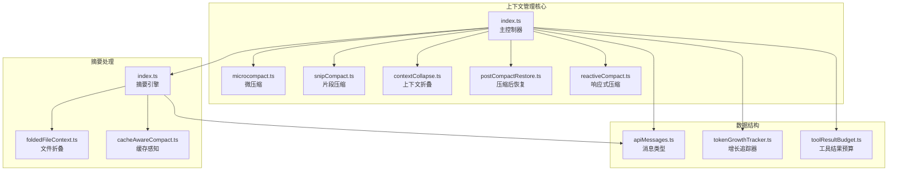
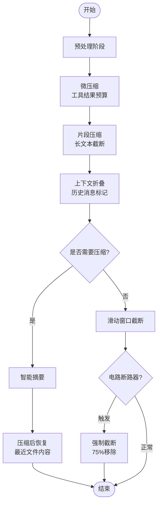
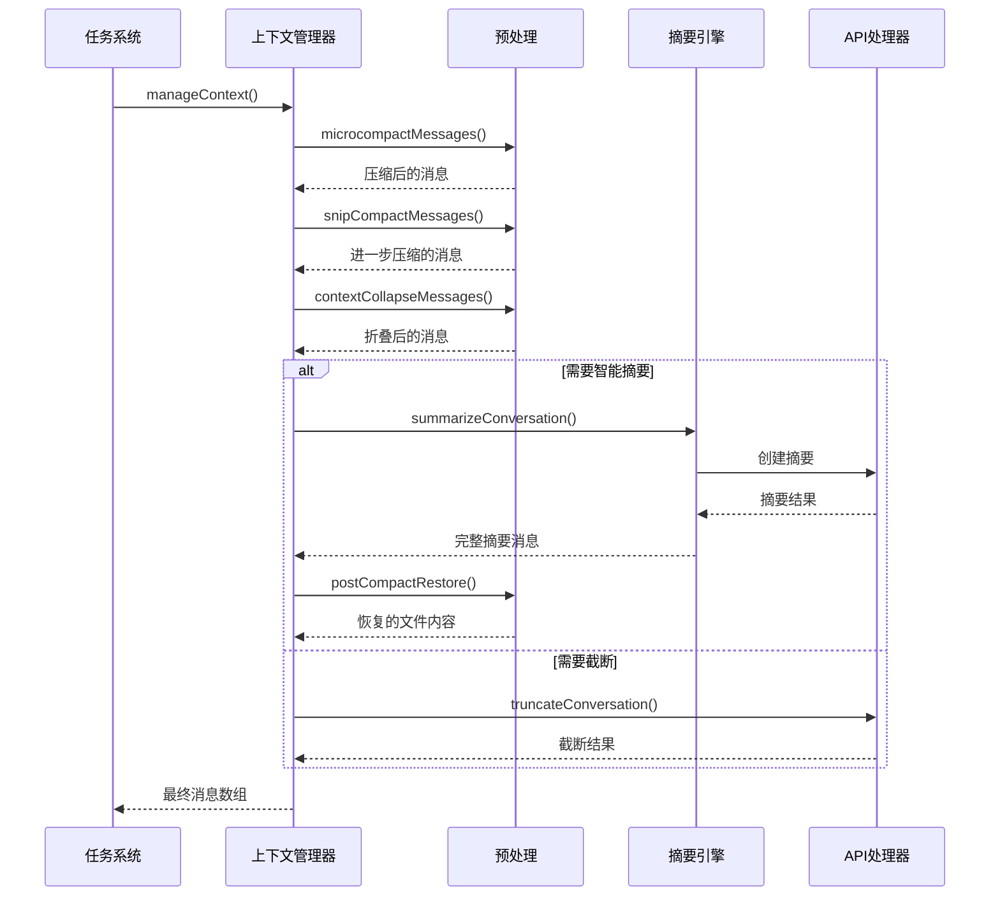
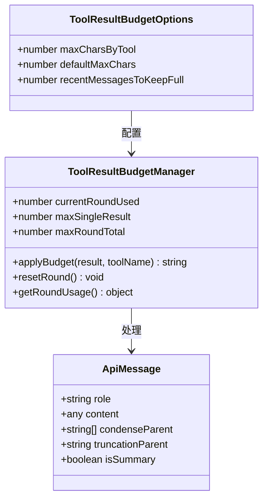
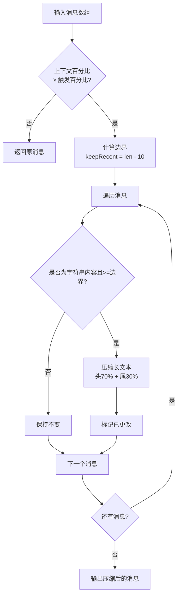
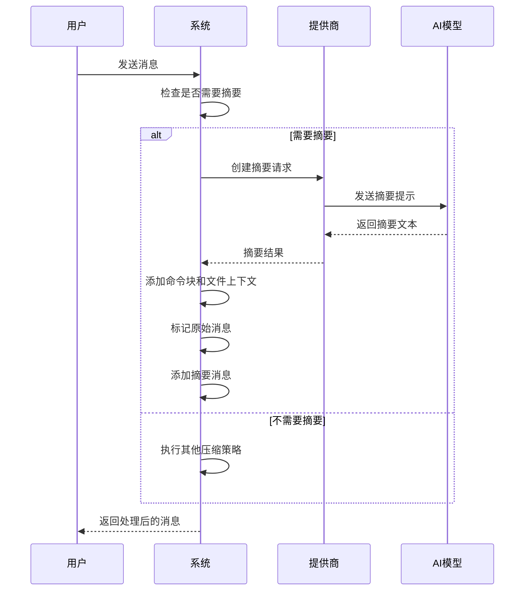
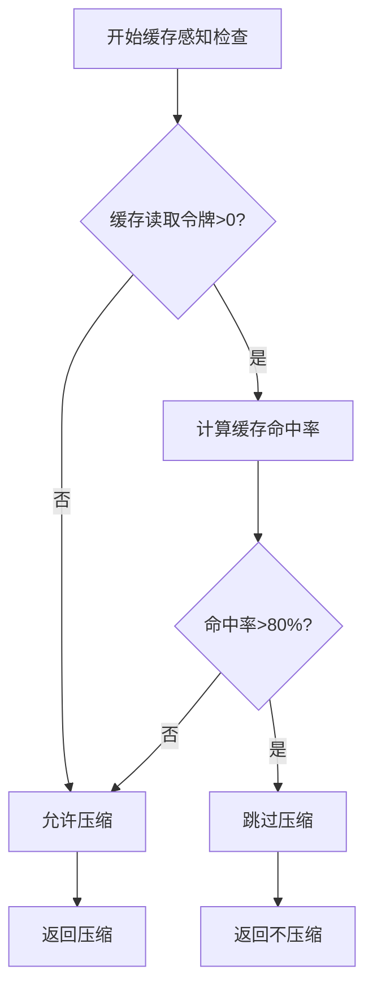
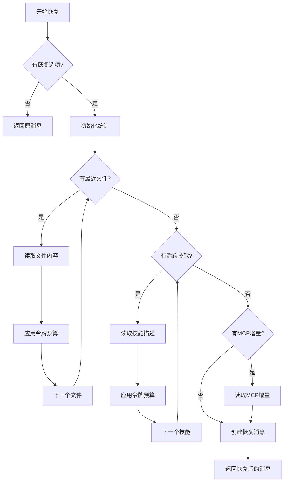
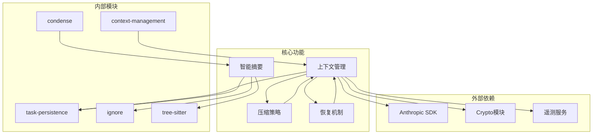

# 上下文压缩管道

<cite>
**本文档引用的文件**
- [src/core/context-management/index.ts](file://src/core/context-management/index.ts)
- [src/core/condense/index.ts](file://src/core/condense/index.ts)
- [src/core/context-management/contextCollapse.ts](file://src/core/context-management/contextCollapse.ts)
- [src/core/context-management/microcompact.ts](file://src/core/context-management/microcompact.ts)
- [src/core/context-management/reactiveCompact.ts](file://src/core/context-management/reactiveCompact.ts)
- [src/core/condense/foldedFileContext.ts](file://src/core/condense/foldedFileContext.ts)
- [src/core/context-management/snippetCompact.ts](file://src/core/context-management/snippetCompact.ts)
- [src/core/context-management/postCompactRestore.ts](file://src/core/context-management/postCompactRestore.ts)
- [src/core/condense/cacheAwareCompact.ts](file://src/core/condense/cacheAwareCompact.ts)
- [src/core/context-management/tokenGrowthTracker.ts](file://src/core/context-management/tokenGrowthTracker.ts)
- [src/core/context-management/toolResultBudget.ts](file://src/core/context-management/toolResultBudget.ts)
- [src/core/task-persistence/apiMessages.ts](file://src/core/task-persistence/apiMessages.ts)
- [src/core/task/Task.ts](file://src/core/task/Task.ts)
</cite>

## 目录
1. [简介](#简介)
2. [项目结构](#项目结构)
3. [核心组件](#核心组件)
4. [架构概览](#架构概览)
5. [详细组件分析](#详细组件分析)
6. [依赖关系分析](#依赖关系分析)
7. [性能考虑](#性能考虑)
8. [故障排除指南](#故障排除指南)
9. [结论](#结论)

## 简介

上下文压缩管道是Njust-AI系统中的核心组件，负责在对话过程中智能管理AI模型的上下文窗口大小。该管道通过多层压缩策略确保对话能够持续进行而不超出API限制，同时最大化保留重要信息。

该系统实现了"非破坏性"的上下文管理，采用多种压缩技术包括智能摘要、滑动窗口截断、代码折叠等，确保用户可以在长时间对话中保持高效的工作流程。

## 项目结构

上下文压缩管道主要分布在以下模块中：



**图表来源**
- [src/core/context-management/index.ts:1-644](file://src/core/context-management/index.ts#L1-L644)
- [src/core/condense/index.ts:1-702](file://src/core/condense/index.ts#L1-L702)

**章节来源**
- [src/core/context-management/index.ts:1-644](file://src/core/context-management/index.ts#L1-L644)
- [src/core/condense/index.ts:1-702](file://src/core/condense/index.ts#L1-L702)

## 核心组件

### 主要常量和配置

系统定义了多个关键常量来控制压缩行为：

- **TOKEN_BUFFER_TOKENS**: 固定令牌缓冲区（13,000），用于工具调用和响应预留
- **TOKEN_BUFFER_PERCENTAGE**: 百分比缓冲区（10%），用于向后兼容
- **MAX_CONSECUTIVE_COMPACT_FAILURES**: 自动压缩电路断路器阈值（3次连续失败）
- **MESSAGE_WEIGHTS**: 消息权重系统，定义不同消息类型的优先级

### 压缩层次结构



**图表来源**
- [src/core/context-management/index.ts:456-643](file://src/core/context-management/index.ts#L456-L643)
- [src/core/context-management/microcompact.ts:12-15](file://src/core/context-management/microcompact.ts#L12-L15)

**章节来源**
- [src/core/context-management/index.ts:27-644](file://src/core/context-management/index.ts#L27-L644)

## 架构概览

上下文压缩管道采用分层设计，每层都有特定的职责和优化目标：



**图表来源**
- [src/core/context-management/index.ts:456-643](file://src/core/context-management/index.ts#L456-L643)
- [src/core/condense/index.ts:256-510](file://src/core/condense/index.ts#L256-L510)

## 详细组件分析

### 微压缩系统 (Microcompact)

微压缩是零成本的轻量级压缩，专注于处理历史工具结果负载：



**图表来源**
- [src/core/context-management/toolResultBudget.ts:27-67](file://src/core/context-management/toolResultBudget.ts#L27-L67)
- [src/core/context-management/toolResultBudget.ts:131-175](file://src/core/context-management/toolResultBudget.ts#L131-L175)

微压缩的核心特性：
- **单结果限制**: 默认100KB单个工具结果上限
- **回合总限制**: 默认300KB单轮所有工具结果总上限
- **工具特定预算**: 不同工具有不同的预算配额
- **年龄惩罚机制**: 越老的消息获得越严格的预算

**章节来源**
- [src/core/context-management/microcompact.ts:1-16](file://src/core/context-management/microcompact.ts#L1-L16)
- [src/core/context-management/toolResultBudget.ts:1-175](file://src/core/context-management/toolResultBudget.ts#L1-L175)

### 片段压缩系统 (Snip Compact)

片段压缩专注于处理长纯文本消息，保持语义完整性：



**图表来源**
- [src/core/context-management/snippetCompact.ts:24-42](file://src/core/context-management/snippetCompact.ts#L24-L42)

**章节来源**
- [src/core/context-management/snippetCompact.ts:1-43](file://src/core/context-management/snippetCompact.ts#L1-L43)

### 上下文折叠系统 (Context Collapse)

上下文折叠提供零成本的粗粒度压缩：

```mermaid
flowchart TD
Start[开始折叠] --> CheckLen{消息数量<br/>≥ 18?}
CheckLen --> |否| Return[不折叠]
CheckLen --> |是| CheckPercent{上下文百分比<br/>≥ 70%?}
CheckPercent --> |否| Return
CheckPercent --> |是| CalcKeep[计算保留数量<br/>max(8, keepRecentMessages)]
CalcKeep --> Split[分割消息<br/>头部 + 尾部]
Split --> Marker[创建标记消息<br/>避免连续相同角色]
Marker --> Combine[组合结果<br/>头部 + 标记 + 尾部]
Combine --> End[返回折叠结果]
```

**图表来源**
- [src/core/context-management/contextCollapse.ts:12-34](file://src/core/context-management/contextCollapse.ts#L12-L34)

**章节来源**
- [src/core/context-management/contextCollapse.ts:1-35](file://src/core/context-management/contextCollapse.ts#L1-L35)

### 智能摘要系统

智能摘要系统实现真正的上下文压缩：



**图表来源**
- [src/core/condense/index.ts:256-510](file://src/core/condense/index.ts#L256-L510)

**章节来源**
- [src/core/condense/index.ts:1-702](file://src/core/condense/index.ts#L1-L702)

### 缓存感知压缩

系统具备缓存感知能力，防止破坏有效的提示缓存：



**图表来源**
- [src/core/condense/cacheAwareCompact.ts:25-41](file://src/core/condense/cacheAwareCompact.ts#L25-L41)

**章节来源**
- [src/core/condense/cacheAwareCompact.ts:1-71](file://src/core/condense/cacheAwareCompact.ts#L1-L71)

### 压缩后恢复系统

压缩后恢复系统从磁盘读取最近文件内容并注入到上下文中：



**图表来源**
- [src/core/context-management/postCompactRestore.ts:51-112](file://src/core/context-management/postCompactRestore.ts#L51-L112)

**章节来源**
- [src/core/context-management/postCompactRestore.ts:1-113](file://src/core/context-management/postCompactRestore.ts#L1-L113)

## 依赖关系分析

上下文压缩管道的依赖关系图：



**图表来源**
- [src/core/context-management/index.ts:1-16](file://src/core/context-management/index.ts#L1-L16)
- [src/core/condense/index.ts:1-12](file://src/core/condense/index.ts#L1-L12)

**章节来源**
- [src/core/context-management/index.ts:1-644](file://src/core/context-management/index.ts#L1-L644)
- [src/core/condense/index.ts:1-702](file://src/core/condense/index.ts#L1-L702)

## 性能考虑

### 内存使用优化

系统采用多种策略减少内存占用：

1. **零成本压缩**: 微压缩和片段压缩都是零API调用成本
2. **渐进式预算**: 工具结果预算按年龄递增严格度
3. **令牌增长追踪**: 使用指数移动平均预测下一次令牌增长

### 计算效率

- **早期退出**: 在不需要压缩时立即返回
- **智能阈值**: 基于缓存命中率动态调整压缩阈值
- **批量处理**: 文件折叠支持批量处理多个文件

### 成本控制

- **电路断路器**: 防止重复压缩失败浪费API调用
- **缓存感知**: 避免破坏高命中率的提示缓存
- **令牌预算**: 严格控制压缩后恢复的成本

## 故障排除指南

### 常见问题及解决方案

1. **压缩失败**
   - 检查API连接状态
   - 查看电路断路器计数
   - 启用强制截断作为后备

2. **令牌计算错误**
   - 验证消息格式
   - 检查工具块转换
   - 确认API处理器配置

3. **文件访问问题**
   - 检查文件路径权限
   - 验证RooIgnore规则
   - 确认工作目录设置

### 调试技巧

- 启用详细日志记录
- 监控令牌使用情况
- 分析压缩效果指标
- 检查缓存命中率

**章节来源**
- [src/core/context-management/index.ts:543-562](file://src/core/context-management/index.ts#L543-L562)
- [src/core/condense/index.ts:346-386](file://src/core/condense/index.ts#L346-L386)

## 结论

上下文压缩管道通过多层次的压缩策略实现了高效的上下文管理。其设计特点包括：

1. **非破坏性**: 所有操作都是标签化而非删除，支持回溯
2. **智能决策**: 基于多种因素（令牌使用、缓存命中、错误历史）做出压缩决策
3. **成本优化**: 通过缓存感知和电路断路器控制API成本
4. **可扩展性**: 模块化设计支持新的压缩策略添加

该系统为长时间对话场景提供了可靠的上下文管理解决方案，在保证AI模型性能的同时最大化用户体验。