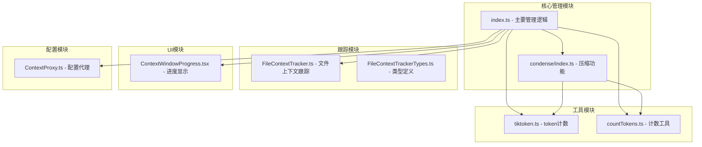
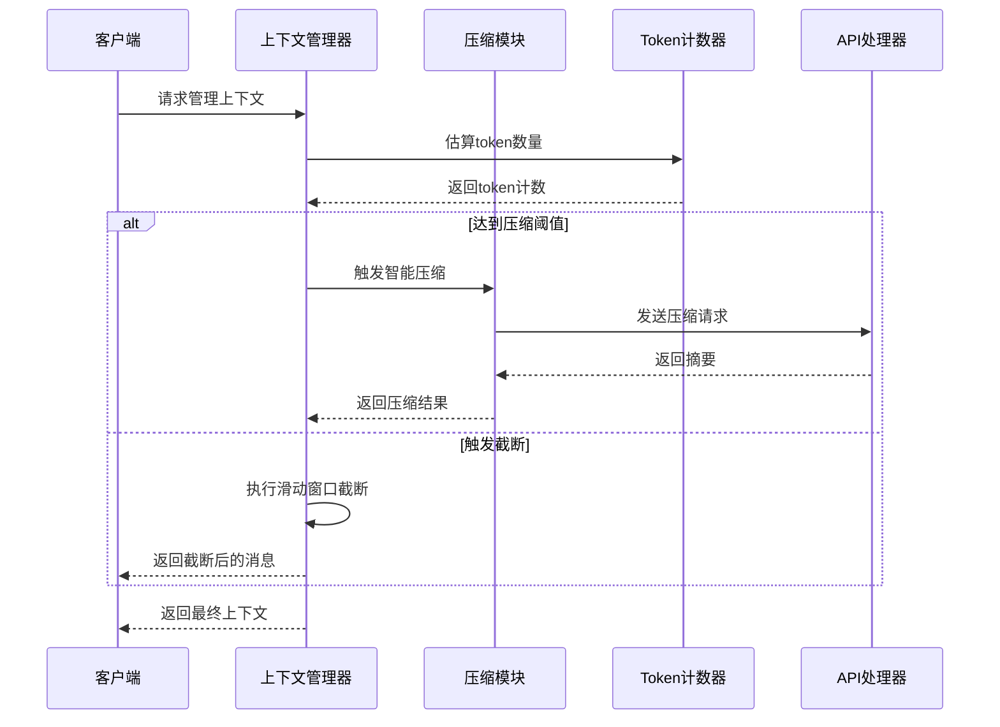
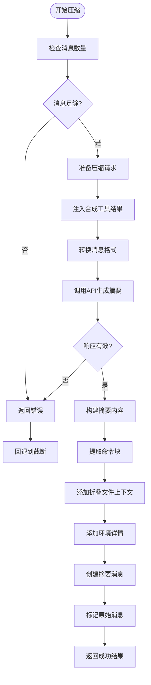
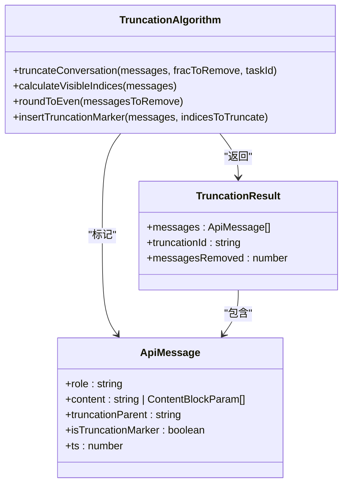
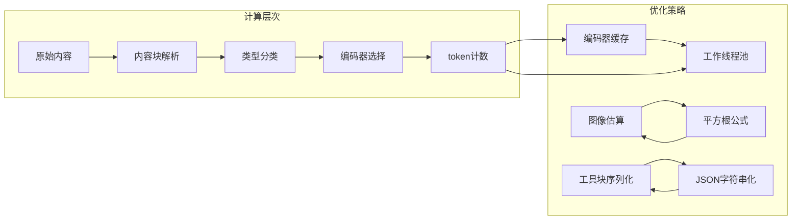

# 上下文窗口管理

<cite>
**本文档引用的文件**
- [src/core/context-management/index.ts](file://src/core/context-management/index.ts)
- [src/core/condense/index.ts](file://src/core/condense/index.ts)
- [src/utils/tiktoken.ts](file://src/utils/tiktoken.ts)
- [src/utils/countTokens.ts](file://src/utils/countTokens.ts)
- [src/core/context-tracking/FileContextTracker.ts](file://src/core/context-tracking/FileContextTracker.ts)
- [src/core/context-tracking/FileContextTrackerTypes.ts](file://src/core/context-tracking/FileContextTrackerTypes.ts)
- [src/core/context-management/__tests__/context-management.spec.ts](file://src/core/context-management/__tests__/context-management.spec.ts)
- [src/core/context-management/__tests__/truncation.spec.ts](file://src/core/context-management/__tests__/truncation.spec.ts)
- [webview-ui/src/components/chat/ContextWindowProgress.tsx](file://webview-ui/src/components/chat/ContextWindowProgress.tsx)
- [src/core/config/ContextProxy.ts](file://src/core/config/ContextProxy.ts)
</cite>

## 目录
1. [简介](#简介)
2. [项目结构](#项目结构)
3. [核心组件](#核心组件)
4. [架构概览](#架构概览)
5. [详细组件分析](#详细组件分析)
6. [依赖关系分析](#依赖关系分析)
7. [性能考虑](#性能考虑)
8. [故障排除指南](#故障排除指南)
9. [结论](#结论)

## 简介

上下文窗口管理系统是Njust-AI项目中的关键组件，负责管理和优化大语言模型对话中的上下文长度限制。该系统实现了智能的上下文长度控制机制，包括最大字符数控制、token计算、动态调整策略等功能。

系统采用双重保护策略：当接近上下文窗口限制时，优先尝试智能压缩（condensation），如果压缩失败或不可用，则回退到滑动窗口截断（sliding window truncation）。这种设计确保了在保持对话连贯性的同时，有效控制token使用量。

## 项目结构

上下文窗口管理系统主要分布在以下目录中：



**图表来源**
- [src/core/context-management/index.ts:1-377](file://src/core/context-management/index.ts#L1-L377)
- [src/core/condense/index.ts:1-702](file://src/core/condense/index.ts#L1-L702)

**章节来源**
- [src/core/context-management/index.ts:1-377](file://src/core/context-management/index.ts#L1-L377)
- [src/core/condense/index.ts:1-702](file://src/core/condense/index.ts#L1-L702)

## 核心组件

### 上下文管理器 (Context Manager)

上下文管理器是系统的核心组件，负责协调整个上下文窗口管理流程。它提供了三个主要功能：

1. **智能压缩** - 当达到预设阈值时，通过LLM调用生成对话摘要
2. **滑动窗口截断** - 当压缩不可用时，非破坏性地隐藏早期消息
3. **阈值判断** - 基于当前token使用情况决定何时触发管理操作

### Token计数器 (Token Counter)

系统实现了多层次的token计数机制：

- **tiktoken实现** - 使用tiktoken库进行精确的token计算
- **工作线程池** - 通过workerpool提升大量token计算的性能
- **图像内容处理** - 基于图像数据大小估算token数量

### 文件上下文跟踪器 (File Context Tracker)

跟踪用户对文件的操作，防止因外部修改导致的过期上下文问题：

- **文件监视** - 实时监控文件修改事件
- **状态管理** - 跟踪文件的活跃、陈旧状态
- **元数据持久化** - 将文件操作历史存储到任务元数据中

**章节来源**
- [src/core/context-management/index.ts:22-377](file://src/core/context-management/index.ts#L22-L377)
- [src/utils/tiktoken.ts:1-107](file://src/utils/tiktoken.ts#L1-L107)
- [src/utils/countTokens.ts:1-45](file://src/utils/countTokens.ts#L1-L45)
- [src/core/context-tracking/FileContextTracker.ts:1-281](file://src/core/context-tracking/FileContextTracker.ts#L1-L281)

## 架构概览

系统采用分层架构设计，确保各组件职责清晰且松耦合：



**图表来源**
- [src/core/context-management/index.ts:247-377](file://src/core/context-management/index.ts#L247-L377)
- [src/core/condense/index.ts:256-510](file://src/core/condense/index.ts#L256-L510)

系统的关键特性包括：

1. **双重保护机制** - 压缩优先，截断回退
2. **非破坏性操作** - 通过标记而非删除消息
3. **智能阈值管理** - 支持全局和配置文件级别的阈值设置
4. **性能优化** - 工作线程池和编码器缓存

## 详细组件分析

### 智能压缩算法

智能压缩算法是系统的核心创新，实现了真正的"新鲜开始"模型：



**图表来源**
- [src/core/condense/index.ts:256-510](file://src/core/condense/index.ts#L256-L510)

压缩算法的关键特点：

1. **新鲜开始模型** - 摘要作为用户消息，提供真正的上下文重置
2. **命令块保留** - 通过`<command>`标签保持活动工作流
3. **文件上下文折叠** - 使用tree-sitter技术智能折叠代码定义
4. **非破坏性压缩** - 通过`condenseParent`标记而非删除消息

**章节来源**
- [src/core/condense/index.ts:214-510](file://src/core/condense/index.ts#L214-L510)

### 滑动窗口截断算法

滑动窗口截断算法实现了智能的消息隐藏机制：



**图表来源**
- [src/core/context-management/index.ts:46-135](file://src/core/context-management/index.ts#L46-L135)

截断算法的核心机制：

1. **可见消息过滤** - 排除已截断和标记消息
2. **偶数规则** - 确保截断数量为偶数，便于恢复
3. **边界检测** - 准确识别截断边界位置
4. **标记插入** - 在截断边界插入特殊标记

**章节来源**
- [src/core/context-management/index.ts:67-135](file://src/core/context-management/index.ts#L67-L135)

### Token计算系统

系统实现了多层次的token计算优化：



**图表来源**
- [src/utils/tiktoken.ts:55-107](file://src/utils/tiktoken.ts#L55-L107)
- [src/utils/countTokens.ts:13-45](file://src/utils/countTokens.ts#L13-L45)

Token计算系统的优化特性：

1. **编码器缓存** - 避免重复创建tiktoken实例
2. **工作线程池** - 异步处理大量token计算
3. **图像估算** - 基于数据大小的快速估算
4. **工具块处理** - 序列化复杂的数据结构

**章节来源**
- [src/utils/tiktoken.ts:1-107](file://src/utils/tiktoken.ts#L1-L107)
- [src/utils/countTokens.ts:1-45](file://src/utils/countTokens.ts#L1-L45)

### 阈值管理机制

系统支持灵活的阈值管理策略：

| 阈值类型 | 默认值 | 有效范围 | 特殊值 |
|---------|--------|----------|--------|
| 全局阈值 | 50% | 5-100% | -1（继承全局） |
| 最小阈值 | 5% | 5-100% | -1（无效） |
| 最大阈值 | 100% | 5-100% | -1（无效） |

阈值计算公式：
```
allowedTokens = contextWindow × (1 - TOKEN_BUFFER_PERCENTAGE) - reservedTokens
contextPercent = (prevContextTokens / contextWindow) × 100%
```

**章节来源**
- [src/core/context-management/index.ts:141-197](file://src/core/context-management/index.ts#L141-L197)

## 依赖关系分析

系统各组件之间的依赖关系如下：

```mermaid
graph TB
subgraph "外部依赖"
A[@anthropic-ai/sdk]
B[workerpool]
C[tiktoken]
D[zod]
end
subgraph "内部模块"
E[context-management]
F[condense]
G[utils]
H[context-tracking]
I[config]
end
subgraph "UI组件"
J[ContextWindowProgress]
end
E --> F
E --> G
E --> H
E --> I
F --> G
F --> H
G --> C
G --> B
H --> D
I --> D
J --> E
```

**图表来源**
- [src/core/context-management/index.ts:1-11](file://src/core/context-management/index.ts#L1-L11)
- [src/core/condense/index.ts:1-13](file://src/core/condense/index.ts#L1-L13)

**章节来源**
- [src/core/context-management/index.ts:1-11](file://src/core/context-management/index.ts#L1-L11)
- [src/core/condense/index.ts:1-13](file://src/core/condense/index.ts#L1-L13)

## 性能考虑

### 内存管理优化

1. **弱引用模式** - 使用WeakRef避免内存泄漏
2. **增量处理** - 分批处理大量消息，避免内存峰值
3. **缓存策略** - 编码器和token计数结果的智能缓存

### 并发处理

1. **工作线程池** - 通过workerpool异步处理token计算
2. **流式处理** - API响应的流式处理减少内存占用
3. **异步操作** - 所有I/O操作都采用异步模式

### 缓存机制

1. **编码器缓存** - tiktoken实例的长期缓存
2. **结果缓存** - token计数结果的短期缓存
3. **配置缓存** - 用户配置的内存缓存

## 故障排除指南

### 常见问题及解决方案

| 问题类型 | 症状 | 可能原因 | 解决方案 |
|---------|------|----------|----------|
| 压缩失败 | 返回错误信息 | API调用失败 | 检查网络连接，重试操作 |
| 截断不生效 | 消息未被隐藏 | 标记字段缺失 | 验证truncationParent设置 |
| token计算错误 | 计数异常 | 编码器问题 | 重启工作线程池 |
| 阈值判断错误 | 频繁触发管理 | 配置不当 | 检查阈值设置和缓冲区百分比 |

### 调试工具

1. **日志记录** - 详细的执行日志和错误信息
2. **遥测服务** - 性能指标和使用统计
3. **单元测试** - 完整的功能测试覆盖

**章节来源**
- [src/core/context-management/__tests__/context-management.spec.ts:1-800](file://src/core/context-management/__tests__/context-management.spec.ts#L1-L800)
- [src/core/context-management/__tests__/truncation.spec.ts:1-438](file://src/core/context-management/__tests__/truncation.spec.ts#L1-L438)

## 结论

上下文窗口管理系统通过智能压缩和滑动窗口截断的双重机制，有效解决了大语言模型对话中的上下文长度限制问题。系统的设计充分考虑了用户体验、性能优化和可靠性保障。

关键优势包括：

1. **智能决策** - 基于阈值和token使用情况的智能决策
2. **非破坏性操作** - 通过标记而非删除确保消息可恢复
3. **性能优化** - 多层次的性能优化策略
4. **扩展性** - 模块化设计支持功能扩展

该系统为大型对话应用提供了可靠的上下文管理解决方案，能够在保持对话连贯性的同时有效控制资源使用。